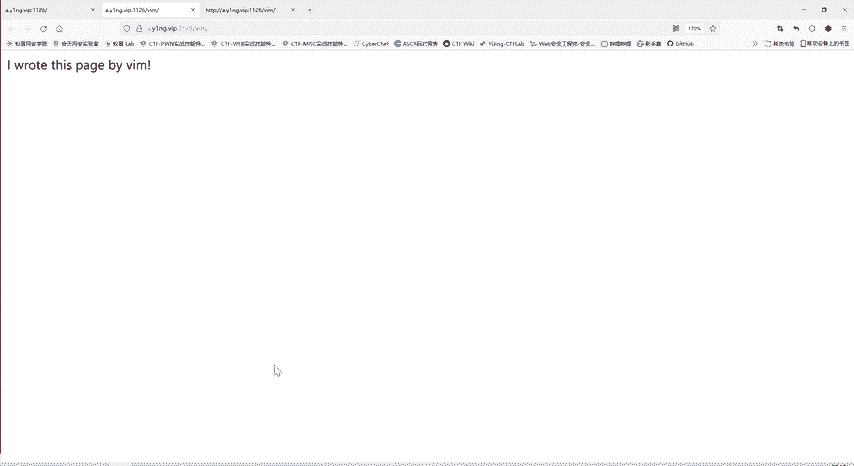
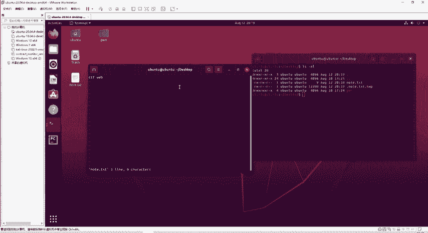
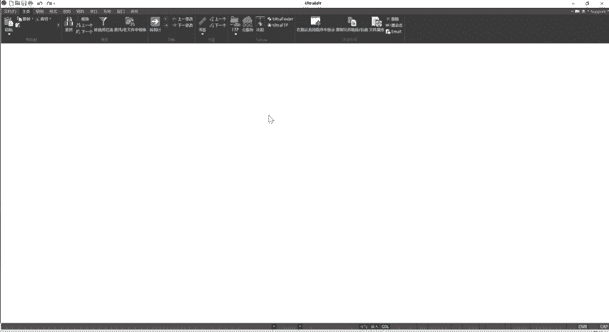
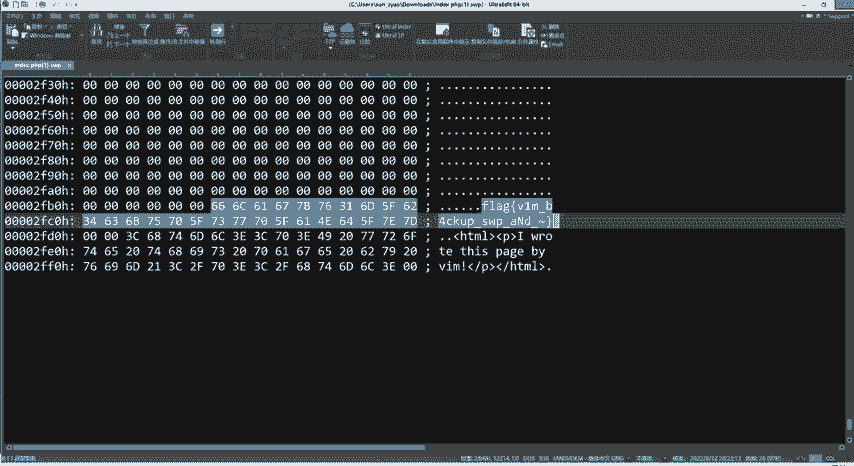
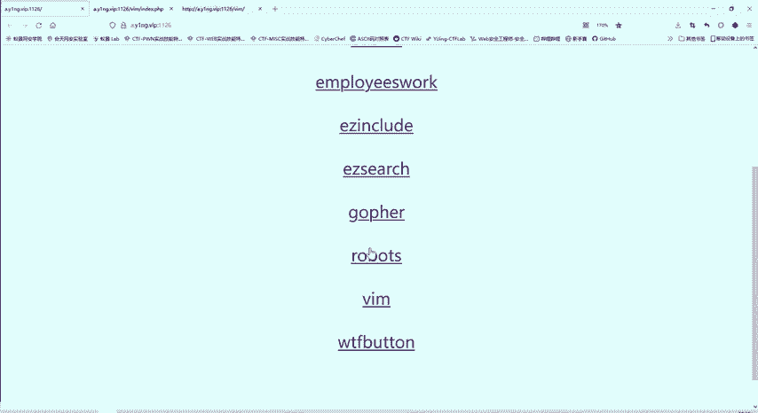

# CTF教程：CTF初学者必备的1000个练习题，每日一练，百日成神！（ctf-wbe／ctf-pwn／ctf-misn／ctf-逆向） - P50：VIM隐藏flag - 白帽子讲安全 - BV1dp4y1j7aN

那我们看第三题。我们先把啊前两个题关掉。第三题，他说。I wrote this page by VIM。那么我是用VIM来写这个文档的。这个跟我们有什么关系呢？我们要找flag。

我们不关心他用什么写这个文档。那这里是看不出内容。那么我们看一下U2L。他也是提到VIM，说明这个题应该是跟VIM相关。那么我们再看一下网页的源代码。🎼这边还没有进度调说明，网页只有这么多内容。

那不放心的话，还是可以搜下，那确实找不到flag。那我们现在。哎，就只能知道这个题呢是跟这个VIM相关的。目前只能知道这么多，那怎么从这个VM相关得到flag呢？

这里我们要打开一个我们一个虚拟机，比如说这是个无斑图的虚拟机。无弯头迅接，我们可以打开终端。这个VI或者是VIM，它是无版linux里面一个编写文档的一个工具。比如说我现在。列举下当前文件夹下。

我桌面上所有的文件啊，只有碰这一个文件夹。那么我现在。我想。嗯，记个笔记note点TXT。就使用VI或者VIMMVI和VIM他们基本上用法都是差不多的。😊，这个时候呢？程序就会帮我创建这个。

note点TXT这个文档，然后我在里面可以编写内容，输入I就可以编写内容。CTFY。是不是？然后按EXC那就退出这种编辑。模式，然后按冒号。看这里出现了冒号，然后WQ就是保存退出。大家可以看到呢。

那我桌面上现在就多了note点点HT这个文件我可以查看一下这个文件的内容。😊，啊，就是我们刚才写的CTF web。😊，那么这个VI和VIM这编辑器有什么特点呢？我们再次打开这个note。点TXT。

然后我们再打开一个终端。这边是我们编辑这个note点TXT使用VI来进行一个结果。我们再看当前文件下有哪些文件。大家注意到没有？现在是不是多了一个文件，点note点THT点SWP。那我把这个退出了。

退出来之后，我再在这面看我。桌面下有哪些文件？哎，就只有note点TFT和就原来的怕。那么点note点TFT点SWP就不存在了。那么这个文件呢实际上啊是1个VI或者VIM编辑器。

它所使用的一个备份文件就是。你使用这个VI编辑器的时候。他就自动创建一个点。你点开头就带丽娜亚，是一个隐藏文件。隐藏文件，你不使用杠A参数了，就看不着。你使用杠A参数呢就会显示出来。一个隐藏文件。

再加上你原来的文件名，再加上点SWP。那么我们这时候也可以啊这。我们可以啊正常的一个编辑。那么我们随便输入那。随便输入一些内容。是不是如果这个时候呢，我不按刚才那样的保WQ保存退出。我直接。啊。

由于这个系统突然关机了。突然断电了，或者是直接把这个窗口插掉。这个时候我们再来看一下当前文件夹存在哪些文件呢？这个小。那刚才我们直接退出了。就不存在这个。这个文件就自动消失了，点SWOP文件，是不是？

那现在异常退出了，这个点SWP文件就会保存，它会用来恢复你这个note点TST。这是我们VI和VIM编辑器的一个重要特点。这也是我们本题的一个考察点。

那么这个题是用VIM写的那说明也存也可能存在我们刚才说的那个特点可能异常退出。那么异常退出，他就会。那么我们就会得到一个这样的文件，是不是？啊，f name原来的文件名。然后点SWP文件。

那么我们现在就要知道原来的文件名是什么，是不是？那我们这里访问的是哪个文件？是VIM文件夹下的某一个文件，它进行了一个审阅。那是什么呢？我们可以使用这样一个插件WAPPAALYZR。

这就跟我们装黑插件一样，在扩架里面进行搜索。这个条件告诉我们这个网站这个服务器使用的编程语言呢是PHP。那么他。这个缺审的文件就是。默认就是index点PHP。我们可以访问ind点PP看一下。

可以看到跟原来是同样内容。实际上我们原来访问的就是indext点PHP，只是它不是这么显示的。出现。他是有默认。那么他有这个文件，那就如果说存在异常退出的话，那就有个点ind点PHP再点SWP应。

就可能存在这样一个文件，我们访问试一试。哎，果然是存在这样一个文件，那现在就帮我们进行了一个下载。那我们从我们下载里面呢，就看到这个文件使用UE进行打开。

这就是index点PHP。异常退出时保存的一个内容。那么这个内容比较多。哎，我们在最后呢就看到了flag什么信息。就通过他VI或者VIM编辑器。异常退出是自动保存的文件。来获取到的flag。

这个钱啊，大家理解的吗？啊，理解的同学扣个一啊，没理解的扣个2。好的啊，大家理解了就好。所以我们。每道题就是要给大家讲清楚。是怎么做的，怎么来的，这样大家才能真正理解。😊。

这个网页插件呢就是专门分析我的这个网站的架构信息的。比如使用了什么编程语言啊，用户界面的框架。你访问别的网站，它都会自动的进行一个分析。那比如说就看一下我们和天网实验室。它会自动进行一个分析啊。

你点击它就知道了。他使用了一些啊系统一些服务。编程语言像我们核电完身时呢，是用java编的java编写的。刚才这个题呢是PHP的一个环节。使用这个插件自动去进行分析的。那么就不用我们自己去再去寻找。

那么这是。啊，我们第三个题，那我们看一下第四个题。

