# CTF教程：CTF初学者必备的1000个练习题，每日一练，百日成神！（ctf-wbe／ctf-pwn／ctf-misn／ctf-逆向） - P51：wtfbutton - 白帽子讲安全 - BV1dp4y1j7aN

WTFbut。那么现在是这个题目告诉我们呢，要点击它来获取flag。点击我。哎，这好像是不能点击的，你看把这一块。点击完了都没有。没有变化，那到底是要我们点击哪里呢？啊，那这你。

这个题暂时暂时这点击不出来东西。这个URL当中呢，也就是个WTFbutton。WTF呢啊也不是很清楚什么意思。😊，可能是一个什么缩写。butter呢就是一个按钮嘛。那么这个时候呢啊按默认的做法。

我们可以看一下还原代码。有没有我们需要的信息？先搜索一遍flag，因为flag是我们最终关心的那找到了两项，一项是点击它获取flag。呃，第二项是valueue等于fl。那这个flag的值还没还不知道。

那这个时候呢我们就要看一下我们源代码的内容，这是哎头部信息。这个一些格式的信息我们。不用管。那这里面哎有一个链接，那会不会说flag它不是在这个网页里面，它在这个网页链接里面呢啊，这也是有可能的。😊。

现在我们不知道这个题目解法的时候，我们可以访问一下这个链接。😊，大家看看这个链接。哎，向右边可以延唱，有非常多的内容。那么这时候我们人眼看呢，那肯很可能会遗遗漏掉什么内容，是不是同样的方法。

我们在这里面啊进行一个搜索。哎，找到有一项flag。那我就就看这一项。这一项大家看啊，这不符合我们flag的一个格式，是不是？那说明哎这个链接里面那不存在flag信息。那我们还是回到这个题目。

回到它的源代码当中。那不在这个链接里面。我下面看看这个波底，就是HTM这网页的主体的部分。这个里面是什么呢？啊，这H3是3级标题。😊，这个标题没有什么。这下面呢是一个提交的表象。

actionme是postpost就是用post的方法提交数据。我们昨天是不是也给大家演示过做题的时候，有get方法提交数数据，有pos的方法提交数据。因为他这里用的是pos的方法。😊。

要input啊diablediable就是使失效。诶。它这个类型是嗯提交那个值呢valueue值是flag。明确。沃他是说变量米。是was变量值是flag，然后用po的方法进行提交。

但是他现在这里设置成diable的。所以说我们这个按钮啊怎么点就没用啊，原来是它设置diable的。这个时候我们怎么解决这个问题呢？我们同样点击右键。可以进入这个解，就有个检查选项，我们点击检查。

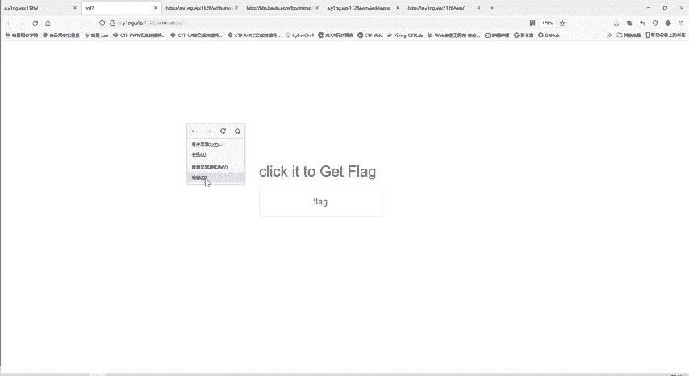

有个查看器就可以修改网页的元素。你看这里面。

是不是也是这个网页的呃这个内容？这个内容呢好像啊。

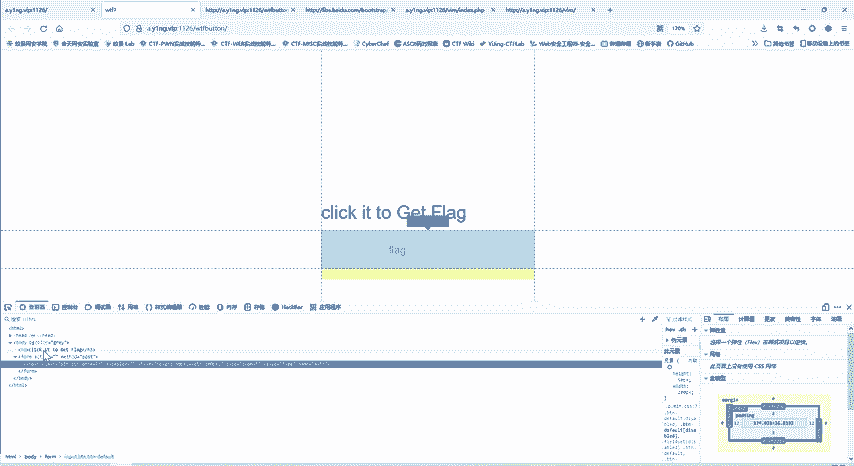

跟刚才我们的网页源代码很相似，但是它又不完全一样。这个区别是什么呢？就网页源代码是我们向服务器发送请求，服务器给我们的响应响应的内容就是这么多。😊。

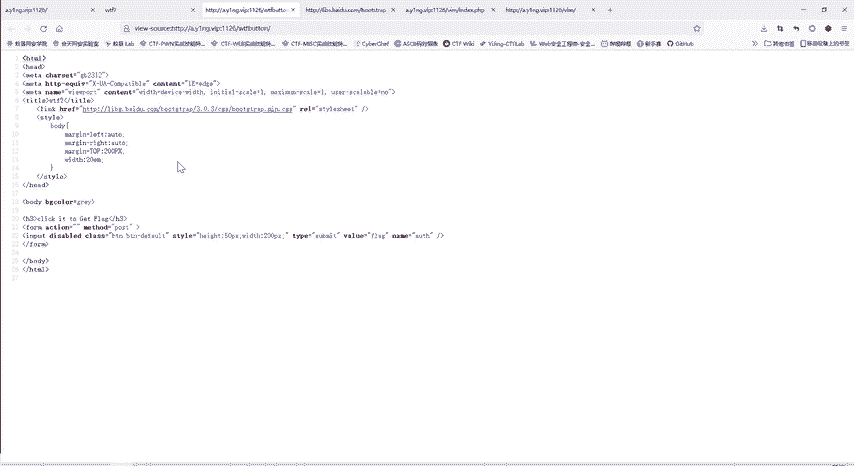

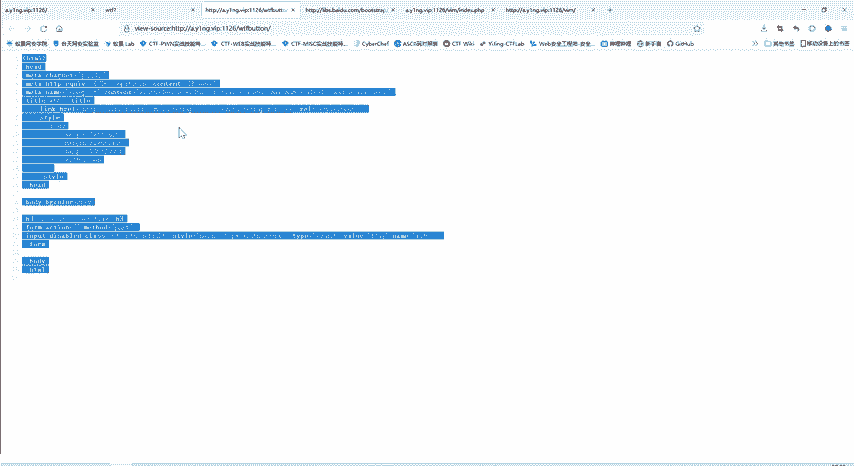

那响应的内容啊，我们浏览器接受到响应了之后，浏览器它也是要干活，它也发挥它的作用。它不是说你服务端给我响应什么，我就把这个内容显示出来，那这样就不好看。😊。

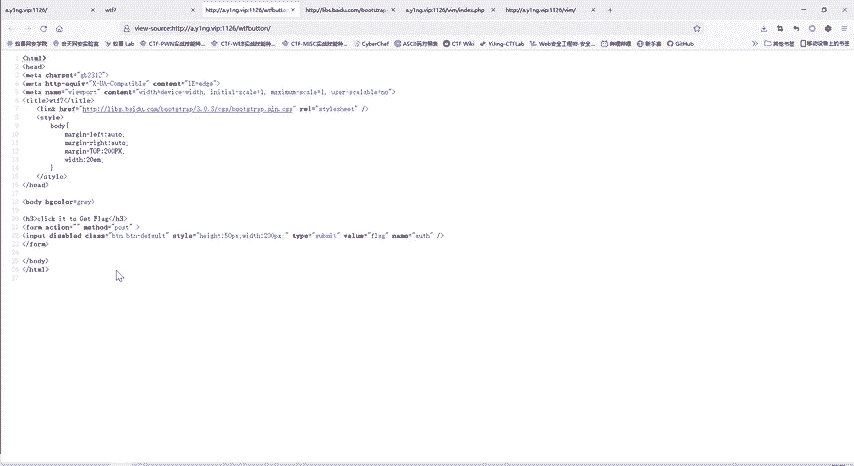

也很难懂。对于普通用户来说。所以这个检查器这元素呢就是浏览器经过渲染之后，那最终呢呈现的界面呢就是这样子。

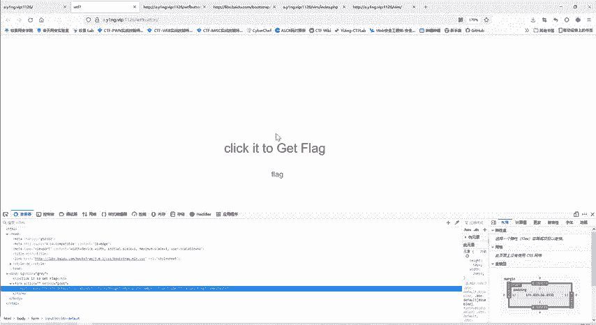

像我们刚才给大家看的我们的核天丸实验室这些。😊。

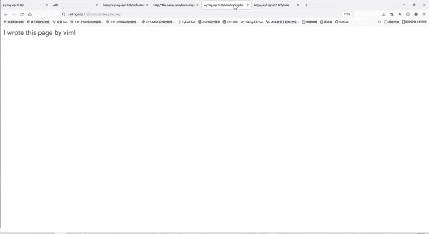

啊，这个有图像，有画面，这些都是经过浏览器处理的那它的原网页源代码呢，你看如果说直接给大家看这源代码，大家就很晕了。😊。

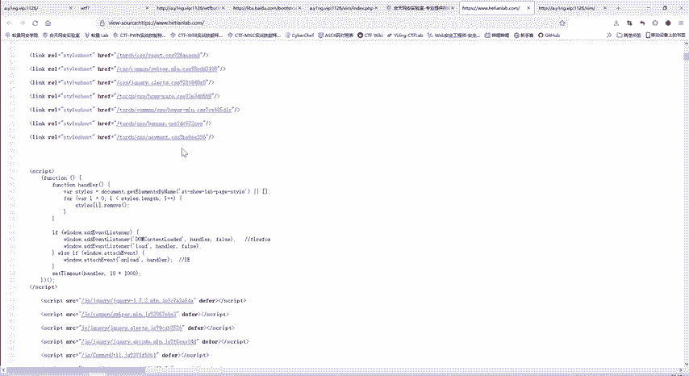

所以说要经过浏览器的渲染，那成这样一个比较好看的形式展示给大家。

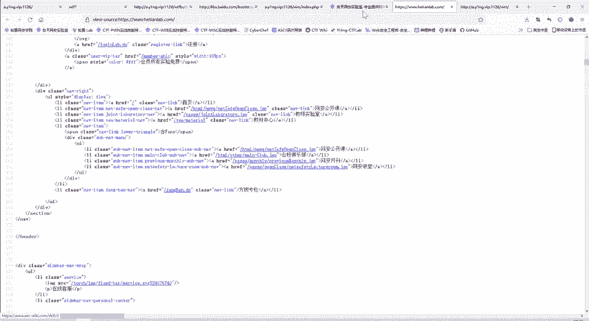

这你也是同样道理。那下面的元素呢，就是经过渲染的一个结果啊。那么这里我们可以点击这个箭头。然后再点。点击。我们想要查看的地方，这个元素呢就定位到相应的位置了。

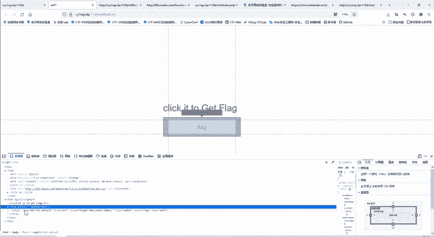

那这里呢大家注意到有个diable，那么我就。可以把它删掉。删掉，你看现在这里是不是有变化了，那这个按钮呢相当于原来是被禁用了，现在呢又重新可以使用了。那我们他居然叫我点击它，那我就点击一下试试。哎。

一点击呢就出现了我们的flag信息了。😊。

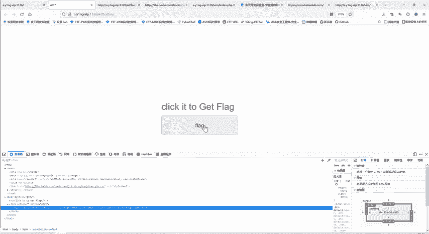

这道题呢就是这么简单。😊，是不是？只要大家理解了就还是很简单的。当然没理解之前刚开始哎怎么做都没用，点击哪儿都没效，然后再往源代码里面呢又找不到flag，找不到任何信息。😊，这个题呢就是大家修改元素。

来进行一个点击。

当然，除了这种方法呢，我们再看一下。他这里是叫我们用pos方法提交一个。变量名是ws，变量值是flag的数据。

那么除了这种点击以外，还有没有别的方法可以提交呢？其实我们自己也可以po的数据。

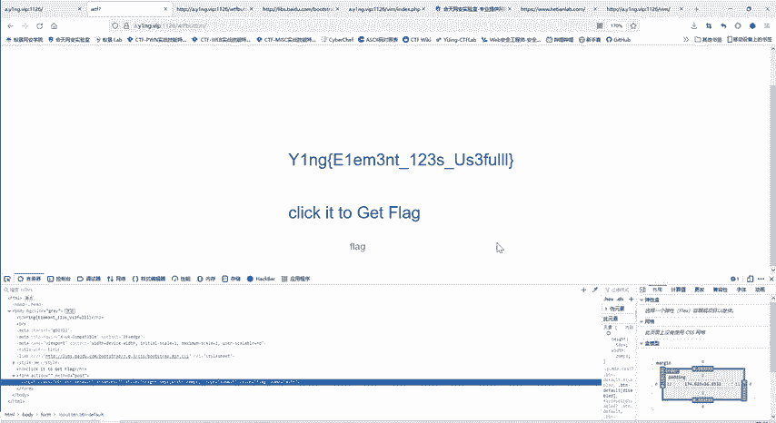

他这个点击一下，就是实现这样传递数据的一个效果。

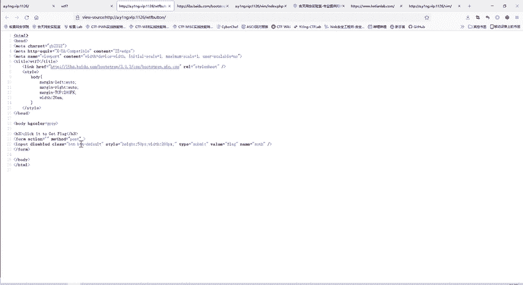

那我们可以啊重新打开这道题。

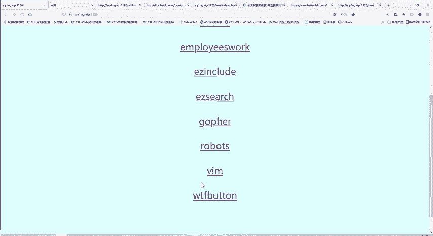

点击不了，那我自己提交数据。

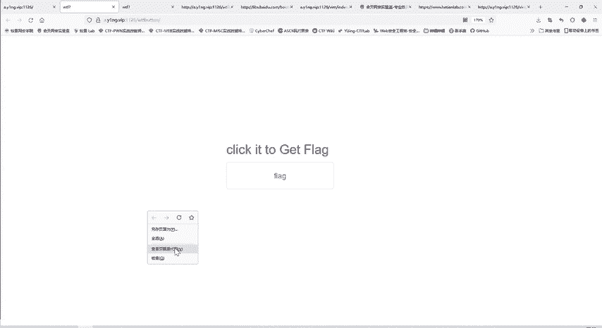

在检查里面用到我们昨天。我们前天给大家介绍昨天也用过的这个黑板这个插件。

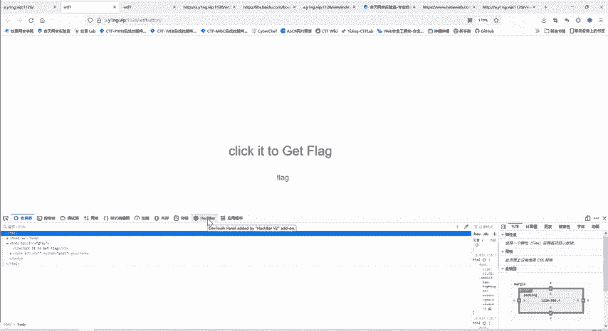

这个插件呢跟我们这个插件是一样，都是在扩展里面搜索，然后安装。

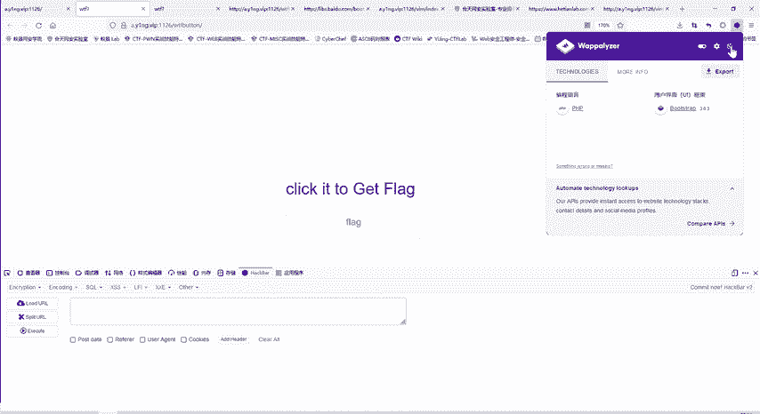

怎么使用呢？我们先先nUL，把这个URL直接。加载进来大家就不用点击这样啊，这样先复制再粘贴，这就显得很不专业了。我们直接n12L就把这个ULL加载进来了。😊。

那么现在这个题况是要用pos的方式提交数据。啊，我们这个浏览器呢就是火狐浏览器。那我们这个插件呢就是在我们这个扩展和主题里面进行一个搜索，然后安装。我们这里点击post data。

然后在这里面呢就是我们pos的数据，数据是什么变量名是was，变量值呢是flag。那我们再看一下是不是这样。

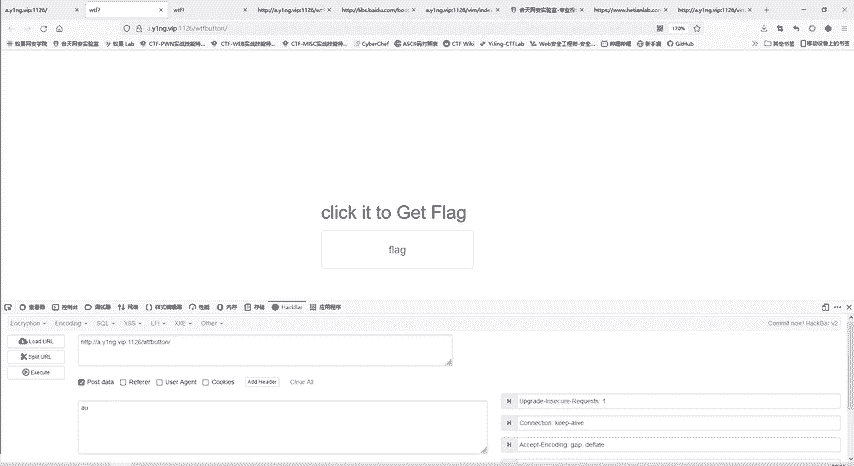

是不是name是oss，ve是flag。

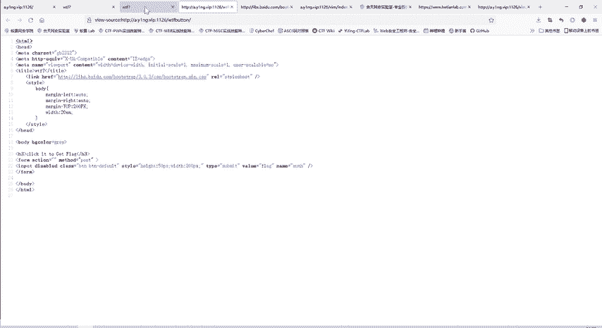

这时候呢我们点击个执行，它就会将我们的这个数据。post到这个目标当中去。哎，这样一发送过去之后呢，同样也可以看到flag信息。啊，这样跟我们刚才点击是同样的一个效果。

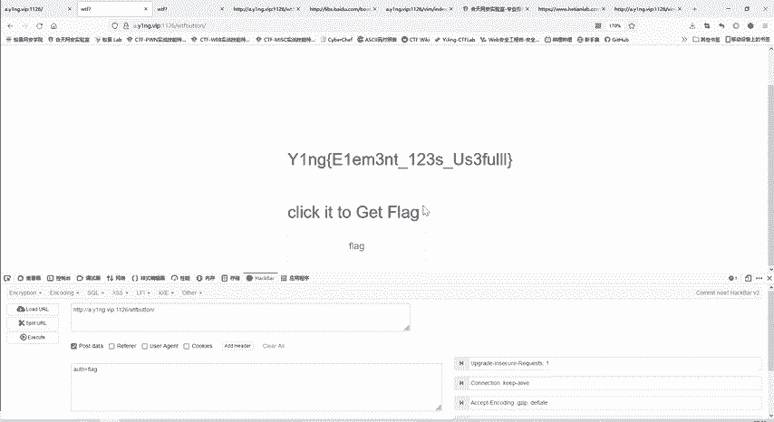