# CTF教程：CTF初学者必备的1000个练习题，每日一练，百日成神！（ctf-wbe／ctf-pwn／ctf-misn／ctf-逆向） - P52：kali软件安装+环境搭建 - 白帽子讲安全 - BV1dp4y1j7aN

然后的话在我们去进行一个看里的一个安装之前的话，呃，大概给大家讲解一下，就是介绍一下什么是can里，就看lylin的话，它是一个基于低变的一个linux发行版本。

就是说我们去使呃经常会去使用到这样的一个cannel。因为它的一个最大的一个呃优势，以及它的一个特点的话，就是呃它包含有数百种呃wordb安全以及渗透测试相关的一些工具。

我们可以直接在这样的一个linux系统里面去进行一些工具的一个使用以及操作。而且他是他的一个目的就是呃用于高级的一个渗透测试以及安全审核。就说我们。而且的话它是一个完全免费的一个inux系统。

而且它也支持支持中文。就说我们呃。经常会去使用到这样子的一个系统。Yes。这样的话。详细的一个工具列表是在这个网址呃。发出来。它包括有600多个渗透测试工具，我们可以大概来看一下。

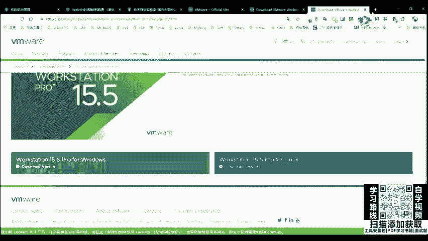

一。Oh。Yes。呃，我这里网速稍微有点慢了。

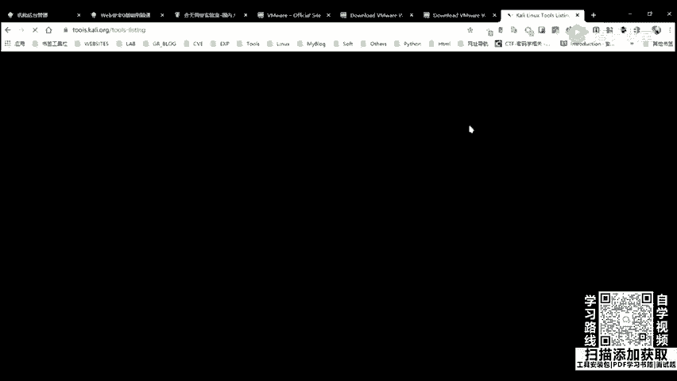

嗯。Yes。嗯。然后这里的话是一个开历，它的一个工具列表里面的话有它所包含的一些工具，以及它的呃一些详细的一个介绍以及用法。大家可以去啊看一下啊，因为里面的话工具相当的多。

然后的话我们在介绍完什么是看理之后的话，我们一起来了解一下。看你的一个安装。首先的话我们需要安装我哦不首先的话我们需要下载它的一个看你临系统。他的一个。网址是这一个。我们直接。搜索一个can里。

然后第一个就是这个网址。点开。点开之后的话，我们可以看到这里有这这这么一些呃可供你下载的一个版本。哦呃就是新版本的话，他这里给的这些新版本的话，它不像之前有那么多的一个呃版本了。因为新版本的话。

它取消了，就是说他没有对特定的一些桌面。比如说什么啊，还有，还有KDE等等的这样的一些桌面系统。它专门做一个这种的一个镜像供你下载，它已经取消了，就是说他这里只给了这样的呃。

比如说这种第一个这一个canning664位的一个安装版本。然后32位的，还有的话就是实时运行的一个版本。就实时运行的话，就是说我们可以把它放到一个呃U盘里面。

然后我们可以直接通过一个U盘来运行这样的一个看理系统。以及还有一个net install store。net install store的话就是通呃就是在线安装的一个版本。

所以说这里的一个呃它的一个大小的话是最小的。因为呃很多的一些工具的话，它是直接通过这一个软件在线下载安装到你本地。而，这里的话是已经有集成了这样的呃很多的一些工具以及一些呃。

工具的一些资源都在这一个镜限里面。所以的话它呃稍微会大一点。Yeah。😊，然后下面的话就是有提供啊。一个vim well版本的一个看。然后在我发给大家的这一个呃要说这一个百度网盘的话。

有包含这样子的一个。

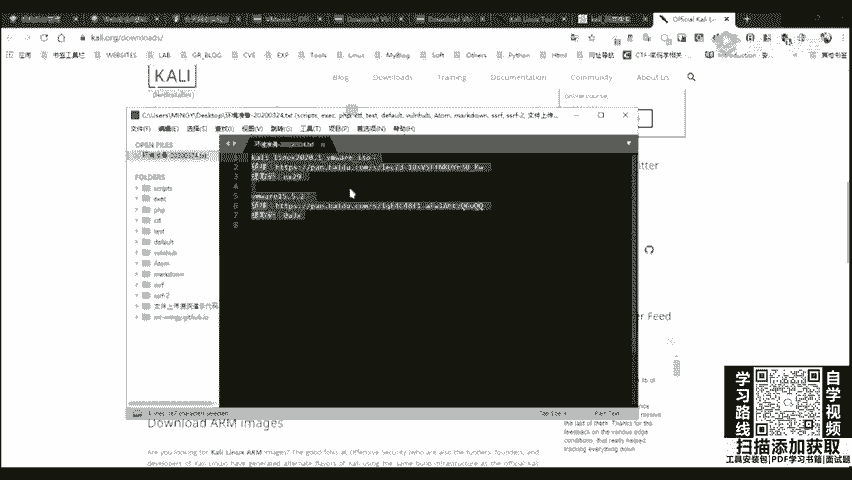

嗯。这样的一个压缩包，我已经下载好了，放在那个里那个里面，然后也有一个安装的1个ISO的一个镜像文件是64位的。大家有需要的话可以去呃下载我那个压缩包，也可以在这一个官网去进行一个下载。🤧Yeah。

这样的话官网的话可能输的话会稍微会慢一点。因为它里因为它是一个外国的一个软件。然的话还有支持这种watch books。的一个版本wach box它其它也跟vivo它是一个类似的一个虚拟化软件呃。呃。

就这一个。它的一个下载之后的话，它的一个格式的话是1个OBA的一个格式。尤其实。呃跟 mean well。呃，类似吧，当然的话他的他其实也有差别的。但常用的话就用避用报就足够了。🤧嗯。

然后下面他也有提供其他的一些版本。比如说在1个AM系统上面的一些镜像。以及呃还有就是每周都有更新的这样子的一个镜像，可以去进行一个下载。哦，我下载的话，我这的话就不下载了。因为呃。比较大了。

而且的话下载的话会比较慢。Yeah。

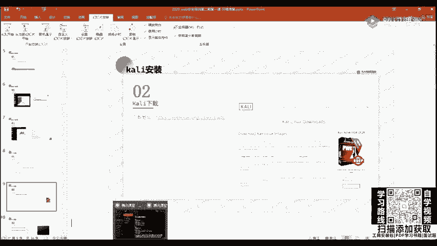

我这的话已经下载好了，在这一个。下载好了，在这里。うん。😊，就如果大家要呃自己去进行一个安装，就说用镜像去进行一个安装的话，就下载。就是下载这样子的一个镜像。然后如如果大家不想去麻烦，就嫌麻烦。

不想去进行一个一步一步的一个安装的话，可以下载这样子的一个win well的一个版本。就这这种的话，我们直接可以呃双击打开这一个。点闭MX结尾的。这样的一个文件。如果你安装了一个V呃Vvo的话。

双击之后的话会直接打开。

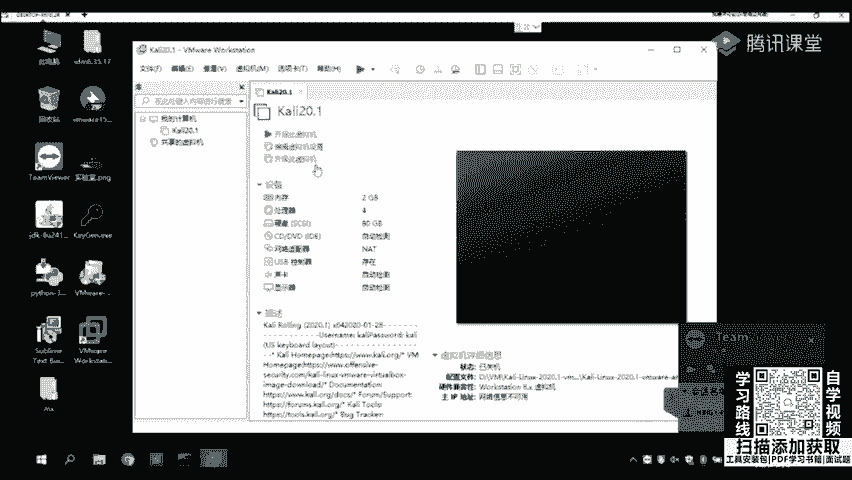

打个之后的话，可以直接在winvo里面开启。然后这里的话呃还要注意一点的话，就是呃新版本的2020版本的话，它是取消了一个默认的一个root用户。就之前的一个版本的话，它是呃之前的一个版本的话。

就是你安装之后的话，呃，使用登录的时候也是使用的一个root用户。当然，用root用户的话，它的一个方它是它的一个方便性是比不用root用户要方便的。就我们经常也就是使用的话。

也会去使用到一个root用户。当然使用root用户去进行一个登录的话，它是一个不安全的一个措施。所以的话在新版本的话，它有进行一个这样的取消，取消了用。root用户去进行一个登录。

这样的话给了一个默认的一个用户是car里，密码是car里。

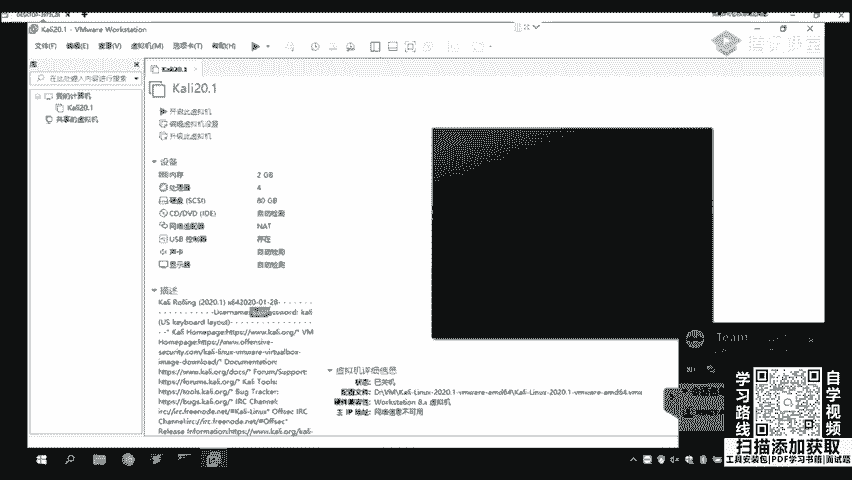

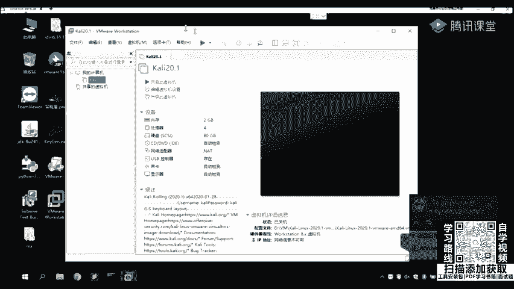

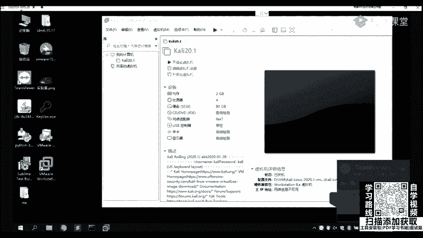

He。哦啊哦。安装步骤的话，我待会给大家演示，大家也可以看一下这两篇文章吧。就呃他们的话写的也很详细了。嗯。

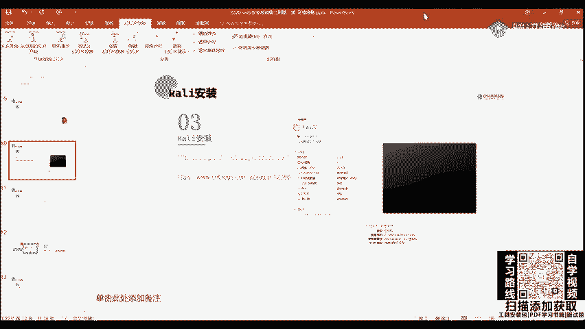

哦，呃，这样的话我先。

给大家就是讲一下，就是说呃直接用这样的一个win word版本。怎么去进行一个使用？就我们直接打开之后的话，我们直接开启就OK了。

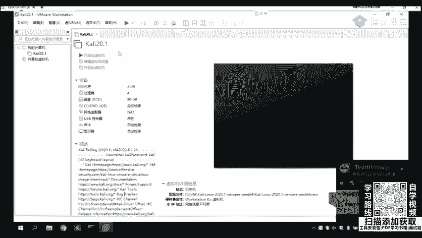

直接开开启这样的一个虚拟机。

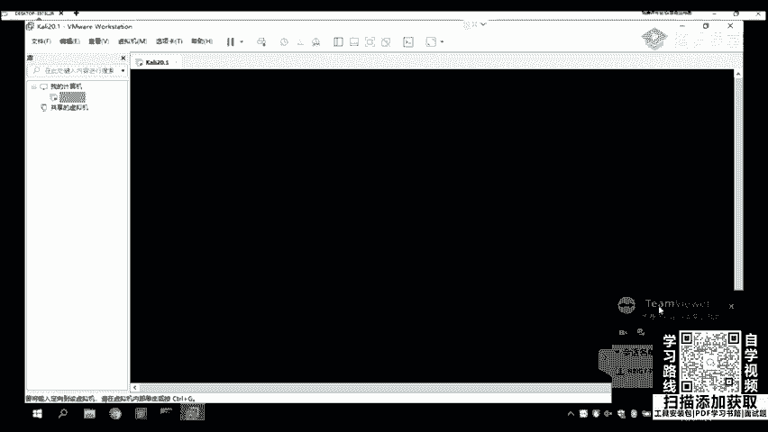

开始之后的话会到这样子的一个界面，我们选第一个。

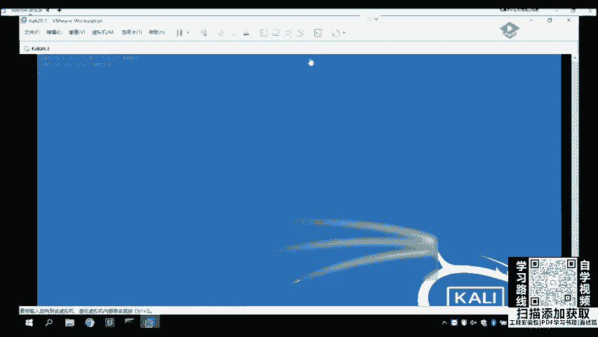

然后的话它会进行一个启动。She。启动的话可能需要稍微等待一会儿。

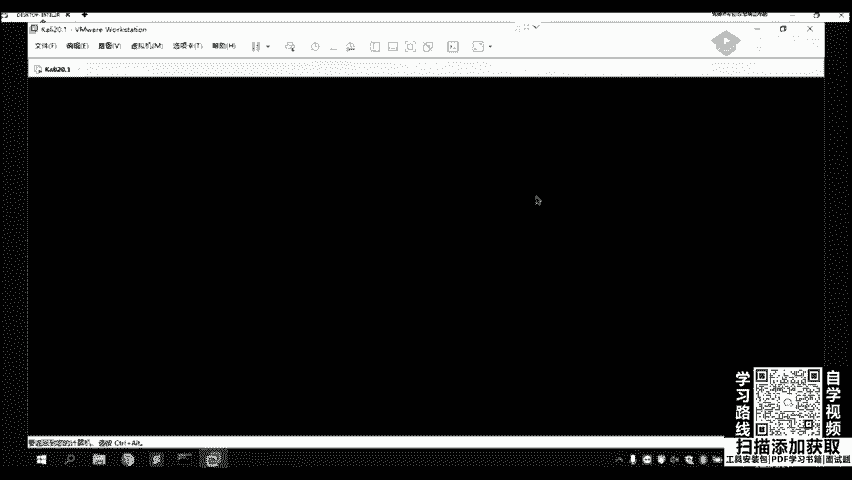

哦，这里的话已经启动完毕，启动完毕之后的话我们。需要去进行一个登录。我们首先的话可以试一下使用root用户去进行一个登录啊。因为之前版本的话，如果大家去有去有去使用到使用过这一个看点的话。

是可以直接用root用户去进行一个登录的。哦。这里这里我。改了密码，因为啊我之前的话已经是那个了，这的话是我就是本来的话默认的话，它是使用的一个。

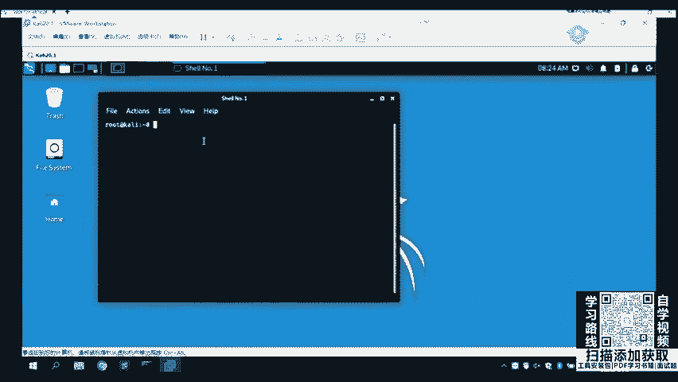

阿里用户。

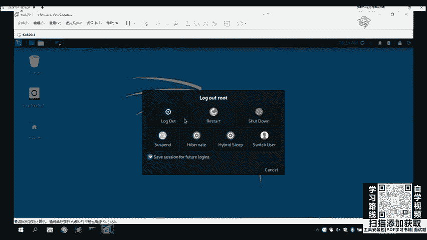

我这里先用他0火。Yeah。嗯。是用can里卡里这样的一个用户去进行一个登录的。然后呃如果大家有去进行一个操作的话，就说。你只能去使用到一个看你用户去进行一个登录啊，你用root用户登录的话会报错。

然后你登录进去进来之后的话，就是这样子。就是之前呃如果有接触过的话，就是像这样子的一个样子。Oh。大家注意的话呃，就可以看到，就如果说之前有使用到的话，如果是使用一个root用户去进去进行一个登录的话。

它就这样子的一个host。而是name它是会显示为红色的。而这里的话因为默认的话是使用了一个咖里，所以它这里显示的为红色。我们呃刚刚有看到就是我切切我去使用一个root用户去进行一个登录的话。

它这里的话是一个白色的，没有其他颜色的。然后我大家如果说有跟着我一起做的话，我们怎么去进行一个就是说使用一个漏ot用户去进去进行一个登录呢？因为我们使用一个开里用户。

就是说这种啊比较低权限的一个用户去进去进行一个操作的话，比如说安装一些软件什么的，都都比较繁琐。都要去打上一个收度去进行一个提群，对吧？所以说我们其实如果对这一个了解的话，我们直接可以使用一个漏水用户。

然，我们去进行一个root用户密码的一个更改，直接使用这样的一个so do啊。呃， so do。他2 thought。然后的话他这里会让你输入一个。看你的一个密码，也就是你当前用户看你的一个密码。

我们是出一个看你。打错了。password然后你直接输入收度paswordroot，然后它会让你输入一个新用新的一个密码。我这的话直接输入一个root就可以了。可以看到的话，这里的话已经修改成功。

我们可以。去登录一下乐ot用户，登录到的话就是这样子。🎼，Oh。然后的话呃我们进入了这样子的一个系统的话，我们大概来了解一下。

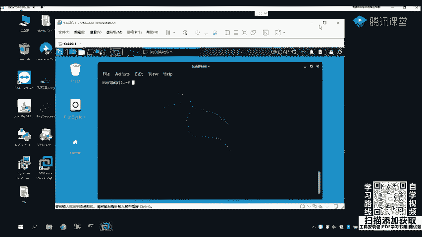

啊，这样的一个系统如何去进行一个使用吧。这样的话首先我们可以点右上角。左上角左上角的话，我们可以在这里有看到有这么多的一个。呃，集合这集合的话就是我们前面看到的啊它的一个工具。

它每一个工具它有做一个分类。比如说第一个的话是一个信息收集的一些工具。比如说DNS的一个分析啊，还有IDS的一个一些检测呀。以及呃存活主机的一个检测等等等等。

以及端口网络的一个扫描这样的一些信息收集的工具，它都分在这样子的一个类别下面。以及还有一些啊漏洞的一些分析的一些工具。它有做一个明确的一个分类。然后这里的话。诶。😊，这这一个的话就是呃。

跟我们的一个windows下面的一个返回桌面是类似的。啊，我们其实用的最多的也是啊这样子的一个终端吧。就我们如果呃对了，我忘了问了，问大家就是说大家。对lininux系统的一个操作熟悉吗？或者说了解吗？

挺熟的。都都了解是吧。还行。还好。啊，有4个人说都都还好是吧？都还好的话，那那那挺好的。不太了解吗？就说呃。大家都把自己的一个了解情况呃画一下吧。就说如果。

如果说就是各位对linux系统的一个操作不是很。了解的话呃，就是说后面的一个。可能讲课的话不是很方便，而且对于大家之后的一个就是说从事一个外表安全渗透测试方面的一个学习的话是不利的。

就希望大家去啊多去学习使用这样子的一个啊linux系统。然后我这里了解的话，大家对都对min史都挺熟的，是吧？挺熟的话，我就呃。不再去做过的那个讲解。如果大家大部分同学都不是很熟的话，呃。

可以考虑给大家开一个呃linux相关的一个课程吧。呃，有一位同学不太了解的话，呃，这位同学可以。呃，课后找我。做一个了解吧，就我可以推荐你一些呃学习的一些资源给大家去给你去进行一个学习。

系统语言系统语言的话，你可以改成中文的。但是呃其实。你用英文的用多了的话就熟了嘛，对吧？这些也都是比较常见的一些英文。🤧嗯。😊，中文输入法的话，你可以去呃，你可以直接安装一个安装一个那个呃叫什么来着？

有一个什么什么拼音来的，一个输入法，你去百度一下的话，都有的中文输入法的一个安装。Okay。进目录吗？进目录的话不是中不是英文的吗？你直接。CD敲敲英文不就可以了吗？Okay。🤧行吧。

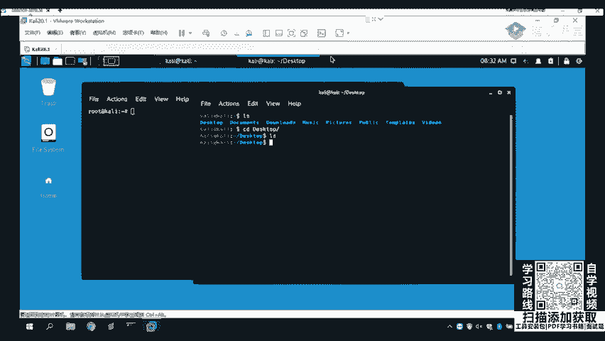

然后这里的话就是一个呃比较方便的一个直接使用一个rem well的已经安装好的一个镜像去进行一个使用。然后下面的话呃给大家。

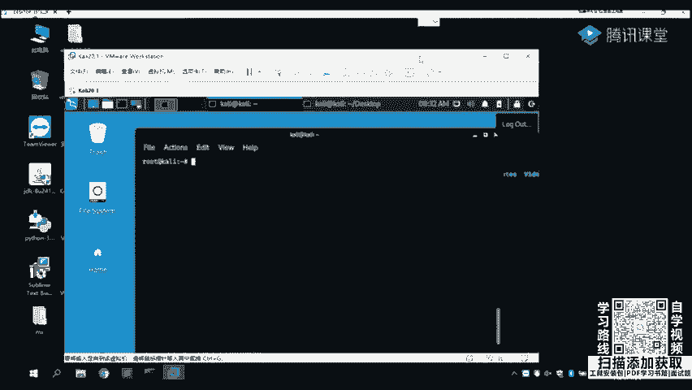

介绍一下如何去使用一个镜像。使用1个ISISO镜像去进行一个inning系统的一个安装。

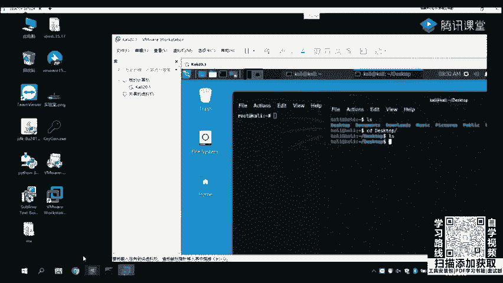

Oh。首先进行安装之前的话，你就你首先需要有这样子的1个SO的一个镜像文件。然后我们需要在这里。选择文件，然后新建一个虚拟机。然后选择一个自定义，也就是高级。呃啊，不建议去选择这一个顶型啊。

我们选择自定义。后面的话我们需要自己去进行一个呃自定义的一些操作。这里默认的话就是1个VM15。15点多的。Okay。好后默认就可以了。下一步下一步之后的话，我们这里需要让你让你选择一个操作系统。

这里我们选择稍后安装。然后他会让你选择一个操作系统的一个类型。有windows以机，有lininux啊，还有其他的一些操作系统。我们这里的话安装的一个看联的话是一个lininux系统。然后呃看里的话。

我们前面了解到是它是一个基于低b的一个lininux发行版本。所以的话我们选择一个低b。然后的话是64位的，因为最新版本的话，我们就选择这一个低变10点多的1个64位的一个版本。然后选择下一步。

这样的话我们需要进行一个命名。命名的话我就直接呃开你。系。然，这里我们要注意的话是要选择一个呃我们的这种这个镜像安装的一个位置。我们这里的话它默认的话是安装在C盘的一个用户目录下面。但是的话在C盘的话。

安装虚拟机的话是呃呃十分不介意的。因为你一个虚拟机安装之后的话，它手上的一个内存的话还是比较大的。我们这里的话选择安装在。哦。这个VM目录下面。

你们可以自己呃新建一个在其他的一个呃券下面找一个文件夹去进行一个安装。然后选择下一步，这样的话会让你选择一个处理器的一个数量。这样的话大家根据自己电脑的一个呃。嗯。

大家根据自己电脑的一个情况去进行一个设置吧。如果你配置低的话，就直接就默认就OK了。你选择一个一个处理器，一个内核。当样的话你如果你呃电脑配置强的话，你可以选择多个处理器。

而且现在的一个电脑的话都是多核心的，你可以选择多个处理器，多个核心都是可以的。怎么去看这看这一个的话，怎么去看自己电脑的这个东西的话，应该都了解吧。在系统这里可以看到。关如。

可以看到自己电脑的一个信息啊。这样的话我就直接默认就可以了。然后这里它会让你选择一个运行内存。运行内存的话，我这个电脑的话，它是一个8G的一个运行内存。呃，如果你电脑是16G的话。

你可以选择2G或者4G。这样子的话，就是说你这个虚拟机的话，它运行的话会更加流畅。当然的话前提是你电脑的话配置比较强大。我这里的话就选择2G或者一G吧。都是可以的。嗯。我这的话就默认选择2G吧。哦。

然后的话我们需要去进行一个选择网络类型。这样的话给大家大概做一个介绍。他这里给了这样子的呃几个类型。网络连接类型。第一个的话是使用桥接网络。就调接网络的话。差咗。大家对呃这个操作有问题吗？

虚拟机安装好了吗？呃，大家如果没有下载完的话，可以呃在课后的话去进行一个下载。大家可以先听我去进听我进行一个操作了。都没有什么问题是吧？好，我们来一起了解一下什么是调接网络。就调节的话。

一般的话它这个网卡是会显示成一个wimnet0，就是呃。我们可以在这里的一个。虚拟编辑器。就说我们编辑我们的一个网卡信息，我们可以在这里看到一般条件的话，它会显示为一个名称的话是wimnet名。

然后的话桥接模式它是将我们主机的一个网卡与我们虚拟机网络的一个虚拟网卡进行一个虚拟桥接，然后再进行一个通信。就其实大家可以这样子去理解，就我们把我们的一个物理机当做了一个交换机。

然后我们交换机连接网络的话，我们想要去呃连接网络的话，我们需要连接我们的一个路由器，也就是我们的网关，对吧？然后的话我们想要让我们的一个虚拟机进行一个上网的话。

我们也需要通过我们的一个wimnet0这样的一个虚拟网卡来与我们的一个主机，也就是我们的一个交换机进行一个连接。连接之后，我们才能够。进行一个上网。嗯。然后桥接模式它的一个呃特点的话就是。诶。

你桥接的一个物理桥接的一个虚拟机，它的1个IP是跟你物理机的1个IP是同一个网段的。然后的话呃因为就说使如果你使用调接，前提是你需要知道你自己的一个网络，你是否有足够的这样子的1个IP啊。

你这样的一个网段。因为你调接的话，如果你虚拟机数量比较多的话，它是会呃。占用你呃网关的1个IP的。如果你比如说你公司你啊你公司人比较多，对吧？然后的话只有这一个网段，这个网段的话呃。

总共的话只有200多个IP200多个IP的话，你的一个虚拟机通过调节的一个方式调节到啊网关上面。它会消耗你呃公司的这样的一个内网IP的。就是说呃。使用调接网络的话，前提是你。呃，你的1个IP数量足够。

然，第二个的话是1个NAT。NAT的就是一个网络地址转化。如果大家有对网络比较牛，呃，有学习过的话，应该都有学习过这样的1个NAT网络地址转转换。这个NAT模式的话，一般的话是1个wimnet一啊。

是一个名称的话是虚他的一个虚拟网卡，名称的话是winet一一般的话，然后。然后我们使用NAT的一个。啊，模式是。呃。是为了呃怎么说呢？就是说我们使用NATT的话就是。呃。

因为它是通过一个wimnet一的一个虚拟网卡来与你的一个主机进行一个通信。然后的话它的一个啊IP的话。他是跟。你主机。这个IP是。嗯。这里不太好讲哦。大家对这一块了解吗？就说我们前面有说到的话。

一个调接模式的话呃是会消耗我们的一个网络IP资源的。如果我们使用如果我们的1个IP资源不足的话，我们就可以使用这样的1个NAT模式。这个NNAT模式的话，它不会消耗我们的1个网关IP的一个数量。

而是会与，而是我们可以在这里我们自己的一个虚拟网卡这里去进行一个设置。比如说我这里的话设置的一个指网的话是三网段，而我。呃。啊，我这里本机的1个IP的话，它是一个。

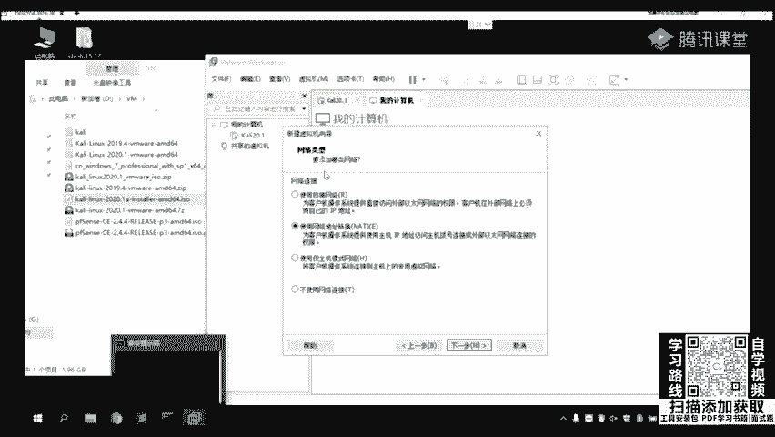

我这里本机IP话是一个二网段。我这里这个机器的话是跟我们的一个网关是连接的。但是我这里的1个虚拟机的1个呃IP的话是跟它是不在一个网段的，所以的话不会去消耗我们网关的一个呃资源。啊MV的话。

它是通过我们的一个物理主机来去跟外网去进行一个通信。

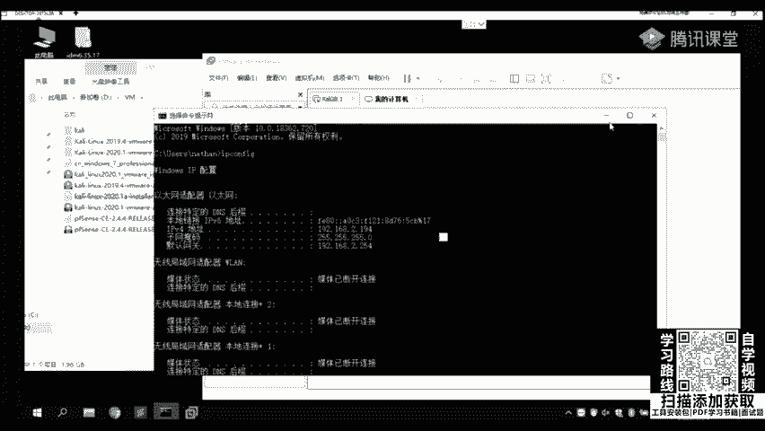

Yeah。然后主机模式的话就是他会把我们的一个呃。虚拟机跟外网去做一个隔离。就说他是不能够去访问外网的，而只能够是跟我们的一个物理主机进行一个通信。

以及跟啊同一个同一个网端下面的一个虚拟机去进行一个通讯通信。然后这里的话我们我这里的话选择。呃，桥接跟NAT都是可以的。我这的话就选择一个桥接模式吧啊。

因为便于我去呃在我的这一个物理机上面去进行一个连接。然后这里的话我们选择默认就可以了。然后下一步下一步。这里呃选择磁盘的话。呃。我们选择第一个。然后磁盘的一个大小的话呃，我建议的话。

如果大家内存足够的话，硬盘内存足够的话，可以选大一点，就尽量大一点。你可以选择40G，或者说五六十G都可以啊。因为如果你使用的多的话，它的一个你的这几十斤啊的一个硬盘容量的话可能会不够哦。

我这样的话呃就唉。嗯。😊，因你从。要我取一下代码。Yeah。啊，默认就行，使调解。好。Yes。这样的话我选择呃就30斤，然后的话存储为单个多个都是可以的。这样的话他也做一个解释，我这样的话就呃多个吧。

默认就行了哦，完成。完州之的话会给你这样子的一个界面。在这里的话，我们需要去进行一个一些配置。这配置的话，大家前面应该记得，就是说前面的话我们只是创建了这样子的一个空的一个磁盘。

而没有选择我们的一个操作系统，也就是我们的一个镜像。这样的话我们需需要在这里。选择我们。想要安装的一个镜像。我这里的话是。安装这个。选择然后的话前面我们做的这样的一些配置，我们可以在这里去进行一个更改。

都是可以的。然后选择确定确定之后的话，我们。

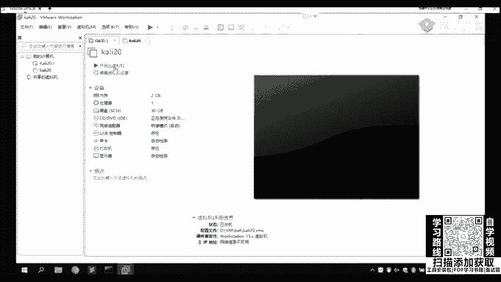

开启。启动它的一个虚拟机。启动之后的话会进入到这样子的一个界面。这里的话有这样子的一些选项，我们选择第一个就可以了。第一个的话它是一个图形安装。就说方便我们去进行一个安装的一个操作。嗯。

然后的话他会去进行一个。

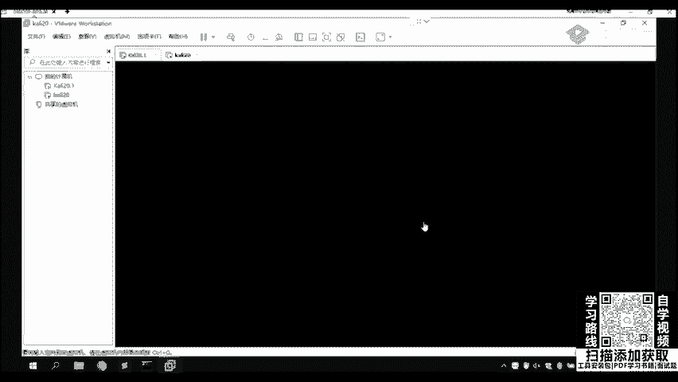

呃，安装启动启动的话，我们在这里的话会让你选择一个语言，也就是我们在呃安装过程当中的一个所使用到的一个语言。这样的话我们选择中文简体。就哦呃如果大家英语不是很好的话，就可以选择重文简体。啊，选择中国。

🤧哎呦。然后他会呃检测我们的一个安装的一个呃镜像。嗯。然后加载我们镜像里面的一些呃的一个文件，然后一些组件进行一个安装的一个准备。啊，安装过程的话，它是会比较长的。Yes。

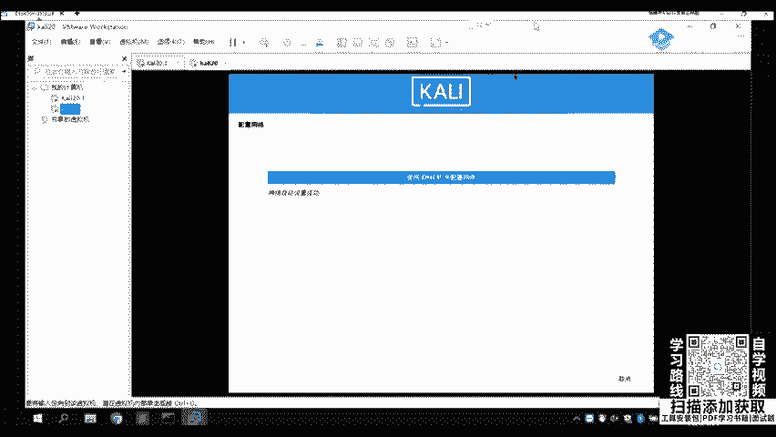

这样的话我先给他放在这。Yeah。

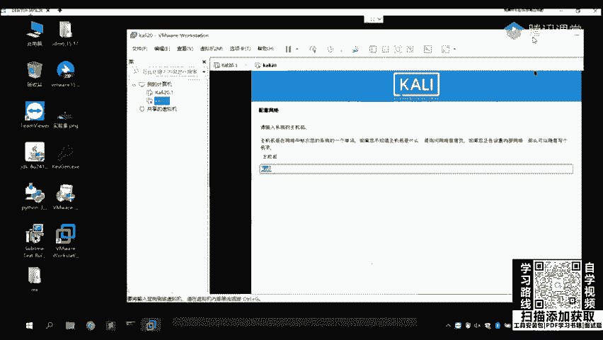

好，然后的话他会让我们输入这样的一个系统的一个主机名。这里主机名的话也就是我们的一个house name。

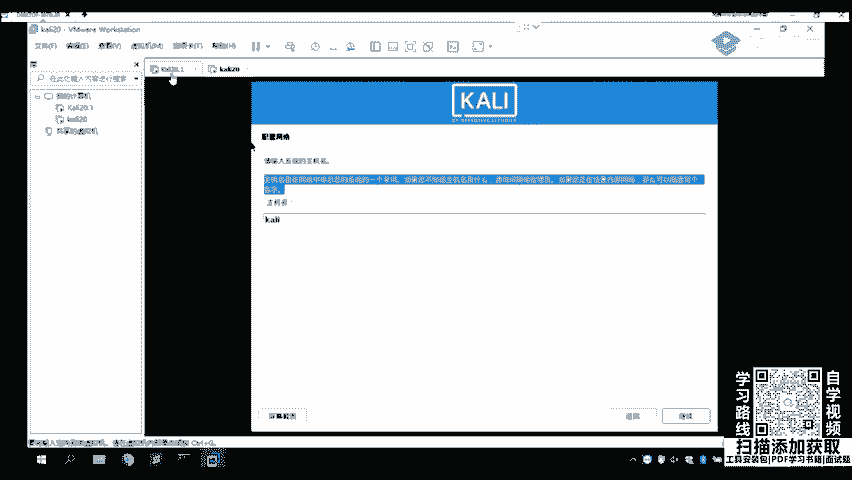

也就是呃这一个。就是我们登进去之后的话，这一个的话就是我们的一个。呃How's the name。好吧，这这一个的话是我们的一个用户名啊。然后这里的话也就是我们的一个主机名。

主机名的话就是在这里我们可以去进行一个设置。当然的话我们进入到系统之后的话，我们也可以去进行一个更改，更改我们的一个主机名。这样的话我们呃就选择一个默认的一个car里。

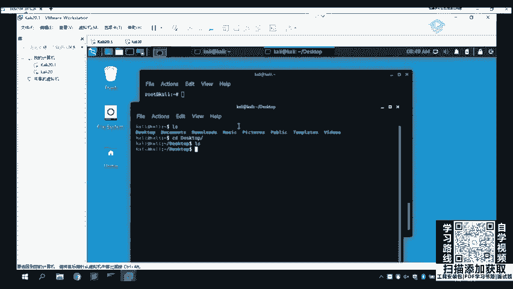

然后的话会让你选择一个域名，因为我们只是在本地去进行一个使用的话，我们可以不停啊。不果是呃作为一个服务器的话，我们就需要通过填写它的一个域名来进行一个迎接或者访问。哦，需要输入一个用户名。

这样的话他有说就是说我们需要创建一个用来替代root来执行非管理任务的一个普通用户账户。而是我们需要创建一个普通账户。普通账户的话。呃，我们。呃，随便输入一个吧，然后我这里的话输入一个。不。啊。

账户的一个全名，然后的话输入一个密码。密码的话。呃，密码的话大家可以随意的去进行一个输入。当的话我们这里的话只是在本地去进行一个使用的话，我们可以随便输入。我这样的话就输入1个123456。

那如果是在一个服务器上面或者是说公网的一个环境的话呃。大家要输入一个就是。比较强的一个密码吧，就不要去使用这样子的一个弱密码。我们可以呃使用这种。Okay。嗯。

我可以使用这种密码生成器来生成一个这种啊包含数字啊，小写字母，还有大写字母的这种比较强类型的一个密码。就不要去使用这种若密网，我这里的话只是本地去进一个使用图方便。然后的话呃。

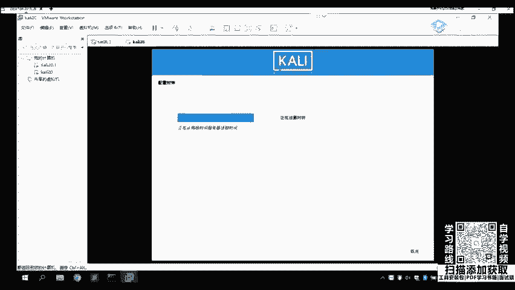

他会继续进行一个设置。这样的话因为比较耗时间，我这样的话就让他放在这了。

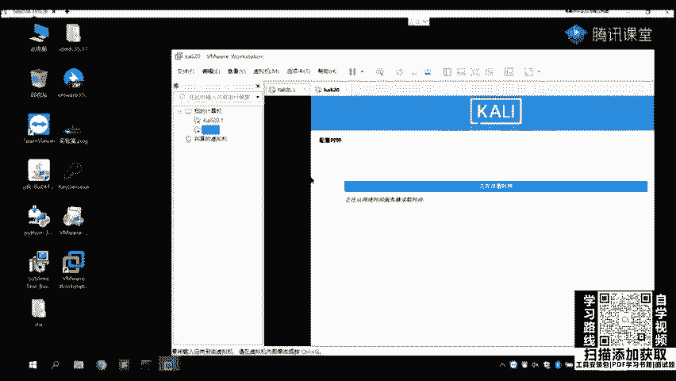

先让他进行一个安装。好，下面的话。大概给大家介绍一下怎么去进行一个windows的一个安装吧。windows安装的话呃，我这里的话找了有一篇。写的还算写的比较详细的一个。安装的一个过程。呃。

关于前面的几种那个网络网络模式的话，如果大家还是不了解的话，呃，课后的话我。呃，大家可以自己去找点资料去查看一下吧。就说如果没有去接触过网络这一块的话，可能会比较难理解。而且有些不是很好讲。

如果大家如果接触过网络，学习过网络这一块的话，对这一个的话是比较好理解的，应该会。然后讲这讲这一个网络模式的话，是因为我们在呃我们使用一个虚拟机，想要去进行一个上万去连接网络，去访问外网的时候。

就需要去进行一个这样的一个网络配置。

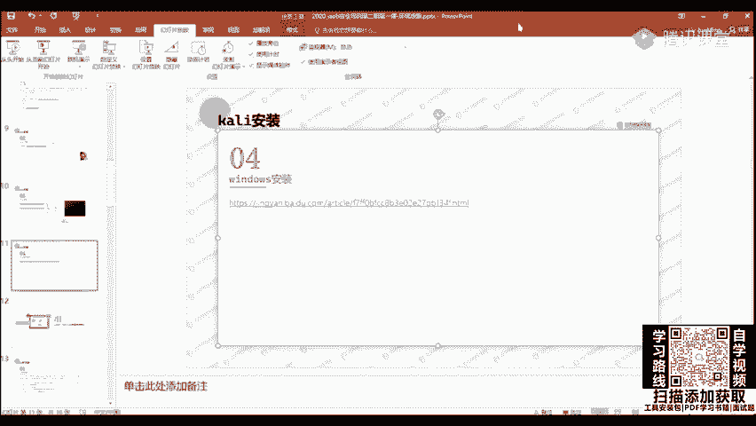

Yes。然后的话他会到这里的话，他会让我们让我们选择一个磁盘分区，也就是他这里给了我们几种分区的一个方案。有一个呃有三个向导就是。Yeah。第一个的话它是会使用整个磁盘，使用整个磁盘的话。

它就是适合新手，适合新手去进行一个操作。因为它会自动帮你去进行一个分区，它会把呃整个系统的一些呃文件系统，它会安装在整个磁盘上面，它会占用整个磁盘的一个空间。

然后下面的话我们可以自己去进行一个手动的一个安装。手动的话我们需要自己去进行一个呃文件系统的一个配置。就是说比如说大家都了解inux的话，lininux它是一个数状型的一个文件系统，对吧？它是从根目录。

然后下面的话是一个目每一个目录。构成。有很多很多的一些系统目录，然后再进行一个呃。系统安装的时候，我们就是最长。

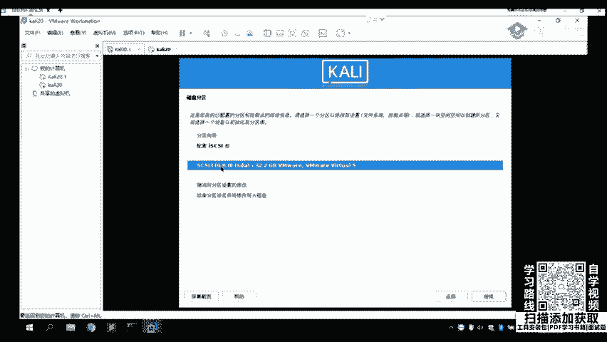

呃，一直会接触到的这几个目录。这样的话给大概大家说一下，首先这个的话就是一个干，也就是我们的一个跟目录。这个的话就是一个home。ho的话也就是我们的一个普通用户，也就是我们的一个用户加目录。

还有的话就是一个boat。bo的话就是我们的一一些启动的，我们系统的一个启动配置，以及它的一个引导配置，都是会存都是会在这一个目录下面的系统。启动。领导配置。还的话呃有一个wepe。外图的一个交换空间。

交换空间的这样子的一个啊目录。就说这个交换空间的话。嗯，就是便于我们之后我们之后进行一个系统的一个呃扩容。他会呃一般的话我们再进行一个自己进行一个配置的话，会留留几个G的一个这种交换空间。

就是已备我们的一个呃我们的一个上面的一些系统空间。被软件啊，还有我们的一些文件所占用了，然后的话系统没有足够的一些空间去呃支撑系统的一个运行。这时候的话我们可以使把我们这里的一个交换空间进行一个挂载。

然后。作为我们的一个呃就是。呃，作为我们的一个系统的一个使用。这样的话就是我们在呃安装的时候常用的会几个目录。然后我们对这些目录的话。

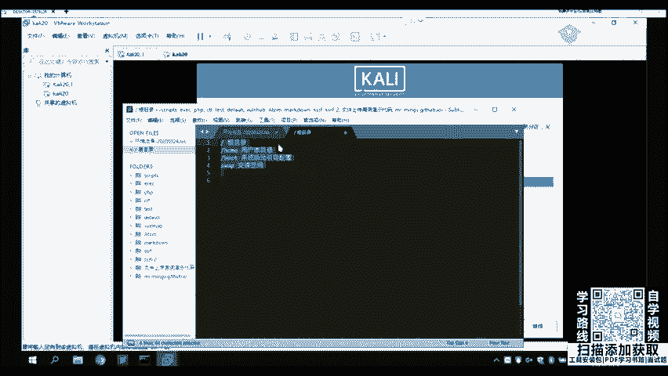

这里的话我这里是选择的是1个30G的一个硬盘，我们需要对这一个硬盘去进行一个分区。分区的话呃这种就是说给每一个目录分多大的这种方案的一个分配的话，看大家的一个需求。我这里的话就大概说一下呃。

首先的话就是加目。

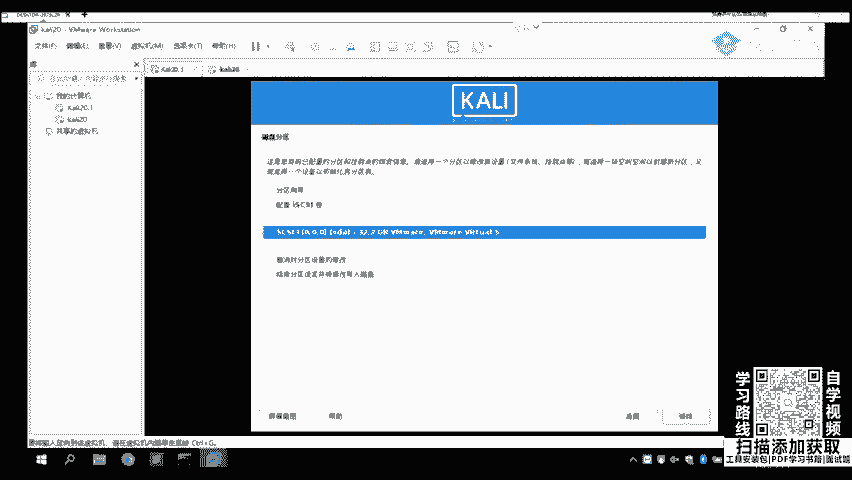

就号姆目录号姆目录的话就是适用于那种。就说多个用户你的这个服务器是有多个用户。去进行一个使用的。因为我们如果是多个用户的话，他会在这一个home目录下面会建一个以以以用户名为名的一个呃加目录。

这个目录的话就是那个用户的一个呃。那一个用户的一些文件所存储的一个目录，也就是他的一些文件的一个存放目录。如果说你的这个服务器，它是呃适用于很多的一个用户去进行一个使用的话。

尽量建议就是把这个hom目录是把它设置为呃你硬盘。就是说比如说我这里30G。如果说你是多个用户的话，你。建议把它分到足够大。比如说分到20G都是可以的。就为了满足呃一个这个系统的一个需求。

然后的话bo走分Q的话，一般的话。呃。行呃，一般的话。200个。或者是说看你系统的一个配置。可以给到400兆。当然这个bot的话，它其实呃大家可以不用怎么去管了。因为他本来他占样的一个空间也不是很大。

就给200兆是足够了的。然后的话交换空间的话，我们可以预留两个G。Oh。top目录这种的话，还有的话呃还有的话有其他的，比如说一些优者目录。优准目录就是说你的一些软件啊安装。你一些软件安装的话。

都会有去使用到这样的一个目录。这个目录下面的话，它会存放你的一些系统的一些软件。还有还有说你自己安装的一些软件，一般的也是习惯性的会放到这样子的一个优者目录。下面。如果说你为了满足你的一个。

比如说你的一个这种软件安装是很就是它很占内很占空空间的，就建议的话，单独给它分离个目录。就是单独给这一个优者目录，然后分配你想要给他的一个空间。然后呃跟目录的话，就是把剩下的这些空间都给他就就对了。

因为跟目录的话，它是我们系统呃的一一个目录。

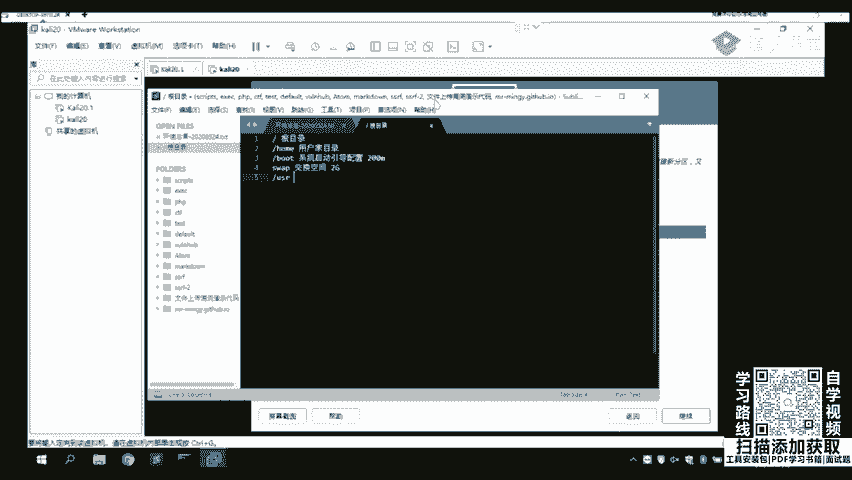

。然后这里的话我大概给大家操作一下吧。选择这一个，然后我们需要在这一个下面上面去进一个分区，建个这样的一个分区。就跟我们如果熟悉windows的话，我们首先需要对这个硬盘去进行一个格式化，对吧？

格式化之后的话，就建立这样的一个分区，然后我们再把它分成1个CDEF机的一个盘，对吧？好，我们创建一个分区，这个分区大小的话，我们可以按照自己。比如说我们首先给一个bo枕目录，分1个200兆。开始。

然后这里的话我们需要选择一个挂载点，这里的话有列了一些常见的一些挂载点。这样的话我们可以根据自己的一个需求手动输入。我们这样的话，比如说选择一个这一个报厂目录。它的一个文件类型的话是EXT4。

就现在呃一般的linux系统的话，它这个文定系统呃，现在的话应该都是用的这个EXT4的一个格式吧。然后继续。好，设定结束，设定之后的话就给了这一个boat分区啊，200兆的一个空间。

后面的话依次的去进行一个设置。然后这里需要注意的一个的话就是这一个。有一个1分区，就是一个交换空间。这里比如说我这里给他两个G。给了两个G。好，这里的话我们需要。选择一个。

我们需要建立这样子的一个交换分区的话，我们在这里挂载点，它这里是看不到的。有这样子的一个swipe交换空间的。我们是在这里选择一个磁盘分区的一个呃系统类型。我们选择一个交换空间。

然后的话设定设定之后的话，就进了这样子的一个2G的一个交换空间。然后依次的话给跟目录啊，还有home目录。如果你有这方面的需求的话，如果你没有说home目录这种需求的话，我们可把呃这里。

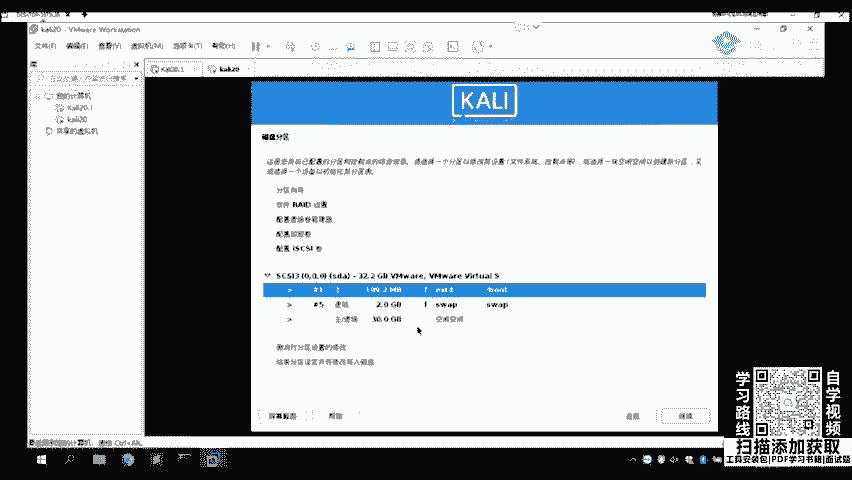

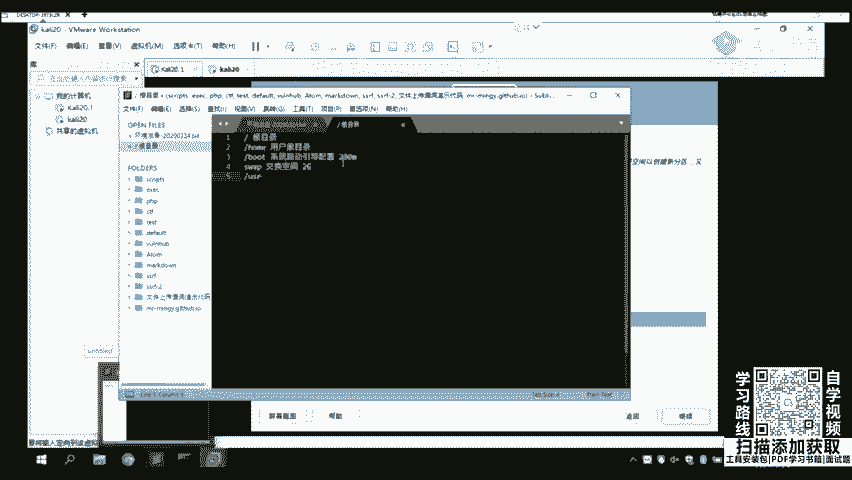

我这里剩下的一个空间都给根目录。啊，这样的话我就不去呃进行这样的一个磁方分区了。呃。Yes。我这里的话为了方便的话。直接使用这样的一个使用整个磁盘，就是默认的话一大家。可以去使用这样的一个使用整个磁盘。

它会自己去进行一个分区。然后这里它也有给你分，比如说万目和母目录这很到位。啊，放一个单独的一个分区，我们这的话就把所有文件都放在一个分区当中，就OK了。然后他这里会呃有进这样两个分区啊，可以看到的话。

主要的话就是一个这个swipe交换空间分区的话是呃必要的。然后的话。就是一个主空间，也就是跟目录。也就是我们的呃前面所讲到的这一些号姆目录啊，还有这种报存目录啊，所有的一些。

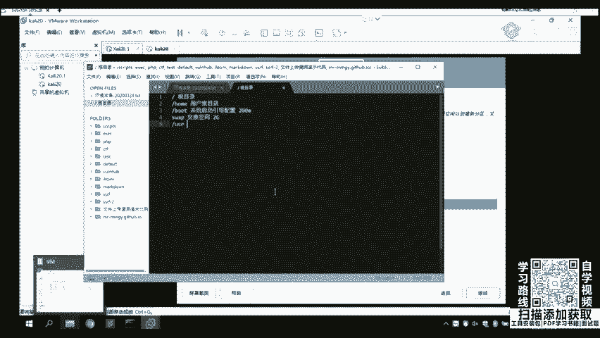

分区都在这一个啊，所有的这些文件都在这一个分区里面，也就是我们的一个根目录。🤧嗯。我们选择去动，然后这句的话把我们的一个改动，就是我们的一个分区啊，写助磁盘。Yeah。哦。Yeah。

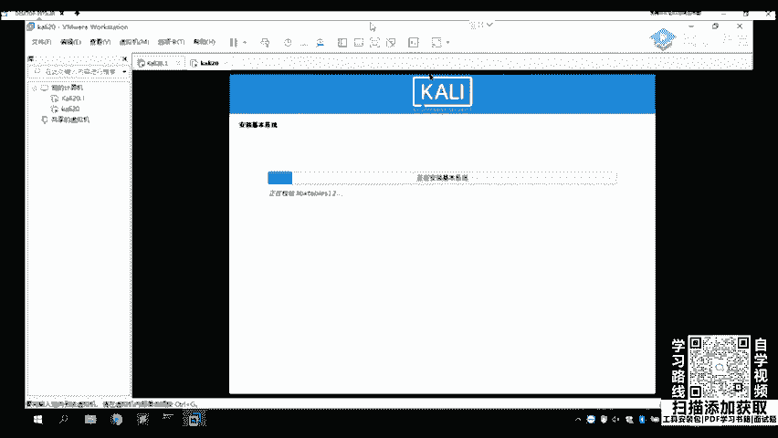

Yeah。呃，然后的话在这里的话进行一个安装的话，它是比较消耗时间的。呃。如果时间长一点的话，可能会要个十0多分钟。哦，因为时间关系啊啊这样的话已经9点多钟了。这已经呃。超过了我们的一个讲课时间啊。

所以因为时间关系的话，我这里的话就不去进行一个。操作了吧。在这里等他安装完的话，还需要挺长时间的。

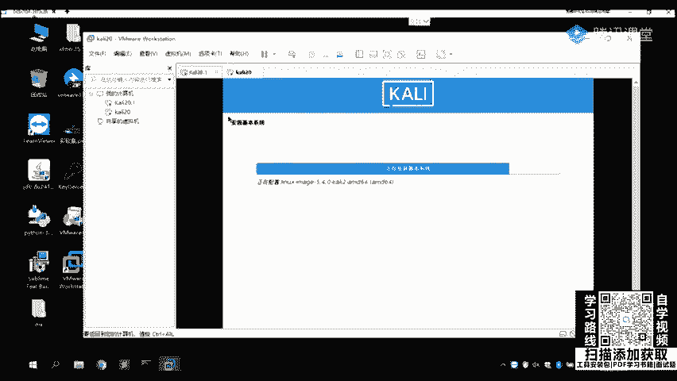

然后呃时间关系的话，这里一个windows安装的话呃，留给大家自己课后去进行一个操作吧。好吧，我这边的话就不在课上去进行一个讲解了。然后呃关于windows系统的一个下载的话。

我这啊我那个压缩包里面的话是没没有给的。就是呃我建议的话大家去这1个MSDN。我告诉你这样的一个网站去进行一个下载。这样的话。🤧还有很多的这样的一个系统。

有win10啊等等的各个版本的一个最新版的一个系统都有。如果你想要想要安装哪一个版本的话，你可以在这里去进行一个下载。我看到各种语言的都有。一般的话我们如果是安装分机的话，就选择中文集体嘛。

然后这里的话有。各种版本的有比如说有SP的，还有其他的这种64啊，86位的等等。啊我们这里选择详细信息，有复制这1个EDIK的一个。链接然后呃使用迅雷啊这种工具去进行一个下载。

然后这里的话下载的话呃会比较快，比我换到一个百度网盘上面下的话，肯定是要快一点的。这样的话是看你网速。如果你放百度网盘的话，是看百度网盘的网速。🤧Yeah。Yeah。

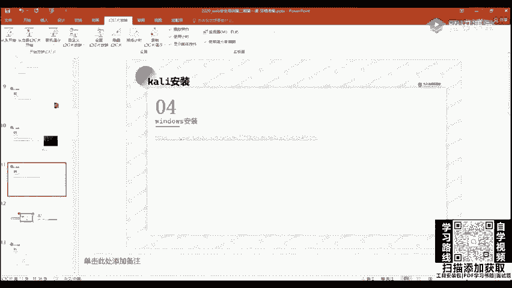

然，本节课的一个内容的话就是这样子。哦。这里的话呃他这里的话前面的一个基本的一个安装已经完成了。我这里的话再稍微花一点时间。呃，过一下。这样的话他会让你填1个HTP的一个代理信息。

我们这里的话如果说你想要呃通过一个外部网络，就是说通过代理来去进行一个连接的话，去进行一个软件的一些下载的话，我们这里可以进行一个填写。如果没有的话，我们直接留空不停。2的话他后面会去进行一个呃安装。

现在的话他会进行一个正式的一个安装。它会从网络上面去下载一个文件。就前面的一个代理的话，就是说用于这里的一个文件的一个下载，它必要必要的一些安装文件的一个下载。就如果你网网络不好的话。

它的一个下载安装可能会失败。如果失败的话，呃，大家不要慌，就是呃重试几下，或者是说换一个好一点的网络就OK了。然后这里的话有96个软件去进行一个下载。呃，由于时间关系的话，我这里的话就。不操作了。

不等了吧。然后本节课的一个内容也就到此结束了。那大家有没有什么问题吗？

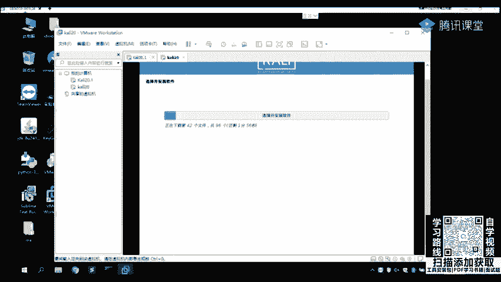

呃，安装完之后的话就是。网络嘛。Okay。对。唉安装完之后的话，你因为你安装之后的话，就是这样子的一个系统。如果说你想要去啊用浏览器去访问一个外网。对吧访问百度呃。去访问百度。

你这里的话就需要去进行一个网络的配置，也就是我们也就是我之前有讲到的这里的一个网络的一个配置啊。

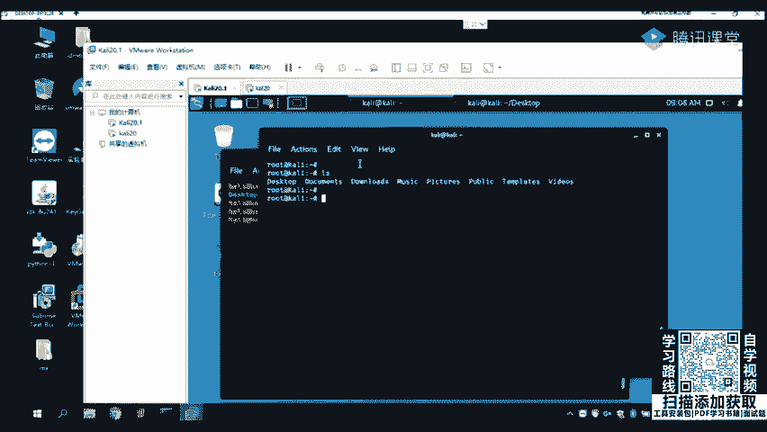

哦，对，这里的一个网络配置的话，我这里给大家。啊，讲一下。就呃如果说你使用的是一个。NAT啊，不，你使用的是一个调件模式。如果说因为我这里前面的话是嗯。我在你前面的话，这里选的是哎。ま是。

我这你前面的话是选的是一个调接模式，所以说我想要让这我的这一个机器去进行一个上网的话，我需要在这里去进行一个设置这里的一个桥接。调接模式的话，我这里需要调接到我的一个网卡。网卡的话，网卡的话。

如果是你连接的一个有线，有线的话，就选择我们的一个有线网卡。也就是这个网卡怎么去看，应该呃。收到吧。我们这里打开我们的一个网络配置，网络适配器。这样的话我们可以看到我们的一个网卡。

我说这个Vlon的话就是一个无线网卡。我们这里的话连接的一个有线的话，是这一个以他网上，也就是这一个网卡relectPIE这个。

所以说我们这里想要啊通过这一个我们的这一个有线物理机的一个网卡去进行一个上网的话，我这里的话就需要调接到我的这一个哦，不是这个。嗯，这个这个才是我的一个有线网卡，调焦到这一个网卡。啊这里的话呃。

这里选择一个警主机，这里选择1个NAT。因为前面有说到的话，一般的话条件模式是Vnet0嘛，这句的话选择1个NAT。然后这里我们的一个直网，我们可以去自己去进行一个更改。然后这里桥接的话。

这里的话我们不要去自己进行一个配置。因为桥接的话，它会跟我们的一个物理机，对，是同一个网段。然后的话它分配的1个IP的话是由我们物理机的一个网关。在1个DHCP服务器自动去进行个分配的。然后这里的话。

我们。就配置完。进行个应用。嗯。Yeah。应用之后的话哦。

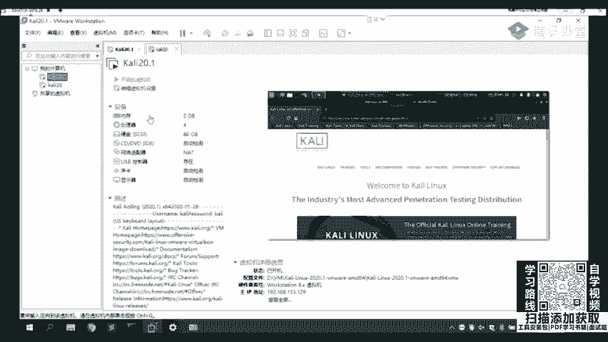

我应该我应该改这一个的，就应用之后的话，我们可以进系统之后，然后去进行一个。

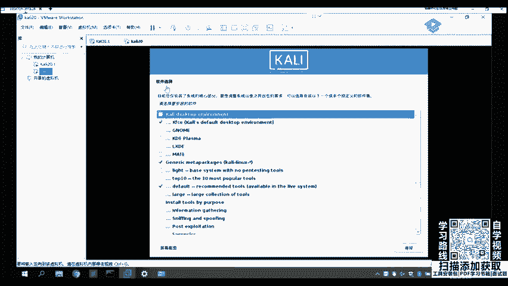

嗯进行一个。哎，访问。比如说我在你访问一个。他有点看。嗯。因为我这里的话是使用的，我刚刚是改了这一个机器啊，这个机器改的是一个呃调件模式啊。

因为我然后的话我这里的话是使用的1个NAT所的话它无法区进一个上网。我这里把它改成桥接。Yeah。然后的话这里的话就可以看到的话是能够去直接访问百度去进行一个上网。

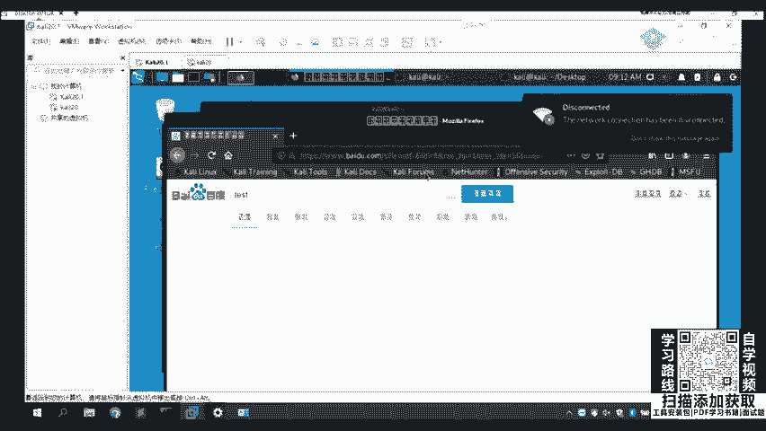

对吧。就是啊因为。When我。

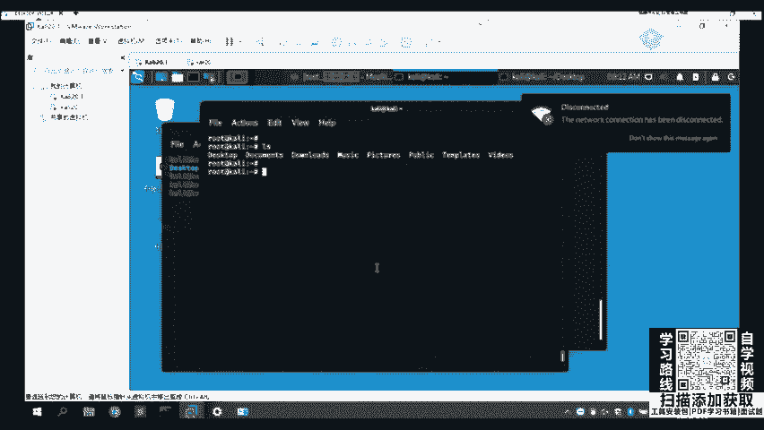

就因为我在给很多的一些就是刚学这一块的一些呃同学朋友，就是讲讲课的时候的话，就他们在刚接触这一块的话。对于这个car里的一个网络配置，是一直都是搞不懂的。就是有很多的问题，就他一直问我。

就比如说你一直就一直上不了网，我这里为什么上不了网？然后这里的一个其实就是你这里的一个网络要去进行一个配置。然后配置完成之后，配置完。配置正确了，我们就能够去进行一个上网。

然后还有的话就是一个比如说你想要去安装一个软件，对吧？し。嗯。啱没有什么。我们装1个HTBD。呃，就比如说你要去进行一个安装一个软件，对吧？你安装呃这个。我们这里去骗去骗一个域名。如果说你骗这个域名。

你拼不通。还有就是你如果说你啊APT，你去安装安装一些软件，它显示就是啊某一个域名。比如说gihub什么什么那种呃域名，它无法去进行一个解析的话，我们就需要去更改我们的一个呃DNS。

就在这一个在这里我们需要更改我们的1个DNS。就常见的一些DNS。呃，比如说。比如说呃。8。8。8点。好。我们改成我们的一个一些公用的一些DNS，阿里的呀，还有谷歌的这种DNS。

然后的话就能够去进行一个域名的一个解析。然后的话这里的话是呃是正常的一个域名解析的话。

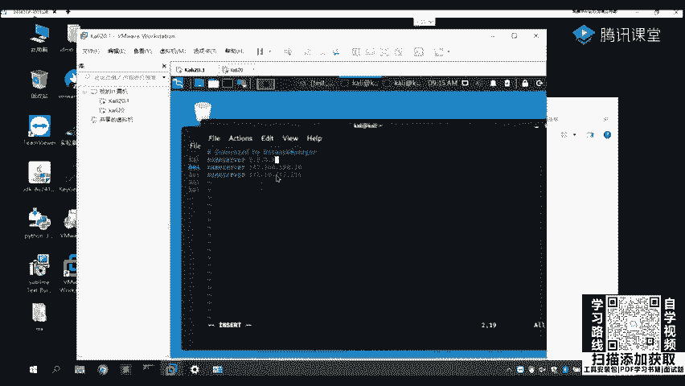

就呃这这个也是就是呃干学这一块大家可能会碰到的一个问题。就经常碰到的一个问题，就需要大家去进行一个注意吧。然，还有的话一些网络的一些配置啊。比如说更改一些host呀等等的话，这里的话我就不。过多讲了吧。

我们可以在这1个ETC这1个ho name里面去更改我们的这样子的一个主机名，更改成你自己想要的一个名字。都是可以的。啊，还有什么问题吗？Yeah。🤧哦，mac版的话m克版的话有啊。

你在这个Vware官网的话，这里不是。哦。哦，没，不是。哦，mac版本的话，那个wemware的话不是不是叫wem well，是叫那个叫叫啥来着？因为我也不用。我用的我一般用的是windows。啊，对。

就是这个rewell push这个这个虚拟机。你可以去进行一个呃下载这一个你如果用的m克的话。

Yeah。MY复习。

Okay。🤧。嗯，还还有问题吗？Yeah。如果没有问题的话，那我们今天一个今天的一个课程内容的话就。好，到这里就结束了。如果还有如果还有问题的话，大家可以课后在群里有提问。

或者是呃明天上课的时候也可以进行一个提问。没有手动问具的话，影响不大的。没有多大的影响。就呃就是因为安装这个开领的话，其实也就是作为一个工具嘛。这这个的话是完全足够的。我们也就是不是专门做运维的这种。

必须要去这种考虑各个方面的一个需求。对我们的一个练时系统去进行这种的一个分区的话，是没有必要去啊。呃，去自己去手动分配的。就按照他那个自动的一个引导分配就可以了。🤧OK那。我们下节课再再见吧。

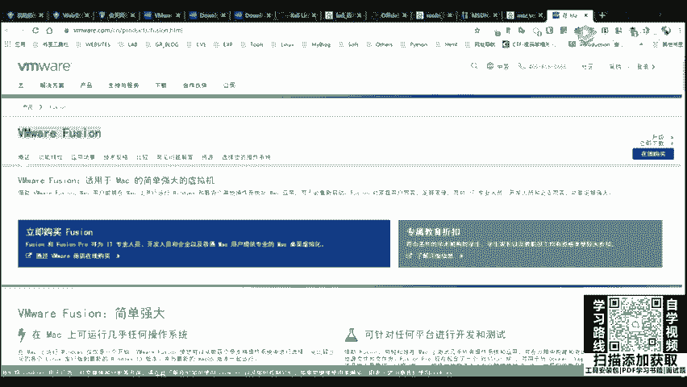

嗯。那，本次我们的一个课程内容的话是1个LANMP以及片区斯拉底的一个呃环境的一个部署，以及通过这样的两个环境集成的一个环境来部署我们的一个漏洞靶场。就呃LNMP的话是在inux上面的。

以及PPHB代理的话，是在我们采用的一个windows系统上面去搭建的一个wordb集成环境。然后首先的话在环建搭建之前的话，我们先来了解一下LNMP的一个安装，以及对它的一个警戒。我们一起来看一下。

LAMP的话，它其实是指的是一组经常用来搭建动态网或者服务器的这种开源软件。他他们本身其实是一个独立的一个程序。然的话是因为他们是因为我们经常会使用这样子的一个组合。

所以的话我们就经经常会把它直接就是放到一块来讲。🤧哦，LAMP它其实是。🤧啊，几个。这种独立程序，它的一个拼，它的一个缩写首字母的一个缩写。我们先来看一下LL的话就是指我们的一个linux。

inning的话呃应该不用我去多说吧。它是一类uniunux的一个操作系统的一个统称。我们其其实除了一个windows的话，使用最广泛的也就是啊linux的一个系统。然后unning词话。

像比如说mac mac OS它也是一个unun词的一个系统。啊我们常见的这种linux系统的话，有比如说cent啊，还有低变低变的话也我们的一个can里的话，也就是基于低变的一个发行版本啊，乌班图。

还有read heart等等。我们一些经常会使用到的一些linux系统啊，linux系统的话，它其实不像我们windows的话，它是呃专注于就是这种桌面的一个系统。我们linux系统它的一个占比。

它其实不是在于桌面，而是在我们的一个服务器领域。它所使用到的话是呃更加广泛的。哦，A的话就是指阿帕奇。阿帕奇的话就是一个网页服务器。N的话是指N。

它是跟阿帕奇类似的一个高性能的1个HTP的1个网页服务器。🤧嗯。😊，他们的话是指my circle marryy DB等等这种数据库的一个管理系统，还有它的。啊，就是一个数据库服务器。

P的话是指我们常用的这种PHP的一个脚本语言。这句话我有呃分别有说，然后这里我主要讲的话是1个LALAMP，也就是我们的这种linux加阿帕奇加my circlecle加PHP的一个架构。🤧嗯。

这里的话是关于一个N加阿帕奇的一个区别。就前面的话有说到我这里的话主要讲的是讲的话是1个LAMP的一个架构。当然呢同样的也有LNMP的一个架构。就是说呃N跟阿帕奇，它其实是可以呃。就是差不多的一个作用。

当然的话它的一看它的一个区别还是有的，就是它的一个区别还是比较大的。我们就是通常的话我们也可以使用这种LAMLANMP的这种架构。它是利用我们的这种eng加帕其这种服务器。它的一个特性来进行一个搭配。

就说阿帕奇的话，它是通常会作为一个后台服务器来处理我们的这种PHP以及动态的一种脚本语言动态的这种请求。Nex的话，它主要是作为一个前端的一个服务器。

因为它的一个特点的话就是它会占用它占用的一个系统资源是比阿帕奇要少的。然后它处理静态页面的一个请求。然后介绍完。N与加帕奇的一个区别之后的话，我们来看一下。

如何在cuing里面去搭建我们这样子的一个AMP的一个环境。上节课的话我们有讲到如何去啊在虚拟机里面安装我们的一个canninglinux系统。那这里的话主要是这几条命令。

就是说在lininux里面安装这种软件的话，是我个人认为的话是比windows要方便很多的。就是说只需要这样的几条命令，就能够搭建我们想要的一个环境。

当然的话前提是大家要能够熟练的去使用这样的一个lininux系统，以及对啊这种软件有相当的一个了解。And。这的话因为是使用的一个lin。然后如果这里的话再多说一句，多说一句的话。

就是对那些就是呃对历史不是很了解的同学。就是说我这里的话是使用的1个APT。APT是什么呢？APT是linux啊，具体说的话是一变系统下面的一个包管理器。

就说我们可以用这样子的一个包管理器工具来下载啊我们的这种呃软件。下载我们所需要的一个软件。那我大概说一下他的这样的一个命令的一个意思。这样的话APT instore阿帕奇2杠Y。好。

首先的话我们需要使用到APD这样的一个下载包管理器工具来下载安装。in说的话就是安装的意思。app帕7二的话就是我们想要安装的一个web服务器。然后杠Y的话就是呃确认就是说我们在安装的时候。

它中间会让你选择说那你是否啊安装。有那样子的一个yes和 no的一个选项。如果说你不加这一个的话，它会出现有一个让你选择是否继续安装的一个yes or no的一个选项。所以说我们可以。

如果说我们想要默认它一直安装下去的话，我们可以在后面加一个杠Y的一个参数，就是默认都是yes的。哦，安装myse的话。呃，跟前面的一个命令是类似的。这里要说的一点的话，就是呃大家要注意的话。

就是说在我们的一个carlycarly links里面的话，它的一个my circle，它是叫marary d。以及mry B server，我们需要安装这样子的两个软件。呃。

关于这一个mycycl以及merB的话，我这里啊大概说一下，就说mycycl跟marrryb它其实是类似的这种数据库的一个管理系统。然后呃为什么会做这样子的一个区分呢？

因为呃my跟merryB它其实同一个作者啊，因为mycycl的话，它是被呃。oracle收够了吧。因为大家知道呃，我记得是oracle吧，然后大家都知道oracle公司的话，它是一个呃商业公司。

就是说它它的一些东西都是要收费的。所以说然后mycyclcle的一个作者的话。他为了避免就是说这个mysl的这个软件就是呃收费，然后在canin啊不在linux系统上面啊，不能够去免费的使用的话。

他就另外开发了这样的以他女儿marary命名的一个marryB的一个数据库系统。就是说我们在安装的话是使用着这样子的一个命令。当然的话我们启动服务的时候，其实也可以使用这样的一个mycyclcle。

而且它的一个呃命令什么的都是类似的。呃，第三个的话就是安装PHP安装安装PHP的话。大家可以看到我们需要安装这样子的呃，有比较多的一个扩展啊，就说PHP语言的话。

我们需要去啊在我们根据我们自己的一个需求，我们需要去处理什么样子的一个呃PHP的一个脚本，然后再去安装我们所需要的一些扩展。我这里的话就是列了一些我们日常我们去搭建这样子的一个网站啊什么的靶展什么的。

会经常会去使用到的这种啊PHP的一个扩展。呃，关于具体的一个的话，大家可以自己去百度吧，好吧，然后这里的话要说一下的话是。呃，这一个PHEmy circle，比如说这一个。my的话，它是用于啊支持。啊。

连接我们的我们的一个就是PHP来去啊连接数据库，对数据库进行一个操作的这样子的一个扩展。这个的话我们如果需要去使用到数据库的话，这个扩展是必须要去安装的。还是说像这个PHPGD这样子的一个扩端化。

它是对于啊比如说你的一个网站，它需要去使用到啊验证码。这种图形的一个呃处理库的话，我们就需要去安装这样子的一个扩展。然后其他的话我就不再过多的一个呃说明了吧。好。

这里的话是我在caning里caning里面去进行一个安装的一个过程。然要说一下的话，是在caning里面，它其实是已经有啊自带已经安装好了的一些服务的。像比如说阿帕奇阿帕72的话，它是。呃。

我这里是我忘了，我是自己已经之前已经安装了，还是。啊，我记得是他默认就已经安装好了，如果没有安装好的话，我们可以通过这样子那个命令去进行去进行一个安装。然后安装之后的话，我们需要去启动它的一个服务。

启动服务的话，我们可以用这个service阿帕奇尔，然后state states。states的话就是状态这个状状态的意思的话就是我们来查看我们的这一个appacheappache2的一个服务。

它是否处于一个启动，或者是说关闭的一个状态。如果说像这种的话，就是处于一个bedad，也就是关闭的一个状态，我们就可以使用start，来对它进行一个启动。

启动之后的话可以看到我们的一个状态就变成了一个running。Okay。然后在我在安装之后的话，我大概给大家就是这里的话有。念了几个。卸载就如何去卸载我们的1个LAMP的这种架格。比如说我们安装的。

我们不想要去使用这样的一个东西，我们想要或者是说版本安装错了，我们需要把它做一个卸载。卸载的话我们就使用这样子的一个mini。呃，这里的话主要讲的话是啊卸载的一个命令。卸载的话。

首先第一个的话是这个auto remove。auto remove的话它会呃去自动的去卸载我们的这样的一个merrry B啊，还有merry B server它的一些安装包。然。

绿目5的话就是卸载我们安装的这个软件。🤧嗯。😊，然后呃我们可以通过DPKGDPKG的话，它是linux里面的一个。呃，就是查询我们的这种安装包。比如说我们想要查询我们安装的哪些应用。

我们可以通过这1个DPKG这一个命令来去进行一个查找。就像我们在windows上面的一个应用管理器一样。然后这里的话我们可以通过来。通过这样子的一个过滤的一个方式来查找到呃关于。

这样的mycycl我们想要卸载的这种软件，它是否有卸载完成？或者说卸载干净了。然后的话。就是这个我们在link里面安装的这种软件的话，它会在ETC下面。他会有创建这样子的一种文件。

对它的这些文件的话就是关于这一个软件的一些配置文件，它都会放在这1个ETC目录下面。比如说我们通过这个fundf的话，就是在link里面去进行一个呃文件，还有目录等等的这种进行一个查找的一个命令。

就相当于一个全局搜索，然后搜索我们的1个ETC目录下面呃匹配这样的一个mycyclcle。或者说marryDB的这种呃文件，如果有这种的话，我们就执行IM杠F，就是删除掉删除掉这样的一些文件。

或者是说目录。🤧嗯。😊，他的话呃阿帕奇的话也是呃类似的这样的一些命令。这样的话如果是就是懂命的话。啊。就都能够看得懂了。然后的话我。以及PHP的一个下载卸载都是同样的。然后这里的话呃。我把这些命令。

就说发给那些就是可能刚开始接触那令时的同学吧。其实这个的话，其实我不用发也行，就大家直接去网上去查找。都是可以的。内容太多了。我这的话就不一个一个发了吧。如果大家有。有疑问的话，可以在课后在群里问。

或者是说直接私聊我也是也可以。Yeah。Okay。嗯。然后的话我们来看一下。如何利用这样子的1个LAMP来部署我们的1个DVWA的一个漏洞靶场。就是说在部署之前的话，同样给大家介绍一下什么是DVWA。

也就说这一个漏洞靶场是啊什么样子的一个东西。大家可以看一下，这个的话是我从他的一个官网上面 callll的。

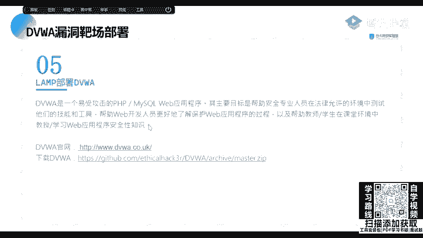

呃，他的一个网站的话就是这一个。能们看一下。

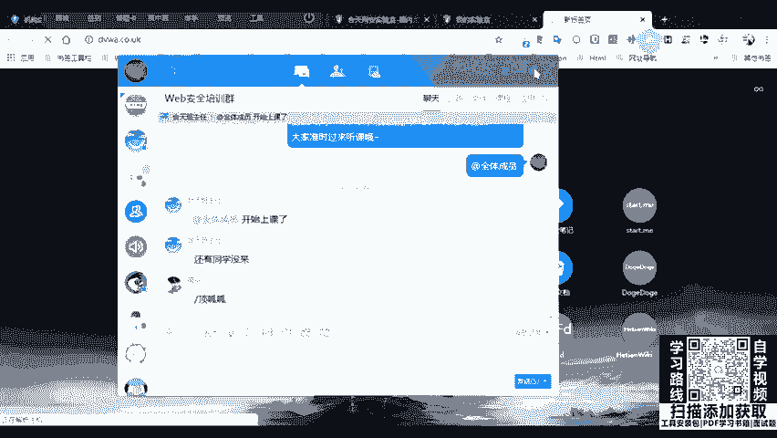

呃，网络可能稍微有点慢。稍等一下，就是这样子的一个。网站就是说我这里的话是比是ca的这样的这里他的一个介绍。它其实就是一个基于PHmy的一个we表应用程序。就是说这个应用程序的话。

它有集成了很多的集成了就是说我们的1个OWOWSPtop10的。top时的这样的一些漏洞。就说这这些漏洞的话，他把它集成到了这样的一个靶场，然后他有分。啊，初级分 low呃low级，还有中级。

还有高级以及不可能的这样各个等级的这种这种漏洞靶场。就说它里面包含的就是啊OWOSOWSBtop10的一些漏洞。呃，PPT的话。PPT的话，我暂时不知道能不能发给大家呃。下课的话，我问一下领导吧。

如果领导说可以发的话，我会发给发在群里，好吧。うん。😊，然后关于这个OWSBtop10的话，大家可以去了解一下。就是说关于外包安全相关的一些东西，它会呃它会隔隔两年还是隔多久发布一个这样子的一个呃。

榜单这个榜单的话就是呃列举了，就是说在呃这一些年内。and。😊，攻击者经常会去使用到的这种web攻击的一些技术。以及他所利用的一些漏洞攻击技术。Yeah。然后这一个靶场的话就是包含有相关的一些呃。

嗯环境这样子的一一个web应用程序。主要的话就是用于呃大家去进行一个啊这相关知识点的一个学习，以及进行一个操作性的一个利用。

下载的话，我们直接点这里下载，然后它是包管在gitthub上面的。就是这一个网站。Yeah。对，后面大家看录播其实也是一样的。看录播的话呃，因为我PPT也展示出来了，大家可以跟着我就是跟着敲嘛，对吧？

🎼给自己去进行一个练手。然后的话这里的话就下载完毕。呃，我这里的话其实已经有下载好了，大家可以去。呃，下载，然后跟着我一起进行一个操作吧。那我这里的话先先不操作，先。啊，讲一下PPT的一个内容。

Yeah。🤧K。😊，啊，我们下载好呃，那个安装包之后，它是这样子的1个DVWA杠ma的一个压缩包。然后我们需要去进行一个解压。解压的话我们就会去使用到这样的一个unzip的一个命令。

就是解压我们的一个呃zip包的一个命令，是在linkux里面去进行一个使用的。然后哦。然后的话需要把我们的这样子的一个压缩包，把它呃复制到我们的一个网站跟目录。也就这个网站跟目的意思的话。

就是我们安装完我们的一个阿帕奇之后，它就会啊有一个网站的一个跟目录。也就是说我们的这种呃网站的一些脚本文件，以及我们的一个应用程序，都需要放到这样的一个目录下面，然后的话才能够去进行一个解析。

也就是我们能够去直接的对它一做一个访问。然后这里的话我使用的是一个木这样子的一个命令。呃，就就是我这里的话，就可能如果说对于历史有比较了有了解的同学的话，可能觉得我这里会讲的会有点啰嗦。

我这样的话主要是考虑到啊，因为我这我们的这一个课程的话，是一个面向零基础，或者说你想想入门这样子的一个外保安全的一个课程的话。呃，外表安全的一个这种。行业的话。可能就会没有接触到相关的这些东西。

所以的话我会呃。大概的会提一下这样的一些命令，它的一个意思。所是说呃希望不要觉得啊啰嗦或者是说多余的。嗯。然后CD的话就是切换目录，在历史里面去切换目录。我们就是。啊。

就像在windows里面去打开一个文件夹，我们可能使用的话是用鼠标去点点点，对吧？我们在另面的话，直接在命令行里面用命令，然后CD切换到我们的这样的一个目录，切换到这个目录之后的话就会是。啊。

关就会是这个wordb用的一些。文件。这样的话我等会也会给大家进行一个操作。🤧然后。然，这里的话我要提醒的话，就是在安装的1个DVW的话，我们需要必须要去安装这样子的几个扩展。

就说这1个PHPGD也就是。哦，我们前面说的呃一个。呃，处理图像的一个库。然后的话my circlecle呢是连接my circlecle与my circlecle进行一个数据的一个交互的一个库及PDO的一个这样子的一个库。

需要去进行一个安装。然后呃这句话我先不说，我先。

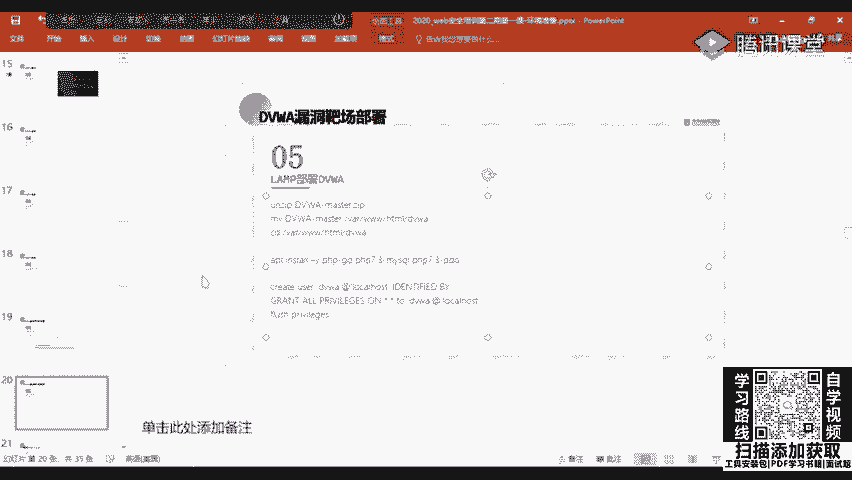

带着大家一起来进行一个操作吧。同样的我使用的话是呃昨天安装的这样的一个caninglin的一个系统。我们首先。进行一个登录，就默认的话是使用的一个看你登录。

我这里话呃图方便的话就使用root去进行一个登录。

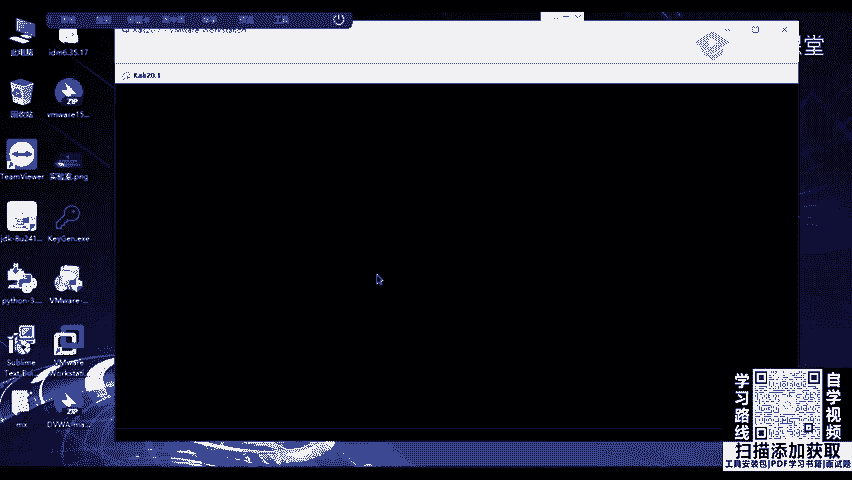

登录之后的话，打开我们的一个终端。

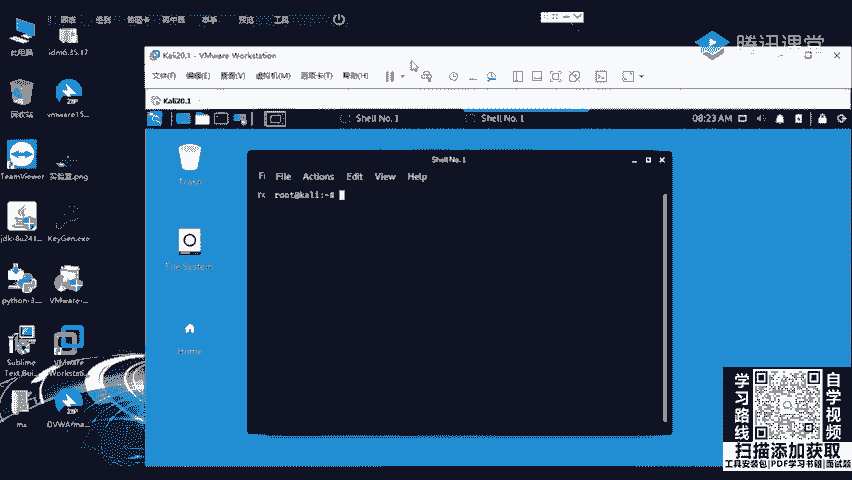

打开这个终端的话，呃，我这里的话已经有下载好了这样子的1个DVW的一个压缩包。它里面的一个内容的话就是像这样子的一些PHP的一个脚本啊，PHP的一个一些文件。然后我这里的话直接把它呃。把它复制进去。

复制到了这里，然后这里的话是在桌面，我们切换到桌面。也就是这一个文件。我们使用Nzep这样的一个命令去进行一个解解压。如果说没有这样的一个Nz普命令的话，我们。呃。

通过APDinstore来去进行一个安装。我这的话是已经安装完毕了。我直接去对他做一个解压。Mt。截着的话就是这样子的一个文件夹。🤧Yeah。🤧L杠就是。啊，不好意思，喉咙卡了一下。

就是L的话就是列出当前目录下面的这样的一个文件。但是的话你看不到它的一些详细的一些信息。比如说它的一个啊一些权限以及它的一个属组等等，以及它的一个大小，我们就可以使用L杠L。来进行一个查看。这样的话呃。

你也可以。啊，就是在其他的一些inux里面的话。是直接可以使用LL来去进行一个查看的。然后这里的话没呃其实它是一样的一个意思。也可以在linux里面加一个an，加一个an，也就是加一个别名。

可以把它呃改成一个LL就是这样子的话会更加方便一点，就不用再出其他的一些选项。电话提一下。嗯，电话我直接把它呃哦，我这里看一下。应该已经安装了吧，安装一个我们的一个wordb服务，也就是阿帕奇。

那样的话重新再操作一遍。对吧APT installstoreapp帕72杠Y。哦，我这里的话是已经安装好了，所以的话它会显示这样。啊，安装完毕的话，还有的话我们需要安装mycyclDB。以及卖B。

干 server。嗯。😊，嗯。啊，我这里的话是已经安装安装好了哟。他的话安装好之后的话，我们需要对它做一个启动。启动的话，我们使用这一个service的一个命令。然后在ene历史里面有一个技巧的话。

就是我们。在敲面的时候，大家可能是。可能会记不住这样的一些单词，对吧？比如说service，你这一个记不住。VSE你这个记不住，你可以有一个技巧的话，就是有一个自动补全的一个技巧。SER。

比如说我们敲入1个SER，然后按table，它就会补全一位，对吧？补全，然后你再按一下，你多少几项的话，它就会列出你这1个SERV。开头的这样的一些命令才会列出来。我们要用的话就是这一个stabice。

对吧？然后我们再敲一个I，然后再按table。大家知道table键吧，table键的话就是那个ESC下面在下面的那一个键，也就是那个波浪波浪号下面的那个table键。它就会做一个自动补全。好。

我们再输入在后面的话接我们想要启动的一个app帕奇服务。阿帕奇。然后要启动的话是用start。star大的话就是开启嘛。就进行了一个启动。那的话我们呃。就大家可能会。觉得每一次就是开机。

然后的话去去启动这样的一个阿帕起伏的话会比较繁比较麻繁琐，对吧？我们可以通过呃把它设置为一个开机自启。设置为开机自启的话，我们这里用这个sstem CTTL。

其实这个C systemstem cTL也是用来呃启动命令的。好吧，启动服务的。然后的话因为我这里的话是使用习惯了，就是使用的一个service。当，正规的话是用这个sstemETL。

这样的一个系统控制的一个程序来去启动我们的一个服务。然后这个的话它的一个命令话是不一样的。跟前面的一个service的吧？这样的话sstemTL这个命令的话，后面是接我们的一个操作的一个命令。

我们的一个操作，想要他执行的一个命令的话，就是比如说start就是启动，对吧？然后后面的话再接我们的一个启动的一个服务，这样的话就已经启动完毕了。就这种命令的话，它没有输出这种信息的话。

就说明你是命令就执行成功了。如果说你后面出现了这种东西的话，就说明你是会有问题的。像比如说这样的话就是不知道这一个啊操作这一个阿帕奇R是什么样的一个操作。因为没有这样子的一个呃选项。嗯。

那我们想要让他自己的话，我们可以sstem。CTLEn。那部的话就是啊启用嘛启用。换起就自己，然后的话他就会自己会创建这样子的一个呃。执行可执行的一个程序。然后的话把它设置为一个字体。

它会创建这样子的一个呃链接。然后这里的话我们设置完之后的话，我们下次再启动我们的这样的一个命令系统的话，它就会自动的启动我们的1个阿帕奇服务。同理我们的一个mycycl也是一样的。

不然的话就用semCTL吧。RVDB。好，启动启动完毕，我们查看一下。他是合启动动。你看到这里的话是已经running，也就是启动成功了。启动成功之后的话，我们需要。嗯。把我们的这样的一个程序。

把它放到我们的一个web跟目录。外表跟目录的话就是常见的，像阿帕奇的话就是画。3W。HTM这样的一个目录。这样的话我们直接CD进去可以看一下，这里的话，它只有呃两个默认的文件。

这两个文件的话就是我们的一个首页。

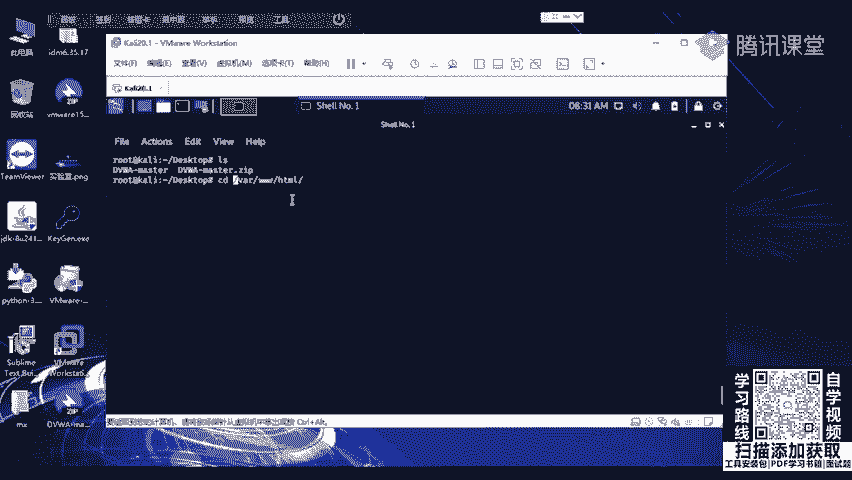

我们可以用一个浏览器。他这个。保护浏览器来打开看一下。这样的话呃，因为在虚拟这里边的话，可能会比较慢一点。我这样的话先。把我们的一个。把我们的这1个DVWA的一个文件夹。

把它给复制到我们的一个web跟目录下面。然后的话把它命名为一个小小的1个DVWA。啊，复制过去啊，直接移动过去了，就移动的话就像我们的一个。啊，windows里面的一个紧贴。大家应该理解吧。

就是把我们的一个文件直接紧切过去。就使用了一个木命令，然后复制的话就是CP命令。然的话就是呃多了这样子的一个文件夹EVW这样的话我们可以先来访问一下我们的一个阿帕旗服务。因为我这里的话在本地的话。

我直接输入一个loc host。啊回车。嗯。😊，或者是说嗯除了1个127。0。0。1，也就是我们的一个本地回还地址。就可以看到这里有一个这样的一个阿帕奇2的一个默认的一个页面。

这个页面的话其实就是这里的一个网站跟目录，它的一个文件。1个H天M的一个文件。然后这里的话，我这里已经有呃。把我们的1个DPWA程序复制到了一个。报表目录。我们可以直接在后面。用。

访问这1个DV打本的一个目录。然后直接访问的话，可以看到这里有一个报错，就是说明的话我们在一个程序的话是没有配置正确。这里一个报错的话是可以看到。

我们的一个配置文件没有去做一个修改。这里的话我们需要找到这样的一个配置文件。配置文件的话，我们可以看一下是在。有一个config。的一个文件夹，我们CD进去。飞进去的话。

可以看到它是这样子的一个后缀的一个文件。但它这里提示的话是需啊需要一个这样子的一个空点INC点PP的一个文件。所以说我们需要把它做一个。命名我们这的话呃把它CP就是复制一个。

去掉后面的一个点DIST复制说的话就有了这样子的一个配置文件。是这一个我们可以来看一下。查看文件的话，在link里面是用cat。然后可以看到。嗯它里面的这它里面的一些内容，它其实这个配置文件的话。

里面写就已经写好了。呃，这一个程序比如说它的一个mycycl的一个连接呃密码。连接密码以及他的一个数据库的一个用户，以及我们的一个数据库名。哦还有其他的一些，我们需要去。呃，使用到的一些配置。

它都在这样的一个文件里面。然后这里的话我们再去重新访问。完完之后的话可以看到已经到了这样子的一个界面。再见面的话唉。再见。我直接全屏嘛。这界面的话就是我们的这一个程序的一个安装界面。

可以看到是我们需要对我们的一个数据库进行一个设置。配置以及安装。然后的话才能够去进行一个动态的一个访问以及请求。这段话要给大家说的话，就是这里这里的话有列了这样的一些信息，对吧？

大家主要的话要看的话就是这一些啊红色的字，这红色的字化，比如说这个diable disable的话就是啊。就是不允许对吧？就说我们的这一个配置它是不正确的。以及下面还有这样的一些。

我们一个个的需要做一个配置，然后解决它的一个问题。首先的话这里的一个aly yourin。这里的话我们需要开启这样子的一个UR的一个包含的一个呃功能。这一个模块这个模块的话，我们需要在一个。

HPU的一个配置文件里面去进行一个配置。他这一个配置文件的话是在PHP下面的呃。在这样的一个目录下面呃，因为你默认安装的1个PHP版本的话，它是1个7。3哦，然后的话是呃阿帕奇2。

因为我们使用的一个呃外保容器的话是阿帕奇2，然后的话有1个PHP点II，也就是它的1个PHP的一个配置文件，我们直接进去。继续的话，我们需要找到这一行alloy your include。

我们直接进行一个搜索，也就是这个。alloy your include这一行。我们需要把它更改为on，也就是开启它的这样的一个呃包含的一个功能，然后的话保存。到这里的话呃，如果没有接触过那历史的话。

可能对我的这样的一个操作会。感到困惑或者说看不懂啊。就这里的话主要的话是这1个VIM，也就是在linkux里面常用的。一个编辑器VM5编辑器，我们可以通过这样的一个命令来去进行一个呃。

编辑我们的一个文件。然后关于这个编辑器的一个使用的话，大家自己课后去进行一个学习吧。因为这个东东西的话呃。比较复杂，就是说你如果想要去讲的话，可以讲一节课的。我这的话就不去做一个详细的一个讲解了，好吧。

然后配置完成之后的话，我们可以来呃。他需要重启，就说更改了这种配置文件之后的话，我们需要重启我们的一个服务。然后我这这里的话我们需要重启我们的一个阿帕奇的一个服。我们重启的话就是restar，对吧？啊。

我们再重新访问之后的话，可以看到它这里的话就是已经变成为允许了。然后的话还有这个HPmodGD。

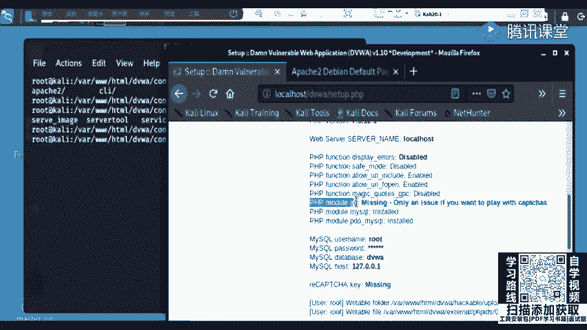

呃，这个的话就是我们需要安装我们的那个基地库。我这议他应该是已经。啱装系话。怎么讲的呢？对。Yes。需要安装我们的这样的一个。基地库啊哎，这里怎么。ello没有。嗯。呃，我这里的话先跳过吧。

因为这一个的话其实就是对那一个里面有一个靶场，它是需要使用到这样的一个验证码。就说有一个capture的一个靶场，它需要用到这个验证码，所以需要安装这样的一个基地库才能够去显示。

这样的话其实如果不做那个的话，其实是无所谓的。这样的话比较慢这个。呃，更新网络。嗯。然后的话他会进行一个下载。就是说呃前面的话是因为他没有找到这样子的一个软件包裹。

所以的话我们需要更新我们的1个APT源，也就是呃更新我们的一个软件的一个。就像应用列表一样。更新它更新之后的话就能够呃去找到我们最新的这种软件。软件包。然后这里的话直接使用命令去进行一个安装。

这里有一个交互的话是啊。就是选择我们想要安装的一个呃这个PHP。首先第一个的话它是安装我们的这样的一个最新的一个版本。啊第二个的话是就是保留我们呃当前的一个版本。我这的话就选第一个安装最新的版本。

然后就已经安装完毕，安装完毕HP的安装之后的话，我们需要重启一下阿帕奇。重启之后的话，再来访问一下，就可以看到他这里的话是已经呃安装了。然后的话。我们需要更改一下我们的一个mycycl数据库的一些信息。

因为前面的话我们是默认安装的，默认安装的话是呃那个mycycl。他是没有密码的。然后可以直接能够查看到。嗯啊不能够直接进入到我们的一个数据库。直接查看了我们的一个数据库。

然后因为在这里我们想要去连接我们的一个这样的本地的这样的一个数据库的话，我们需要更改我们的一个配置文件。就是刚刚给大家看到的那个。

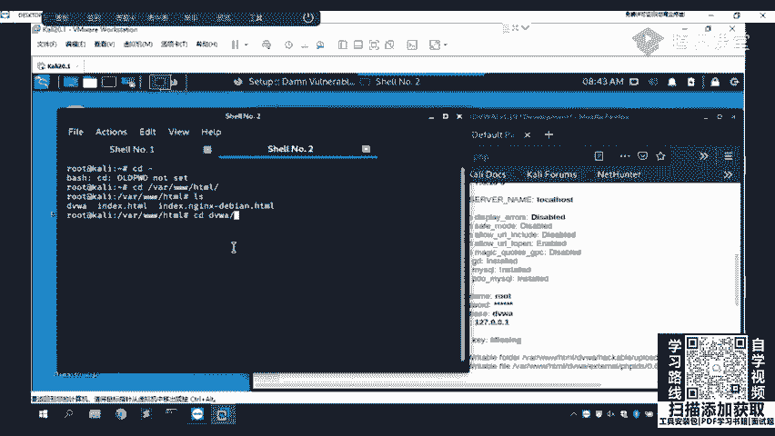

这一个配置文件，我们需要对它做一个编辑。编辑的话主要是在这里，我们需要更改它的一个。呃，密码，因为我这里的话是没有设置密码的，所以我直接把它给呃删除。当然的话如果你设置了密码的话。

你也可以把你的数据库设置一个密码。呃，建议的话还是设置一个密码，然后的话在这里添加你设置好的一个密码。然后默认的一个使用的一个数据库用户的话就是root。

然后我们想要的一个数据库的一个名字的话就是DVWA这里的话我们直接默认。是。呃修改之后的话。嗯，就是下面这里的这个。Ie kept。这人的一个keep。这你的话，这个是主要。呃，是谷歌的一个。啊。

那个是什么呢？我有点忘了。就说它是一个谷歌的一个。证书。我们需要在我们的一个呃在那个谷歌上面去进行一个添加。添加之后的话，然后的话我们可以。呃，通过一个谷歌的一个验证。

不知道大家有没有去就是说访问过国外的谷歌的一些网站，就说他会有这样子的一个啊。框就是说用来验证你的人机登录的一个框。就说你点击这一个框的话，你就验证通过了，就说明你不是一个机器人。

他就是用于这样子的一个印证。然后这里的话呃可以看到你直接搜这一个的话，它就会显示这样子的1个EVW原有。这个的话我们有一个解决方法，就是说。我们需要去谷歌的那一个网站，然后配置我们的这样的一个网站。

然后获取它的一个key。然后的话再添加到我们的这样的一个配置文件里面。

就是添加到这里，有一个私钥以及公钥。添加到这里。然后的话因为这个靶场里面有八环这样子的一个呃那个人机验证的一个。呃，绕过的一个方法。也就是说它是那个人机验证，它其实也是含有漏洞的。

可以通过方法去进行一个绕过。当然的话，这里的话因为去需要去访问谷歌，所以的话可能需要翻墙，需要科学上网。然后这样的话其实呃。如果说不不做那个的话，其实可以不用管他的。就这个keymiss呃miss的话。

我们继续看下面的，下面的话这里。有一个提示，就是说我们的这样的一个文件夹，它是啊不可写的。就是说因为这里是low嘛，就是说判断这个文件它是否是可写的。因这里是low的话，所以说它是不可写的。

我们需要给这一个文件夹加一个写的一个权限。它是在这一个目录下面。H couple宝。About。也就是这个目录。其实从目录名的话就能够看出来它是一个上传文件。appro嘛就是我们上传的一些文件的话。

会存在这一个目录下面。或者说如果你想要上传文件的话，我们需要给它加权限。嗯。首先的话我们先来看一下它的一个权限，是默认的是啊。7755默认的话是1个755，也就是。呃，这里关于这个权限。

关于这个权限的话呢，如果大家对应是不了解的话，可能不是很好讲。所以说这里的话我。啊，略过好吧，就大家可以在学习完lininux之后的话，如果对这里不是很懂的话。啊，再来看我的这样的一个。看看录播。

大家自己去学，好吧。那为奖金历史的话呃，讲这个的话会比较麻烦，我这样的话就直接操作，好吧。不同的话直接给他1个777的一个权限，也就是呃我们的一个root用户，当前的一个root用户。

以及其他的用户也能够对这一个目录进行一个啊读取。以及写入文件的一个权限。唉，可以看到改完之后的话，他这里的话就验证通过了。然后的话还有这样的一个目录。呃。这个目录话比较长。Yeah。

然后这里的话它是有这样子的1个PHPIDS点logs的这样的一个文件，它是说不可洗。哦，呃。IDS。Right。看。这个目录的话比较长，就在这一个文件需要给一个啊可写的一个权限。啊。

这里的话我直接给这一个目录，这一个temp目录给一个呃默认的话，它是1个755的一个权限，我直接给他1个777的一个权限。嗯。啊后。诶。这的话加一个杠R的一个参数。杠R的话就是说呃不仅这一个目录。

以及这一个目录下面的文件都是给他赋予了这样的1个777的一个权限。然后这里配置完之后的话，还有一个。呃，这一个目录，也就是我们的一个配置文件的一个目录，需要给他加。写了一个权限。不是个。第一个目录。

我们。默来的话，他也是呃。75，然话我直接呃，就是图方面的话，也给他1个777的一个权限。然后的话这里的话就已经配置完毕了，可以看到。好，除了这个这个的话，大家想要去弄的话，呃，自己去百度一下吧。

然后的话因为还需要去。换墙，然后去进行一个呃配置。然话这里的话我就不操作了。然后这里的话已经。可以看到的话都是哎。那什么。我这外重启一下我的1个阿帕奇服务。嗯。😊。

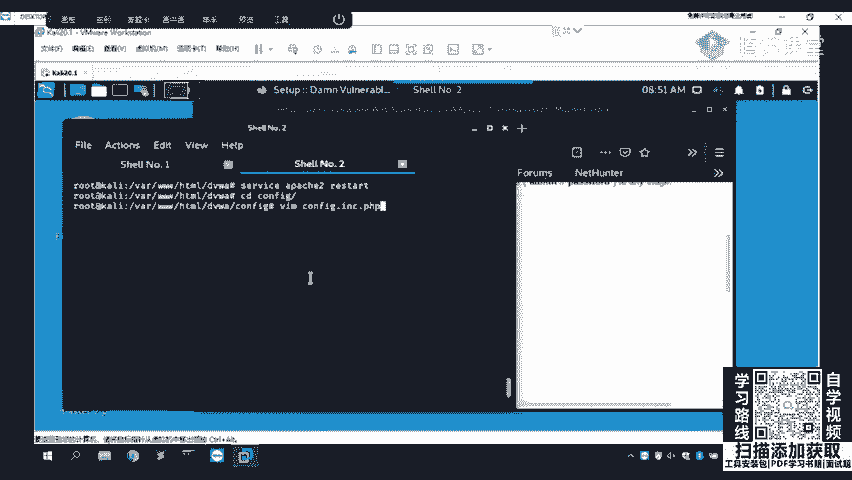

Yeah。啊，好好。Yeah。Okay。哎，我这里刚刚没保存吗？我之前设置的话是一个O。然后更改完编制文件的话，我们需要重启一下阿帕旗服务。然后的话刷新可以看到的话，这里的话是都已经变成了绿色。

也就是都配置完毕了。配置完毕之后的话，我们这里然后这里的话它显示红色的话，是我们前面的话是已经on了，就已经是没有问题了。而我们需要创建我们的一个数据库。上些数据库的话，这里有一个。问题。

就说这一个问题的话是我们在这里的话嗯。

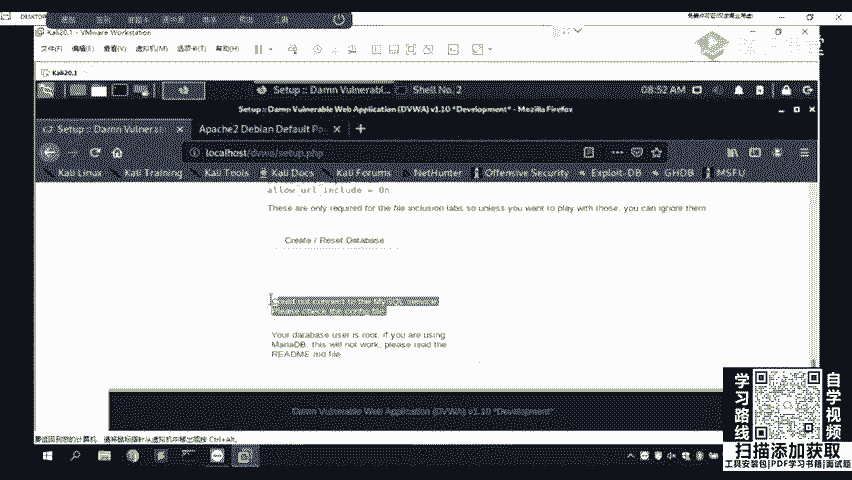

有一个在linkux里面去进行这样子的一个操作的话，会有一个问题。因为我们在这里所使用到的一个my circle的话，它是一个marry DB。然后可以看到这里它会有显示有报错啊。

就是说如果说你使用的一个数据库是用root用户，而且你是使用的一个merDB的一个。数据库系统的话，它是不能够工作的，也就是我们不能够去这样子使用root用户来啊使用这一个merryDB。然。

解决办法的话就是我们在这里。我们需要创建一个。普通用户。创建1个DVWA的一个用户。呃，命令的话就是这样子，我这里的话。呃，首先呢我们需要临近连接到我们的这样的一个数据库，也就是这个。

然后的话我们需要创建一个数据库用户。呃，我这你直接复制粘贴吧。嗯。应该能。昨天不见了，我这接我手打吧。然，这里的话是涉及到了一个数据库的一些操作。嗯。Okay。

这样的话我创建了一创建一个这样子的一个数据库。一个啊不数据库用户DVWA的一个数据库用户。然后的话我这里设置的一个密码的话，就直接设置为空。如果你想要设置密码的话，就在后面写写上里面的一个密码。

我这的话直接设置为空。系。对。Yeah。写错了吧。I d。一。啊，我给你写错了。大家一定要注意啊。听下大二啲。呃，我英语也不是很好哦，所以说。呃，这单词不是很很很好打。大家如果不是很好打的话。

就不记的话，直接复制粘贴吧。然后这样的话已经创建成功，就可以看到已经查询成功了。判件之的话，我们需要给它赋予权限。Yeah。然后给给的权限的话，我是啊给这1个DVWA的一个数据库。

也就是我们这一个应用程序主要去使用到的一个数据库。给他所有的一个权限。Or per。Yeah。Yeah。Yeah。Yeah。应该没有错。Okay。Okay。Yeah。然后这样的话已经呃执行成功。

也就是赋予了他的一个权限。然后的话我们需要用。Fresh。来刷新我们的一个权限。Yeah。Yeah。と。有点卡哦。嗯。然后刷新完完成之后的话，就是我们前面的一个命令的话，它会及时生效。及时生效之后的话。

我们呃。还需要去更改一下我们的这样的一个配置文件。因为我们这里的话不能去使用到这样的一个root用户，我们只能去使用到我们刚刚创建的一个呃DVWA的一个用户。保存保存之后的话。

我们需要重启一下我们的一个啊，我用这个吧，这个正规一点。重启一下我们的一个。好，数据库服务以及重集一下我们的一个阿帕奇。分级之后的话，我们来重新。创建一下我们的一个数据库。

创建之后的话可以看到这里的话是啊创建了数据库啊，刚一闪而过。就是已经创建成功了，创建成功之后的话，它会自动的跳转到我们的一个登录界面。登录界面的话就是这样子的一个界面。然后他默认的一个用户密码的话。

是我的命word。

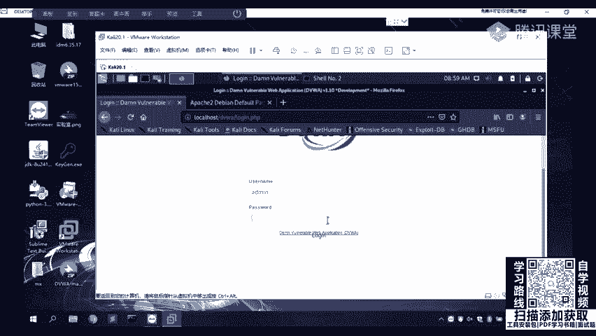

对，这是一个admin passwordword，然后就登录进来了。然后这里的话可以看到是这样子的一个样子。里面的话呃我大概说一下，有像这样子的一个，比如说呃爆破以及命令注入啊，还有CSRF。啊。

收口注入叉SS等等的这样的一些啊。一些实验的一个环境，就说像一些题目的这样的一个环境。给你。😊，然后这里的话，关于这个的话，我就不多说了。因为呃其实这个的话比较简单，而且就是里面的一些。啊。

内容都有很详细的一个教程。如果说大家对这个东西有不了解的话，或者是说不知道怎么做的话，可以啊在群里问，或者是说私聊我，好吧。然后这里的话就是在linux上面搭建这样子的。你个把。

他那个不是算是比较曲折啊，就它里面的话涉及到了挺多的一些操作。就说你需要对啊这个wordb服务啊，还有它的一些配置文件的一个路径等等，需要有一个相当的了解。所以说呃建议大家。呃。

就是说对于我想对那些没有了解过linux系统相关的一些知识的人的话，的同学就是强烈建议大家去呃从现在开始去学习使用lininux系统。大家可以就拿这一个caninux系统去进行一个操作，对吧？

而且它里面的话有很多的一些工具。大家在可以去研究一下，在呃呃自己的一些。去进行一个测试的一个过程当中，也会去使用到。对。好嘛。然后其实。就。😡，关于这一些靶场的话，大家可以去玩实验室。

就实验室里面的话就没有这样子这么复杂的一个过程啊，而且它有详细的一个步骤，有有相关的一个实验，大家可以去找一下。就是有关于这一个靶赏系列的一个它的一些呃漏洞的一个解题过程，以及它的一个利用过程。

还有他知识点的一个讲解，而且它环境是已经搭建好了的，就不用你再去做过的那个操作吧，就把时间浪费在搭建这样子的一个版本上面的话哦还是挺亏的吧。然后这里的话呃本次的一个课程的话其实就是。

教大家怎么去进行这样的一个靶场的一个搭建嘛。呃，忘了对了。忘了看大家的一个回复。大家有有没有什么问题吗？哦，还在吗？大家有有问题吗？有问题的话，在公屏扣个一吧。没有人。呃，有问题吗？有问题是吧？😡，呃。

问题呃有问题的话。建立靶场的作用。建立靶场的作用的话就是你自己去进行一些这样的一个呃学习啊。比如说你想要做一个，比如说这样的一个命令注入，对吧？你想要去学习关于命令注录的一些知识，对吧？

你你去哪里学习呢？你想要去学习这些东西的话，如果说你自己去你刚开始还不是很很懂去找这样子的一些漏洞的话，就是说这样的一个靶场的话，就是正好弥补你学习的一个啊空间。就主要是用于你去学习知识嘛。

通过这样子的一个靶场。啊，你可以在啊你学习到了相关的这个漏洞的一个知识的话，你可以在这里自己去进行一些操作来啊使用你自己的一些攻击的一个方式来查看你攻击的一个效果。为啥在看里上在看里上的话呃。

你也可以在其他的一个系统上面。比如说windows windowsow的话呃，我这里。也会讲怎么去部署。哦，为什么说在咖里上面的话，其实。嗯。看里因为它是一个lininux系统，对吧？

我只是以car里这一个linux系统做一个啊。例子。😡，然后的话是在这个上面给大家做一个操作。因为上节课的话是讲的话是这个看嘛，对吧？当然你也可以在其他的一些，比如说呃。sals对吧？

red heart这样的一些。操作系统上面去进行一个操作嘛，对吧？你也可以，你也可以在上面去进行一个搭建的。

windows windowsow上面的话确实方便多了。因为大家习惯性的话也是使用的一个windows操作系统嘛，对吧？就呃相比于lininux的话，呃，你没有去系统那个去学习的话。

去使用的话可能会有难度吧。对对对，就是这样的一个意思。我们的一个网实验室其实也是基于这样子的一个目的。就是说让大家来在这个实验室上面去进行这样的一个操作。然后的话就是节省了这样子。

我们刚刚讲的一个环境搭建的一个过程，节省了这样的一个时间，对吧？然后让大家呃就是专心的去研究怎么去学习这样的一个漏洞的一个利用。但话如果说你自己想要去研究呃相关这些漏洞的话，你可能也会去使用到。

也会去涉及到自己去搭建这样的一个靶场。就比如说刚开课的时候，有同学问我说搭建CMS的一个靶场，对吧？也是其实跟这样子的话，我这里的一个操作其实是类似的。

就把你一个CMS斯的一个靶场放到这样的一个word目录，对吧？然后的话进行一个搭建就可以了。然后可能会需要做一些啊配置文件的一些修改等等。See。大家还有问题吗？呃，就是windows的话。

因为时windows上面去进行一个操作的话，因为时间关系的话，我们留到下一节课再给大家做一个讲解吧。因现在的话已经呃。又加班了10分钟左右了。十多分钟了。在windows上面的话，其实。呃。

搭建的话会比在那上面会紧单很多，因为他没有他没有在windows上面那样子嗯。好吧，他们有在历史上面，这样的一个权限的话会。呃，那么控制的那么严格，在外的上面的话，它一些权限的一个配置的话。

它是没有那么严格的。root用不了浏览器吗？能能用啊。你看我这里的话，不是呃已经启动了一个浏览器吗？呃，浏览器的话，大家可以。就不限在windows里面的话，你可能直接就呃在这里就能够找得到，对吧？

你在这里，你点击右上角这里不是有一个搜索嘛，对吧？你搜索你直接搜索by Fox嘛。by f第一个就是火狐的一个浏览器，它是一个开源的，还有谷歌也有啊。com这一个。上面的一个we web浏览器。🤧嗯。

😊，还有还有疑问吗？如果没有大家没有问题的话啊，我们今天的一个课程内容内容的话就到此结束了。好吧。啊，没有问题的话，那我们。今天的一个课程内容就到此结束，我们下课。啊。欢迎大家啊我。😊。

谢谢大家的一个收看吧。好，我们明天再见。大家早点休息吧，现在时间也不早了。好吧。好。

呃呃，闲话就不多说了。我们这是开始我们今天的一个课程内容。我们今天的话讲的是一个java以及python环境的一个安装。就就说为什么要讲这一个环境的一个安装呢？

就是啊因为我们后面所需要到的所需要用到的一些工具，都是要需要这这一些环境的，只有在啊你电脑上面有安装有这些环境才能够使用一些工具。然后的话便于我们后面的一个讲课。🤧嗯。首先的话嗯在讲环境安装之前的话。

呃，把我们上一节课没有。呃，因为时间关系没有来得及讲完的一个内容呃，做一个补充。在这个的话我们讲到了呃利用LAMP的这种。架构来部署我们的1个DVW的一个漏洞靶场。哦。

这里的话我今天的话我们补充一下在windows上面如何去安装这样的1个PHP study的一键呃，集成环境来安装我们的一个。DBW以及其他的1个CMS等等。

首先的话我们先来了解一下什么是PHP study。HGHP study的话是1个PHP的一个调试环境的一个程序集成包。然后的话它的一个功能的话还是是比较强大的。

而且的话它的一个最大的一个特点就是呃它里面有集成有很多的一个环境，不需要我们再做呃其他的一些呃安装。我们直接能够一进去创建网站，还有数据库FTP等等。而且它里面有自带LNMP及LAMP。

所以的话我们直接只需要安装这样的一个软件，就可以完成我们前面的这样的一些环境的部署。呃，这里的话是它的一个官网，大家可以去。看一下。这话呃。这个软件的话是做的挺好的。

而且就是便于我们去搭建自己的一些环境。咳。诶。Com。然后下载的话，大家自己去官网去进行一个下载吧，好吧。呃，然后说到这个PHP study理的话，今天有同学问我问题啊。

就是呃用这1个PHP study理来搭建1个CMS的1个靶场。然后的话我看到他就是给我截图的话。他用的是一个呃18年的一个老版本的1个PHP study。在这里的话，我要提一下的话。

就是呃不知道大家有没有了解到，就是说这个老版本的PHP study的话，它是有后门的。就说它里面有一个呃可以执行命令的一个后门。

然后如果你自己用的一个老版本的PHP study部署的这样子的一个wordb环境的话，它可以直接通过这一个后门来执行命令。然后的话来达到操控你电脑的一个目的。呃，关于这1个PH大底。

这个漏洞的话详细大家可以去做一下这个实验。这个PHH study的一个后门漏洞的一个复性。大家可以去自己去做一下，了解一下。就说这里的话呃因为讲到这里的话就提一下，就建议大家的话使用的呃。

最好的话是使用一个最新版本的。🤧。这的话大家可以去做一下。嗯。然后的话我们如何去用这个PH搭底来部署1个DBWA。昨天的话呃也说过也说到了在linux上面的一个搭建。

这样的话我们是在1个windows环境上面去搭建这样子的1个DBWA。

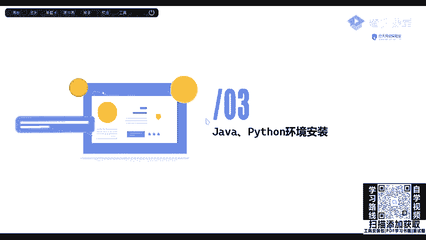

呃，这样的话我给大家做一个操作，大家可以跟着我一起进行一个。呃，安装以及部署。

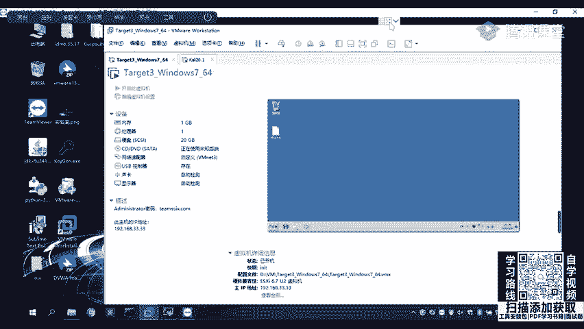

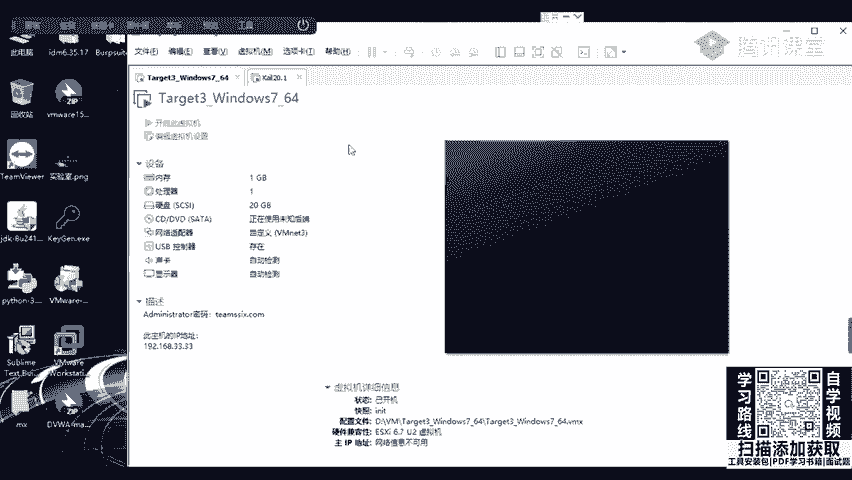

呃，首先的话你需要呃下载1个PHP study。嗯。喂。看一下啊。呃，我忘记下了吗？我这里的话呃重新下一个吧。

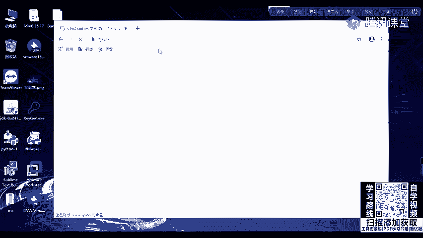

下一个这一个windows版的。最新版本的话是1个8。1，我们直接下载一下。然后我这里的话是64位的。

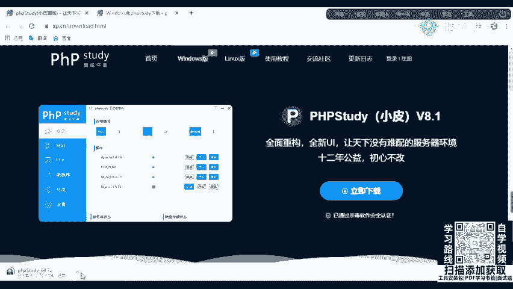

这样话我下载完毕做一个解压。节奏的话，只需要执行这1个EXE文件。这样的话我们点人要运行。嗯。稍微有点卡。

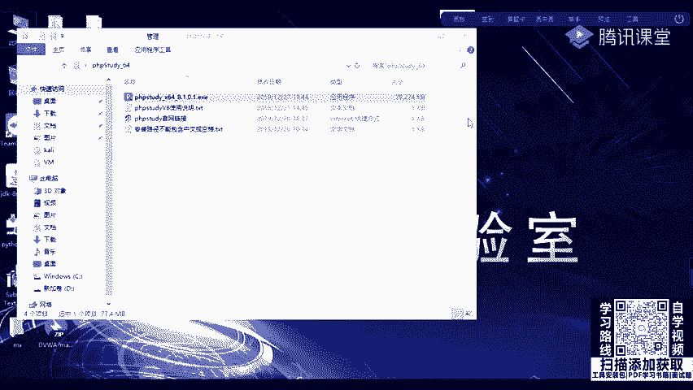

。好。没有。我机器卡了，稍稍等一下。哦，好了。

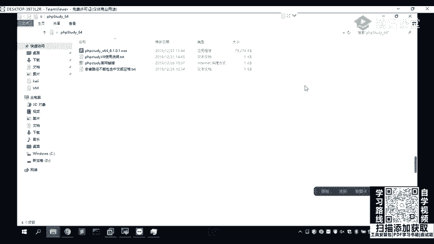

Yeah。Yeah。

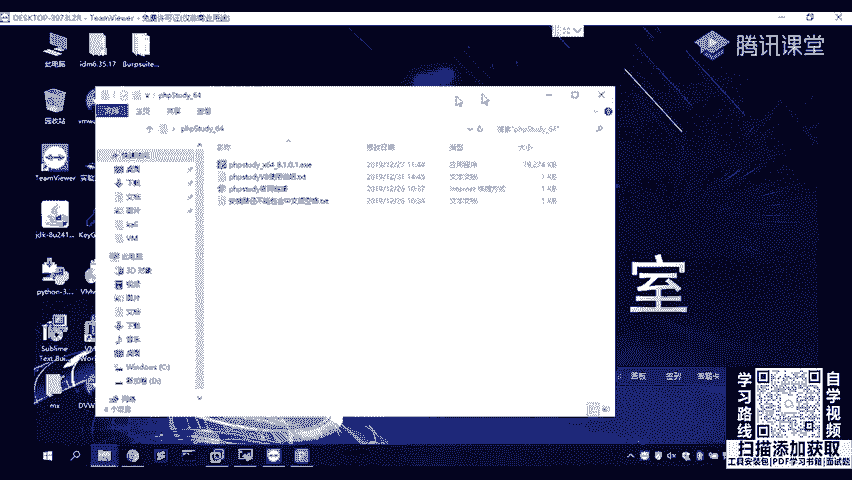

Okay。呃，不好意思啊，机器稍微卡了一下，耽误了大家一点时间。这样的话呃我先做一个安装呃，我这边的话就默认就装在这个D盘下面。啊，一起安装。Yes。Okay。啊，这里的话先等他装着吧。

然后我先用我呃自己。电脑上面的这一个给大家做一个基本的一个介绍吧，就安装完成之后的话，就是这样子的一个环境，它有这样子的一个命吧。然后这里的话我们可以选择我们想要开启的一个服务。

比如说我们想要做一个web服务器的话，我们必须要去开启这个阿帕奇，这样的话已启动就可以了。还有的话我们需要启动一个mycyclcle，其他的话像比如说FTP还有其他的一个mycyclcle版本。

大家按需去进行一个开启。还有安吉等等。那这里的话我们需要配置我们的一个网站。网站的话就是我们自我们的安装之后，它会有一个路径。也，就是这样子的1个3W路径下面啊，我这里的话是这样子的。然后的话。

在这一个路径的话，就是我们的一个wordb跟目录。然后我们只需要在这下面放我们的一个呃。放我们的一个源码，网站的源码就能够直接去进行一个访问。然后这里的话还有一个就是一个数据库的一个配置。这里。

数据库配置的话，我们需要设置我们的一个数据库的一个密码。就是说我们这里启动数据库之后，我们需要设一个密码。我这的话默认的话是一个rootroot。这样的话你也可以自己进行更改。因为在本地的话呃。

对密码的一个强度的话呃，不做要求。然后这里的话我们可以选择其他的一些。呃，环境这样的话自己大家自己去研究吧。啊，然后我这里安装好了之后的话，做一个启动。Yeah。他这个有问题啊，他这个程序。So。

Yeah。然后的话呃阿帕奇以及mysql服务启动之后的话，我们就能够去进行一个访问。访问我们本地。A host。啊，回车这里的话就是它的一个默认的一个页面。这话就说明我们的一个站点进成功了。

好的话我们接下来需要做的话，就是把我们的1个DVW的一个云码。给他放到我们的一个网站跟目录。然后这里的话它呃自己已经做好了配置，我们直接打开跟目录，打开之后话就是这样子。

然后这一个index点HTM的话，其实就是我们的那个首页，就是刚刚这一个首页。啊，我们只需要把我们。这个文件夹拷拷贝到这个目录下面，我们呃做一个重面名EVWA。🤧嗯。然后的话里面的话就是它的一个源码。

然后我们直接访问我们的1个DVWA的一个目录。完了之后的话同样都跟我们昨天一样，就是说我们需要更改它它的一个config目录下面的一个配置文件，我们需要给它做一个重面名。把后面的这一节给删除掉。

然后的话我们刷新一下，刷新之后的话可以看到。就是我们昨天熟悉的一个界面，但是在windows里面的话，它没有啊在link里面说这种啊文件权限那么严格。🤧嗯。然后问题的话还是昨天的这个这一个key啊。

这一个key的话大家可以不用去管。如果你想管的话，你想要去把它解决的话，呃，可以去百度找一下，也有别人已经有生产好的这种key，你直接放进去也是可以的。然后这里的一个U要in的话，跟昨天一样。

我们需要更改我们的这样的一个片区。的一个配置文件。ううん。😊，🤧嗯。啊，配置文件的话是在这一个设置这里，我们直接点这里配置文件，然后它这里的话有。这样的一些配置文件，就他这里已经列出来了，对吧？啊。

我们这里使用的1个PH版本是7。3。4的，我们直接打开。打开的话找到一个。You后。a lawyeryer you include把我们的这里做一个更改，改成on，然后保存。保存之后的话。

大家一定要记记住，就是说你更改了配置文件之后的话，我们最好重启一下服务。不样的话，它的一个配置不会做一个生效。更改完毕之后的话，我们刷新一下。刷新之后的话可以看到它这里的话是已经没有问题了。

啊我们直接点这里创建我们的一个数据库。啊，这里的话有一个问题的话是。我们的一个配置文件需要更改我们的一个数据库的一个信息。嗯。

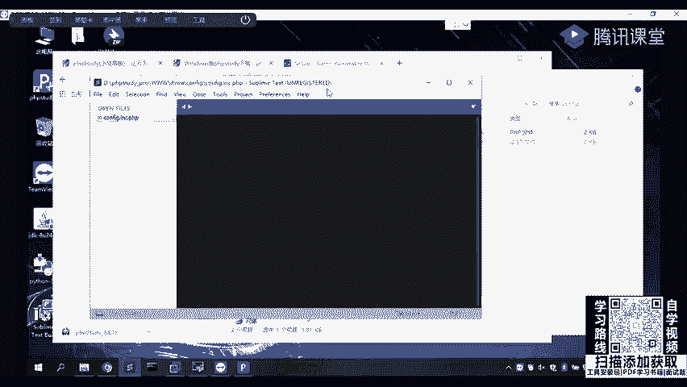

主要改的地方的话，就是改我们的一个数据库的一个密码。我们之前的一个密码的话是呃应该是root吧，我看一下。

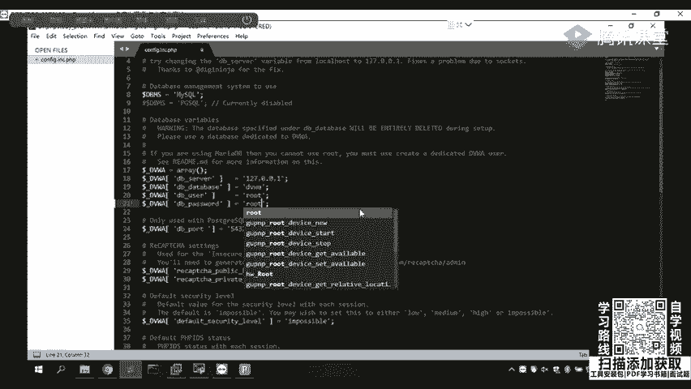

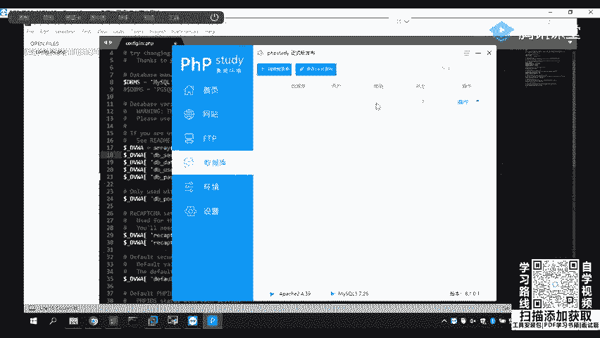

默认的话是rootroot，我们这里只需要把这里做一个更改。

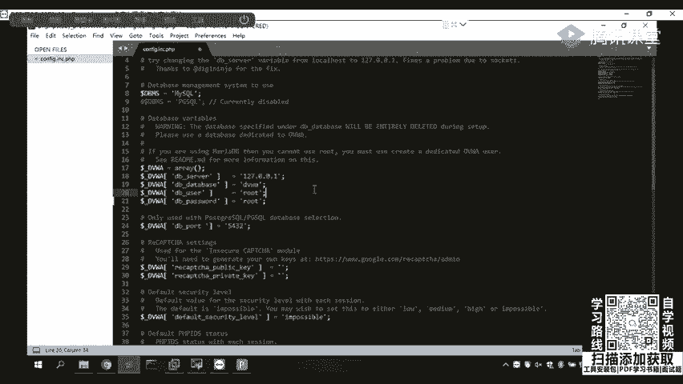

啊，保存。保，存之的话重新。创建一下，可以看到的话，这里的话已经创建成功。然后就是一个登录界面，登录界面的话，默认的一个账号密码，addmin passwordsword。

这样的话我们的一个在window上面搭建这样的1个DBW连环境的话，就已经成功了。大家可以发现的话，就是说相比于昨天我们在lining上面去搭建的这样子的一个环境的话，在wordd上面是呃要更加简单的。

而且更加方便吧。呃，可能对于就是说对于呃不是很了解ins你的人来说的话呃。在window上面操作肯定是要更加方便一点的。然后这里的话就是一个呃DBW0环境的一个部署。然后嗯。在这里的话。

我就是再稍微多说一个。今天有位同学就是问我这样子的一个问题，就说搭建一个这样子的一个熊海的1个CMS。🤧嗯。😊，然后我这里的话就以他以他的这1个CMS做一个例子，就是说嗯。呃。

教大家怎么去搭建这样子的1个CMS的一个环境。就其实跟我们在windows上面去搭建这个DBW连，其实是类似的。同样的，我们只需要把源码把它给嗯复制到我们的一个网站跟目录。

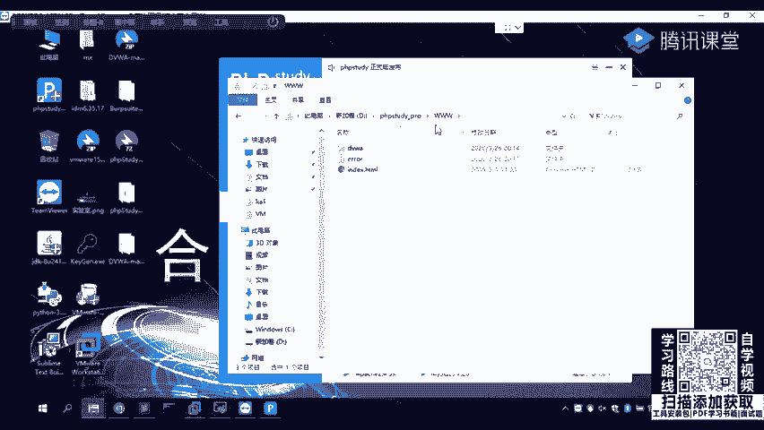

也就是也就是这个3W。俺们负责。复制的话需要稍微等一下。呃，我这里的话就不等了吧，我直接在我自己的一个电脑上面做一个操作吧。我这里的话其实已经。有安装过了。我这的话是在这一个上档的一目录下面呃。

一个这个ISEA的1个CMSS。然后这里的话我们其实就说这种CMS的话，其实大家的一个搭建其实都大同小异啊。就是说如果你们碰到问题的话，其实就是呃我下面要说到的这几点。

首先第一点的话就是你把它的一个源码放到这里的话，你。一般的话都是首先的话做一个访问，对吧？啊问你本地的一个服务。然后我们的这一个目录。然后这里的话我我们直接访问呃，我这里的话是已经搭建好了呀。然。

我这里的话是呃如果你没有搭建的话，你直接访问之后的话，就是会跳转到一个inst的一个目录下面。这个目录下面的话会有就是它的一个安装安装文件，就是访问这一个页面。我这里的话是已经安装过安装之后的话。

它会有这样子的一个就是禁止你安装的一个文件。

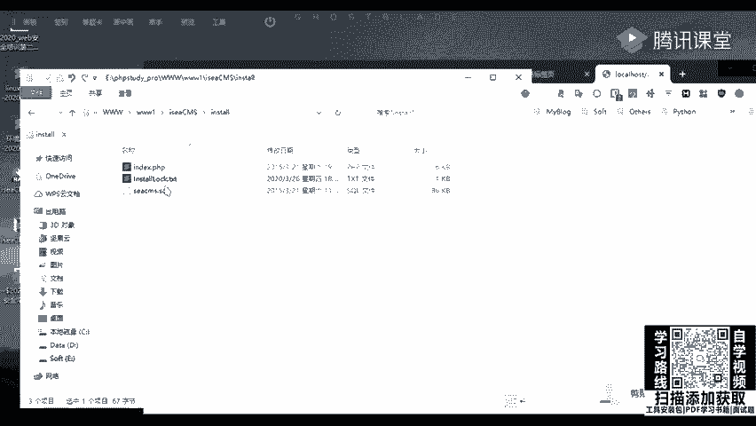

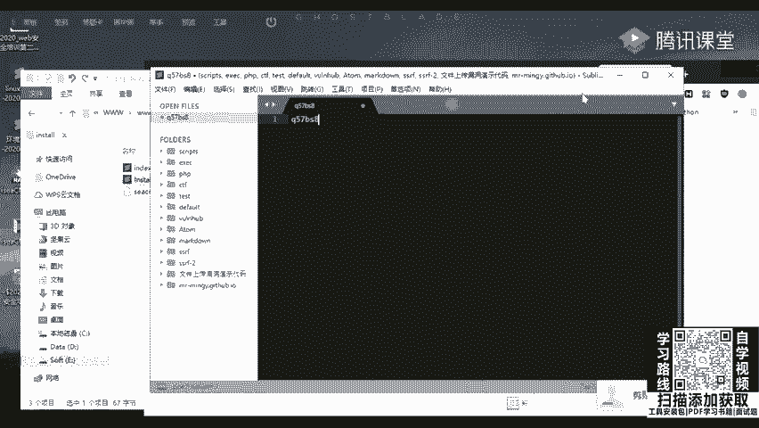

如果有这个文件的话，他就不会再继续下面的一个安装操作。所以这里的话我们需要把它删掉。删掉之之后的话，我们刷新一下，就是到了这样子的一个安装界面，对吧？啊，大家其实可以可以看到这里有一个circle文件。

我们可以打开来看一下的。这里的话其实就是它的一个一些数据库的一个操作，就是创创建表等等。我们这里访问这样的一个界面的话，其实就是呃做一个数据库的一个串表的一些操作。这的话我随便选一个写一个密码。

然后数据库的一个名称的话，我这里话是以这1个SEACMS。啊如果大家没有大家第一次进行一个安装的话，会有一个问题。就是你再去安装的时候，他会呃，我这里的话是已经有了。我先把它做一个删除。

把这个数据库删掉。🤧嗯。😊，然后的话呃数据库用户名的话是rootroot对吧？然后我们点击提交，提交之后的话，它会有这样子的一个报错。这个报错的话就是需要你创建一个这样子子的一个数据库。哎。

其实就是我们前面提到琴写的一个数据库的一个名称。这里的话大家可以自定义。我这方写的这一个，所以我们需要创建一个数据库。创建数据库的话，我们这里开一个命令行界面，创建数据库的一个命令话十分的一个简单。

Right。P the database。行。DSE然后的话接我们的一个数据库名。然后注意要以分号结尾，然后的话这里的话就已经创建成功了，我们刷新一下。刷新之后的话已经创建成功，它是一个空的数据库。

它里面也没有任何的一个数据表。然后我们创建完成之后，再做一个刷新。嗯，刷新之后的话可以看到他这里的话是在。呃，导入我们的这样的一个circle文件。

就是执行这一个circle文件里面的一个创建表的一些操作。啊，做一些配置信息的一个写入，就是我们前面设置的一个管理员的一个账号密码等等，它会写入到一个数据库里面。

然后的话这里的1个CMS就已经搭建成功了。就是这样子的。🤧嗯。😊，就大家在搭建这种CMS的话，注意的几个点就是数据库。然后的话就是呃一些配置文件，就比如说DVWA的那些。

他会让你啊需要去更改你的一个数据库的一个连接信息，对吧？🤧K。😊，就其实这些的话比较简单。然后呃其实大家之后再去研究这些CMS的漏洞的话，也会去呃做这样子的一些操作。啊，我这里提一下的话。

就是避免大家走一些弯路吧，好吧。🤧嗯。😊，Yeah。然的话，我们继续我们的一个课程内容。下面的话我们一起来了解一下java以及拍摄环境的一个安装。首先在呃安装之前的话。

同样的我们需要先下载我们的1个JDK8的一个安装包。也就是我们将java环境的一个安装包。呃。下载的一个路径的话是这一个。🤧嗯。这的话有这样子的一些版本，我们选择一个在window上面能用的就是。

windows64，我是64位的一个系统，所以下载这一个。

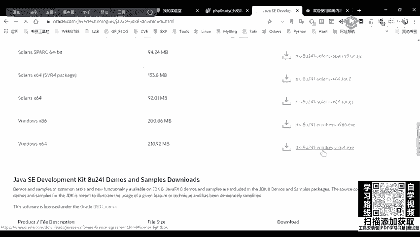

🤧。这里点击，然后他会下载。

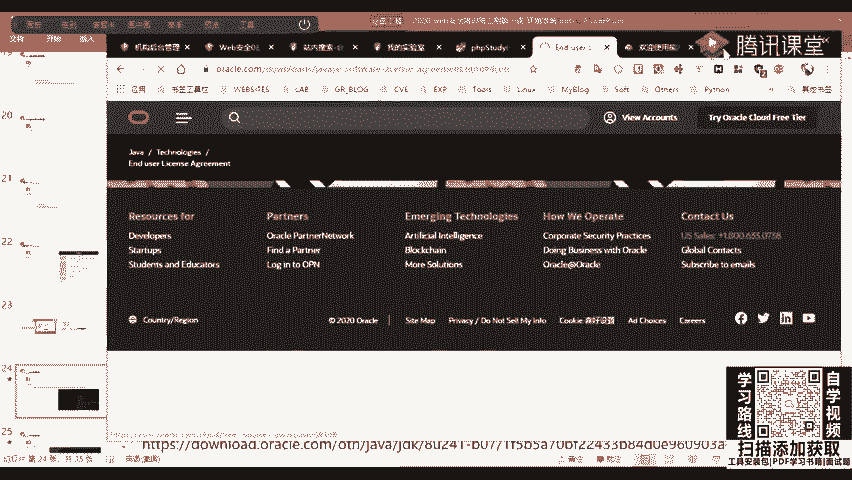

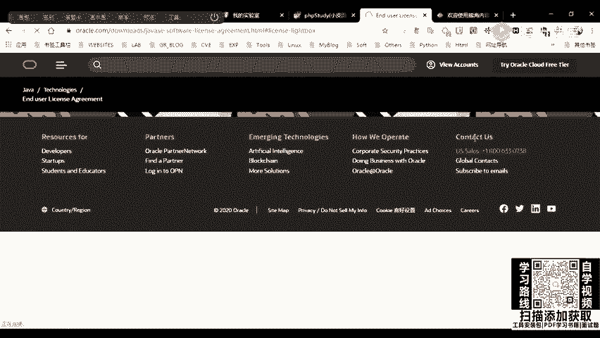

嗯，这样的话，我把链接发给大家吧。🤧嗯。😊，啊，源满的话直接网上就能找得到的。你去getHub，还有他的一些官网，还有别人发的一些。呃，人马都能找得到的。

嗯。🎼。嗯，怎么什没。

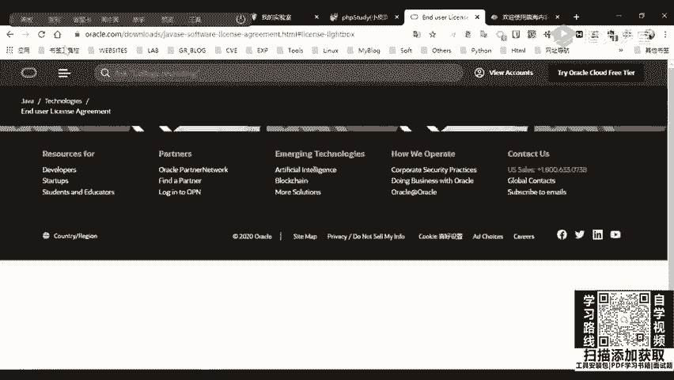

这样的话点击这一个的话，它会让你呃。做一个选择，我们选择下载这里。然后下载这里的话，就是你现在要去下载这一个呃。java对于这种JDK的一个环境的话，你需要有一个账户去进行一个登录。

因为呃orlele的话，它其实是一个收费的。一个商业公司。然后这里的话我提供大家一个网址版。就其实呃也是网上找的。这个王址的话。啊，就是。这个大佬的话，他有给一个。奥口的一个账号密码。

就是供供给我们就是有需这种需求的。人，就用他的一个账号做一个登录，就不用自己再去做一个创建账号等等什么的。那我们直接登录，然后的话。登录进去进行一个下载。嗯。可以看到我这里登录之后的话。

它立马就有在下载这样子的一个软件。对吧我这里的话就不不再下载了，因为我已经下载完了，而且它的一个还还挺大的，有200多兆呃。嗯。🤧嗯。😊，啊，下载完成之后的话嗯。我们需要去进行一个安装。安装的话。

我们其实就是跟我们安装一个应用程序一样，我们直接点安装就可以了。然后下一步下一步安装之后的话，我们需要做一个环境变量的一个配置。而，在windows里面的话。

我们需要配置这样的一个patch的一个环境变量。就是说这个环境变量的意思的话就是比如说我们配置好了这样子的一个环境变量的话，我们直接在我们的1个CMD里面。

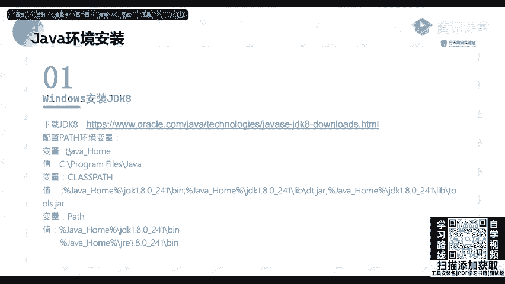

我们直接在一个我们的1个CMD里面直接能够输入java，就能够执行我们的一个java命令。这就是它的一个环境变量的一个意义。就是我们执行命令的话，它会去这一个pass环境变量里面去检锁啊。

有没有这样子的一个程序。如果有的话，他就会去执行。

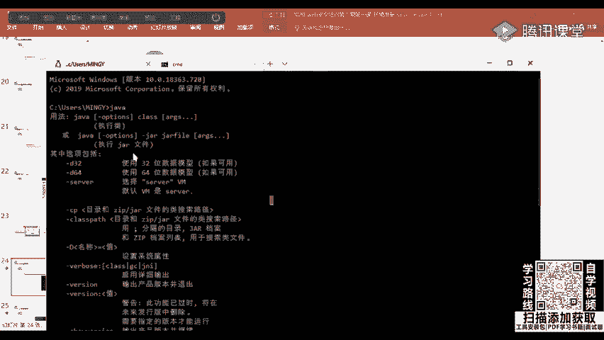

🤧嗯。😊，啊，配置环境变量的话就呃。主要的话就是这4个啊，不这三个。就是一个java home，也就是我们安装的java的一个目录，以及我们的一个class pace。

把我们java所需要的一些环境以及命令它的一个目录给添加到这个class pace里面。然后最后的话就是一个pa，需要加我们的呃JDK以及JRE。它也是一个java的一个环境。

它里面的一个并幕下面的这种可执行的一个文件，把它加入到我们的一个pas环境面量。然后呃如果你配置完成之后的话，直接在我们的1个CMD里面去执行。

在那个java或者java C就能够输出这样子的一个信息的话，说明你的一个java环境就已经配置成功了。然的话前面讲的话是在一个windows上上面的一个安装。

在lininux里面安装的话比windows要方便快捷很多。我们只需要一条命令，就是使用我们的一个包管理器去进行一个安装。样姆杠Y。然后的话呃这里第一个命令的话，y姆加一个list的话。

就是列出我们的一个当前。啊，就是这个嗯。就是安装包的这个云里面，它包含有哪一些java的一个版本？然后的话我们找到我们想要安装的一个版本，然后进行一个安装。就可以了。然后安装的话，它会自动安装。

安装完毕的话，就能够直接去进行一个使用。然后还有的话就是在那面，你可能你的一个你需要做自己的一个指定版本的一个java环境。所以说你可能呃你用样码安装这种包管理器去进行一个安装的话。

可能没有找到指定一个版本。所以的话我们可能需要用到一个源码的一个安装。源码安装的话，其实呃也是呃不是很复杂，同样的就跟在windows里面一样，我们需要去下载这样子的一个包。这样的一个包。

然后把它解压到我们的一个lininux系统里面。接之后的话去进行一个安装。然后我们需重要的一点的话，他同样的也需要去啊。就是加我们的一个。环境变量。就把它加到我们的一个linux的环境变量里面。

就是需要更改这样的一个profi的一个配置文件。把我们的一个呃JDK的一个目录等等的这样的一些classlash啊，还有java这些东西把它给放到我们的环境变量里面。

它的一个在linux里面的一个环境变量其实跟在windows里面。大家可以就是理解程市一样的，也是就是说你在令行里面去执行命令的话，它会去检索我们的这样的一个环境变量，然后找到这样的一个程序。

如果没有程没有这个程序的，没有找到的话，它就会执行失败。🤧嗯。然后呃安装完毕的话，我们可以输入java杠V来查看我们当前的一个版本。然后的话如果看到这个的话，就说明我们已经安装成功了。

然后的话我们一起来了解一下在。windows上面去安装pathon的一个环境。就说在现在的话，pathon的话呃。python的话是使用的越来越广的一个编程语言了。就是大家如果想要去从事这一块的话。

python是强烈建议大家去进行一个学习的。而且在大家的一个工作日常生活当中也。掌握这样子的一个pathon编程语言的话，会有很多很大的一个方便，就便于自己的一些呃呃使用。

那这样的话我呃介绍一个就是在windows上面的1个APP啊，不这个微软的一个应用商店里面，它现在的话已经有集成了这样子的一个python环境，有python3。7G3。8的一个版本。

大家可以直接在这一个应用商店里面去进行一个安装。然后的话如果你不使用这一个的话，呃，因为这一个微软上面的话。诶。我反正是没有使用套使用到它的这一个版本。就是我看他底下的一个评论的话。

说这一个呃在这个上面安装的这个版本的话是会有问题的。就是比如说你在ID上面需要去调用这样子的一个开审那个环境的话，它不会去啊找到那个安装的一个目录，所以说可能会有问问题。

所以说呃这里的话我介绍第二种就是呃用在python官网下载它的一个安装程序，然后进行一个安安装。呃，路件的话就是这一个。Yeah。我发给大家。直接呃直接下载这样的一个版本就可以了。

这样的话我呃使用的是1个3。7的一个版本。嗯，现在的话3。83。9都有了。呃，3。7的话，因为就是之前也是用的这个版本，而且就是比较稳定吧。大家可以去安装那个版本。然后在安装的时候的话，呃。

大家去选择这一个安装的时候选最建议大家选择这一个自定义安装，然后安装选择自己的一个强安装的一个目录以及。一定要注意的话，这里有一个A的配python3。7 to pace，就是我们勾选这个的话。

它会自动把我们的一个pathon的一个环境，pathon的一个目录程序的一个路径，它会加入到我们的一个paon环境变量当中。所以说我们安装完之后的话，直接能够在CMD里面去执行呃执行path。

然后调用我们就是执行我们的一个pathon程序。嗯，这样的话呃。看自己的一个需求吧，就是呃要注意的话，这1个PIP是一定要去做一个勾选的。就是我们在后面KIP的话。

它其实就是一个pathon的一个包管理器。就是说我们可以通过这个PIP来去安装我们的1个paon的一些库。然后这的话选择它的一个安装路径。呃，看大家自己的一个呃需求，也可以选择在C盘，也可以在其他的盘。

然后在lininglinux里面去安装pathon的话嗯。首先的话我们先介绍一个就是源码的一个安装吧。就说在历s里面的话。我们通过这样子的一个源码去安装。在安装之前的话，我们需要安装一些环境。

也就是一些工具。首先我们的一个we get。一概的话是一个ux上面的一个下载的一个工具，以及GCC是我们。呃，去进行一个云码安装，需要对这一个。啊，程序做一个编译。

还有一些需要的在后面去进行一个编译的时候，需要到的一个呃库。这个la for eV。呃，这样的话呃我先给大家大概介绍一下吧。等会的话呃，如果有时间的话，再一一的进行一个操作吧。呃。

linux安装之后的话，我们需要创建一个这样的一个软链接LN。来创建一个软链接。软链接的话就是呃大家可以理解成在windows上面的一个快捷方式。

就说我们把我们的这样的一个呃在比如说在低盘的一个目录下面的一个文件，把它创建一个快捷方式到桌面，对吧？然我们直接在桌面执行的一个快捷方式的话，就能够啊执行在这一个目录下面的一个程序。🤧嗯。😊。

啊的话安装完之后的话，我们还需要啊有必要去安装1个PIP。这一个pathon的一个包管理器安装的命令话，安装pathon三版本的话是python3杠PIP。然后还有一个的话就是要将我们的这个paon。

的一个并目录并目录下面的话就是呃python的一一些执行程序。我们需要把它加到一个环境变量当中，就能够直接在inux呃命令行当中去输入python来调用它。

。呃呃，亲这里的话先给大家做了一个基本的一个介绍。下面的话我给大家呃一一的做一个操作演示。首先的话是在windows上面安装java。啊，不知道大家有下载好没有。

或者是说大家原来是不是也有呃安装好了这样子的一个环境。阿王。问一下大家，就大家这两个环境在自己电脑上面有安装吗？没有安装吗？有。그。有的。inux上面的话，其实比如说你在can里里面的话。

它其实有自带了，就是已经自带了一个python环境，以及呃java的一个环境了。就说如果你常用lininux的话，你就可以呃直接不用去进行个安装，直接使用它使用它自带的一个。就行了。啊。

我看大部分都是有安装的啊，那这里的话我就大概呃。演示一下吧。

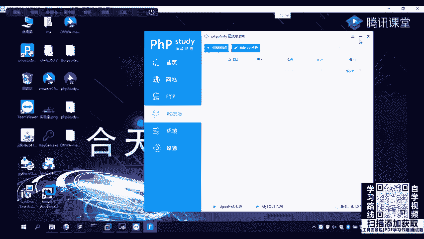

。呃。我这样的话已经下载好了这样子的1个JDK。

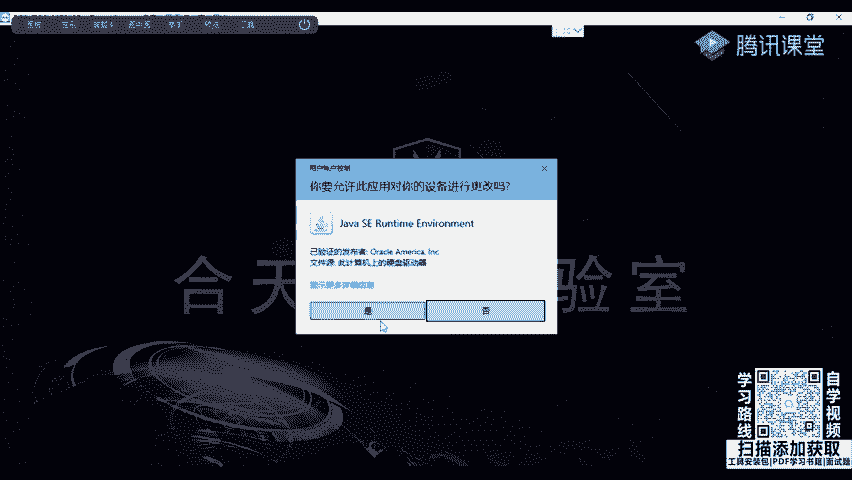

我们直接。执行。安装的话，这里的话呃。这些都不用管，然后这里的一个安装目录的话。我这里把它。看一下我PPT，我这里的话就把它安装到这一个默认的一个目录下面。C盘的一个java。🤧嗯。呃。

然后他这一个安装的话可能会稍微耗一点时间。那这里的话在安装的时候，它会有那你去安装这样那个JRE。我们这里的话同样的就把默认就好了。然后它正在进行一个安装，在安装的这段时间的话，我们先把它放在这吧。

安装到这一段时间的话，我们来看一下。嗯。我们在linux上面去安装这样子的一个java环境。在link里面的话，我们先呃我用我的这样的一个机器。

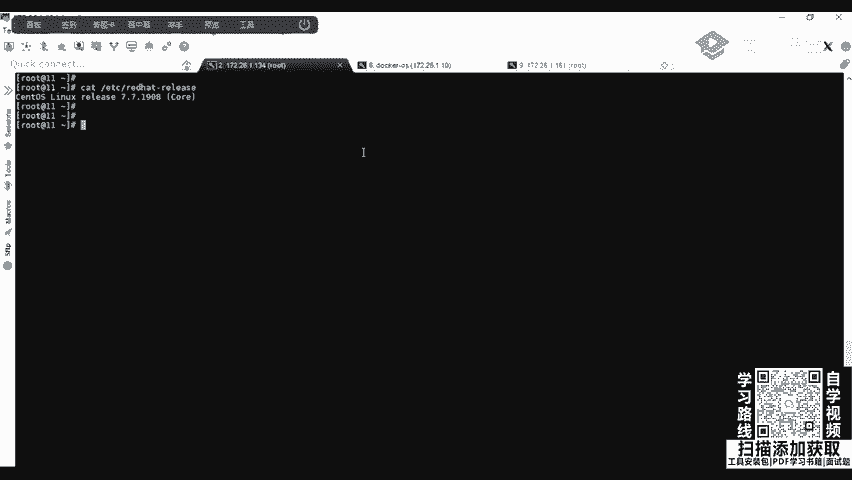

。呃，我用这个机器吧，这个机的话是一个呃相27。7的一个机器。

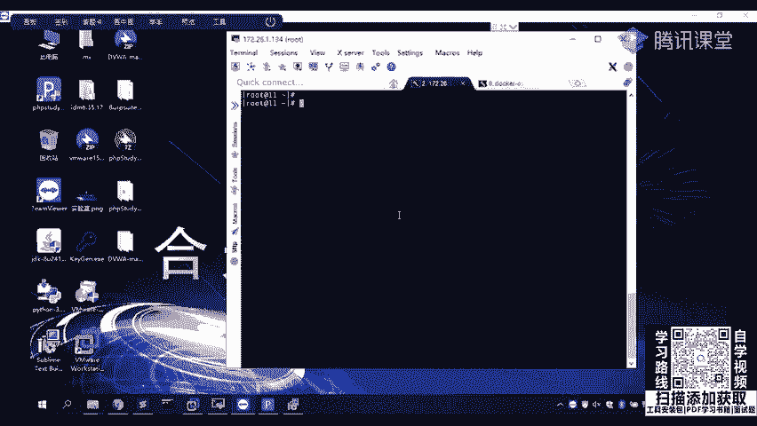

我们看一下应该没有呃，这里的话他没有安装这样的一个java环境。首先我们先y来。呃，查看一下。在我们的这样的一个样目包管理器里面，它有哪一些版本的一个java。哦。可以看到他这两话列出了这样的。

比如说有1。6版本，1。7、1。8版本的。对吧还有1111版本的。这的话我们呃就安装这1个1。8版的1个openJDK。

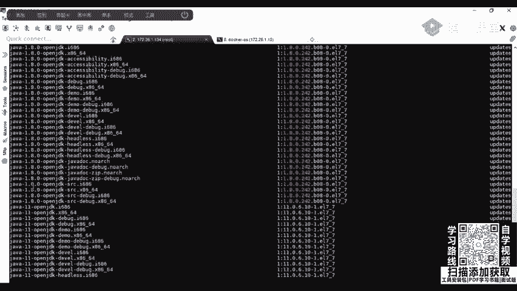

啊，我们需要安装这这样的一些东西。

这样话我直接要么杠Yinsstore。安装这个。然后这里的话我就不一一的去那个我们这里使用一个通配符。新信号的话就是说就是呃只要前面这一段是相同的，后面的话这样的一些它会做一个匹配。

它会匹配前面这一段相同的这样的一些软件包。如果是以这个java杠1。8open gDK开头的话，它都会去进行一个安装。

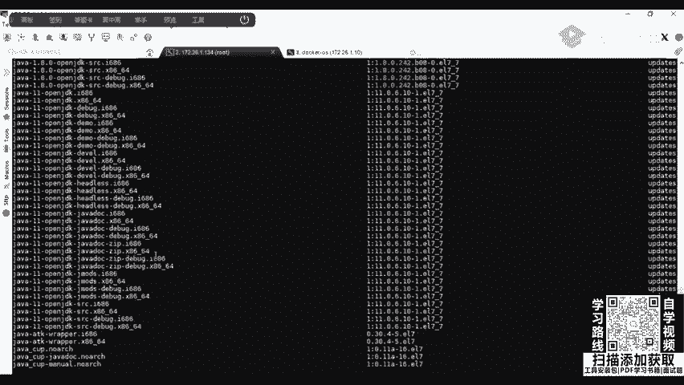

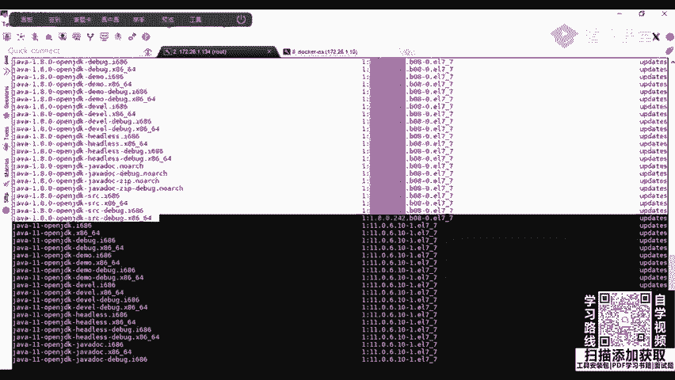

好，我们回车。回收之后的话，它它就再进行一个安装。当然的话，它的一个安装的一个时间还是呃。稍微。呃，稍微要花一点时间。然后可以看到的话，这里他要下载这样子的一个。呃，安装包一些。

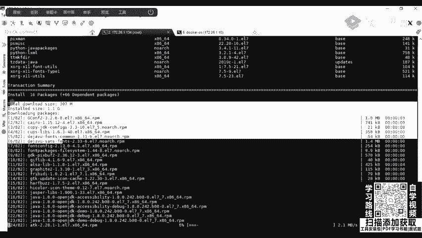

原文件。Yeah。Yeah。Yeah。这样的话我先呃。给它放在这，让它安装着。然后这里的话已经可以看到已经安装成功了，我们完毕。安装之后的话，我们可以来试一下使用java唉。

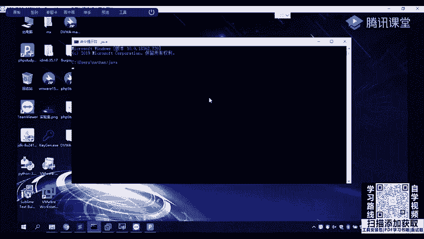

这样的话已经。

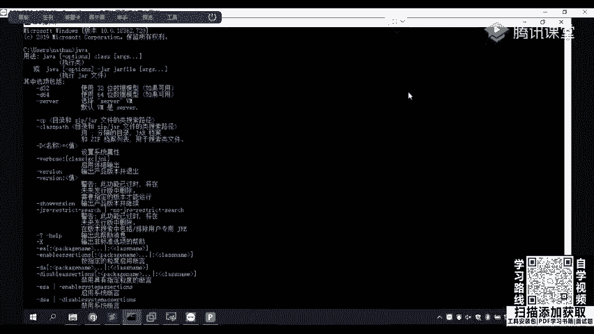

哦，这里的话。我之前的话，因为已经安装过了，我之前的话是在这里已经安装安装过了，然后的话是把它做了一个卸载。就卸载之后的话，呃，那个环境并量里面。环界变的话，在大家右击这个此电脑，就我的电脑此电脑。

然后有一个属性，属性的话点这个高级系统设置，这里有个环间变量。啊，环境变量的话，因为之前的话我已经加过了的，而且没有做一个删除。就我们需要加的话是这个我们需要新建一个，这里在这个系统变量下面新建一个。

电两面的话是java home。java home的话就是我们的一个安装的一个目录。java的一个安装目录，就这一个好把它填到这里。还有的话就是一个classpa。aspect的话，大家嗯。

我把这个发到。发出来吧。大家就照着我这样停就可以了。嗯。当样的话还还是需要做一些修改的，要根据自己的一个。呃，这样子的一个，比如说这一个JDK你的这一个名字是用版本跟我一样的话，你就可以直接这样子填。

然后大家要注意的话，前面这里有一个顶加分号开头，然后的话在后面接我们的这样的一个目录，然后是以分号做一个分格的，比如说这里一个java home的话。

就是找到我们的这里我们这里填的一个java home，对吧？就是说找到我们的这一个这一个目录。找到这个目录之后的话，这个目录下面的这个GDK然后这一个并目录。啊，还有其他的一些啊ts架这样的一些包。

把它给呃加到这个变量里面。那我们在执行的时候，它就会自己去寻找。好的话还有就是在这个pass，在这个pass里面的话，我们需要添加。把他的一个病。呃，这样的话我。在目录里面看一下。C盘的一个。知va。

这里这里的话有这样的两个目录，我们点开这个JDKJDKB并目录下面的话可以看到它都是在这样子以点EC结尾的这种可执行的一个。

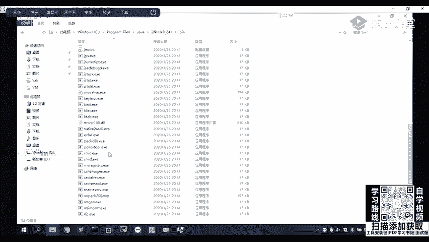

程序对吧？我们就需要把我们的这样的一些呃程序把它给加到我们的一个环境变案里面，并于我们的一个呃使用。🤧嗯。😊，啊，你配置好之后的话，就能够直接在。啊，s里里面去执行我们的一个java命令。

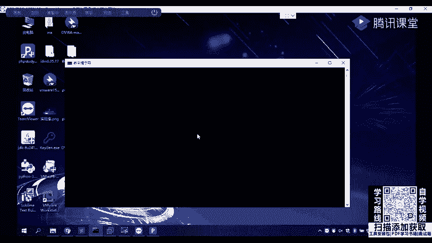

呃，然后linux的话。这样的话它所需要的一个时间会会比较长哦，大家在装的时候呃耐心一点。这样的话我就给他就先放在这吧。就在那个省面安装的话，你只需要这样一条命令，然后等它安装完就可以了。

它比如说这种环境变量的一个配置的话，它会自动帮你配置好。

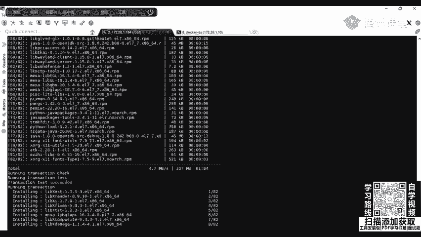

然后的话就是一个源码的一个安装。呃，原码安装的话，我这里的话就不做演示了吧。这个的话如果大家呃有这样的一个需求的话，大家自己去百度一下吧，我就大概说一下。嗯。我们首先的话需要建立这样子的一个安装目录。

就跟我们前面说一样的，我们需要建立这样子的一个。安装目录。在问的上面的话是在那个默认是在C盘的一个program，然后有一个java目录下面，这样的话我们需要自己创建一个。然后的话把我们的一个源码解压。

解压之后的话，把它呃。重命名为这个JDK8，就是它会在这样子的我们的这个java目录下面。然后的话就是做一个这样子的一个环境面料的一个添加。添加之后的话，我们呃添加之后的话。

我们就可以去直接去进行一个调用了。

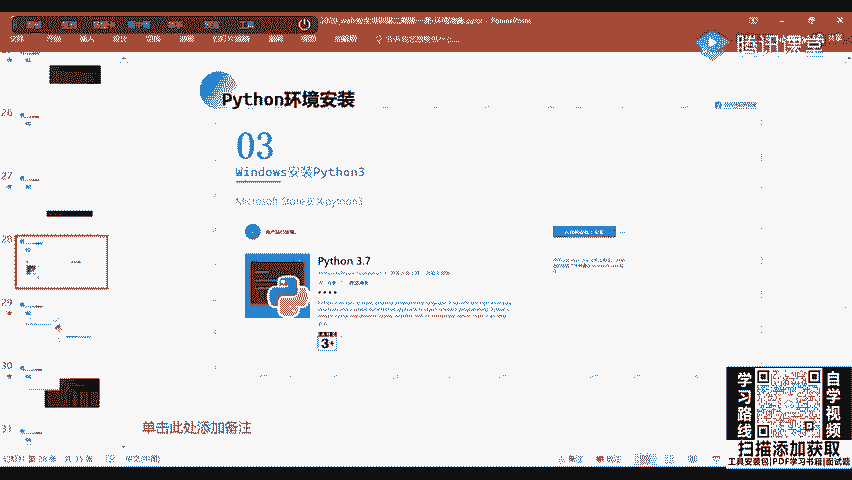

嗯。这里的话可能还需要啊，这里的话已经安装完毕了。安装完毕的话，可以看到我这里直接执行java就可以直接。

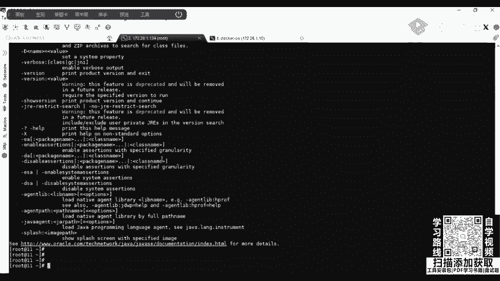

进行一个使用了。这的话就是呃java环境的一个安装，它的一个详细的一个步骤。这这个的话应该没有什么问题啊，大家的话都有安装的话，我这边讲的话是给呃。那些哦就是没有安装。跟同学听的。Yeah。好。

下面的话我们来说一下如何在。windows上面去安装我们的一个python环境。首先的话呃在windows里面的一个story，就是应用商店里面，它其实有自带的。这样子的一个pathon。

安装包我们只需要在我们的一个呃em里面挑一个paon，它就会。

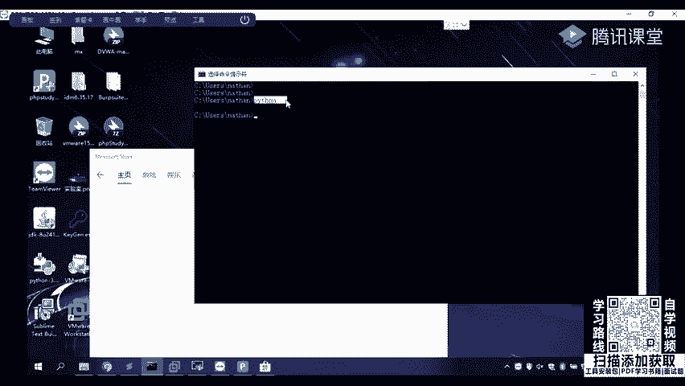

自动打开我们的一个应用商店，然后跳转到这样子的一个安装。这样的话它跳转的话是3。8的一个版本。然后我们只需要获取，获取之后它会进行一个安装。然后的话当然我们也可以自己搜一下python。

可以看到这里有3。7的一个版本。

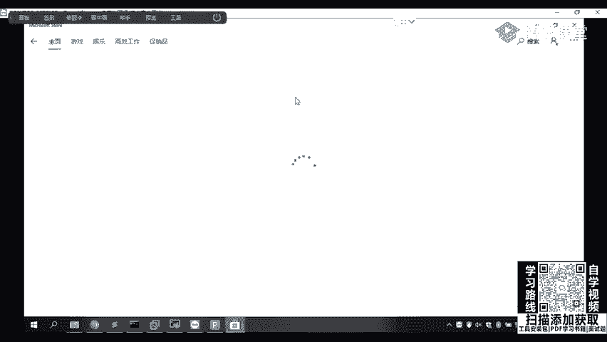

这个看自己看自己的一个要求吧，这两个版本都是可以的。

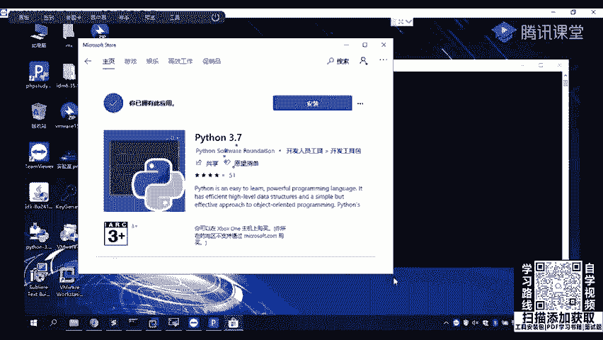

然后这里的话呃我就不去不去使用这一个它应用商店里面自带的一个版本。呃，我使用的话是。在艾审的一个官网上面。下载了一个安装应用程序。呃，大家。要注意的话，这里这一个添加环境变量有没有必要去勾选一下。

然后选择这个自定义的一个安装把这一些呃看自己的一个需求吧。像第一个的话，其实可点可不点，就是一些呃它的一些pathon的一个说明的一个文档，一些文件。然后我们默认就可以了。然，next。

这样的话我们可以自己选择一个安装的一个目录。呃说我这里的话。诶。选择在C盘的一个program file，我们新进一个。先进一个python三的一个目录。然后我们选择安装在这一个目录下面，然后直接安装。

Yeah。Yeah。嗯。嗯，这里有个问题。Yeah。Yeah。然后的话只需要稍等一下。嗯。🤧。

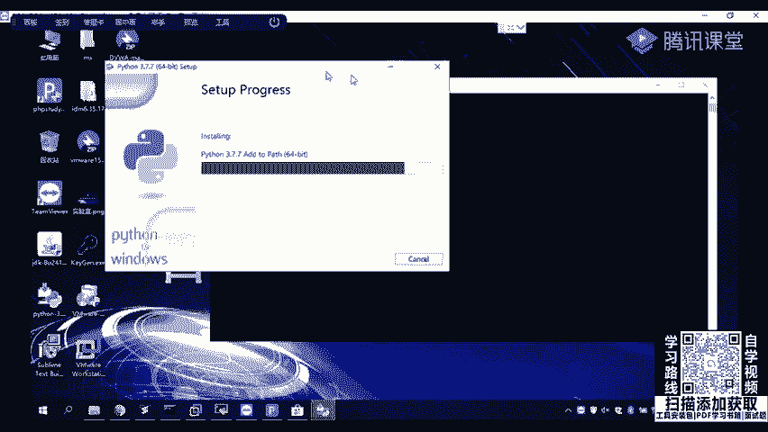

。Yeah。呃，这里的话在等了大概呃一分钟左右吧。

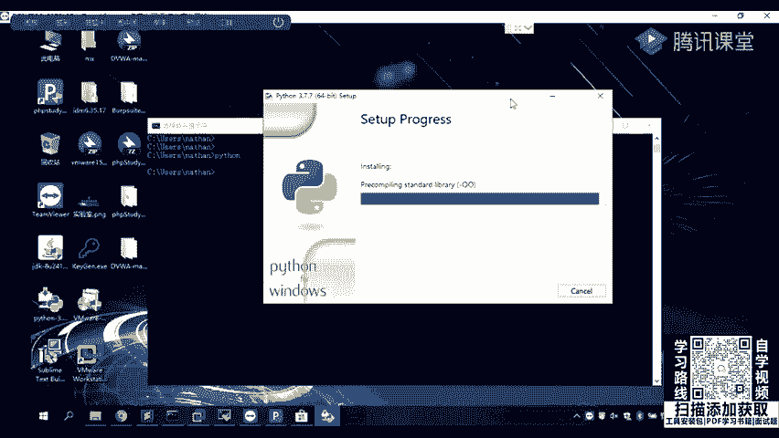

诶。你看到这这里的话已经安装完成了。Yes。啊安装完成之后的话，我们直接。在下面那面。喂。😊。

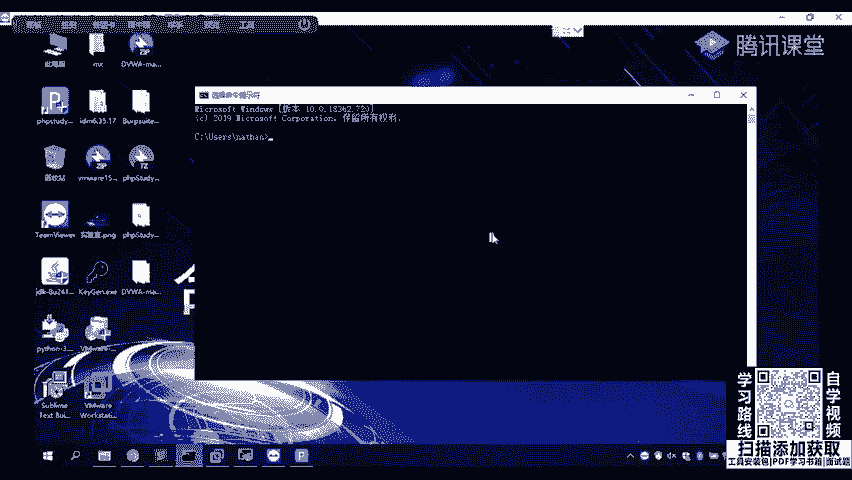

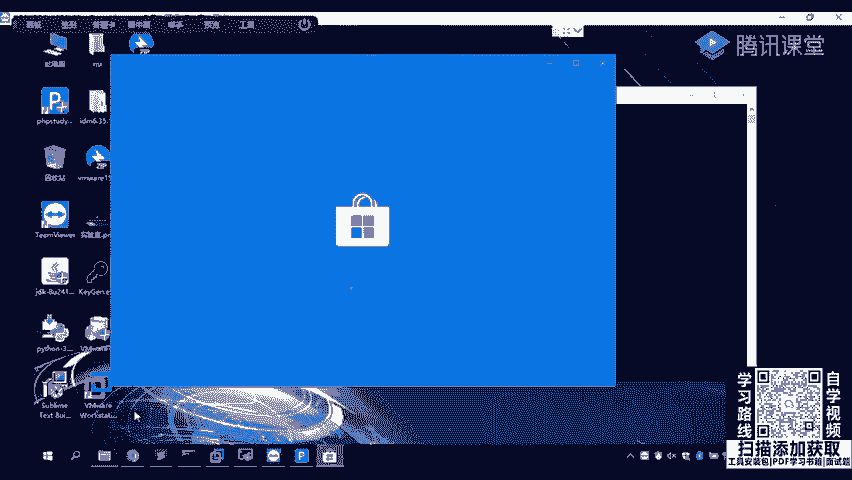

嗯。What5 pe on。

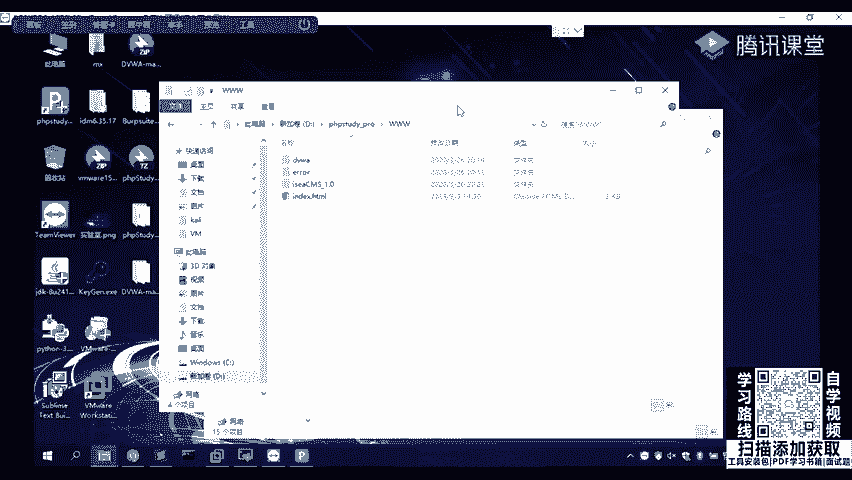

系。Yeah。他安装在这个Pthon3期的一个目录下面。嗯。

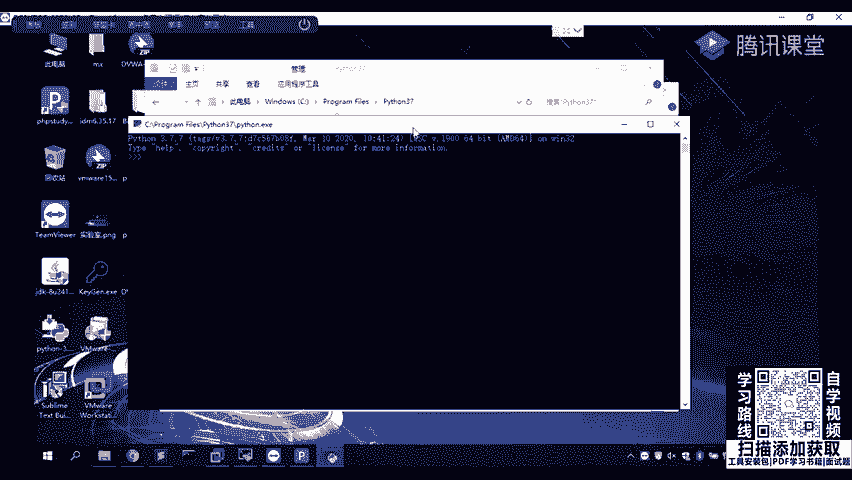

这样话我们直接执行这一个就可以了。他没加到他没有加到环境变量，我忘了勾选了吗？然后呃如果你发现你直接在下D里面查不了的话，你可以在这里加一个环境变量就可以了。就在一个pa里面。哎，那你加了呀。I行。啊。

现在话可以了，可以看到。

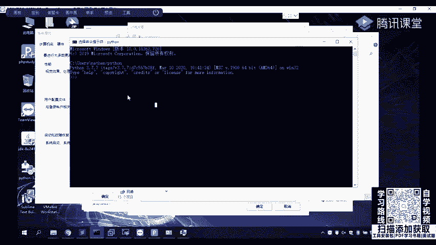

直接敲python的话，就进了他的一个。二审环境。这里的话就是一个python环境的一个安装。他这个安装步骤的话大概就是这样子。嗯。R8是linux上面的话，我就啊。

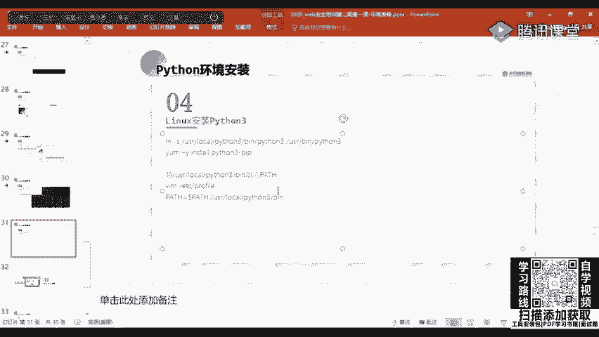

不讲了吧。然后大家可以直接去使用can里啊。使用can里的话，其实这两个环境。呃，都是已经安装好了的。

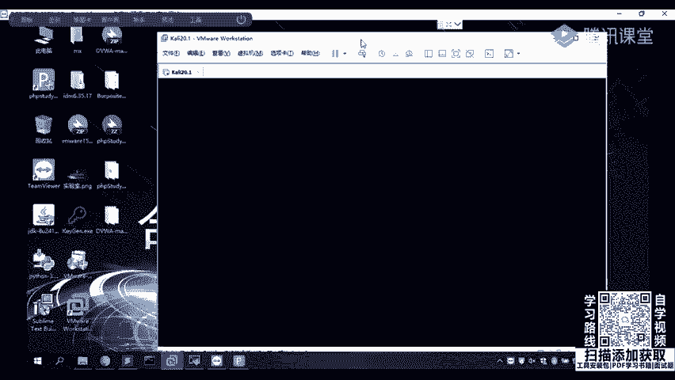

当样的话呃考虑到大家就是常用的也是在windows上面进行这样的一些操作。我的话呃在window上面。呃，安装一个的话，便于自己的一个使用，也不用直接也不用再去虚拟机里面去开一个这样的一个开里。

在pa里面的话，它其实呃已经安装好了，有两个版本的paon2以及paon3。他都是已经安装好了的。还有的话，java环境也是已经有了的。就不用我们再去进行一个安装，这就是呃这一个呃系统它的一个好处吧。

就是呃有很大的一个便利性。

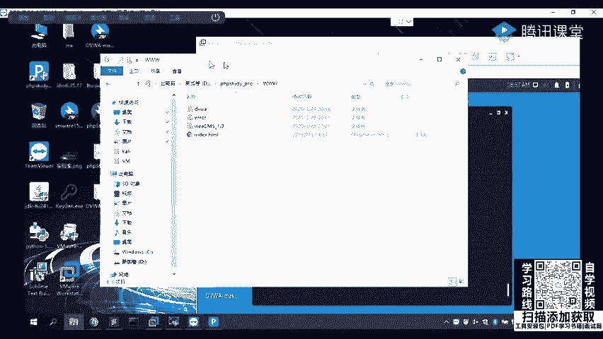

就我们不需要去准备其他的这样的一些环境。能够直接去进行一个使用。🤧嗯。😊，啊，前面的话讲到了。java环境在windows已link上面的一个安装以及python环境。在windows上面的一个安装。

接下来的话我们来介绍一下这样子的一个工具，as呃b。这样的一个工具。这个工具的话嗯。是我们之后会经常会去使用到的一个工具，而且它这个工具的话是呃。专门用用于做一些呃我们的这种测试的一个工作。呃。

之后如果大家去进行一个漏洞的一个挖掘，发现的话呃也会去使经常使用到这个工具。如果你使用的好的话，给你自己的一个这样的一个呃漏洞的一个挖掘的话，会带来很大的一个便利性。

首先的话这里的话给大家介绍一个他的一个安装啊，为什么要去介绍他的一个安装？其实这个就是在之前的一些培训里面，其实也有很多的一个学生，他就是呃我直接发给他这样子的一个。这样的一个安装包对吧？发给他。

但是他不会去进行一个使用，或者是呃或者是说是一个激活，就是一个破解。因为你因为它是一个收费的一个软件。然，这样的话我大概给大家介绍一下如何去啊。

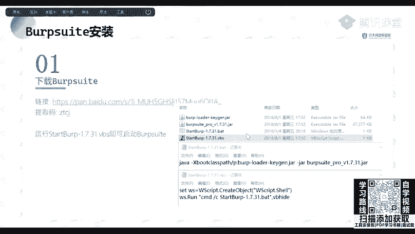

对他做一个破解以及。呃，使用吧。这样的话我把它放到了，这是我自己的一个。我把它放到了一个百度网盘，就发给大家。嗯，大家可以做一个下载，呃，版本的话是1。7。3亿的一个版本。当然的话现在的话2。1点。2。

1点多的一个版本也也是有了。然后的话在看你里面，他其实。呃，已经有安装好了的一个软件在。大家如果使用咖里的话，可以直接去进行一个使用。而且它的一个版本的话。

是如果你安装的是我这里给了一个新版本的一个镜像的话，它是1个2。1。07的一个版本。比如说比这里的话是要新的，而且。功能的话是要多一点。就是说毕竟它的一个版本是要新一些嘛。

然后这样的话我是给大家说的话是这个1。7。3亿的一个版本。然后大家下载好之后。就是这样子的一个。这样子的四个文件就说其实它主要的其实它。本来里面只有这两个文件，这下面的话是我自己加的，我自己大概就。

相当简单的学了。几个命令。就我们直接执行这样子的一个。BBS的一个脚本，然后它就会打开我们这样子的1个BP。这样的话这里的话需要做一个破解。就如果你没有破解的话。

它就会显示这样让你输入我们的一输入这样的一个license。这话我先取消。啊，首先的话对他做一个基本的一个破解。我们首先需要运行这1个BP的1个load。这是一个破解的一个补定。执行之后的话。

我们是这样子的一个界面，然后我们点这一个run。点击这个乱之的话，它就会启动这个。EPP这一个它的一个程序。启动好之后的话，它让我他这里会让我们输入这样的一个license。

我们直接复制这里的一个生成的一个license，复制粘贴啊，next next之后的话，它就会到这样子的一个界面。然后的话我们需要呃。点击这里。这里有一个呃。点击之后的话会到这样子的一个界面。

然后的话我们他这里会有提供给你一个request。然，我们直接oppy，然后把它粘贴到这里来。粘贴到这里来之后的话，它就会生成这样子的一个响应，一个激活响应。我们直接全选复制复制，把它粘贴到这里来。

Yes。粘贴之后的话，我们下一步next，然后finish之后就已经啊可以进入到我们的1个BP了。最后我们删掉。然后直接点下一步next。然后启动。这个的话就已经可以把它擦掉。

启动之后的话就是这样子的一个界面。如果熟悉的话，对这个工具熟悉的话。呃，大家对这个工具熟悉吗？就是呃也应该有去使用过吧。或者说没有使用过，但是应该也有听说过这一个工具吧。呃，都没人说话吗？看来是都呃。

没有使用过是吧？有使用过是吧？如果没有使用过的话，在呃下节课的话，我会给大家就是在讲HTP协议的时候，会给大家呃做一个它的一个基本的一个使用吧。就是它的一个抓包改包以及发包。呃，我们使用到的最多的一些。

诶功能。链接吗？呃，可以的，呃，等。等我们把这里讲完之后的话，下下课的时候，我再发到群里吧。那这里的话就已经呃激活成功了。结成功之后的话。嗯。我先把它拆掉，就如果你激活成功中的话。

如果你没有下面我这里写的这样两个文件的话，你会你首先你要去启动的话，你要去去点击这一个对吧？点击这一个，然后点这一个run。点击。呃，这里点击万造的话就到了这里，我们需要下一步下一步，然后启动，对吧？

所以说呃这里的话会有。多了这样的一个开启这样的一个步骤。所以我这里的话就啊因为难嘛。就偷懒的话就写了这样子的一个VPS的一个脚本。这其实就是执行我们的这一个这一个的话就是用来启动。呃。

启动这一个破解补丁，然后的话再启动这一个我们的这个应用程序。这是java相关的一个启动的一些呃执行的一个命令。然后的话就是。直接在CMD里面执行我们的这个脚本，然后启动这一个。

然后的话我们直接执行它执行它之后的话，它直接就。打开了嘛，就省去了中间的一些步骤，就其实主要就是为了。呃，稍微方便一点的，稍微方便一点吧。然后这个这个的话我会发给大家，大家可以去呃下载一下，然后使用吧。

然后大家对于今天的一个课程内容有没有什么疑问呢？呃，今天的一个课程内容的话大概就到这里了。呃，给大家5分钟的一个时间提问吧。如果没有问题的话，呃，我们今天的一个课程内容的话就到此结束了。嗯。

你要在虚拟机里面使用docker是吗？在虚拟机里面使用docker的话是可以的呀哦，你是说windows镜像吗？呃，windows的一个多口的话，我嗯。我只在我自己的一个本机上面有使用过。但是嗯。

我对这一个windows上面的一个docker的话不是很熟啊。就是我之前的话是试过在window上面安装这样子的一个docker。然后的话。

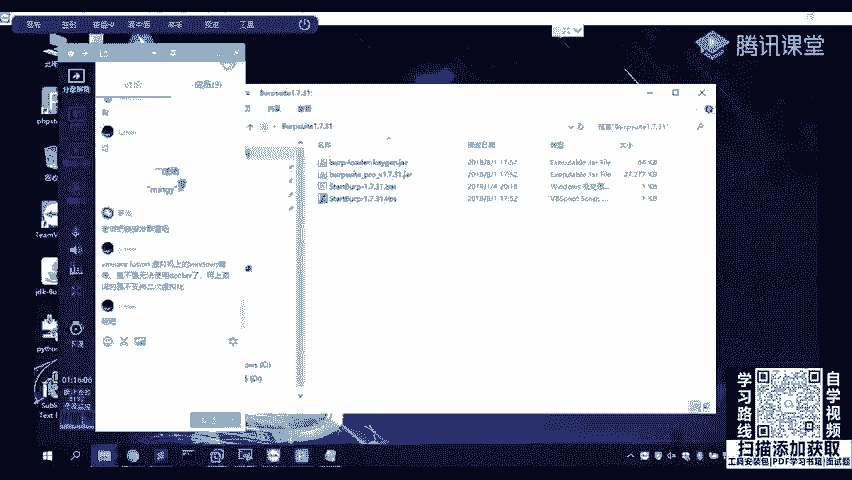

就是你安装之后的话，比如说呃我这里的话，因为windows最新它不是有这样子的1个WSL吗？还有一个linux子系统。如果你安装了这那样的一个windows docker的话。

你需要开启一个那个虚拟化的一个选项吧，还是要关闭来着。而你就不能够去使用这样的一个呃linux的一个子系统。

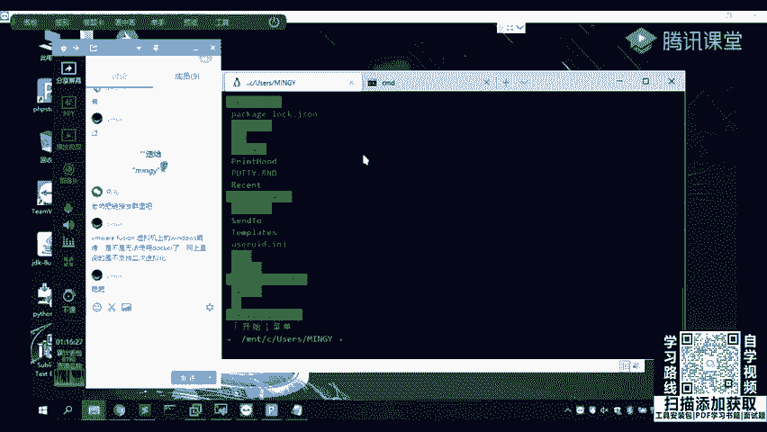

所以的话我就而且其实没必要在window上面装那个多可呀。你在linux里面去使用do口的话，还要更加方便一点的。呃，我这里的话。嗯。找一个机器。多这个。

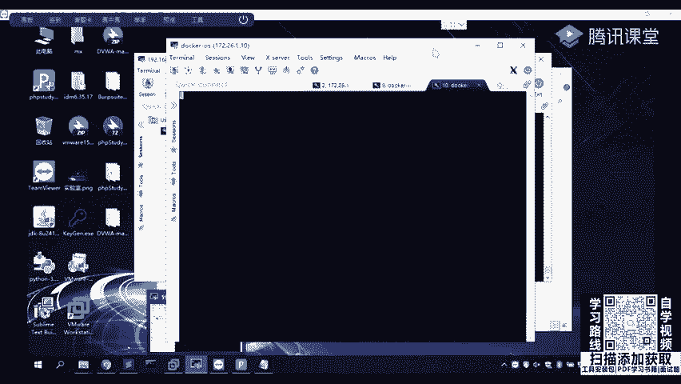

你直接在linux里面去安装这样的一个do口不是更好吗？对。而且在另时面操作多口的话，就只要几条命令的事情。在windows上面的一个多口的话，我。

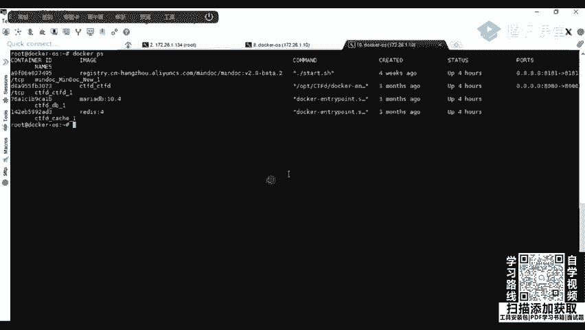

个人是不太熟悉的。呃，还有还有其他问题吗？柯莱。克莱斯这边。你搭建多的话，我建议你是使用linux吧。你linux的话你嗯。只要几条命令的事情。而且你安装的这个环境的话，多口环境的话也会更快一点。

就不用去整其他的一些操作吧，在windows上面可能会方便一些吧。但是可能但是在使用效率上面的话，我还是觉得那上面要方便一下。嗯。😊，呃，还有2分钟的时间，大家还有什么问题可以提的？可以直接提啊。

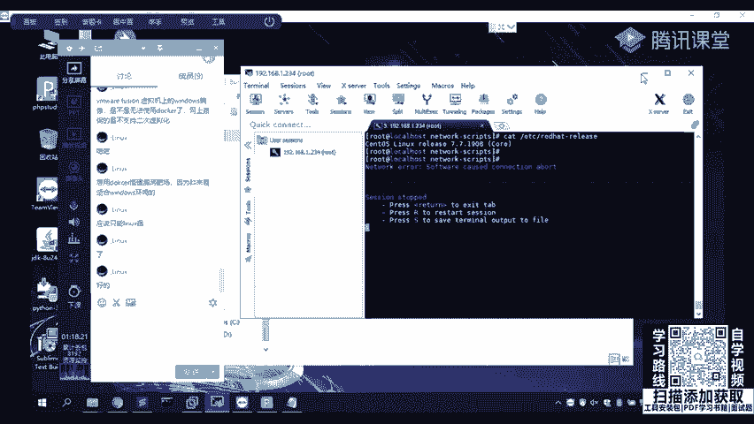

嗯。都没有问题了是吧？呃，如果都没有问题了的话，那我。我们今天的一个课程内容的话就到这里结束了。首先嗯然后的话谢谢大家的一个观看吧。我们呃下节课再见。大家呃早点休息吧。

