# CTF教程：CTF初学者必备的1000个练习题，每日一练，百日成神！（ctf-wbe／ctf-pwn／ctf-misn／ctf-逆向） - P54：XXS跨站脚本讲解 - 白帽子讲安全 - BV1dp4y1j7aN

Yeah。嗯，同样有一个就是在这里提出了一个问题，就是什么是跨站脚本攻击？跨站脚本公积的话，它是。攻击者通过网站注入点注入客户端可执行解析的拍漏的。这个拍漏的话的意思就是脚本代码。

当我们的用户这的话可能就是受害者去访问我们的网页时，就是注入了我们有害代码，就是。的网页时，他恶意的拍漏的就会自动加载加载并执行，以达到攻击者目的。那攻击者他写在这个代码里面的。呃。

逻辑可能会是为了实现一个窃取cookie，或者是呃对它进行一个恶意传播，或者是钓鱼欺骗等等。那。有一个地方就是为了避免与HTML语言中的CSS相混淆，因为它的首字母提取出来就是CSS嘛。

所以我们通常称它为叉SS。这个网站注入点是需要攻击者自己去找的，不是啊每一个地方都有我们要去找哪里，我们能进行一个注入。那注入到客户端可执行解析的这个脚本代码的话，就可能在我们这个叉SS里面。

就是我们的JS代码。嗯，我们接下来来看一下。就。😔，他有哪一些的危害？首先第一点的话可能就是能够获取我们的用户信息。比如说是我们的浏览器信息，或者是我们用户就是受害者他的真实的IP地址。

或者是我们的cookie信息。前面我们也说过，如果得到了他的一个cookie信息的话，就可以实现一个无密码登录。我们就能进入到他的一个账号。哦，里面就能切取到他的一些个人信息等等。第二个的话就是钓鱼。

我们可以利用叉SS漏洞构造出一个登录框，然后骗取用户。的账户和密码。这个怎么实现了？我们可以可能可以提示我们现在当前的你的这个登录已经过期了。然后我们用JS代码模拟一个网站的登录框。

将用户名和密码发送到我们的攻击者服务器。这的话我今天下午稍微。😔，弄了一下，可以给大家。演示一下。こと。嗯，这有一个我写了一个简单的HTML代码，在这的话可以输入我们的名字。

但是因为它这里就是过滤不严格，所以我可以在这儿直接插入一个。我们上一节课有说我们可以插入一个就是这这种就是以。s开头的就是以我们插入的一个javascript的代码嘛。然后这个SRC里面填入我们的一个。

外部的JS脚本的路径，对吧？在这里的话，我这已经写好了。嗯，我暂时这儿的话只是给大家看一个效果。接下来我会具体。讲。他是怎么实现的？嗯，在这的话，它有一个用户登录过期，请重新登录。当然我这儿写的这个。

就是比较的界面比较简单。但是它的基本功能都是一样的。然后我们在就是他这输入之后。刚才我们输入这个之后提交。提交我们可以把这一串这一串URL发送给我们的受害者。他打开之后，就比如说contrl C。

我用另外一个浏览器打开。模拟我们的一个受害者。嗯，他打开之后。这他有一个账户登录过期进行重新进行一个登录。这样的话他可能就会输入我们的一个用户名密码。登录之后，我这就就显示了一个空白。

如果你还想做的逼真一点，我们就可以直接跳到。他自己的一个页面里面去。那在这的话，其实我在这个data点HTML里面就记录了啊，我先把这些删掉。

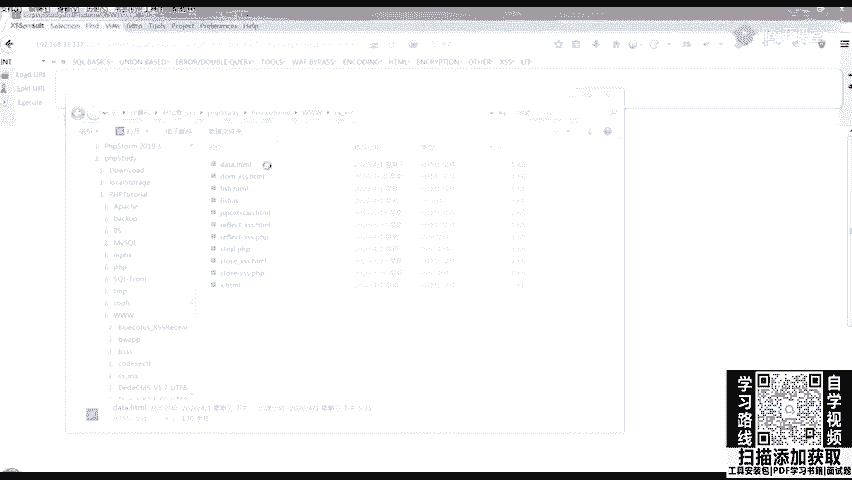

这里输入的话，我们输入123123，然后登录。这是一个空白，但是在我们攻击者这一边的话，他这其实已经记录了他刚才输入的这个。

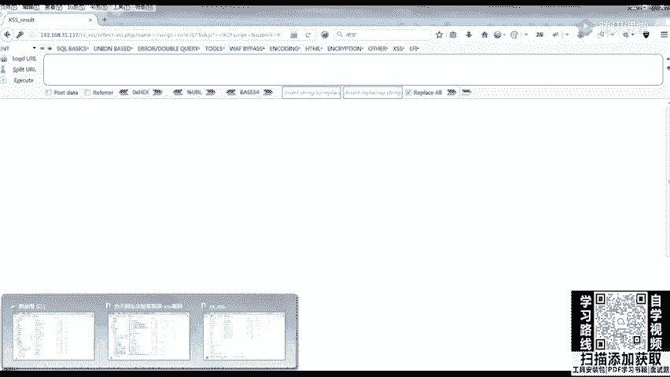

almin123123。就是显示给我们了，那这个到底是怎么实现的？我们接下来可以来看一下，这是一个简单的一个例子。

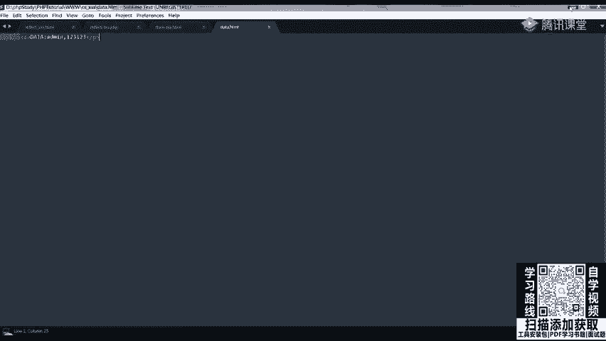

这是第二种危害，就是一个钓鱼利用我们的1个叉SS漏洞构造了一个登录框。第三个的话就是注入我们的木马或者是广告链接。有些它是在主站注入非法网站的一个链接。这这样的话可能对主站那个公司的声誉。

就有会造成一定的影响。再一个可能会有一个后台增删改网络数据等操作。这个的话可能需要配合我们后面需要学习的一个漏洞，就是CSIF漏洞，骗取用户点击，然后利用我们的JS。

这个JS的话就是javascript的缩写。然后模拟浏览器发包。最后一个可能就是叉SS蠕虫。比如说微博蠕虫，只要看过某人的微博，我们就可以自动关注那个人。嗯，还有一个就是贴吧蠕虫。

就是看过某个帖子就自动回复这个帖子。嗯，这些都是叉SS能够做到的，以及它的一些危害。那接下来我们具体来看一下这个漏洞的类型以及利用场景。它分为三种。第一种的话就是反射型叉SS。第二种是存储型。

第三种是doom型叉SS那反射型的话都主要是用于钓鱼。刚才我们那个其实就是利用了一个反射型的叉SS或者是引流或者是配合其他的一个漏洞。比如说CSRF。内存储型叉SS的话，它可能就会攻击范围比较广。

流量传播就会大。那为什么它会攻击化范围比较广，传播流量大，就等会大家就会知道，就是等会儿会给大家详细的介绍，它也可以配合其他的一个漏洞。然后多型叉SS的话，它也可以配合其他的漏洞。

而且它是属于客户端的一个。XSS，然后它的长度大小是不受限制的。那么我们接下来来看一下具体的每一个类型的叉SS。首先我们介绍这个反射型叉SS。它的特点是只会执行一次非持久型。

这个非持久型其实是对应于后面的一个存储型叉SS来说的。存储型叉SS它是一个持久型，然后它也可以叫做这个反射型叉SS，也可以叫做参数型的一个快快展脚本。

它主要存在于攻击者将恶意脚本附加到UIL的参数中发送给受害者。服务端未经严格过滤处理而输出在用户浏览器中，导致浏览器可以执行一个代码数据。可以看右边的一个攻击流程。

首先是攻击者发现存在嗯反射型叉SS的UIL。然后根据输出点的环境，构造我们叉SS的代码，就是构造能够触发嗯我们叉SS执行的一个代码进行编码，对我们的那个UIL进行编码，或者是对它进行一个缩短。

我们可以去。去一些网站对网址进行呃缩短等等。这个这一步是可有可无的，仅仅是为了增加一个迷惑性。然后我们就可以把这个。构造的这个UIL发送给我们的受害者，受害者点击链点开链接之后。

我们的叉SS代码就会执行，然后完成攻击者的代码功能。那在右边这张图的话，可以看到攻击者这边，他是通过email就是邮件的方式，把我们这一个恶意的链接叉SS的恶意链接发送给我们的受害者。

然后受害者点击之后，他就会去请求。去请求去这个3W点test，请求这个search点PHP，然后问号K等于嗯这里有个双引号，监括号，可能是闭合前面的一个标签。然后后面这个后面这个大家应该看懂。

就是这个cralSS。然后。闭合掉前面的这个script，然后他会给我们服务端没有做严格的过滤的话，它会嗯给我们进行一个响应。然后他就会在受害者的浏览器中弹出一个呃警告框，警告的内容就是叉SS。

这是一个反射型，它大概的一个。嗯，流程一个过程，反射型叉SS的。过程。那我们来看一下范射新XSS的一个利用场景。我们如何去找叉SS就可以是嗯我们看见有一些输入框或者是URL参数中。

我们就可以去尝试的修改。四。输入框这些东西里面就插入我们的1个JS代码，看看能不能进行一个。嗯。😊，注入。那我们来看一下。一个。😔，利用的代码。那在这的话，我有写一个。嗯。这有一个输入框。

它这是请输入你的一个名字。那我在这就输入一个hello。提交之后。他在这里的话会有一个welcome。hello。这个hello我们输入的这个hello，它会回显给我们。

就是在页面中在这个地方它回显给我们，我们可以查看一下网页源代码，可以看到它就是在这个地方回显给我们的。那我们可不可以就是根据上一节课的那个。内容的话。我们是不是可以进行一个尝试，比如说。

我在这儿输入H1，大家还记得吗？这个就是一个标题嘛，一级标题在这里再加上这个hello的话，我们看一下它的字体会不会变粗变大。嗯。在这里的话，它这个hello后面这一串都会变成这个一级标题。

我们可以看一下它的一个网页员代码。那在这的话可以看到它把这一个部分都变成了一个一级标题。这个地方的颜色也变了，就是它原本我们可以看到这边它原本都是这种黑色的，但是我们直接在这边输入了一个。嗯。

监括号HE之后，我们查看源代码之后，它是它变成了这种紫色，对吧？就说明浏览器已经把我们输入的这个。标签当成了我们。输入的这个HE左右间左肩括号，HE右间括号，把它当成了一个标签进行了一个解析。

同时把我们的这个hello星号变成了一个一级标题。那这样的话其实就可以。证明他这个网站是没有进行过多的一个过滤的，因为它可以输入我们的左右间括号。那这样的话，我们是不是可以尝试进行插入一些。嗯。

我们之前前面的一个sjavascript的代码。比如说这个嗯我们以这个scriptcr标签开头，然后加上一个比如说弹出一个alent一。然后再闭合。我们看一下会不会弹窗，你们觉得他会弹窗吗？嗯。

大家都说会，那我们来试一下，就是提交试一下。对他这确实就是会弹窗，我们可以右键查看一下它的源代码。可以看到在这个地方的话。对吧他直接把我们的输入的那个。输入的这一个。😔。

完整的输出在了我们的这个HTM中，没有进行一个过滤，然后这里也变成这种标签的一种颜色，就是这种紫色，而不是这种黑色。对吧。我这么说，大家能听得懂吗？就是关于这一个以及前面的那些内容。如果听得懂的话。

就打一。如果听不懂，有哪些地方听不懂的话，就打个2。嗯，行。嗯，大家都能接受。我们来看一下它的一个后台的一个源代码吧。

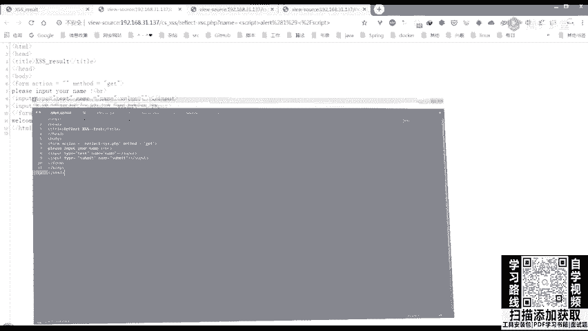

就是能够帮助我们更好的去进行一个理解。那在这的话，我们是首先到来到我们的这个reflect杠叉SS点HTMO中。然后在这儿的话有一个表格，之前第一节课也有跟大家说过，对吧？然后输入有两个input标签。

在这个action这的话，就是有一个我们的处理的。文件这的话就是这个reflect杠叉SS点PHP那我们去这个。这个里面看一下。在这的话，我们直接看它里面的这个PHP代码。在这个里面的话，他直接就去。

找这个request的话，就是去啊这个这个request就是嗯去进行一个判断这个数这个是数组里面是否存在这个Lmb。它这个里面是否存在这个lamb值？并且它的这个la值是不为空的。

那这个la是在哪儿传过来的呢？在我们这个HDML里面就是这个。Lmb这就是输入的名字名称这儿。传入过来的那如果它存在这个lamb以及，并且它们它的直部为空的话。我就把它取出来，取出来。

放到我们这个lamb这个变量里面。然后直接输出一个welcome。然后信号中间直接加上了我们这个。嗯。负值的这个lam值。所以所以说他直接一口进去了，他并没有对我们输入的。

就是我们这儿提交了这个lamb值进行一个过滤。

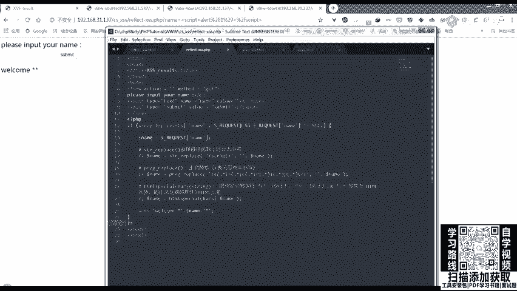

可以看到它其实这是以get形式提交的，它直接在这个UIL中显示进来了。那如果我们要对这种。

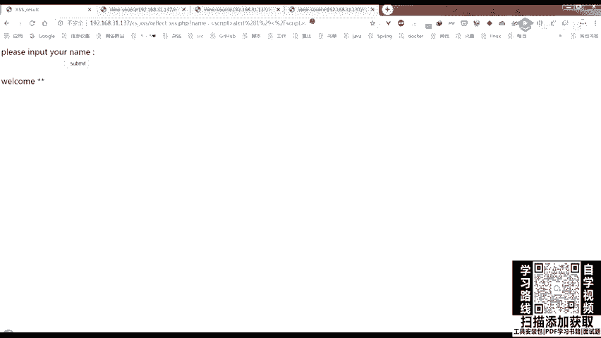

进行防范的话，那可能。就可以对这个lamb这个。它传入进来的这个值就是我们这个标签里面传入进来的这个值进行一些过滤，对吧？在我们后台这儿。比如说他有。就有几种。

一种的话就是我们直接去将它的这个screen的标签替换为空。这个函数的话就是直接替换，然后区分大小写。替换为空。那我们将它保存一下。

来看一下我们前面的那个。就是尝试的这个插入的插插JS代码能不能还能不能。进行弹出那个警告框。这的话就不可以了，而且他的那个。可以查看一下源代码。你可以看到它其实后面这个还是有一个输出。

就是还是就是没有被过滤，只是前面因为它后台代码它只匹配了这一个。

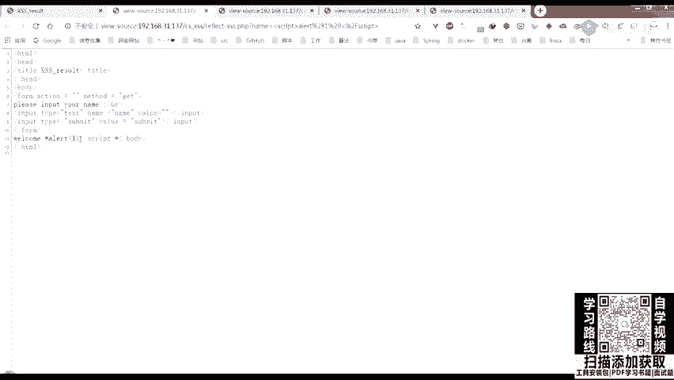

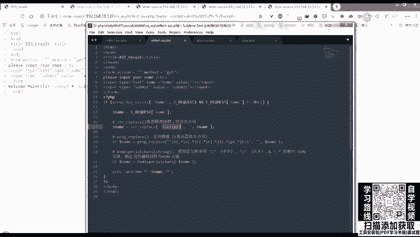

所以的话它在这里就被替换为空了，然后它就不能进行一个解析了。因为它不能识别为一个script标签，没有它没有以s标签开头嘛，所以他并不知道这是一个javascript代码，所以就不能进行解析了。

内转的话其实绕过也比较简单。这我们可以直接输入大小写。这个S是大写的。嗯，这样的话它也是可以进行一个弹窗的。对吧他这也是变成了这种紫色。而且他变成了。😔，它变成了空的话，还有一种方式就是。

我们直接在这个cr里面，这个里面再嵌一个cr。因为他他会匹配到这个中间的这个。我把。屏幕放大一点。因为他会。匹配到这个嘛，这个会匹配为空。那这样的话。

剩下的左边这个加上右边这个那是不是就正好是一个cr标签了？对吧我们来尝试一下。然后进行一个提交，你们觉得他会不会进行一个弹窗？嗯，会。😔，是的，他同样会进行一个弹窗。然后我们看一下。

它的后台的一个源代码可以看到它这的话就正好变成了一个scriptcr标签。因为它会把中间这个匹配掉，就是匹配为空。我们后台的逻辑是这么写的嘛，匹配为空嘛。

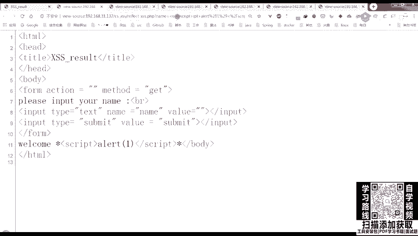

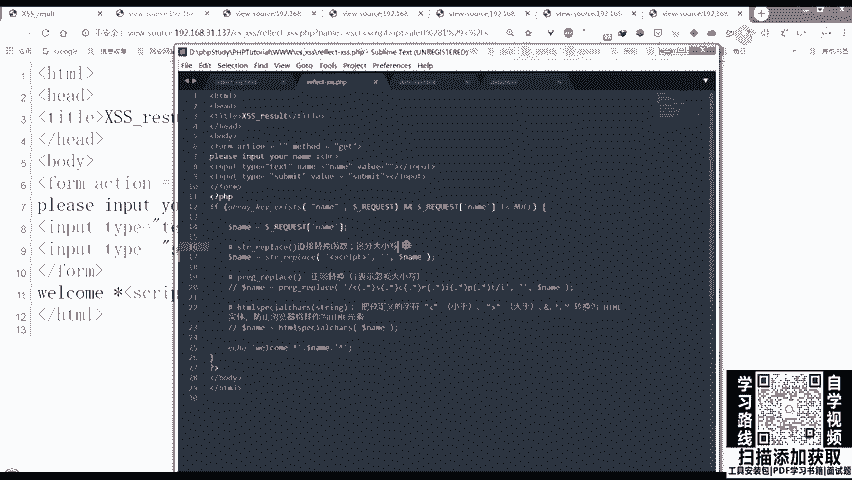

所以他在这儿的话就相当于把它去掉了。然后前后拼起来正好是一个script。这样的话他就能够进行一个识别识别这个alent一为1个JS的代码。

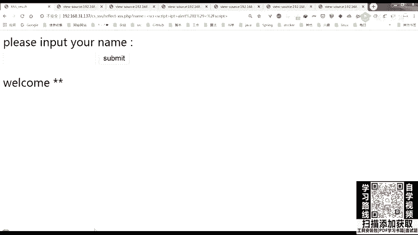

除了这一种过滤之外，这种过滤就比较的鸡肋吗？可能下面这种过滤这个的话，这个函数就表示是使用一个正则匹配的方式。像我们的lamb值里面。的。这个crre中间有很多星号，就表示你中间无论插。

就是点心这这种就是阵子匹配嘛。无论你中间插入一些其他的一些字符，只要你这个里面有一个左兼固号SCRIPT。这样的一个字符的话，它都会把它匹配为空。然后这里有一个I的话是忽略大小写，这个I是忽略大小写。

那这样的话，我们可以来看一下刚才的我们那种。方式是不是可以？还能不能使用？

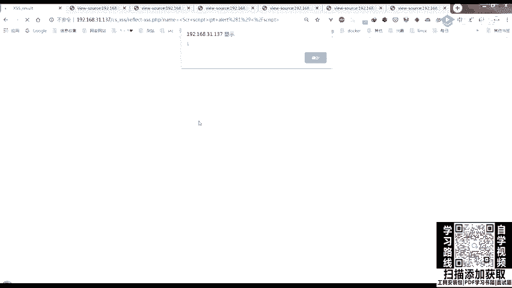

嗯。😊，哦，我这没有保存。

这种方式对吧？嗯，可以看到它在这的话，就只有一个右键括号输出给我们了。你们可以看一下他后面是不是就全替换为了空。

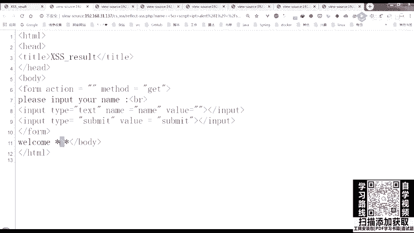

因为在这的话，他会把中间的那些东西都匹配掉，匹配为空。对吧。这个大家能听懂吗？嗯，行。那我再把最后一行给注释掉。这个其实好像之前有跟大家提过吗？这个函数。

如果没有提过的话，等会就提。那大家来猜一猜这样的话。😔，使用这个函数的话，我们。还能不能进行一个。

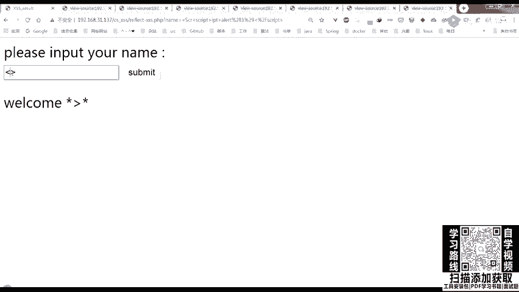

哦，刚才还没有对不起。😔，刚才还没有进行一个绕过。这这个其实也是可以绕过的，因为它只是对我们这个SC这个标签进行一个过滤嘛，对吧？那我们其实还有其他的一些方式来执行我们的1个JS代码。之前我没有说过。

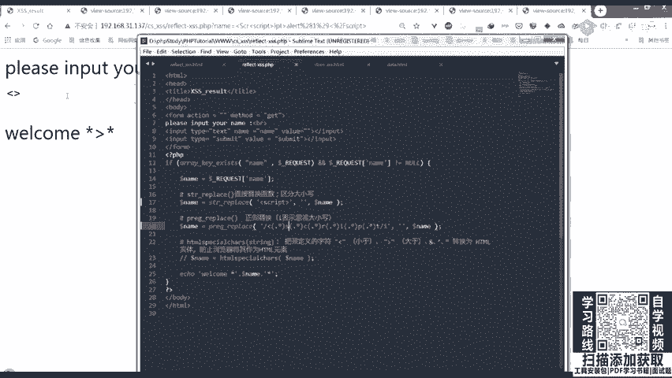

是吧一种就是直接在页面里面插入这个嗯scr。第二种的话是使用外联的一个就是这个SRC等于什么什么JS后面加一个JS的一个路径，它就会去那个路径去访问那个JS代码，然后嵌入到我们页面中，就是。这是两种。

还有一种就是可以使用一些事件，对吧？

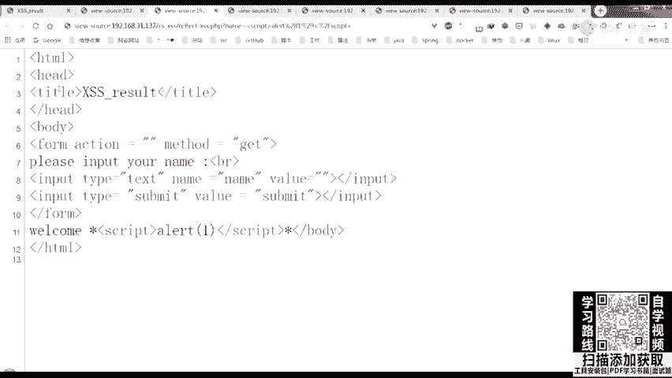

这两种前面两种的话都是不可以使用的，因为它已经把这个scriptcr标签给过滤的比较严格了。那这样的话，我们是不是可以使用一个就是利用它里面的一个事件来进行嗯注入呢？

一个叉SS的注入呢，因为它这只是过滤了我们的这个呃匹配了我们这个scriptcrpt嘛，它左右兼过号并没有进行一个过滤。所以我们可以输入一些其他的标签。

比如说。一米指标签。然后SRC等于1。这个的话就是它的一个路径嘛，这个路径不存在的话，是不是就会报一个错误？如果他就有一个事件，如果他报错的话，就有一个on error。就会等于。😔。

这个后面你就可以写我们这个以on开头的那些事件，是不是后面可以写我们的JS代码？alent一。我们这样看一下是它是不是会进行一个弹窗。嗯，可以看到它在这里确实就进行了一个弹窗，然后这里有一个图片。

但是它的路径因为唯一是找不到的，所以它会触发那个on euro。然后on euro里面又是我们的一个JS代码，就是alentt一。

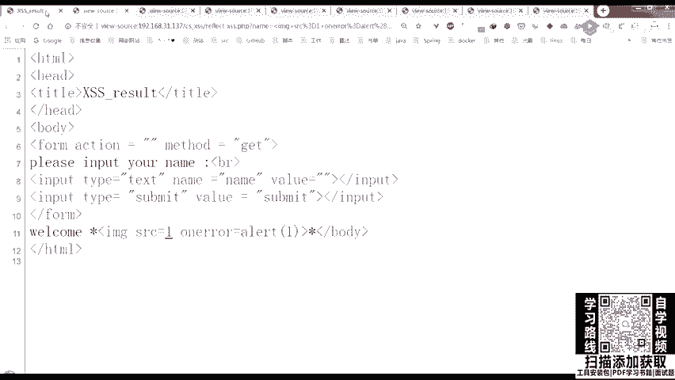

嗯，这个是。第二种的一个绕锅内第三种这种方式。就是使用这个函数，它会把预定E的一些字符转化为HTML实体，防止。嗯，浏览器将其作为HTM的一个元素。

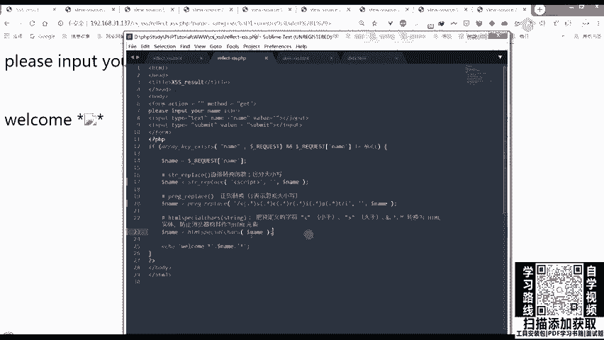

那大家可以就是你们觉得现在的话还能进行一个。猪肉吗？这种方式还能进行一个。但是让我写就不行了。😔，你等会就会写了。写拍漏的很简单的。大家觉得这种方式它还会进行一个弹窗吗？

就是会因为这里路径也是不存在的嘛，然后会触发这个on euro等于alent一，它会弹出一个一的一个警告框吗？应该不冷。😔，不能解析陈子乎尸题了，不行。😔，嗯，对，这位同学讲的很好。

就是他其实是我们可以提交来看一下。嗯。😊，我记得第一节课的时候有给你们说过，如果说我们要在页面里面正常的显示这种嗯特殊符号的话，我们是不是可以使用一个字符实体。大家还记得吗？就是那个我们看一下。

原代码就知道。你可以看到在这儿，对吧？大家记得这个吗？这个就是左右左键过号以及右键括号的一个字符编码。在这的话，你可以看到它已经变成这种黑色了，就不是我们之前的这种。嗯，紫色。

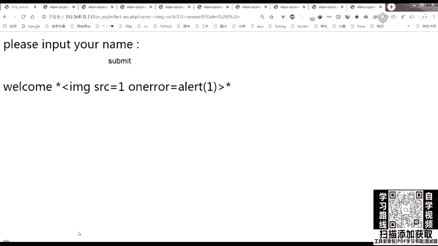

这是我们的一个。就是一个防御的手段，我们可以使用这个函数来进行一个。防御。

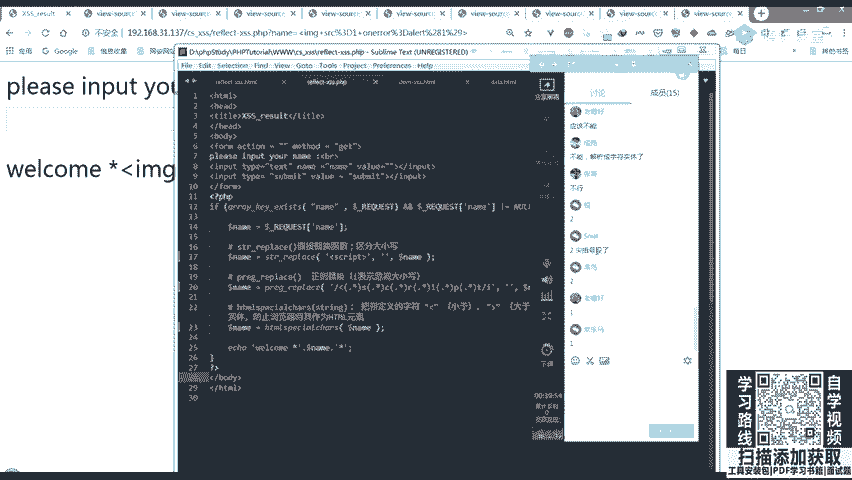

嗯。Yeah。Okay。这个大家应该都听得懂吧，就是也能理解他是怎么。

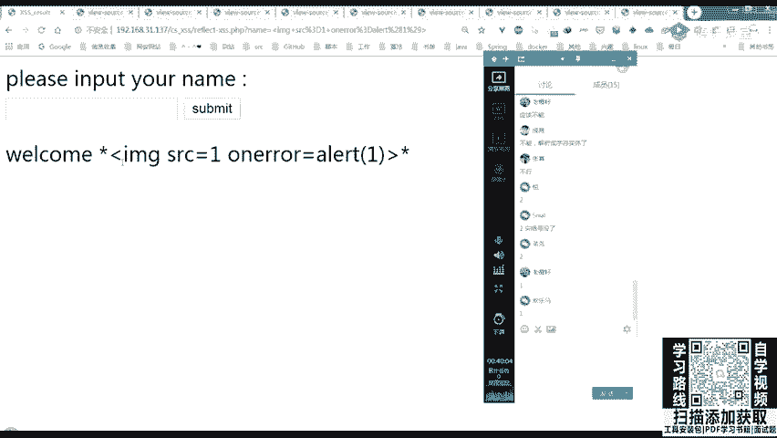

怎么就是整个过程是怎么样的？他为什么会进会有一个弹窗，然后为什么又最后又不能进行一个弹窗了？他最开始在这边从我们的这个HTM传入到这边，它主要是嗯可能是你在这边输入你的名字提交之后。

我有一个欢音的页面给你们。就是给大家有一个欢迎的页面，但是它在这里welcome，然后这个lamb的时候，它如果没有进行一个严格的过滤的话。

它直接它刚开始的时候就直接把我们这个lamb输出到了我们这个嗯页面中嘛。

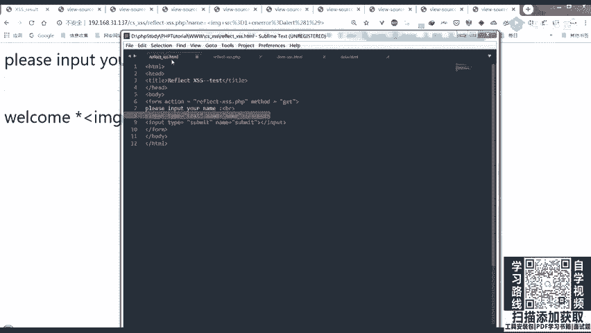

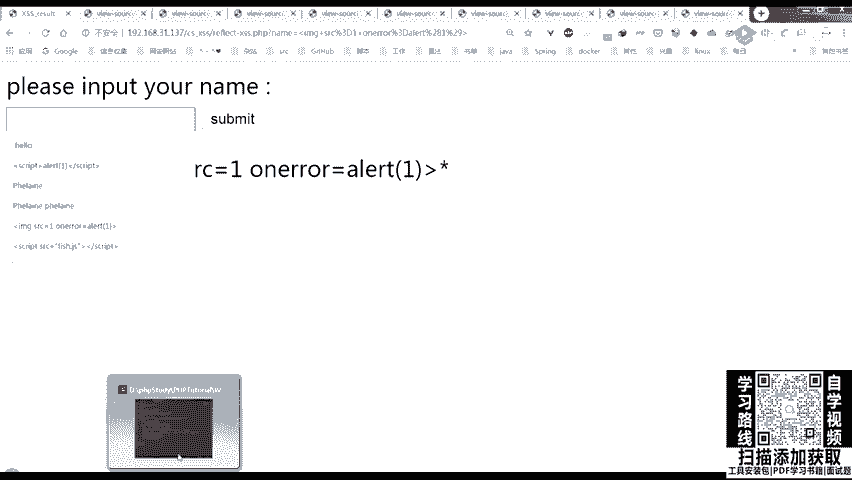

那这样的话，我们在这里输入的这种。

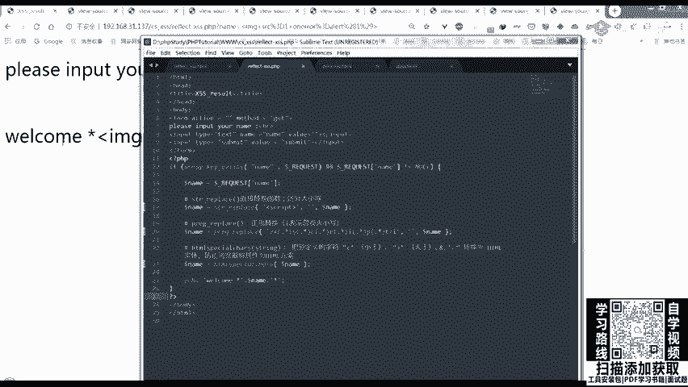

这种特殊符号就可能会被它解析为1个HTML的标签，从而执行一些嗯我们这儿输入的这些。Oh。

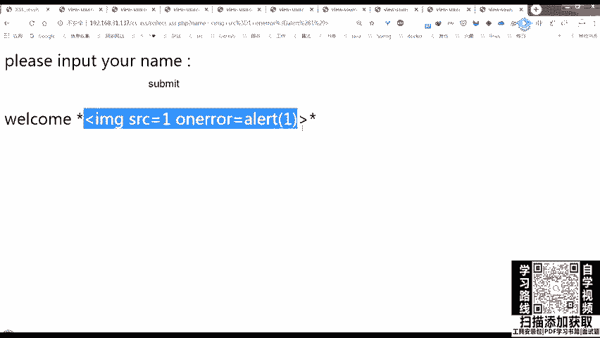

代码。那这样的话就可能造成1个叉SS。因为我们后期既然我们能这样进行一个执行的话，我们可以就在可以在这个后面写一些我们的JS代码进行更深入的一个利用嘛。所以我们这弹出一个警告框的话。

就是为了证明它有这个叉SS漏洞。

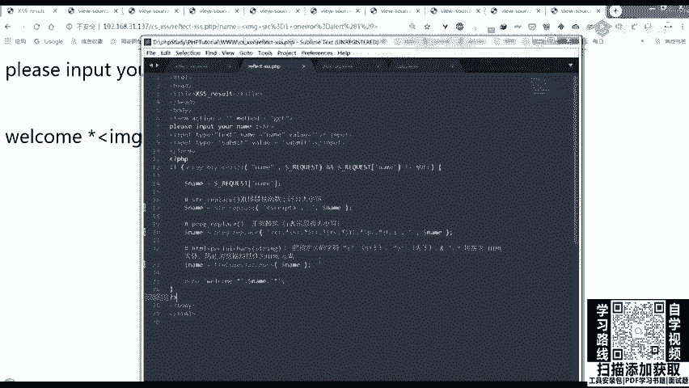

那如果我们想要把它进行一个防范的话，就是防护的话，就是需要我们在这个输出的地方，对用户输入进来的数据进行输出的地方，我们要对它进行一个严格的过滤。前面两种这种前面这两种过滤的方式都是可以进行一个绕过的。

第三种的方式的话，在这里是可以有效的进行防护的。因为它在这儿只是通过这个一口，然后只有这一个输出点嘛，所以它在这儿是有一个很好的过滤放过滤效果的。那可能这我这只是写了一个，就是这种小型的，只有一个页面。

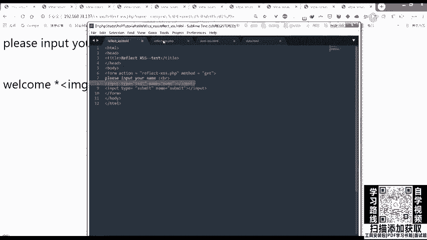

就是你输入一个你的类line，然后提交之后，然后传入到我们的PHP里面，然后在PHP这儿它会进行一个过滤。那如果是我们一个大型的。

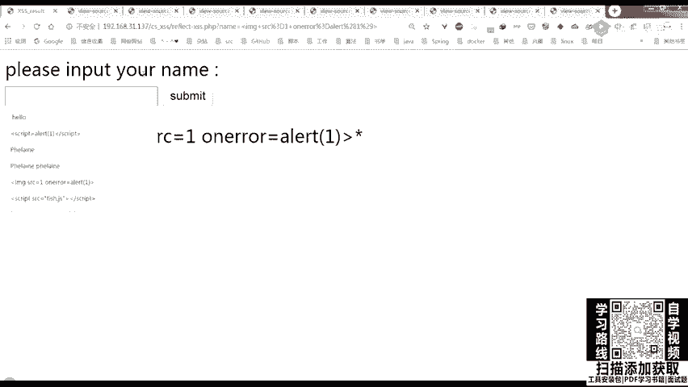

项目的话，他可能就会把这些叉SS的一个防范，它会专门放到一个嗯文件里面。然后你每一次请求之前，我都会去先去。先去进入到那个文件里面，对你的输入的数据进行一个处理，过滤掉一些嗯字符。

然后避免出现叉SS之后再去进行一个我们用户逻辑的一个处理。这可能是就是比较大的一个项目的一个处理方法。

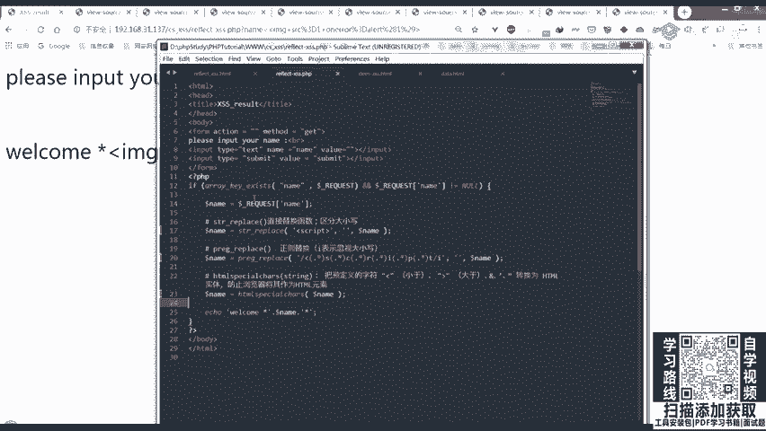

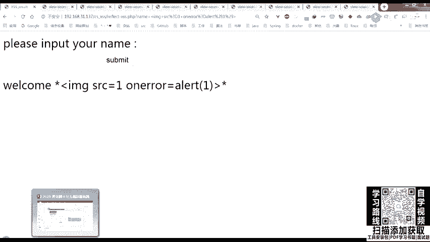

Yeah。嗯，大家这个能听得懂吗？怎么还是。😔，不是听完穿楼空吗？😔，你是说什么意思？你是说在这个的时候吗？这样的时候吗？对啊，他是说他都替换了成了空呀。对呀。他都替换成了空压。

但是他没有对这个image进行一个。匹配啊。它只是匹配了这一个呀cr啊，它并没有匹配这个image。嗯，对。大家应该没有什么疑问了吧，就是对于这个反射性。

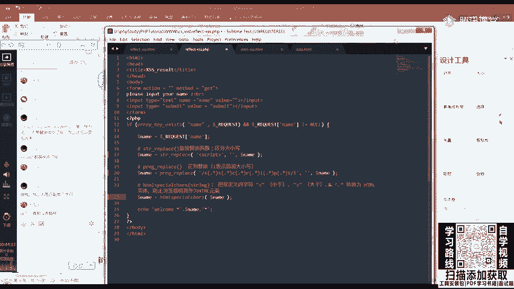

XSS。就是用户提交之后，然后服务端没有做严格的过滤，然后有一个输出回显给我们在这个输出的地方，它没有呃过滤，所以它就可能会被当成是一个标签，然后嗯能执行我们的1个JS代码。这个大家应该都。了解了吧。

如果了解的话，大家打个一，我们接着往下走。嗯，S是有替换吗？你可以去你可以课后课后去找一下正则匹配，你可以课后去搜一下正则匹配它的一个规律。嗯。现在就不要先不要想这个了。诶，嗯。我们接下来往下走。嗯。

可以看到这个就是一个实例，算是一个实例吧。在我们这个它其实出现的地方是在这个搜索框这，在这个搜索框这的话，我们直接输入的是这一个。输入的是这个MANN这后面这一串。那在后面我们去右键查看源代码的时候。

我们去进行一个搜索，搜索这个MANN就会找到这儿，它是直接把我们的这个这一串。放到了。这个地方。它并没有对我们这个on click进行一个过滤。因为我们它是放在这个input标签里面嘛。

input标签里面的话，它也可以有一个事件，就是这个uncl事件嘛。然后这个前面MANN这个双引号就闭合了这个value这的这个前面的这个双引号。然后再加上我们的这个on click。

这里的这个20%就是进行了1个UIL编码，就是空格。20%就是空格，然后oncl等于prot一。promp也是就是弹出一个确认框嘛。然后空格之后，这儿这后面还有一个双引号，这个双引号其实就是闭合。

后面这个。双引号它我们原本输入的是。这个。😔，正好插在了这个value这一对双引号里面。所以我们要闭合前面和后面，然后插入这个un click。它点击之后就有就会有一个一弹出给我们。嗯。😊，第二个的话。

😔，这个也算是一个实例吧，然后也是在它的这个搜索框这儿，搜索框这我是直接加了这个双引号间括号。这个双引号间括号的话也是为了闭合前面的一个标签。因为你前面标签不结束的话，我后面的这些内容都相当于。

在那个标签里面嘛，所以说我们需要进行一个闭合前面的标签之后才能进行一个后面这个标签，它才能一个有一个正常的解析。不是。不知道大家这个。嗯。😊，内在这个后面的话又插入了一个image标签。

然后它的source是等于123，这个123是不存在的。所以在这个后面有一个on error，这个后面的这个代码会被触发，当成是一个JS代码触发。然后这个evvo就是把后面这一串。去进行一个执行。

那这一串内容。他其实就是去有一个。他。它的内容就是这个我们去new了一个image。然后他的source是等于这个的。这个的话是我自己，因为是是我本地写的一个接收的一个cookie的。呃，PHB代码。

然后它的代码就是这个样子的。然后MSJ等于。encode uRI document点cookie。这的话就是把我们的cookie传入到我们这个IRECV杠cookies点PHP里面来，然后进行一个处理。

那在这的话，我在这个receive cookies点PHP里面。在第四行的时候进行了一个接收。就是通过getMSJ这里传入的是MSJ所以我们这写的也是MSJ传入了之后进行1个UIL解码。

因为我们在这对它进行了U1个UI然后的编码，所以就在这进行了一个解码。然后将我们的这个它的document点cookie存入到我们这个cookies点TXT里面去。这样的话我们可以去进行。一个就是。

我们后受害者去点击了这个链接之后，他的一个cookie就会接受到我们自己的这个。嗯，平台来。这个大家是现。暂时看不懂，没关系，就是我们课程后面实操的时候有一个实验。会对这个进行一个详细的讲解。

大家做实验的时候，做作业的时候可以认真的去了解一下，去想一下它是怎么实现的。嗯，为什么可以这样做？如果出现问题的话，就可以和我交流。这个就是一个反射型的叉SS。那接下来我们往下走。

就是一个存储型的叉SS。存储型的叉SS的话，就相比较于凡射型叉SS，它就有一个特点，就是它比较的它是属于持久型的1个叉SS。因为它这中间。有一个数据库的一个介入。

它主要是存在于攻击者将恶意代恶意脚本存储到了服务器的数据库中。当用户访问包含恶意相关数据的页面的时候，服务端未经严格过滤处理而输出在用户浏览器中，导致浏览器执行代码数据。我们。😔，来看一下。Yeah。

嗯，这有一个。有一个页面，其实我们这个。存储型的叉SS它比较。常见的地方就是在这种评论、留言、个人信息这种地方。因为这种地方的话可能才会需要数据库的一个。存在。那在这儿我们直接也输入一个。

就是自己随便写一下，看看它的功能是什么。test test添加留言。添加这有一个添加成功。哦。这有我之前的。😔，嗯。添加成功。好。😮，这他会回钱给我们。就是我们输入的test test。

然后message这它会回旋给我们。那在这儿的话试一下。😔，这样的话会不会进行一个弹框呢？你们觉得他会进行一个弹簧吗？你们啥也不蠢。😔，嗯，那行，我们来添加一个。😊，两言试一下。添加成功嗯，是啊。

确实就有了一个弹窗。我们可以右键查看源代码看一下。这。你直接找一下这个alent。😔，2嘛，我们刚才输入的是alent2，对吧？嗯。可以看到在这边的话。这有一个test test，然后我们是。

这个咱之后，这儿他直接也把我们的这个。变为了一个嗯scr标签来进行解析。那这样的话，我们进行一个刷新，你们觉得它还会有一个弹窗显示给我们吗？就是前面的。这个的话。😔，这个。😔，Reflect。

点PHP它是没有。弹窗的那这种的话，我们如果刷新一下。他会不会有一个弹窗给我们？还有。我看你们都懂啊。😊，会吧。😔，嗯，那我们刷新试一下。嗯，他还是会有的，这是为什么呢？

因为它会把我们的这个数据存储到我们的一个数据库中。那在这的话，它这数据展示又是从数据库中取出来的所以你存入数据库的时候，你没有对它进行一个严格的过滤。你取出来也没有对它进行一个过滤。

那这样的话它就有一个。弹窗给我们。然后你刷无论刷新多少遍，它都是会有一个弹窗的。因为它都是从一个数据库中进行一个读取，然后你都没有。嗯，进行一个过滤。对吧。嗯。

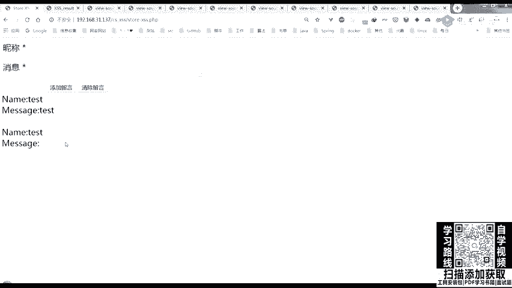

那我们来看一下他的。一个后。😔，后台源代码是怎么实现的？

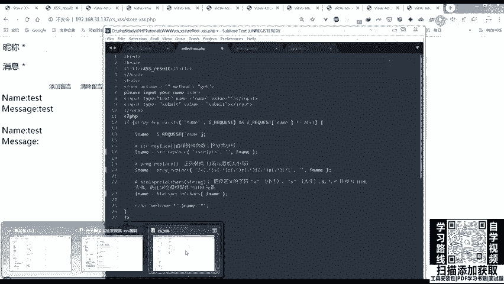

这的话就是我们前台的一个代码。嗯，这的话输入我们的昵称，然后输入我们的一个消息。然后输入消息之后，有一个添加留言以及清除留言。这个oncl的话，有一个进行一个判断。判断是在这儿，昵称不能为空。

消息内容不能为空。然后这个清除内容留言的话，它有一个嗯提示框，确认要清除所有的留言吗？这些都不是很重要。我们来看一下它进行一个处理，就是这个action。这。处理的这个PHP文件到底是怎样写的？

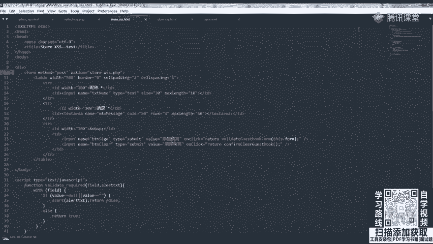

嗯，这些的话就是一个连接数据库的一个操作。然后这里的话是清除的一个。处理过程。这个是添加。添加留言的一个过程。H。😊，嗯。😊，可以看到我们重点是看这个这个里面这个衣服这。

在这他首先进行了一个判断这个BTN sign。BTN赛的话就是这个嘛。这个。就是我们这个嗯是否进行了一个设置，是不是就是你提交了。然后将我们的这两个。这个昵称以及消息把它取出来。对吧通过post取出来。

我们是post进去的。然后这个stream的话就是去除我们嗯提交的数据两边的一个空格以及预定的一些字符。这个是嗯主要是去除一个空格的。接下来的话在这个。这一行这儿。这个的话是一个数据库的操作的一个语句。

insert to guessbook。然后messageLme values什么以及什么就是。将我们的这个这里里面的这个message，这个变量。

就是这传入进来的这个以及这个lamb这个变量存入到我们这个guesbook这张表的message以及lamb字段里面去。然后。Jo。有一个提示就是。alent添加成功。我们来看一下。

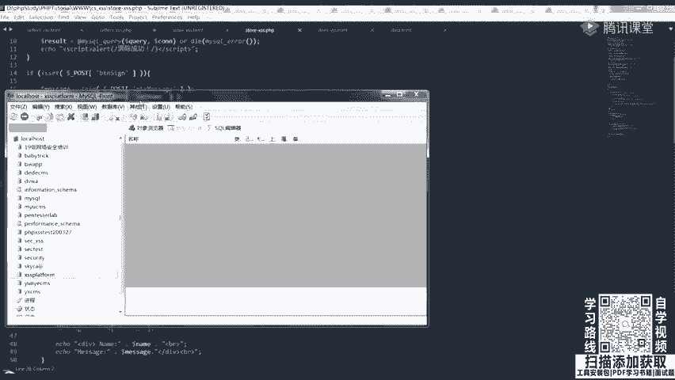

嗯。我们选择的是这个这个数据库嘛，PHP叉SSt。

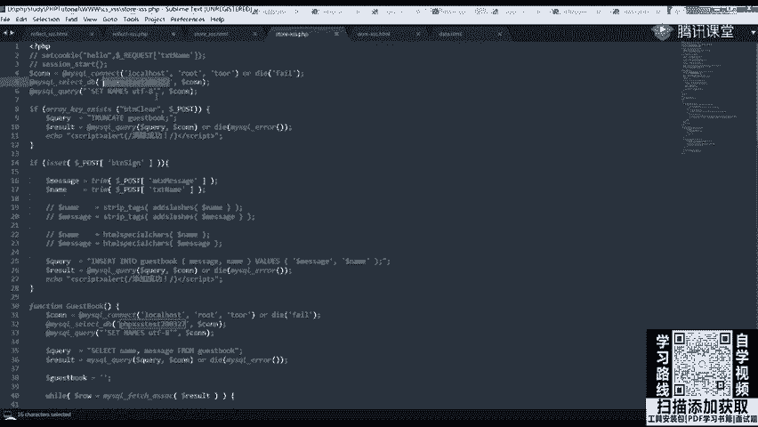

对吧然后我们来看一下数据库。

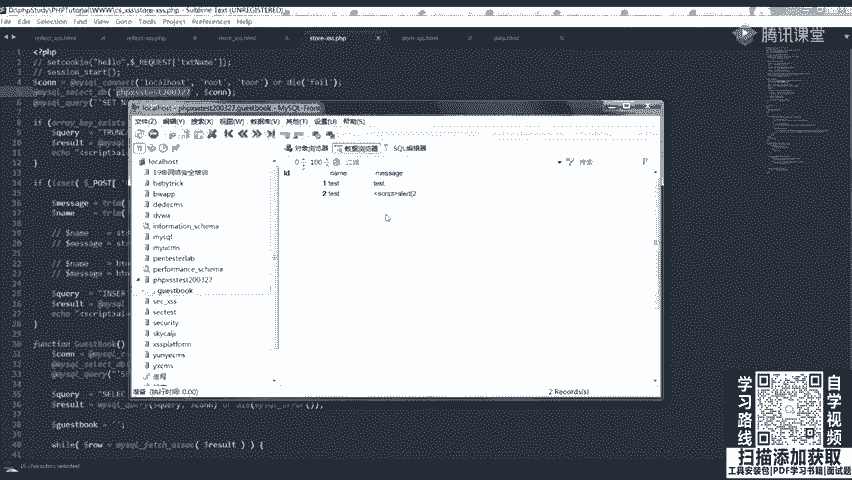

在这的话，我们有输入两条记录。第一条的话就是这个test test。第二条的话就是我们刚才输入的这个test，然后。squa alert2。对吧。这两条数据。这是两条数据，就是。

我们可以重新来进行一个写一下。比如说我现在昵称。说这个。😔，嗯，他这泥传还有长度限制。但是这个长长度限制应该是前端的。它最大的长度是1，我把它改成比较大。这样的话就可以输入比较多的一个字符。嗯。嗯。

然后添加留言，我们来看一下它存储。嗯，我们每次刷新，他这都会有一个。我们刷新一下，那在这的话，它就会把我们提交的这个我们用户提交的这个信息。存储到我们数据库里面去。这是它一个存储的一个过程。那你光存了。

你不拿出来用，那肯定也是不会有一个叉SS的弹框的一个过程的对吧？你只存了，你又不用它，那肯定不会造成什么影响。那它用的地方在哪呢？

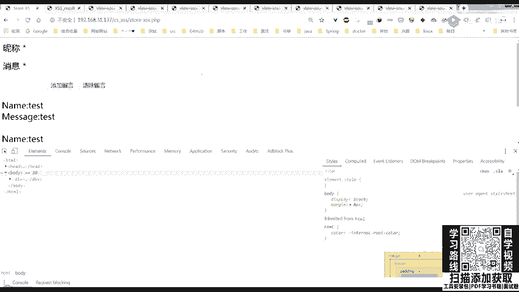

就是其实就是我们在这个展示的这，对吧？你要展示这些你输入的这些留言什么什么的，你是不是就要从数据库里面把这些数据给取出来？

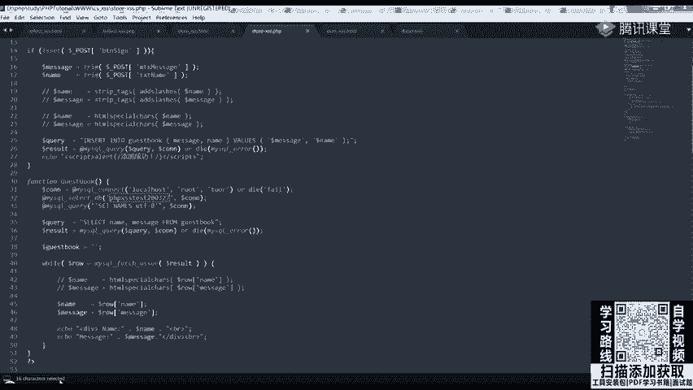

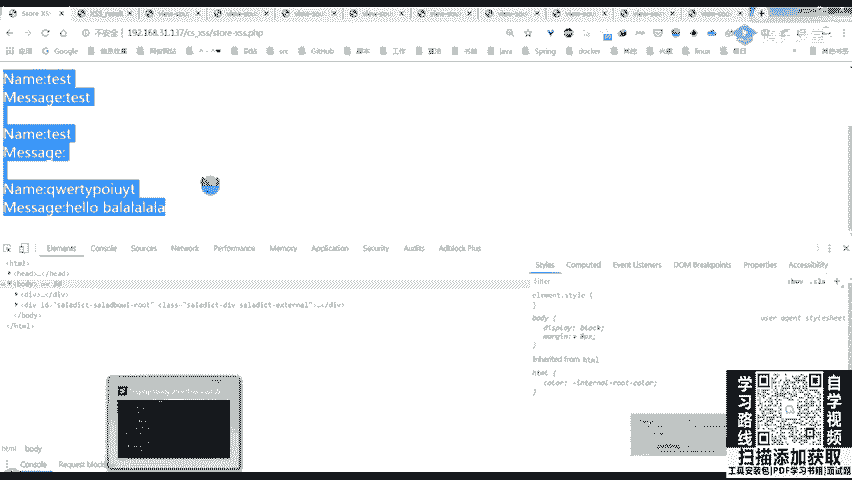

那在这里的话，我就是通过这个guesbook这个函数来进行一个。嗯，取出来。首先这个select的话也是一个scle的语句，就是从我们这个guesbook。

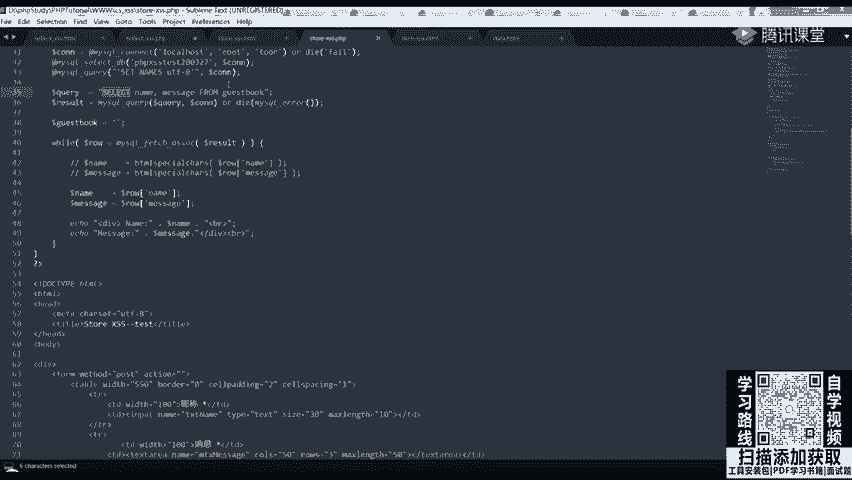

就是从这一张表里面。

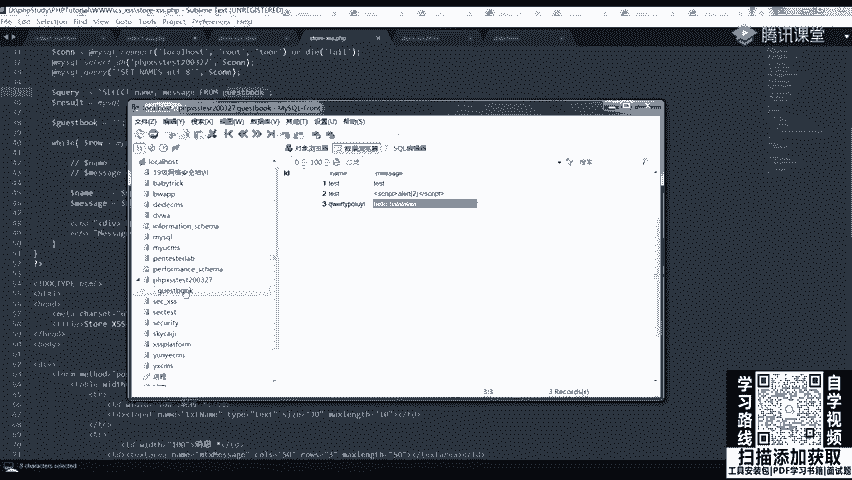

取出。数据就是取出它的lemb以及message。他的这些数据都取出来。然后接下来在这个地方的话就进行一个便利，便利输出在这里一口。这的话是将我们这个嗯查找出来的这个结果进行一个读取取出来嘛。

取到我们这个Lmb变量里面来，然后在这个一口这就进行了一个输出。所以说你从存到取的过程中，就是我存的时候。就去除了空格，去除了一个它两边的一个预定一次符，把这两个字段就是你提交过来的。你在这儿。

就是在前端写的这个呃昵称消息。这些东西就通过它的这个insert这一条语句。然后。插入到我们数据库中。接下来你要进行展示的话。你又直接在这里直接eco了一个我们的把它的一个数据取出来，直接e口出来了。

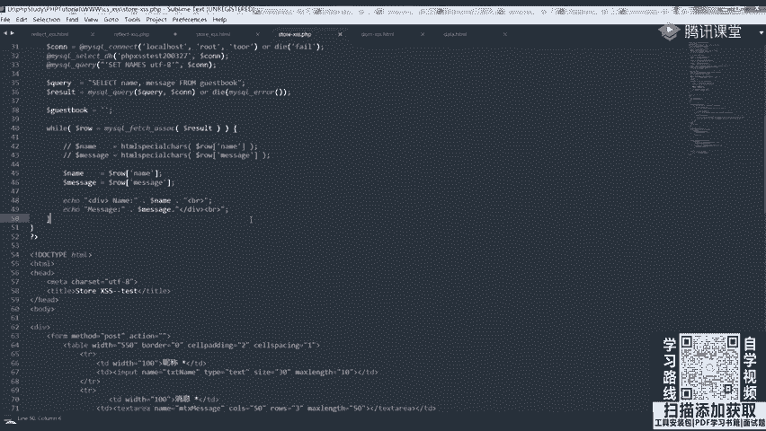

所以说他这为什么会出现一个叉SS的。注注入叉SS漏洞，是不是大家也可以就是清楚了。其实跟我们的反射性叉SS其实是就是它的形成原理是一样的。只不过它在这里有一个数据存储的过程，它涉及到了我们的一个数据库。

所以说他每一次你去刷新页面，无论是我这个用户去刷新这个页面，还是别的用户，就比如说。我们切换一个浏览器。去访问这个页面的话。他都会有一个弹窗显示给我们。因为它这里它要显示这些数据出来。

它也是要从那个数据库里面去取数据的。所以说这就是我最开始说它的传播嗯范围广，就是可能每个人去访问这个页面的话，它都会受到一个影响。嗯。😊，类在这儿如果要进行防护。

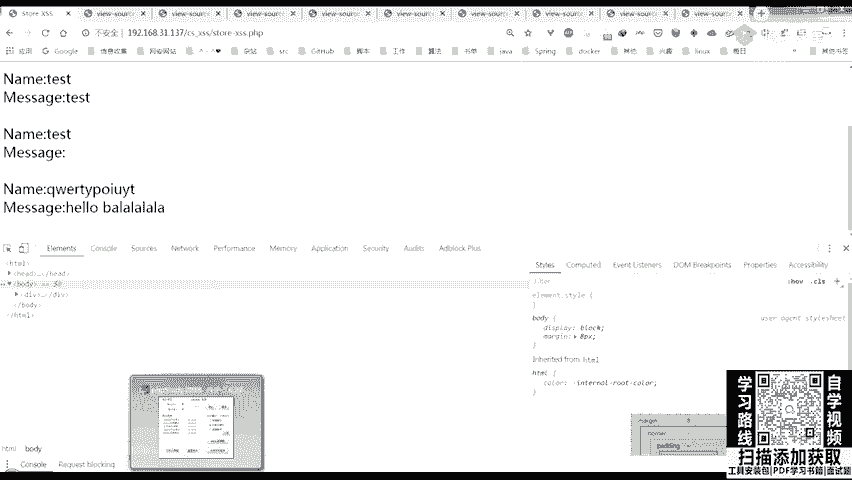

大家有什么想法吗？我刚才说的大家有听明白吗？如果听明白的话，大家就打个一。如果没有听明白的话，就打个2。行。😔，我们来看一下，就是怎样进行一个。防护宝。首先第一种是这个。😔。

我把他们的函数的意思告诉大家，这个的话是添加一个放斜杠。这个可能就是为了。你插入到数据库里面的时候，就有些字符前面比如说单引号，前面它就会加一个反斜杠。

这个sstrtriep tag的话就是会去除我们的一个。我在。嗯。好吧，这个。就是去除字符串中的HTMLL叉ML以及PHP的一个标签。这个意思的话就相当于我们前面的那些标签，它就不能用了。嗯。😊。

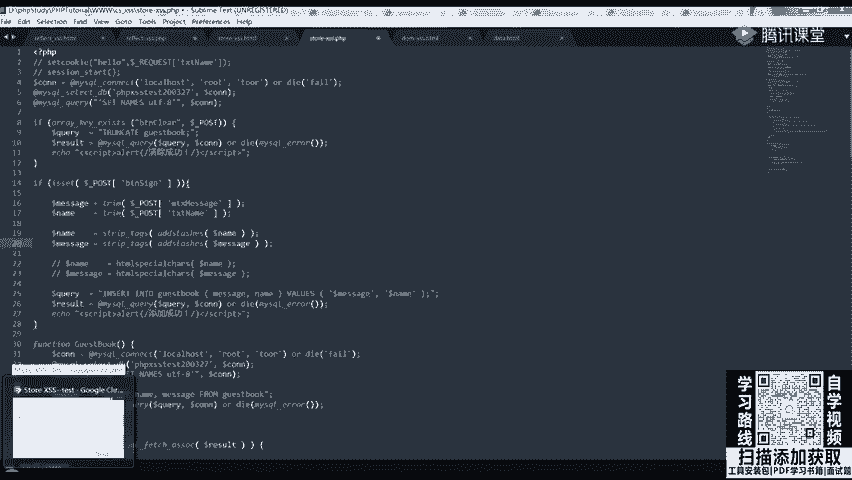

Yeah。大家觉得这样能进行一个有效的防防范吗？

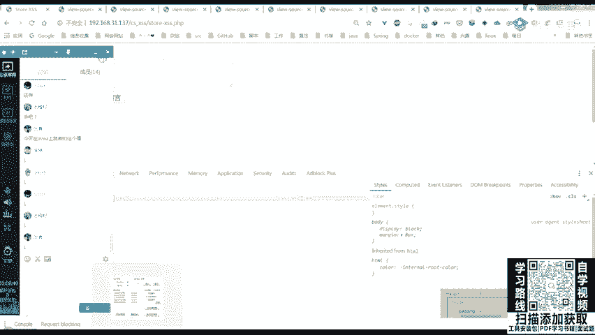

我们先只就是只过只对这个L进行一个。😔，这样的话其实就可以。对我们在message这。我们可以看一下，其实可以来看一下这个效果。先保存一下。

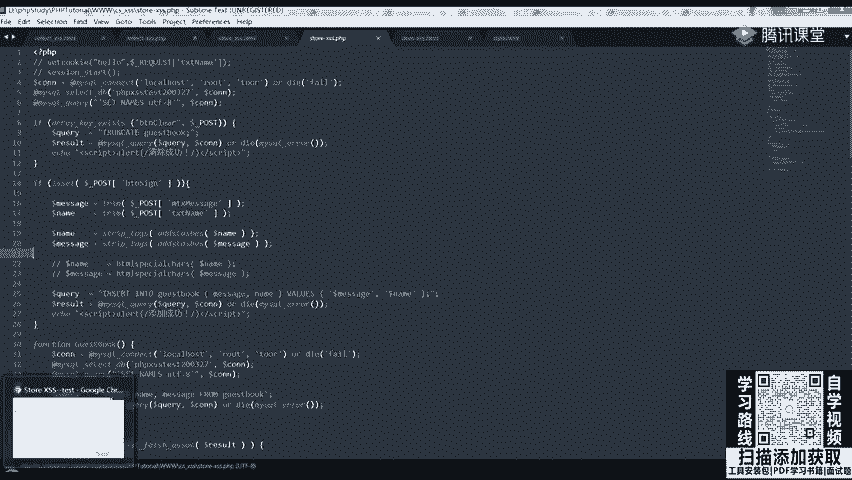

这个test，然后这儿输入我们的这个前面使用的这个imageSIC等于一。好。He bro。就等于alent。😔，一。添加留言试一下。嗯，他原本这的还是会有。我们查看一下源代码。

那在这的话可以看到其实是在这个地方。这个message这它后面就没有东西了。他是为什么呢？其实就是因为。

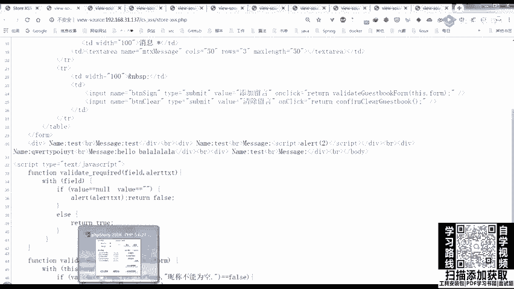

你在就是它存入数据库之前。就把它的通过这个strtriep text将它的一个。嗯，那个HTML标签给去除掉了。我们可以看一下数据库中它的一个。

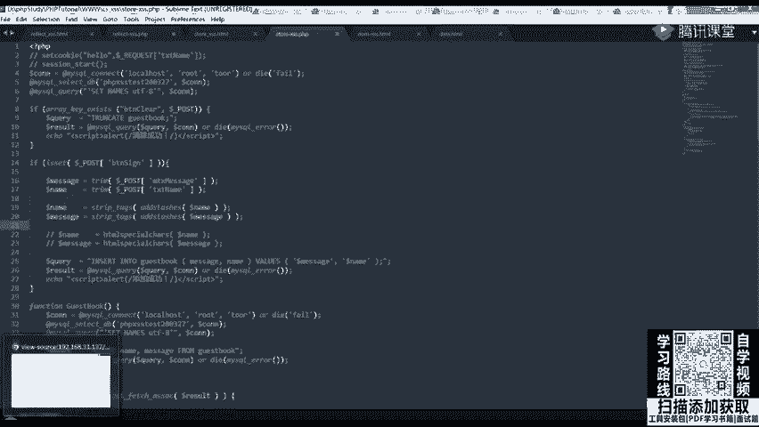

我也以看到这就干脆是为空的，就没有存储任何的一个数据。因为它之间我们刚才输入的是一个。这个嘛imageSRRC等于1嗯e。他就会直接把这一整行，因为它就是一个。呃，image的一个标签。

它就会把整个都去掉。所以说这样的话能是能进行一个有效的一个防范的。

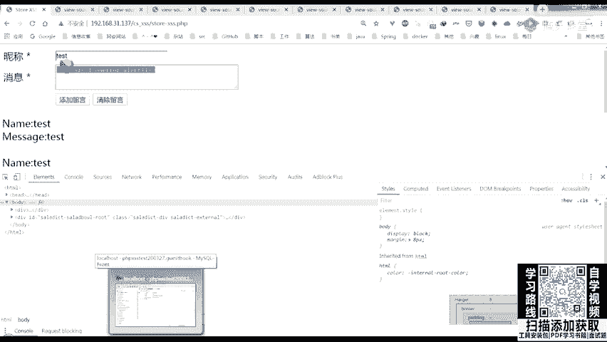

如果是使用这两个的话。就是我对他们两个输入的li以及message进行1个HTMLspecial chance，将他们编。就是。弄成一个字符实体内能进行一个。

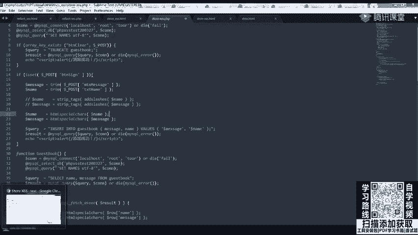

执行吗？就是会能执行我们的一个嗯插入的叉SS代码吗？嗯，对。其实他就不会弹窗了。我们来尝试一下。这个二是前面的吗？嗯，他为什么只有一个了呢？是因为。

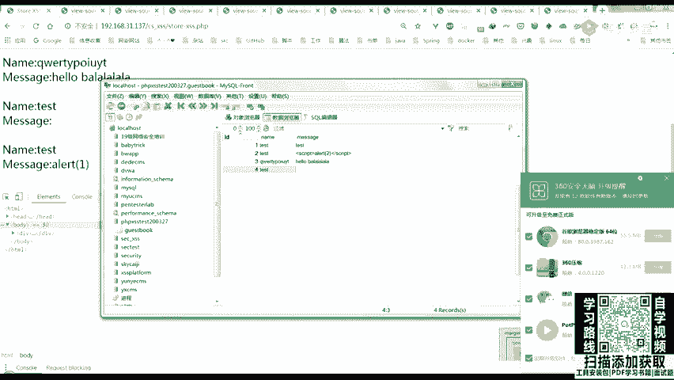

我这没保存啊，这个点点还在，就是没保存，我又。

我去保存了。😔，然后他会先把我们这个。因为我刚才没保存的话，它是。

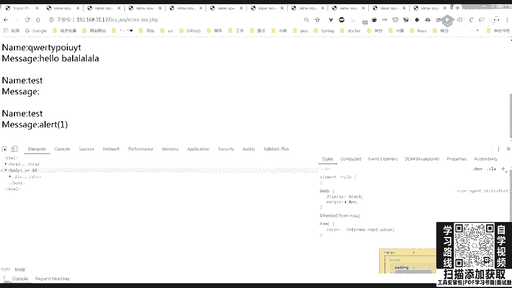

他其实刚才是这样子的。先把它去除掉它的。标签之后，然后再对它进行一个实体编码。然后存入到数据库，从数据库中再取出来展示给我们这样的一个过程。那我现在把先这一行注释掉。

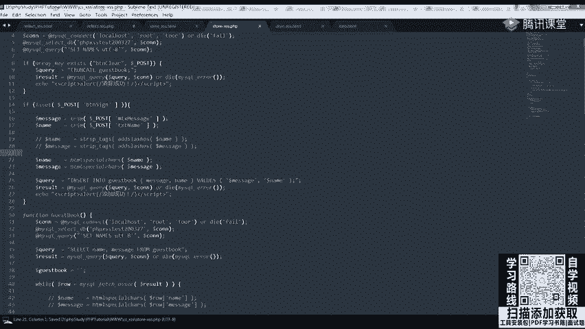

嗯，这样的话他就会把这个完整的显示给我们。那我们去看一下它数据库中是怎么存取的。可以看到它在这边存入的话，就是存入了我们的一个字符实体了。对吧。所有兼顾后都是使用这种字符实体的形式存入的。

所以在这边如果你进行读取的话，取取的时候。

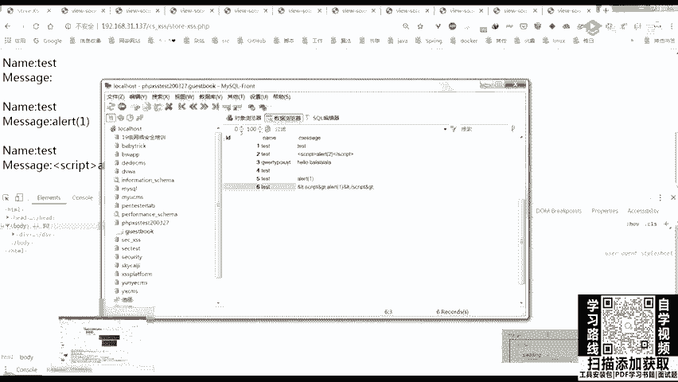

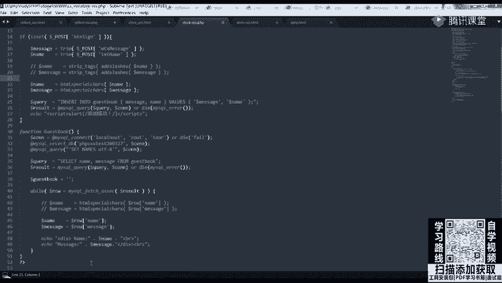

它也是以这种形式取出来的，就直接将我们这个message这个。

取出来，然后一口出来。

这样的话就展示给我们这个样子的。

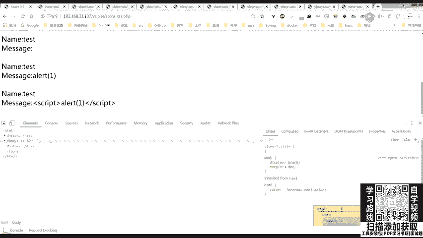

嗯。😊，这是一种方式来进行一个防范。就是在数据输入前就是存入数据库之前，我就对它进行一个过滤，使我们的数据库里面的一个数据是是绝对安全的。还有一种方式就是在数据输出的时候，就是在这个地方。

我们要把这些数据取出来用的时候，展示的时候对它进行一个过滤。在这的话可以使用这两个吗？就我对。我对这两个。取出来的这两个Lmb以及message进行一个实体编码。即使你前面不进行这些过滤。

我可以先注释掉。

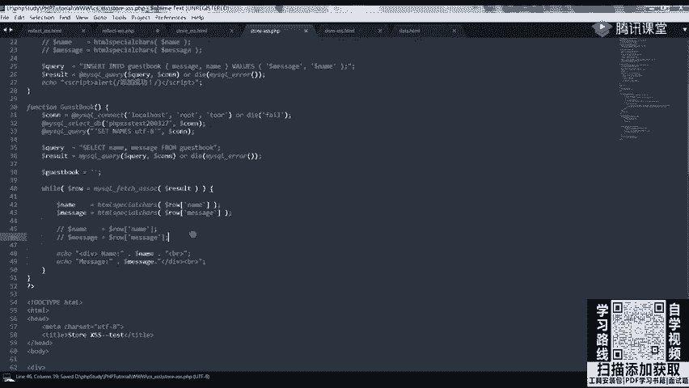

先把它清除。然后在这里的话。test，然后有一个。Alant一。😔，添加柳叶。然后在这展示的时候。它就是一个字符实体的形式展示给我们的。直接查找一下alent。😔，一。😔，对吧在这儿。

那它其实存入到数据库里面，是不是还是一个有害的一个信息。你看我们前面存入的时候，如果对它进行一个实体编码，存入之后，它是这样子的。那我们刷新来试一下。它其实存入的还是一个有。

就是如果不进行提输出的时候不进行过滤的话，它还是可以进行一个弹窗的对吧？因为它这并没有进行一个过滤啊。

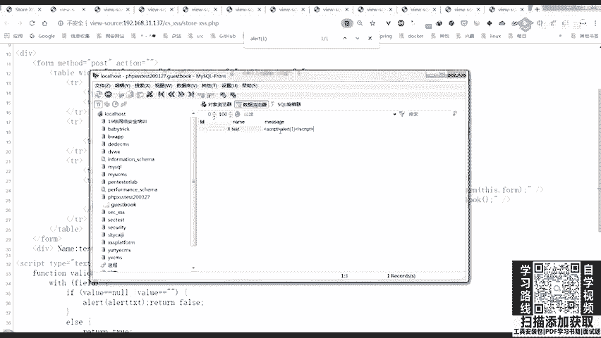

但是他在这儿进行一个输出的时候。就进行了一个过滤。所以说它这个。

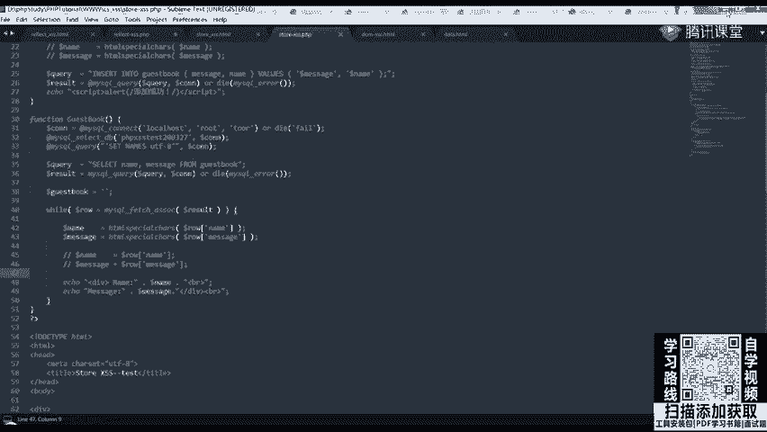

就不起作用。Yeah。嗯。😊，这是这两种方式，大家有听懂吗？嗯嗯。😊，大家应该没有问题吧。这个存储型的叉SS大家有什么问题吗？它其实和反式型叉SS其实原理是差不多的。

但主要就是它会把数据存入到数据库里面去。从而它的一个影响以及嗯传播的范围就更广了。在我们。😔，接下来往下往下这也是一个存储型叉SS的利用场景。它是在一个节目管理这儿，它能一个有一个创造创建名称。

就是你这个节目的名称。他会把这个名称存入到数据库里面去。我这直接输入了这个。这个11杠就是为了闭合这个。这个。变量嘛，然后闭合前面这个script。然后接上一个alent一。他就会有一个弹窗。嗯。

这是一个简单的一个利用。那接下来我们往下走。就是最后一个一种叉SS的类型，就是doom型的一个叉SS。他的特点是可以通过。Yeah。

Javascript操作我们的一个document实现doom数的重构。Yeah。主要存在于用户能修改页面的doom，造成客户端配漏的在浏览器中执行。我们来看一下。か。Yeah。

他这有一个welcome to over。website就是欢迎。但是他这就是我们可以通过嗯就是谷歌浏览器自I的。嗯，这个开发者工具NF12这它可以显示它的这个cr代码，就是javascript代码。

在这的话。大家看得清吗？😔，你该看到在这个 body里面，它有一个这个。他有一个scriptcr标签。然后在这个scriptcr标签里面。

它会用这个document点URL这个document点URL是什么呢？我们可以来。document点。😔，URL。😔，就是他的这个。就是他的这个。访问的一个地址。

index of indexex of的话就是嗯判断我们这个UIL中的一个lamb等于它的一个索引值，就是它的位置在第几个，然后它返回的是一个整数。类型，然后加5。加五是为什么了？待会再给大家说。

然后这个E务的话就是进行一个执行嘛。然后中间这里的话同样是对这个。进行一个sub string。s string的话就是截取字符串。从po的位置截取到document点UL点lenense。

就是截取到最后它整个的一个。我们访问的这个UIL的长度。嗯。所以说我们在这儿直接就。加一个L。😔，等于。因为他这直接会进行一个执行嘛。所以那这里的话，我是不是可以直接插入一个alent一，他会。

有一个什么效果呢？就会有一个弹窗给我们，为什么呢？其实就是因为在这的话，他会将我们的字符串截取下来。他首先会去进行这个pose的话，会去找到lamb等于5，它的这个位置，找到这个地方。

它在lamb等于5，找到等于啊lamb等于这个这个字符串，找到之后加5，它找到的那个索引值是在这个地方，我鼠标点了这个地方加5的意思是。345就把它移到了这个地方，就正好是L等于后面就是取它值。

下午是取它后面的一个值的一个最开始的一个位置，就是这个地方。在这里的话，它这个后面截取字符传又是从这个地方到它最后。整到它最后的这一个位置，就是lenance的话就是到它长度嘛。

它的长度就是最后这个位置嘛，我们可以。Dian。URL点L。😔，就是55嘛，这的话就是到55。就是从这个地方到55，55是不是就是最后了？然后进行一个evil进行一个执行。

所以的话它这的话就会有一个弹窗显示给我有一个。一的警告框显示给我们那这个doom和前面两个有什么区别呢？其实区别其实就在它整个的过程是在我们客户端进行一个完成的。他没有进行一个后台的一个逻辑处理。

直接是通过嗯我们这个嗯cr里面这样的进行一个处理进行。而有一个就是有一个叉SS漏洞的。它并没有经过并没有交给我们后面，你看这都是这种点HTML前端的一个页面，不像我们前面的时候。

我们还交到了嗯stone杠叉SS点PHP就是到PPHP代码里面去进行一个处理。之前那个reflect也是你看都交到了我们的后台PHP去进行一个处理。但是在这里的话，都行的话，它是直接就在我们前端。

客户端进行一个执行的。因为客户端的一些它的逻辑错误这种。而导致的一种漏洞。这个就是他们几个主要的一个区别。嗯，这刚才这个大家有听懂吗？9点20了。😔，嗯。😊，这个是一个doom型叉SS的利用场景。嗯。

这个可能有点复杂，大家。嗯，我稍微讲一下吧。嗯，它这里的话主要是出现在这个F type这个后面，它是用这个document点image是就是取我们当前文档里面的一个呃图片图片为0这个下标就是取这个图片。

这个嗯dCMS会员中心这一个图片，让它的SRC它的路径是等于我们这个。嗯，bp里面的一个路径，加上当前这个document点cooked的。所以说我们去如果他进行一个访问了的话。

可以看到在我们的这个BP里面有它就会在后面这个地方就直接问号这个后面。这我画橙色的这一串，就是它的一个cookie当前页面的一个cookie值。嗯，他就会带着这个cookie值来访问。我们的一个。嗯。

攻击者设置的一个网址。第三个部分的话就是快站脚本共计漏洞的一个实操。实操的话给大家的是我们。嗯，实验室的一个实验。这个实验。嗯，我觉得设计的挺好的，大家一定要去做一下，就是叉SS跨站小本更新原理与实践。

那首先我们前面进行测试的话，是不是最开始也是可以使用一些经典的嗯叉SSPload了，或者是去测试一下这个网站过滤了哪些字符，然后进行了怎样的防护。然后我们查看网页的源代码，看它如何去闭合属性。

以及闭合它的一个标签，怎么样去进行一个闭合，然后进构造我们的一个叉SSPload。嗯，我前面讲的，其实到这的话就已经完成了。大家可以去做一下这个。这个实验这是留给大家的课后作业。

我前面讲的大家有没有听懂的吗？发一下链接这个链接吗？还有下面那个。嗯。其实我今天测试的话，主要还是使用了一些比较经典的嗯这种cral一，大家可以去这个。拍到的大全里面去看一下其他的一些。就是姿势吧。嗯。

😊，今天讲的内容大家有什么没有听懂的吗？三种类型大家都有一定的了解和他以及他怎么进行防护的，为什么会触发等等这些。逻辑大家清楚了吗？对不清开SS怎么进行防护？😔，那在这儿的话。😔，其实我这儿写的这一个。

😔，这个。这一个代码主要就是给大家演示它怎么进行一个弹窗的。其实它。真正的作用是。嗯，我可能写的不太好吧。其实如果你要进行防护的话，你就直接可以。这个这种el这种危险函数就可以直接去掉呀。对。

因为我这个script我写的这个代码。主要就是为了给大家演示一下他是怎么进行一个出发的嗯。所以说他这个s的话，主要就是来进行一个。这样的一个嗯。功能的。但是其实他并没有什么实际的含义。

如果你要进行防护的话，就是你在这边这个嗯前端的这些呃cr脚本，这就是要注意一下。

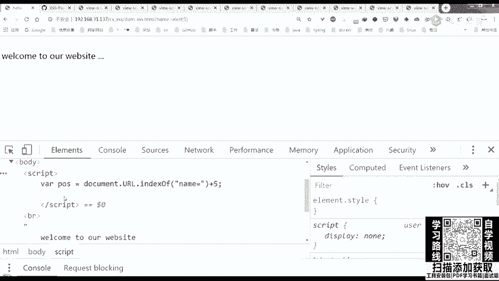

或者说你刚才如果说是要是想要把它取出来的话，你就可以不使用这个EVAL进行一个执行。我可以把它复制给一个变量，然后你要对这个变量进行一个怎样的处理。然后我在这个scriptcr标签里面进行一个处理。

而不是直接就进行一个执行了。这么说。你懂吗？就是比如说我就直接。😔，把他。复制给一个变量，而不是在这边进行一个。执行。😔，嗯，那。😔，就会等于。😔，他的这一串它截取的这一串，然后你接下来要干什么。

或者是怎么怎么样。你是嗯要输出一个什么什么东西啊，你就要对他进什么嗯，或者是你想要欢迎什么什么的，你就在这个后面进行一个写它的一个逻辑。嗯。这是一个问句，还是怎么着？

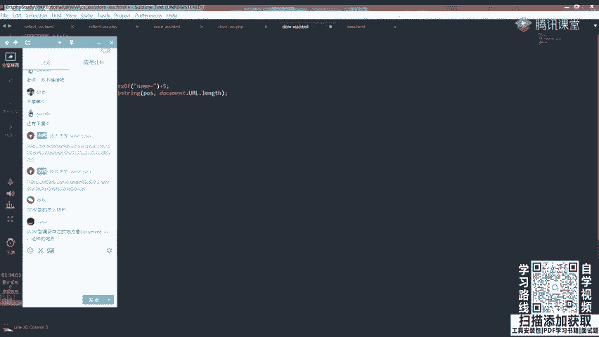

其实这个多米形叉SS的话。嗯，也不好说吧嗯。Okay。大家还有什么问题吗？嗯，大家一定要去做一下这个实验，这个课后作业这。如果没有什么问题的话，我们今天就下课啦。如果没有什么问题的话，大家就打个一吧。

行，如果大家对今天这节课有什么建议的话，可以把建议发给我们的班主任。然后班班主任会反馈给我。如果有什么嗯哪个地方没讲好，或者是怎么样，可以跟班主任进行一个反馈。那今天的课程就到这儿了，大家明天见。

这节课的话主要是分为三个部分。第一个部分的话就是讲一下我们这个漏洞，它的一个接收平台的搭建，以及如何去利用。第二个的话是讲它的一个绕过以及一些防御。第三个的话就是我们漏洞的一个实操。

首先我们来看一下这个接收平台。嗯，这我给大家推荐了两个，第一个是XSSER，一个是蓝莲花，大家可以去这两个。网址上面去进行一个下载，还有一个网址就是这个。还有一个这个。这个的话嗯。嗯，他有点不稳定。

有时候就是它其实就是一个在线的线上的一个，他已经给你搭建好了1个叉SSER的一个平台。但是它现在变成404l phone的。嗯，其实还有。其他的一些接收的一些平台。这的话我就只给大家列举出这一个。

但是正好它又变成404了。嗯，那就先不管他。嗯，大家可以去这两个网址上面去进行一个下载。我课后再把链接发给你们吧。还是你们现在就要下载吗？好，没人理我，下载好了。😔，班主任发过了嗯。😔，可以装一把吗？

哦，你可以只装一个，因为他们的功能是一样的。就是在配置环境里搞不定。嗯，这个叉SSER的话，大家可以去看一下这个链接。这里有1个叉SS平台的搭建笔记，我们可以去下载一个修改版的。

然后按着他的步骤一步步来。这个的话比较比较多步骤啊。步骤比较多，大家可以课后的时候再去进行一个。嗯，就是安装。那这儿的话我就不进行一个安装了。如果大家有什么问题的话，就可以问我。

这的话它有一个比较需要注意的地方就是。在。这个如果我们不把，因为他这里是有一部。把他的。这个3W目录改成3W目目录下的这个叉SS。那我这没有改的话，你在这个静态。这个。😔，它的这个映射网站映射的时候。

你在这个前面也要就是在这个index点PHP前面也要加上你在这里的这个地址，就是这个叉SSER这个地址就加进来，每一个都要这么加进来。嗯，这个就不给大家演示了，我给大家打开看一下。嗯。

这个就是它的一个页面，就是我们搭建好之后。我们去访问他的这个地址，然后的他的一个界面。那这个东西是怎么用的呢？我们就可以在这边我的项目这儿。点击创建。这随便输入一个名字，比如说test。

你这个描述可写可不写。在这里的话，我们直接选默认模块，然后是这个无keep session，然后点下一步。嗯。😊，这个这里的话他就会给出一些。网址。或者是直接的一个拍load的这种。

再或者是他你只要在任何想要的地方插入这一这一个。这一串网址。比如说我们昨天搭建的那个。哦，昨天。嗯，测试的那个。我们在这儿写一个。写一个什么呢？写一个这个网址。就直接插入一个scr标签。哦。

这他没有复制全要，是因为它在这的话，它限制了我们的长度。把它的最大长度改的蛮大的。再来。😔，复制一遍。😔，嗯。😊，然后添加留言。在这边的话，我们可以返回去看一下。这个test二转它的内容是数。

就是4月2号就是今天嘛，它这就变成了一个一。然后这里面就有我们的一个cookie。然后接受的内容location就是从哪个网址过来的。嗯，然后这边的话有一个我们。就是访问的一个user agent。嗯。

这个的话就给我们显示出来了，这是这一个接收平台的使用。大家就是。你在lininux下。还是不得行。😔，你你们之前不是已经装好那个。嗯，WAMP或者是这个PHP study了吗？你们不是已经装好了吗？

装好了之装好了之后，就按照这个文档里面，就是首先下载叭叭叭叭，然后。打开它的配置，这个如果想改的话就改，不想改的话就不改。但是如果你不改的话，你后面每一个就是那种。

index的地方都要加上你的那个文件前缀。那在这儿的话，我就是这个叉SSER，因为我的代码是这个，所以我在所有地方都要加这个叉SSER。这是教大家如何使用这一个接收平台。我这儿也给出了一个步骤。

就是首先是我的项目里面，你首先创建一个名字，怎么怎么的。第二张就是这一张图的话，我截的其实是那个嗯HTPS叉SS点PT那个。就是我刚才说的这个上面的一张图。就是官网上面的一个。平台。

但是他现在还是打不开，还是打不开就算了。它的界面就是这个的界面其实是和我们这个本地搭的这个界面是一样的。嗯，接下来这个的话，刚才也有给大家演示，如果大家没有装好的话，装好这个叉SSER的话。

我和大家一起来装一下这个蓝莲花吧。因为这个。相对比较简单。就是装的步骤比较简单，我先把我自己的给删掉。然后去进行一个下载。那我这的话好像已经下载完成了。嗯，就直接在这进行一个解压。解压之后，把它放到。

我们的3W目录下。就是我们的跟目录项目。放到这来之后，我们到浏览器里面来进行一个访问。我这已经开启了PHP3 studyD了，已经开始已经启动起来了。然后我在这输入。😔，然后加上我刚才。

存入的这一个就是在这边的这一个。目录名字吗。

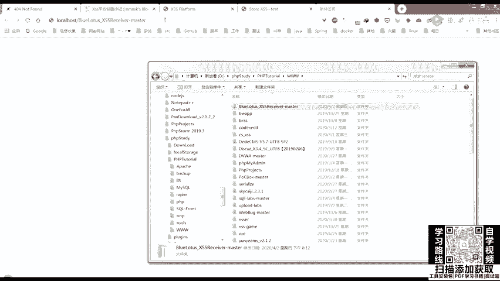

回车。😔，这的话它就有一个inst点PHP提示，嗯，有一个提示的过程，我们就点这个安装。这里有第一步后台的登录密码是就是这个blue letters蓝莲花。然后接下来其实这下面都可以不用更改。

然后直接进行提交。你只要记住这个。这个后台登录密码就行。

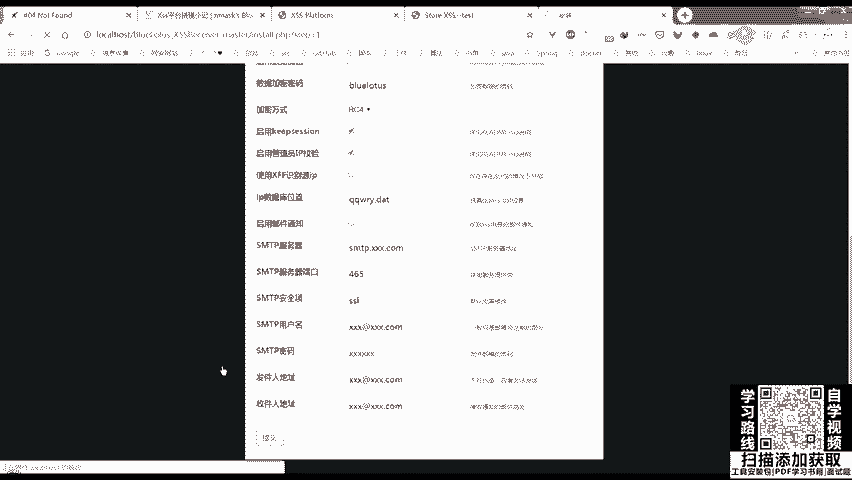

提交。然后进行一个登录。登录的话，这里的。密码就是刚才的helue letters。

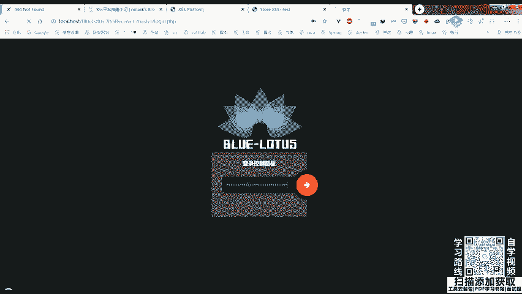

嗯，这样子的话就相当于是已经安装成功了。这个是不是很简单？把搭建步骤的网址发一下。行，你要那个拆SSER的吗？我发群里面嘛，这样的话你们。课后也可以找得到。😔，嗯，这个发出来是这种图片。那我先。😔。

先复制到这边。😔，嗯，怎么这个也是。复制。年天给。😔，然后再把这个复制出来。😔，发到我们群里。这个是那个XSSER的。然后蓝莲花的话，如果你是在windows下面，然后用这种集成软件的话。

就是我刚才的那种直接解压放到我们3W目录下，然后去进行一个访问，就是访问这个目录名之后，按照它提示安装就可以了。那如果你是linlinux下安装的话，你也可以参照这个网址。进行一个。安装。还是图片。

Yeah。你们现在在装吗？如果再装的话，就打个一。如果不再装的话，就打个2。如果不再装，我就接着往下。这样。嗯，好的，那我就接着往下讲吧。到这里的话，这个这个蓝莲花的这个接收平台就搭建完毕了。

这个一人是404啊。算了。😔，那怎么使用呢？其实就是在我的JS这儿，首先输入一个模板名，你随便输入就是test吧。在这里的话，我们可以选择一个，它这个里面已经写好了一些JS模板。类在这的话。

我们插入这个默认的JS，然后点击这个插入模板。在这的话，它就会把它的那个代码贴出来。我们这儿需要改一个地方，就是这个地方这个网站地址，我们要改成自己的这一个。地址。嗯。嗯。然后点新增。😔，生成Plo的。

😔，这的话我们直接复制去看一下是不是能够进行一个访问。这样的话，这就出现了我们这个JS的一个代码。然后我们可以将就是你生成拍漏的这个这个拍漏的或者是。中间这个网址就是这个JS的一个地址插入到可能存在。

嗯。XSS漏洞的一个地方，它就有一个。在这边接收面板这，它就会有。那边传输过来的数据。这个是他接收到内容之后的一个图。嗯，比如说他是他是什么时候来的，他的IP地址是什么？这我测试的是局域网。

因为就是我本机就是自己发的客户端的话就是win7，然后谷歌浏览器，它是以get请求，get的数据是什么？然后这的话有它的一个location，然后cookie等等，都会传给我们。

就是使用这种接收平台的话，就更方便我们进行一个接收。嗯。😊，这应该是这个in depth。我们来测试一下是不是能使用了。同样在这里。全拍露的。😔，复制。😔，嗯。

然后直接在这边插入来试一下是不是已经配置好了。嗯，这种前端的控制，我们都可以在这个F12这。然后你可以随便修改。所以说有些前端的一些限制的话。对我们的。😔，你光靠前端来进行限制的话，对程序肯定是不好的。

不安全的。因为我们客户端就可以对它进行一个修改嘛，你可以看到在这这个地方它就有显示收到一封消息。我们可以到。😔，这里来看一下。嗯，可以看到在这的话，它就有一个cookie。然后是从哪里来的？到现在的话。

大家有什么听不懂的吗？嗯，没有是吧。应该都讲的比较清楚。如果。就是大家不太知道的话，也可以就是后面再去参照我的这个PPT。这边点击生成拍lo了就可以了。

这它为什么会接收到我们的一个cookie和和一些其他的这种信息，这种location什么的这种信息其实是因为你在这里选择了这个JS这一段functionction里面的类它的一个内容就是用来接收cookie。

这。接收它的一个cookie，然后top location location。嗯，等等。所以你在这接收面板这儿，它就有这些信息给我们。嗯，到这里的话，大家应该都能接受吧。如果就是能接受的话。

我们接接着往下讲。嗯，好。😔，那就接着往下讲。这个就是他的一个接收平台。我们之后可能就是做是练习的时候，可能就会让大家不光是弹出他一个弹框或者是怎么样。就是更希望大家利用这种接收平台。

然后能够接收到他的一个cookie。然后如果能接受到他的一个cookie的话，就。就危害就比较大嘛。那我们进入下一个就是跨站脚本工击漏洞的一个绕过，以及我们如何进行一个防御。首先来讲一个绕过。

第一种情况，我这只举了一些例子啊。第一种情况就是左右肩过后被过滤的情况下。假如我们的那个输出的地方，就是我们不是会注入一些叉SS代码进去吗？它不是在一个地方要回显给我们吗？比如说。在这个reflect。

😔，我们在这儿输入hello的话。他是不是会把这个hello回显给我们？在这个如果这个hello它输出的地方，这边查看右键查看源代码的时候，这它直接是输出在了我们的bodyy里面。

那如果它是输出在了我们的一个特殊的标签中，比如说input标签。我直接在这插入一个input。然后。内input的话，它就有一个事件，uncl事件等于let。它当然它不止一个事件。

比如说这个uncl事件。然后提交之后。嗯，我这好像是把它进行了一个过滤，我就把它的代码给改一下。

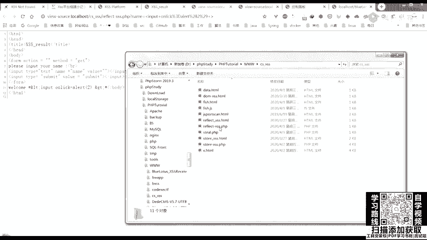

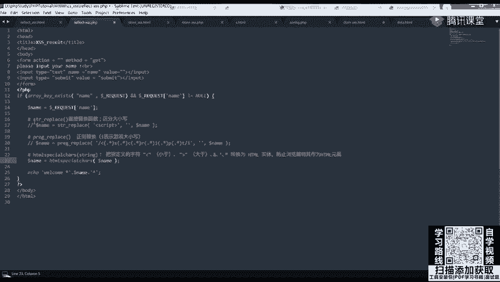

比如说在这输入一个input。On click。这提交之后。我们点击这个它就会有一个弹窗出来。这个是什么意思呢？这个左右监控号被过滤掉的情况是什么？然后说他有一些事件被扣。处罚是什么意思呢？其实就是。

比如说他这里的我们输出的。这个地方正好在这个input标签里面。就不是说直接输出在我们这个body里面，没有包裹在标签里。比如说我们输入的内容是可以是在这个input标签里面的，就是我这。

标蓝的一个地方。它输用户输入的地方，最终输出在了一个标签里面。这样的话我们就可以构造一些事件。比如说在这里的话，就是一个这个uncle事件。我们点击之后，它就有一个弹窗给我们。这是。

第一种情况就是这个前面这个双引号，就可能是为了闭合，它可能input标签不是还有其他的一些属性吗？比如说我们上一次写的时候，就是它的type啊以及嗯lamb嘛，我们如果它输出的话。

肯定是在一个属性属性里面嘛，比如说它的value值是什么呀？然后它就可能是用一个双引号包裹起来的。那这样的话，我们输入的内容是不是就要把前面它原本在这个程序里面的这个。我来爬一下吧。Yeah。

他有可能我的意思是他有可能他的源代码就是这个样子的。然后我们输入的内容是保存在这个value里面的。所以说他在这的话，可能就需要有一个双引号，闭合掉前面的那个双引号，再加上我们的一个on focus。

这种这个就是聚焦的一个事件。当后它聚焦的时候就弹一个一的一个警告框，这个auto focus的话，它的意思就是当页面加载的时候，它就自动聚焦在。你先在这个标签上面，然后当他聚焦的时候。

他又会触发这一个事件。所以说。整个这两个连起来，就是我打开的时候就会触发这个alent一，就会弹出一个一的一个警告框。因为这有一个自动聚聚焦。然后这里的话有一个如果聚焦的话。

它就有一个事件的一个嗯写了一个事件在这儿。这是第一种情况。第二种情况就是可能al alert被过滤掉的情况下。就可以使用编码的形式。或者我们使用这个prot和conform也可以进行一个弹窗。

比如说在这儿的话就有一个A标签，A标签里面有一个这个HREF属性。在这儿的话我们输入一个date冒 howt，然后这种HTML这里的话有一个b64分号，后面有个b64，就说明我后面的这一串。

是用by64进行一个加密的。这种形式的话，它在谷歌浏览器下面是不可以进行弹窗的。我们可以来试一下。嗯，它是没有一个效果的。但是如果我们把这个链接在谷歌浏览器里面去进行一个打开的话。

它就有一个弹窗显示给我们，当我们点击之后，可以来看一下这个这一串到底是什么意思。Yeah。嗯，这里的话就是弹出一个3。这个的警告框。所以说从这个也可以发现，有时候因为浏览器它自己本身的一个策略的问题。

有些时候它这个浏览器人是能进行弹窗的。但是另外一个浏览器它就不行。嗯，除了这种编码的形式，可以看到。第二种就是使用这个SVG这个标签。然后有一个他有一个onload。我们可以使用这个promp。

再然后就是也是这个A标签里面，它对它其实是。可以。来看一下。嗯，这里边看不到这弹窗，它有1个13的弹窗。嗯，啊在这里。它其实就是javascript的一个尾协意。

在这个javascript冒号后面输入了我们这个。嗯，javascript的代码，这里的话就是弹出1个13的一个警告框。这些都是一些例子。然后肯定是不止这么多例子的。第三个的话。

如果是我们的这种暗示键被过滤掉的情况下，我们可以使用。怎样的一种形式来进行一个绕过？第一种的话还是使用刚才的这个dvaqui，只是在这儿，大家记得这个东西吗？这个就是一个字符实体吗？对吧。

但是为什么他在这儿就能进行对它进行一个编码呢？其实刚才在前面。这个02的时候。这里是不是其实也是一个。进行了一个字符实体的一个编码，这个就是AJAVA这两个都是A。只不过这个加了一个X的话。

它是表示它是十6进制的。JAVI screamed，然后冒后这又一个Aal13。这样子把它拼起来了。所以说如果你单纯只是后端对Javascript进行一个识别的话。

那它在这的话就不是能够一个不能够匹配得到，从而有一个绕过的一个效果嘛。嗯，这也是一样的，这个就是一个冒号。但是它这里的话是使用一个名称。不是那种数字，不是十进制来表示了。

第二个的话也是使用一个伪协议javascript为协议。第三个的话，它是使用一个嗯style标签里面有一个这个。yle属性里面有一个这个expression，然后在这个expression里面。

在这个括号里面输入我们的这个JS代码。但是这种现在只能在I16以下才能进行一个弹窗，其他的基本上这个已经不怎么使用了。下面这一个的话就是这个X link冒号HREF也是使用这个来进行一个弹窗。

那这种的话，它只是在火狐上面，火狐浏览器上面可以弹窗。在谷歌浏览器下也是不能够弹窗的。其他一些可以执行JS的属性的话，还有。这这几个。第四个的话就是标签和属性之间并不是只能出现空格。

比如说这个image，我也可以用这个斜杠代替空格。这个后面的这个空格我也可以用斜杠来代替。第二个的话，有时候并不需要一个合法的标签。比如说在这我就直接有一个M。那我点击这个M之后。

它也是有一个警告框弹出给我们的，我们来尝试一下。同样在这里进行一个输入。点击之后，这里就有一个。alent一我们写的是alent一嘛，它就在这儿有一个。弹框给我们。这是简单的列举了几种。方式。

接下来我们来介绍一下他的一个防御。它防御的话可能是有两个部分。第一个部分的话就是。阻止恶意代码进行注入。第二个部分的话就是阻止恶意操作的执行。那不管是反射型叉SS还是存储型的叉SS。

都能通过服务端过滤进行防御。因为他们都是要交给服务端进行处理的。服务端的话可能就有两种方式，一种是黑名单。就是过滤掉某些特殊字符。特殊符号以及字符在这里话就列举出了这一些。

白名单的话就只允许特定的类型或者是符号。白名单和黑名单相比较而言，肯定是白名单更。更好一点。因为黑名单总有一些标签，总有一些嗯事件什么的，你没有想到会漏掉。那白白名单的话，你就只限制在那几个里面。

肯定会比黑名单要好一点。白名单的话，它是只允许特定的类型或者是符号。根据输入的数据特征限制使用的类型，比如说年纪年龄我就只限制为数字类型，输入类型为字符型，我就指。

让他能使用大小写的26个字母以及数字以及啊这个连接符号以及下划线。嗯。其他的就把它一律的禁止这种。还可以的话，我们就是进行一个编码以及转移。输出在标签和属性中的话，我们就就进行1个HTML编码。

输出在cr标签或者是事件中，我们就进行一个javascript编码。然后输出在UIL中去执行1个UIL编码。再一个就是这个cookie中，我们可以设置这个HTP only。然后。怎么设置？

就就是这个通过这个sd cookieie cookieookie将这个HPon的选项设置为to，它就能防范我们的这种cookie截持，就不能通过我们内容接受平台接收到它的这个这个cookie了。

再一个的话就是要确保我们执行的脚本来源可信。之前我们这种插入就是我们在这儿。就是在这里不是插入了我们接收平台的这种链接吗？所以说你在程序里面就可以规定。哪一些外部资源是可以加载和执行的。

其他的我们都一律不让它进行一个加载，这样的话就能一个有一个比较好的一个防范。再一个的话就是不使用有缺陷的第三方库。因为你有缺陷的第三方库加载到页面来的话，它也是能够有一定的影响的。嗯。😊。

这个这几个是不同的语言，它使用。嗯，的一些防范叉SS的函数。那在这儿有一个需要注意的地方，就是这个PHP里面的这个HTMLspecial chance，它默认配置是不过滤掉单引号的。

只有将这个这个选项设置为这个。这个后面这个它才会过滤我们的一个单引号。所以有时候。嗯，我们的开发人员疏忽掉了这一点的话。我们就可以来进行一个利用。接下来的话就有给大家留几个实操的一个练习。

大家可以去练习一下，有三个实验，就是叉SS进阶123。接下来时间大家。😔，我可以来看一下那个。😔，之前给大家发的那个网址，就是让大家去预习的那个，你们有做吗？如果做的话，可以打个一给我看一下。

让我看一下有多少人做了。

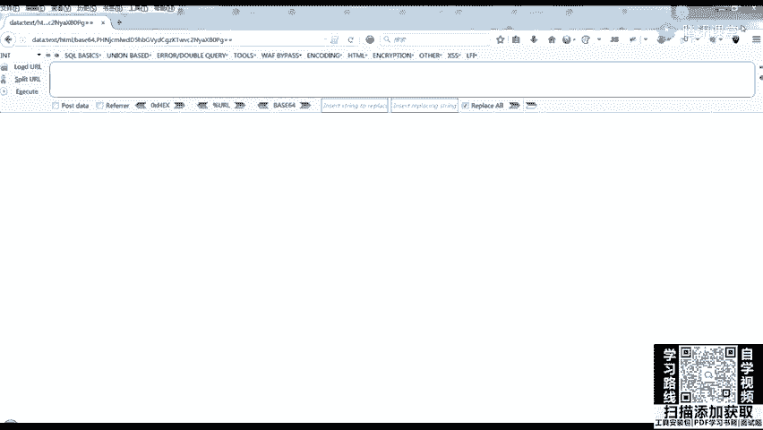

那你很棒哟。😔，嗯，大家都都知道，都就是会吗？

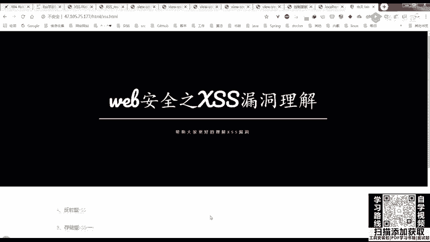

反射型XSS我们先来看一下常规考察。就只有三位同学做了，是吗？那你们做到第几关了，还是已经都通关了？做到反射反射已经做完了吗？这几个接收平台如何使用，大家应该知道了吧，就是应该就懂了吧。要不都讲一遍。

就是这个都讲一遍嘛，我可以带着大家先来看几道题。我来带着大家看几道题可以吗？如果可以的话，就打个一。如果觉得要多讲一遍的话，就打个2。我。我还是先讲几刀吧，因为。给你们留一点自己思考的时间。2。

讲一半吧。那首先就是比较简单的，那在这儿的话可以看到我们可以看到来到这个level一就是第一关。Yeah。它这个在这个UIL中明显的有一个参数，这个lammb等于。那这样的话。

我们是不是可以就是尝试一下。在这儿输入一个在这个后面输入一个经典的。嗯，这样的话，他就有一个弹窗回显给我们。可以查看一下网页源代码。可以看到它其实是插入到了这个地方，就是欢迎用户这儿。

刚才我们它原本不是有一个test吗？这对吧？那我们刚才直接把它后面的这个test改成cr learn一的话，它就直接插入到了这个地方。这是地管简单吧。其他人我也不知道其他人去哪了。😔，是不是还。😔。

就是还蛮简单的。

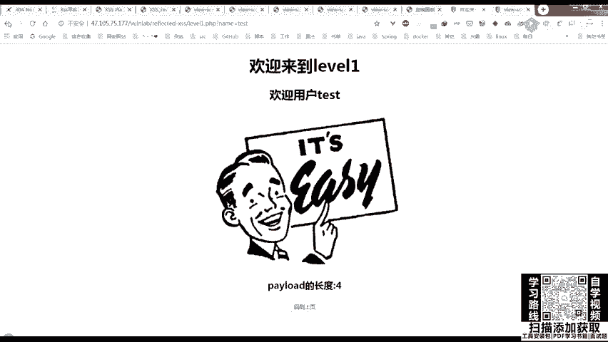

然后我们回到首，回到上页来看一下第二关。

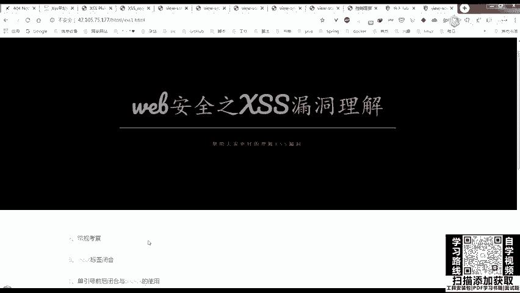

大二关这儿有一个input。就是这有一个这种输入框。那在这的话，我们直接简单输入一个双引号，这种这种兼过号可能是进行一个闭合前面的一个标签，然后再加上一个cral来尝试一下。搜索。😔，嗯。

他这人就直接给我弹出来了。😊，我们来看一下，就是右键查看网页源代码。嗯，可以看到它其实输出的地方，我们可以crl F来找一下alent。输出的地方其实有两个。第一个的话是在这个地方。

这是我们刚才输入的对吧？但是它进行了一个实体编码，还有一个就是在这个地方，这是我们输入的，就是我们刚才输入的。然后它原本的意思是我们将哦我们我刚才输入这个test。

它原本的意思是我们将这个我们输入在在这边输入的内容直接插到这个value里面。但是这的话我们直接有一个双引号，对它前面进行一个闭合了，然后又使用了一个右键括号闭合的这个input标签。

接下来的话就又开始了另一个新的标签，这就是这个cr的标签，然后它就会有一个弹窗显示给我们。这个是不是也很简单？伪协议注入一般出现在哪里呢？一般出现在哪里？嗯，这个的话。你不应该说是他出现在哪里。

你是要根据他就是。他这边过滤掉了哪些。字符，然后我可能会使用这个。伪协议来进行一个弹窗。H。嗯，这个是一个第二关，是不是也很也很简单？你们觉得就是这么做下来有。难度吗？这样的话又有一个输入框。

我们随便输入一点。东西。哦，这个再加上这个还是输入跟之前一样的，看看能不能行。搜索。😔，这就没有一个弹窗了。那我们来看一下它的一个网页源代码。嗯，他是对我们的这个都进行了一个实体编码。这两个输出的位置。

都进行了一个实体编码，那怎么来进行一个绕过呢？我们可以看到它在这里闭合的话是使用一个单引号。那单引号的话，我们是不是可以去尝试一下，或许它就没有写那个参数呢？这里。然后这个的话肯定这种右间括号。

左右间括号都被实体化了嘛，我这就不写了。然后就利用。是不是之前有说过这个input。标签的话，他也是可以有一些事件的。Oh。Focus。等于alart。😔。

一、然后给大家尝试试一下那个auto focus，可以看一下它的。作用后面还要加一个单引号，是闭合调后面那个单引号。对吧这就直接它就会一直弹出来，因为它一直。就是自动聚焦，所以它一直会有。我就回退吧。

我们查看一下。好的哦。😔，就把这个auto focus给去掉。然后来查看一下他的表代码。嗯，这样的话，我们只有自己鼠标把它的焦点聚焦在这个输入框的时候，它才会有这个弹窗。嗯。😊，哦，我鼠标要移开。

但是我。但是我现在一直在这。好吧。换一个吧，因为我们现在查看源代码的话。也还是之前那个alent一的。On click吧。这的话只有点击才会有。刚才on focus的话，因为我。

这这个点之后点确定它又直接它的焦点也是在这，所以它也会一直有这个弹窗。我们可以看一下，我们刚才输入的话是中间这一段。就是这个test单引号unclick等于alt一，然后后面有个单引号。

前面这个单引号是闭和前面的，后面这个单引号是闭和后面的中间正好多出来这一个部分，就是我们能够触发GS代码的这一段这一个部分。我这么说，大家听着智力吗？还行。😔，不吃。😔，那我就接着往下讲，好吧。

这这个靶场大家可以去做一下吧。嗯，后面的还需要我讲吗？还是你们自己去尝试做一下，到时候我会发一个拍lo的出来，行吗？就是整个这一这几关的一个。的排漏的，你们也可以自己。现尝试吧，对吧？

我觉得还是要先自己做一下，不然你们没有一个可能看着老师做比较容易。但是如果自己做的话，可能会有一些没注意到的地方，只有自己去做一下，才能就是体会得到那个过程。然后你们自己学的也更多，到时候我就。

把整个这个的一个。😔，嗯，太漏了可以给你们，然后也不一定就是我那样子的，你可以写出你们自己的。如果有不同意见的话，就可以同样可以进行一个弹窗的话，你就可以分享在群里面。嗯。😊，这个是这个靶场。

今天我就不拖堂了，然后你们今天的内容有什么疑问吗？哦，对，这个我还要给你们讲一下这个编码吧，我给你们稍微过一下，你们想听吗？就是这个这种编码。因为我之前自己在学的时候。可以，那行，我给你们讲一下。

我之前自己在学的时候，可能就会有疑问，为什么可以对他进行这样编码嗯。对，这种情况。所以说我就去研究了一下也，然后也写了1个PPT。那嗯嗯。😔，这里有个前沿就是问题源头脚本是如何变成页面的啊。

这个可以不用看，这个是我之前写的。第二个就是主要就是这个叉SS配漏的，它是如何进行编码，而且它能够正常的进行一个弹窗。我之前就。有点不太懂。嗯，那在这的话，我直接从。这开始介绍吧。

就是它其实是有三种编码的，一种是HTML编码。第二种是URL编码。第三种的话就是这个va编码。我到时候把这个PPT发给大家，就是这一个呃编码的PPT发给大家。然后大家可以去看一下。

这描述的就是这个HTM编码的话，就是我们前面提到的那个字符实体。嗯，它的格式是这个样子的，大家应该之前有接触到了，对吧？这个是它的一个实体名称，这是它的实体编号。然后在PHP中防护XSS的话。

经常就使用这一个就是把预定义的字符转化为HTML实体。哪些情况下哪些情况下它会进行1个HTM解码。刚才我们就是在这个PPT里面。进行绕过的时候。就是这种地方，为什么它可以。写这种实体编码。

而且能够被解析呢。其实就是因为。在这种情况下，它是可以进行1个HTML解码的。第一种是数据状态下的字符引用。这个字符引用就是刚才说的那个字符实体，就是那种字符实体的形式。数据状态下的字符实体。

第二个的话就是这个。状态中的一个字符试字符试题。第三个的话就是属性值状态的一个字符试题。那在刚才的这个PPT里面的话，其实就是一个属性值嘛，是这个HREF的一个属性值里面。所以它会对我们这个。

进行一个解码，然后输出到页面中的话，就是javaal冒号alent13，刚才也看了，对吧？第二种的话是1个UIL编码。UIL的话就是这种百分号，加上字符的阿卡码。对应的二位的1个16进制数字。

比如说这个斜杠，它对应的URL编码就是2F这种的话就是这个斜杠的1个URL编码。然后这儿有一个需要注意的地方，就是不能对协议类型进行任何的编码操作，否则UIL解析器会认为它是无类型。

就比如说我们去访问一个百度点com。这个前面如果用这个它编码的内容就是HTTP冒号双斜杠。如果你去进行这样一个编码，再去访问，就是把这一串写入到我们这个浏览器的地址栏去进行回车访问的话。

它是不能够访问到我们百度的一个资源的。他只有在这个后面。你可以看到这有一个A标签HREF这前面这一段是进行了1个HTML编码。然后中间这个冒号它是没有进行编码的。因为它不能对协议类型进行任何的编码嘛。

所以你不能对前面这一段javascript进行编码。然后对这个后面这个alert。2进行了一个编码。所以你点击之后，它会有一个警告框弹出给我们。第三种的话就是这个javacr的编码。

是不是我这么想大家不太听得懂。但是我先给大家讲着吧，之后你们可能就是在。就有这个认识吧，就如也知道这个PPT里面有写，所以你们之后如果不懂的话，也可以来翻一下这个PPT我给大家大致的讲一下。

然后在这个第三种的话就是这个vaqui编码。嗯，它有4种编码策略，第一种的话就是三个八进制数字。这这种。然后是两个16进制数字，就是这一种。第三种的话就是4个16进4。那就是这一种。

比较常见的话就是第三种形式。然后对于一些控制字符的话，就使用。特殊的C类型的转移风格，这种就是回车换行。然后会触发这个dscript解析器的地方。其实就是。在调用cr代码的时候。

能就是能引用我们的javascript代码的时候，它就会触发这个javascriptme的解析器。你比如说你直接嵌入到crri代码块中的一个代码，是不是就是一个javascript的代码。

它就会触发它的一个解析器，对它进行一个解码。然后通过这个。SRC加载的外部文件中，就是你加载的那个文文件中也可以进行一个。编码这个JS编码。然后这个的话就是这个。嗯，java尾斜一。

然后是CSS的一个exception，就是刚才。嗯。😊，这个怎么变成？就是这个。这种。也是会出发的。第三种的话最啊然不是第三种。第五种的话就是这个事件处理器。然后是这种定时器，然后是这个evvo调用。

的时候。这里有几个需要注意的地方。第一个就是s标签里面的HTM字符实体不会被解析以及解码。就是你这个中间这个script里面的这些代码，这些HTML字符实体不会解析为我们。的那个。

就是这个括号这种控制字符，它不会产生意义。就相当于进行了实体编码嘛，它只是一个符号了，也只是一个字符串了字。嗯，它就不具备那种包裹啊、闭合这种功能了。就是这个意思。

第二个的话就是不能将原括号、单双引号等控制字符。对，就是这个控制字符使用javaqui编码。如果对控制字符进行javaqui编码的话，解析时会将其解析为字符串文本，不能起到闭合的作用。嗯。😊。

所以说你在这儿如果对这个单引号，就是这个一后面的这个单引号。他的JS编码的话就是法斜杠U0027嘛。嗯，如果你对它进行了一个编码的话，它是不会进行一个触发的。就是你如果把这一条输入进去的话。

它不会有一个一的一个弹窗给我们。嗯，再然后就是这个转移序列只有在。标示符名称里面的编编码字符才能够被正常的解析。这个只是给大家做一个扩展。大家如果听不懂的话，没关系。下面是一些实例。

大家可以把这些实例嗯到时候输出输出到，就是你们直接写1个HTMM文档，把这个粘贴进去，你看一下它到底能不能弹窗。然后去想一下为什么能弹窗它是怎么进行解析的。如果不想想也没关系嗯。嗯，这个也是一个比较。

复杂的你也可以去看一下，把这一条书就是粘贴进我们的HTML文档里面去，然后看一下它能不能有1个BS代码的触发。这个是基一个实例，就是在这里的话，我是对它进行了1个UIL编码。

然后这个click me就是在这儿的click me之后，它就有一个弹窗。到时候我会把这个PPT发给大家吧。嗯，今天的课程其实主要还是这前面的这些。这个刚才讲了只是做一个扩展。

那大家今天讲的内容有没有听懂的吗？没有听懂的问题的话，可以提出来。嗯。嗯。大家有问题吗？点确保靶场试试。回家做题去了。😔，哦，对，明天是不是要讲那个题目啊？嗯，大家课后今天的课后练习作业的话。

大家可以去做这一个。这个靶场里面的一个练习。然后。还有一个的话。其实还给大家准备了一个。嗯，大家可以去做。这APBB这几个选项里面的内容。还有一个的话是1个CMS里面的。我可以给大家看一下。

给大家两留两个作业吧，行吗？嗯，就是这样的1个CMSCMS是什么意思呢？CMS就是可能一些。嗯，它是一个内容框架，我可以哦可能百度比我讲的清楚一点。内容管理系统。嗯。嗯，怎么说呢？其实它可能简单一点。

就是说它是一个模板吧。你可以如果是特定的用户，你可以去下载这个开源的这种CMS。然后如果你是一个什么别的公司，你就把这个图标给替换掉，这种功能的替嗯什么东西给替换掉。

但是大体的框架就是使用它整个逻辑或者是其他的就是使用这个比如说这里的话就是这个YXCMS。它整个就是套在这个里面，只是把它里面的这些图片啊、文字啊这种这种东西改一下。A。嗯，这就是1个CMS。

你也可以把它想象成就是一个网站吧。嗯。只不过他可以复用这个。比较通用。所以有时候你如果挖到了1个CMS的一个漏洞的话，你可以去找别的公司。他如果使用了这个CMS的话，它可能也会出现这个漏洞。

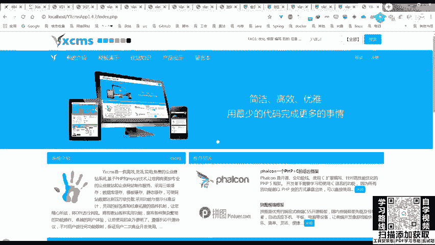

因为他们都是复用的一套代码嘛，后台代码嘛处理都是一样的那出现漏洞的话也都是一样的。那在这的话，这个地方这个CMS的话，它主要出现叉SS的地方，就是在这个留言本的这个地方。这里有一个留言内容。在这儿的话。

大家可以去尝试注入一些叉SS代码。然后他的后台页面的话。是这个admin。嗯，缺是它的一个后台页面，在这个结构管理这儿，这有一个留言本。大家可以在这儿注入一些嗯叉SS代码。哦，你在这注入叉SS代码。

然后在这儿去尝试看，或者是你在这里用F12这边有一个留言的区域展示，你可以在这里看一下。然后如果能够就是通过我们利用这个接收平台。我们的刚才搭建的这种接受平台，能够介绍到他的cookie的话是最好的。

大家这个想做吗？就是这个。这个CMS里面的这个地方，大家想去尝试一下吗？嗯，想的话，我就把这个CMS发给。发给大家。他安装的话其实也比较简单，就。你就。😔，在。😔，嗯。😊，哦，我也不记。

我待待会儿找一下那个压缩包被我放哪里去了，你把它解压之后，直接放到这个3W目录下。3W目录下之后，你直接在这边去进行一个访问，它就会给你引导你怎样去进行一个安装。其实跟刚才安装那个蓝莲花是一样的。

然后接下来安装完成之后，它就有两个页面，一个是这种普通用户的，一个是这种后台管理的那你在后台这的话就可以。看到他这边输入了一些什么东西。嗯。然后你们去进行一个尝试。这个为什么不行呢？😔，嗯，他还是不行。

好吧。那我待会儿的话，会把这个CMS以及刚才那个PPT给发给大家。那今天的内容大家还有什么？问题吗？如果没有什么问题的话。我就下课了。现在没有。好的。那你们之后如果有什么问题的话，可以过来问我好吗？

那今天的课程就到这儿，大家嗯。😔，自己去进行一个练习。那下课大家再见，明天见。最后这个吗？就是这个I这个与合法输入。最后两个。那个游戏一共有几关，一共其实应该是有20关吧，好像但是他这里的话就只有。

只只列了这么多。😔，Yeah。

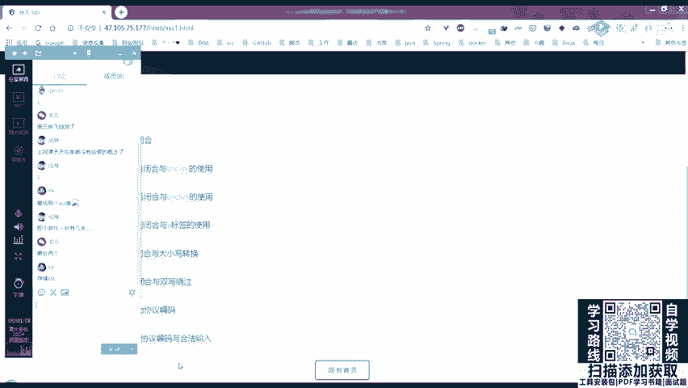

这个。😔。

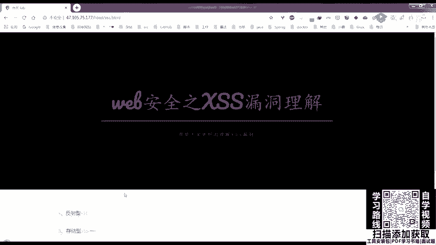

这个存储型叉S这个吗？嗯。你们课后有做就是那几个实验，实验室的实验大家有做吗？第一个应该还是不难的吧，就是第一个这个存储性的叉SS。我好像之前也。😔，做了一点点。😔，第一个的话就是。嗯。

他没有进行什么过滤。三个实验都一样的对啊，它实验场景是一样的，但是它的嗯就是那个。嗯，从从第一关好像是到第九关吧，对吧？第二个，这个存储性的话，它其实注入点在你就可以各种去试一下。

然后他其实是在这个链接这儿，我们可以。插入一个。😔，这样插入之后再发布。😔，他就有一个alentE弹出来。那前面这个反射型的叉SS，这大家都有就是已经能全部做出来了吗？

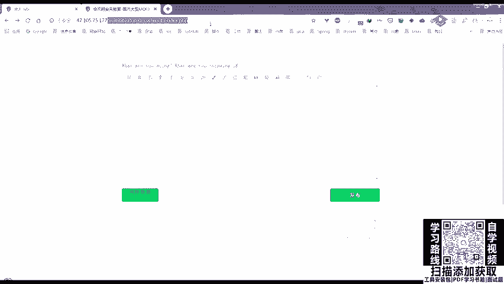

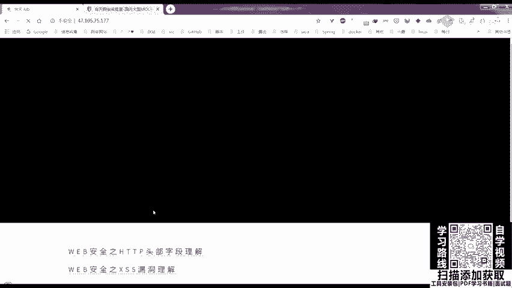

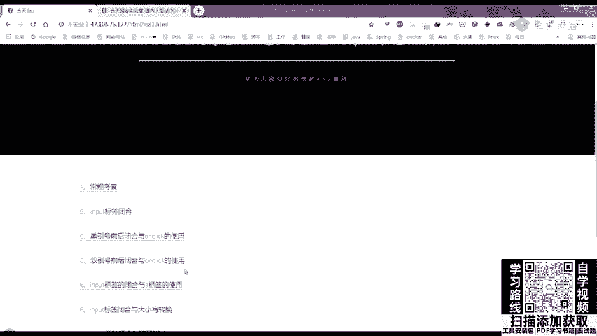

如果能做出来的话，有人愿意分享一下吗？反射型的最后两个那反射型最后两个有同学做出来了吗？如果有的话，就扣一下一呗。没有的话，就打一个2。最后这两个都没有做出来吗？就是后面这两个。最后各不会。😔。

最后一个不会还是两个不会。最后一个不会啊，那你可以给大家分享一下倒数第二个嘛？就是这个H这个这一道题。可以吗？我点这个举手的话，你们是不是。自动开启。Yeah。确认。😔，你们是不是就可以举手了？

举手的话就可以能听得到你们的声音。Yeah。你要不要来讲一下？G wolf夫4，我也不太会读。😔，Hey。Okay。Oh。Yeah。啊，你是输入的这个是吧？这个实体化。嗯，那我那你看着我打一下啊，看看。

就对不对？😔，就直接输入。😔，要输别的东西吗？还是就直接输入javaqua。Alan。叉SS。然后呢。Yeah。然后把他们都进行一个实体化吗？Yeah。行，那我这个。😔，Okay。就是将这个。😔。

复制下来contrl，然后对它进行一个实体化。😔，用这个吗？😔，这样是吧，是这样吗？行。😔，把它复制下来。😔，Yeah。把它这个替换掉，就这样，对吧？对吗？添加一个用请链接。然后点击这个友情链接。

可以哟，很棒。😔，对，其实就是这样。😔，然后它其实是插入在了这个A里面，它有两个输出的地方。第一个的话就是。这个地方。还有一个是在这个A标签里面。然后直接输出在了这个HREF的双冒号这个属性里面。

那其实这道题的话给了我们提示，就是这的话是使用这个为协议编码。之前上一节课的时候，我是不是有给大家就是。发一个编码的那种PDF。然后有说如果它是在属性值状态下的话，它是能进行一个解码的。

所以说在这儿你将我们刚才的。我们先将它进行一个解码，将它进行一个编码之后。然后直接存到了这里面这个A标签里面的这个HREF属性里面去的话。那是不是。这他就能进行一个。解码我们可以用F12。

来看一下这个友情链接这。嗯。😊，不是在这个地方。他现在已经没有了吗？哦哦，他现在已经没有了，重新插入一下。进行一个编码，让它复制。而且你要把它原本的那个let try给去掉。

因为它是直接拼到这个HREF里面嘛。如果你前面已经有这个lets try，然后再加上后面的话它就。不会成功，这添加一个友情链接，然后我们来看一下。对吧在这的话，它就进行了一个解码。

解析成了javascript冒号alentt叉SS。嗯，我这么讲对吗？这个。A Wolf，你有什么要补充的吗？你应该可以点举手啊，点举手之后我们大家就能听到你的声音，那样的话就能快一点。我这么说。

大家有听懂了吗？然后这位同学你有要补充的吗？没有。😔，那大家有听懂吗？听懂的话就打个一，没听懂的话就打个2。你们是尝试了哪一些，然后他没有成功呢？我们可以。😔，就直接输入一个。😔。

我在这儿其实之前给的是这样的一个拍lo的，就只对中间两个进行了一个编码。那如果我们不对他进行编码，直接这么。这样子的话。我们可以查看一下他的右键。查看原代码这儿。

它是会它可能是匹配了我们这个cr这个关键字，然后在这个中间的话插入了一个下划线。所以说我们只需要把它这个。嗯，这个P或者是T等等进行一个编码之后，它就那后端判断的时候，它就不能正常的识别为一个cr。

这样的话它就不能插入一个下划线，然后从而达到一个绕过的效果。嗯，可以看到我原本是这样的那这个这两个符拼起来其实就是一个T，这个116，就是嗯阿克玛的T字符58就是冒号，我们添加一个，然后查看它的源代码。

你可以看到在这边它输出的话就是以这样的形式输出的。但是在我们的页面里面，它有进行一个解码。在这儿。对吧然后我们点击之后，它就能弹出一个对话框给我们。请告框给我们。那大家这一道题有听懂吗？如果听懂的话。

就打个一，没有听懂的话就打个2。Yeah。嗯，听懂了。😔，那自然这一道题能做的话，第九题是有什么？😔，哪里不会呢？哪里卡着的呢？我们来看一下这个反射型叉SS的。

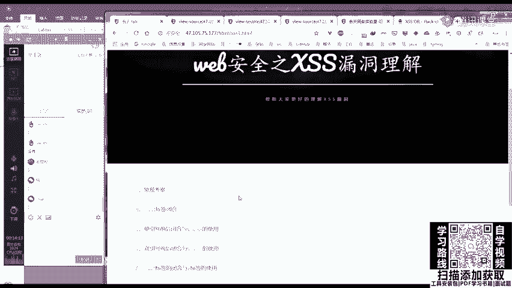

第最后这个这个尾胁一编码。这个是吧。Okay。我们可以输入一下这个。嗯，n8第八关的它的一个拍lo来试试一下，添加友情链接。Yeah。嗯。在这里的话，他会将我们的这个。这是一个输出的地方。

然后就没有了就没有地方输出了，对吧？这是第九关。前面的话，在第八关的话，它除了在这里进行了一个输出的时候，它还输出在这个A标签的HREF里面。这个是第八关的那个这个level8嘛。

PHP我刚才查看源代码留在这的，但是在第九关的时候。这这个的话大家有去查吗？这个是什么的实体编码？Yeah。嗯，在这还不能进行签吗？😔，他没有匹配的，这个应该就是那个连接符号的实体编码，对吧？

我们百度一下就知道。嗯，就是这个连接符号。在这的话，它对我们的连接符号进行了一个实体编码。然后这个井号没有进行编码，数字也没有进行编码，就是对我们这些比较。特殊字符进行了一个编码。那在第九关的时候。

可能从这儿从这个input标标签这我们不能突破。这的话他说我们的链接您的链接不合法，那我来添加一个正常的链接，看一下是不是就是合法的。嗯。

我前面试的时候添加这个百度HCV3W点百度点com添加一个有机链接。然后我们查看一下他的网页源代码。这个时候它的这个HREF这它就变成了我们这那个友情链接里面的一个呃，就是我们在这里输入的这个。对吧。

所以说它可能就是进行了一个判断。如果说你这个就是你输入的这一串东西里面含有某个前缀，比如说HCP或者是3W点什么什么什么，它就将你认定为是一个合法的一个链接，然后。嗯，把它输出在这个HREF里面。

所以说在这儿的话。是不是就可以来尝试一下。我在这儿有写的这个这个就是今天其实发到群里面了。然后讲将他这个HCP。这个后面把它过滤掉，就是这个字符串，我们其实是。含有了的就是含了这个字符串，我们添加一个。

然后。😔，你可以看到在这儿的话，他就。不会像前面这样，像说您的链接不合法，然后只有一个这个内置的话，它就是成功把这个显示出来了。那就表明它可能就只是判断了你这个字符串里面呃，是否含有这个HDP。

这个东西。你如果含有了的话，它就把它放在这里。内这的话，它同样对这个cr可能识别了一下，然后在中间加了一个下划线。那所以同样我们在这里对它进行一个编码。刚才是啥来着？嗯，就是这个。

然后在后面加上我们的这个HTTP。嗯。😊，嗯，我多答了一个题。对吧，然后我们点击一下这个友情链接，就有一个这个flag给我们。我这么说，大家有听懂吗？如果听懂的话，就打个一。如果没有听懂的话，就打个2。

Yeah。嗯嗯，哪里没有听懂。就是他在第九关的话，如果我们就是用上一关的，比如说用上一关的这个来生成一个添加一个友情链接。你可以看到他在这里查看源代码的时候。他在这个后面。直接。就是您的链接不合法。

有没有，然后。他是没有这在这个地方没有插入的，但是他除了这个地方之外。还输出在了这样的一个地方，就是这个value值里面。但是这儿的话，它对我们的特殊字符进行了一个编码。

所以我们这儿就可能不能够进行一个绕过。所以说我们就尝试添加一个正常。我的思我做这道题的思路是这样的，就是添加一个正常思。一个网链接添加友情链接，然后。查看源代码的时候，这边的话。

他在这这里就会将我们输入的这个。嗯，3W点百度点com插入到这个HREF里面，而不是前面的那种您的链接不合法。所以我就猜测后台可能是对你这边输入的一个内容进行了一个判断，判断判断什么呢？

可能就是判断你这个输入的。这一串输串里面是不是可能判断是不是HTP开头或者是怎么样。然后才把它插入到这个HREF里面，这个属性里面来。所以说我们就在前面那个piload的基础上，在后面再加上1个HDP。

嗯，这个样子。就是让既让这个字符串里面能符合有这个有这个HDP冒号2个斜杠这样的一个字符串，让它匹配到。然后能让我们的我们输入的这个东西，输入的这一个字符串输入的这些字符能够。

到这个HREF等于这个属性里面来。但是这个前面又有一个这个javascriptalt一，这样的话就能实现一个弹窗。所以说这点添加有形链接之后。右键查看源代码。在这的话，可以看到它因为有这个。

HTP所以他在这里的话。把我们输入的这个字符串添加过来了。所以说我在这再进行一个点击的时候，它就是有一个弹窗。因为在这这个HREF里面，我们是有一个javascript为协议，为协议的内容。

后面是我们的一个嗯javascript的代码。然后就是alent。嗯，然后这个的话就直接跳到第十关了。嗯，那第9块的话，大家有弄清楚吗？嗯。그。Yeah。如果弄清楚的话，就打个一。如果没有弄清楚的话。

就打个2。老陈子老陈子，你弄清楚了。ok。应该大部分人都弄清楚了。😔，嗯。Yeah。这个是。😔，那我前面给大家发的那个靶场，大家有去做吗？就是那个YXCMS那个。Yeah。Yeah。Yeah。Yeah。

那个没安装好，搭不上。Yeah。那个就留言吧发现了，为什么会搭不上呢？😔，内陈商同学，你能给我们讲讲吗？你可以举手吗？举手让我们听见你的声音啊。啊，我这没有开那个。😔，Yeah。Yeah。Yeah。

没有举手的按键。😔，嗯。那你要不然在群里面发。Yeah。老哥上对，快上呀。😔，Yeah。我一个人抢很没意思的。😊，来说来分享一下你的一个思路。听得到吗？啊，听得到听得到，你们能听得到吗？

如果能听得到的话，就打个一就就敲个一。嗯，他们也能听得到。嗯，你说吧。就留言内容那里直接写一个弹窗。啊，写一个怎么样的弹窗？我就直接选的alent一。Oh。写了一个alent译。啊。

script你就把这个。稳稳转把这个对对对，scriptcr的电路号。这样子吗？嗯，去提交到后台，他有个审核。啊，这样提交之后。楼去后台查看去后台他的那个。聊音板。哦。诶。等一下，我看看我当时写的。😊。

Yeah。😊，嗯。等一下，我看看我当时写的配漏的。😊，行好的。😔，没。Yeah。Yeah。没。Yeah。那大家还有还有同学做了这这个题吗？就只有陈商同学一个人做了，是吗？嗯。😊，Yeah。对呀。

我的目光我的这个打不开了，对一下子。😊，什么。😊，😀Yeah。😊，你哪个打不开，是你这个界面打不开了，还是什么？Oh。我把它端口换了一下，我现在调回来。嗯，好吧。😔，Yeah。安装后是这个样子。😔，嗯。

插一下这是什么错误啊。啊。好。Yeah。Yeah。哦，可咯。我啊可以的是吧，onload的那个onload的事件。熬的世界啊，你现在说。我用的onload事件，然后给他一个弹窗，就加载完毕之后直接触发。

嗯，那你是用了什么标签呢？还是没有直接一al的？用个SVG。嗯，SVG然后呢。哦好。杠一个onload标签，弹窗alent一。这样子吗？对。Okay。然后来到他的一个后台是吗？Okay。嗯，然后这边。

Yes。编辑的话就会直接触发。嗯，我这为什么没有处发？Yeah。不动，我这是可以直觉触发。Hm。Okay。嗯，对，可以的，很棒。は。😊，好，下了。可以可以。😊，哎，那之后那你之后有没有去尝试。

就把它发到。😊，发到我们平台上面，就是那种接收平台上面获觉得他的一个cookie什么的，后面的步骤有进行吗？陈衫同学。Yes。Yeah。没有你P叉SS平台还没打好。😔，好吧。Yeah。嗯。

就只有陈商同学一个人做了这个题目吗？还有同学做了吗？想要分享的。我搞定了，打开了啊，哎，真棒。那你教一教。Jwo是同学吧。是的。嗯。嗯。这儿我写了一个。😔，就是我自己尝试的一个过程。嗯，你们。😔。

就像他说的那样，把注视，把它注视就好了。哦，好吧。😔，那我带着大家，如果大家没有做的话，我来带着大家来做一下吧，行吗？Yeah。Yeah。嗯，那在这儿的话。

这个留言地方我最开始也是比较就是尝试了一下这个。8420，然后提交之后。在这边管理这边的话。直接进到这个结构管理，有一个留言本，它会在这个地方看到我们留言的一个信息。那在这儿的话有一个编辑场。嗯。

先不编辑查看，就我们先来看一下。因为我们右键查看源代码的时候，它的这些这些留言的信息应该是动态加载的。然后在我们这边的话，在这个页面里面是没有显示的。

比如说我这直接输入刚才的那个alent一可以看到在这的话，它是找不到的。所以说我们可以直接使用F12，然后点这个来选取元素，看一下它在里面是怎样的。那在这的话，可以看到在这个地方，我把放大一点。

在这儿的话，它是会在我们这个中间加上一个。左右间括号一个X这样的一个标志。那可能就猜测后台的话，它可能就是对这个cr这个进行了一个判断。如果你这有一个cr的话，我就在中间加一个。这个X。

所以的话这的话那就不能使用这个cr这个标签了。那我们就尝试一个别的呗，比如说一个image标签。HRC然后。On euro。等于alentt。😔，一。4278。😔，提交。

然后同样来到一个他的留言本这个地方。同样进行一个。😔，编辑查看。그。嗯，你在这儿的话可以看到它在这个on事件这儿on，然后El这中间也是加了这个X的那刚才那位同学又说他说编辑查看之后。嗯。

它这就有一个弹窗了，我们可以就是来看一下，在应该是在这个地方留言内容这儿。你可以看到就是在这个地方的话，它中间那个前面中间这个one中间不是插了一个左右监括号X吗？在这的话。

它就并没有对它进行一个过滤了。所以说它在这里的话就进行了一个alent一，就弹出了一个一的一个警告框给我们。嗯，这儿大家可以想一下，那么如果我是想绕过的话，有哪些方式呢？

就是在这这里的时候就是不点不让他点，就是即使他不点这个编辑查看，也能让他有这个弹窗。嗯，这样的话就可能需要大家去想一下有哪些嗯，可以进行一个绕过。Yeah。嗯，那在这里的话。

它除了它既然我们编辑查看之后，它是可以有一个弹窗的，就是在这个后面。它是就是那个on euro中间就不过滤了嘛。那所以我们在这个前面是不是就。人在。这里。Yeah。

这个后面我们加一些new image点SRC这种你们之前实验做实验的时候，是不是做过这种？就是做那个叉SS呃原理与实践的时候，那个实验。在这里的话，我们就可以输入我们的那个。

local host那在这的话，我就直接用。

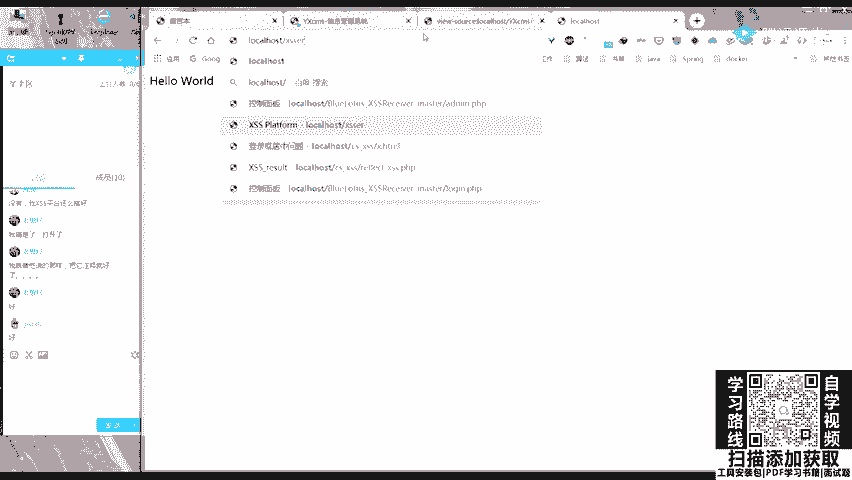

南莲花的吧。这个平台。嗯。Noello。Yes。

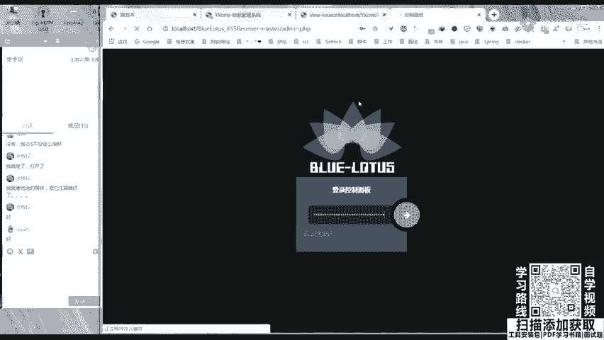

嗯，这两个这两个是一样的，这个两个JS都是一样的，只是它们名称不一样。在这里生成拍lo的，把它的这个。SRC复制下来。然后直接粘贴到这个地方。把这个复制下来。Yeah。然后这边6852。提交之后。嗯。

来到留言本。然后编辑查看。这的话他并没有一个什么，不是我们之前嗯，如果他能接收的话，他在这个title这就有一个收到一条消息嘛。那在这儿没有显示的话，可能是说明失败了。那我们来看一下。嗯。

可以看到在这个地方，这个on euro这，它从我们这个空格这里就直接将它断开了就。它自动加了一个双引号，它的on error就等于new，然后image点source就等于后面的。

然后我们看sourcece的话呃，network的话。这里面也是没有对那个JS进行一个加码加载的。我们。😔，这里是用的。😔，哪个拍楼的。😔，这个test点JS，我们可以在这个。这边找一下，他也是。哦。

在这个地方。他是有。有发出去的。这里他去请求了，而且是1个200。但是我们在这并没有接收到。嗯。😊，那所以他在后台的话可能做了一些限制，或者是怎么样。那阵儿的话就我就可能想了另外一种方式就是。

将他们进行了一个拼接。大家看得清吗？就是在这个。Oh。un euro这里。在这里的话，我直接在document点body点append child。我，可以。😔，嗯。

我直接把这个拍lo的输入进去给大家看一下吧。就看一下效果它会是怎样的。嗯，可以看到在这的话，他就有一个提示，就是收到一封消息。改到技收面板这。就是刚才收到了嘛，4月3号8点47。

然后在这的话就有它的一个cookie。对吧。那我们来看一下，在这个留言内容这，它最终。是什么呢？就是在这个un这document点body。

它就是选取了我们这个bodyHTL里面不是第一节课的时候给大家说就是头部和 body底部分嘛。然后在这的话它加了一个。标签，然后是用scriptcr，因为它后台是顾虑了script这一个。呃。

字符串的它们连在一起的一个字符串。所以在这里的话直接使用加号将两个分开，然后用加号，然后把它们拼接起来，就是一个scriptcr的一个字符串，只是他们。嗯，输入的内容就不是连续的了。

然后这个create element的话就是创建一个script这个标签。然后这个script的SRC就是引用外部的1个JS代码嘛。那在这的话，我就直接输入了一个。我们这边接收平台的一个地址。

你可以看到在这个下面，在这个地方的话，它就创建了一个cr的标。的元素，然后它的SRC就等于这个这个就是当如果这个嗯图片加载失败的时候，就是出现错 onE的时候，这个我刚才输入的这一串代码。

它最终执行的效果就是生成了一个。cr的一个标签，然后它的SRC是这个样子的。我这么说，大家有听懂吗？Yeah。Yeah。没有人理我。😔，如果大家有听懂的话，就打个一。如果没有听懂的话，就打个2。嗯。

陈商听懂了。就感觉好像就这么操作就可以，但是就是有点懵。嗯，我不知道你什么意思。😊，原理懂了，回头再研究一下这个写法，嗯，可以的。有些东西是也是需要靠积累的。然后就是积累一下别人的一种姿势或者怎么样。

然后自己就进行一个模仿改造，可能有些东西就能进行一个热过了。那在这儿的话，之前不是说我们这个前面要点开之后就依靠自己他后台在这边可能没有进行一个过滤的，然后有就直接这样给我们有一个弹窗了吗。

那我们有没有办法进行一个绕过呢？嗯。那在这的话，其实有一个绕过方法，可能是他后台那边没有处理得当，然后造成了这样的一种绕过。嗯，我这是也有写，就是后台可能识别了事件。

那如果把on和后面的load on呃e就是onload on euro这种字符分开的话，它是不是就嗯不能检测得到，然后就不能插入那个左右间括号X那个东西了，是吧？然后可以有一种方式就是在这中间插入一些。

想C等于。😔，在这的话插入0%A的话就是。嗯。0A和00D就是回车换行符。有些时候你中间加这个，它还是能够触发的。所以在这里我们也同样进行一个添加试试看，看看能不能有一个效果。

因为这样的话就能将他们就是两个。Yeah。嗯，隔开嘛，然后让它不匹配到，然后不不让他插入那个左右监框X。在这里看一下。嗯，它这里的话还是把0A插到了这个un euro里面，所以说它也没有一个弹窗给我们。

那在这的话可能这种方式就不行。那我们尝试另一种。我直接在这个中间加入一个回车呢。这样他能不能行呢？😔，Yeah。在这个留言板这里。然后这个也是没有弹窗的，说说明还是不行。看一下。

这里的话它中间就有一种这种空格，然后的形式展示给我们。然后没有把这两个字符连接起来。虽然它中间没有插入那个左右监括号X了吧，但是它也不能进行一个触发。所以的话在这里的话就不行。然后酒壶。😔。

也是无意中发现。等于alent一。😔，在这个中间加一个反斜杠。这样也是将他们进行了一个隔开，内看一下他们是会能不能起作用呢。因为反斜杠它的意思就是在程序里面的意思就是转译嘛。

那我后面那个字符本来就是一个字符并没有需要转移的。所以说它还是原本的一个字符，但是又在字符上面上面将它们隔开了。可以看到在这里的话，它就有一个弹窗给我们，我们可以来看一下。嗯，这的话就。把它连接起来了。

然后起到了一个alent的一个作用。后续的操作的话，所以说在这儿即使我们后台后台的管理员只要打开这个留言本本这个标签。然后它就有一个一弹出来。所以说在这其余后面的那些操作这种这个。就跟前面的一样。嗯。

我到时候把这个我简单写的这个东西发给大家吧。其实刚才都有讲了，这个还需要发吗？如果需要发的话，就扣个一。嗯，行。嗯，那大家还有什么疑问吗？嗯，可能你们比较忙，然后有些地方没有。

就是自己没有亲自去尝试一下的话，还是可能差点意思。那大家嗯星期六星期天的时候，大家就尽量去尝试一下。而且我们之后老师不是说会带着大家进行实践嘛，就大家好好学。像这种双引号实体编码后是不是就不行了？嗯。

嗯，可以这么说，因为。😔，你要看它输出的地方，如果它输出的地方就单单只是在那一个属性里面进行一个输出。就比如说在这里的话，它只在某个属性里面。某个value属性里面进行一个输出。

然后它又对你输出的一个内容进行了一个实体编码。那这样的话，你无论如何也跳出不了它的那个属性值的那个双引号，就你无法闭合它，然后插入自己的一个。嗯，代码，所以说的话就可能不能进行一个。让过。

大家还有什么问题吗？我这么说，大家能懂吗？这样就能防御了。但是并不是并不是每一个。就是你要看它的一个业务功能，它并不是每一个都输出在属性中。它有时候可能输出在多个地方。那你可能如果。

有些地方他没有进行一个。嗯，判断或者是漏漏的话还是。人。😔，就是有疏忽的话，我们就还是能进行一个绕过嘛。当然他如果做的好的话。那我们也没办法。😔，或者是说。😔，嗯，可能我们技术还不达标。

然后还要继续学习，看一下是不是有其他的一些方式。嗯，大家还有什么问题吗？实验的话，大家有问题吗？就是。实验其实实验指导书说的都还蛮详细的，应该。不会有什么问题。

那个进阶123叉SS进阶123其实在那个如果大家不会的话。叉SS进界123嘛？不是给大家布置的。然后在这个叉SS基础防御对策里面。基础防御对策123里面，其实他给了。给了我们。能够注入的。排漏的。嗯。

在这儿他就教你怎么样来进行一个测试，以及怎么样进行一个防御。就是这个基础防御对策123。这三个实验里面对这个叉SS进阶123的那些实验进行了一个。讲解吧嗯。大家还有什么问题吗？对。对。Yeah。

Yeah。嗯。你不是你不是直接你不是用PHP study打开了吗？我不是看你。那PSB study的话，它默认就是mysl啊，mysql数据库啊。启动了？😔，Yeah。你们俩都是这样的。嗯。怎么会呢？

😔，嗯。这种环境的话，我待会儿我待会给你们查一下那课程内容的话，大家还有什么问题吗？配置哎呀嗯。是单独开启的。你重启试一下呢，要不换这个mycyclcle5。7。26。试试。这种环境的话。

后面再说那今量课程。直接下一步，他应该不会让你直接下一步吧，那你直接下一步试一试。你这他不支持的话。他应该不会让你直接下一步。不会有不会有什么问题的，你大不了就重新删掉了，然后重新解压嘛。嗯。

他让你进来了。那好吧，那你那你继续吧啊，那你就嗯输入数据库名啊什么的什么的。嗯，那大家应该就没有什么问题了。那今天的内容有没有人提的话。那今天暂时就先到这儿。大家星期六星期天的话，好好跟老师一起学。

好吗？那今天就到这儿。行。行。那今天课程内容就到这儿，大家嗯再见，好好学习，天天向上。

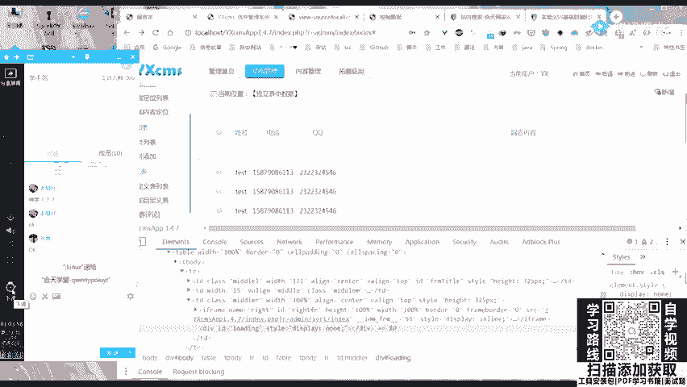