# CTF教程：CTF初学者必备的1000个练习题，每日一练，百日成神！（ctf-wbe／ctf-pwn／ctf-misn／ctf-逆向） - P56：文件上传漏洞 - 白帽子讲安全 - BV1dp4y1j7aN

好的话我们先来了解一下什么是we share。🤧う。呃，就web share的话就是呃以SPPHPJSP等等这一些网页文件。的一个形式存在的一种命令执行的一个环境。

然后的话这一些这一些呃网页文件的话都是一些动态的一些脚本文件。我们的话可以将其称作为一种网页木马的一个后门。然后的话攻击者就是呃通常会通过这样的一个网页后门的话，来得到网站的一个服务器的一些权限。

包括的话控制网站服务器来进行一个文件的一个上传下载，还有查看呃数据库以及能够执行命令。前面我们有提到，就是说网页木马后门，那什么是一个木马呢？木马的话，它的一个全称就是这一个特罗伊木马。

英文的话是这样子的。就它是指技术在计算机里面的一种非授权的一个远程控制的一个程序。然后它的一个作用的话就是呃开放系统的一个权限，然后泄露用户的一个信息给攻击者。然后的话是呃黑客常用的一种工具。

而且他的他是能够在计算机管理员。不被发掘的一个情况下来得到系统的一个权限。嗯，后门后门是什么呢？啊，首先我们需要了解到，就是说我们的一个计算机，我们的一个服务器。上一台计算机上面的话。

总共的话是有65535个端口，65535。然后每一个端口的话，它就是呃计算机与外界连接所开启的一个门。就说呃计算机与外界与进行与外界进行一个通信的话，就是通过端口。来进行一个通讯的然后每一个门。

也就是每一个端口的话，它会有提供这样的一些服务。然后攻击者的话就通过利用这样的一些服务来获得问服务器的一个权限。然后并且给自己进入计算机留下一个后门。就常见的一些服务。比如说我们之前说到的一个8联端口。

对吧？八联端口的话，一般的话默认都是呃提供的一个web服务。也就是我们访问的一个网页的话，都是呃一个web服务。然后的话还有就是说呃我们的一个远程桌面，对吧？

3389端口就提供我们能够通过远程去连接啊计算机的一个桌面。还有的话就是呃常见的一些。inux系系统里面的SSH就我们可以通过SSH的22端口。来去连接我们的一个linux系统。哦。Oh。

 what was you？然后的话web需它会它根据文件大小的一个文件大小，以及根据脚本的一个类型的话，进行了一个分类。首先第一个就是根据文件大小分类的话，有以下这三种。第一个的话就是一句话木嘛。

也是我们经常就使用到的。它的一个优点的话就是代码简仅简短。我们从名字的话也能够知道它就是只有一一行代码，也就是一句话嘛。然后它是使用的话是十分的一个方便。然后还有就是小码。

小码的话就是呃包含文件上传功能，它的体积的话。啊，比较小，当然的话它是相比于大码来说，它的一个体积是。呃，比较小的。啊，代码的话，它的一个体积的话就比较大啊包含的话是有很多的一个功能。

然后它里面的一个代码通常也会进行一个加密的一个隐藏。因为它里面的话呃代码的话代码量的话是比较多的，里面的话会有一些呃敏感的一些函数。然后通常为了就是说绕过一些呃对代码。呃。

里面的一些函数的一些敏感函数的一个警测的话，它通常会进行一个加密。啊，第二个的话就是根据脚本类型去进行一个分类。我们常见的就是像这种GSPSPSPSX以及PHP。

这些的话都是一些呃动态的一些网页脚本文件。但然的话像我们现在其实呃经常去讲的也是像PHP啊。因为呃我们经常碰到的一些网站啊，一些CMS都它都是基于1个PHP的一个语言去进行一个开发的。🤧嗯。😊。

那web share的话，它有一以下的4个特点。这样的话我只列举了4个。前面我们说到就是说web share的话，它一般都是由这样的一些动态的一个脚本语言呃呃呃拼写出来的。

比说它是一个一个动态脚本的一个形式出现。然后的话他就是一个。这样的值的一个木马后门，就说web share它就是一个木马后门。

然后木马后门的一个特点呢就是说我们能够通过这样的一个呃PHP的1个web share。比如说一个PHP的web share，能够得到呃服务器的一个权限，以及能够在服务器上面去执行我们想要的一个命令。

以及查看服务器里面的一些敏感信息等等。🤧嗯。😊，第三个的话就是web share，它是可以穿越服务器的一个防火墙。就是说呃。我们这里说的一个web share，其实从名字上面就能够知道，就web嘛。

web，然后跟share的一个组成。有web的话，它是我们常说的一个web服务，也就是我们啊经常会去使用到的一个80端口。share的话就是一个呃。

一个后门就是能够得到权限的一个啊这样子的一个web share一个web后门。然后b share的话，它通常都是通过80端口去进行一个数据的一个传递的。也就是说。

攻击者与我们的一个服务器去进行一个交换数据的话，它都是通过1个80端口去进行一个呃传递数据的。🤧嗯。嗯，所以的话就是web share，它一般不会在系统日志里面去留下这样子的一个记录。

它只会在我们的一个web日志。留下我们的一个数据传递记录。🤧嗯。然后的话。我们了解到了一个web share的一些基本的一些特性。我们一起来了解一下，就是说web share。

我们如何去利用一个web share来去进行一个攻击，就它的一个攻击流程。先第一个。就利用外b漏洞去获取外围的一个权限。就比如说我们呃一个通过一个网站，对吧？通过1个CMS的一个网站，我们呃。

得到了他的一个web权限，就是说能够去执行命令，或者说我们能够去上传文件。也就是我们之后会去讲到的一个一种方式。还有的话就是说呃。通过呃就是上周有讲到的一个circlecircle注入，对吧？

通过circle注入也是可以得到一个web share的。嗯，得到这样子的一个web share之后的话，我们呃通常会去上传一个小码。为什么要去上传一个小码呢？就前面我们有了解到就小码的话。

它就是一个文件上传的一个功能，对吧？我们利用它的一个呃文件上传的一个功能来去上传我们的一个大码。这里的话大家一定要就是呃就明白要区分开来，就是说小码它的一个作用就是为了用来算上传大码的。

就是说呃你们可能会有疑问，为什么我不直接去上传一个大码呢？对吧？就这里的话就我们前面有说到，就大码的话，它的一个体积是比较大的。就说它呃它的一个代码量是十分多的，等会的话会给大家去呃看一下。🤧嗯。

它的一个代码很多的话，就是说我们直接去上传的话，它的一个呃就是数据的一个传递的话，量的话会比较大。就是说动静会比较大。然后的话我们通过这样子的一个小码去进行一个传递的话，就呃要更加的一个隐蔽。

也更加的就是说能够去绕过他的一些呃。检测。第四个的话就是呃远程调用web share来执行命令。也就是我们最终的一个目的。就是我们通过我们上传的这样子的一个大码。

还有的话就是我们的一个呃来去执行我们的一些命令。获取服务器的一些信息等等。这就是一个基本的一个啊利用web share去进行一个攻击的一个流程。Yeah。哦，下面的话我们一起就是大概来看一下。

就是说我们常见的一些web share。🤧嗯。😊，首先第一个的话就是PHP的。我这里的话有列举了两个。🤧。Yes。嗯。然后这里的话都是以一1个一句话木马的一个形式，就说呃是一个一句话木马。

我们首先看来看一下第一个。第一个的话它是一个PHP的一个呃web share。也就是PHP的一个一句话木嘛。🤧嗯。然后呃这里的话。我就大概介绍一下它的一个结构吧。就是说PHP代码的话。

它它都是以这样子的一个开头以及结尾。如果开头的话，它是有一个这样子的一个金括号，然后接一个问号，后面的话是接PHP。就说表示我们的这样的一个文件，它是1个PHP。PP的一个代码文件。

然后结尾的话同样的是接一个问号以及一个监框。就是呃这前面的话呃就小于号以及大于号。当然的话不是。那这就是这个意思吧。然后中间的话就是我们的一个呃代码。这个代码的话就是我们首先看一下这一个L函数。

这个L函数的话就是用来执行我们的1个PHP的一个呃命令。我们可以看一下。🤧L函数它的一个解释对吧这个L函数的话，它是把字符串作为1个PHP的一个代码去进行一个执行。🤧就大家心有这样子的一个概念。😊。

然后的话我们再来看一下中间这一个括号里面，括号内容里面的话就是呃我们用来传递数据的一个方式。传递呃传递字符串的一个方式。因为前面我们说到就是说这个L函数的话，它是用来执行我们的一个呃。

就是把我们的一个字符串作1个PHP代码去进行一个执行。然后这里的话我们需要传递一个我们的一个字符串。然后这里传递字符串的一个方式的话，就是以get方式去进行一个传递的。就是说呃这一个多的符号。

下划线加一个get。🤧咳。注注意的话是要大写的啊，这一个中括号。呃，这个叫方框吧。然后里面的话就是接一个参数pass，就是我们通过这样子的一个pass参数来向呃我们的这一个。文件去传递我们的一个数据。

也就是传递我们的一些命令。同理的话，第二个就是以一个pos的方式。嗯。然后呃关于这一个get post的话，就是前面讲那个。

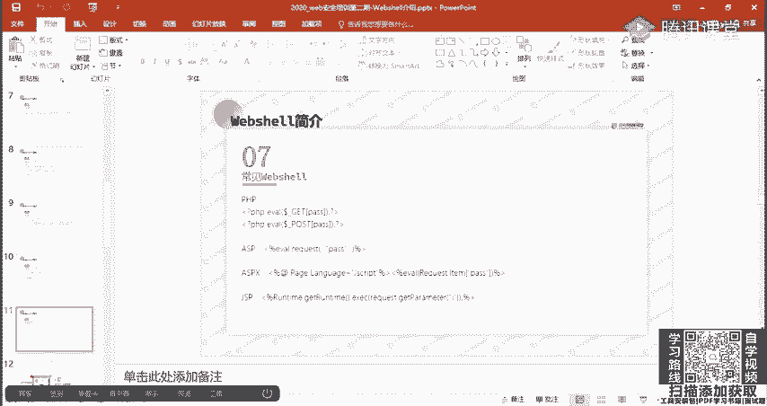

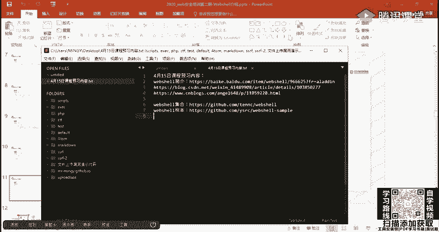

HB方法的时候，大家应该都有都了解了吧。这其实前面的话已经有讲过，如果还是没有不是很明白的话，呃，不知道大家有没有去看这样的一个文章。说PHP里面他的这样子的几个。函数的一个区别。就说get的话。

它就是用get方式来提交数据。我们前面有提到，就是我们提交get数据的话，就是比如说这里是1个PHP文件，对吧？我们在后面接一个问号，问号后面的话就是接我们传递的一个参数。

然后传递的一个参数的话就是一个比如说我这里的一个木马就是一个pass参数，对吧？然，这一个pass参数的话就是后面的话接我们的一个。🤧嗯。😊，啊，传递的一个字符串，这个字符串的话就会传递到这样呃。

就传递到这里。就这一个意思的话，就是获取我们通过这样子的一个get方式传递的一个数据。然后的话给这样的一个L函数去执行。然后这样的话，我这里比如说我这里输入一个p info是吧？🤧哦。

它传递到一个L函数的话，它就会显示1个HP in的一些信息给我们。然后的话pos的话也是同样的。这样的话呃。后呃等会儿我会以实际的一个例子去给大家做一个演示。然后就是ISP接SPX啊。

还有GSP这一些的话哦。就大家呃看一下了解一下吧。这样的话其实它的一个大体的一个框架也是类似的。只是啊就是你写这些脚本的一个语法的话，语法要求的话它是不一样的。可以看到的话。

这里是通过一个request。它同样的也是一个就是呃通过request来获取我们传递的这样的一个呃字符串。然后的话给L函数去进行一个执行啊，以及下面的这里也是同样的一个意思。

只是的话它传递的一个呃就是它的一个函数呃，它是不一样的。🤧。啊啊，我们前面大概了解了就是web share它的一些基本的一个呃特点，以及它的一些基一个基本的一个样子。好。

下面我们一起来了解一下web share它的一个基本的一个原理。就web share它的一个原理的话就是首先第一个就是它是一个可执行的一个脚本。🤧嗯。然后的话这里的话是。呃，HTP的一些数据包。

也就是我们通过这样子的一些方法来去进行一个呃获取我们传递的一个数据。呃，就是接收我们传递的一些1一些字符串。然后的话给我们的一个呃执行函数。去进行一个执行。然后第二个的话就是一个数据的一个传递。

就说我们通过我们的一个呃pass参数。比如说以这个为例子，通过我们的一个pass参数来向呃我们的这样的1个PHP的一个脚本来传递我们的一个数据。第三个的话就是执行传递的一个数据。

执行传递的数据的话就是有以下这样子的几种形式。Yeah。呃，当然的话我这里的话是以呃PHP脚本文件做一个呃举例。系。然，首先第一个直接执行的一些PHP函数，有这样的一些我们常见的。

也就是呃经常去使用的一个ever以及sstem就执行系统命令。ever的话，它是把我们的一个字符串，对我们传递的字符串作为一个PHP的一个呃文件去进行一个执行。啊，对，第二个的话就是文件包含。

文件包含的话就是呃在下一节课就在文件我们讲完文件上传之后的下一节课就会给大家去介绍一个文件包含。就我们通过文件包含。这样子的一个漏洞来去包含我们的一个文件来执行文件里面的一些PHP的一个代码。

那第三个的话就是动态函数的一个执行。呃，这里的话。这里的话大家了解一下吧，就可能呃不是如果没有了解过PHP的话，可能不是会不不会很好懂。我们以这一个为例子。🤧嗯。

就说我们这里就传递一个这样子的一个HHP给这一个变量，对吧？然后的话我们可以把这一个变量。当做一个函数。来就是去进行一个执行。就比如说这个的话传递了一个这样的一个字符串。

对吧PH in four然后的话。我们可以把这个H in for字符串当成一个函数来去进行一个执行。然后它执行之后的话，就是啊会返回一个H in的一个信息。啊，最后一个话就是回调函数。呃。

这里的话呃先了解一下，就在呃之后的一个课程，就是在讲命令执行的时候，我会呃给我会给大家做一个详细的一个介绍。🤧嗯。然后的话就是我们一起来了解一下，就是常见的一个HP web share。

就其实前面的话已经给大家有做一个基本的一个介绍。我这边的话就列举了呃三种方式，就是说get方式来去进行一个传递数据的，以及pos的方式。还有我们可以通过cookie来去进行一个传递我们的一个呃支符串。

也就是传递我们的一个命令。然后这里的话，我以呃我做一个演示。🤧嗯。行好，我这里先先进一个呃。比如说ge。

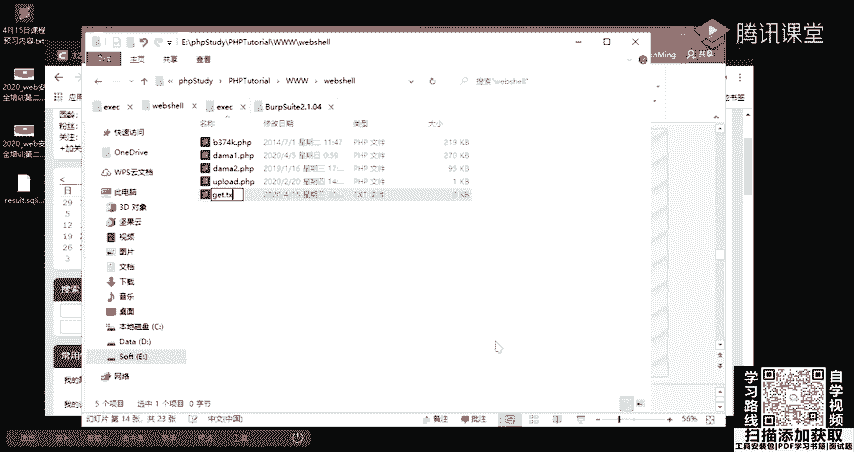

新成一个get的1个PP文件。

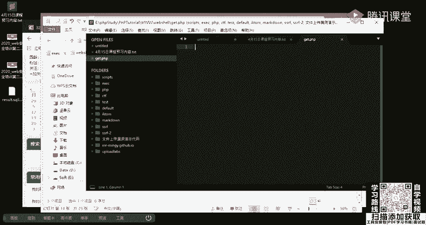

然后的话我直接把它复制过来。复制过来，然后这里的话就是一个一句话木马的一个片区文件了。嗯。

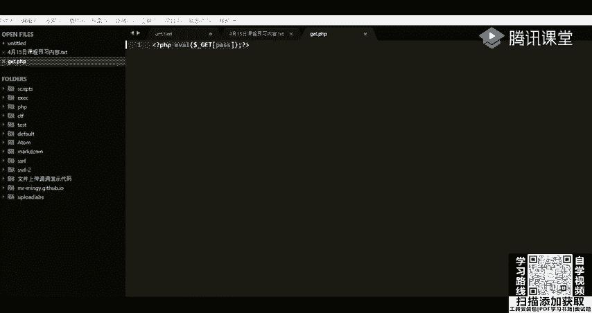

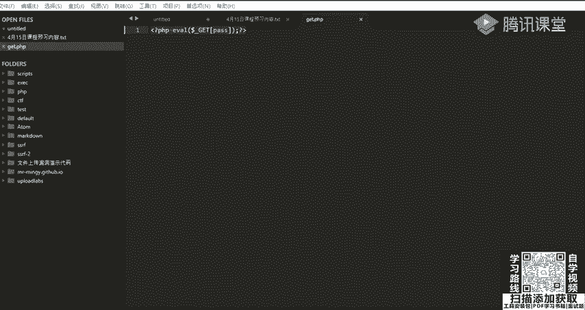

嗯。

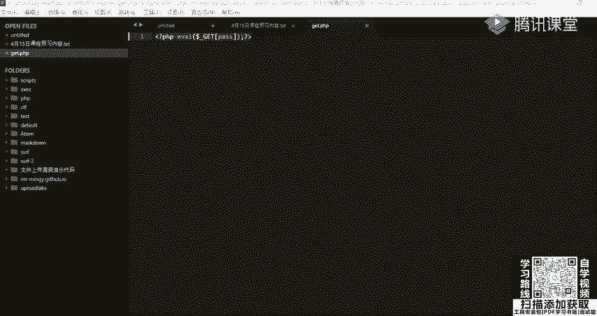

嗯，就这样吧。🤧然后这就是一个呃PP的一个呃一句话木马文件。

啊，我们怎么去进行一个访问？然后的话去进行一个执行命令呢。我这里话是在1个PHB呃 study的一个环境。嗯。😊，Yeah。Oh。ge点PHB。然后我这里的话直接去访问这样子的一个一句话木马文件的话。

它是会没有回显的，就没有任何的一个显示。如果大家看到有就是说没有这样的一个显示的话，就说明你这一个文件是能够被解析执行的。如果说有报错，或者是说无法访问的话。

那就说你那就是说明你这你的这样子的一个一句话木马文件，它是无法去进行一个解析的，如果无法去解析的里面的1个PHP代码的话，那么我们就不能够通过这样子的一个木马文件来去呃得到服务器的一个权限以及执行命令。

嗯。啊，我们怎么去呃利用这样子的一个get方式来去进行一个传递参数。首先我们。🤧嗯。😊，以get方式，然后我们传递的一个字符串的话。是要给这一个pass参数。我这边的话传递一个pa in。

然后大家要注意的话，我这里的话是传递了这样子的1个PHP for的一个字符串，其实也就是一个函数。1个PP four的一个函数。然后呃。这里忘记提了一点，就是PH in好不PHP。呃，文件的话。

PP代码的话，它都是以一个分号去进行一个结尾的。就说你必须你在呃P区呃代码后面你需要加一个分号来表示你的这样的一个代码是已经呃就是结束了。就说这样子才是一个完整的一个代码。啊。

我们回车回车之后的话可以看到。它显示了这样子的一个PHP for的一个信息。就这这一个的话就是PHP for的一个信息。它里面的话就是包含PHP的一个版本啊，还有PHP里面的一些详细的一些信息。啊。

以及他的一些配置的一些扩展啊。🤧嗯。😊，什么的呃，还有就是阿帕奇的一些环境。等等，对吧？这样的一些信息都能够啊被列出来。啊。

这里的话就说明我们的这样子的一个呃一句话木马文件是执行了我们这样子的1个PHPin的一个代码。他的话可能大家可能就是觉得就只返回这样的一个信息，呃，没有什么用，对吧？我们可以通过一个system。

这样子的一个函数来执行我们的一个系统命令。然后因为我这里的话是在windows系统，所以的话windows系统比如说我先呃查看一下IP对吧？就IP con big。等号。

然后我们回车回车之后的话可以看到我这里的话就显示了我当前。这一个机器的1个IP地址的一个信息。

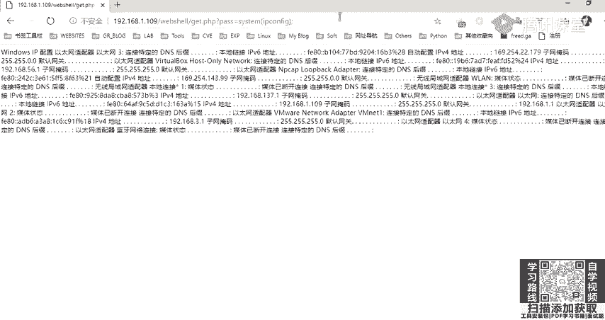

佢。呃，也在这里。看到。就是等于就是呃在这里。嗯。😊，等于就是我通过这样子的一个。我不需。然后通过这一个stem函数来执行了呃windows系统上面的1个IP config来查看IP信息的一个命令。

然后这里的一个返回信息的话，跟这里是一样的。你看到我这个IP是1。109，对吧？

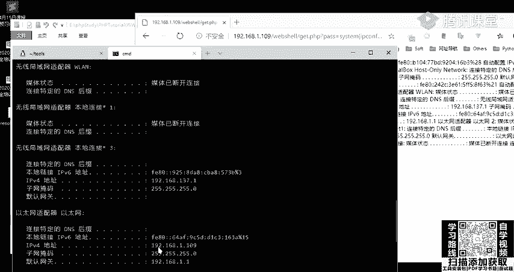

🤧嗯。😊，这就是执行它的一个系统命令啊，以及比如说呃DII来查看，就说我当前目录下面的一些文件。然后当前目录的话就是这个目录。然后我这里执行的话可以看到它会显示。我当前目录的这样的一些文件。呃。

这样的话是。嗯。它这里显示是是这样子去显示的，可以看到就是呃这里有一个呃时间，对吧？还有的话就是这里的话是一个文件名，然后前面的话它是一个文件的一个大小。有1个B374K对吧？这样子的1个PHP文件。

以就还有个大码一，还有大码2。对吧总共的话是有5个文件。对。这就是一个呃PHP的一个一句话木马的一个web share。然后的话还可以去去执行其他的一些命令，就是说在windows里面的一些其他命令。

大家可以尝试一下，比如说呃net的。就是查看啊。用户。拿他业务做。Yes。

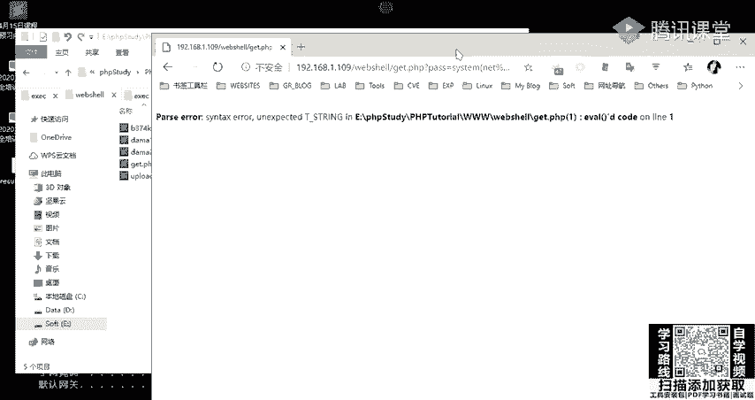

🤧。

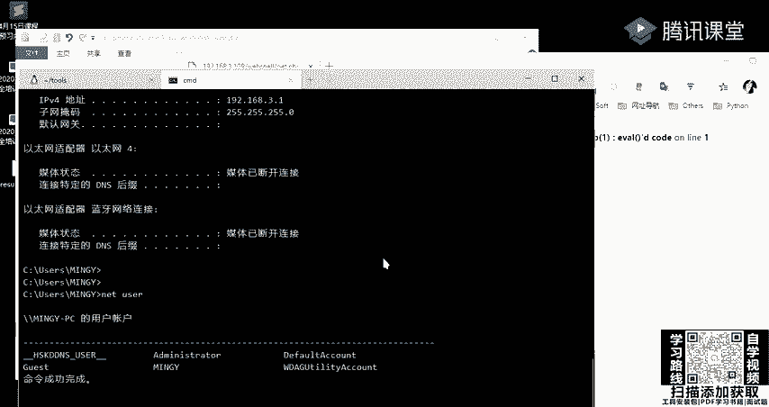

Okay。🤧。🤧Com。不电话报错了。咁咁。嗯。Sorry。🤧嗯。啊，比如说我可以执行这样子的1个LS命令来查看当前的一个目录。然后在linux里面的话就呃我们使用的话就是一个linux的一个命令。

这样的话，因为我这里的话是有有这样子的一个lininux的一个环境，所以的话可以去执行这样的一个命令。然后这里的话就是一个get方式。一个get方式去传递我们的一个啊就是执行命令的一个字符串。

备一个一句话木马。然，我们一起来看一下，就是以pos的方式。去进行一个传递。

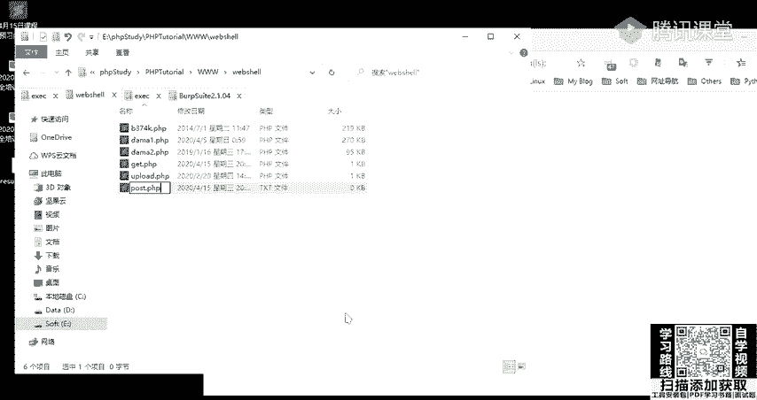

🤧嗯。🤧嗯。😊。

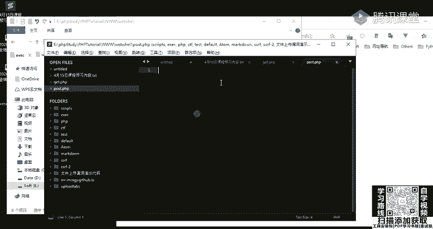

🤧咁。我们。

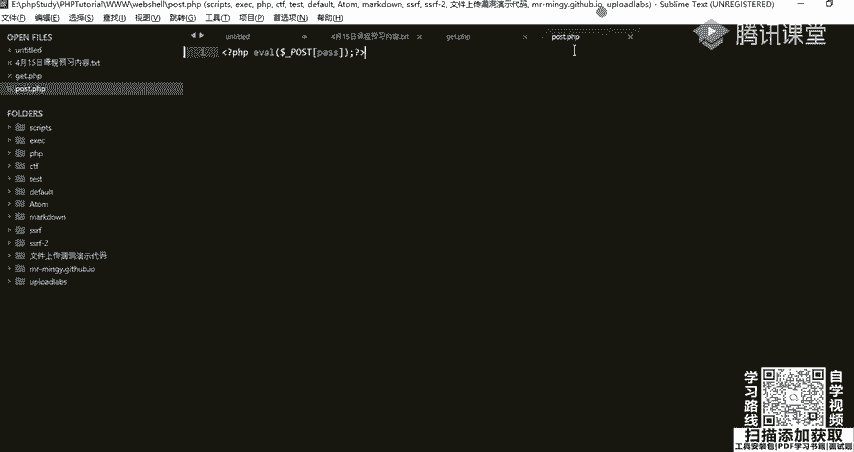

保存。保存之的话，同样我们呃。进行一个访问。安想は。呃，不好意思啊，喉咙有点痒。系。嗯。🤧。然后稍微有一点咳嗽，所以的话。🤧可能讲的不是很就呃稍微有点咳嗽声，就希望大家见谅。🤧嗯。

然后的话我们可以看到就是我这里直接访问之后的话，它是没有任何其他的一个报骤，就说明我们的这样的一个一个一句话某文件的话，它是能够被正常解析的。然后的话我们怎么去进行去进行一个数据的一个传递。

也就是执行我们的一个命令。我这里的话用啊一个ha bug的一个插件，当然的话你也可以使用1个BP。🤧Okay。🤧嗯。🤧我们通过BP抓取这样子的一个数据包，对吧？然后的话我这里的话因为是使用的一个。

要去使用一个po的方式去进行一个传递我们的一个数据，对吧？然后我这里的话是一个get方式，所以的话我这里需要把它做一个就是转换。转换的话，这里有一个小技巧，就是呃在BP里面的话，你右键。右键或者是说呃。

啊，你右键就右键。然后的话这里有一个chan request method，就是呃改变我们的一个请求的一个方法。然后我们可以呃就是选择一下，选择之后的话可以看到我们当前的一个数据包的话。

它是改成了一一个pos的方式。对吧。就不需要我们自己去手动去改一些啊一些。请求头。而我们toto的话。大家应该都知道，就是我们pos的一个数据化是在我们的一个请求包里面的一个请求题里面，对吧？

就是说在这里我们。去进行一个数据的一个传递。我们这里拟1个PHP。去进一个传递。🤧传递我们的1个PP的一个函数。然后我们执行执行之后的话，可以看到有这样子的一些返馈信息。就大家可能看到这一些信息的话。

不知道它是显示的一个什么内容，对吧？我们可以通过BP里面的这样的一个功能，这个。然后这里的话它会显示就是说当前的就是你的这一个代码在web上面它显示的一个样子。

就呃就是能够让我们更加直观的去看到当前的一个请呃一个返回包的一个内容。可以看到这是一个PH in对吧？啊，我们呃同样的。Okay。通过stem函数。来去执行我们的一个命令。呵。嗯。好。

我们执行执行之后的话，可以看到。这里返回了。我们的一1个IP地址的一个信息。这就是以一个pos的方式去进行一个呃。去进行一个呃执行我像我部cha传递我们想要执行的一个命令。他的话呃。

我们也可以通过这一个hack bug的一个插件，就是呃5谷歌浏览器里面有。这样子的一个插件。我们可以通过这个插件来去传递我们的一个。min你。然，我们咨行。对。Okay。Okay。Okay。

可以看到的话是可以执行我们传列的一个命令的。

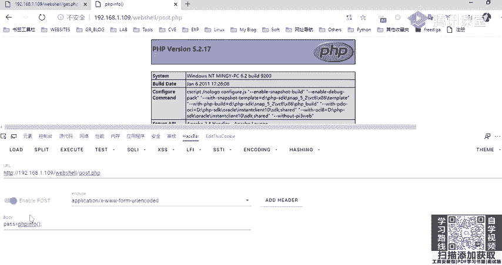

这就是一个po的方式。🤧Okay。去呃向我们的一个一句话木马传递我们想要执行的一个命令啊。

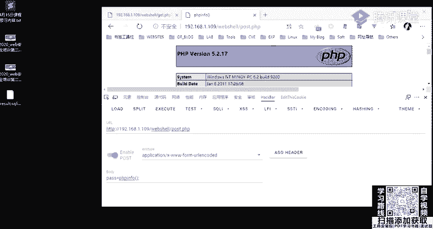

好，第三个的话就是呃一个cookie的一个方式去进行一个传递。它的一个代码的话就是这样子。好了，那你的话。把代码发群里吧。

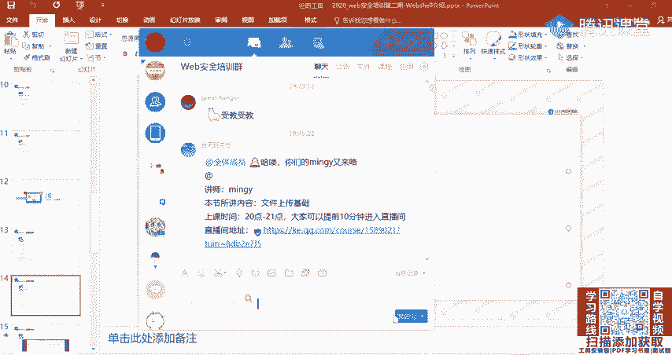

🤧嗯。

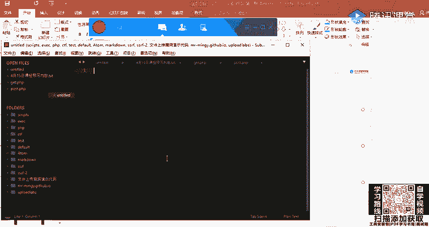

。然后第三个的话就是一个cookie的一个方式去进行一个传递。它的一个代码的话就是这样子的。🤧咳。うんうん。😊，然后这里我们就大概来看一下它的一个构成。

而这里的话它是以一个cookie的一个方式来去获取我们传递的一个数据。然后它传递的一个数据的话，就通过这个一参数，就我们需要通过像这个一参数传递我们的一个呃。字符串，然后的话给我们的1个PHP代码。

然后的话。主要的话是看这里，就说这一个S asset。这个函数的话，它同样的也是一个呃执行命令的一个PHP的一个函数。🤧Okay。🤧就呃这个Set它的一个意思是检查一个呃。

就检查我们的这样里的一个呃函数。他是否是呃为force？然后的话它如果是传递的是一个字符串的话，它就会被这样的一个函数当做一个PHP代码来去进行一个执行。

然后的话就是达到执行我们想要的一个代码的一个目的。啊，这里的话我们看一下就是。呃，这个cookie我们的一个代码怎么去进行一个呃连接？哦，前面的话呃它不像前面的以一个get方式。

以还有push的方式去进行一个连接啊，去进一个数据的一个传递。它是通过cookie。Oh。😮，哦。前面的话我忘记呃有说了。呃，后面再说吧，后面再讲web share管理工具的时候再给大家说吧。

就是我们的这样的一个一句话木马的话，是可以用一个web share的一个管理工具，也就是菜刀。啊，这里的话是1一刀去进行一个连接。然后这里呢一个cookie的一个方式的话，我们。啊。

去使用这样子的一个工具去进行一个。连接。然后这里要注意的话，就是我们需要在我们的一个请求头里面。去传递我们的一个呃代码。也就是去传递我们这样子的一个代码。因为因为这里的话，它的一个cookie函数。

它的一个意思的话就是从我们的一个呃请求头当中获取cookie，获取从cookie这一个请求头当中所传递来的一个数据。也就是我们这里的一个数据，然后获取之后的话就能够给我们的一个set函数去执行。

执行的话就是像这样子。我可以通过呃，当然也可以通过这个hack bar或者是说呃BP。去进行一个呃传递。然后它的一个效果的话就是这样子。

主要的一个呃点的话就是在这里我们需要添加一个我们的一个hoookki的一个请求字段。guookie的一个请求图。然后它的一个值的话是这样子的一个形式。

其实就是我们之前的一个ever的一个呃一句话木马的一个代码。🤧嗯。

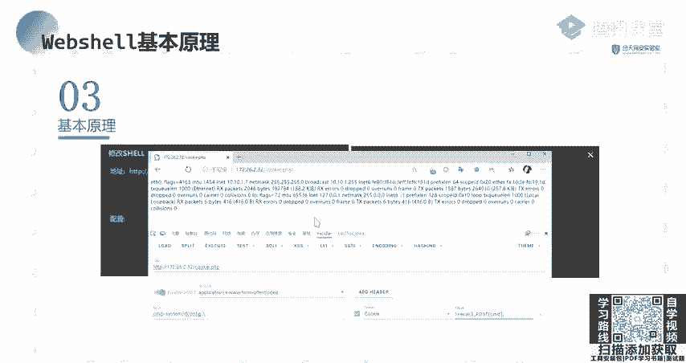

然后这里的话。

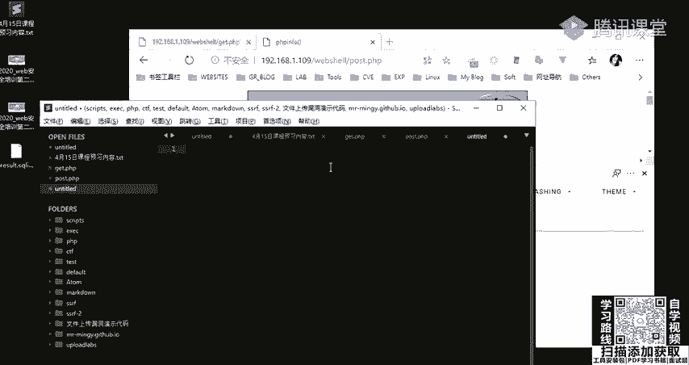

我同样的给大家做一个基本的一个演示吧。先放建一个。你对。😊。

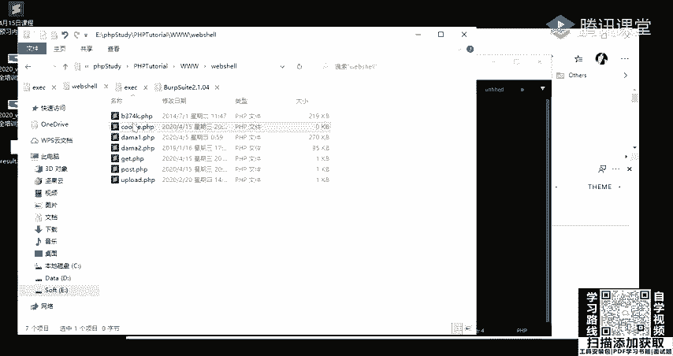

🤧嗯。😊。

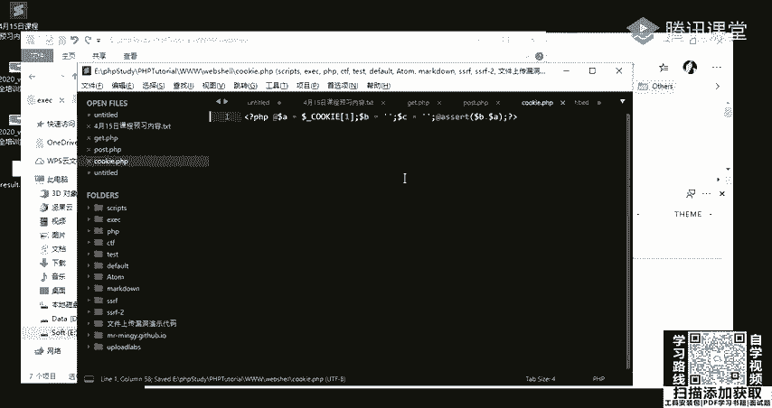

嗯我们保存。然后其实呃我这里的话是我直接在呃这里的话要说一下，就是我这里的话是我直接在我的这一个wordb服务器里面。的这个web share目录下面直接创建了这样子的一个文件。就模拟的就是说我们呃。

呃，把我们的一个web share已经放到了一个服务器上面去了。当然的话我们呃不可能说直接这样子去进行一个写入的。就是说我们需要通过一些得到一个web share的一个方式。

然后的话上传我们这样子的一个web share的一个文件。然后的话来去进行一个呃执行我们的一个命令。然后的话。在明天讲的一个文件上传。内容的话就是会就是介绍如何去通过文件上传的一个漏洞。

来去直接上传我们这样子的一个web share文件。然后的话通过这样的一个weve share文web share文件来得到服务器的一个权限。我这里同样呃去访问这样子的一个文件。OK。😊。

可去完之后话没有任何报错。就说明的话是没有问题的。然后的话我们需要呃。我这的话用这一个hack bar。🤧。我们需要传递。呃，怎么去向这个web需要传递我们的一个命令呢？

我们首先需要添加一个cookie头，cookie的一个请求头。可以的话。🤧嗯。😊，哦。它的一个值的话就是它的一个值的话是一等于。唉，这一个。🤧3二。嗯。H。

然后的话我们需要向我们的这一个就是这里的一个一句话木马，也就是我们的1个CMD参数传递我们想要执行的一个命令。比如说我们这里传递一个PH。好，我们来执行执行之后。

可以看到他成功的执行了我们想要执行的1个PH for命令。好的话以及。Okay。我这个。嗯。Yeah。我这你写错了。Yeah。好，这里执行不了。我这里的话是需要执行，就是。我们的1个PHP的一个代码。

Me。这以的话我用那个工具。这的话就是一个work share的一个管理工具。

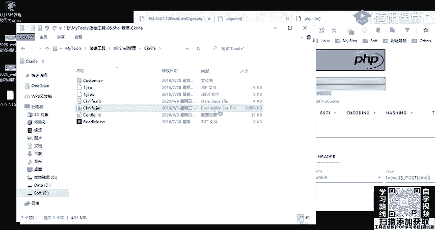

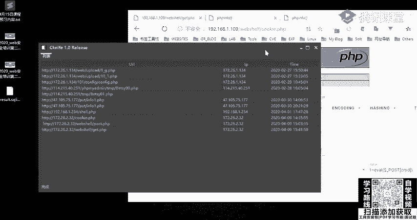

也就是一个。啊，C刀。然后这里的话我添加一个就是它的一个使用的话，其实比较很简单的。我这里的话直接右键添加。

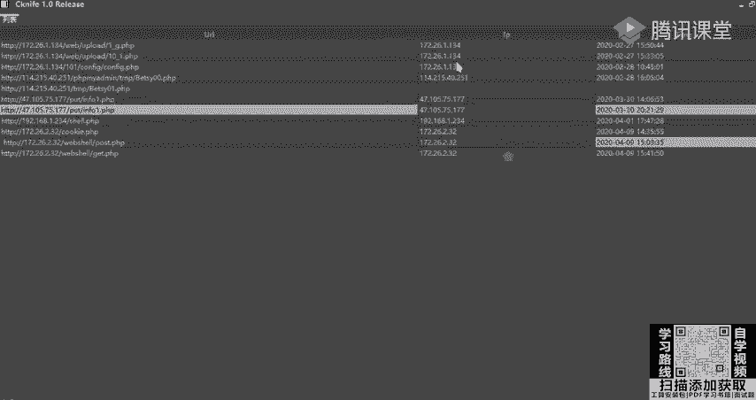

添加的话，这里就是输入我们的这样的一个呃一句话木码的一个链接，然后添加到这里地址。然后这里的话。我们需要传递的一个参数的话，就是1个CMD。对吧就是我们这里的一个s低参数然后添加添加之后的话。

因为它是需要添加一个cookie头的对我们这里需要设置一下。就请求头这里请求头这里的话，我需要设置为这样的一个cookie字段。然后后面的话接我们的一个呃传递的一个这样的一个PHP的一个。呃，代码。

然后呃这里的话要记住要开启这个请求头。哦，保存。

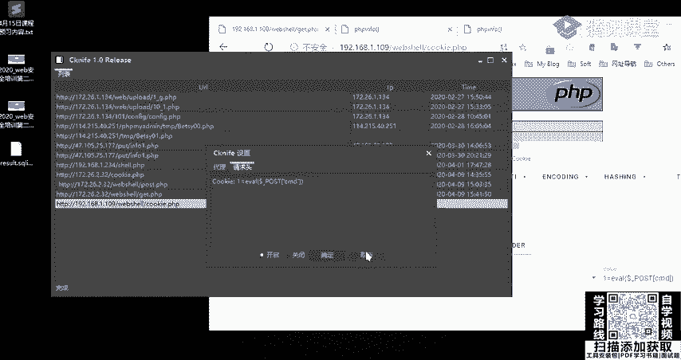

可以看到已经设置成功了。然后的话我们直接双击，双击之后的话就能够呃打开我们的这样子的一个就文件管理的一个。

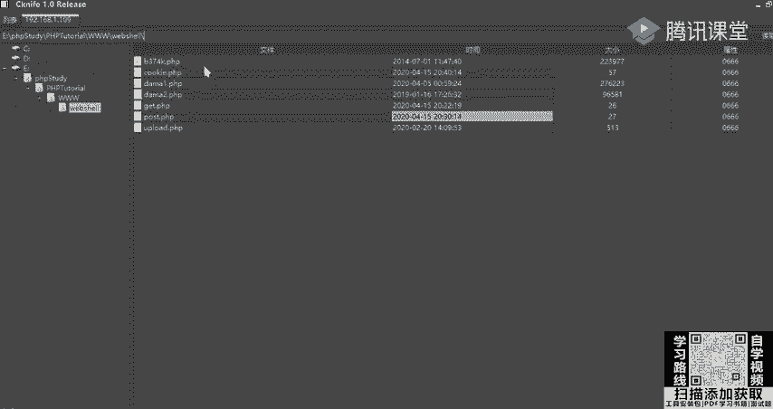

哦。功能。当的话它还有其他的一些功能，比如说一个模拟终端。模拟终端的话就是一个像我们的这样子的一个呃。

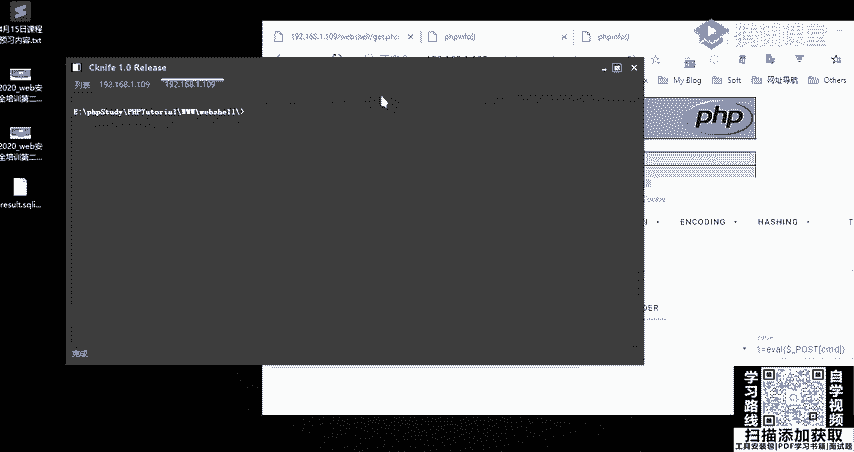

这样的一个终端就是一个命令行的一个终端。

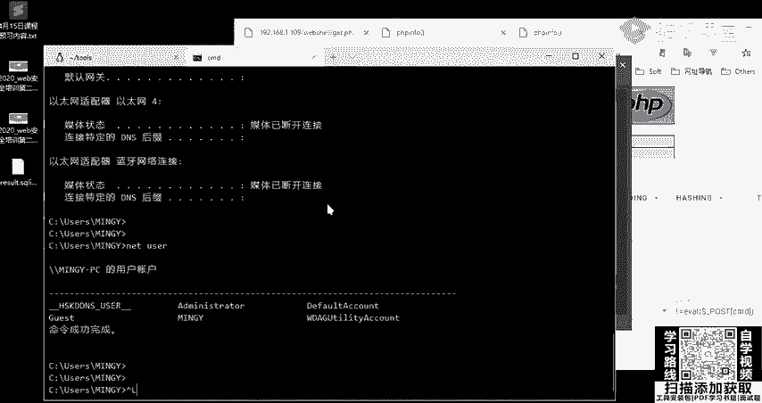

我们可以在这里执行我们的一个命令。已付空嗯。

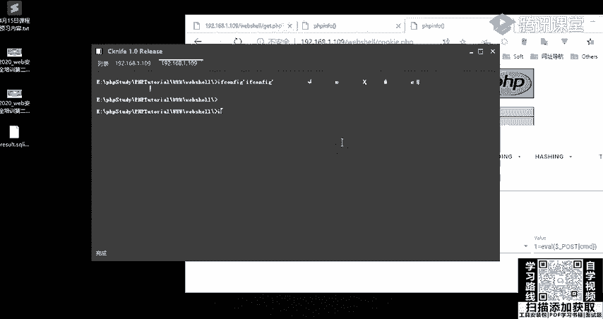

哦，我这我知道。

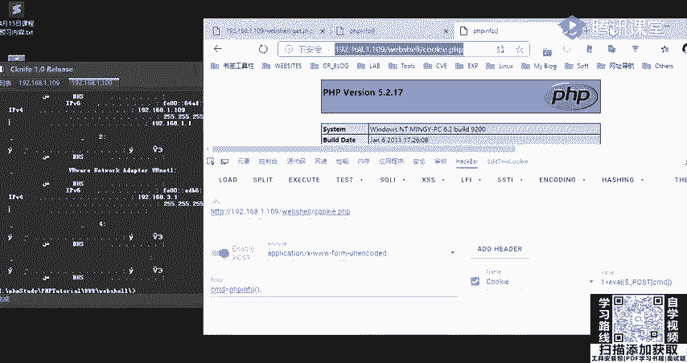

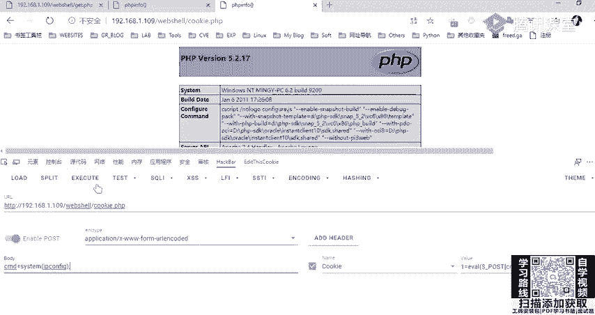

我说怎么。执行不了，我这边的话我搞错了，我这里写错了，不是不是if config，是IP config。因为呃。就呃大家也不要搞混了，就是说在windows里面的话。

它查看IP的话是1个IP config。然后在lininux里面呢，因为linux用的多了就。总是搞混。

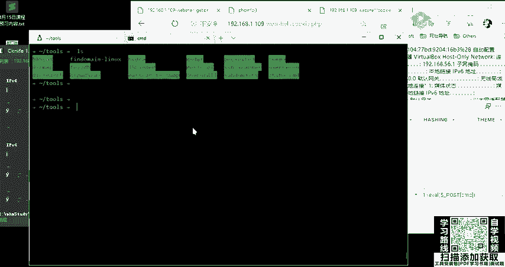

对。在link里面的话是一个一附控B来去查看它的1个IP信息。🤧嗯。😊，所以的话这里的话是呃因为在wind里面，他没有这个衣服confi格的一个命令，所以的话他执行不了。然后比如说DII。

然后的话我们可以在这里执行，就是说在windows的这样的一个doss命令下面能够执行的一些命令，都能够在这里去进行一个执行。

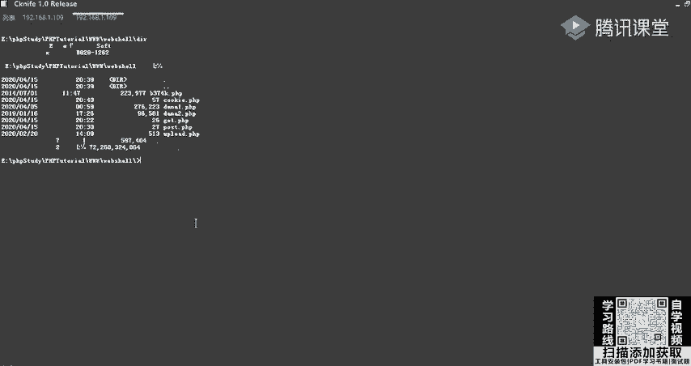

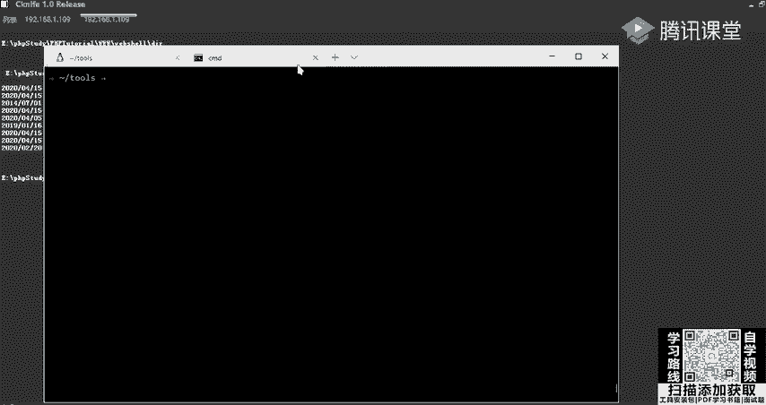

啊，比如说呃货外卖。麦你看到我当前的一个权限的话，就是我这里当前的这一个用户的一个权限。

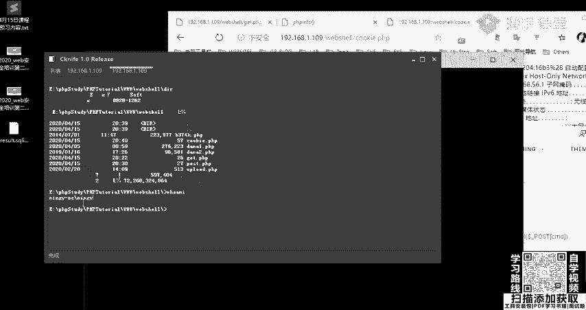

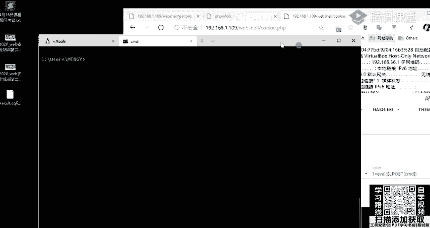

这就是一个通过cookie的一个呃方式。来去传递我们的一个呃命令。嗯。就其实前面讲到呃的这三种，其实就是说我们通过这样的三种方式来跟我们的一个web share去进行一个数据的一个传递。首先就是。

get post就是我们常见的两种方式，对吧？就我们通过get方式来去向服务器传递我们的这样的一个命令。然后的话给这一个weshop去进行一个执行。执行之后的话，它会响返回给我们一个响应。

也就是我们执行的一个结果，它会返回给我们。然后这里第三个这个cookie的话就是。通过一个cookie的一个请求头，我们通过我们的一个cookie请求头里面。去携带我们的一个呃数据。

然后的话传递给我们这样子的一个we share来让它执行。这其实就是啊web share的它的一个能够去执行命令的一个基本的一个原理。这是cookie的一些执行命令。🤧嗯。

然后第四个的话就是呃我们通过一句话去写我们的一个小码。就前面我们就是有给大家介绍，就是说we share它的一个攻击的一个基本流程。就是说我们通过获得一个微 share，对吧？然后我们。

我们的话需要去传上传我们的一个小码，对吧？我们已经有了一个基本的一个呃我不需。然后的话我们可以通过一句话木马来去。啊，向服务器写入我们的一个小码，然后的话通过这一个小码来去上传我们的一个大码。🤧嗯。

然后这里的话如何通过一句话木马去写一个小码，它的一个基本的一个命令的话就是。就是这样子的一个代码。

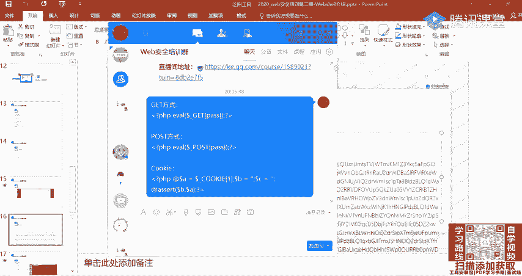

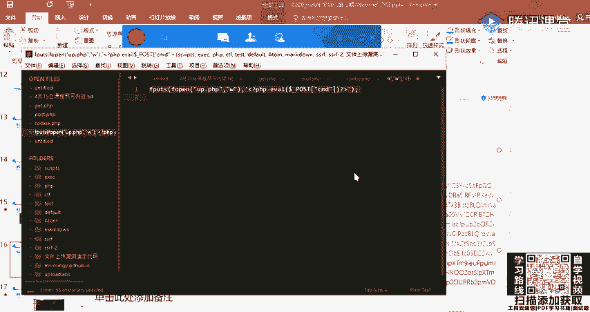

Yeah。就这样子的一个代码。这个代码的一个意思的话，其实就是这一个Fput这一个函数。就是说我们通过这样子的一个代码的话，我们只需要直接访，就是直接去访问这样子的一个片区的一个呃文件。

我们访问之后的话，它就会去执行。执行它的一个效果是什么呢？就是说它通过这个F open函数。它会向它会在当前目录下面写入这样子的一个。以up点PP为文件名，然后它的一个内容是我们的一个一句话木马。

的一个内容。当然的话这里的话我是以是以这样子的一个例子，我们这里的一个一句话木马内容的话是可以替换为我们的一个小码内容。哦，哦。可以。要做一个演示。就我同样的就是说在我先创建这样子的一个。

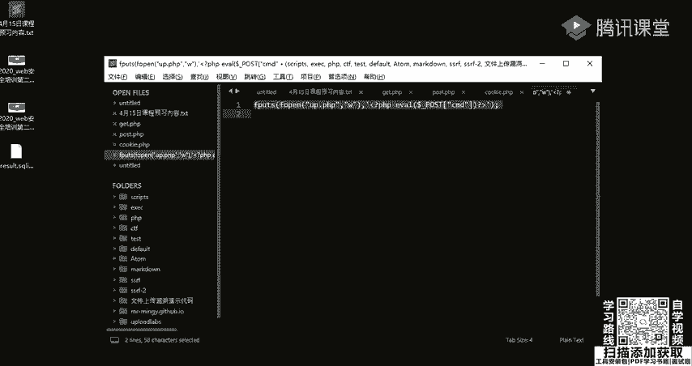

我不需。🤧嗯，我说函口副s。Of course。

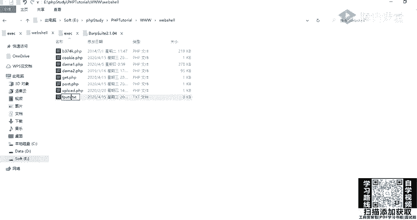

影片视P。然，我们保存。

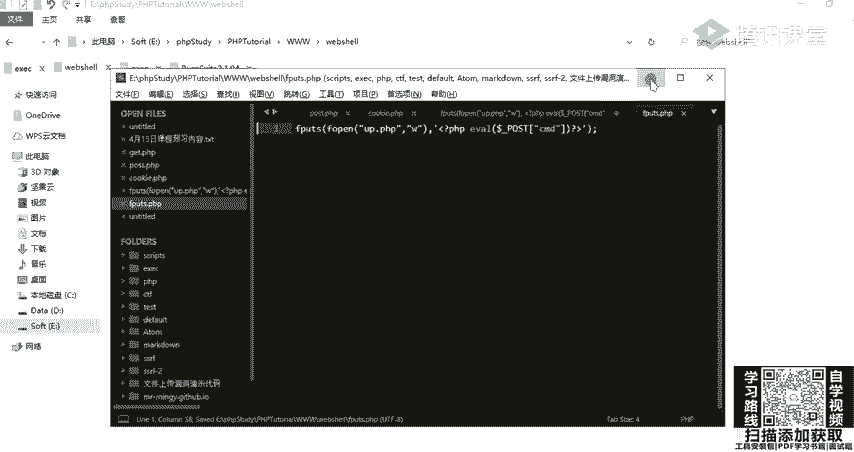

保存之后的话。我们可以看到当前的话，它是没有这样子的一个呃up，没有这样子的一个up点PHP文件的对吧？刷新一下。啊，我这里的话。我通过去访问这样子的一个这个F put影片区的这一个。这批文件。嗯。

Of course。🤧哼。😊，大家大家别眨眼，注意看，就注意看这里。然后我这里回车。诶。哦，这里的话写错了，我这里的话是呃忘记了加那个PHP的一个。

就是它的一个格式，就大家一定要注意，就是它的一个格式的话是这样子然后就是以这样子的一个开头，就只有这样子的，一要满足它的1个PH区文件的一个格式。

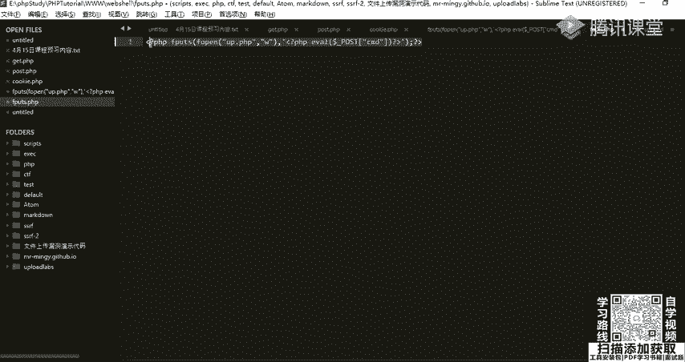

这样子的1个PHP代码，它才会就是说给我们的1个PHP的一个解释器去解析执行我们的一个代码内容。我们保存一下。

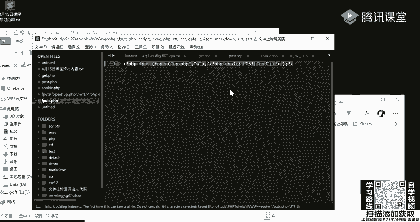

然后我们。🤧嗯，访问。访问之后。然后可以看到可以看到在这里一闪一闪而过的话，会生成这样子的1个up点PHP文件。

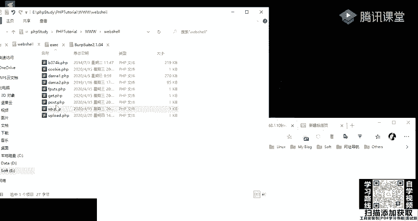

对吧。我们打开看一下，打开看一下的话，里面的一个内容的话，就是我们的一个呃PHP的一个一句话目嘛。

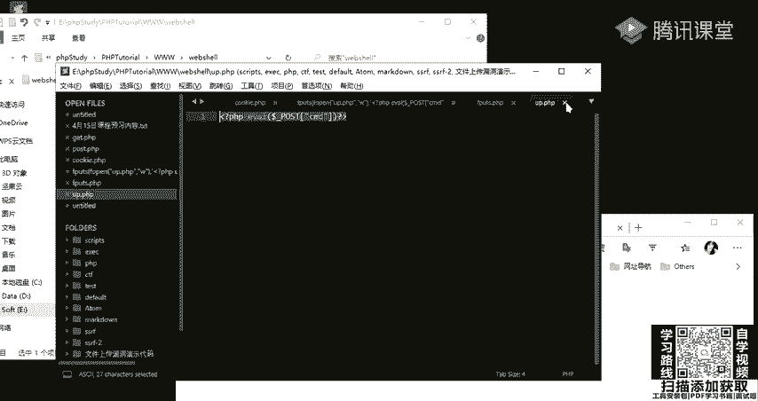

当然的话我这里的话把这一个。我们要做的话就是通过一句话木马去上传我们的一个小码。我们这里需要把我们的一个就是里面的一个内容把它做一个更改，就是替换成我们这里的这样的一个小码。

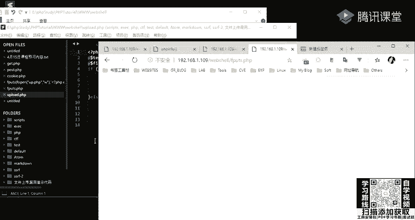

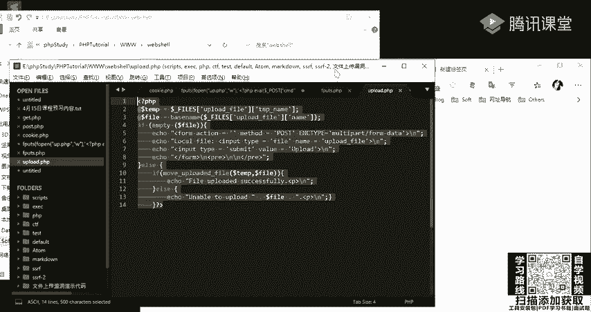

我们看一下这个小码它的一个内容，就它是怎样子的。到的检测区。🤧嗯。😊，就是这样子的1个PHP文件，它它它的一个功能其实就是呃选择一个文件，对吧？比说我这里随便选择一个文件，然后上传。上传之后的话。

可以看到它会在当前目录。它会生成这样他会上传成上传这样子的一个文件。它的一个功能就是这样子。我们要通过这个小码。来去上传一个大码。

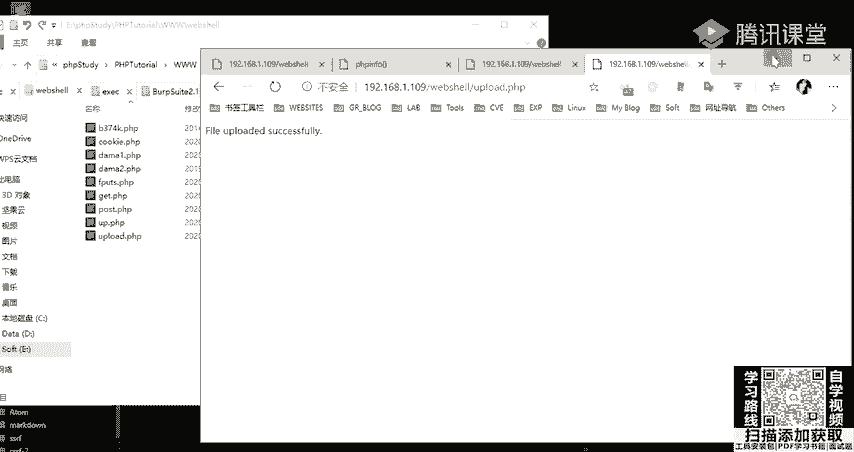

然后现在我需要做的就是我们需要需要把这一个内容，就是把它呃通过这样的一个F put这样的一个就是写入HP文件的一个函数。来把我们的这里的一个内容把它写到1个PP文件里面。🤧う。😊。

我们看一下PPT这里的话它的一个内容的话是比较多的。就是这一部分。🤧嗯。🤧咳。🤧嗯。🤧咳。Okay。然后我这里的话，大家可以看看一下我群在群里发的这个文件内容。

就我这里的话是把我们的这这里的就是这一个文件里面的一个内容。做了一个base64的一个编码。🤧就是说我们在这里的话，因为PHP里面的话，它去上传这样子的一个呃文件的话。

它里面是不允许包含一些呃特殊的一些字符的。

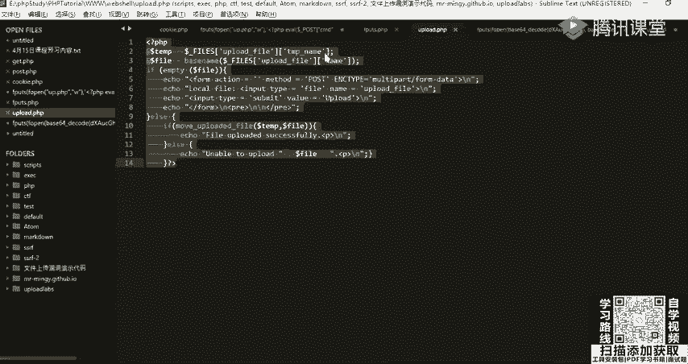

就说这些字符的话，它去上传的话，它是会呃就呃写入不成功的。所以的话我们这里需要。🤧需要对他做一个编码。Oh。😮，编码的话就是。做了一个base64的一个编码。啊，我这里呃不用工具了吧，我直接在。🤧H。

🤧咳。直接用呃有。网页的一些64别码的一个工具。🤧。


嗯。还佢哋啊。🤧当时。


🤧嗯。


🤧我这里的话就对了做了一个b64的一个编码。然后编码之后的话有没看到的话，它里面有一个等号。然后因为等号的话，它算是一个特殊字符，就是说用呃在pos的请求里面，它它是不允许包含有这样子的一个特殊字符的。

所以的话我们还需要对它做一个编码，就是做一个二次编码。就需要把这个等号把它给去掉。嗯。有点卡哦。然后编码之后哎。可以有问题啊。我用这一个编码工具吧。


Okay。Yeah。把它做一个base64的一个编码。哦。这里然后编码之后的话，它这里的话是有一个加号，我们需要把这一个这种特殊的一个字符把它给去除。然的话我们再做再对它这一个编码。

编码之后的话可以看到就是呃已经没有它都是这样的一些字母，对吧？大小写字母，还有数字组成。🤧然后这里的话就是我们。嗯。Okay。🤧啊嗯。我在咳嗽。うんうん。😊。


然后这里的话编码之的话就是我们的这里的一个内容，对吧？然后我们怎么去进行一个利用，就是说怎么去把我们的这里一个数据呃写入到这样子的一个文件呢？就我们因为我们前面的话是经过了两次的一个b64的一个编码。

所以的话我们需要把它做一个解码。因为你编码之后的话，我我们想要让它还原成原来的一个样子，对吧？就还原成原来的1个PHP代码，所以的话我们需要用这1个b64de。

这样的一个函数就是PHP里面的一个函数把我们的这样里的一串字符做一个解码。然后做了一次解码之后的话，我们还需要做第二次。因为我们经过了两次的一个编码，所以需要两次解码。然后的话再做一次解码。

解码之后的话，然后再写入我们这样子的一个文件。然后这里要注意的话，这里是同样的做了一个b64的一个编码。Okay。我们可以把它做一个解码。解码之后的话，它的一个内容的话就是这样子那个up点HP。


🤧咳。就是他那个他就是把我们的一个这样子的一个小码的一个内容，把它写入到这样的一个ar点PP的一个文件。啊，他的一个内容就是这样子。这里可能呃。


我这里的话给大家做一个演示。


た。🤧Com。同的新创建这样子的一个呃HP文件。Okay。嗯。Okay。这叫贝644点PHP吧。然后我们写入我们的一个内容，要注意的话就是呃一定要呃符合他的1个PHP的一个呃代码规范。

然后的话把我们的1个PHP代码写写到这里，我这里的话直接贴进去。


🤧进去的话就是这样子的一个文件。🤧Com。


啊，我们保存保存之后的话。呃，它会呃它会生成1个up点PHP我这里的话先把这一个。呃，这个up点PP先给它删除掉。删除之后的话，我这里。再去进行一个访问。🤧反问这一个。从这一个base64。

点PHP文件。然后大家注意看这边会生成一个up点PHP的一个文件。可以看到对吧？然后我们直接来访问这样子的一个up点PP文件。可以看到就是一个小码。就是一个包含上传文件功能的一个小码。

这里的话就是这一部分内容，就我们通过这样子的一个一句话木马来写入我们的一个小码。当然的话这里的话要注意的话就是需要做一个b64的一个编码。就大家可以自己在课后去进行一个尝试。就是说你可以尝试。

就是说呃做一个一一次编码，就是只做一次b64编码，然后去进行一个呃写落的话。啊，我们上传，我们通过一个一句话木码写入写入了我们的一个小码之后，我们要干嘛？

对吧我们就利用这样子的一个小码的一个功能来上传我们的一个大码。上传成功之后的话，我们访问这一个大码，它的一个样子就是这样子。然后它里面的话。有十分丰富的一个功能。

我这里的话哦，以这个为例子。🤧呃，因为这里的话哦我这里已经。🤧已经有。Good。🤧我先把这一个。把它给拷贝过来。就是这里的话已经没有大码点1点PHP了，对吧？然后我这里选择。呃，把这个文件上传上去。嗯。

哦。点接三发。可以看到这里的话就已经上传成功了，对吧？上传成功之后的话，我直接去进行一个访问。访完之后的话就是这样这样子的一个界面。


Com。

系。系呀。然后这里的话是一个登录的界面，就是说你需要呃输入一个密码能够去进行一个登录。然后这里的话它的一个密码的话就是一个hiking。


这里大家可以自己做一个更改啊，就是改成自己想要的一个密码。然后像这种密码的话，其实呃。就这种。很简很简单的一个木码啊，一个密码的话是。可以被爆破的。

就是说呃大家就是说如果你碰到有别人上传了这样子的一个大码文件，对吧？就你可能你某天你啊你去扫你去扫那个网站，对吧？你扫出来这样子的一个文件。然后这一个文件的话，就是像这样子的，像这个样子的一个文件。

然后一个输入框，要让你输入密码，对吧？这个时候你可你可你可以去进行一个爆破。


就说你的这个，因为它只有这样子的一个登录嘛，对吧？你可以通过BP。去进行一个爆破，把它的一个密码爆破出来。然后的话你就能够得到服务器的一个权限。就说呃黑吃黑嘛，对吧？就这个网站已经被别人黑了。

然后已经有了这样的一个木马，一个后门木马，你直接通过他的一个木马就能够得到他的一个权限，就不用去什么，还要辛辛苦苦去找找漏洞，对吧？嗯。😊，然后这里的话就是这样子的一个大码的一个文件。

然后可以看到有很多的一个功能，这里的话是在当前的一个目录，对吧？我这样的话可以切可切换到上一级目录。对吧商业节目的话就是。啊，我的这里。这里的一个目录。嗯。然后还有像呃。像什么呃文件。

因为我这里的话是一个windows的一个系统，对吧？所以的话它这里是本地磁盘，是CDE盘，对吧？可以看到有C盘，我C盘的一个文件，还有D盘。呃，E盘的一些文件都能够查看。

就是说已经我们可以通过这这样子的一个大码来去操作我这里的一个计算器。


计算机也就是我这里的一个就是目标的一个服务器里面的一个文件了。然后这里的话其实呃还可以去进行一个上传文件。可以我们可以通过这样的一个。

大码来上传我们想要的一些，比如说上传我们的一个工具，把我们的一个呃。


呃，一些文件，一些工具。比如说我这里上。上传一个这样子的一个yXE文件，对吧？


然后上传到哪一个目录，你可以选择，然后选择这样的一个文件，然后上传。对吧就可以看到，就是我这里的话就已经上传成功了。


大码的话它呃它的一个功能的话是很多的。对吧。能够去上传文件，也就是呃Hin的一些信息啊，系统的一些信息啊。


都能够查看到。还有可以执行片区的一个脚本。就这里的话我们就能够通过这个。


大码通过这一个web share来执行我们的一个脚本。哎，这样可以看到。还有可以咨询。其他的一些，比如说。执行可以看到对吧？就相当于就是我们前面的一个一句话木马的一个功能。它这的话已经有了。

还有的话就是呃像执行cicleciclecircle语句。那样的话执行circle语句的话，你首先需要知道你的你首先需要知道目标服务器它的一个。


数据库的一个密码。我这样的话就以。我当前的这1个PHP study的一个环境啊，密码的话就是默认的root。哦，执行。执行之后的话，可以看到就执行成功了。还一个版本对吧？还有可以。So。😊。

The place。觉得是 base。可以看到这里的话显示了这样子的一个呃。呃，系统的一个数据库，对吧？Okay。呃，还有其他的一些，像比如说端口扫描啊，就扫扫描你当前服务器的1个IP有哪一些端口。


当然的话还有就是就是说你的这个服务器，就一般的一个服务器，对吧？如果说你是你拿到的这个服务器，它是在一个呃可以访问内网。也就是说比如说你是拿到了一个呃企业，拿到了一个企业的一个这样子的一个呃嗯。


就是说在外网的一个服务器，然后这一个服务器的话，它是可以去访问公司的一个内网的。这个时候的话我们可以就是说通过这样子的一个服务器，把它作为一个跳板机去。去就是获取一个你在公司内网的一些信息。

对吧就是可以扫扫内网的一些端口啊，还有它的一些存活主机。然后的话以这样子的一个机器进行一个内网的一个渗透。当然这里的话就是呃提一下。这里的话就是1个PHP大码。我们呃刚刚可以看到。

就它的一个功能的话是相当丰富的。


就说呃可以有很多的一些功能。


🤧K。然后的话下面的话我们。继续我们的个课程内容。下面我们就给大家介绍一些就web share的一些管理工具。哦，有。Okay。😊，哦，忘呃刚刚又忘记啊。讲着讲着就忘了跟大家就是做一个互动了。

就大家应该都听懂听得懂吧。就我的这一些操作就说呃。课后的话会有。嗯，客户的话会有一些就是。一个课后作业啊，就大家就是把我在课上的一些操作做一下。就操作一下。对，实操实操的话就是大家在课后的话呃操作一下。

然后有问题的话直接问我好吧。就务必就务必要大家要能够就是自己去动手去操作一下。然后的话务必要去弄懂。这样子的一些操作。好吧。就力求大家要能够听得懂，然后要能够操作。

然后这里的话web share的一个一些管理工具的话，我这里列了有5个。就是一些常常见的。首先第一个的话就是就提到外部需要管理工具的话，就不得不提的一个一个。呃，web需的管理工具就是菜刀，中国菜刀。

他那一个全名的话就叫中国菜刀，因为它的官网是这个。当然的话这个工具的话是已经呃就就是说在现在的话是已经呃比较过时了，就比较老的一个工具了。就可能功能功能方面的话就是不是很好用了。

而且可能就是说你的你就是说这而且他的一个呃网上下载的一些菜中国菜刀的话，可能有一些木马后门什么的什么的。就大家就是。呃，给大家介绍一下啊，用的话呃随你自己吧。🤧嗯。😊，然后第二个的话就是1个C刀。

就是我刚刚用到的这样子的一个工具，就说这个。


呃，See life。这个的话它的一个界面的话就是像这样子的。他那个呃。网站就大家在geth上面去直接搜这一个s life就行。🤧Com。🤧嗯。就是刚刚的话也也给大家有演示。呃，还有的话就是。

我用这一个。就是刚刚那个get点PHP对吧？还有pos的点PHP这样的一些一句话木马都是可以通过这样的一些web shell的一个管理工具去进行一个连接的。


就比如说这个呃，比如说这个get。


我直接直接在这里添加。然后的话输入我们的一个链接，就我们的这个呃PHP脚本的一个路径，一个链接，1个URL。然后的话这里这里的话是输入我们的一个密码。这个密码的话，其实就是其实就是呃。这里。

其实就是这里我的这里的一个代码里面，就是说密码的话就是这一个。这里的这一串，当然我这里的话是写的是一个pass嗯。


嗯。嗯我这的话是写的是一个passer，你也可以改成其他的。像比如说呃。

没。比如说什么。我天对吧。呃有，你可以改的更复杂一点。就说因为如果说你这里的话比较简单的话，别人也是可以去能够去爆破，爆破出来你这样的一个密码。然后的话能够得到你的这样的一个需ll的。


。然后这里密码的话，我这里呃。我这里的话就写的是一个pass，对吧？然后我添加添加之后的话。


去进行一个访问。现在不要改了。


So you个 get。Yeah。


刚刚我改了一下，所以的话他这里的话连接。失败，我这句话在。哦，即跟一车。我用这个posse吧。嗯。然后可以看到这里的话就是能够执行，能够去进行一个正常的一个连接。然后的话还有它还有其他的一些功能。

比模拟中呢，还有数据库管理啊，就是说能够去连接我这里的一个数据库。对吧连接我这里的一个数据库，然后的话去进行一些数据库的一个查询。う。😊，当然的话像这样子的，主要的话就是一个文件管理嘛，对吧？

就是我们可以新建我们的一个文件，还有上传我们的文件，还有下载，对吧？我们可以下载，还可以修改啊，哎还可以双击打开。就打开查看里面的一个内容等等。然后的话还有就是这样的一个虚拟终端，对吧？

这样的一个虚拟终端的话，我们可以能够在这里执行我们的的一些命令。


🤧嗯。😊，这就是一个C刀，就是说这一个C刀的话，我个人觉得是比较好用，而且它是一个java开发的。


🤧咳。就界面什么的都比较紧急。🤧嗯。😊，啊，第三个的话就是这一个ve really really这一个这个的话它是一个就是说在那个count里里面自带有的，大家可以直接输入这个前面的这一串rely。

🤧う。😊，能够直接就是能够打开，然后。🤧输入杠H的话，能够查看它的一个使用帮助。这样的话我就不多讲。就可以通过这个vi来去进行呃就是生成木马，然后的话去进行一个连接。

但的话它是一个以一个命令行的一个形式。


去进行一个操作的。就说像我等就等一下我们在另时里间去操作操作一下。🤧Okay。另的话是他的一个他是一个开源的一个项目啊。


就大家可以看一下，然后它这里的话功能的话是有很多的，就呃我这里的话不细讲了，就大家如果呃想用的话，就是有有要用到的时候再去了解就行了。就一般的话大家也是在windows上面去进行一个操作嘛，对吧？

就呃像windows里面的一个C刀就可以了。还有的话就是下面这两款就是中国引进，还有冰烯。就这这两款的话也是用的比较多的一些web需要管理工具。其实它它的一个呃就是它它的一些功能什么的都是比较多的。

🤧就大家去尝试一下。然后这里要说的话，还要说的话就是一个冰烯。这个冰烯的话就是这个工具的话是一个神器，就是它它的一个它的一个木马的话啊，不它它它生成的那一个。HP web share的一个代码。

他是就是说。呃，我们通过这样子的一个冰鲜的一个客户端去呃，与我与我们上传到web服务器上面的一个呃web share去进行一个连接，去去进行一个数据的一个传递的时候，就是说传递我们的一些命令，对吧？

我们的一些操作命令的时候，它的一些数据流，它是经过加密的。就说啊因为我们现在常见的一些就几乎大部分的一些网站都有那种waf，就是说呃有。还有就是呃它会检测你的你在网站里面，你上传的这些文件。

它是否是呃有那一些呃就是是不是1个PHP的1个木马后门。如果是的话，它就会做些做一个隔离删除。还有的话有一些通过一些。就一些呃防火墙，它会通过你的这样的一些数据的一些流量。因为你虽然你是通过一个web。

它可以通过在web日志里面的一些请求，也能够去查看到你的这样的一些操作。你执行的一些命令，也是能够去查看到的。嗯，当然的话这个冰线的话，它是对这样的一些数据的一些传递。它是做了一个加密的。

就是它不是一个就是说不是不能够直接的去查看到你的这样的一些日志里面一些数据传递的一些命令什么的。就说它是能够呃有很很好的一个绕过防火墙的一个效果。🤧嗯。😊，哦，这里的话我这里的话就不细讲了。

它的一个使用的话呃，网上有很多的一个文章，还有它是一个开源的，就它的大家去gehub上面去查看这样的一些文件。就去查看这些项目的话，它都有这样子的一个redmin嘛，对吧？

它的一个使用方法什么的都已经很详细了，还有安装方法，如果看不懂的话，呃，翻译一下嘛，对吧？🤧。就都都都成都中文的话都能够看得懂嘛。🤧。然，我这的话就呃。我用我自己的本地的一个给大家看一下它的一个些。

见面吧。首先的话，第一个是已键。其实呃其实就用一个菜刀也是足够了的。


它的一些功能的话大体都是差不多的。


他的一个界面的话是像这样子的。就我们可以在这里，它有这样子的，有很多的一些功能，还有就是还有一些呃插件一些脚本什么的。用的话还是挺好用的吧，我们这里加的话，就是通过这里添加一些数据嘛。添加数据的话哦。

比如说这一个。呃添加进去密码，连接密码的话就是呃pass。然后下面的一些就有一些编码器啊什么的，他就会对这样的一些数据做一些编码。怎么的，这里话默认就行了。如果你有特殊的一些要求什么的。

然后的话请求信息你可以在这里添加一些添加一个head。对吧添加he就比如说我前面要用一个cookie，对吧？我可以在这里加一个cookie请求头，然后这的话就是。🤧写我们的。🤧Sure。

想要传递想要通过这样的一个cookie请求头传递给服务器的一个呃字符串。这样的话我就这样的话我这里不需要。那你添加。添加之后的话就是。🤧这一个。然。

双击双击之后的话可以看到就是这样子的一个界面其实差不多。然后的话它它的一些就是磁现功能可能有一些不一样。还有像这里的一些功能。🤧。大家去玩一下就知道了。因为这一些工具的话，其实也没有什么多讲的。

主要的话还是就是说前面。🤧讲的一些就是呃他的一个一句话木马，还有我们的一个小码以及大码，它的一些工作的一个基本的一个原理。其实我们主要用的还是一个一句话木马嘛，对吧？因为我们的这样的一些工具。

都都能够通过这样的一个一句话木马的一个啊不都能够去连接我们的一个一句话木马。🤧哼。😊，然后的话我们本节课的一个内容的话，大概就是这样子的这样子。然后还有的话就是一个课后作业。做作业的话就是这一期。

🤧Okay。

🤧。


这样的一些内容。就大家呃。呃，就包括了就是我这节这节课所讲的一些内容。然后大家呃通过这样子的一些操作的话，来去熟悉我们怎么去利用这样子的一个呃一句话木嘛。来获得我们的一个服务器的一个权限。然。

大家应该没有什么问题吧。PPT发群里呃，可以的。🤧嗯。然后这节课的话内容的话还是比较简单的，就主要的话就是呃就是一些PHP的一个代码。大家如果不是很清楚的话，其实就是一些函数，一些PHP的一个函数。

就大家呃。我。在有一些PHP手册里面去看一下。大概知道他的一个意思就行了。🤧嗯。哦，大家对本节课内容有没有什么疑问呢？呃，中间的话讲着讲着就投入了，然后又忘就忘记跟大家就是做一个基本的一个互动。

大家都没有什么疑问，没有什么疑问吧。冰溪。🤧冰蝎的话呃，get hub上面。Okay。我这里直接把下载链接，我到时把PD发群里吧。Can。🤧Okay。🤧Okay。冰靴的话就是这一个哦，对。

冰靴的话其实它的一个功能也是比较比较简单。主要的话是它的一个就是能够去绕过一绕过防火墙的一个功能。🤧K。He。就是他也他也是一个java开发的。然后就是像这样子的一个我们需要就是上传他这里的话有。呃。

已经有提供了这样的一些呃脚本文件。当然的话如果你呃能够去进行自己去做一个冰写。


就可以自己通过它的这样的一个呃代码来自己做一个编写。其实它里面的话就是做一些加密的一些措施，它的一些呃构思。


来去进行绕过防火墙的。🤧Yeah。界面的话就是像这样子，就如果你连接的话，它就会有显示PH，还有执行命令啊等等的一些。🤧功能。🤧嗯。然后大家应该没有什么问题了，没有什么问题的话。

那我们本节课的一个内容的话就到这里结束了。待会的话我会把就是呃我这节课有用到的一些工具的话，我会发群里。然有PPT的话也发群里。然嗯。啊，啊因为我有喉咙有点不舒服，然后有稍微有点咳嗽，就可能中间的话呃。

有点有些有些有些话没有讲的很连贯，就是没讲清楚。希望大家尽量吧，好吧。好，大家大家也辛苦了。哦呃，今天课程的话就到这里结束了。啊，谢谢大家，我们明天再见。首先我们先来看一下呃文件上传的一个基础部分。

首先我们一起来了解一下什么是文件上传。文件上传的话，它就是呃我们客户端将数据以文件的一个形式进行一个封装。然后的话再通过我们的一个网络协议，把它给发送到服务端。呃，这里说的一个网络协议的话。

就是我们前面讲到的1个HDP协议。🤧嗯。嗯。然后的话呃我们上传的这一个文件的话，在服务器端它会做呃一个数据的一个解析。解析之后的话，它会存储在我们的一个服务端的一个硬盘上面，然后存储为一个文件。

就如图所示，就我们一个呃个人的一个主机，我们通过呃HDP的一个方式，通过po的一个请求，把我们的一个文件的一个内容，把它给呃发送到我们的一个web服务器。然后的话在web服务器上面做一个呃保存。

然后通常的话呃文件是以呃这样的1个HTP协议去进行一个上传的。然后的话是以pos的请求去进行一个发送。呃，就前面也有讲到呃，就前面在讲那个HTP协议的时候，有给大家做一个例子。

就是呃posts请求的一些啊三种的一个方式。🤧对吧。🤧然后的话。看。wordb服务器在接收到我们的一个主机的一个请求之后啊，建立一个连接连接网呃，连接之后的话就会进行一个数据的一个传输。

这就是一个文件上传。那，我们一起来了解一下文件上传产生漏洞的一些原因。首先第一个的话就是服务器的一个配置不当，就服务器它在配置的时候没有对我们上传的一个文件做一些啊警测。

第二个的话就是文件上传性质被捞go。就说呃服务端对我们的一个文件的意些文件上传有做一些限制。但是它的一个性质的话，它是不完整的，或者说它它的一个性质是不是啊有效的一个性质。

然后的话我们可以通过一些方法去进行一个绕过。咁。第三个的话就是呃一些开源编辑器的一些上传漏洞。第四的话就是文件解析漏洞。就是呃我们后面会有说到的一些web webb服务器。

比如说阿帕奇IS啊、N等等的这些服务器，它都有存在过一些解析漏洞，能够导致我们呃进进行一些呃文件的一个上传。具体一点呢说的话就是说上传我们的一个web share木马。然后的话进行一个文件执行。

地锅的话就是它的一个过滤不赢，会被绕过，就是呃跟前面是呃类似的。Yeah。哦，文件上传这个漏洞，它有什么危害呢？就。😊，就在我们进行一个文件上传的时候，如果服务器端它的一个脚本语言。

它没有对我们上传的一个文件进行一个严格的验证和过滤，就容易导成容易造成这样的一个上传任意文件的一个情况。然后攻击者。就能够去利用这样子的一个文件上传的一个漏洞。像我们的一个服务器啊。

上传我们的一个恶意文件。恶意文件的话就是web share。H。然后通过呃通过一个这样的一个web share之后的话，我们就可以在服务器上面执行我们的一个恶意代码。

然后的话呃就是呃在上节课有讲到的web share它的一些特点，对吧？我们能够通过web share啊做到哪一些操作。K。就能够控制整个网站，或者是说整个服务器。哦，嗯。

文件上传漏洞它可能存在的一些位置。我们从它的一个字面意识就能够知道，就是说我们在进行文件的上传的时候，这样的一些功能点就是会存在这样的一个漏洞。比如说第一个的话，图片上传对吧？我们经常会有。

比如说一些网站呃，他你去发一些帖子，对吧？发帖子的话，你去上传一些图片，或者说呃你注册一个账号之后，你要修改一修改一些你的头像，修改头像的话，就需要呃上传你自己的一个图片。

就是这种图片上传的一个功能点的话，是很有可能存在这样的一个漏洞。还有头像的一个上传功能啊，还有就是呃文档的一个上传。就是比如说我们要上传一个word，或者说呃图片文啊。呃，像excel等等的一些文件。

的一个上传功能。这一这一类的一些功能的话，往往都会存在这样的一个上传文件。它印证是不够严格的，然后的话会导致这样的一个安全缺陷缺陷。嗯。😊，然后哦这里的话就是文件上传的一个检测方式。

是我们本节课啊主要去啊。讲的一些内容就说我们通过呃了解。呃，文件上传过程当中它所涉及到的一些检测方式。然后的话我们针对这样的一些检测方式去进行一个绕过。

然后呃从中学习到我们如何去呃绕过这样的一个文件上传。🤧K。首先我们先来看一下呃一般的文件上传过程，它的一些检测方式有哪一些？首先第一个客户端的1个GS检测。一般的话它会检测文件的一个扩展名。

就是GS检测的话，它的它是一般是在我们的一个前端。就是说我们的一个前端的一个呃脚本，就说它没有在我们的一个服务端上面去做一个检测，而是通过在前端的1个GS脚本来对我们上传的文件做一个检测过滤。

第二种的话就是服务端的一个memo类型。这个memo类型的话，前面也有讲到，就是我们前面说到的一个container type。这个呃字段通过检测这样的一个字段内容来判断我们上传的文件。

它是什么样的一个文件类型。这里的一个麦麦mo的话，我们呃。就之前也要说到。对。我们可以看一下这个麦mo的它的有哪一些。🤧哼类型。这里的话呃可以看到我们主要呃举一些场景的，比如说这个。呃。

PDFPDF它的一个文件的一个me类型，也就是我们的一个content type的一个字段的话就是这样子的一个application加一个斜杠。后面的话接一个PDF这样的一个类型。

还的话像我们上传的一些比如说EX1，它是一个这样子的一个oc stream。还有呃。我们。😊，常见的一些图像。一些图我们上传的一些图片，它的一个类型，我们其实可以看得到。

就是关于图片类型的这样的一个cont type字段的话，它都是以一个image开头，然后后面接斜杠，然后的话就是呃我们上传的一个文件啊，类型它是什么样的。然后的话它就会在后面接一个文件类型，对吧？

然后要注意的话，这里的一个就是JP呃JPG还有JPEG。我们常见的这种图片文件类型的话，它是都是同样的一个呃JPEG。🤧嗯。Okay。Okay。然后第三个的话就是服务端的一个目录路径的一个检测。

它通常的话它是会检测跟我们的一个pass参数相关。就是说我们在上传文件的时候，它的一个上传文件内容的话，它会有包含，就是你上传的一个文件，它的一个目录是上传到哪里。

然后的话还有你上传的一个文件名是什么样的。在后面的话呃在演射的时候会给大家做一个介绍。第四个的话就是服务端的一个文件扩展名的一个检测。通常的话就是检测它的一个文件啊扩展。🤧Okay。🤧Yeah。

第五个的话就是服务端的一个文件内容检测。前面的话都是检测它的一些呃类型，对吧？比如说扩展，还有呃一些字段，我们的在我们的一个请求头的一个一些字段里面，都能够去查找到它相应的一些信息。然后第五个的话。

它是对我们上传文件里面的一个内容做一个检测，它是检测我们的一个文件内容，它是否合法。如果包含有恶意的一个代码。如果不是呃合法的一个呃文件类型的话，它就不允许你去进行一个上传。

然后针对我们上面前面的这样的一些警测的一个方式的话，我们。能够去进行相应的一些啊绕过绕过它的一个警测。然后我们一起来看一下，就是文件上传绕过的一个基本的一个流程。

首先第一个的话就是我们前面有说到的一个客户端的一个检测。主要的话它就是对在本地做一个限制。他的一个检测代码的话是在我们的一个客户端。啊，客户端。🤧K。去向服务端发送请求的话。

我们可以通过我们的1个BP去进行一个抓包，就抓取文件上传的一个包。然后的话做一个修改。然后修改的话，这里的话就涉及到就是说向服务端传递这种数据的时候，我们可以通过这样子的一个抓包修改。

这里的比如说修改它的一个memmo类型。如果它是对我们的一个memmo类型做一个检测的话，我们修改我们包中的一个content type的一个字段。呃，修改为它允许的一个类型，就能够去进行一个绕过。

相应的就是啊目录啊，还有文件扩展名、文件内容等等，我们都可以去进行一个修改。然后的话呃修改之后的话，我们再发送给我们的一个目标服务器。啊目标服务器的话，在呃响应响应给我们的一个客户端。

这就是呃一个基本的一个呃流程。在这里的话，我们主要会去使用到1个BP去进行一个抓包改包。🤧嗯。可怜。然后的话我们呃首先来了解一下。如何去绕过客户端的一个警测？客户端检测的话。

它的一个基本原理就是呃在我们的一个上传页面，它有专门去检测我们文件上传的1个GS的一个代码。就最常见的话就是检测文件的一个类型，还有你的一个扩展名。

然后我们绕过的方法的话就是因为它是一个在客户端的1个GS代码，我们只需要禁用我们的1个GS，就是说不让他的1个GS代码去进行一个执行，就它不会去对我们的一个上传文件做这样子的一个警测。

达到一个绕过的一个目的。可以使用的话，就是呃火狐浏览器有这样子的1个GS的呃插件，就是禁禁用GS代码的一个插件。然后的话呃。我们在这里的话，我们会去使用到1个BP就是因为。呃。

在后面演示的时候再具体说吧。然后测试的话就是呃有一个靶场，就这个靶场的话，我有发在权里，就这个upload的一个靶场。这个靶场的话，我们呃为什么要去用这个靶场呢？就是它里面的话呃包含了。呃。

是很多的一些就是。呃，在文件上传的时候，它的一些呃检测的一些方法。然后的话我们针对这样的一个检测，能够去使用什么样的一个绕过的一个姿势。然，我们通过这个靶场来学习。

就是文件上传它的一个一些绕过的一个知识。


🤧K。然后那个靶场的话，大家应该有去下载吧，就我有发在群里的。然这一个这里的话呃大家如果自己去，因为它是一个开源的一个靶场。大家如果自己去进行一个下载的话。呃，可能会里面的一些关卡。

它是会有问题的啊我这里的话就呃我用我自己的1个PHP study。


🤧嗯。呃，我自己把里面的一些环境什么的都给它配置完，配置完呃，配置好了，就说你可以直接去进行一个使用，而不会说有一些就是说你代码访问，还有就是你的一些呃上传文件，它会有一些问题什么的。

🤧这样的话大家去使用我这里的这一个呃。H去 study，然后的话呃里面有一些就是。啊，就是这里的话就是上节课讲课所使用到的一个web share的一些web share。还有的话有几个大码的话。

我们有给大家介讲哈。呃，比如说这个B370K的一个大码，然后这这一个这里的话就是它的一个大码的一个内容。


然后可以看到它的一个就是它的一个代码量是很多的，可以看到对吧？有。总共的话有4583行，有一些呃，然后的话很很大的一个代码量了。🤧K。


然后呢它里面的话有这样的一些加密的一些字符。🤧嗯。然后这个大码的话呃，大家可以自己去呃玩一下，就里面的一个功能的话是很很丰富的。啊，然后这里的话我就是要说一下，就是我们为什么要去使用这样子的一个代码呢？

就是我们呃大家应该有操作过，就是我们之前啊我之前给大家介绍的。


🤧这样的一些呃web需要的一些连接工具，对吧？我们只需要在web服务器上面上上传这样子的一个web需要的一个一句话。然后的话就能够去进行一个连接，对吧？


当然的话呃我们前面也有介绍，就是说你一句话木马，它的一个基本的一个运行原理就是我这里通过呃像我这里的一个web share码发送我的一些命令的一些请求。对吧就呃比如说发送一个执行命令。

执行一个IP config的一个命令，对吧？我们需要向我们的这样的一个web share去发送我们的一个数据。但是你在这种发送数据的时候，有时候它不会让你去进行一个连接。

就说你的这样的一个呃需要连接工具，它无法去连接这样子的一个一句话木马。如果你无法去连接这样的一个一句互外木码的话，我们怎么去进行一个跟服务器去进行一个稳定的一个呃通信呢？

就是说这里的话就会使用到这样子的一个大码。


因为一个你一个代码的话，它是在呃服务器，就说在我们的一个目标机器上面去进行一个执行的对吧？就我们的一些呃我这里举个例子。🤧Yeah。And。Okay。😊，Yeah。开开了。🤧K。🤧。🤧嗯。😊，🤧呃。

我就以这样子这样子的一个大码为例，就我们这里的话，我们只需要在它的一个web服务器，通过这样子的一个web端去进行一个访问，访问它的一个文件就可以了。然后的话。

他的我们的一些操作是在因为这个脚本它是运行在服务器上面，对吧？然后的话我们可以通过这样在呃在这里去进行一些操作。这个操作的话，它是呃。呃，直接在它的一个服务器上面去进行一个执行的嗯。


卡了。😔。


，🤧比如说。我们执行一个命令，对吧？Okay。我们这里执行的话，它的一个执行结果它是直接显示在这里的。但是。但是它不跟不同于我们的一个通过web share去web share工具去进行一个连接。

它的一个代码，它是直接在呃它的一个服务器上面的这一个脚本文件里面去进行一个解析。然后解析之后的话，再把服务器里面的一个结果返回给我们。就是它没有说有中间的一个通过呃网络去进行这样子的一个数据的一个传递。

去传递我们想要它执行的一个命令。嗯。🤧对吧。


就是我们去使用一个大码的一个原因。就主要是为了我们的对服务器的一个比较稳定的一个啊。操作。Okay。呃，然后的话我们回归我们的一个课程内容。🤧咳咳。


🤧Yeah。Good。Yeah。啊后就是这样的一个靶场。这个靶场的话呃，我不知道大家就是在今天下午的时候有没有去进行一个尝试，去进行一个操作。就其实呃。他这个靶伞的话呃，网上有很多的一些教程。

我建议的话大家先不要去呃看那些教程。


然呃教程的话，其实我这里有写一个就是对这一个靶场的一个通关的一个就是。一个方式就是它里面涉及到的，比如说它做了哪一些过滤，对吧？它限制了哪一些内容。然后的话我们通过这样的一些性质。

它限制的一些内容来呃来构造出我们的一个绕过的一些方法。我这里的话有写这样的一个呃，在。课后的话我会发给大家。然后呃现在的话呃大家先不要去看那个他们的一个一些解题的一些步骤。


呃，我希望就是大家在我今天的一个课程内容讲完之后的话，自己在。去进行一个操作，然后自己通过在啊去进行一个测试来进行一个绕过的一个方法。


🤧K。首先这里的话呃第一个就是1个GS的一个检测。我们怎么去进行一个判断呢？它是做的1个GS的一个检测呢？首先我们呃。


H。


Yeah。Com。H。呃，首首先我们先找一个就是找一个一句话嘛。


他码的一个内容的话就是像这样子的。🤧K。然后这里的话。这的话我这里加了一个这样子的一个就是。一个文件换术就是再去进行。包过呃服务端，他对我们的一个文件内容去进行一个检测的时候会去用到。

当这里的话你可以先不加，然后的话再准备一个这样子的1个A点PPNG。其实里面的一个内容的话也是这样子的一个一个内容。然后把它的一个后缀，它的一个文件扩展名改成为一个PNG这样子的一个形式。


啊，我们去进行一个。啊，先随便上传一个文件，对吧？我们先上传一个，比如说我们的1个PHP文件，1个PHP后缀的一个文件，然后进行一个上传。然后他这里的话提示。


它提示我们这里就是说上传的一个文件类型。只能是包只能是这几种JPGPNGIGF的这种图片文件。然后我当前的一个文件类型的话是它是11点PHP。对啊。好。这个1点PHP它是怎么来的呢？

就是它是怎么去进行一个判断我这1个1点PHP的一个文件内容是什么样呢？就是说他会对我上传的一个文件的一个文件扩展名，就是我们的这一个后缀，它会做一个呃。提取提取出我们的这一个后缀。

然后的话再跟它的一个GS代码里面的一个呃呃文件类型，它允许上传一个文件类型做一个呃匹配。然后匹配如果是是这样子的一个类型的话，它就会允许我们上传。然，这里的话我就呃换一个对吧？换1个1个A点KG。

这样子的一个呃以顶PN机的一个图片后缀结尾的一个文件，然后我进行一个上传。然后可以看到这里的话已经上传成功了。Yeah。


我可以啊右键打开看一下。啊，大家看到是这样子的一个内容，就是它是没有内容的，没有内容的。因为我们我这一个文件的话，它不是一个图片文件，不然的话它不会显示一个图像的一个信息。然后只是这样子的。

因为里面是一个其实是一个一句话码。但是的话这里的话就有一个问题，就是你一个偏N机的话，它是无法去进行一个解析的。就是说它不是1个PHP文件的话，呃，服务器的1个PHP的一个解释器。

它是无法去解析里面的一个文件内容的。所以这里的话我们需要去想要上传我们那一个一句话码的话，我们需要对它做一个绕过。


哦，绕过的话。🤧H。😊，哦，对了，就是我们怎么去进行一个判断它是1个GS检测。


我们先呃。通过1个BP来去进行一个判断。


我先在你刷新。🤧嗯。


我这里先选择1个AS点。PHPPHP的一个文件。然，我们进行一个上传，然后注意看这边的一个请求包。我们上传上传之后的话，可以看到。


在这里我的一个就是BP这里，它是没有获取到他的一个请求包的。然后这里的话它是直接就弹出了这样子的一个呃宽。所以我们从这里其实可以基本上做一个呃基本的一个判断，就是它的一个。就它的一个内容的话啊。

就是它的一个警测的话，它是没有。去在服务端做一个检测的，而是在前端对我们的上传文件内容做了一个检测。为什么这么说呢？就说如果说它的一个检测，它是在服务端的话，我们上传这样子的一个文件。

我们的一个文件的话，它会上传到一个服务端，上传到服务端的话，它中间就会有数据的一个传递，也就是我们的一个请求包，对吧？我们需要向服务端post这样子的一个文件内容。


对吧。😊。


然后的话，他这里是没有这样子的相应的一个请求包的，就说明他没有到他没有把我们的一个数据发送到服务端去去做一个检测。所以我们只可以判断它是在前端。


就是有1个GS代码对我们上传的一个文件做了一个呃做了一个这样子的一个警测。那针对这样子的一个检测，我们怎么去绕过呢？我们首先啊就前面也有说到，就通过进用它的1个GS，对吧？我们其实可以。


哦。🤧嗯。先审查一下元素。然后审查元素我们可以看到就是说在这里。他啊注意一下这里的一个这里有一个字有一个这样子的一个。和，字段就这里的一个代码的话有。🤧。这个on submitit这里的一个代码的话。

它就是把我们的一个就是我们的一个请求的一个数据，它会把它就是呃。放到我们的这里的一个check file的这一个函数里面。然后这里的话它是一个J定义的一个JS的一个函数。

我们从文件名其实也可以知道它是一个检查我们的一个文件的一个呃内容。检查我们上传的文件。然后我们可以通过在这里。在因为它是在前端嘛，对吧？它前端的代码我们是可以能够去看到的。

我们直接把它的这里的一个前端代码。做一个删除。删除之后的话，就是说我们先在这里去进行一个上传的话，它不会把我们的一个上传的一个文件啊放到我们的在下面的1个GS的一个内容去做一个检测。

其实就是在这里这里的1个GS。给一个代码。就是检测我们上传的一个文件，它的一个呃文件类型，它是不是它这里允许的这样的三三种文件类型，对吧？然后这样的话我把它给删除，删除了。删除了的话。

它就不会把它放到我们的这样的一个。呃，GS代码里面去检测。然，我们可以来尝试一下。我选择1个PP文件。Yeah。好，直接进行一个上传。嗯哼。😊，这里不行吗？没有。嗯。我这里不行的吗？😔，あか。🤧啊。

这里不行啊。那还是要去借用它的1个GS的一个代码。


这里的话我就不用这一个我不用这种，我用另外的一个就是去进行一个改包的一个方式。我这里先呃找找一张这种偏激的一个图片，对吧？它是允许去进行一个上传的。


然，后这里的话。因为他是在前端检测的话，他这里的话是允许我们上传这种图片文件的。然后这里我先抓一个包。


那我点击上传，上完之后的话，抓取这这样的一个结段这样子的一个请求包。然后的话我因为这里的话这个请求包，它其实是发到服务端的。然后这里我们的一个前端的一个检测已经被绕过了。


然后我们只需要把这里的一个就是它呃保存的一个文件名，就在这里的话，就是一个方案内的话，就是表示我们的一个上传文件的一个文件名。🤧然。我们再去进行一个forward，就是发送我们的这样的一个包发送过去。

然后的话就可以看到。


在这里的话已经有了这样子的一个。


图像有了这样子的一个文件，就是我们上传的一个文件，可看到它是1个AS点PHP的一个文件。然后在这里的话，我们可以。


嗯。来反问看一下。访问一下这样子的一个PHH的一个一句话嘛。


然后可以看到他这里的话是正常解析了，就是他输出了我这里呃多余的一个字符，对吧？然后我这里执行执行之后的话，可以看到我们的一个一句话码是成功的进行了一个上传。这就是呃通过1个BP去呃更改它的一个请求包。

来绕过它的一个前端的一个警测。🤧K。呃，然后这里的话大家有没有什么疑问呢？就应该都能听得懂吧。


能听得懂是吧？呃呃刚刚那个。其实删除它的1个GS代码其实可以的。这里它不行，我我我不知道，就说这种姿势大家可以去进行一个尝试的，就删除它的一个前端的1个GS代码。🤧看。就只有一只有一位同学。听懂了吗？

呃，其他同学呢？可以，都听懂了是吧？😊，Okay。Com。好，那我们继续我们的一个课程内容。前面我们讲到了就是绕过它的一个客户端的一个检测。下面我们一起来看一下，就是如何去绕过服务端的一个检测。啊。

服务端的一个检测的话，通常是检测三个点。哪三个点呢？第一个就是它那一个m尔麦耳类型，也就是我们的一个请求包当中的一个content daycon type的一个字段。第二个的话就是文件的一个后缀。

比就是我们的一个。文件扩展名，像比如说点P点PP点PNG等等的这种就是一个呃文件扩展名嘛。🤧嗯。然后第三个的话就是对它的一个文件内容，就是我们上传的一个文件里面的一个内容。

提取它里面的一个信息来去进行一个呃检测判断。呃，其实就是我们这里如图所示，主要的话就是这样的一些点。就客户端的一个校验，然后服务端的一个校验。校验的一些信息的话主要呃。呃，在后面的话都会有去讲到。

就文件后缀相关的一个检测的话，主要通过黑名单策略，还有白名单策略等等。还有文件内容的话就是呃一个文件换术。文件换术的话就是我刚刚的那1个PHP的一个码，前面有一个就是我加了1个GIF。


对吧。就这一个GF89A这一个的话就是呃他。呃，服务端它对我们上传的一个文件内容，它会提取我们的一个文件头头部这里的几个字节。然后这这里的几个字节的话。

就GIF89A这一个字节的话就是呃GIF图片文件的一个呃这样子的一个呃文件换术。然后它可以通过这样的一个呃。这样的一个字符串来判断它的一个文件，它是1个GIF的一个图片。嗯。😊。


然后还有就是图片训了，你第要次训了。这个的话呃。在那个靶场里面会有给大家去讲到。嗯。那，我们一起来了解一下，就是常见的一些麦网类型。其实呃前面的话也有给大家介绍，这样的话呃大概看一下。就我们常常常经的。

像比如说text的文件，对吧？就这种text link。还有HTM啊，还有就是呃一些图片文件。还有word等等。好，前面我们有说到，就是说服务端的一个检测的话，有一个mal类型的一个警测。

那我们怎么去进行一个rogo它的一个检测呢？我们绕过他的一个检测，一个基本的一个原理。就它的一个Mmo类型检测，它就是检测图片类型的一个文件。它上传过程中，我们的1个HTP包当中的话。

它会有一个这样的一个contain type的一个字段。啊，我们可以从这个请求包当中呃，找一个之前上传的一个文件。嗯。🤧。比如说这个对吧？这个的话就是我们上传我们的1个S点片机的一个呃请求包。

然后这里的话就是我们请求的一呃我们的上传文件的一些内容的一个信息。然后这里我们有一个这样子的一个conttainer type的一个字段。这个字段的话就是呃用来告诉服务端，我这里的上传的这一个文件。

它的一个类型的话是1个PNG的一个图片文件。然后的话服务端他再去做一个检测的时候，他就是获取他这里的一个con type的一个字段的一个值。也就是这一个。我觉得这一个值的话。

与它的一个就是呃以它的一个允许上传的一个文件类型的一个值去进行一个对比。然后对比出，如果说是允许上传的话，就允许我们的一个文件的一个上传。如果不允许的话，就拒绝。就他的一个检测的一个基本原理。

那我们绕过的一个方法的话就比较简单。对吧我们知道了服务端它是去检测我们请求包当中它的一个这样的一个con type的一个字段值，对吧？那么我们可以直接修改我们的一个请求，啊。

就是这样这样的一个请求HTP包的当中的一个con type的一个值，修改为就是呃服务端检测的时候，它允许上传的一个类型，对吧？就能够呃顺理常章的绕过它的一个警测。因为他只是对这一个字段做了一个呃判断。

🤧K。😊，然后第四个的话就是呃。到过文件后缀的一个警测。文件后缀的一个检测的话，主要就是有两种策略，就是黑名单策略以及白名单的一个策略。啊，这里的话我们先来呃了解一下呃黑名单策略。就黑名单策略的话。

他的一个意思就是我们的一个文件扩展名。如果说在这样子的一个黑名单的话，它就是不合法的。不合法是什么意思呢？就是说呃服务端他是不接受这样子的一个文件上传的，就不允许这样子的一个呃文件类型去进行一个上传。

然后一般的话会有这样子，就如图所示。这样子的一个黑名单的一个列表，就这里的一个列表的话，就列出了就是不允许是你去上传的一些呃文件的一些后缀，对吧？

比如说PHPPHP5还有其他的一些呃可执行的一些文件的一些类型。然后里面的话就是包含常见的一些呃危险的一些可以可执行的一些脚本文件后缀。嗯。然，针对这样子的一个黑名单的话，我们有。相应的一些绕过的方法。

我这边的话有列举了6个。首先第一个的话就是呃后缀的一些后缀的一个大小写logo。哼。😊，呃，后缀大写写logo的话，就是像这这样这里的一个例子，我们可以通过这样子的一个大写，然后小写小写。

这样子的一个大小写一个混合的一个方式来去绕过他的一个呃黑名单。就是说他这里比如说他这里他没有对我们的一个，我们可以看一下。对吧他只对这样的一些PHP啊，文件类型做了一个过滤。

但是的话我们可以看到它其实里面没有包含有这样子的。比如说包含我这个点大写的P开头的1个PHP的一个后缀，对吧？那么我们就自然就可以去上传这样子的一个后缀，上传到服务端。服务端他在检测的时候。

他发现没有这样子的一个黑，就是包含在黑名当中的一个文件类型。那么它就是允许去进行一个上传的。然，第二个的话就是一个空格的一个绕过，还有的话以及这一个顶绕过。哦，以及后面的这一个呃。

这样的一个字符串特殊的一个字符串的一个rogo的话，它是呃在windows里面的一利用windows系统里面的一些特性。去进行一个绕过。首先我们先来了解一下这个空格绕过。

空格绕过的话就是呃黑名单它没有对我们的一个呃后缀名做一个去空格的一个处理。然后的话我们可以通过在后面加一个空格来绕过，为什么能够绕过呢？就是就是啊因为黑名单里面它没有加嘛，对吧？

然后的话我们上传的这样子的一个点PHP后面接一个空格的话，在windows里面，我们其实可以看到呃，大家应该有碰到过这样子的一个问题，对吧？我们上传在我们新建一个这样的一个文件。

然后的话我对它做一个命名，比如说test。对吧然后的话我在这里输入。嗯。在它后面输入一个空格。嗯。然后的话我这里输入了一个空格之后的话，可以看到就是说我这里输入嘛，输入之后。对吧有有一个空格啊。

这里看不到吗。我这里输入了一个空格，对吧？输入了一个空格之后的话，我们保存。保存之后的话，我们可以看到它其实它会默认的把后面的一个空格给去除掉。然后的话我们就是利用它的这样子的一个原理，就是我们。呃。

在这里去进行一个发包的时候，对吧？我们在这里。把它的一个文件名。呃，这里是一个文件名，做一个加一个空格。在后面加一个空格，就是这里加一个空格之后的话，我们去呃针对服务端。

它呃没有对我们的一个文件名做一个这样的一个去除空格的一个处理的话，我们就可以用这样子的一个方法来绕过。因为它呃。黑名单里面它没有这样子的一个呃呃文件后缀的一个过滤的一个规则，对吧？

所以的话我们就能够去进行一个上传，就等于绕过了服务端的一个检测。然后的话这样子的一个后缀，我们上传到服务端，上传到呃windows里面windows的一个服务端的话，它就有了这样子的一个特性。

就是它会把默认的把后面的一个空格给去除掉。然后它其实保存到它最后保存到服务器上面的话，它其实就是一个呃。这里这样子的1个AS点HP的一个文件。🤧嗯。😊，🤧H。😊。

就是保存的话就是这样子的一个呃S点PHP的一个文件。然后还有一个顶顶顶捞过的话就是。我们在windows里面也是同样的，我们在后面再输入一个点。然后我们。进行一个保存对吧？

然后可以看到我这里呃输入一个点之后的话，它我们保存保存之后的话，它默认的它同样的会把后面的一个点给去除掉。就利用的他的这样子的一个特性。Okay。嗯。Oh。嗯。う。以及第4个。

第四个同样的也是呃windows上面的一个特性，就是它没有对这样子的一个做一个处理。它是利用的一个windows这一个文件系统，就我们在文件名后面加这样子的一个呃加这样子的一个后缀的话，它会。嗯。

比如说。嗯，我们在这里，对吧？在这里后面加这样子的一个。两个冒号，然后加一个呃多了福，然后大写的date这样子这样子的一个呃文件名。然后服务端它去进行一个检测的话，它检测我们的一个后缀是这样子的对吧？

它是不包含在我们的一个黑名单中的，所以的话它是允许去进行一个上传的。嗯ello。然后上传到服务端的话，它会有这样子利用windows的一个特性。它同样的它会把后面的这一个字符串的一个内容。

它会保存为这样子的啊，不它会把我们的这一个文件里面的一个内容，就这样子的一个文件名，它会保存为1个AS点PP的一个文件。🤧K。😊，然，第五个的话就是一个解析漏洞，就配合阿帕奇的一个解析漏洞。

这里的话呃先了解一下，后面的话有会去说到。就他利用它的一个解析漏洞的一个特点，就是我们呃阿卡奇他在解析文件的时候，他是从右往左去进一个判断。然后如果他。不能够识别它的一个后缀的话，它就会继续往左判断。

比如说这样子的一个文件后缀啊不文件名，比如说AA点PHP点OWF点IR这样子的一个文件，对吧？我们去上传的时候，上传到服务端的话，它。他呃服务端他在对对他做一个。呃。解析的时候。解析的时候的话。

它会从右往左，就是从这边从IR这边，然后往左去进行一个判断，而判断它是一个什么样的一个文件。然后他碰到这种IR，还有这种呃OWF任意的这种就。不可识别的这种后缀的话，他就会。啊，一直往左去进行一个解析。

一直往左呃去进行一个判断啊。然后他直到判断能够去进行一个解析的一个后缀，它就会保存为这样子的一个文件。就就这一个的话，他。这后面两个他无法去判断嘛，对吧？然后的话他到这里的话。

他能够呃判断它是1个PHP的一个文件。然后的话它就会把它保存为1个AA点PHP。嗯。😊，然后第六个的话就是一个点HTACCCESS这样的一个文件。这个文件的话就是呃。一个分布式的一个配置文件。

全称的话就是像这样就这个呃超文本的一个入口。它的一个主主要作用的话就是呃针对当前目录啊的一个配置的一个解析。嗯。😊，就是呃他提供针对目录去改变配置的一个方法。🤧And。

然后的话它的一个特点的话就是呃它只作用于当前的一个目录以及所有的一个子目录。然后这个文件里面的话，我们可以去进行一个编写，就编写的话里面可以去编写它的一个文件解析的一个规则。然后这个规则的话，我们可以。

去啊利用它的一个呃就是服务端，他没有对我们的这样的一个文件去进行一个过滤的话，我们上传这样子的一个文件，上传到啊服务端。然后服务端他去解析的时候，他去啊。解析这一个目录下面的一些文件的时候。

它会啊找到这样子的一个文件。这个文件的话里面定义了就是解析当前目录下面的文件的一个规则。然后这个规则的话是我们可以去自己去进行一个冰斜的。啊，就像这里的这一个例子。我们可以看了。

它这里的一个意思的话就是呃fis match就是呃文件匹配匹配匹配当前目录下面的文件啊，有包含有这样子的一个字符串。我这里的话是写的1个A点偏G的一个文件。是吧你也可以写成其他的一个呃任意的一个字符。

然后的话他这里的一个意思的话就是呃一个阿帕奇的一个就是外服务器的一个配置。就这个配置的一个意思的话，就是呃把文件作为一个呃HD作为1个PHP的一个文件去进行一个解析。这里的一个代码的一个意思的话。

就是呃如果匹配到了1个AS点片G点片NG的一个文件。然，这匹配到这样的一个文件的话，它就会把这个文件当做为一个呃PHP的一个文件去进行一个解析。所以说我们这里啊只需要去上传这样子的一个文件。

然后的话再上任意上传1个A点PNG，包含有这样子的一个字符串的一个文件。嗯，就就算它是一个图片文件，服务端它同样的会把它作为1个PHP的一个文件解析。

然后的话这一个图片文件里面的话就是写的是我们的一个一句话码，对吧？就能够去解析他的一个呃。文件里面的一个代码。Okay。🤧嗯。😊，好，下面的话就是对他的一个基本的一个解释。

就呃跟我刚刚讲的是一样的一样的意思。那我们其实可以通过这样子的，如果他允许这样的一个上传，这样子上传这样的一个文件的话，可以绕过很多的一个上传验证机制，对吧？

因为你就算它就只需要我们随意能够去上传这样的一个文件。如果说它只是对它的一个文件名啊，还有它的一个扩展名什么的，去做一个检测的话，我们随意随意上传一个文件，我们都能够去把它当成一个P区文件解析。

自然的话服务端它是啊。检测不了，我们的这样子的一一个去进行一个呃获取web share。🤧嗯。😊，然后第五个的话就是绕过文件后缀的一个白名单的一个警测。前面我们有说到就是白名啊，黑名单。

黑名单的话就是说在黑名单里面的一个文件后缀的话，它是不允许我们去进行一个上传的。然后白名单的话与黑名单是相反的，就说在白名单里面的一个文件号缀的话是允许上传的。然后的话如果不在白名单里面的一个后缀的话。

它是不允许上传的。就其实白名单相比于黑名单的话，它是呃。啊，它的一个安全性是要更高的。因为你一个黑名单的话，你能够去呃存放，就是说能够去列举的这样的一个后缀其实是有限的对吧？

你不可能把所有的这样的一个后缀你都能够列举完，然后放到这样子的一个黑名单嘛，对吧？然后白名单的话就呃更加呃干脆。就他只只允许你在我这一个名单里面的一个文件类型进行一个上传。

就比如说你只允只允许你去进行一个上传1个JPJPG对吧？还有一个PNG的这种图片文件，然后其他的任何的一个后缀，它是都不允许上传的。哦，针对这样子的一个白名单那一个呃警测的一个rogo的话。

我们主要的话是会利用到这样的一个年龄阶段的一个方式。2，00阶段。我们这里的话主要的话就是呃。介绍一下这个呃年年阶段。就年龄阶段的话，它是嗯。我们的一个特殊的一个字符。就是。🤧K。

比如说我们这里1个UL，它发送到服务器，被服务器进行一个解码。解码之后的话，它没有去对我们还没有传到一个验证函数。然后的话我们的一个验证的一个函数里面的话，它没有它接到的它不是这样子的一个字符。

而是我们的一个在这里00%解码之后的一个字符。这个00其实是一个UL的一个编码。这个UR的一个编码，我们可以对它做一个解码。解码之后的话可以看到它其实是一个这样子的一个字符。

然后这这里这样子的一个字符的话。他是就是说呃文。那个。服务端他对他再去解析这样子的一个啊。字符的时候，他会把这个字符后面的一个呃。就是把后面的一个字符给忽略掉。就比如说我在这里我在这里我。

我在这里呃有输入了这样子的一个字符，然后的话它检测的话是一个白名单，它只允许我们的一个点偏激的一个后缀，对吧？然后的话它的话它解析的话，它是一个点偏激的一个后缀。但是我们上传到服务端之后的话。

他去进行一个解解析呃，保存文件的时候，它我们中间这里是有一个就是刚刚那个00。这样子的一个。A。特殊的一个字符。然后的话他再去进行一个解析的时候，他会把后面这一个0%后面的一个字符给忽略掉。然。

它实际保存到服务器的一个文件的话，是1个A点PHP的一个后缀。然后这呃这里的话，因为我们知道它是一个UR的一个兵码。其实我们正确的一个写法，如果是一个get请求，如果是一个get请求。

是在这里我们呃上传了一个文件，对吧？name。就get方式去上传我们的一个传递我们的一个文件名S点PP对吧？我们这里的话就可以在这里进行一个输了一个00这样子的一个就特殊的那个字符串的一个编码形式。

然后我们后面接我们能够允许上传的一个文件名，对吧？然后它解析的话，它会把它当成一个PNG的一个文件。然后实际去保存的时候，他会把它做一个解码，就是这里的一个呃。UR的一个解码，解码之后的话。

它会生成这样子的一个字符。而后在pos的请求里面的话，它就是。呃。我们想要去，因为这个字符它是不能够。这是。比如说在这里的话，它是复制不出来的。它是复制不出来的。我们在这里的话。

我们想要把它做一个00阶段的话，我这里我先在这里输入一个空格。然后空格的话，它的一个ha的一个编码是20%。啊，我们需要在这里，就是这里有一个hax的一个编码文件。

然后这里的话我们也需要找到这里我的这里的一个文件名，就这个fin name这一个字段。呃，我找一下，就是这里对吧？然后我们前面呃我们知道这里的一个空格的话，它的一个has编码的话，它是一个2%啊。

就是1个20。啊，我们找到这里的这一串。这一个字符找到1个20，就这一个。因为一般的话这种呃中间的话它是没有有空格的，就这一行的话没有有空格的，只有这一个对吧？我们自然的可以找到这里的就是那个空格的。

我们把它改成为1个00。然后的话呃保存保存之后的话，我们来这边看一下的话，它显示的就是这样子的一个。符号其实就是我们这里的一个这一个它解码之后的一个符号。然后这里的话，我提一下，就是特意提一下。

就是在get。get方get方式的话呃，在我们的1个UL里面。然后的话我们是呃我们传递的这样子的一个URL的一个编码的。这一个特殊字符的一个UL编码。然后在传递到服务器的时候，它会有就是浏览器。

它会对我们的这一个又要编码做一个解码。解码之后的话，它会解码成这样子的一个字符。然后在pos的话，它是原样的一个传传递，它没有啊服务端，它不会对这样的一个要编码做一个解码。

所以的话我们需要把它直接就是写成这样子的一个特殊字符。这里的话大家要注意一点。然后就其实就是其实都是差不多的一个意思，就00，还有呃这样的一个呃16进制的一个00阶段。H。

然后第六个的话就是文件内容的一个检测。就文件内容的话，前面其实也有说了，就是它主要是检测文件内容来进行一个判断文件它是否是合法的一个文件。主要的话是有两种检测方式。第种的话就是检测我们上传文件。

开始出的一个文件话术。这文件话术的话就是。啊。就这一个magic number，它主要的话就是标记我们的一个文件的一个格式，就说要符合它的这。就是呃我们可以通过这个文件换术来标来标示这样子的一个文件。

它的一个格式，它是什么样子的一个呃文件类型。前面举的一个例子是1个GIF的一个文件，它是以1个GIF98A的一个开头。就通常的话，他去进行一个文件检测的话，就是判断它前十个字字节。就啊这一个文件话术。

因为它就是在一个文件开头的一个位置。通过判断它的一个这个字节来判断它文件的一个真实类型。那我们捞go的话，自然的我们就可以在我们的一个上传文件里面添加它的这样的一个文件话术，对吧？

然后的话来绕过服务端对他的一个警测。第二个的话就是文件加载的一个警测。就文件加载的话，一般就是通过服务端。调用的一些API或者函数来对我们的一个文件做一个渲染。常见的话就是图图像的一个渲染测试。

就是我们上传图像，上传一个图像文件的话，他要把我们图像里面的一个呃里面的一个内容做一个渲染。然后的话他不会把我们在图片文件里面的一个内容做一个就是呃。简单的来说就是做一个打乱。打乱之后的话。

它其实只是里面的一个呃内容变了。但是它的它的一个图像还是原来的一个图像。就看到的图像是原来一个图像。嗯，就其实我们不是呃我们上传一个文件，对吧？有一个就是一个真实的一个文件。

还有还有的话他会对它做一个缩略图，对吧？他那一个缩略图的话，它其实就是基于那一个文件，然后呃做了一个。呃，做了一个其他的一个渲染，渲染之后的话，生成的这样子的一个文件。就可能你一个那一个缩略图的话。

它是就是它的一个清晰度，对吧？我们可以明显的看到就是嗯。呃，不一样的。🤧嗯。然后这里的话大概介绍一下这个文件换术吧，就像这样子的。这句话呃看一下吧。主要的话就是我这里的话列举了就是常见的一些图片类型。

就像JPGJPG的话就是前面的这样的这样的一些字符。它其实就是以这样子的一个我们的一个就是可写的一个字符的话，一个阿码是这样子的。

然后GIF的话就是像这样子的1个GF89A就所以说我们为什么就常用的也是1个GIF的，加1个GIF的一个这样的一个文件头啊，把文件换出就是因为它这里的话好写。GF89A像前面的这种这种特殊字符的话。

我们写不出来的对吧？然后如果说你要写这样子的一个。うん。😊，1个十六进制的一个呃编码啊，十六进制的一些数的话，我们记不住，对吧？🤧嗯。它的话像呃偏G的也是一样的。像这种特殊字符的话。

我们是啊再去写到文件里面的话，是不好书写的。

啊，我们我们的这里的这种。呃，这一个文件话书是怎么看出怎么去进行一个查看的？这样的话呃。可以使用到一个工具。一个文 hack。这个的话就是查看文件的一个啊16进制的一个一些数据。啊。

大家可以随意的找一张图片，比如说这样子的一个PNG的一个图片。其实我们直接用一个文本面器打开，也是能够看得到。当然的话它是有一些字符的话，我们是看的是这样子的。うん。😊，🤧嗯。😊。


嗯。😊，这个Vax的话打开有点慢。うん。嗯。啊，打开了。就这样子的一个软件，我们可以把它拖进来。拖进来之后的话，其实可以看到它的一个ask的一个字符的话，就像这样子的一个偏机，对吧？🤧嗯。😊，然后的话。

它这里的一个16进制的一个数的话，其实它是对应的。就这里的一个串的话就是这这样子的一个16进制数。然后我们其实也可以就是直接在文件里面去进行一个。把我们的一个图片文件，对吧？这里把它进行个更改。

改成我们想要的一个文件头，就添加一个这样的一个文件话术就可以了。当然我们常用的还是这种这个JF的，因为好写。然话就。了解一下吧，就大家可以去呃找这样子的一些图片去打开来查看一下它的一个这样子的一个格式。

嗯。😊，然后的话我们只需要在文件化上面加上我们的一个一句话木马，就可以去呃绕过它的这样子的一个景色。Oh。那，第六个的话就是呃。文件加载的一个检测。文件加载的话主要就是对图对渲染加载测试的一个攻击。

我们主要的话就是用一个代码注入。就代码做入的话，就是我们用这样子一个图像处理软件，比如说刚刚那个文 hack，对吧？然后在一张图片里面，在一张正常的一个图片，就而不是像我这里的话呃这里呃。


这种假的图片啊就是虽然是一个偏辑的一个后缀，但是是打不开的，是看不到里面的一个内容的。


啊，不是看不到图像内容的。我们这里的话找一张真实的一个图片。比如说像这样这样子的一张真实的一个图片，对吧？然后的话在我们的一个。啊，图片里面的一个空白区进行我们的一个一句话木马的一个填充。

然后注入我们的这样的一个一句话目嘛。然后的话一般就是有一些图就图片里面的话，它有一些注释区。在这区域的话，我们是可以填填充我们自己的一个代码，而不会改变呃图像的图像的一个内容。就保证图像文件的一个结构。

它是有完整的。如果图像文件它结构不完整的话，它是呃打不开的，就是无法去查看到图图像的一个信息。而，对这种的话，对于一般的一个渲染测试的话，是能够去进行一个绕过的。然后还有就是更严格的一个二次训嘛。

9二次渲染的话就更加直接一点，就他他会把我们的一个图片，原本的一个图片里面的一个真实的一个图像数据。给抓取出来，然后其他的一些多余的一些部分的话，它会把它给直接隔离掉。

就比如说我们要注入的我们注入的这样的一个一句话木嘛，对吧？注入在这种图片的一个空白区。然后呃二次渲染的话，他就会把呃不是属于图像数据的这种空白的一些地方里面的一些数据，它都会把它给隔离掉。

所以的话我们这里注入的这种代码的话，它是不能够啊它是无法去使用的。然后呃对于这个攻击的话。就需要对我们的一个就是加载文件的一个加载器进行一个攻击。当然的话这里的话只是介绍一下。

因为呃实际的能够去利用这样子的一个漏洞的话，是比较难的。就你对他一个文件加载器，如果说它存在这样子的一个漏洞，你要去进行一个攻击，去进行一个呃。溢出攻击，然后的话执行我们的想要的一个代码。

这这种方式的话是呃。比较难去实现的。而且啊不一定也能碰不一定能碰得到。🤧嗯。然后前面的话就是啊我们详细的介绍了就是文件。嗯。😊，就是我们在上传文件的时候呃。如何去绕过服务端。

还有客户端对我们上传文件的一些警测里面是呃。比较详细的介绍了就是一些绕过的一些方法。还有的话就是它检测的一个基本的一个原理。我们如何利用它的就是它的一个检测的一个原理来构造我们自己的一个绕过的一个方法。

然后下面的话就是一个web解析漏洞。呃，这里的话。主要的话就是常见的一些web。服务器。就我们常见的，比如说阿帕奇，还有IS啊啊两个版本的以及N的一个解析漏洞。对他的一个介绍。当然的话呃其实。

在现阶段的话。这种解析漏洞的话是比较少见的。当然的话如果说你有碰到的话，那你就能够直接去进行一个利用。而且它的一个利用的话，其实就其实是比较简单的。H。😊，首先第一个的话就是一个阿帕奇。阿帕奇解析的话。

我们前面也有说了，就是说他在解析的时候，他会碰到就是这种不认识的一个后缀的话，他就不会去呃解析。然后的话他会一直往左去进一个判断。他判断的话。判断到他能够去解析的这种文件的话。

他就会把这一个文件把它给识别成1个PHP的一个文件。啊，不是。在这里的话，例子的话就是识别成1个PHP嘛。H。😊，然后第二个的话就是IS6。0的一个解析漏洞。这个的话嗯。它有两种解析方式。

就第一种的话就是一个目录的一个解析。它那个就原理的话就是呃服务器它默认它会把就是把以一个顶SP呃后缀结尾的一个目录下面的一个文件，它都会解析成AP的一个文件。就什么意思呢？就是我我们可以就是创建。

如果说我们的一个。我这里创建一个。文件夹对吧？它的一个文件名是SDF点SP对吧？这样子的一个文文件夹。啊，当然这里的话他。本来这命名啊，在windows里面。然后的话就是说在这样子的1个AP的一个文件。

目录这一个目录下面的所有的一个文件，它都会把它当成为1个SP的一个呃文件去进行一个解析。就是说我们随便创建一个随便上传创建这样子的一个文件。比如说A这样子的一个文件。

它里面的话是写的一个SP的一个一句话木马，对吧？我们这样子的一个文件，它同样的会把它当成一个PHP文件去进行一个解析。这是一个目录解析。然，第二个的话就是一个文件解析。文件解析的话就是呃。服这个IS6。

0的服务器，它默认不会解析分号后面的一个内容。这样的话就了解一下吧。其实现在的话比较少见了，但然的话呃很有必要去了解一下。还有的话就是IS7。0的。这个的话就是我们呃就对任意的一个文件名。

后面的话接上一个字符串。就比如说我们在这里啊，不管前面的一个文件名，还有呃。文件名它是什么样子的？我们在后面接一个顶PHP的一个后缀，它就会把它把我们的这样的一个文件内容。把我们的这样的一个文件。

按照1个PHP的方式去解析。嗯。😊，还有的话就是N n话跟前面的这里的话类似的。当然的话它其实不是。呃，就是利用方法的话是类似的。同案呢就是任意的一个文件名，后面接我们的一个呃可解析的一个后缀。

就能够去进行一个攻击。比如说这样子的一个这样子。还的话就是呃任意文件名，后面接就接1个00%，然后点PHP它同样的能够去把它解析成1个PHP的一个文件。这个是一个解析漏洞，就这里的话就大概介绍一下。

大家了解一下就OK了。嗯。😊，然后最后的话我们对我们今天的一个课程内容做一个基本的一个总结，就文件上传漏洞的一个总结。我们其实呃今天课程内容的话，都在这里的这个图里面。我们大概的一起啊。

我们一起来过一遍吧，就把我们今天的一个课程内容给捋一遍。首先我们就是介绍了文件上传，对吧？文件上传的话就是我们客户端。呃，通过我们的一个网络协议，通过HTP把我们的一个文件内容封装。

然后发送给我们的一个服务端，对吧？发送给服务端。🤧嗯。然后的话中间的话呃。啊，就是服务端，还有客户端，他会对我们的一个上传文件做一个检测，就检测我们上传的文件是否是允许上传的。🤧K。判断呃。

然后警测的一个方法的话，就有就是前端的1个JS的一个警测。然后的话前端的1个GS检测的话，我们绕go的话就是可以通过禁用它的1个GS代码，对吧？还有的话就是我们先上传一个，就是它允许上传的一个文件类型。

然后的话通过抓包，就是抓取在客户端发送到服务端的一个请求包。因为它是只是前端做一个检测，对吧？它从前端对我们的一个文件内容检测完，检测通过之后，它就会把我们的一个数据发往服务端。放服务端的过程当中呢。

我们通过BP来抓取这样的一个请求包。然的话修改成我们呃想要的一个恶意的一个文件名。比如说一个点PHP的一个文件后缀，然后的话上传到服务端，就啊成功上传了这样子的一个呃PHP的1个web share。

Okay。啊，我们绕过之后的话，还有的话有文件内容的一个警测，还有对路径扩展名的一些警测。然后对于文件内容的一个检测的话，我们可以通过代码注入来进行一个rogo，就通过呃做一个。啊，就是做一个图片嘛。

Yes。啊，如何做图片码的话。就在windows里面，我们可以通过一个命令，就是一个copy的一个命令。


我们可以打开一个命令函。呃，windows里面的话，它自带有这样子的一个copy命令。然后这个copy命令的话。


就是能够把我们的一个呃。文件把它给就是合成成一个文件，我们这里要。用的话就是把我们的一个这样子的一个PHP的一个马木马文件，把里面的一个内容，然后把它给呃copy，把它给复制到。

或者是说插入到我们的这样的一个图片文件里面。然后他的一个。我这样的话就不演示了吧。啊，他的一个方法的话就是我在这里的话，我这里写的一个。呃，教程里面的话有有有有介绍。

就通过这样子的一个命令来生成这样子的一个包含有这样子的1个1点PP木码的一个文件。然后的话这一个呃图片文件的话，它是能够正常的去打开的。🤧嗯。😊，啊，对啊，文件内容检测的话。

还有就是入境扩展面的一个检测。如果说警测绕过之后的话。警测绕过之后的话，我们就能够直接去进行一个解析，对吧？然后如果警测没有绕过的话，我们就可以通过说如果说存在这种解析漏洞的话。

我们就能够通过解析漏洞去进行一个上传。然后或者是说通过解析漏洞来解析我们的一个啊web share的一个文件，来达到一个呃上传呃web share的一个目的。然后中间的话就有包括呃说这种。呃。

对于黑名单的一个检测，一个绕过的一个方法，还有白名单的一个检测绕过，以及就是通过这种特殊的文件，这种呃呃目录的一个文件配置的一个文件。来去进行一个解析。还有的话就是文件包含，就是下节课会去讲讲到的。

还就是解析漏洞。这个图的话就是我们本节课的一个文件上传。的一个所有的一个内容了。好的话我们本节课的一个内容的话就到这里就结束了。然后最后的话有一个课后作业。

课后作业的话就是完成我们呃就是我发给大家的这个upload。这个靶场里面的就是啊1到17关。啊，就我建议的话大家啊，因为我这前的话还没有讲怎么去进行一个logo它的一些方法，对吧？

但是的话我在这里课程内容里面的话，其实呃。大部分都涉及到了。就是呃在我课程内容里面讲到的这样的一些绕过的一些知识的话，能够直接去使用到这样子的一个靶场里面。就我建议的话，大家新自己。呃，去进行一个尝试。

就呃通过我在课上讲到的这样的一些知识去进行一个尝试。然后尝试之后的话，把。啊，你做的这样子的一个比较详细的一个过程，对吧？你是通过什么样的一个方法？去进行一个绕过的。

然后的话你绕过它的一个就是截图啊什么的对吧？把它给列出来，就像我这里的，比如说对吧你前端检测，你怎么去进行一个绕过，对吧？绕过的一个方法就是上传一个一句话木嘛，对吧？

然后抓抓包修改我们的一个文件名为这种点PHP的一个后缀。然后发包就能够继续进行一个绕过。嗯。😊，然后这里的话就是呃一个课后作业，就大家在课后的话去进行一个完成吧。然后的话在下一节课的话。

我会给大家去做一个。诶。详细的一个讲解。就是呃。对这个靶场里面它所涉及到的一些知识做一个讲解。呃，当然的话其中可能会涉及到一些PHP的一个代码。呃，就是关于PHP代码这一方面。

就是大家觉得就是呃能够去接受吗？呃，也是可以的呀，你可以去试一下。🤧。呃，就是大家对PHP代码的话，如果我讲PHP代码的话，大家能不能去接受呢？就是大家呃。我讲你们就听啊。就我讲了，但是。

我我们的一个目的就是要让大家能够能听懂啊。就是要能懂。如果说如果说我讲了的话，我就是讲的话，因为中间的话可能会涉及到一些代码，就是呃通过代码，通过它的一个代码的一个就是它的一个。书写对吧？

它的一些呃代码的一个书写来理解服务端它是怎么去对我们的一个上传的一个文件做一个检测的。然后针对这样子的一些检测方法，我们怎么去进行一个绕过？学过。🤧嗯。那呃明天再给大家详细的。讲解一下吧。

就可能会涉及到一些代码。但是的话呃就考虑到大家如果说接受不了的话，我就呃就顶到为止。因为讲太多了，可能大家也不会听得太懂了。对我就相关的，我觉得大家能够去听懂的话，我肯定会也会去讲的。如果说有些呃。

不是一时半会能接受的话，我可能就会挑过。呃，那好的。然后那我们本节课的一个内容的话就到这里了。然后大家没有什么问题的话，那我们呃下课。大家记得就是把这个靶场做一下。然后呃尽量不要去看。尽量自己做吧。

然后还有里面的话有一些就是。哦，我这里有搭建的一些CMS。大家也可以去尝试去做一下，就包括了前面就特意给大家搭的吧，包括前面有有去用到的像这种CMS。因为之前不是也有挺多人搭环境一直搭不了。

然后我顺便的话就。呃，就是搞这个环境的话，顺便就是把这些CMS把它给放进去了，就方便大家在本地去进行一个测试嘛。因为这个upro的话，这个环境的话呃，我之前是本来想搭在那个把机上面的。

但是呃有一些在inux里面的话，它是实现不了的。它是需要windows的一些特性。所以的话我就呃把它放到windows里面发给大家的。啊，其他的也不多说了呃。大家早点休息啊，我们下课。

那我们本节课的话嗯。我们上上节课的话是讲了文件上传的一些呃漏洞。它的一个就是对于我们在进行一个文件上传的时候呃，针对它的一些检测方法，我们呃给大家介绍了一些呃。

就是如何去针对它的这种检测方法来进行一个绕过来来上传我们的一个web share木马。然后这节课的话呃我们把上节课就是没有给大家就是讲完的这样这样的。一些内容就是说通过我们上节课讲的一些内容的话。

我们在这这节课呃再更加深入的通过实际的一些操作来给大家做一个呃更深入的一个理解。

然，大家应该也嗯。


大家应该有做这一个我发给大家的一个靶场吧。就是这一个。然后的话呃我看大家都在全年的话是有一些问题，就是说有一些观察呃，完成不了，对吧？

就呃所以说我特意就是发了一个我自己已经呃配置好的这样的1个PHP study。


Come。Okay。啊，呃因为它里面的一些光卡的话，它需要呃对配置文件做一些配置，因为它需要有这样子的一个条件来才能够去进行一个利用。所以的话呃我这里的话是用就是已经帮你们改好了。

你们直接用这一个就可以了。呃，但是可能就会有一些问题。呃，我这里的话就大概。嗯。针对大家提的一些问题。做一个解答吧。🤧K。然后大家看我这样这里的一个文档，其实我这个文档的话已经呃写的很详细了吧。

就首先的话环境的话就是呃大家看一下，这里的话需要有两个组件。这两个组件的话呃需要开启开启这两个组件的话呃，我们在这里。这里的PHP study这里有1个PHP扩展。我们选择这里，把这两一个两个勾勾选上。

这个还有这个。勾选勾选上。然后的话还有就是一个阿帕奇，它需要以这一个modode方式去进行一个连接。然后的话我们需要修改它的一个配置文件，就是把这里的一个重写的一个模块给它给呃前面的一个注释去掉。

也就是把它给开起来。然后嗯。🤧K。呃，配置文件的话，我们在这里直接右键，然后这里不是呃有1个HTPD干空喷闭然后的话我们用编辑器打开。哦。找到这一行，然后把前面的一个注释给进行一个去掉。Okay。

就是这里把这里的一个注释，前面原原来的话是有一个注释的，就是有一个减号。等的话我们把它给去掉，然后去除它的一个注释。还有的话就是呃有一个呃这里有一个这个roy override。这个的话其实默认的话。

它也它是呃or，然后我们找到所有的里面。有这一个的把它改成一个or。其这个的话关系不大。然后还有的话还有一个就是大家在做那一个就是修改成那个嗯。就绕过那个黑名黑名单的时候。

我们啊比如说其他的一些就是啊可以解析的些PHP后缀。比如说呃。


比如说PHP啊，3还有PHP4啊，还有5等等的这种，其实都是呃可以去当做一个PHP的一个文件去解析的。但是的话它的一个前提条件就是我们在配置文件里面，这里需要有一个这样的一个A的 type这一行。

就是把我们的这里的这种文件后缀的一个呃类型，就是我们可以把这种啊扩展名，把它当成一个啊PHP的一个文件去进行一个解析。这里的话我们需要添加一下。

🤧Yeah。呃。大概的话就是这里这里的一些问题大家有碰到的。然后我发给大家的这个的话是我已经有配置好了。Okay。🤧P。🤧Okay。


呃，然后的话我们回归一个内容，就是呃刚刚的话我有看大家就是。


诶。有发的一些作业，就是一个文档，就是我看他大家做的做的一些，我发现的话大家其实应该都完成的比较好。就是呃有发呃发了文档的话，就步骤的话也很详细。然后然后这里的话。我问一下，大家应该都有做吧。

然后大家就是对这一个大家做的这些有没有什么疑问？就嗯。是就是两种方案。就是大家针对就是大家在做的时候碰到的一个问题，然后的话需要我去给大家做一个解释。然后的话我就一一的给大家做一个解释。

如果说大家呃需要我全都就是把这里的。嗯。😊，这里的呃作业的17个关卡都要讲一遍的话，我也可以给大家一一的做一个解答。


大家有没有什么问题？就是呃大家选哪一种？


方案。就我看大家就是有做了的话，是呃都做的挺好的都。有步骤什么的，还有操作。


嗯ello。呃。有问有人有问题吗？就现在有问题的话。直接提吧。Yeah。都都没人有问题吗？🤧Okay。前面两题不用，其他都讲。🤧And。Okay。


呃，行吧，那就。呃，其实这些的话嗯，大家如果看了我这一个文档的话，其实应该做的话应该是没有什么问题的。就可能的话就是有就是在靶场的时候会有一个问题，是因为你们你们没有就是做这样的一个配置。

就没有用我呃已经配置好的那一个靶场。然后的话呃。前面两个的话，第一个的话，我已经在上节课已经给大家讲过了，对吧？就是一个前端的1个GS检测绕过。我们怎么去对它做一个判断它是一个前端的1个GS检测。

也有给大家说了。然绕过方法的话就是两种嘛，对吧？禁用网站的1个GS然后的话我们就是呃一般的话用第二种。就是呃上传一个包含一句话嘛，一句话的一个图片嘛，对吧？

然后的话我们在呃因为它是在前端对我们的一个文件后缀。呃，文件类型做一个检测，我们只需要绕过，就是说呃在我们上传文件的时候，选择一个呃图片的一个文件，就可以绕过它前端的一个检测。然后的话我们再把。呃。

发送到服务端的一个数据，用BP抓包，把它修改为一个点PHP的一个后缀，就能够啊进行一个绕过。然后这里的一个代码的话呃，大家主要的话看这里。就它这里的话定义了我们上传文件的一个类型。

它这里的话是1个JS的一个代码。哦，哦。这里的一个JS代码的话，我们可以看到它这里是定义了这样子的一个函数，就check fire这一个函数。然后的话这一个函数的话，它会在我们上传文件的时候。


对我们的上传文件做一个检测。嗯。直接看云代码。


就是在这里。😊，Okay。我们这里上传文件的时候，这里有一个onsmit，就在我们提交我们上传的文件的时候，它就会对我们的一个上传文件，就是跳转到这里的一个函数。对我们呃。呃，上传了一个文件做一个检测。

然后的话与我们这里定义的一个文件类型做一个呃匹配。如果匹配到了，这里是呃它允许上传的一个文件，它就会呃允许我们上传。如果不允许的话，它就会输出一个呃错误，就输出这里的就是说这个文件，它是不允许上传的。

这就是一个。前端的1个GS检测的一个绕过。然后第二个的话呃。第二个的话就更加简单了，就是一个memo类型的一个检测。呃，我们只跟上面的一个方法是一样的。然后这里的话需要就是啊一个图片呃就是啊对。

还有就是呃我看群里有人问这一个图片码怎么生成，就只只需要用这样的一个一句话就可以了。啊，大具具体的一个步骤的话。

Okay。🤧嗯。具然步一个步骤的话，我这里啊你先准备两个文件，就是这里的一个呃PHP的。


一句话码的一个文件，以及一个呃正常的一个文件里面的话是呃。


没有依旧哎，这个有啊。我换一个。🤧K。🤧K。


🤧Yeah。我这的话就随便呃。


搞一找一个这样的一个文件。然后的话我们。


在当前目录注意是要在当前目录下面呃打开一个这样的1个CMD，然后我们使用这个copy命令，接呃我们的一个图片就是2点。JPG然后的话注意要加一个这里的一个参数。一个斜杠，然后加一个呃B参数。

这里的一个这里的两个参数就是一个杠B，还有一个杠A的一个参数。我们可以通过看它的一个帮助信息。呃，大家要注意的话，在windows里面，它的一个参数的话是呃一个斜杠。斜杠后面呃接接一个参数。

然后在linux里面的话是一个横杠。而，这里的一个查看帮助性息的话是打一个问号，就斜杠问号，然后就能够看到这一个命令的一些相关的一些信息。主要的话就是前面两个杠A以及杠B。

就杠A的话就是表示呃一个ask一个文本文件。就说我们。嗯。啊，我先讲吧，第二个杠B的话就是表示呃一个二进制的一个文件。啊，这里的一个代码的一个意思的话，就是我们copy啊。

2点JPG然后杠B就说我们把这1个2。JPG的一个文件，它是一个二进制的一个形式。No。然后加我们的一个一句话码pa连PHP然后我们需要保存需要保留这1个PHP文件里面的一个内容，对吧？

所以的话我们需要把它保存成就是以一个文本文件的一个形式。呃，文本文件的话就是一个A杠A，然后的话保存为什么样的一个文件。我们这里话啊A点JPG啊，我们回车回车之后的话，它可以看到就复制了一个文件。

它这里话会生成一个这样的一个3点JPG，我们直接用一个文本编辑器打开的话，就能够在这里看到有这样子的一个一句话码，对吧？


这就然后的话他这个图片的话是能够正常的打开的。对吧。🤧。这就是一个图片码的一个制作的一个步骤。然后这里的一个memo类型的话，就是我们呃只需要上传一个图片文件的一个后缀。

它就会呃把它就是它的一个content typecontent type的一个类型的话，就是一个图片的一个类型。然后的话就能绕过它的一个检测。


Okay。然后代码的话主要的话就是这一段的一个代码。呃，我们看这里。我们可以看到这里的话，它会对我们获他会获取我们的上传文件然后。获取的上传文件的一个属性的话，就是获取到我们上传文件的一个类型。

这一个类型的话，然后的话与他自己啊与他这里定义的这几个类型做一个啊。比对，如果说呃是这样子的一个imageJPG，还有PNG，还有呃1个JF的话，我们就啊执行下面的一个上传文件的一个操作。

这样的话它是会获取我们上传文件的一个名字。然后的话它会上传到这样的一个路径下面。嗯。😊，这个路径的话是在呃其他的一个文件有做一个定义。啊，一般的话就会上传到当前的一个目录下面。

然后的话呃它的一个文件名的话，就是我们这里上传的一个文件的一个名字。然后体现在我们BP里面的话，就是一个啊有一个f name的这样的一个。


呃，参数这里。


🤧K。🤧嗯。我这里上传一个这样的一个图片文件。


然后的话它的一个体现的话就是它获取的一个文件的一个名字，就是从我们这里获取到的。然后这里的话我们在发送到服务器服务端的时候。我们这里把它。更改成为1个PHP的话啊，服务端他在获取我们的一个文件名的时候。

他就会获取我们这里发送给他的一个值。然后的话它会保存到服务器啊磁盘上面。然后它保存的一个文件的一个呃名字的话，就是1个A点PHP。🤧嗯。😊，可以看到就是在这样子。

就是目录的话就是在这个upro的一个目录。


这就是第二关。🤧嗯。😊。


Okay。然后第三关的话，我们就其实呃。我们在呃再去做一个文件上传那一个绕过的时候，我们。呃，首先我们要做的事情是什么呢？就是说我们首先要去对它做一个判断。

就是说判断他啊服务端或者说客户端它对我们上传的一个文件有做什么样子的一个过滤，以及它以及一个检测。那么我们怎么去呃获取到这样的一些信息呢，就是说我们可以因为它这里是有一个上传文件的一个功能，对吧？

然的话我们先选择这样子的一个文件。选择这样子的我们先呃随意上传一个。比如说我们上传1个AS点PP的一个文件，对吧？啊，我们上传上传之后的话。那这里的话呃有这样子的一个提示啊，它可能是会提示在这里，对吧？

也有可能是会弹一个框弹给你。就是说啊他会提呃他有告诉你，就是说不允许上传这样子后缀的一个文件。那么那么我们通过这样子的话，可以啊有一个基本的一个判断。嗯。😊，就是呃他有一个黑名单，对吧？

他会获取我们这样子的一个。呃，当然的话我们现在这里的话是呃无法做一个判断啊，应该是说就说它有很多的一种类型啊，很多的一个检测方式，对吧？我们这里的话我们再上传1个AS点啊，就是上传一个图片文件，对吧？

看它是否允许我们上传。嗯。


🤧K。Okay。我们上传一个图片文件的话，可以看到它是允许我们上传的。然后他上传的一个路径的话就是在这里，对吧？


然后呃我们如何去查看，就是说它的一个信息，我们通过BP的一个它的一个请求包，就是说通过我们他的一个就是向服务端发送的一个请求，以及服务端，它返回给我们的一个。


呃，响应来去做一个判断。我们可以看到，就是说我们这里的话上传这样子的一个PHP的一个呃，不是一个偏激的一个图片文件。上传之后的话，它的一个响应的话，可以看到它在这里会呃有这样子的一个路径，对吧？

就是说它这里的话是一个保存的一个路径，然后这里的话它的一个文件名，它这里是呃不是我们这里上传的一个文件名了，对吧？那我们可以知道它是有做一个就是随机的一个文件名。而，其实我们从文件名也能够看到。

它其实就是一个当前的一个日期，对吧？2020041720。然后后面的话是有一个随机的一个字符串。这就是我们需要去获取到的一个信息。然后的话我们怎么去绕go。


呃，就是这里的话就会用到我们就是。Ca。上节课讲到的一些就是说呃文件上传绕过的一些知识，我们可以去进行一个尝试。就是说呃通过一些呃绕过黑名单，对吧？就是说大小写啊。

还有一些呃空格点这样子的一个方法去进行一个尝试。然后的话判断服务端它是否对我们的这样的一个呃，比如说一个空格，对吧？我们在这里输入一个空格。


我们在上传文件的时候。Okay。我们在。这里上传文件的时候，我们在后面加一个空格，对吧？然后的话我们去进行一个上传。上传之后的话可能会能够允许你上传。然后的话发现它这里的话是不允许的对吧？

那我们是不是能够有一个判断，就是说它呃对我们的这一个空格做了一个过滤呢？对吧？然后我们再用一个点。的一个方式，然后上传，然后可以看到他这里的话是也做了一个，就是也是不允许我们这样子的一个后缀上传的。

然后的话还有就是呃我们通过这个它可有可能是检测文件的一个内容，对吧？那么我们用这样子的一个呃。形式那这样子的一个就是加一个文件话术的一个形式来去进行一个测试。


🤧对吧。呃，还有的话呃就是说通过上传一个图片嘛。🤧Com。Okay。Yeah。Okay。上传一个这样的一个图片吧，然后的话呃也有可能能够进行一个loggo。


啊，这里的话是呃我就是呃讲了一下，就说利用这样子的一个。呃，靶场就是给大家介绍，就是说我们怎么去啊绕过去寻找这样子的一个文件上传绕洞漏洞的一些思路。然后这里的话我们回归这个题目。这个题目的话。

我们其实从前面的话我们也能够基本的有一个判断，对吧？我们呃上传1个PHP的这种文件，这种呃可执行的一个脚本文件的话，它会在这里有提示，就是说呃不允许上传这样的一个文件。那么我们能够有一个判断。

就是它有一个黑名单，对吧？


然后这里的话也是一个黑名单的一个警测，一个logo。然后这里的话它的一个代码呃，其实呃在这里的话，因为是可以去查看源码的对吧？查看源码的话就能够知道这样子的一些信息。但是的话实际的一个场景。

它是不会有这样的一个源码给你直接去看的。除非的话是你啊。


已经就是获得了它的一个源码，然后的话针对这一个源码做一个代码审计。代码审计查看它啊做了哪一些过滤，对吧？做了哪一些性质。然后的话我们针对它这一个性质来进行一个绕过。啊，这里的话我们呃。

主要的话是通过这一个靶场来去学习他的一个。嗯，他哋嘅 logo。


然后这里的话这个题目的话，它主要限制了这样的一个4点。哦，我这里话写的应该挺详细了。主要的话就是对我们常见的一个后缀，就包括大小写。就呃大家可能就是在之前尝试的时候，对吧？也尝试有大小写。

但是的话发现不能够去间个上传的话，就啊他应该是对我们的一个后缀做了一个大小写的一个过滤，对吧？


然后的话呃还有第二个的话就是它删除了文件名末尾的一个点。就是说还有的话有空格，对吧？我们之前都有尝试，是无法去进行一个呃绕过的。然后这里的话还有一个就是这样的一个特殊字符串，上节课也有讲到。嗯。😊。

那针对这样的一个rogo的话，我们就呃。可以通过这样子的一个呃其他的上传特殊的一个可解析的一个后缀的一个文件名去进行一个绕过。我这里的话有列举了这样的一些。然，直观的话，我们从代码去进行一个查看。H。

😊，就是说这里的话我们可以看到。他对我们获取的一个我们上传的一个文件名，他呃这里的话先定义了这样子的一个黑名单。就说里面的话是这一些后缀，对吧？就说这一些后缀的话，它是不允许我们去进行一个上传的。

我们然后的话他会在这里啊。啊，这样的话其实有注释都已经有了。我这里的话一个代码也是就是扩得他这里的一个源码，我们就呃用它这个源码来说吧。


然后这里的话他用这样的一个deledot这样的一个函数。就是说大家在呃再去。做这种PHP的时候，就比如说你做代码审计的时候，其实啊你不一定说要把所有的1个PHP代码都能够看懂。

而且你不一定说你要能精通1个PHP代码。我们只需要就是啊能够大概能看懂，对吧？因为你要精通的话，你得从头学学一个学门语言，其实花了一个时间的话还是比较多的。我们这里的话我们就呃。

大概了解它的一个结构就可以了。就是它的一个呃变量的一个定义，对吧？这里的话其实你大有一个有一定的一个语言的一个基础的话，都能够看懂。像这种以服判断的一个结呃呃结构。

还有的话其实主要的话PHP你去做这种的话，你要呃了解的就是它的这样的一些函数，它的一个使用。比如说我们这里的一个ea这样的一个函数，我们不知道它什么意思。

我们呃去查可以大家去查那一个手册HP的一个手册官方手册。然后的话通过它的一个官方手册对它的一个函数做一个理解，就是理解它这个函数它是干嘛的。


。嗯。😊，我这的话呃手册的话就是这个PHPdonnet。然后他这里的话是支持呃整体中文的，就是说不会说存在看不懂。然后的话我们可以直接看到它的一个就说这一个函数，它的一个意思就是警测变量是否已经设置。

也就是说警测我们呃传给我们传递给这一个呃服务端的一个这样的一个它限制的一个变量是否已经啊存在，或者说是否有这样子的一个变量。


然后这里的话它判断的就是这里的一个啊我们的一个subm这样的传呃用pos的方式接收的这样的一个suberm它是否啊存在，就这个subit就是我们这里请求包当中，我们这里的一个啊就是上传的一个动作。

它的一个值。然后它检测到我们这里上传之后的话，它就会获取我们的一个上传的一个路径，就它会判断我们上传的路径，对吧？这里的话也是一个函数。我这里的话就不一一的去啊去查手册给大家看了，我就大概讲一下意思。

好吧。还检测我们上传的一个路径，它是否存在。就说这个路径的话，它是在代码里面已经定义了。然后的话后面的话就是啊。呃，几个病量定义了一个黑名单。然后的话还有就是呃。这个。K。

这里的一个trim这个函数就是我们需要去了解的。如果不知道的话，对吧？它的一个意思就是去除字符上首尾的一个空白的一个字符。就是说它会呃把我们上传的这样的一个文件的一个名字，它会去除首尾的一个呃。

空白的一个字符。就去空了，对吧？就这里的话也是一样的一个意思，就是说会把我们的一个文件名的一个空格给去除掉。然后第二个的话就是这个第二dot就是删除啊，文件名末尾的一个点。啊，以及这里的话转换一个小写。

就是这样的一个函数，就它的一个意思的话，就是呃理解这1个PHP代码的话，就是理解它的一个函数的意思，就啊OK了。然后这里的意思的话就是呃它会把我们的获它会获取我们的一个文件名的一个后缀，对吧？

获取到这样的一个后缀的话，它会用这一个函数对它做一个处理。处理的话，就是把啊文件后缀里面的所有的一个字符都转换为小写。如果它转化为小写的话。对吧就是说它是过滤了我们的这种大小写的一个混合，对吧？

比如说我这里上传一个这样的一个大写的一个PHP，它会把我们这里所有的一个字符都转转化为一个小写。对吧就是1个PHP。转化成这样，然后的话转化成这样子的话，他就能够。他就。啊，因为他这里的话嗯哪去了？

Com。哎，他这里的话嗯。Yeah。因为他这里的话原来的话就已经有定义了这样子的一个原不源语啊，就是拒绝的一个后缀，对吧？他会把这里获取到的一个转化为小写的，与前面的这里做一个啊匹配。匹配之后的话。

他会把呃就是。如果它转换为小写的话，自然的话就过滤了呃这种大小写混合的这种文件后缀。然后的话就是不会允许你上传。然后这里的话这个的话就是这一个函数是J in replace。这个函数的一个意思的话。

就是把我们这里的啊获取到的这个字符。获取到的这里具体一点的话，就是我们获取到的一个后缀。我觉到这这个号哦，这里的话还要注意点的话，就是这一个这里啊这里我。六。预过了。

所以说这里的话就是把我们的一个获取到的一个文件名，对吧？就是说这里删除了一个文件名空格的一个文件名。然后把它的一点做了一个分隔。就说我们的一个后缀都是一个文件名，对吧？嗯。


比如说S点HP它都是这样子的一个文件名，然后它以这里的一个点一做了一个分隔，然后获取到我们点后面的一个后缀。


也就是我们的一个文件扩展名。然后的话付给了这一个值，然后的话再对我们这里获取到的一个呃扩展名做一个判断。这里的话就是过滤了这一个呃在windows里面的这种这一个特殊的一个字符串。

然后呃还有的话就是一个首尾的一个区控，就是这一个函函数的一个意思。啊，下面的话就是呃。下面的话就是一个判断，就是判断呃前面这里经过了这样的一些操作之后，他得到的这样的一个后缀，对吧？

这里比如说我们的一个写的是一个大写的一个这样子的。大写的一个我们的一个上传的一个文件名是这样子的。🤧K。😊，然后的话他就会呃。在后面的话再加一个空格以及加一个点，对吧？它这里的下来的话。

它就获取到我们整个的一个文件名，对吧？它首先会删除我们文件名末尾的一个点。🤧嗯，诶。他会把这个过滤掉，对吧？过滤掉之后的话，它会以我们的这里的一个点做一个分隔，获取到我们的一个后后缀。

它的一个后缀的话就是像这样子。对吧后面接一个空格的，然后的话它会把这里的一个字符串，它全都转化为小写，对吧？就是说它会去除掉，他会把我们的一个大写的一个P把它给转化为小写。

就啊得到的一个后缀的话就是这样子。然后的话再下一步的话，就是如果后面有接这样的一个字符字符串的话，他就会把这一个字符串同样的给替换掉。G。呃，替换掉就是过滤掉，就替换的话，它这里的话替换为空。

然后的话再再到最后的话，就是他会把我们的一个首尾的一个空格，就前面的一个空格，还有后后面的一个空格给过滤掉。过滤之后的话，最后剩的一个字符串就是这一个啊这一个的话就是最终过滤之后的一个后缀。

一个呃上传文件的一个扩展名。然后的话它在与获取到的这个扩展名之后的话，再与它这里定义的这一个数组里面的呃。不允许上传的一个。一些后缀做一个。匹配判断就说如果是不是存在这里的一些后缀的话。

他才执行我们的一个文件上传的一个操作。这里的话呃就是文件上传的一个操作。主要的话就是看一下，再理解一下这里。这样的话就是呃上传文件的一个路径。它这里一个路径的话，它我们前面有看到。

就是说它对我们的一个上传的一个文件名做了一个随机的一个处理，对吧？这里的一个其实也不是随机它的一个代码意思的话，就是获取当前的一个日期，就我这里的一个日期，对吧？202000417就是4月17号。

然后后面的话再接了一个随机数，这个read的话就是随机的一个是就是随机生成的已在1000到99999之间的一个随机数，然后的话在后面接我们的一个呃，这里经过过滤之后的这样的一个后缀。

然后组成了这样子的一个文件名。这就是呃这一个代码的一个意思，大家有明白吗？应该能听得明白吧。能听明白是吧？好的好的。能听明能听明白的话呃，我这里的话就是特意的把这里第一个做了一个比较详细的一个讲解。

因为后面的话其实就是一个类似的，它的一个代码其实都是类似的。主要的话就是说它在进行一个过滤的时候，它呃有一些没有做一个过滤。就是说这种呃还有的话就是像这种黑名单的一个形式的话，它的一个过滤的话。

它是呃不严格的。嗯。😊，他的一个就是服务端，他的一个呃在。对文件上传的一个警测的话，它的一个呃。过滤的一个措施，它是呃有缺陷的。然后的话我们利用这一个缺陷来进行一个绕过。然后这里的话我们通过代码的话。

其实就能够明白了。主要的话呃大家可能呃不太理解的一个点就是这里。就这里的话，我们可以通过这种呃特殊的可以解析的一个后缀去进行一个rogo。因为它这里的话它是一个黑名单的一个形式。

它是没有包括我们这里的这种特殊的一个啊后缀的对吧？然后这里的话呃我们就可以通过这样的一个方式来进行一个绕过。然后大家这里呃今天有同学问我这样的一个问题，就是啊你通过这样的一个方式上传的话，它解析不了。

你你会看到就是说你呃上传了这样的这样的一个文件。你访问的话，你浏览器访问的话，它显示的是一个文件的一个内容。为什么呢？就是说呃服务端没有对你的这你这里的一个代码里面内容做一个解析。

也就是说它没有执行我们的一个PHP的一个脚本代码。所以的话你只是看到了一个它里面的一个文件内容。嗯，然后这里的话就是啊你需要给他啊，就是我前面讲的需要做这样子的一个配置。🤧嗯。😊。


这样的话呃。哦，我就不演示了吧，就其实就改改一下改一下这样子的一个后缀就OK了。


呃，第四个的话。第四个的话嗯。我就直接讲代码，直接呃就是讲方法吧啊，因为前面的话开头的话我已经有我已经给大家介绍了，就是说呃文件上传，我们怎么去进行一个测试，对吧？来判断服务端对我们上传的一个文件。

它是做了什么样子的一个性质以及过滤，对吧？好的话，我们再针对这样的一个呃方，在利用我们的这样的一些绕过的一个方法进行一个绕过。这样的话呃大家应该在操作的时候应该是没有什么问题的。

我通过看大家的一个文档的话，大家呃这样的一些操作，包括使用DP发包啊，还有抓包这些什么都没有问题的。主要的话就是要理解呃。呃，它里面的一个代码的一个意思。

以及我们为什么要用这样的一个方法去进行一个ro果，对吧？うん。😊，然后第四个的话就是呃文件后缀的一个黑名单的一个绕过嗯。跟上面的话其实呃类似的，它的一个性制的话，我们通过测试的话。

能够有发现就是这样的呃。一些性质就呃跟上面的话其实是。呃，一样的。然后这里的一个不同点的话，就是它这里的一个呃文对于文件后缀的一个性质的话，它是比较严格的一个性质。我们可以从代码能够看得到。

我们如果还是使用上面的一个绕过方法。比如说我们用这样子的1个PHP5的这种特殊的一个后缀去进行一个绕过的话，你会发现是不行的。因为它这里的一个黑名单的话，它的一个性质的话是比较多的。

它限制了我们这里啊常见的一些可以解析的一些后缀。对吧偶尔PH223，还有这种大小写的对吧？嗯。😊，还有一些常见的呃一些解析的一些。可解析的一些文件后缀。然后然后后面的话代码的话跟上面其实类似的。

就呃过滤了文件名的一个。末尾的点，还有转化为小写，还有去除的这种特殊字符。然后这里的一个呃知识点的话，就是说我们这里这一个在上节课有讲到的这样的一个呃分布式的一个配置文件。

这个点HTACCCES这样的一个文件。然后我们可以看到它这里的一个呃黑名单的一个后缀里面的话，它是没有对我们的这种啊文件做一个过滤的。对吧。😊。

那么我们就可以通过这样的一个呃后缀这样的一个文件名来进行一个上传。然后上传的话就是。啊，里面的一个代码的一个意思。嗯，这里的话我操作一下吧，好吧。

这的话代码的一个内容的话就是这样子的一个内容。


我们首先先建一个。K。先建一个这样子的一个呃文件里面的一个内容的话就是这样子。呃呃，代码的一个意思的话应该都明白吧。上节课也有讲到，这样的话我这里呃。写1个A点JPG这里的话我们大我们可以自己去定义的。

你你不可你可以不写成这样，你可以呃就写成1个AS也是可以的。然后的话我们上传文件的时候，我们直接上传1个AS的一个文件。你后面不接后缀什么的都是可以的。然后的话你上传上传成功之后的话。

我们再直接去访问这样子的一个S的一个文件，里面的话就是我们的一个呃。PHP的一个一句话嘛，它同样的能够去解析我们这里的一个呃代码。


我来操作一下。


我这的话就呃。S点偏G吧。然，我保存保存了一个点。


这1个HTACCS。


保存。然后大家一定要注意的话，就是它的一个文件名，大家别写错了。


哪去了？


再个。Com。他的一个文件名的话是呃别写错了，就是你扫一个字母的话，它就是在服你上传到服务端，他也不认识这样子的一个文件，他就不会去啊读取这一个配置文件里面的一个内容。就HTA然后CCESS。要注意。

呃。然后的话我们再用这一个我们上传上传这样的一个点。


这样的一个配置文件，然后我们上传上传之后的话，可以看到它这里的话是上传成功了的对吧？它里面的一个内容呢就内容的话就是这样子。


给一个内容。然后的话我们再上传一个。


Okay。CS点偏激。🤧那我这里的一个。😊，Okay。Okay。😊，那个文件。我们啊我这里的1个S点PNG的一个内容的话。Yeah。就是一个一句话，对吧？然后的话我再直接去上传。

上传之后的话。可以看到这里的话已经上传成功了。对吧。


然后的话。Yeah。哦，这里有个问题。好，没事。好的话我们上传之后的话，我们。


好，直接去。🤧嗯。用我们我们连接我们的一个一句话码的一个方式来去进行一个访问。嗯。


这的话有个问题。嗯。我这里的一个代码，因为呃。

我们这里上传之后的一个文件名的话，就是像这样子的一个文件名。然后的话我这里的一个代码的话，它是匹配的是1个AS点偏G。所以说的话它匹配不到会。


好，这样的话我们需要修改一下这一个文件。嗯。嗯。修改的话，我直接呃。就匹配1个PNG吧。好的话，我再重新上传一下。


Okay。没看到上传成功了，上传成功之后的话，我们再去访问一下这一个呃偏机。


嗯。😊，Okay。没有解析吗？😔，看一下。Okay。呃，我这里原来上传的东西有点多。啊，这里。我这里原来的一个内容是这样子的一个内容。没有替换掉啊。🤧Com。我这里的话直接在这里改一下吧。🤧看。🤧嗯。

我这的话直接改成一个PNG。哦，搞错了哟。


我这里是。🤧关卡搞错了呀，这里是第四关，我用的第三关的一个。


因为第三关的话，他对那个呃。我们上传了一个文件名做了一个从随机的一个命名。🤧嗯。所以的话我刚刚那里上传的这样的一个点HTCS的一个文件的话，它呃随机了一个生成的一个文件名。

我们可以看到应该是会有一个这一个对，就这一个。


所以说的话他是就说哎。🤧嗯。比如说的话内容的话就是这样子嘛，当时的话他这种这个正正确的一个文件源的话，应该是这样子的。所以的话他这里的话会有一个问题，就是我这里的话就不去进行一个上传了。

我这的话直接改一下吧。呃，就把这里的一个内容改一下，就步骤的话还是一样的一个步骤。内容的话就是这样的一个偏激的一个内容。然后的话我在这里再重新试一下。


嗯。😊，我们执行执行之后的话，可以看到之前的话，它是一个PNG，对吧？只是一个啊我们是呃一个PNG的，就是不能够解析的一个后缀。然后的话我们通过就是说上传这样子的一个呃这样子的一个特殊的一个文件。

分布式配置文件。然后的话我们能够。


把我们的一个就是说这种在这种不可解析的一个后缀里面的1个PHP代码，能够把它当成1个PHP的一个一个文件做一个解析。这就是呃这一个。文件的一个作用。以及这一关的一个绕过的一个方法。啊。

就说这里面涉及到的一个知识点，就是这这样的一个文件。而这里的一个呃代码的话就是像这样子的，其实它的一个意思就是匹配这里的一个字符串。就是说呃在当前它只针对当前目录下面，就是说在当前目录下面的一个呃。

我以这一个文件对吧？当前目录下面的这样的所有的一些文件。如果它呃这个文件名里面它包含有这样子的一个PNG的话，它都能够呃作为一个PHP的一个文件去进行一个解析。

就包括这样的其他的一些文件里面如果说就说我们上传的一个一句话啊，这种图片码的话，都能够去进行一个解析。


Yeah。然后的话呃第五个第五个的话呃，代码其实跟上面的话是一样的。同样的我们经过测试的话，我们能够就是啊有就是知道他的一些限制的一个条件。然后这里的话跟上面的不一样的一个地方的话。

就是它过滤了这样的一个点HTACCCS的一个文件。就是说我们在做第五关的时候，我们上传这个文件，它是不会允许你上传了。所以说我们上面的一个绕过方法的话就失效了。啊，的话。在这里的话呃。

我们就利用它的这样子的一个就是它的一个过滤的它的一个性制。它的一个过滤的一个条件，我们从这里来看一下。就是说我们通过测试的话能够知道它是删除了文件名末尾的一个点。还有就是呃我们的一个末尾的一个空格。

对吧？那么我们可以通过构造这样子的一个啊顶空格，就是说这种多重的一个顶空格的一个组合。这样子的一个文件名。我们来捋一下，就是说我们要上传这样子的一个文件，对吧？

然后的话经过这样子的一个服务端的一个代码的一个过滤之后。对吧他首先会删除文件名末尾的一个点，它删除完这一个点，对吧？上除完之后的话，它再放到下面转化为小写字母，是吧？这里本来就是小写的，然后的话。

他会以呃一个点的一个后缀做一个分隔。他会获取到这里的一个内容，然后的话它会去除我们的一个嗯。呃，一个空格对，去除我们的一个空格。它去除完这一个空格之后的话，我们后面的我们这里的一个文件名的话。

就是成了一个这样子的一个文件名，就点。啊，就是1个PHP后面接一个点的。然后的话。因为他没他只是做了一个就代码的话，它是从上到下嘛，对吧？从上到下一一层一层的作为了一个这样子的一个过滤。

然后他最后到获取到的一个呃文件名的话，就是像这样子的一个PHP点的一个文件名。对吧然后的话因为它这里的话是一个白名单啊，不是是一个黑名单啊。

然后我们可以它会把我们这里获取到一个文件名与这里的一个呃黑名单的一个文件名做一个匹配。然后可以看到它这里的是一点PHP这样子的对吧？然后我们这里的一个后缀的话，它是不存在这样的一个黑名单的。

所以的话我们就能够进行一个rogo。然后的话我们再利用在windows上面的一个特性。就是说我们这样子的一个文件后缀的话，它在windows里面它是会自动把后面的一个点给去除掉的。

然后实际保存到服务器的服务器的话就是1个PHP后缀的一个文件。这这就是呃我们这样子的一个绕过的一个方法。得一个原理。好呃，我们。来看一下。操作看一下。第五关。


同样的我们先呃随便上传一个文件。


好，我先上传1个IS点PNG。对吧我们上传一个正常的一个图片文件，然后我们上传上传之后的话，我们主要是看这里它的一个包。

我们呃。把这里的它的一个上传文件的一个包把它放到这里，我们发送一下。然后可以看到它的一个路径，它是这样子保存的，保存在这个目录下面，文件名是这样子的对吧？那我们啊在利用前面的一些方法做一个测试。

我们首先输了一个空格，对吧？那我们发送。发送之后的话可以看到。就是说它这里保存的一个文件名的话，可以发现它是1个S点偏G，但是它把我们末尾的这样的一个多的一个空格给去除掉了，对吧？

那么我们从这里就能够判断它对我们的一个末尾的一个空格，就是首尾的一个空格做了一个。诶过键。可以看到我们在前面加一个空格，也是被过滤了。然后我们在这里的话在。呃，加一个点。对吧再加一个点，然后我们再上传。

上传之后的话可以看到。他把我们的一个点给过滤了，但是可以看到这里的话，它是有一个空格的，这个空格它没有过滤掉。那么我们在这里我们这里它保存到服务器端的一个文件名啊，我这里重新换一个文件名说。

Oh yeah。我还有。这样的一个文件名。然后的话我再进行一个上传，呃，我直接在这里服务端。我把这些都删了吧。🤧嗯。😊，我这里进行一个上传，上传之后的话。佢看到。保存在服务器端的话。

它就是这样子的一个文件名，对吧？然后这里的话因为是使用的1个PNGO对那么我们在这里改成1个PHP。我们再进行一个上传呢。然后可以看。哎。好，这样的话他就不允许了。啊，为什么不允许呢？

就是说他这里的话嗯。我们从代码里面刚刚也看刚刚也理解了，就是说他最后他获取到的一个其实是他会如果说你在这里呃，我们在这里再多加一个点再来看一下，好吧，我们再发送一下。发送之后的话可以看到啊。

我在这里再多加一个点的话。他把我们的这里的一个呃。其实。在你。这样子也可以的。こしな。我们在这里再多加一个点，然后上传之后的话，可以看到在服务端它保存的一个文件，就是1个PHP后缀的一个文件。

那么我们就呃顺利的进行了一个绕过。对吧。我们其实也可以再你再多加。几几个也是可以的。然后他这里获取到了一个文件名，其实在服务端上获取到的一个文件名就是这样子的。

所以所以说它跟因为黑名单里面没有这样子的一个后缀嘛，所以的话我们就能够绕过。然后的话在windows上面的话，它后面它会自动把我们的这种顶顶，还有空格，这种都会给自动的去除。所以它实际保存到服务端的话。

它是这样子的一个呃PHP的一个后缀文件。我们这里的话就呃成功的上传了这样子的一个一句话嘛，绕过了它的一个过滤。嗯。😊，然后第六关的话就是一个呃后缀名的一个大小写。哦，其实跟上面的话也是类似的。

然后这里的话是呃它嗯主要的话就是一个它同样的是严格性制的一个文件后缀。然后这里的一个文件后缀的话就是呃这一个例子的话，就能够充分的说明，就是说你的一个黑名单的这种策略的话，去呃进行一个过滤性制的话。

它是呃有缺陷的。就是说它无法去把我们所有的这种呃这种呃。就是不允许上传的这种后缀，都给他列到一块，对吧？你总会有就是说没有去啊。没有，就是列到这里面的。

那么我们就可以利用啊这样子的就是没在这个黑名单的这种后缀啊，来进行一个绕过。这句的话就是一个文件后缀名的一个大小写。为什么能绕过的话，就是在这里的话，可以看到它是没有像这种类型的一个后缀的对吧？

就自然而然的就能够去进行个绕过。嗯，这个的话呃。代码什么的话，跟上面都是类似的。这个话应该没有什么太太大的问题啊。啊。啊，这一题是哪一题？第三题吗？第三题啊。就是说这个这个是吧。

这个是因为你没有嗯你没有配置这一个环境，也也就是说你没。


你如果是用用我配置好的这一个环境的话，是没有问题的。我这里给你试一下了，好吧。


Com。嗯，我这里的话就直接用这个。PH view。嗯。Com。嗯。然后可以看到我这里直接访问对吧？直接访问的话，他如果说你没有就是说呃有有同学给我就是截的图的话，就是他这里的话。

它是会显示的是里面的一个代码，对吧？就是说这。这样子的一个内容，对吧？那是因为你没有就是做一个就是服务端，他没有对你的这样子的一个文件做一个解析。我这里的话可以看到它显示了这样子的一个内容。

然后的话他把我的1个PHP代码做了一个顺利的一个解析，对吧？然后在这里。😊，我直接做一个试验。Good。然后执行一下，可以看到它是能够顺利的执行的。Con。Okay。🤧。嗯。然后用需要管理工具的话。

如果说你在wordb端能够去执行这种命令的话。这个需要工具。也是可以的。Okay。


。可以看到对吧？我这里的话直接就呃得到了这样子的一个呃，就是连接成功了。系嘛。就说你的一个问题的话，就是你没有啊就是。🤧没有配置好。就所以说我建议你们呃使用我发给你们的那个靶伞。

有那个的话是我已经配置好了的。O，哎，在这里。呃，现在的话应该没有什么问题吧。能够正常的做一个连接的。


就大家在测试再就是说在去连接之前的话，先用wordb。用浏览器去访问一下。如果说没有说有这种包错什么的。对吧那说明的话，你的这个码是能够正常的解析的。

就自然而然的就能够用这样子的一个这种需要管理工具去进行一个连接。嗯。好，那么我们继续。🤧K。Okay。呃，前面的话我们讲讲到了。😊，这个后缀名的一个大小写的一个logo。

就是说呃利用它的一个黑名单的一个缺陷。啊，第七个的话就是嗯后缀名空格的一个绕过。啊，其实这个的话跟上面的这一个是也是类似的。就是说这里的话就是他没有对我们的这样的一个空格做一个过滤。

他没有对这样的一个空格做一一个过滤，但是它对我们的这种呃就是末尾的一个点做了一个过滤。然后它过滤了这这里的一个点之后的话，它获取到的一个后缀的话，就是这样的1个PHP加一个空格的一个后缀。

然后的话就自然的能够绕过这样子的一个黑名单，然后保存到服务端的话，它实际存储的一个后缀的话就是1个PHP。这样的话应该哦跟前面的话是类似的，应该很好理解，对吧？🤧嗯。😊，啊，第9个。

第九个的话就是他没有对啊我们的这样的一个特殊的这种字符串做一个rogo。然后他把我们上面的像这种DHTS还有大小写啊啊点啊，还有前面前面的一些空格都过滤了。

但是的话在呃这种方法其实呃再去做这种windows上面的一个环境的话，就在CTF题题目里面也是呃比较常见的。就是说如果你呃发现像这种前上面的这种没有做一个就是说不能够去闹过的话。

你可以尝试用这样子的一个方法。🤧就自己。Good。🤧啊。


我们来测试一下。嗯。😊。


🤧第九个。


这样的话我同样的先上传一个编机。


先呃。得到他的一个这样的一个请求包。主要的话就是这个包，然后把它发送到呃我们的repeat模块。然后的话我们啊就前面的这种测试，就是说点空格的这种，我们去判断它的一个服务端的这种。检测的话。

我们就不一一的去做了，我这样的话直接呃改成1个PHP我们用这种方式去进行一个尝试。うん。data这样子的一个方式。就是实际它的一个后缀的话，就是像这样子的一个后缀，对吧？然后的话我们再进行一个上传。

我们。看一下这里的一个目录。我们上传。上传之后的话，可以看到它实际保存到服务端的话，就是1个PHP的这样子的一个文件。我们可以从它的一个响应包当中。去看到可以看到它是这样子的一个呃。

就是保存到服务端的话，它是这样子的一个样子，对吧？但是在windows上面的话，它会把后面的这样的一个特殊字符，把它给呃就是就保存到服务端的话，它看到这样子的一个文件名的话。

它会把它保存为这样子的一个呃，就是把后面的一个去掉。🤧Yeah。这里的话就是一个windows上面的一个特性。Com。呃。然后的话就是第10个。

第10个的话呃同样的就是呃跟前面的话类似的这样的话就是呃这种顶空格，就是多重的这种顶空格的一个绕过。最主要的话就是代码它代码的话是。诶。嗯，一个差别的话就是。呃，跟前面的话其实没有什么太大的一个差别。

要同样的是去出来点，还有空格。2。然后的话这里的话是嗯。我们的一个payload的话就是像这样子，我们把它改成这样子的一个文件名。就我们呃在做一个测试的时候，对吧？我们可以直接在这里去进行一个改嘛。

然后通过查看观察它的一个响应包。他他的就是说它存储到服务端，它的一个呃文件名是怎样子的。然后的话再一一的做一个调整嘛，对吧？你可以再多加几个，就直到啊找到能够正常正确的绕过它的一个警测的一个方法。

这样的话呃应该没有什么问题吧。应该跟前面的话是类似的。🤧呃，第四。Can。Okay。嗯。第11个也是。呃，第11个的话跟上面的loggo方法的话是一样的。就这里的话是它代码的一个实现方式，可能不一样。

呃，这样的话同样的它是定义了这样子的一个黑名单，对吧？然后的话它是过滤了这种呃HTC的这种字符，对吧？然后的话他这里的话是有一个。诶。😊，看一下，这里我好像我应该是搞错了。哦，这里的话是我写错了呀。

这里实际上的话应该呃是一个。他把我们的一个文件名对吧？然后的话。他会把我们的这样子的，就是他这里拒绝的就是黑名单的一个文件名，把它给替换为空。主要的话就是这个函数，就是说看到就是说他有这种替换操作的话。

那么我们就可以使用双写的就是呃。


Yeah。就是后缀名的话，唉，怎么回事？报缀名的话，我们可以使使用这样。🤧想姐。比如说你个S点KP然后的话我在这里。在中间再加1个HP，这个的话就是一个双喜。然后他这里的话在服务端。

他在对我们的这种后缀做一个检测的时候，他会获取我们这里的一个后缀，对吧？然后的话获取到的一个后缀的话，它会与我们这里的一个黑名单的一个内容做一个啊匹配。


就是说他会把我们这里获取到的一个后缀里面的存在黑名单里面的这种后缀这种字符做一个替换。它替换的话就是哎这个。就替换为空，然后他。这里的话我们可以看到这里的话是有这样的1个PHP对吧？它的一个代码的话。

它就会把这里替换为空替换为空。但是它替换为空周的话，我们最后的一个呃后缀。Yeah。呃，不好意思啊啊，咳嗽有点。有点难受啊，搞得我。🤧而后这里他实际的获取到的就是他最后获取到的一个后缀。

其实还是1个PHP的一个后缀，对吧？然后他。存储的话，然后面还是存储的1个PHP的一个文件。这样的话我这里是。诶。搞错了，就是说写错了。我这里的话应该是直接复制了上面的，所以呃忘记改了。Yeah。

🤧第12个话就是。呃，一个年龄阶段。呃，关于年年龄阶段的话，我们上节课也讲，如果说还没有就说不是很明白的话，大家可以去看一下这里的这一个文章。这篇文章的话，对这一个年龄几阶段它的一个呃根源。

就我们为什么能够利用这样子的一个年龄阶段做了一个呃比较详细的一个解释。这以的话呃。我们把这两个跟就这一个跟这一个做一个比较。它这两个的一个区别的话，就在于我们的这里的一个。呃。

就是这里这里他获取的一个保存的一个路径。他的一个方式，他是。啊，不一样的这里第一个的话，它是以get的方式，就是说我们的这里的一个保存路径，它是呃放在我们的1个UL当当中。然，这里第二个的话。

它是以pos的方式去进行一个。接收。所以我们传我们客户端的，我们传递给服务端的这一个保存的一个路径的一个值的话，它是放在我们的一个poss的请求当中。然后这里的一个这里的两呃大家要了解的一个知识点的话。

就是这里的一个00阶段，它在一个get方式以及poss的方式，它的一个不同之处。就其实上节课的话呃也给大家就是有说到。这样的话呃我以这两个。题目做一个。演示。


首先的话我们嗯是哪一个？


Okay。第12个。🤧。


第12个的话，我们首先同样的就是前面的一个测试的一个方式，对吧？我先上传一个。呃，偏激。然后的话我们观察它的一个请求包。上环。按完这后的话可以看到它是允许我们上传的。


然后的话从。哇。嗯嗯。然后的话我们观察它的一个请求包以及它的一个响应。我们这一块把它放到这里。呃，发送一下。我们可以看到就是我们的请求包当中，它是一个pos请求，对吧？

然后的话主要的话是观察它这里的1个URI。它的呃有一个点就是这里这里的话就是有一个sale pace。 save pace的话，它的一个啊就是这一个参数，它的一个值的话就是顶顶干的一个payload啊。

不upload这样子的一个目录，对吧？然后的话我们再从它的一个响应包当中来进行一个查看。查看之后的话，其实可以看到。在这里的一个就是保存到服务端的一个路径，它是这样子的对吧？顶点干upro。

然后这里还有多了一个对吧。然后其实他的一个他这里的一个代码的话，意思的话我们可以判断就是说它是从这里的一个我们这里。的一个呃保存的一个路径。然后的话与我们啊这里啊同样的做了一个随机，对吧？呃。

文件名的一个随机。然后的话做了一个拼接，就拼接之后的话，这一个路径就是它的一个保存路径。对吧所以说这里的话它的一个问题的话就是说在于我们的这里的一个目录。这里的一个保存的一个路径，其实是我们可以控制的。

就是我们可以控制它这里的一个保存路径。啊，发送到服务端是什么样子的。然后这里的话就是涉及到了这样子的一个00阶段的一个知识点，我们来去进行一个rogo。就说我们知道这里的话，我们通过前面的一个测试。

知道它是这里的一个upload的字串字符串。然后的话跟我们的这里的后面获取到的一个文件名做了一个拼接，对吧？然后的话我们想要嗯让服务端保存我们的1个PHP后缀的话，我们就利用这样的一个00结段。嗯。

在这里写1个00。Okay。呃，前面的话我们随便写一个，比如说1个SDF点PP。And。然后的话后面的话接1个00%。哦，这里的话就是一个00%的一个特性。

它会把我们呃在这里的一个00后面的这样的一个字符串给忽略掉。然后实际它会存储到服务端的话，它就是前面的这一段。就是有1个ADF点PHP到这里，然后它解析到嗯。他解析到这里的话。

他会把后面的字串都会给呃去掉。那我们可以来查呃测试一下，我们进行一个发送。发送之后的话可以看到。呃，它实保存的它实际的一个呃文件名，就是它的一个保存的一个路径的话，就是这样子，对吧？

然后可以看发现它这里是有一个这样子的一个特殊的一个字符，就是00阶段做了一个UR的一个解码之后，就这这一个00%。它在服务端呃，就是客户端到服务端做了一个解码，做了1个UR的一个解码。

解码成了一个这样的一个特殊字符。然后的话这种特殊字符的话，它在保存到服务端的时候，他会把后面的一个字符给去掉。我们可以看一下，在这里。对吧。😊，我们可以发现它是保存的。他服务端返回给我们的一个响应。

就是它保存的一个路径的话是这样子的对吧？但实际在服务端，它是以1个SDF点PP的一个一句话码的一个。啊。PHP的一个web share。

这就是一呃他的一个问题就是在于这里。它的一个保存的一个路径，就是说保存到服务端的一个路径，是我们能够去进行一个控制的。然后的话我们再利用这样的一个年龄阶段的一个特性进行一个绕过。


然后pos的话跟get的话，就其实就是呃我们同样的。来进行一个。测试。


😀Yeah。然呢上传一个这样的一个PNG。我们。


观察他的一个请求包。然后可以看到跟上面不同的点的话，就是说它不是在一个呃UL上面，也就是说不是以get方式去进行一个数据的一个传递。然后我们发现它呃观察这一个请求包的话，可以看到它一个请求内容。

在这里有一个。参数有一个same pace，对吧？然后的话这里它的一个值的话就是一个点啊。顶顶干upro对吧？啊，我们可以看到呃我们先发送一下，发送之后的话，我们观察它的一个响应。观察响应之后的话。

发现它跟前面其实是一样的。它同样的是把我们的这里的一个。呃，值与我们保存的一个文件做了一个拼接。然后的话拼接保存到服务端。🤧嗯。所以说这里的话我们同样的使用一个00阶段来进行一个loggo。

我这样的话呃。随便写一个。文件名，然后的话。这里要注意的点的话就是在pos的请求的话，我们pos的这这一个数据的话，它传递到服务端的话，它不会对我们的这样子的一个00。做1个UR的一个解码。

解码成那一个特殊字符。所以说的话我们需要在这里直接就是呃。更改为我们的那一个特殊字符，这样的话我们就需要用到这一个hax的一个编码。我们需要找到这一行，我这里的话加了一个空格，就是为了呃。

就是把我们的一个。诶，没了。就找到这里，就是我们要在这里加一个那个0呃00阶段的一个字符。我们找到这一个部分，就是说在这里对吧？然后在这里的话我们。啊，要知道的话。

就是空格它的一个呃十六进制的一个字符的话是1个20，就是20。然后的话我们需要把这里改成1个00，改成00之后的话，我们在这里可以看到它这里多了一个对吧？多了一个这样的一个特殊字符。

然后的话我们再发送到服务端的话，它就会从这里的一个呃。内容与我们上传的一个文件做一个拼接。我们可以看一下，可以看到它保存的一个路径，就是这里，对吧？文件名是这一串，然后的话它同样的能够就是说。

他会把我们这里的一个特殊字符后面的内容给忽略掉。然后保存到服务端的话。是这样子的一个。文件名。嗯，这里的两个。例子的话就是呃让大家明白，让大家理解就是这里的一个00阶段，它在get以及pos的方式的话。

它的一个呃操作以及它的一个区别。呃，这里的话大家应该没有什么问题吧。🤧Yeah。应该没有问题吧，有问题吗？啊，没有问题，那我们我们继续。就大家在听我讲的时候，呃，可以在自己的一个靶场上面跟着我一起做。

这样子的话嗯。可能大家理解的一个效果会更好一点。然后呃第14个的话就是呃文件内容的一个检测了。前面的话都是呃对我们的一个文件后缀的一个检测，对吧？这样的话就是呃。

对服务端对我们的一个文件内容做了一个检测。rogo的话就是呃。就其实就是我们。它的一个检测的话主要的话就是文件头的一个警测嘛。还有的话就是后面的一个。啊。文件内容的一个警测，就是他通过这样子的一个。

函数通过这一个函数来获取我们上传文件里面的一些信息。然的话通过里面的一个信息来判断我们上传的一个文件，它是什么样的一个类型。呃，这里的一个文件头的一个检测的话，应该没有什么问题的吧。就呃。

哥我们上节课讲的一个内容啊，就通过图片码的一个方式，对吧？加还有的话就是加这种。呃，文件换术。常见的1个GF89A。就这样子的一个方式，能够进行一个rogo。啊，源码的话呃。主要的话就是这里吧。

这里它首先的话它要获取我们上传的一个文件。它这里的一个函数的话就是获取你上传文件里面的一个内容，就是这里上传的一个文件内容的你前两个字节，然后通过前两个字节来判断。

来判断你上传的一个文件类型是不是这下他这里列的这三个类型。还有还有的话是否是就说不知道。就说不是上面的这三种类型，然后的话这里会有一个判断，就判断呃，如果说是这样子的一个呃类型的话。

他就允许你去进行一个上传。如果是unload的话，它就会啊给一个报错，就是啊上传出错。嗯。😊，这里的话应该没有太多的一个问题。然后这个的话就是主要的话就是这一个函数的一个理解。

我们呃这里的话大家看一下吧。就获取图像文件的一个大小，然后返回它的一个尺寸，还有文件的一些类型的一个信息。呃，这的话。主要的话就是呃通过图片嘛。

还有就是这种图片的一个标识字段加一句话码去进行一个rogo。就是从代码里面的话，我们可以看到它就是呃同样的是一个黑名单，对吧？就是它的一个文件类型是限定了这三种。然后的话嗯。

他会通过这一个函数对我们的一个文件提取里面的一个信息。他提取的一个信息的话，主要就是这一个啊二二的一个信息，我们看一下这一个。这个页面。就这篇文章的话，对这一个函数做了一个比较详细的一个解释。啊。

就是这里的话。他的一个二的一个信息的话就是索引2。呃，这里啊索引二就是给出的话就是一个图像的类型，就是。然后他通过获取到图像的这个索引二的一个值。就它的一个值的话。

就是像这里有列了一些获取到这样的一个值来去判断它的一个文件的一个类型是什么样的一个文件类型。再比如说一的话就是GF2的话就是JPG。

然后的话来判断它的一个我们上传的一个文件是什么样的一个是不是允许上传的一个文件类型。第16个的话就是同样的就是这个函数的一个rogo。就呃理解这一个函数就OK了。然后的话这样子的一个绕go的话。

反正的就是图片吧，就其就我们常常常用的。一个方式就能够去进行个rogo。然后就是最后一个呃。文件内容的一个渲染的一个logo。上节课的话我们有提到就是通过代码注入。呃，这里的一个呃渲染绕go的话。

主要的话就是理解它的一个。这几个函数。首先的话这里的话呃我们先从云代码来看吧，就是。嗯，这里有注释，就获取到它的一个文件名，还有它的一个类型，以及临时文件的一个路径啊，文件名什么的一些信息。

然后的话主要的话就是这三个函数。呃，这三个函数imaginerate from JPG这一个函数的话就是。呃，把我们就是说这里的话它首先会对我们上传的一个文件做一个判断嘛。

它判断是不是1个JPEG的一个文件。如果是的话。呃，是的话，他就会交给我们的这1个PHP函数，让他把我们文件里面的一个内容做一个呃渲染。渲染之后的话，他会把里面的一个内容做一个就是。啊，简单点来说的话。

就是把里面的内容做一个改变。改变之后的话，如果说我们使用这样子的一个图片码，就是说正常的这种图片码的话，他要把我我们里面的这种图片码的一个内容做一个打乱。就去除它会去除掉里面的过滤掉里面的一个图片啊。

过滤掉里面的一个一句话木嘛。🤧嗯。所以的话就是我们上面的使用的一个图片码的一个方式去进行一个loggo的话，它就会失效。然后的话就是呃分别啊下面的话还有两个函数，就是分别是PNG。

还有GIF的这种图片类型。如果你上传的话，它就会呃做这样子的一个渲染的一个呃。测试做战样的一个训染。🤧嗯。😊，然后这里的话对于它的一个绕过的话，就是嗯我们通过这种图像处理软件。

然后的话在不破坏它文件本身的一个渲染情况下，找一个空白的一个区域进行一个代码的一个填充。就一般的话是这种图片注释区。前提拉是要保证它文件的一个结构的一个完整性。就对于这种呃渲染的一个测试的话。

它基本上是能够绕过的。🤧就是说呃。可能通过在这一句话不是很好理解。嗯。它的一个意思的话就是嗯我们因为我们通过前面的一个原理的话，理解到就是说我们上传的一个图片码的话，他要把里面的一个内容做一个打乱。

对吧？然后的话我们需要找到这样的一个图片里面的一个空白区。这个区域的话，我们就说他在做渲染的时候，它其实是不会对里面的一个内容做一个改变的。就说需要这样子的一个区域。

我们把这样的一个一句话码插入进去的话，就能够成功的上传一个这样子的一个图片码。嗯。😊，🤧ax可以可以的。Yeah。Good。Yeah。


🤧然后这里的话。但是的话呃就是说这里你去进行一个填充的话，你如果说你直接去使用一个one hack的话，你没有找到它一个空白区的话，你是你直接去进行一个填充的话，它是会破坏它的一个文件的一个结构性的。


如果说你破坏了它的一个文件结构性的话，你就是在这里的获取到它的一个文件的一些信息的时候。因为这里的话它是只允许这三种，就是说JPG编G还有GF的这种图片文件去进行一个上传的。

如果说它不符合这样子的一个图片文件的一个类型的话，它是直接就不会让你去进行一个上传的。


然后这里的话呃。


我这里的话呃已经有。生成的几个。能够绕过的一个文件，就是说是特特特。就是说特意生成的一个文件。我们首先的话。先用正常的一个方法，正常的方法去进行一个测试。Yeah。继去吧。我在外新使用这里的一个。

🤧图片嘛对吧？同吗。这里的一个图片码的话，它里面的话其实就是跟我们前面上传的一个是一样的。这样的话我是啊用的其他的，你自己去建一个生成也是可以的。🤧Yeah。😊，就它的一个代码的话就是这里对吧？

然后的话我们再把这一个文件。上传。上传这一个文件，对吧？


上传上传之后的话，它是这样子的一个。呃，内容对吧？那我们把在。复制把它再做一个保存。


把就是我们上传到呃服务器的这一个文件。


把它给下载下来。


觉得哎。🤧Yeah。下载下来的话就是这样子的一个文件，对吧？然后的话我们通过这样子的一个。


就是说这个编辑器把它打开，然后我们来对比一下这两个文件的一个内容。然后其实可以看到我们云心这里的话是有一个1一句话码的对吧？然后实际上传到服务器的一个。文件的话，它里面是已经没有了这样子的一个。呃。

PHP的一个代码，就是说我们可以通过这样的一个方式来对他一个做一个判断。看。对他做一个判断。就服务端他对我们上传那一个这种图片文件做了一个渲染。他把我我们里面的一个内容做了一个打乱。


就说我们使呃平常使用的这种图片码的话，它是不能够去进行一个绕过了，也就是说不能够去进行一个解析。


Okay。然后的话我们这里的话使用。啊，我这里已经有的。


Okay。Okay。


这里的呃，比如说这一个偏G的。这里的一个码我们可以来看一下。里面的一个内容，它一个内容的话，其实就是这里这样子的一个内容。它我们可以看一下它是。这样子的一个图片。对吧那它里面的内容的话就是这样子的。呃。

我们同样的把这一个码做一个上传。Okay。我们上传这样的一个码上传上传之后的话，它是这样子的一个文件，对吧？我们把它给下载下来。


Okay。


🤧下载下载之后的话，就是这样的一个文件，对吧？然后我们打开。来与云星我们上传的一个文件做一个对比。我们之前上传那个文件内容是这样子的对吧？我们可以看到在这里的话，有1个HB的一个一句话码。

然后的话在这里这个的话就是我们上传到我们的一个服务器上面的一个文件内容。然后可以看到与之前不同的一个地方的话，就是它上传到服务器的一这样的一个文件的话。

它同样是保留了我们的1个PHP的一个一句话码的一个内容。就是说我们可以通过这样子的一个文件来进行一个或得到服务器的一个web share。🤧嗯嗯。😊。


然后这里的话嗯。这里的话就是还有一个点点的话就是因为我们这里的话只是能够去上传这样子的一个图片文件。然后的话就算你上传了这样的一个图片文件，但是你在服务端。

我们它是不能够去解析里面的一个一句话码的一个内容的。


然后的话我们需要结合其他的一个内，其他的一个漏洞，就是这里的话就是一个文件包含的一个漏洞。


就在下一节课会有讲到。嗯。

这样的一个文件包含的一个漏洞的话，哦，这样的话它已经有提供了。就是说我们需要通过这样的一个文件包含漏洞才能够得到需要，就是说才能够去解析里面的一个啊这个图片文件里面的一个代码。


这样的话我就给大家演示一下具体的一个。呃，原理的话我就先不说。诶。这里的话给了一个代码，其实代码的话也很好理解。主要的话就是这里通过get方式获取我们这一个fi。呃，参数的里面的一个字符串的一个内容。

对吧？然后的话再交给我们的这一个include。这个include的一个函数，这个函数的话就是一个文件包含漏洞，经常会碰到的一个呃函数，就说通过这一个函数来包含里面的一个文件。啊，就包含我们这里。呃。

用get方式发送的这一个字符串。然后的话。他包含之后的话。他就会嗯。他会获取到我们这里的一个包含的一个文件的一个内容，然后的话再输出来。我们这里首先来做一个测试。哦。

首先的话我们需要通过这一个fire函数。啊，不fi参数。好，搞错了。Hey。😊，来传递我们的一个。呃，字符算。这样的话我们想要去读取的一个文件内容。文件的话就我们就用。呃，这一个对吧？

我们的这里的一个内容。好，或者说这个偶I有点偏激吧，我们想要这里要想要读取它的一个文件，哪哪一个文件内容的话，我们可以通过一个。就是路径，这样的话是一个相对路径。就是说我们这。呃。

关于绝对路径以及相对路径，大家要分清，就是我这里的话就提一下。嗯，就说我们当前所在的这样的一个文件，对吧？它的所在的一个目录是在这一个uploads，也就是这个目录下面，对吧？然后的话我们想要呃就是说。

嗯，绝对路径我们先来说绝对路径嘛，就这一个就是说它存储在我们的一个磁盘上的这样的一个路径。这个路径的话就是绝对路径。然后的话我们想要呃。我们以这一个文件为例子，就说这一个文件它存储在我们的硬盘上的话。

它的一个绝对路径就是这样子。然后的话啊。加1个LU点G。嗯，偏激这个这个的话就是它的一个绝对路径，对吧？我们可以直接这样子来去访问。然后的话相对路径的话就是我们通过这样子的。Upro。

后面接我们的一个就这1个LEL点PNG这样的一个内容。好，我们回车回车之后的话可以干他这里的话呃显示我们这里的一个。内容我们前面。我们看一下它那个文件的逻辑是这样子的对吧？哦可以我们很熟悉的发现。

它把我们里面的1个PHP代码做了一个解析。然后这里的话就是使用的一个相对路径，就是说这里的这一个路径，它是相对于你当前的一个路径。我们可以看到，就你当前的这个文件的话是这个嘛，对吧？

include点KHP然后的话它当前目录下面有一个upload的目录，ar uploadload目录对吧？然后后面接我们的一个文件名。然后这里文件包含的话，他就会去查找你当前的。

就是你它会包含你当前的这样的这里给的一个路径。的这样的一个文件里面的一个内容，然后它包含用那个include函数包含之后的话，它会把里面的一个内容做一个PH啊，当成1个PHP的一个呃文件，做一个解析。

也就是会解析里面的1个PHP的一个一句话嘛的一个内容。我们可以来测试一下。H。pas等于嗯。点去 info。我们执行一下，可以看到它这里我这里的话是接的一个图片文件，它同样的能够去进行一个解析，对吧？

🤧K。然后的话呃。

我们在结合前面的我们这里上传的这样的一个图片。对吧。就说我们通过绕过这样这里的一个渲染测试的这样的一个上传的一个一句话码的一个图片来进行一个测试。

然后可以看到这里的话，它显示的就是呃那个图片文件里面多余的内容。我们。来测试一下。哦，这里的话。这样的话，因为里面的一个码的话是不一样的，是这一个。没事这个。哦，是这一个文件。是这一个文件上传的话是。

哎。犀牛。啥事。嗯。点偏NG。然后这里的话是这样子的一个码，这个码的话就是呃其实就是呃跟我们正常的一个码是一样的。它的一个意思的话就是呃通过pos的方式呃获取我们呃传递给这个一参数的一个字符。

然后的话这里的话就是一个get方法。来获取我们的一个零参数的一个值。啊，其实他的一个意思的话就是我们可以来构造这样子的一个函数，好吧构造这样子的一个一句话嘛。就我们可以来观察一下就是。

我们这里的这种正常的一个一句话嘛，对吧？就是说这里的话前面的话它是一个ever一个执行的一个函数，后面的话接括号，然后这里的话是我们呃以什么样的方式来获取我们呃来接受我们传递的一个参数。然。

这里的话就我们可以通过呃。像我们的这一个零参数。呃，它是以get方式来进行一个传递的。像一个零参数，我们构造一个。呃，ever函数。然后的话他在以po的方式。

我们再以po的方式来向他传传我们想要他执行的一个命令，啊，就一等于HP for。啊，我们。执行嗯。好，这里的话。搞错了。0等于。Howeverover。刚刚的话是呃不是这一个文件，我们。Yeah。嘿。

😊，哦。算是。😔，P me。嗯。没有咨续。😔，没写错。Okay he。嗯。Yeah。😊，对。有个问题。😔，Yeah。Yeah。737634是这个。I是的。😔，这你不应该呀。😔，🤧呃，稍等一下。Yeah。

🤧Okay。Okay。一等于。嗯，可以的呀。🤧嗯。

这哪里有出了问题呢？肯定包含，我看一下，可能我哪里搞错了。没注意。能感觉。Per。He。Okay。这就奇怪了嘞。是。这个码的话是没有问题的。我之前试也是都是可以连的呀，我忘了是。

可能我这里年的时候有问题。这个码的话是没有问题的，而且它的一个内容的话其实解析了。但是他这里的话有报了一个错。Include pace。目清。哦。呃，这个的话我课后我再看一下吧。

然后其实这个码的话是没有问题的。我测试可看到在这里的话，我这里写的这样的1个PHP码的话。对吧是可以这样子去进行一个。呃。


直接去进行一个连接的解析的对吧？它的一个意思的话就是这里我们传递这样子的一个可执行的一个参数。


然后他其实就会呃把它。放到这里来。他会放到这里来，然后构造一个像这样子的1个ASS。ERT对吧？然后这里的话我们可以看到就跟我们前面的一个一句话码的话是类似了。

然后我们只需要在这里就传递我们这里执行的一个啊命令就okK了。这个码的话是没有问题的。


然后这里的话呃呃时间关系。这个我呃我。下课之后的话，我再看一下吧，我之前试的话是没有问题的。


🤧嗯。😊，好吧。然后的话今天的课程的话大概就到这里了。


今天的话讲的比较多，因为它的一个内容的话比较多。啊。

我讲了十0多个。嗯。这个内容的话有点多，然后大家应该都能够听懂吧。呃。大家都能够听懂吧？再去弄一次。对呃，我建议大家建议大家的话再去弄一次啊。对啊我看大家这里的话呃，我这里有的这个这些呃同学的话。

他给的呃不是很全的，就说大家在呃这节课课后的话，再去自己再去尝试一下，好吧，就是因为你可能你看我操作的话，哎感觉感觉很简单，对吧？然后你看着看着就懂了。但是你实际你在在你自己去进行一个操作的时候。

你看别人操作的时候，其实很容易忘。


对，确实有点多。其实呃。其实我之前也不是很不是太想讲，全都讲了。因为其实有些的话其实是比较呃就是一些绕过的一些知识嘛。其实我们上节课也讲了，然后主要的话就是代码这些代码的话呃，它的一个意思。

就理解它的一个意思，它是怎么去进行一个绕过滤的对吧？然后我们针对这种过滤，我们通过呃。观观察它的一个请求包，就是我们发送这样的一个传上传文件的一个数据，然后观察它的一个响应，对吧？观察了一个响应。

他对我们的一个上传的一个文件做了什么样子的一个过滤。🤧嗯。😊，好的话我们再猜测就是推测它做了哪些过滤。我们再针对这些过滤来进行一个上传的一个绕过。然，就是测试的话，就是我们上节课讲的那些知识嘛，其实。

就是呃。大家用手的话就会就会很简单了。就是你直接上手就直接用那些知识去进行一个测试，然后再做一个判断嘛，对吧？🤧K。啊，winax这种工具的一个使用的话，大家百度一下吧，好吧。

就是这种工具的一个使用的话，呃，我相信大家就是呃百度一下，然后自己玩一下应该就会了。然后其实其实我看了一下大家的一个评论，我觉得这位同学说的很对啊。啊，应该应该就就是就是你吧。就是其实外表的话其实简单。

其实也简单吧。就是呃一些工具的一个使用。你熟悉的话，就其实工具的话使用的话是很简单的。然后主要的话你是就是我们要教给大家的，让大家明白的，其实也是就是这些漏洞它的一个原理。然后的话我们怎么去啊。

寻找这样子的一个漏洞，在什么地方寻找漏洞，我们怎么去进行一个测试，对吧？这些是要大家还有就是这些呃测试的一些知识，这些才是大家要去学习的，去呃去搞明白的一些东西，对吧？🤧K。う。


然后呃今天的话哇讲的有点久啊。Yeah。就希望大家呃。课后再去做一下吧，然后呃其他的呃闲话也不多说了，大家有问题的话私聊我吧，好吧。呃，但是啊我建议大家还是早点休息啊，真的。


我建议大家还是早点休息吧。

昨天晚上有位同学啊，有位同学，有位老哥，晚上一点多钟问我问题，正好还被我看到了。我这。我这你们这么晚还搞学习，我这。She。想不回答问题都难啊。然后说着说着就一两点钟了。

就我建议大家还是你啊学习啊永无止境，但是还是晚上该休息还是要休息是吧？然后问问题欢迎大家来问，然后。尽量还是呃白天吧，好吧。然后其他的也不多说了吧。Com。呃，最后的话就是呃下周的话还有一节课。

就是一个文件上传的一个实战考核。


然后考核的话考核的一个内容的话，就是这里我在呃那一个靶机上面的话。又搭建了几个环境，就是一些CMS。啊，然后的话包括之前的之前一个scle注入。呃，对一个靶掌的话。

就是大家通过搜r狗注入得到了他的一个账号密码，对吧？登录到后台之后，它其实是呃存在一些文件上传的一些功能点的。然后的话这个CMS的话，它其实就存在一个文件上传的一个漏洞的。

然后这里的几个考核都是呃存在这样的相关的一些漏洞的。呃，有些的话在网上也能找到，就我呃要求呃就大家的话。呃，再嗯花点时间去做一下，就实际的去做一下。然后的话在下周一的话。

有一节课的话就是针对大家的一个就做这些。实际去做这些这些测试的时候，碰到的一些问题给大家做一个讲解。好吧，然后的话到时有问题的话，在课堂上面我们再一起讨论。嗯。然后呃这节课的话内容的话就到这里结束了。

然后呃。其他的呃其他的话也不多说了吧，我们就。今天的快乐的话就到这里结束，我们下个下课。大家早点休息啊，好吧。啊，首先的话呃。对，这节课的话是对我们上周的一个课程的一个考核。然后的话呃我在课前的话。

在群里发了这样的几个文件。首先第一个的话就是呃一个夫子的夫子的一个字典里面的话呃。对。里面的话是包括的一些呃，我这边。收集的一些字典。里面的话有这样的三个字典，其实大家大家去gethub上面去搜的话。

有很多的这种这种字典。然后这里的话我就呃只下了这三个。大家可以呃。去看一下，去研究一下这个怎么用。就是你再去做一些爆破的时候，你就会需要用到这样的一些字典。比如说你看ciclecicle的这种语句。

对吧？这种语句，如果说你不知道你怎么去测，对吧？你可以直接用BP的那一个模块去把这把我们的这样的一个字典。


一个一个的去跑。🤧嗯。嗯。😊，然后还有就是呃有文件上传的一个字典。这个的话就是呃就是我。上周和周六周六的时候发给大家的那个那篇文章，那篇文章的话，我建议大家去看一下。就是他呃几乎介绍全了。

就是我们在课堂上面讲的一个文件上传的一些点。然后的话他根据这一些点，然后他自己呃用paon写的这样子的一个。

呃，文件上传漏洞的一个夫子的一个字典。的一个生成脚本，就这一个。


🤧嗯。


就这篇文章这篇文章大家可以去看一下，如果代码看不懂的话，没关系，你就看。他的列的这样的一些就是说在文件上传当中存在的这样子的一些呃漏洞，我们怎么去利用。比如说这种大小写混合的这种绕过方法。

它结合这样子的各个的呃文件上传的一些漏洞的一个绕过方法，然后编写相对应的一个字典。好。然后的话呃这一个的话就是他分享在那个getth上面的一个项目，大家可以去使用一下，使用的话也是十分简单的。

然后它这里的话已经有现成的它生成的这样的一些字典，可以看到呃。


🤧这个的话是IS所以常见的1个PHP。


没。


🤧。也常见了这种PHP就我们可以看到有像这种00%的对吧？然后还有的话就是这种大小写的，还有呃HTM的这种后缀的HHP5这种后缀的，它都把它就是做了一个结合。然后的话大家再去使用的时候。

只就呃你一个一个试就是比较麻烦嘛。你手工去测的话，你可以使用这种字典就去跑它的一个后缀。如果跑出来的话，你从通过通过它的一个响应内容的话，能够知道。你的就说这样的一个落go方法是呃什么样的？🤧好。

然后第二个的话是这个呃upload这个imagages，这个的话就是我上节课的呃。就是绕过那一个。渲染的几个。呃，拍漏的。就几张图片就是呃已经生成的一几个图片。

我们可以直接使用这样子的一个呃利用的一个图片来去达到绕过我们文件上传渲染的一个目的。然后这里面的话呃其实。看一下它里面的话就是已经写好了这样子的一个一句话。🤧就这里。这个的话是我根据呃一个项目。

就是别人的一个项目改的。这个项目是。🤧哪一个？我在get up hub上面根据别人那个项目改的，但是他那个他这里面写的这样的一个一句话的话，我试了之后他是。


就是绕不过那一个渲染的，它里面的这一个里面的这一个代码，它会被也会被打乱。就是后面的这一节会没有。所以的话他是会失败的。然后的话我就根据他那一个做了一个，根据他那个改了。重新改了一个这样的一个一句话。

这个是1个GIF后缀的，还有的话就是一个PNG。PNG的话就是昨天的一个呃啊，不是，是上周的一个啊留的一个坑哦。


就是我上周不是呃，因为那个时间比较紧，我就。没去。


没去仔细的去那个了。所以的话其实上次那一个的话，其实是已经捞过了的。然后我没粗心啊。


我们可以。来看一下。嗯。嗯。我这的话上传这里的现成的一个文件，然后的话我们看一下它的一个文件名，是这个26700。


好行。


就这一个文件。然后的话我们打开之后的话。可以看到他是这样子的一个一句话，对吧？是没有问题的。然后我昨天啊不我上次上周的一个问题是出在哪呢？是啊没有没有认真了，没有认真去检查。


啊，1哦，对了，还有就是。呃，上周课后的话，有人问我说，就是你上传的这样子的一个图片码，怎么去进行一个利用。因为这里的话，它那个代码是写的，就是说呃无法去就我们无法通过rogo。

然后的话在服务器上面生成一个PHP的一个后缀的一个web share。就像这种。


就这里的话，我还需要呃。我需要再强调一下。就是说从那一位同学他的一个提问的话来看的话，呃，我就是发现大家可能不是很理解，还是没有太理解这样的一个呃web share。然后呢。

然后的话我们去怎么去进行一个连接。就说我们的一个web share。首先我们回顾一下之前的一个内容，就是说它是一个呃PHP或者是说APGSP的这样的一个呃可以动态执行的一个呃脚本，对吧？

所以的话你要你你要是一个脚本的话，它的一个hold缀。我们直接看的话就是它是一个这样子的一个hold缀，是一个点PHP的一个文件，对吧？这个的话这样子的话才是一个web share。然后的话。

如果说像这样子呃，比如说我这里的这里的1个PNG的一个图片。然后的话里面是一个啊一句话码的一个内容，这个的话叫做图片码。就是说它是一个他其实我们从后缀的话，而且服务端去进行一个判断的话。

如果他没有对内容做一个判断的话，他是会把它当成一个图片的。好大如果是图片的话，服务器它是不会去解析我们的这样的这个图片的一个里面的1个PHP代码。嗯。😊，所以的话你直接去进行一个连接。

连接这样子的一个文件的话，它是无法去呃得到surell的。所以说话我们前面也呃说了，就是说我们需要绕过服务端的这种检测。然后的话绕过的方法的话就是呃上节呃上节课讲的那些内容，利用一些特性。

以及一些呃特殊的一个字符。然后绕过的话，就是说我们需要在我们要能够直接得到服务端的一个share的话，就需要生成这样子这样子的一个web share。对吧也就是一个顶PHP后缀的1个PHP文件。

你才能够去直接的一个连接。如果说就像这里的。然后的话第二种的话就是说像我们这里的话，它是呃我们无法去绕过，然后的话在里面生成一个PHP的一个呃后缀的一个文件的。

所以说的话我们只能是呃需要去利用其他的一些漏洞。这里的话有一个文件包含的一个漏洞。文件包含漏洞的话，在明天啊会给大家就是介绍。


然后然后的话我们需要利用这一个这样的一个文件，包含漏洞来去包含我们的一个。包含有一句话码的这样的一个图片文件。因为文件包含漏洞的话，它的它它的一个作用就是我们可以包含这样子的。

含有一句话码的一个图片文件。然后的话来执行这个图片码里面的一句话码，也就是执行这这个。图片文件里面的1个PHP的一个代码。然后上周的一个问题的话就是呃。时间关系就。因为时间关系的话。

我就呃没有仔细的去检查了。就是上周的一个原因的话，是我在这里我去传一个参，传餐的时候是使用的一个问号，对吧？这里还有记录，就使用的一个问号，哎，不是这一个。是哪一个文件？是是。嗯。😊。

26700这一个图片吧。


26706。有偏距，也就是这这一个文件。然后的话我上周的话是呃。打的一个问号。问号问号我们就是在第一节课的时候就有讲过，就是说我们1个HTM的话。

它是就是说前面就是问号后面的话是接的一些接的我们的一些参数，对吧？然后的话我们这里的话需要在另外传递一个参数的话，因为前面的话嗯。


哎，前面是。Yeah。因为前面是已经有传了一个firere参数，对吧？然后的话我们后面是要需要用M的符号来去连接两个参数的。


然后上周的一个问题的话，就是我在这里的话是呃用问号啊，问号的话是不对的。所以的话他解他因为我这里的话就不是1个UL了，它就无法访问到那个资源。对我这里的话是要用这一个and的符号来去连接两个参数。

啊后我要连我要传递的一个参数，那就是零给它传的一个值的话，就是我们呃P区的一个执行函数。🤧嗯。😊，Acept。然后的话呃我要传递的一个呃用pos的方式传递的一个参的话，就PP in for。那我们执行。

然后可以看到这里的话是能够正常执行的。🤧嗯。😊，对吧。然后使用呃。连接工具也是可以正常的去进行一个连接的。🤧う。😊，🤧嗯。


连接工具的话，因为它这里的话是一个文件包含的一个形式。


然后然后这里的话我们需要唉。


同样的复制这样子的一个UR，这这里的话才是他王址的。


它完整的1个UL，然后我们复制到这里，然后的话我们需要传递的一个密码，也就是我们要pos的这样的一个参数的话，就是这个一。


然，我们。脚本类型的话是PP添加添加之后的话，访问可以看到的话是能够正常的去连接的。就说他这里的话呃文它不像我们之前是直接这样子的一个PHP的一个呃web share。

这里的话是使用的一个文件包含的一个漏洞，来去包含我们的一个图片码。然后的话再来呃执行我们的一个图片码里面的一个代码来get share。


🤧嗯。这里的话应该没有没有问题吧，大家有有没有问题？🤧嗯。😊，啊，这里的话是给上周的呃填了一个坑了。


嗯。😊。


应该没有问题啊嗯。🤧Yeah。好，没有问题的话，那么那么我们继续。


然后的话呃之前呢之前的话说到了就是呃。


那几个图片文件就是呃能够直接去绕过。在哪呢？直接去绕过这样的一个渲染的这几个图片文件，大家可以去尝试一下。然后的话大家就是应该有去尝试吧，就是你用正常的一个图片吧，然后上传上传之后的话。

它里面的一个代码，它其实呃就已经被呃打乱了。


呃，然后的话。嗯。然后的话呃我还发了这样子的两个。链接。这一个链接的话就是呃我这里写的这个。好。我们上周的一个文件上传题目的详细的一个解题报告。就大家呃给大家做一个对照。

就是啊因为我这边的话只暂时收到了一位同学的一个这样的一个解题报告。然后我看了一下他的话是呃我觉得是写的挺好的，就是。


呃，该有的点都有，而且。都做对了，差不多。这个的话是有一个这一个，然后第1个BBCM这个的话应该。


大家其实应该就是在讲测过猪录的时候，已经有讲过了，对吧？


但是这1个S的话，它同样的是有文件上传的一个漏洞。啊，这样的话我们。呃，就开始我们的一个上节课的一个课程考核的一个讲解。首先的话呃首先的话第1个BBCMS这个这个的话大家有没有什么问题呢？

就是啊大家在做的时候有没有什么问题？H。第二个点不动呃，我们先来先来讨论一下第一个吧。第二个的话等讲完这一个再再那个吧。


🤧Okay。这这一个的话大家有没有什么问题呢？


嗯。


嗯。呃，有问题的话，在讨论区扣个一吧。Yeah。嗯。大家都没有什么问题吗？😡，🤧嗯。😊，大家有有问题就直接提吧，就不要也不要觉得就是不好意思什么的。啊，反正这里的话应该这都这么多天了，大家都应该熟了呀。

对吧？有什么问题直接提嘛。

🤧嗯。


如果没有问题的话，那么呃那我直接讲吧。好吧，这里的话就是一个这样的1个CMS。然后呃之前的话应该是。


讲设个猪的时候，应该给给你们讲过了，对吧？就这样子的一个。


🤧嗯。😊。


这样子的一个登录界面，对吧？啊，这种管理登录界面的话就是。我们可能刚开始就是说我们比如说我们找到这样子的一个站，对吧？我们找到这样子的一个站，这样子的一个站，我们想要找到他一个后台地址，对吧？就。


给大家一些思路，就一般的话，一些后台地址它都有一些这样子的一些关键词。就比如说像这种atmin，对吧？就是你的一个管理用户的一个啊有一个目录。对有一个管理目录，然后下面的话就是一些啊登录的一个页面。

对吧？你只需要只只需要输入一个admin，或者是说直接就是admin点PHP还有的话像这种loggan啊，还有admin loggan等等的这种。


🤧然后的话可能的话就就常见的嘛，就是直接直接尝试一下就可以得到。但是不常见的话，大家就可以用一些就是一个目录的一个扫描器，直接去扫它的一个目录。然后扫目录的话就也能够去发现它的一个管理后台。


这里的话呃大家常用的一些扫目录的一些工具，大家一般用的是什么？嗯，之前的话有讲吗？嗯。🤧K。预见还有还有吗？🤧Okay。呃，DI设计对呃我也觉得这个DI设计还是挺好用的，就主要的话速度也比较快。

而且字典的话还还是比较大的。预间的话预间的话呃，你用自己的一个字典的话也也是可以的，而且速度也挺快。🤧うん。🤧K。啊，我这边的话我也用就是。

Com。当然也还有其他的一些工具啊，我这里的话就用这1个DI设体去进行一个测试吧。因为呃之后的话，后面也有几个题目是没有给，应该没有给吧，没有给这种登录界面嘛。大家可能的话用手去尝试的话。

不一定能尝试的出来，对吧？🤧所以的话我们就使用工具嘛，工具的话大家去找一下。哎，而且现在的一些工具的话都是比较强大的，而且呃。


就是别人都已经分享出来了。


🤧嗯。😊，🤧K。🤧K。好的话，我们只需要扫一下它的一个目录，对吧？就能够找得到他的一个管理后台，可以看到。


🤧嗯。还有一些其他的一些页面，说不定的话就能够找到一些漏洞的一些页面，对吧？🤧就总比我们我们这样子去手点点这样的一些功能点的话，可能要直接方便一些。好这样的话我就不多说。


主要的话就是介绍呃。一种。思路好的话我们到了这样子的一个登登录后台的话，对吧？登录后台的话大家。


啊，上节课因为讲的是蛇口注入嘛，对吧？蛇口注入的话，直接去进行一个注入。然后的话我们直接测试一下。对吧测试蛇口注入常见的呃。


最常见的就是一个单引号，对吧？然后的话我们看到可以看到有这里这里有一个报错，而且这里报错的话有显示这样的一些字段名，以及啊我们的一个表名。等等的一些信息都有已已经显示出来了。

我们能够可以直接的做一个判断，它是有一个cir口注入的。然后ci口注入的话呃，这里的话我就不讲了吧。因为上节课的话已经讲过了，主要的话是呃我们通过这样子的一个cir口注入，对吧？然后的话通过爆破。

获取到他的一个呃addmin的一个账号密码。啊，获取到的话应该是这样子的一串MD5加密的一个值。然样的话我们可以通过呃CMD5。通过呃CMD5区域进行一个解密。

还有的话像还有其他的一些MDD5的一些解密工具。因为呃这D的话。它的一个呃就是它的一个库的话是很大的，就很多的一些呃MD5都能够解密出来。但是有些的话他可能是要。可能是要要收费的。

这样的话能够直接解出来它的面23。然后的话你也可以去尝试一下其他的一些MD5的一些解密的一个工具。


🤧嗯。🤧K。嗯，我发群里。这些呃网站的话，大家可以去找一下，有挺多的，国外的也有一些。当然的话呃一般的话这个CMD5都能够解得出来啊。哎。好的话我们解面出来的话，就是这样子的一个ad面面加三的一个。呃。

账号密码对吧？那么我们直接登录。登录到后台。Yeah。D614。🤧这样的话就已经到了后台。然后的话我们。因为我们这里的话已经是一个admin的一个管理员用户，对吧？

就说这一个网站的一个web webb的一个应用的话，我们是已经拿下来了。对吧它所有的一些功能我们都能够去进行一个访问，以及做一个修改。然后的话我们下一步的话，我们就需要。去寻找那种寻找啊一些漏洞。

这些漏洞是我们需要去利用它来得到我们的这样的一个网站。这这个外博网站它的一个服务器的一个权限。然后这样的话我们就呃使用我们上节课学到的一个文件上传，然后文件上传的话，大家回想一下。

就是说我们怎么去查找它的一些漏洞。就是说这种漏洞它存在的一些点，它是一般都会在哪里。对吧？H。😊，一般的话我们上节课也讲到，一般的话就是在我们的一种图片的一个上传，对吧？

还有像这种word文档的一些上传等等的一些功能点，是呃很容易存在这样子的一个漏洞的。然后的话，这里我直接点开一个就能够发现是吧？这里就有上传图片的这样子的一些功能。呃。

这里的话应该是你们今天你们今天做的吧。🤧K。这么多PHP。🤧然后这里的话这里的话就是一个上传图遍的一个点，对吧？然后我们的话。🤧。就利用我们呃上节课学到的。呃，文件上传的一些知识点去对它做一个测试。

我们首先的话先上传一个。Yeah。Okay。喂。Yeah。Yeah。呃，最的话先直接尝试上传1个SP。然后上传的话，它显示就是上传图片格式是不正确的。啊，这样的话嗯。打开APP。Yes。Okay。

我们先来呃上传一张呃图片。来测试来看一下它上传的一些请求包以及响应包的一些内容，来去呃对这样的一个呃功能点去做一个测试。我们上传上传之后的话，可以看到已经上传成功了。它的一个格式的话是PNG，对吧？

Okay。然的话我们呃在BP里面看一下它的一个请求包。请求包的话就是呃。请求包的话可以看到我们呃是这个这个请求包就就是我们刚刚的一个上传图片的一个请求包，对吧？

这里的话就是我们的一个图片的一个呃上传文件的一个内容，以及我们的一个后缀，对吧？然后这里的话就使用我们呃上节课。🤧说。讲到的一些知识对吧？比如说我直接上传一个呃。

直接进行1个PHP然后的话我们查看它的一个响应。🤧想要的话。嗯。😊，响应的话我们可以看到，就是说我们这里的话直接就是上传了这样子的1个PHP，对吧？然后可以看到。啊。它在它的一个响应里面的话。

我们可以看到就是图片的一个格式已经变成了1个PHP。然后的话这里的一个我们上传之后的一个路径，就是这个。然后可以可以看到我呃我这里的话就随意的测试一下，就发现这里的话已经上传成功了。

那那他为什么上传成功了呢？这个的话就是它的一个呃上传成功之后的一个路径。那么我们从这里的一个呃，我们发送的一个请求以及响应包的话，能够基本的判断它只是呃。对我们的这里对吧？

因为我们刚刚的话上传了一个就直接上传了1个PHP的一个文件，对吧？它是不允许我们的一个上传的。而这里的话，我呃跟之前的一个区别就在于这里的一个con type的一个字段是一个图片的一个类型。

对吧我们就可以判断它是指对我们的一个con type的一个呃类型做了一个判断过滤。所以的话我们再直接通过BP进行一个抓包以及发包的话，就呃直接上传成功了。这里的话就是我们的一个需ll。Iload。

然后的话呃它的一个路径的话，大家要注意，就是它的一个路径的话是在这一个upload image，对吧？然后的话我们看这里就是说这里的话是它的呃那个图片的一个。这个应该是一个缩略图，它的一个呃路径。

我们从这里的话能够知道它是在这1个BBCM这一个目录下面，对吧？我们。复制一下。BBCM下面有一个upro这样子的一个目录。好，我们可以。你写错了。嗯。可以看到这里的话已经解析了。对吧然后呃做一个。

执行命令的一个测试。🤧嗯。然后的话可以看到我们这里的话是已经成功的得到了它的一个需要。然后的话呃下一步的话我们用这种需要管理工具去进行一个连接，然后其他的一些操作。然后呃这言的话我就不做演示了。好。

这里的话呃关于这一个的话，大家有没有什么疑问？我这里讲了之后的话。工具。Oh。这个工具吗？这个工具的话就是对它就是把我们的一些目录，就是说这一个网站它的一些目录，因为它里面也是有字典的。

通过它的一个字典。把这些目录以及他的呃一些常见的一些文件。把它给枚举出来，就说就等于就是说我们直接去进行一个唉正常的一个访问，对吧？如果说我们我们正常去访问它这一个页面存在的话，它就会返回这样子的。

比如说1个200的一个状态值，对吧？或者说这种302跳转的一个状态值，就说就说明我们的这里的啊这个页面它是能够去访问到的。也就是说它是存在这样子的一个页面的。


对吧还有的话像这种可以看到它这里不是也有啊，403这种的话，它是使用的呃尝试使用这样子的一个文件去进行一个访问，对吧？就说明它返回了1个403的一个状态值的话，就说明它是不存在这样子的一个文件的。


🤧嗯。😊，🤧。啊，大家对这一个题目的话有没有什么疑问呢？没有对吧？啊，大家应该都做出来了，对吧？因为这里的话就是比较简单的。然后图片的话可以看到就是这样子的一个。


诶。这个的话是它的一个缩略图啊。


应该是。我们组我们其实。哦。确定。我们其实就是选择这一个图片的话，它的一个路径其实这样子的一个路径，就其实是我们的1个PHP的一个呃文件。🤧嗯。然后之前的就是这一个你说下载之后打不开，对吧？是。

我这里的话下载一下，好吧。Yeah。Okay。T。Okay。诶。Yeah。哦，这里的话因为。这里的话，因为你这1个PHP的一个文件，它是解析了的。就是说它里面的一个代码是已经解析了。

然后我这里的话下载的话只是这里的这一个页面。这一个页面的话其实就是你查看云代码的这样的一个页面。明吧？然后的话你你这里这样子去下载的话，是下载不下来的。1个PHP文件的话。

因为它会对我们的这样的一个页面做一个解析。而且而且你可以看到，就是说这种PHP页面，你去查看它的一个源码的话，你是查看不到的。因为因为在这个页面，它是把我们的1个PHP代码解析之后。

返回的一个结果才呈现给我们的这里的一个页面。所以说你是不能够直接下载到它的1个PHP的一个云代码的。然后图片文件的话，你这像这种图片文件的话，你是肯定可以直接直接下载的。


嗯。😊。


然后下载的话，你这样的话。不能够读。Good。不能够读的话，这个呃。你换一个其他的一个，你不用vis code打开，你用一个像这种sub line才有呃像这种。


呃，note pad这种可以直接打开这种二进制文件的这种。编辑器你试一下，不然啊，然后的话也有可能是你这里下载的话是有问题的，就你没有下载下载对。🤧嗯。好的话还有疑问吗？🤧应该没有问题了吧。啊。

没有问题的话，那么我们继续呃，第二个。🤧K。嗯，这样的话。好了，我这的话其实写的很详细了，还有图片。🤧，然后第二个的话呃哦对了，还有就是这一个的话，其实还有其他的一些呃。

还有其他的好几处文件上传的一些点，它都是一样的。就其实呃其实他都是在这样的一个页面。诶。其实他都是呃在呃他的这样的一个图片上头那个。这个功能，然后的话上传之后的话，它这个图片的话，它会在这里嘛，对吧？

然后其他的一些功能点也是一样的一个意思。🤧然后第二个的话就是这个feCM。


Yeah。这样的话直接打开的话，就是这样子的一个页面，对吧？


同样的是一个登录页面啊。拿了多少分可以。😊，做一起烧烤猪。Ca。🤧。做一些搜果入入了一个尝试，对吧？在这里的话，你测试之后的话，其实呃。没有这样子的一个s口注入的一个漏洞啊。Yeah。Yeah。

Okay。


H。Yeah。这边的话呃你尝试之后的话，其实它没有这样子的一个s口注入漏洞。然后的话像我们碰到这样子的一种登录框的话，我们有什么样的一些思路呢？对吧第一个的话就是我们呃之前学过的这种登录框的一个注入。

对吧？我们用常用的一些配O的去进行一个测试，对吧？如果有报错什么的，我们能够做一个基本的一个判断，然后第二种的话，就是我们可以发现这里的话，它是没有这种什么图片的一个验证码的。

还有没有其他的一些验证的一些条件，而只是只有一个。这个用户名以及密码。这样子的一个登录的一个页面。所以说这里的话我们可以。我们可以去尝试进行一个包破。就是说通过呃我们的这样的1个BP的。

这里的一个爆破模块来对我们的这样的一个用户名及密码做一个爆破。而包破的话就需要使用到这这个BP的这个的一个模块。然这个模块的话，大家看一下这篇文章吧，就这篇文章的话，他写的很详细了。😊。


Okay。然后这里的话主要的话就是。呃，我们怎么去进行一个使用？我以这一个例子做一个啊，我以这一个啊页面做一个演示。啊，前面有有讲到这个吗？not pad可以是吧？😊，对，就是一个用户名的一个枚举。

Okay。用户名密码的一个枚举，就是用这一个包破。🤧K。啊诶。这里的话就是说这1个BP的一个模块的话，大家之前有有使用过吗？🤧嗯。


大家之前有使用过吗？这一个模块这一个爆破模块。


使用过的在讨论区扣个一吧。嗯。没没使用过的没使用过的在讨论区扣个2。都使用过是吧，就啊之前有讲过是吧？有使用过的话，那那就好。那那这里的话我还需要呃讲一下吗要。嗯。


就说这里的啊进行一个爆破，我还需要去讲一下吗？呃，没人回吗？没人回需要讲一下是吧？那我这里的话呃介绍一下吧。


然后这个模块怎么去使用的话嗯。Yeah。


首先我这里的话呃先随便输了一个呃，账号密码，对吧？那这里的话我们主要的话是。看他的这样的一个唉。看他的这样的一个请求包，这个的话就是他登录的一个请求包，对吧？然后的话我们。呃。可以看到，就我这里只啊。

我把它放到这一个重发包的一个模块，我直接发发送这样子的一个包，可以看到的话。他这里的话有给了一个响应，对吧？我们主要看这里它的一个响应体。全一体的话，我们看这里的一个内容，它是一个呃就是说。报错对吧？

ar就是错误，就是说我们的一个啊用户名密码的话是错误的。Okay。Okay。可以看到这里有这样子的一个提示。然后的话。我们把放到一个我们的这一个intro这这一个模块。然后的话呃。我们需要对。啊。

这一个admin我们的一个用户名以及密码做一个爆破，对吧？然后这里的话嗯主要的话就是这几个啊攻击类型的这四个的一个使用。这里的话大家看那篇文章嘛。我这里的话大概说一下，因为第一个的话它就是一个呃。🤧嗯。

😊，就比如说我这里标记两个。呃，标记两个爆破的一个点，对吧？标记之后的话，它我这里的话需要加一个payload，它这里的话是只有一个payload的对吧？我这里的话随便加一个payload。

🤧然后的话我进行一个。开始进行一个爆破，然后它爆破的话，我们其实可以看它的一个啊内容。能够知道他其实是呃。首先对我们的第一个点。嗯。Okay。🤧K。可以看到，因为我这里的话默认的话。

它是一个adminadmin，对吧？就初始的一个指示，也就是第一个。然后第二个的话就是他把我们的一个U者。设置为了我们这里的一个payload的这里的第一个值，对吧？

然后然后的话第二个的这个pass的话，它是没有变的。然后的话就是说我们。第二个第三个第四个它都是一样的，就是我们只是对我们这里的定义的这一个第一个位置的一个值使用了这一个payload。

然后的话这里的一个password是我们呃初始的这一个值。进行了一个这样子的一个枚举。然后的话第一个参数枚举完之后的话，它就会在我们第二个位置。对。啊，他这里还没没举完啊。好，这里的一个字典的话比较大。

Okay。Okay。然后第一个参数的就是把这里我们的这一个payer的，也就是这一个字典里面所有的一个值都给遍历完之后的话，它才会便历这样的第二个字段。第二个字段的值的话。

它同样是使用的同一个payload。这就是这一个第一个模块，这个的话也就叫狙击手模块。然后这样的话呃我时间关系的话，我只便历这一个值啊。因为我已经知道它是一个啊用户名的话是ad命。

我这的话只包括这一个这一个值。也就是我们的一个密码。然后的话这里呃选择一个pload。呃，Pload的话，我使用的是呃我发给大家的这一个。🤧Yeah。这个夫子的字典里面的。🤧这个。

这一个爆破的一个就是week password。


那个82的话就是呃落密码嘛，这个字点的话有7000多个。我这样的话呃就只做演示。只做演示的话，我就只取前200个。Com。然后其实那一个就是我就是那一个。


因为是只做演示，就其实那一个真实的一个密码，其实是已经在我的这一个字典里面了。🤧嗯。这样话把它粘贴进去。这的话只只有200个200个值，可以看到200个Pload。然后我这里呃进行一个。🤧包括。

包括的话，我们如何去进行一个内容的一个查看？这样的话我们需要去啊就是我们如何去查看我们爆破出来的一个内容，它是不是正确的。我们查看这里的一个lense。这个n识的话就是我们的这一个呃。🤧嗯。

请求他的一个响应。请求它的一个响应的一个长度，也就是我们的一个响应包的一个长度。然的话这里的话它有我们可以在这里做做一个排序。然后我们首先看一下这一个就这1个447的这一个。请求他的一个。

响应可以看到它这里的话，它的一个内容的话是这一个对吧？就是说呃用户名密码它是错误的，也就是说没有爆破成功。下面的话这些的话都是一样的。就是说像这种都是447长度的话，它的这里的一个内容其实都是一样的。

好的我们再呃看一下其他的一个长度的，可以看到这里的话也是一个错误。然后这里的话我们看一下这1个45145451的话，可以看到这里它的一个内容的话是一个login success，也就是。登录成功了。

🤧哼。登录成功，那么那么就可以说明我们的这里的一个啊payload的，也就是我们的这里的一个请求的一个用户名以及密码，它是正确的。然后的话呃因为这里的话是因为呃它的一个环境的一个问题。就是说我们这里呃。

呃，我们这里登录成功了，登录成功了之后的话，他后面的所有的这种请求。所有的这种请求它都会显示登录成功。然后这里的话其实它也有这样子的一个漏洞。就是我们爆破，如果爆破成功了之后的话，我们在这里。


呃，服务端他会呃我们前面的话有就是有解释过cookie这种东西，对吧？它会记录我们的一个登录状态是吧？这样的话我们通过BP爆破爆破之后的话呃，正确的一个用户名密码。

它在服务端做了一个验证验证成功之后的话，它会生成一个cookie。生成cie的话，我们可以。


诶。生成谷比之后，它就会保存我们的这样子的一个登录状态。然后的话我们后面的一个请求，它都是啊都是就是说我们后面的这种登录的一个请求的话，它都是会返回这样子的一个登录成功。


嗯。😊，哦，不是这个这里。


我们可以在这里刷新一下。刷新之后的话，其实可以看到我没有输入密码，对吧？它同样的能够进行一个登录。

而且登录成功了。


然后我们的一个账号密码的话，就是这个addmin888，我们可以也可以呃直接去进行一个登录的一个测试，也是可以的。


好，这里。Okay。我的 me。好多。嗯。然后这里的话呃这里的话是1个CMS的一个漏洞。就这1个CMS的话，其实大家百度一下。都能也能够找到他的一个漏洞的一个点。好，我们我这样的话就呃先就说一下思路吧。

就我们碰到这一个点了，对吧？然后我们通过爆破通过爆破我们的一个登登录，然后登录成功的登录到了它的一个后台，而且是一个管理后台。登录到后台之后的话，我们同样的就是查看它的一些功能点，对吧？

然后的话我们的一个目的就是要get share，也就是得到我们服务器的一个权限。那么要get share的话，我们呃就想到。呃，文件上传还有其他的一些，就是说能够直接得到服务器需要的这样的一些方法。

然后的话我们呃可能就看到这样子的一个界面，我们也不知道如何如何去入手，对吧？我们没有什么思路。那么我们其实可以看一下，就大概看一下它的一些信息，一些给我提供给我们的一些信息。就其实在这里的话。

我们就能够看到它的一个版本。外学的话是2。0。6，对吧？那么我们直接百度一下嘛。2。对吧你直接百度一下的话。🤧Com。他就有这样子的一些呃文章，对吧？就说这个版本的一个漏洞。嗯。

然后的话我们再查看查看他的这样的一些信息嘛，对吧？然后呢我们可以直接去进行一个就是在我们的这样的1个CMS上面去进行一个利用。对吧如果说是能正好是能够去进行一个get share的一些漏洞的话。

那就呃更好了。然后这里的话哦。是。那个。合定你。没。Okay。然后的话可以看到的话，我们去进行一个紧锁，紧锁它的一个漏洞，就是说这个版本的一些漏洞信息，对吧？

我们其实有一些现成的这种啊漏洞利用的一些啊思路一些脚本什么的，你可以直接去进行一个使用的对吧？然后这里的话呃这里的话其实就是这1个CMS的一个漏洞。它的一个漏洞点的话在。嗯。看一下这个。

这个点的话是在这里。在这一个Csims。在这个sems的这个default。然后的话这里有一个fis。这里的一个fios的话，我们可以看到它这里的话有显示这样的一些文件，对吧？形示这样的一些文件。

我们呃就是。正常的就是正常的去访问一下。然后这里话去。观察我们的这样的BP的一些请求包。那，其实我们的一些。这样的一如果我们手工去测试这样的一些漏洞的话，主要的话。

去查看它的一些请求包里面的一些参数什么的。还有的话它的一些请求呃，URL等等的一些，它里面的话包含着呃一些信息。然后的话我们主要的话就是去发现这样的一些信息，然后去进行一个利用。

这样的话我们先呃访问一下这一个。然后的话嗯。看这里。呃，是这个请求吗？🤧对。我们首先我们刚刚的话是反问了那样的一个index点PP的一个文件。这样的话应该是呃。

他的一个就说这一个seems这一个呃主题的一个文件。那后我们访问之后的话，我们发现有这样子的一个请求包，对吧？请求包的话，我们看看到的话它是get请求。

主要的话是看这里有一个SRCSRC的话就是呃在HTM的话就是一个路径的一个意思嘛，对吧？就资源路径，然后后面的话有一个name，就是呃我们刚刚请求的一个呃文件文件名。

然我们先发送一下这样的一个请求包可以看到。这样的话他返回了这样的一些信息。这信息的话其实。跟我们的这里页面的一些信息做一个对比的话，就能够发现它其实啊返回的这样的一个index点PP的一个内容。好。

这样的话我们看到有这样子的一个文件，对吧？然后有这样子的一个路径。而且这里的一个路径以及文件名是我们可控的。对吧那么我们可以尝试一下去做一个修改，对吧？把它修改修改其他的一些路径，对吧？

说不定有就是呃文件读取。因为这里的话它的一个功能就是读取我们这里指定的一个文件名，而且是这一个路径下面的这个文件名的一个啊内容，对吧？这样的话我们可以做一个修改。

啊尝试修改它的我们这里可以去进行一个控制的一些内容。然后的话查看它的一个响应，看是否去能够看是否能够读取它的一个。啊，你指定的一个文件的一个内容。然后这样的话呃。🤧嗯。这的话我做一个呃修改。

比如说我要查看这个functionction点件S，它是在一个这一个就是这个index点配区域这个目录。也就是在这1个GS目录下面，对吧？文件名的话就是这一个。Functions。电。其。🤧嗯。诶。嗯。

你看到的话，这里的内容的话是。呃。跟这的话是一样的。对吧方选，然后的话。Document。好，在这里啊在这里啊显示的一个内容在。这里functionction然doment，还有这个for什么的，对吧？

这里的话显示了这样的一个文件的一个内容。啊，当当然的话这里的话是我们能够查看到的一个文件。那么我们。尝试一下其他的，就是我们在这里页面无法去查看到的一些内容。比如说嗯。Yeah。嗯。


Okay。嗯。比如说我在这里的话呃，我新建一个这样的一个文件。


1点PHP这样的一个文件，它是在这个。


呃。sams这一个目录下面。然后的话我要访问的一个文件名的话是1点PDP对吧？然后的话我进行一个发送，发包照的话可以看到它这里的话呃显示了我刚刚输入的那一个内容。


🤧嗯。然后这里的话就说明它是存在这样子的一个任意文件的一个读取漏洞的。然后的话我们其实也可以啊访问像这种就像这种常见的这种config点PHP也就是一些配置文件，还有像这种robo词的这种文件。

就说呃一些常见的一些文件。然后这里的话，我这里呃。


你这一个config。点PP这个文件为例，可以看到这里的话，它显示了返回了这样的一个config，也就是在那个跟目录下面。

这个网站跟目录下面的一个confi点PHP的一个内容显示的啊数据库的一个用户名以及密码的一些信息，对吧？


うん。这里的话就有一个这样的一个文件读取。然后这里的话其实不是我们这一个呃。


这一个get share的一个呃方法。这样的话我只只是呃就是说一下思路。就我们再去进行这样子的一些啊。漏洞的一些寻找的时候，我们通过这这样的一些请求包。然后的话对这些就是我们可以看到呃。

🤧这请求包里面的这样的一些内容，这一些特殊的一些啊参数，对他做一个测试。然后的话你就会发现一些。啊，不同寻常的一些点。然后的话就可能会。存在这样子的一些漏洞。然后这里的话呃其他的我也不多说了。

这里的话它的一个漏洞点就是我们可以去进行一个任意的一个文件的一个写入。然后它的一个功能的话就是这一个save在我们。因为这里的话我们可以去进行一个编辑，对吧？就编辑这样的一个内容。

就是说这一个主题文件的一个内容。然后的话我们看一下它的一个请求包。他的一个请求包的话，问题就是出在呃。🤧う。😊，问题就出在他的这样的一个请求包里面，对吧？我们可以来查看一下。

如果说你刚开始看到这样的一个请求包。对吧其实你也会发现他的这样的一个请求包，就跟我们之前提到的那个请求包。类似挺类似的对吧？它同样的有这样子的1个SRC的这样的一个敏感的一个参数。

就是指定我们的一个文件的一个路径，对吧？你看到他这里的话是指定的这一个index点PP的一个路径。然后的话它这里的一个参数其实是我们可以去做一个修改的对吧？然后这里的一个content的话。

从字名意思的话，我们就知道它是一个内容嘛，对吧？就其实这里的一个内容，这里的一个content的话，就是我们在这里的啊一个index点PP的一个内容。因为我们这里一个sve的话。

就是把我们这里更改的一个内容把它保存到这一个文件里面，对吧？然后的话这里的话这里的一些内容都是我们可以去进行一个操控的。可以去进行一个操作的对吧？那么我们是不是啊可以尝试去写一点东西，对吧？

比如说我这里的话改一个需要点PHP。然，我这里写的一个内容的话是一个。嗯。HP in4。Okay。好，我尝试一下。发包发包之后的话可以看到他这里的话是返回了1个200。

就说明我们的这一个请求的话是成功了。成功了之后的话，我们在这里来看一下。


我们刷新一下看一下，然后可以看到它这里的话这里的一个。需要点PHP，而且是PHP后缀的一个文件已经。呃，它的一个内容是我们的写入的1个PHP。K。那我们怎么去进行一个访问呢？🤧嗯。🤧哼。哎呀访问的话。

他的一个目录是在这一个。呃，诶。Okay。sems default对吧？然后的话是在呃有一个sll点。这一个这里的话就是一个index点PHP嘛，有一个需要点PHP我们去进一个访问。

可以看到是能够正常的访问到我们写入的这样的一个啊。

需要点PP的一个文件。然后的话这里的话那么我们就可以把它改成一个一句话，对吧？它保存到我们的服务端之后的话，就是一个web需。


🤧嗯。😊，这里的话就是这一个。呃，赛马斯的一个点。然后的话呃。😊，之前的话是呃我记得是。有位同学说顶不动。你说的这个顶不动是指哪里呢？就大家对这一个有没有什么疑问啊。

这个的话其实就是一个就是1个CMS现成的一个漏洞吧。然后的话主要的话是介绍了这样子的一些思呃思路。就说大家再去查找这种后台的这样的一些。🤧呃，漏洞的时候。F manager。哼。🤧嗯。Yes。K。

Yeah。这里是吧。这个image嘛？这里的话没有没有上传的一些点啊。对啊，您说这一个upload是吧，这一个确实点不动。这个是点不动啊。嗯嗯嗯。啊，其实这个按理来说的话，其实也不能算是文件上传。

应该算是一个啊文件写入，就是任意文件写入这一个漏洞。


因为它其实不是一个上传的一个功能点，而是一个啊就是。


这种文件的一个写入的一个功能点。但是的话他服务端没有对我们写入的这样的一个啊这种文件。内容还有的话就是它的一个路径，其主要的话就是这里的这一个路径，它是我们可控的对吧？

我们其实可以写到其他的一个目录下面也是可以的嗯。嗯嗯。😊，就我们可以直接写到它的一个根目录下面。我们只需要把前面这一节删掉就OK了。


🤧嗯。😊，然的话这这里的话应该没有什么问题啊。


心经目录。你就说呃。


这里的一个s什么？在这里新建目录吗？还是说哪里？这里的话没有新建目录的一个功能吧。嗯。Com。Oh。🤧嗯。Yeah。然后的话这个应该没有什么其他的问题啊。嗯。🤧K。新金目录啊。可以试一下。嗯。😊，呃。

我觉得应该不行吧。可以吗？看一下。觉得应该可以啊，他这里起发送的请求的话是成功了。

Yeah。呃，可以看到他新建了这样子的一个东西啊，但这个。应该不是。目录吧。是目录吗？


写个文件看一下。


🤧。🤧Yeah。Yeah。😊，Okay。Okay。🤧K。Yeah。你看到他这里的话是呃不是目录啊，又写不进去。🤧他这他这里的一个功能点的话是啊写文件。

就是说把我把这里的一个内容把它写到你指定的这一个路径下面的一个文件里面。Okay。然，这里的话应该没有什么问题啊。嗯。主要的话就是观察他的一个请求包就。🤧嗯。🤧K。啊。🤧Okay。

然后第三个的话就是1个PHOK这个其实也是一个呃。现现成的一个漏洞，大家去搜索的话，其实也能够找得到它的一个呃利用方法。🤧即然话哦。我这句话是给了一个用户名密码的。

这样的话呃打开之后的话是同样的是这样子的一个呃首页，对吧？首页的话我们呃想要它的一个管理页面，管理页面的话。同样的就使用一个admin这种常见的这种去进行一个测试，去进行一个尝试。

然后的话如果你直接去这样子去进一个城市，不行的话，就通过这样子的一些呃目录的一些扫描工具去进行一个枚举。Good。那这里的话是一个登录的一个页面，然后这里的话因为它是存在一个验证码的。

而且而且它这里的话是有一个登录次数的一个限制。就是说你多少次失败之后的话，它就会呃就是你这一个账户的话就被锁定两个小时。所以的话它这里不存在一个这种呃爆破的，就是用户名立马爆破的一个漏洞。

就它的一个呃那种呃这个性质的话是做的比较严格的。就限制了你的一个呃。呃，错误的一个次数，还有的话有一个验证码。这的话我是给了呃给了大家一个用户名以及密码的。然后访问之后的话，就是到了这样子的个后台。啊。

同样的就是我们去要去寻找我们的一个能够进行一个文件上传的一个一些功能点。这样的话我们就需要去进行一个查找。对吧这样的话他的一个内容的话是比较多的。2。啊，我们他的一个。一些我们通过查找之后的话。

能够在这一个内容管理这里。这样的话有很有好几个的这种呃。上传文件的一些功能点。我们比如说第一个资讯中心。你怎么发没有呢？Okay。是不是你们都在扫啊？🤧Yeah。怎么突然变卡了？嗯。😊，K。T。嗯。😊。

怎么打完这么慢呢？ok可以了，你们你们先先别扫不，你们要练手的话，呃，等我下课之后再呃，再去练吧，再去操作吧。那这样的话呃有这样子的就是一些发布资讯的一些功能点，对吧？我们。呃。

可以看一下这里的话有个加号，对吧？我们可以去进行一个内容的一些发布。内容发布的话。这种发布的话，我们可以在这里有看到，就是有上传文件的一些功能点，对吧？那么我们去进行一个啊。文件上传的一个测试。

然后测试的话，我们点开的话，发现这里的话是。啊，有这样子的一些格式，就是允许去上传附件的一些格式。对吧然后这样的话我们先选择本地文件去进行一个测试，看是否呃测试一下它的一些绕过的一些规则。

看是否能够去进行一个啊绕过。Yeah。同样呢我们呃先。随意上传1个P区对吧？然后发现的话，它这里的话是不允许上传。うん。😊，然后我们上传一个。呃。PNG然后看一下刚刚的那一个请求包。

🤧请求包的话就是这个。刚刚的话附件的话是已经上传成功了，对吧？就是这个这一个文件。然后这样的话可以看到它的一个文件名是这个这样这样的一个文件名，是1个PNG的一个文件名。那我们看一下这一个请求包。

我们分析一下。然后可以看到这里的话就是我们的一个文上传文件的一个内容，对吧？然后主要的话在这里的一个呃URL里面。它是一个pos的请求，然后这里那个UR里面的话，它有很多的一些参数，对吧？

我们可以呃能够直接的看到的话就是有。啊，这一个比如说PHPs对吧？筛选的话，其实它就是这里的一个筛选值。然后的话还有就是name这里的一个name值，就是我们的一个上传文件的一个文件名啊。

还有的话就是一个typetype的话就是我们这里的上传文件的一个啊那个文件类型，对吧？就是说conent type的一个值。

然后其实这里的话呃我们可以看到它这里是呃把这样的一些呃我们上传文件的一些这样的一些信息，把它放到了我们那个UL里面。其实也就是一个啊像啊一个get方式的。这样子的一个传舱的一个方式。

去向服务器传传递我们呃。我们上传文件的一些信息。然后还有就是呃。上传文件的一个时间。等等。然后这样的话，其实我们主要的话就是。对我们的一个文件名对吧？我们这里上传了一个文件名，我们可以去进行一个啊修改。

去进行一个测试，对吧？我们这里直接先。啊，更改一下我们的一个更改成我们那个。HP文件我们尝试一下，尝试的话发现它这里的话是返回了这样子的一个内容。这里的一个内容的话提一点的话。

它是一个unicode的一个兵码。unic code一个编码的话，我们想要呃。我们想要去查看到它的一个内容的话，它其实呃我们需要做一个解码。嗯。😔，我们呃使用一个就编码工具。

你也可以用线上在线的那种也是可以的。我们把它把一个unicode把它给转化成中文。的话就可以发现它的一个内容其实是一个附近类型不符合要求。也就是说我们这里上传的这个IPHP后缀的话。🤧嗯。我们。🤧K。

Cart。うん。我们这里上传的这种PHP标这的话，它是不允许我们去进行一个上传的。然后的话我们同样的可以测试其他的一些。测试其他的一些绕go的一些方法。啊，比如说我们之前说过的一些顶空格对吧？

顶空格顶这种这这样的一些方式，然后发现它是会报错的。还有其他的一些，然后的话嗯。如果手工测试不那个的话，你也可以使用一个fuzzy，对吧？用那个字典用那个字典去跑它的一个这样子的一个文件名。

使用那个呃可以使用那个我发给大家的那个工具。🤧嗯。就这个就这个脚本这个脚本你可以自己去进行一个生成。但是它里面呃它生成的话其实。


哼内容还是挺多的。


🤧。嗯。

Okay。看。


他这的话是。他想 hell。我们可以用杠H参数来查看它的一些呃一些使用的一些信息。然后的话这里的话是要生产。诶。常见的一些PHP后缀的啊，我们使用杠A参数指定一个。AP。

对吧杠人参数的话是指定我们上传的一个文件名，我这样的话就SD。然后还有就是呃杠M参数的话，指定我们的一个中厅件。中间件的话，这里的话应该就是一个阿帕奇吧。


🤧啊啊是一个阿帕奇，如果如果查看它的一个中间键的话，我们可以通过就是看我们的一个请求它的一个响应包嘛，对吧？这样的话有一个阿帕奇。


它是一个生态S系统上面的。所以我们这里的一个中间键的话是一个爬帕旗，是吧？嗯嗯。😊，i啊R5S。杠刚RS的话就是一个linux嘛。嗯。😊，然后的话我们杠好输出一个。嗯。Cos that点 text。


然后的话它就自动生成了呃，符合我们的这样的一些要求。


的呃一些。呃，可以解析的一些后缀。


保存到了这一个tex点TXT里面。Com。嗯。然后这里的话就是它里面的一些内容。然后的话我们可以用BP发包，把我们的这样的一些呃这个字典把它呃。发包嘛，对吧？就是在我们的这里的这一个文件名这里。

我们把它把它发到这一个inintro的模块。然后的话我们指定这一个参数是一个文件名。然后的话我们去进行一个啊像包破一样的去进行一个发包一直发，把我们的一个字典，就是说这里生成的这样的一些后缀。

把它进行一个测试。然后的话通过查看它的一个响应包来进行一个判断。


然后其实呃。我看就是这位同学，他这位同学他就有这样子去进行一个尝试，对吧？我觉得这样这样子挺好的，就大家多去进行一个这这种尝试。🤧。呃。我看我看你之前是哪一个有这样子去进行一个服务级，对吧？


嗯就我觉得这样子的话，这样子去进一个尝试可以的。


就如果说没有这样子的一些失误的时候的话。都你你都是夫腿的。啊，就就像常见的一些，你还是可以先手工先手工测试一下嘛。就你负责的话，你这样子。其实那一个你这样子一直去发包的话，那你那个工作量还是比较大的。

Yeah。我呃我这里的话，这这一些其实都是比较简单的，就不是很很难的。如果说比较严格的一些过滤的话，你复子其实也不一定能够出的来。


🤧嗯。


呃，然后的话我们呃回归我们的。我们的一些一个课程内容吧。讲到哪了？好，就是我们做做一个测试之后的话，发现它其实都有进行一个就是不允许我们去进行一个上传，都有一个过滤。然后的话我们没有其他办法的话。

我们需要去寻找其他的一些功能点。然后在查找之后的话，其实查找之后的话，在这里有一个。呃，附近的一个分类管理。其实我们在这里的话，其实选择图片的时候，我们可以看到它这里有这样子的一些。

就是选择附件的一个分类，对吧？它这里的话已经写定就已经写死了，只能上传这样的一些文件类型。然后这里的话我们能够查找到有这样子的一个附近分类的一个功能。然后这这个功能的话。

我们可以看到它其实这里的一个类型，对吧？跟我们前面的这里的一个呃允许上传附近的一个类型，它其实是对应的。对。它其实这里的一个分类附件的一个分类管理的话，就是啊设置了我们这里啊上传文件的一些类型。

它是什么样子的。然后的话我们可以尝试去进行一个修改，就是说修改我们这里啊能够支持去进行一个上传的一个附件类型。我们把它修改成1个PHP。Yeah。还有提交。提交之后的，我们在这边来看一下。

我们选择图片看一下。Okay。我们在这里选择图片看一下，可以看到的话，这里的一个图片上传就是上传的一个附近分类的话，后面的话是成了一个啊有了一个点PHP的一个号缀。那么我们来尝试一下。

上传1个PP的文件，看它是否允许我们去进行一个上传。然后我们直接上传之后的话，可以发现它是能够直接的上传成功的。也就是这一个然我们预览一下。预览之后的话，可以看看到它的一个文件名是这个。Oh呃。嗯。

就点那个点击下载，然后我们可以看我们可以直接跳转到我们的这样的一个文件名。因为它是1个PHP文件，它是会啊做一个解析的。🤧解析之后的话，他就是这样子，然后我们进行一个。尝试去进行一个执行命令，对吧？

验证一下我们的一个K，我们的一个web share，它是否上传成功，是否能够执行命令。可以看到这样的话是能够执行的。嗯。这个的话就是呃。就是嗯。就是这一个的一个呃。CMS的一个漏洞。

就是一个文件上传的一个漏洞。那，其实像这种像这种去修改这种附近后缀的这样的一些功能的话，其实呃大家。之后的话其实也很有可能会去碰到的。就是说如果说你得到了一个这样子的一个网站的一个管理后台，对吧？

如果你得到了他一个后台，因为其实我们已经得到了他的一个网站的这个网站的一个一些这种操作的一个权限，对吧？然后的话我们就要利用它的这种操作权限来去进行一个啊获得服务器的一个权限。🤧哦，这个时候的话。

我们想要去上传这种文件，对吧？它不支持这种文件的一个上传。那么我们是否能够去找到这种它的这样子的一个就是说附近分类的一个管理，就是说允许去修改，允许去啊允许管理员去设置啊。

它上传的一个文件类型是什么样子的对吧？那么我们就可以利用它的这样子的一个功能。来。修改它的允许我们上传的1个PHP的一个后缀。然后的话来呃上传我们的一个we share。

从而达到一个get share的一个目的。当然的话呃这里的话是这1个CMS它的这样子的一个呃操作，在其他的一些CMS里面。也有可能存在这样子的一些功能。

。🤧好，大家对这个题目的话有有疑问吗？😊。


Yeah。う。然后其实这个的话还有其他的一些呃。这种就是说上传文件的一这样的一些功能点。像比如说呃。🤧对吧下载中心你可以呃上传这样子的选择压缩软件，对吧？这里的话它就是。只能支持这种格式，对吧？

当然我们也可以选这种，然后其实我们也可以就是把这里的一个附近扩展全都后面都加1个PHP嘛，对吧？就它的这各种的一些功功能都能够去上传我们的1个PHP的一个后缀。还有其他的呃。一些功能点。Oh。Okay。

没有了吗？🤧对吧比如说像在这里嗯我们。Okay。我们要去寻找的也是像类似的像这样子的一些功能点。然后的话对它做一个测试，看是否能够去进行一个get share。呃，大家应该都没有问题啊，没有问题的话。

那呃。我们继续后面的最后的一个。这一个的话。这个的话呃我们看一下。打开到那个网址的话。😊，你发现它是一个这样子的一个学生会简历系统，对吧？是一个这样子的一个登录界面。🤧然后的话呃看到这种登录界面的话。

我就我我也不多说了，就前面也介绍了就是相应的一些思路，对吧？就进行一个注入啊，还要进行一个爆破，这样的话都是可以的。就是说我们首先的话进行一个注入的一个测试，对吧？然后注入测试的话。

这里就是介绍我们直接其实直接使用一个万能密码去进行一个登录。这样的话密码的话随意输入。然后这里的话我们使用这样子的一个形式去进行一个登录，然后可以看到是能够正常的登录成功的。

就是说它其实是存在一个cirl注入的一个漏洞的。然后的话我们可以直接通过这样的一个万人密码进行一个登录。这里的话呃应该假设狗猪入的时候。嗯，有讲过。然后这里的话我们去进行一个文件的一个上传。嗯。😊。

当然的话哎。当然的话我们也可以通过就是呃。用seeccle map啊，不用那个去进行一个密码的一个爆破。同样的是用那个inin的那个模块去进行一个密码的一个爆破。

也是同样的能够去进行一个成功的一个爆破的。爆破之后的一个密码的话就是来的命445。然后的话第三种话的话就是用呃。一个sercle map去跑它的一个。登录的一个账号密码。

因为它像这种的话是存在一个注漏洞的对吧？这里的话就是一个登录框的一个呃注入。然后它进行一个登录框的一个注入的话，应呃讲社口注入的时候应该也讲了吧。我们他那个就是一个方法的话。

主要就是呃抓取他的一个登录的一个一个就是poss的请求嘛。就是他的一个登录的话，就是一个那一个pos的请求。P。Yeah。其实就是这样的一个pos请求，对吧？然后的话这里的话是一个用户名及密码。

传递给服务端，然后的话去去进行一个判断。然后我们用去进行一个circlecicle map去进行一个跑的话，我们只需要复制这样的一个请求包。然后的话把它丢到s map里面去跑就可以了。呃。Okay。😊。

嗯。咦，我上个 math呢啊。🤧Yeah。


🤧所以说。首先的话，你把这个请求包把它保存到一个文件里面，然后的话用那个srcle map的一个杠R参数。


🤧。😊，嗯，我这张话不演示了吧，大家看这个图吧。用那个sr map的杠二参数就指定这一个请求包。然后的话后面接我们常见的一些参数。DDBMDBMS的话就指定我们的一个数据库类型。

然后刚刚DBS就是报我们的一个数据库，对吧？然后的话进去进行一个跑跑的话。呃。好的话可以看到，就是说他这里有一个info信息，对吧？🤧这个infer信息的话。

可以看到它这里就是说这一个user name的这一个参数，它是存在一个啊就是基于时间的一个蛮足。对吧就是说它是可以去进行一个注入的应用的。然后的话我们接下来继续跑的话。

就能够跑出呃它的一些它的一些数据库。然后的话呃就是。


就一步一步来嘛，跑出数据库的话就跑跑跑表嘛？跑出表的话跑跑字段，跑出字段的话就跑字段值。🤧就跑里面。的一个数据好出数据的话就是得到的这样的一个。这样的一个。呃，MD5加me对吧？我们用那个MD5。

去进行一个解就可以了。这个的话呃我试了一下，用这个的话是收费的。然后这个时候就可以尝试一下其他的啊。


尝次其他的话去进行一个解密。


2。


诶。


然后解密之后的话就是这一个I的面试45。这这里的话就是呃三种。三种去突破这种登录到后台的。啊，测试的一个方法。诶，拿住了。否这的话有就是列举了这样的三种方法。🤧然后跑呃获得到它的一个登录啊，名之后的话。

我们就去进行一个啊后台的一个测试，对吧？后台测试的话，其实它这里的话，它的一个功能点的话是十分简单的。🤧Yeah。う白。


Yeah。Yeah。4试我们登录登录之后的话，他这个后台的话就这样就这样子的一个页页面，对吧？然后主要的话就是看这里有一个呃上传文件的一个功能。我们可以看一下这里。他其实。好，这里。

这是你们之前谁传了一个是吧？🤧嗯。😊，这里是你们之前谁传的一个。然后的话。我换一个用户吧。Okay。这一个你们应该没有。你用过吗。K。Okay。嘿。都一样的吗？行吧，就这里的话本来是一张图片的。

然后的话我们可以去进行一个文件的一个上传。首先的话呃其实这里的话就更加的简单吧。同样的我们先随随意的上传一张。啊，上传1个PHP来尝试一下。然后注意看他的一个请求包。上传之后的话，他发现是arrow。

就是说不允许我们去进行一个上传，对吧？然后我们主要的话是分析一下它的这一个请求包。请求包的话，这里的话是一个上传的一个功能，对吧？然后这里的话是我们上传的一个内容，这里是文件名。

然后我们可以使用其他的一些，就是之前一直都说的一些方法啊，我这句话就不需不再啰嗦了。然后这里的话它的一个应用的话就是通过这个大小写去可以去进行一个loggo。

就说他没有对我们的一个号坠的一个大小写做一个严格的一个检测。就我们可以通过这样的一个方法去进行一个logo。然后可以看到直接上传之后的话呃。你看到他是successful，就是说我我们已经成功上传了。

成功上重之后的话，我们在这里。在这里能够通过F12能够查看到当前的这一个。照片的一个路径，也就是这个。对吧。然后的话我们就能够直接去进行一个访问。打up目录下面有一个这样子的一个KP文件，对吧？嗯。

然后测试区进行一个。它的一个可行性可以看到是能够成功的执行命令。然后的话我们也就成功的得到了它的一个需要。呃，然后的话我们呃这次的一个考核内容的话，就到就是这样的一些内容。

就大家有大家我看大家没有什么没有人没有多少人提问啊，大家都是都自己做过了，然后都会嘛。我还是希望大家多提点提点问题啊，就。就只有就是你去解决了这些问题的时候，你才能够去就是有深刻的一个理解吧。🤧嗯。😊。

来，让大家自己多去动下手吧。就呃可以照着我这里的这个文档是吧？对吧？就是说这样的各种方法，然后的话就是我在课上讲的，我们怎么去进行一个这样子的一个呃测试。然后的话我们找这些功能点测试的一些思路，对吧？

🤧嗯。然后的话就是等就是啊通过我们就是如何去进行啊，就利用一些方法，如何去呃。绕过这种登录对吧？绕过这种登录，然后到后台去进行这样子的一个啊查找文件上传的这样的一些点来got share。呃。

这节课的话。其主要的还是思路吧。就这样的一些点，就通过这几个呃CMS的一些漏洞。就大家就是注意的话就。🤧呃，注意的几点就是对吧找这种功能点，然后的话就是一定要去就是去查看，去观察它的这种请求包。

所以说这个BPBP的这个工具的话是。呃，相当的好用，就是说。去观察他这种请求包。然后这请求包的这些内容的话。就是说他的一个意思啊什么的，大家要去理解，对吧？


🤧K。就PHP的这种呃请求的一些数据啊，一些内容，它什么意思，对吧？还请一些请求头的一个意思。うん。😊，明天再过一遍，可以的，我觉得。然后大家也都没有什么问题啊，是吧？🤧如果没有问题的话。

今天时间不早了，又又加了半个小时的班呢。那我们今天的一个课程内容内容的话就到这里了，就希望大家呃。然后明天的话是讲文件上传，文件包含的话，那呃不。哦，不是。明天的话是讲文件包含。

文件上传内容的话就到这里了。希望大家都学会了。嗯。😊，那我们下课。