# CTF教程：CTF初学者必备的1000个练习题，每日一练，百日成神！（ctf-wbe／ctf-pwn／ctf-misn／ctf-逆向） - P60：命令执行利用 - 白帽子讲安全 - BV1dp4y1j7aN

🎼难过的那情。😔，🎼无里憾。🎼努力。🎼不记得。🎼怎么多苦。🎼그대 가슴に 깊이の。🎼我り。🎼一起。🎼年心。うの。🎼若。🎼あし？🎼那天。🎼喝了烛。🎼生ご？🎼不要求。🎼とく。🎼特对他。🎼堕落。🎼行く？🎼记。

🎼一起。🎼ゆ离か。🎼你球。🎼你的。🎼今난刚够塞。🎼情。🎼the。🎼太 me了。

🎼地球。😔，🎼你的蔓怨。🎼No。🎼Have see。🎼这样的习惯。🎼心。🎼起。ね？离开。🎼你出。

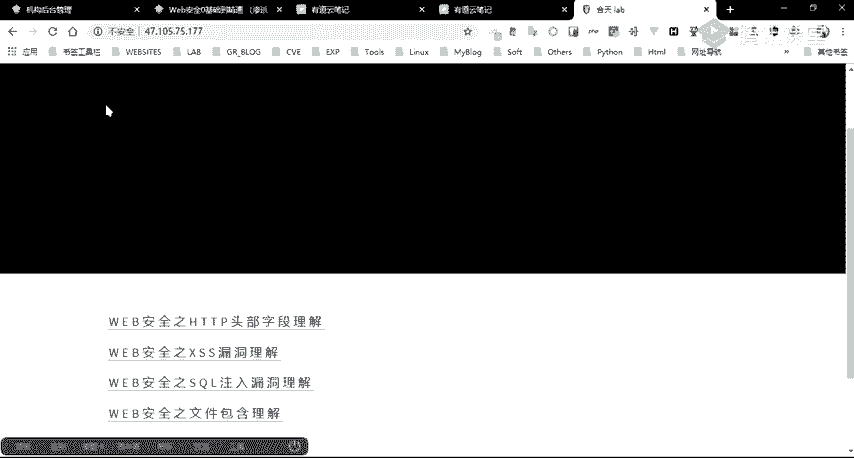

🎼没。🎼，🎼第一次见你微妙的感觉。🎼空气都凝结心慌乱跳跃。🎼微风在摇曳甜蜜的季节。😊，🎼你缓缓走来，我无法拒绝，我想要和。😊，🎼あめ。🎼这算不算表白，想要拉着你的手，摔也不。😊，🎼我想要。🎼谈恋爱。

🎼不想再等待，想要和你去看海。😊，🎼看好些欢。🎼。🎼第一次见你微妙的感觉。🎼空气都凝结心慌乱跳远。🎼微风在摇曳甜蜜的季节。😊，🎼你缓缓走来，我无法拒绝。😊，🎼我想要和你谈恋爱。😊。

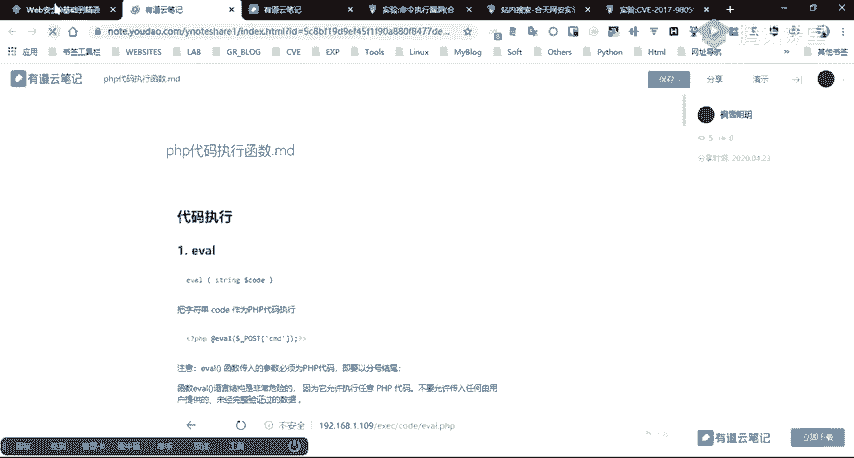

🎼就算不算表白，想要拉着你的手再也。😊，🎼我想要和你谈恋爱。😊，🎼不想再等待，想要和你去看海。😊，🎼看那些花。🎼叮滴滴滴。😊，🎼，🎼的心边爱天。😊，🎼。🎼我想要和。🎼就算不算摇白，想要拉着你的手。

甩也不。😊。

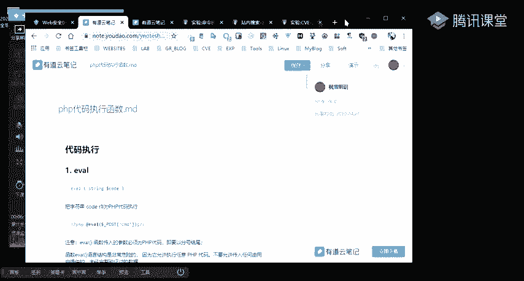

🎼我想要喝。🎼3留。🎼不想再等待钞票。😊，🎼去看海。🎼看花些花。🎼我想要和你谈恋爱。😊，🎼不想再等待，想要。😊，🎼请看他。🎼看好是坏。🎼う？🎼已生了雨水的气味。🎼渐渐蔓延。🎼缓缓时钟习惯性失眠。

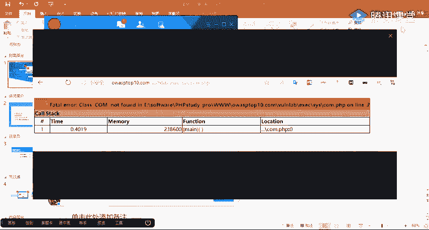

大家晚上好。呃，我们上节课的话是讲了给大家介绍了一个命令执行。然后在我们呃我们这节课的话呃，上节课是讲了。命令执行漏洞的一个警戒，就是我们通过对命令执行，就造成命令执行，还有代码执行的一些函数。

它的一个介绍以及它的一个基本的一个原理来理解命令执行漏洞。它是什么样子的一个呃过程？那后我们呃这节课的话主要是讲一下命令执行呃，漏洞的一些利用。然后的话还有就是呃面令之前漏洞的一个防护。

然后在上课之前的话，呃，我们先大概的过一遍我们上节课所讲的一个内容。好吧，就大家呃跟我一起来过一遍，加深一下印象。🤧嗯。首以的话我们是有讲了面临执行漏洞，它产生的一个原因。

就是呃跟我们的一个cir口注入以及叉S叉SS这种呃漏洞也是类似的。就是说他没有对用户的一个输入做严格的一个检查过滤，然后把用户的一个输入当成了它的一个呃代码去进行一个执行。

然后的话就导致啊命令执行的一个漏洞。然后它的一个危害的话，跟我们的就之前讲web share是类似的。就说我们的一个命令执行漏洞的话。

就相当于就是说我们可以利用web服务器的呃利用应用系统上面的这样子的一个漏洞来去呃执行服务器的一些命令来得到服务器的一个shall。然的话就是呃我们有介绍呃命令执行的两种。

第一种的话就是一个远程的一个代码执行。第二种的话就是一个呃远呃远程的一个命令执行。就它的一个区别的话就在于啊我们的执行的这样的一些函数。它是呃它的一个作用是不一样的。就说我们的一个代码执行的话。

它是一个代码逻辑，它存在这样子子的一个漏洞。然的话它是它执行的呃就是能够去进行一个命令执行的一个效果的话，它是执行我们的一个PHP代码。然后的话，如果他是想要去执行我们的一个系统命令的话。

就同样的需要调用我们的呃在PHP当中去调用系统命令执行的这样的一些函数来去执行一个系统的命令。而我们的一个系统命令执行的话，就是说它呃应用系统它本身就存在这样子的一些功能点，就是说去调用系统的一个命令。

然的话它的这个功能点，它呃就是说要嗯。🤧要设计这样子的一个功能点的话，在PHP当中，它是需要去调用这样子的一些调用系统面令的一些函数的。所以说的话，如果没有对我们的一个用户做一个对我们用户的一个输入。

做一个严格的一个过滤的话。就很容易去导导致这样子的一个命令执行的一个漏洞。🤧K。啊。然后的话在远程代码之前的话，我们主要介绍了ever函数，呃，还有set函数呃等等的这样的一些就是。

能够去进行一个命令执行的一些函数。然后这些函数的话，其实呃我们最常见的就是这种ever，还有set，对吧？就说这这种函数我们再去进行一个构造我们的一个一句话码的时候，也会去使用到。

因因为它就是说我们的一个一句话码，也是去需要去使用到这样子的一一些函数来去执行我们的一个PHP代码。来进行一个命令的一个执行。啊，呃这里的一些函数的话。哦，这里的一些函数对了。

就说我今天的话有发了这样子的一个文档。呃，昨天的话是忘记发给大家，就是在课前的时候。哦。我这里有发了这样子的两个文档，这这里的话是我写的，就相当于一个笔记给大家去进行一个查看。

就呃这就是这里的话有详细的就是说明了这一样的一些函数，它的一个作用以及它的一个使用。然的话我们怎么去呃，如果说大家看不懂这样子的一些PHP代码的话，呃，就说不知道怎么去使用的话。

我这里也有这样子的一个截图，大家可以去尝试一下。啊，其实你尝试之后的话，你就能够基本的理解它的一个作用。这个的话我有有让大家去进行一个预习，大家有没有去查看呢？我看这里的话没没有多少人看啊。

还有的话就是1个PHP的一个命令执行的一个函数。好，这里的话呃我们上节课也大概的有介绍。啊，就是P区命令执行的一个函数的话，主要的话就是这4个。EXEC systemstem，还有这一个pass思路。

还有这一个需要XEC这是呃比较常用的，能够呃就是专门的去执行我们的一个外部命令的一个函数。嗯。呃，然后具体的他的一个怎么去。呃，上节课的话是讲了前面的对吧？

后面的话有两个是没有给大家做一个基本的一个介绍。后面这两个的话，大家其实在本地呃。或者是说。🤧K。呃，这里的一个昨天的话忘记放到这一个服务器上面去了，大家可以在这一个服务器上面去进行一个。呃，尝试。

然后的话在本地的话，大家也可以，就是我昨天的话也有发代码，然后在服务端的话。在这个服务器啊在这个靶场上面，我是今天的话有把一些代码做了一个更改。看。诶。什么。😔。

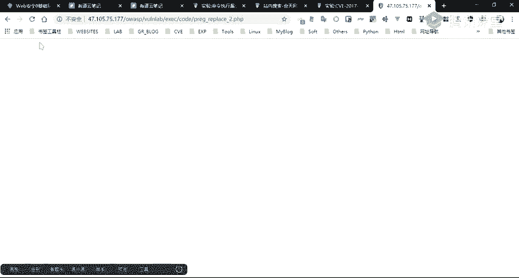

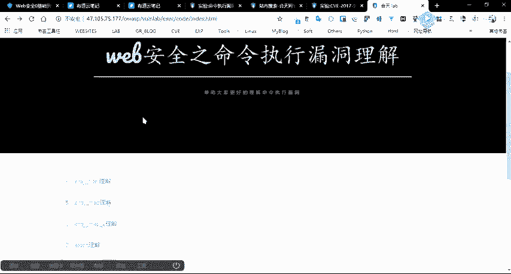

兄弟。😔，嗯。

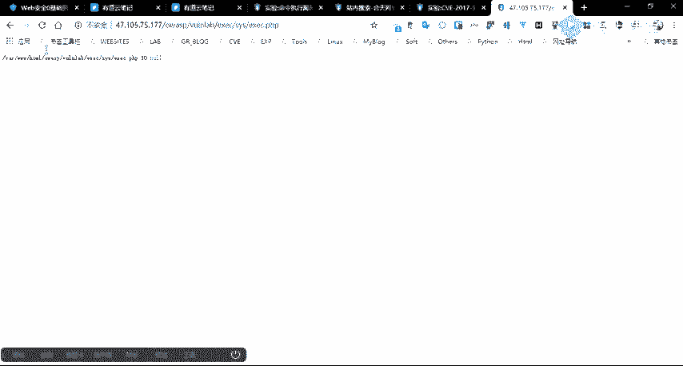

Okay。

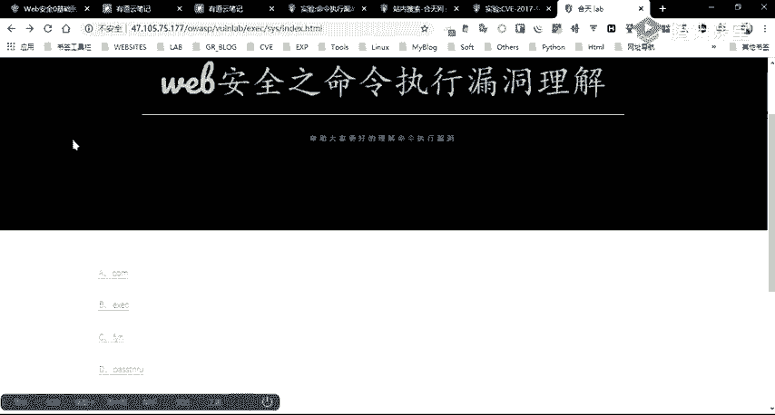

。看。P。Okay。Okay。呃，我把代码的话是放在了这一个目录，就大家嗯因为这个这里的话，这些的话是。不是很全啊。

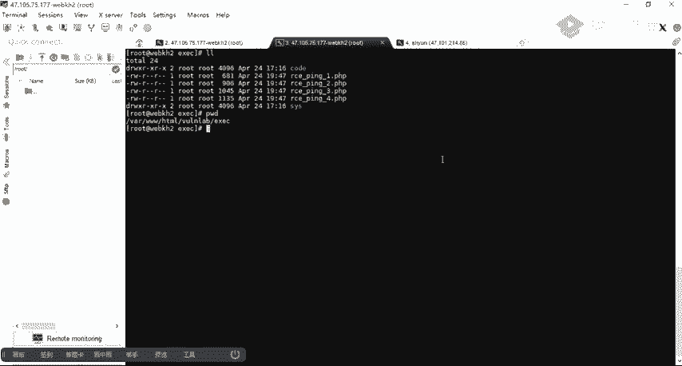

🤧没没有写全，就是。

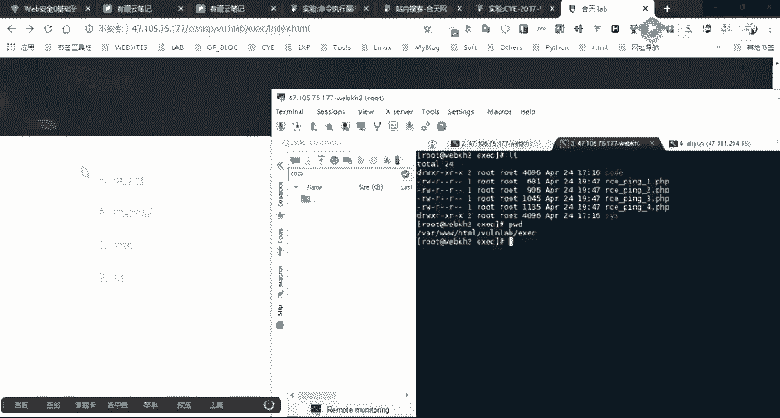

大家想看就是详细的详细的一个的话，大家可以呃。

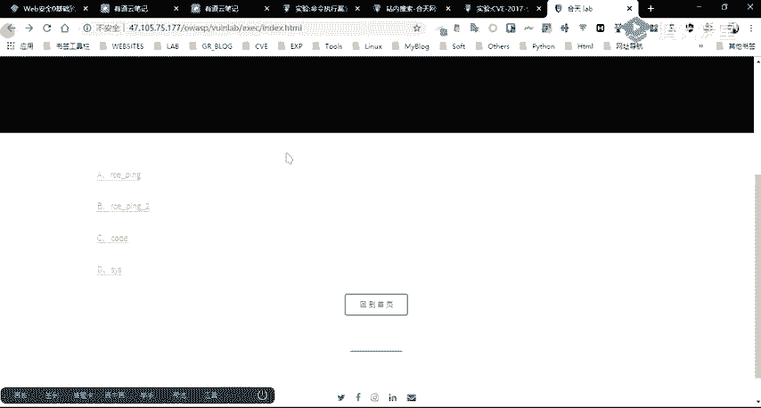

就用之前的一个hell，对吧？大家大家呃在这个服务器上面的话，上面的一个hell都是没有删除的。大家可以用之前的一个sll，然后的话呃用菜刀啊连上这一个服务器服务器。

然后的话在这一个目录下面查看呃它的一个文件名。😊。

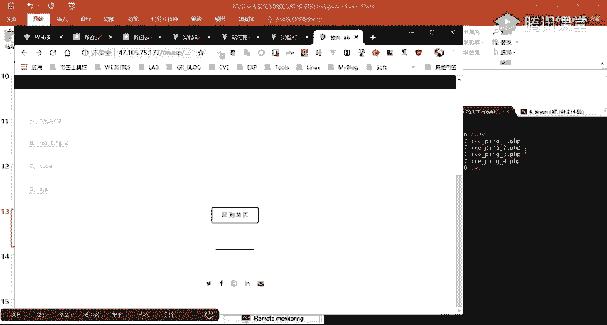

呃，没有写呃，没有写，没有把它全部写到那个页面上去了。🤧Okay。

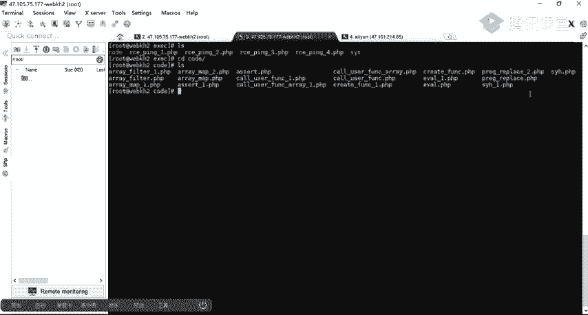

然后的话呃这里的话我就是对昨天的一些代码的话做了一个修改，就是便于大家的一个理解。

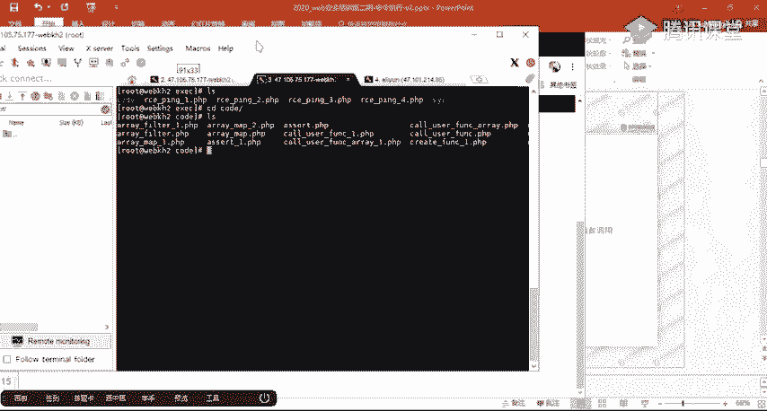

嗯。

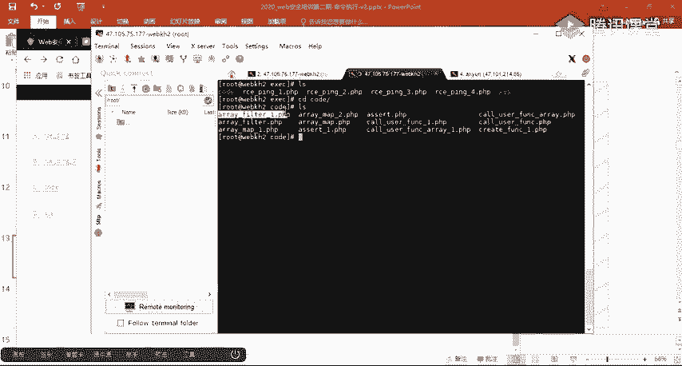

比如说。Okay。他。

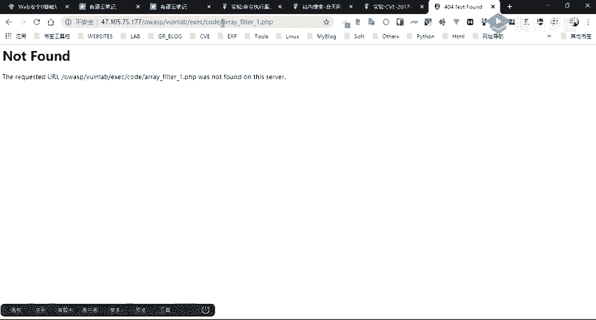

嗯。😊。

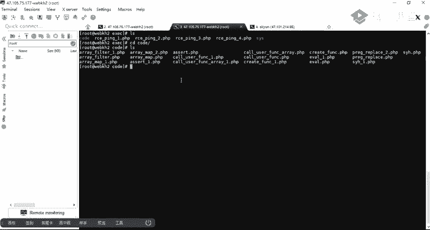

好。And。

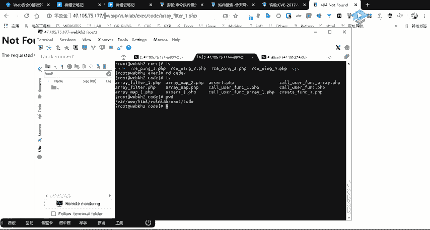

Yeah。Yeah。我今天的话是把昨天的一个代码的话做了一个修改，就是说呃。之前的话是没有说有这种输入的这种界面啊，我这里的话就呃随意的写了一个简单的一个这种页面。啊。

比如说这一个函数大家想要去进行一个操作对吧？这个everry fat。我们嗯。Oh。🤧K。哎，对照一下它的一个使用是。这个对吧，然后它的一个云代码的话是像这样子，呃。

大家可以在需要上面直接去连接去查看它的一个云代码。

然后它的一个使用的话就是呃。

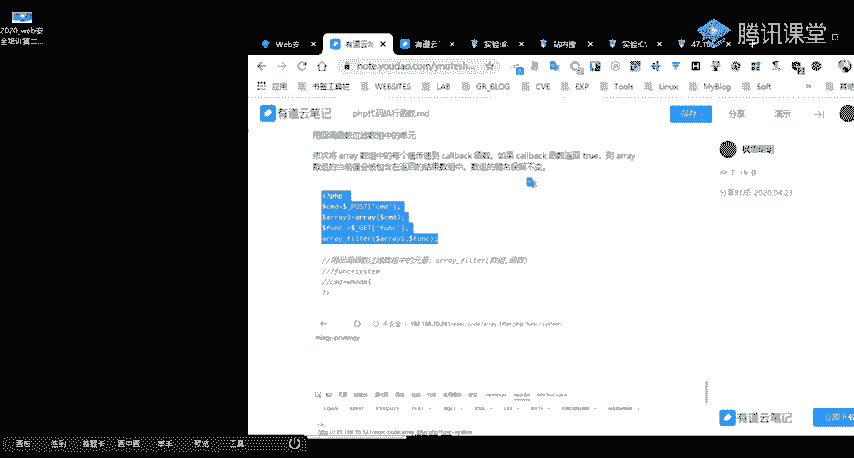

我这样的话前面呃就是这一个函数，我先看一下。

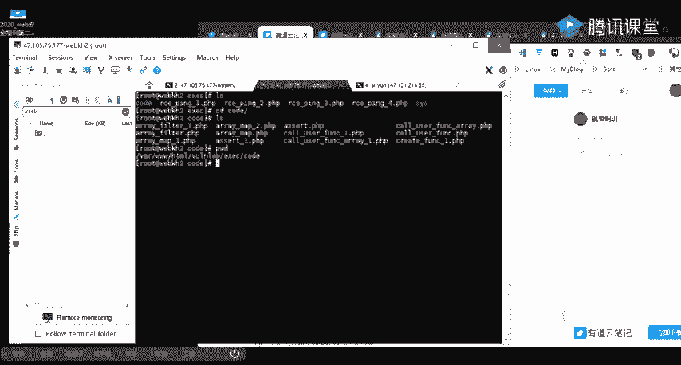

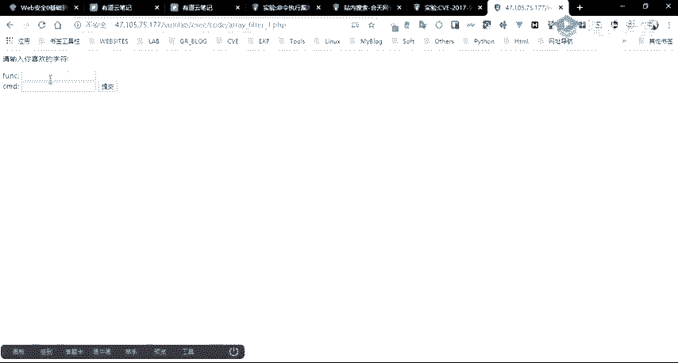

🤧看一下代码。Yeah。

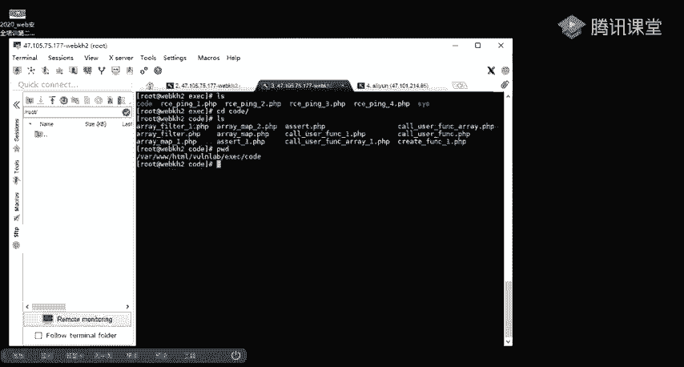

看。这个的话就是呃我这一个页面的一个源代码，其实呃主它的一个代码的话就是。

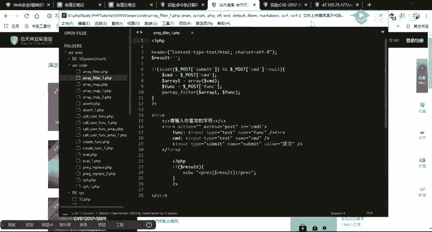

嗯。这里的话就是一个写了1个DIV，就是前端的一个代码，就是这里的显示的这样的一个界面。Okay。然后的话主要的话就是这里这里的话就是呃。

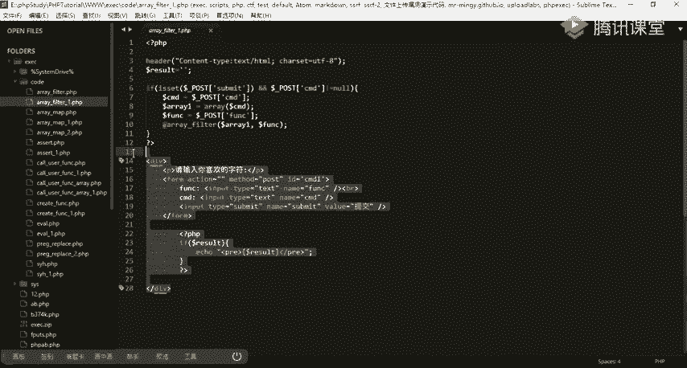

我们通过pos的方式来去提交我们的这样子的两个参数，对吧？就然后我们可以在这里输入我们的呃一个。

比如说除了一个字符。

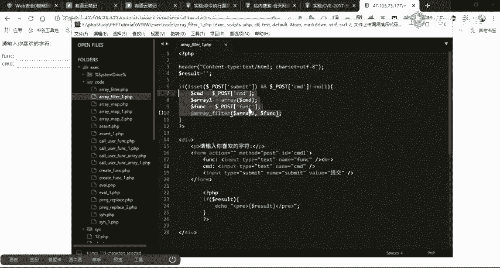

我这里的话想要去执行我们的一个命令，然，就利用这样子的一个函数去进行一个执行。然后可以看到的话，我这里的话。传递的是一个system，然后我们这里传递的一个pos的方式，传到传递到服务端的话。

它就会传到这里来。啊，传到这里来对吧？传到这里来之后的话。

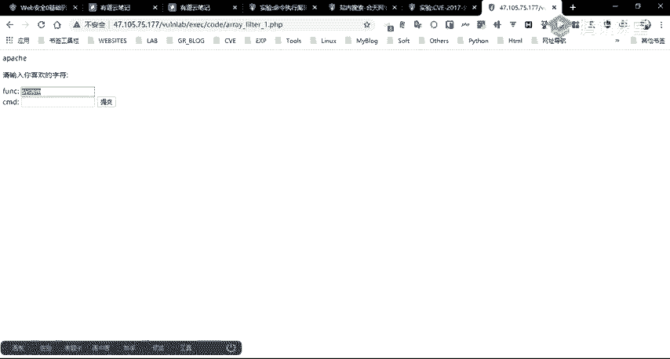

呃，会。呃，放到这里传到这里，就是呃再利用这一个函数去进行一个啊。就调用这里我们传递的这样的1个FUNC的这一个函数来去呃处理我们这一个数组里面所传递的一个参数。然后我们这里的话就是要传递我们的一个。

呃，想要让我们上面所传递的这一个函数去处理的一个参数。比如说我们这里想要去呃用这个stem去执行我们的一个系统命令，对吧？执行我们的一个换卖。可以看到它这样的话是一个返回的是一个阿帕奇。

就当前的一个呃权限的话就是一个阿帕奇的一个用户权限。

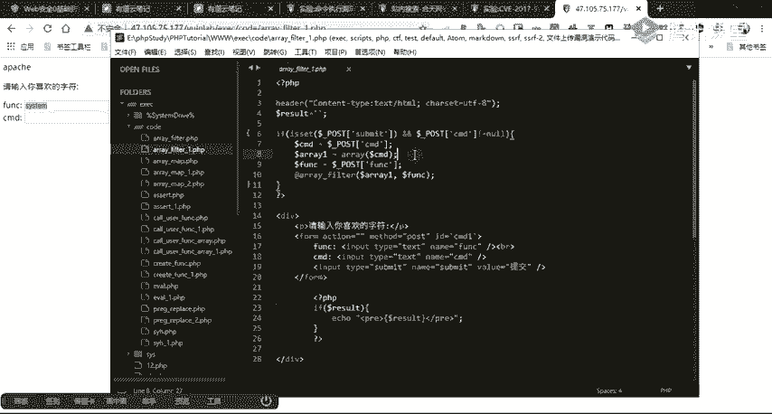

这样的话还有其他的一些命令，我这边的话就不一一不一一演示了。🤧K。呃，然后的话还有其他的一些函数。呃，上节课的话有讲过了，我就这里的话我就不不再啰嗦了。然后呃在这个服务器上面呢有。

这么多的一些呃就是代码，每一个代码的话，它都有一个页面，大家可以去尝试一下。然后这一个的话是留做一个课后作业。哦，还有就是一个。SYSSYS的话就是我们的一个系统命令，执行系统命令的这样的一些函数。

🤧K。Yeah。Okay。

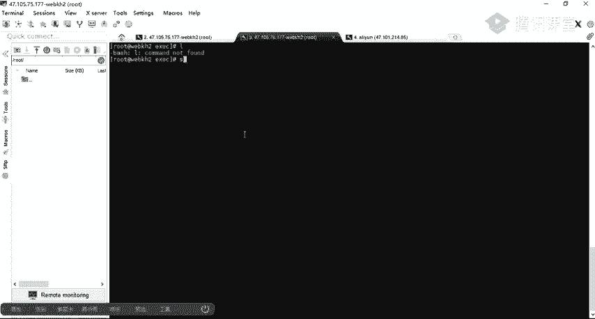

然后的话我们还有就是呃。上节课的话呃介绍了一些就是在命令执行当中常用的一些特殊字符。但是的话只是通过这样子的一个例子来给大家做了一个呃表示。

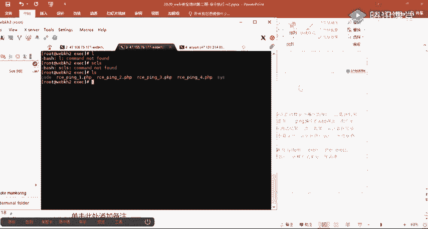

然后没有可能没有实际的去进行一个。嗯，演示就是说通过实例去进行一个演示，我们如何去使用这样子的一些特殊字符来执行我们想要的一个命令。然后这里的话呃。我们就以一些。啊。

例子来演示我们的这样子的一个命令执行。如何去呃。

使用我们的这样的一些特殊字符来构造我们的一个payload来进行一个命令的一个执行。啊，这样的话呃大家访问一下这几个网址。🤧Yeah。发群里吧。

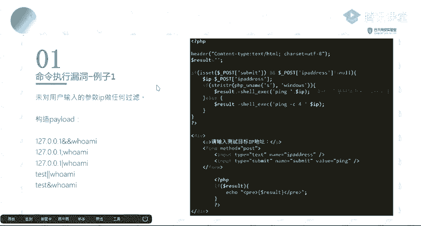

Yeah。😊，Yeah。He。P。这样子的几个网址。呃，我这里的话总共的话是有4个页面。然后在大家访问的时候，就呃在后面改一下就可以了。比如说2。它都是这样子的一个页面。

然后这里的一个这里的一个页面的话，功能的话比较简单，就我们可以看到他这样的话是请那你。🤧那你输入测试目标的1个IP地址，对吧？它这里提示我们输入1个IP地址，我们来呃。除了一个。

随意随意的输入1个IP地址来去进行一个尝试。我这里的话输入一个呃本地的一个回还地址来去。执行一下。发送一下，然后可以看到它这里的话是执行的是一个P命令，对吧？就是呃就是前面我们有说到的，我们从这里的话。

它的一个返回的一个结果来看的话，可以呃知道它是调用了我们的一个系统的一个P命令。然后我们在这里输入的话，就是输入我们的这样子的1个IP。嗯，就这里的话相当于就是一个检测你指定主机的一个就是呃存活。

就是能否去访问到你这里测试的一个目标IP地址。他就提供了这样子的一个功能。然后的话这里的。🤧K。这里的这个功能点，我们知道它是调用了一些系统命令，对吧？然的话我们这里的一个输入的话。

是我们可以去进行一个控制的。🤧然后在这里的话，我们可以去进行一个命令执行的一个呃测试，看它是否存在这样子的一个漏洞对吧？然后这里的话我们就需要去呃使用到我们这里。有介绍的这样子的一些特殊字符。

比如说第一个第一个的话就是一个树干。树干的话呃，我们也可以叫它广道符。就说他可以去连接我们的前后两个命令。呃，管道服他的一个意思就是说我们前面的一个执行。

把我们前面的这一个命令的一个执行结果作为我们后面的一个命令的一个参数。然后我这里的话同样的就是输入这样子的1个呃IP对吧？然后我们在后面再我们想要执行其他的一些命令，尝试一下。我们输一个树干，对吧？

我们如果前面我们知道前面的话，他是可以执行成功的对吧？执行成功，然后我们后面再接一个命令。比如说我这里的话。呃，这一个换卖这样子的一个命令，然后去进行一个尝试。尝试的话。

我们看它返回的一个结果是什么样的，然后可以看到这里的话它只返回了一个阿帕奇。那这个阿帕奇的话，我们可以知道它是呃它的它就是我们刚刚执行了一个MI命令所返回的一个结果。对吧。

然后呃为什么它是只返回了这样子的一个呃I的一个命令呢？就是这里的一个就是说。我们的这个树干的话，它无论前面它是否执行成功，后面的这一个命令都会被执行。就说我们前面他不管是否执行成功了，是否有执行。

他都会执行我们后面的一个命令。然后我们这里其实也可以尝试，比如说我们一个test，然后后面接我们的一个。Okay。关麦。来尝试看是否能够去执行命令。Yeah。然后可以看到的话，这里。🤧Okay。

我们呃回车可以看到它这里的话是返回了我们想要的一个结果，也就是一个货外卖的执行命令之后的一个结果。啊，大家可能看到这里的话，可能会有疑问，为什么能够去执行我们啊。

为什么我们加这样子的一个呃树干的一个符号就能够执行命令呢？而，这里的话呃，我们通过我们的一个云代码来对它做一个分析。

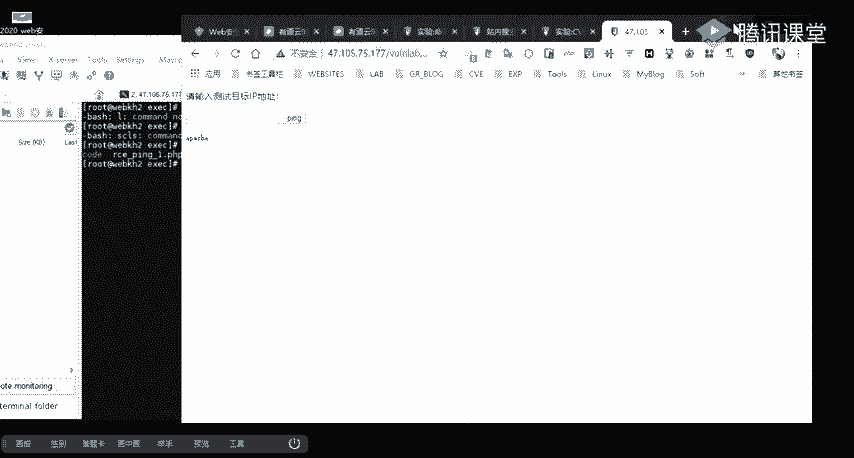

P。呃，那个页面的一个云代码的话就是像这样子。跟前面的一个页面的话是类似的。呃，主要的话主要的一个核心代码就是在这里。就在这一串。啊，在这一串的话，我们先来捋一下呃它的一个代码的一个逻辑。Okay。

首先的话我们可以在这里呃，我们先从下面开始吧，这里的话就是1个DIV就是我们的这样子的一个页面，对吧？刚刚那个输入框的一个页面，我们写的1个HTM的一个代码。然后的话他这里的话是呃有一个输入框，对吧？

然后这个输入框的话就是我们要向我们的一个服务端传递的那个呃字符。或者说要向服务端去传递的一个命令。也就是我们呃用户或者说攻击者能够去可以控制的一个输入。然后的话呃这里的一个输入的话，它就会呃传到这里。

这里的一个代码，这里的的一个代码的话就是呃检测你的。You said do I？Thank you。Okay。🤧然后这里的一个。黑色的话就是判断呃你的这里的一个变量，它是否呃是否含有这样子的一个呃数据。

呃，在这里的一个意思的话，就是呃你是否有接收到呃这个subermeter这个参参数。然后这里的一个值的话就是从这里来传传过来的。就其实我们再去进行一个呃。上传文件的时候，对吧？

我们要点击这样子的一个按钮，点击这样子的一个呃按钮的一个事件。点击之后的话，它就会呃有就是在前端的话会传递这样子的一个name的一个值，对吧？然后的话呃PHP代码的话，它是从你传递的这样里的这一个呃。

内目的一个值来获取你传递的一个参数。而，这里的话它是判断你是否有提交。就如果说你没有提交啊，你没有点那个按钮的话，它是呃就没有触发这一个事件的话，它是不会去呃传递到服务端的。

然后第二个的参数的话就是判断我们这里的呃。以这里的一个pos的方式所传递的这一个呃用户输入的一个数据，然后通过pos的方式来接收接收这里的接收之后的话，做一个判断你的这里的一个参数它是否有传递。

就说你直接这样子去进行一个提交的话，它是不会呃。

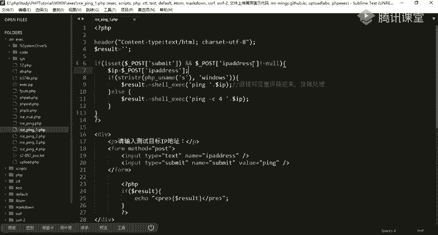

在服务端不会继续走下去，走到下面的一个代码。如果判断你的这两个。

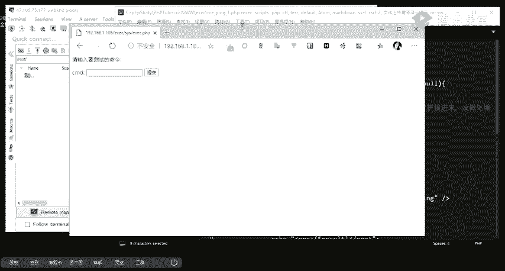

Okay。这两个值都有了。他就会继续下面的一个代码的一个执行。然后然后的话就执行到这里，这里的话就是把我们的前面的所用户输入的一个。呃，制服把他给。给到这个IP的这个变量。给到这个变量的话，呃。

这里的话这里的一个代码的话就是判断呃你当前的一个服务端它是什么，它是什么样子的一个系统。呃，主要的话就是这一个HB your name。这个函数。这个人说的话是。

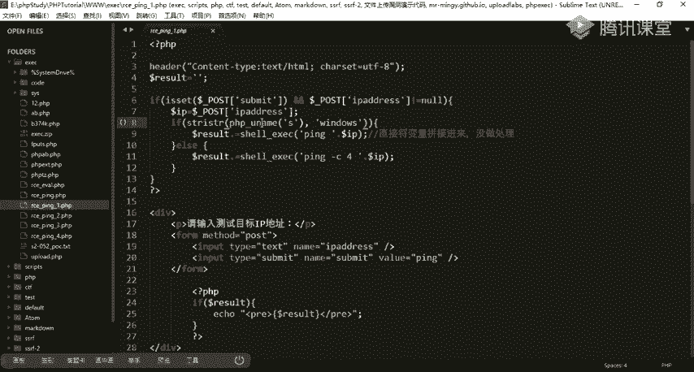

🤧返回运行PHP系统的相关的一个信息，就说返回你啊运行这个PHP代码，它的一个服务器，它的一个系统的一些信息。然后这些信息里面的话就包含有。包含有你当前的一个系统的一个类型。然后这里的一个代码的话。

就是从你返回到这里的一个信息当中来去啊匹配你是否有这样这样的一个windows的一个信息。

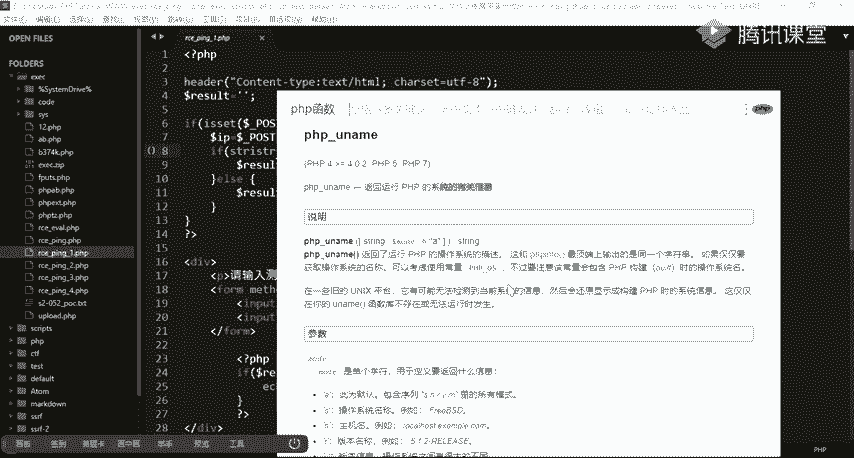

如果说呃有你返回了这页一个系统信息里面有这个windows的话，就说明你的一个系统是一个windows的一个系统，对吧？然后的话他就会执行下面的这样子的一个命令。这个执行命令的话。

它是使用的这个需要杠EXEC的这一个函数。前面的话有讲到对吧？它是能够去调用我们的一个系统命令去执行啊，去执行的。然后这里它执行的一个命令就是一个P命令。哦，他的一个问题就是出在这里。

就是说我们用户输入的这样子的一个呃数据。啊，把它传到了这个变量之后，传到这里的话啊，判断了它的一个系统之后，它直接。就把它拼接到了这里的一个需尔概X1这一个命令执行函数里面。

然后的话它没有对我们的这这里的传入的一个数据做任何的一些处理。就是说没有对它的一个合法性做一个判断以及过滤。然后的话。攻击者的话就能够利用。我们前面有。好，我们。

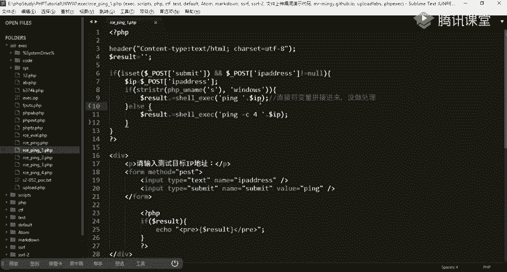

前面提到的这样子的一些特殊的一个字符来去啊啊拼接我们的一个命令。然后在这里的话，其实它的一个命令就是在服务端，它是这样子的一个。

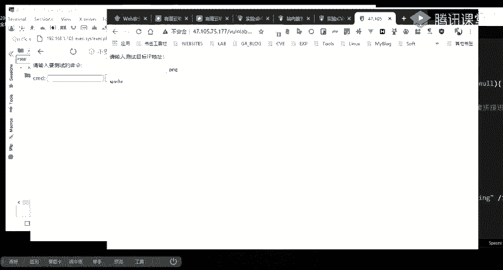

显示它其实在服务端去进行一个处理的话，就是它首先呃用这个需要干X1调用这一个P命令，对吧？然后pin的话， pin命令的话，因为是在windows呃，我这里的话。

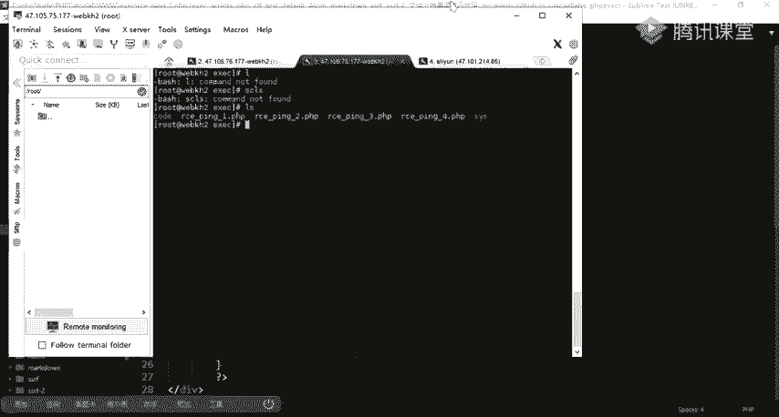

在windows上面。Yeah。Okay。

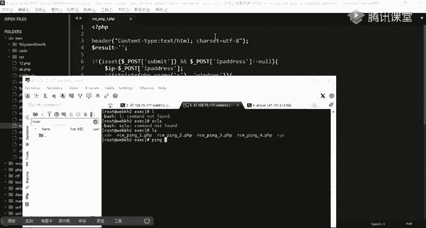

🤧在win上面去进行一个pin。而，P的话呃，因为用户因为服务端他没有对呃用户的一个输入做任何的过滤。然后我们如果说是一个正常的一个输入，对吧？我们在这里输入一个正常的1个IP地址。

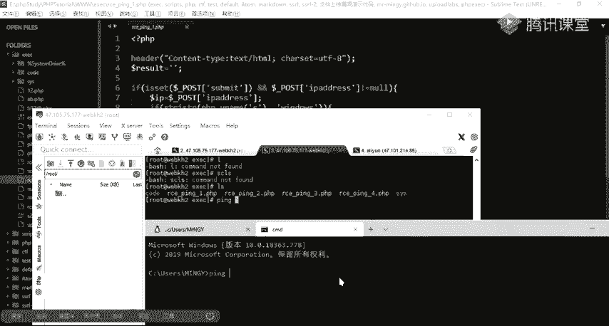

P。然后他就会把我们的这个IP地址把它给拼接到这里。

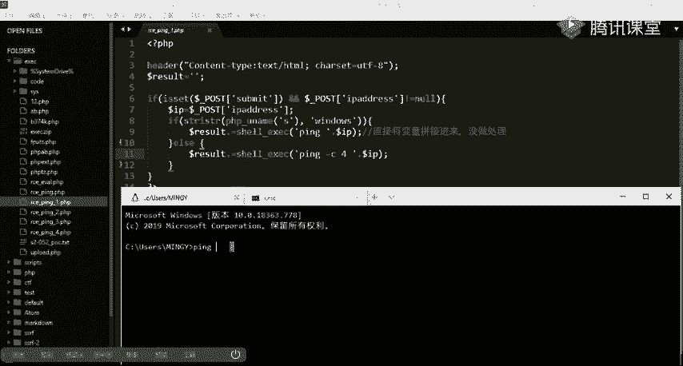

就是等于是就是在我们本地去执行我们这样子的一个聘本地的1个IP。

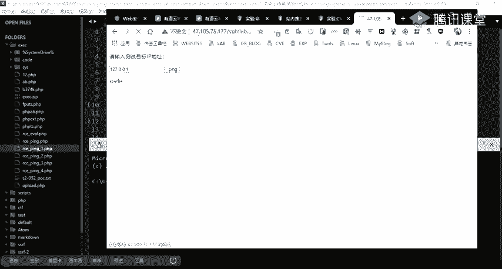

🤧然后的话它的一个返回的一个结果就是这样子，对吧？然后的话也返回到。

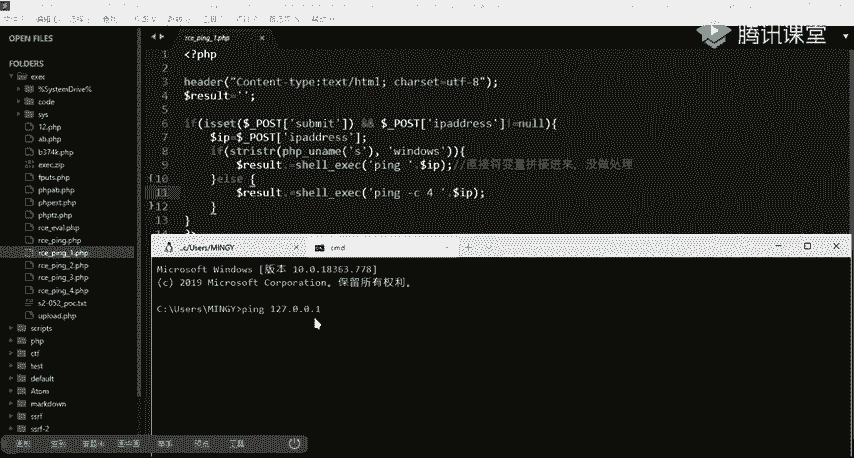

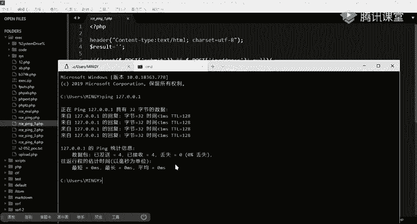

它会返回到我们的一个浏览器。就是像这样子。🤧然后的话我们因为它没有对我们的一个用户的一个输入做一个过滤，我们可以使用这样子的一个广道服。

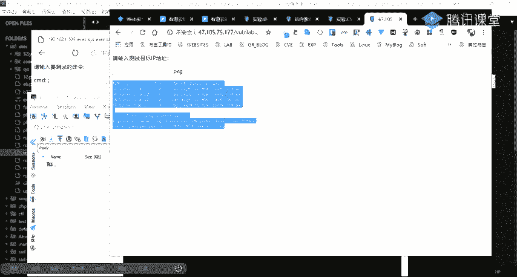

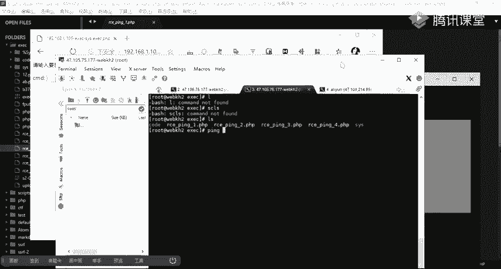

我们在后面接一个广道服。然后的话在街上我们想要呃。额外执行的一个命令，比如说外卖。查看当前的一个用户。

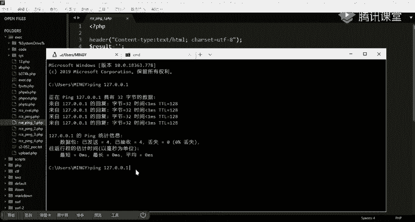

我们来执行一下，然后可以看到在这里的话，执行之后，它返回的一个结果就是呃一个hoI执行之后的一个结果，对吧？因为我们的这个管道服，他就是说他不管前面的一个命令，它是否执行成功或者失败。

它后面的一个命令它都会执行。然后他前面拼拼接拼这一个本地的1个IP地址，对吧？它执行了执行成功了，但是执行成功之后的话。

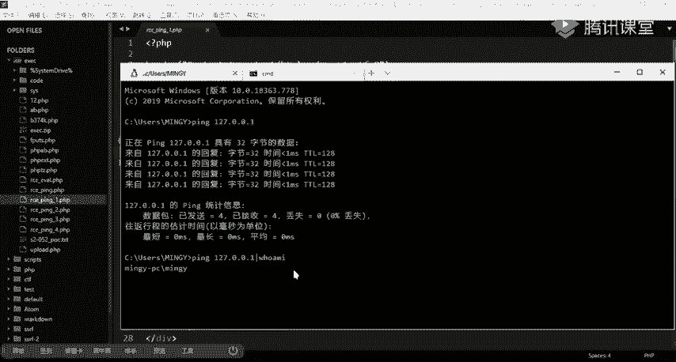

我们后面的用这一个管道符连接的这一个命令，后面的这个命令，它同样的会去进行一个执行。执行之后的话，它返回的一个结果，就是这里的一个命令的一个执行结果。

所以说的话我们就能够通过这样子的特殊的字符来进行一个拼接，来执行我们想要呃服务端额外执行的一个命令。

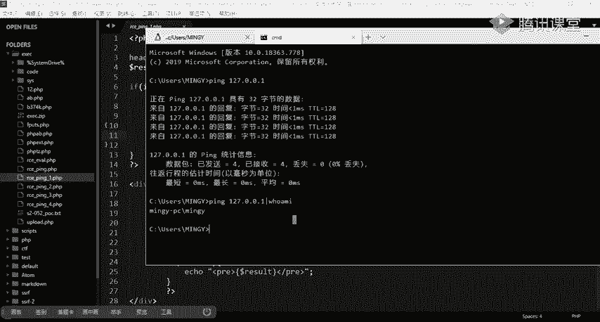

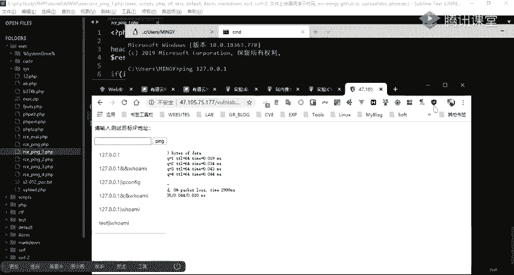

比如说if come big。好啦，查看。查看他的呃IP信息，对吧？嗯。

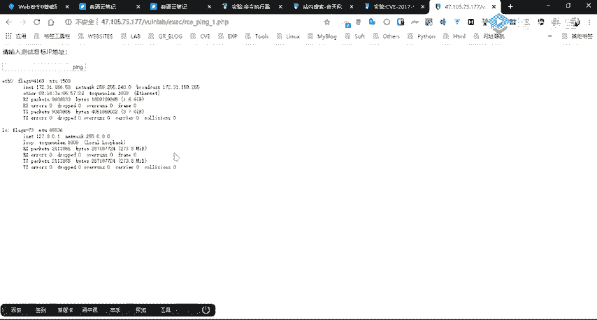

然后这里的话是在windows上面，然后如果说呃它访回的这样子的一个信息，它不是有windows的话，那么就说明的话它是这种unux或者是说linux系统，对吧？然后的话linux系统上面的话。

跟windows上面的一个区别的话，就是在于命令它的一个不同。

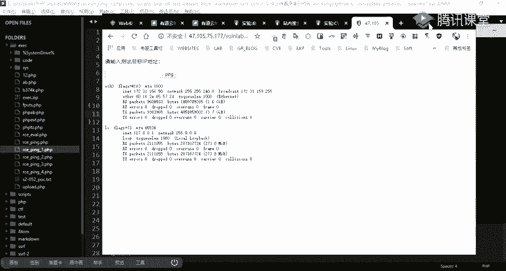

啊，就是你在lininux里面，大家如果玩linux的话，就是你在linux里面去骗1个IP对吧？去骗1个IP的话，如果你不指定它啊，发它发送骗数据的一拼的，就是它去拼的一个次数的话，它就会一直拼下去。

对吧？它不会它不会停，它会一直拼下去。

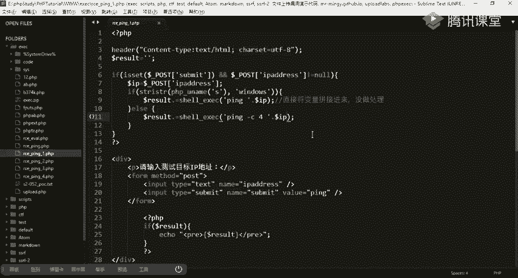

所以说的话这里它其实就是一个命令的一个不同的话，就是我们通过杠C这样的一个参数来指定它拼的一个次数。呃。Okay。然后的话在windows上面的话，默认的话就是它会啊进行一个就是进行。

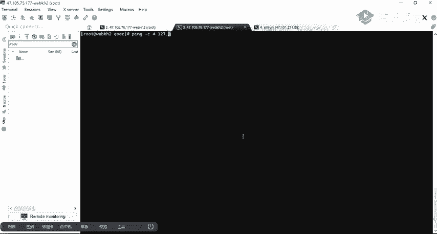

他会拼四次。然后的话拼完4次之后，它就会啊结束。然后这样的话在历史上面的话，我们需要用这杠C的这样的一个参数来指定它拼的一个次数。

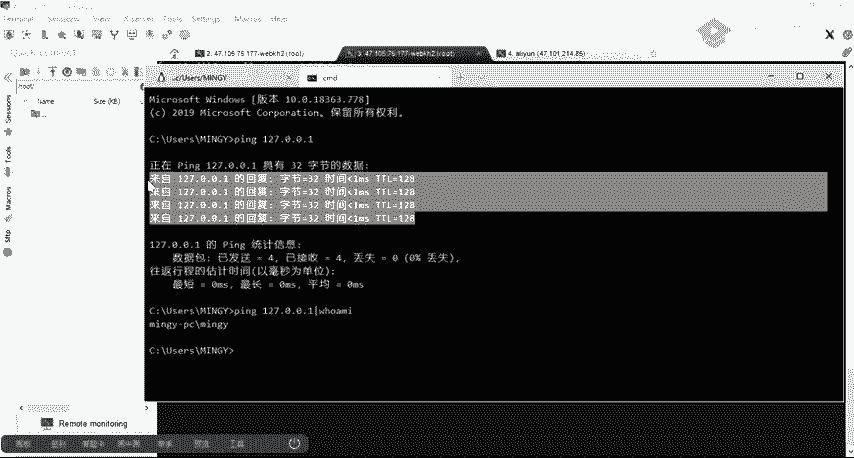

因为如果你不指定的话，他就呃在服务端对吧？在服务端它会一直骗，一直骗的话，它的等于你的这个聘的一个。

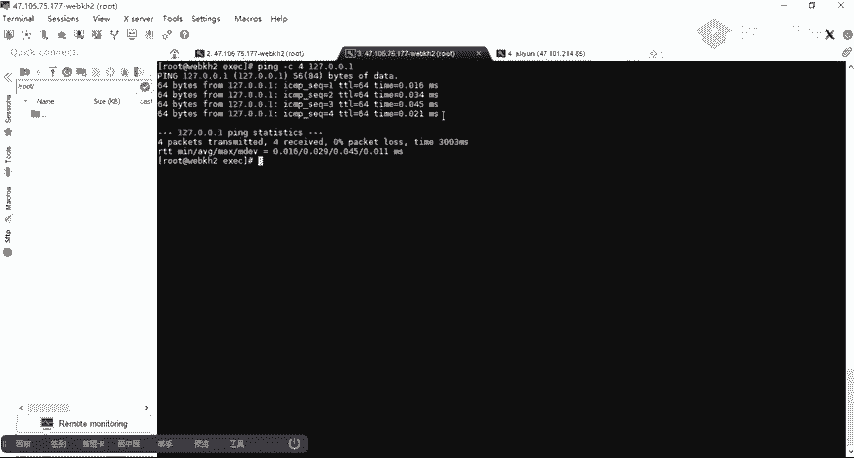

呃，程序它是没有执行完毕的。如果你没有执行完毕的话，在这里服在这里的一个浏览器的话，它就会一直在等待，就一直会在转，就是一直转。

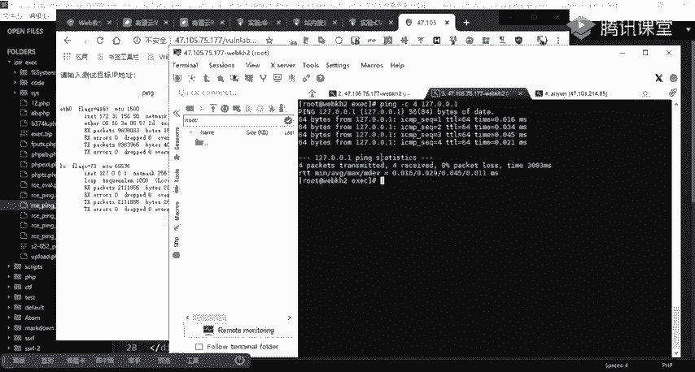

然后直到服务端它处理完这处理完这一个程序之后的话，它才会返回一个结果，显示在我们的一个浏览器上面。🤧K。Good。然后这里的话就是呃。

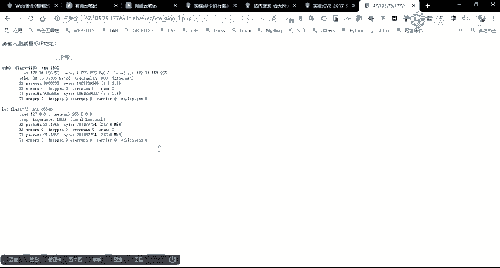

这一个例子，它的一个嗯。

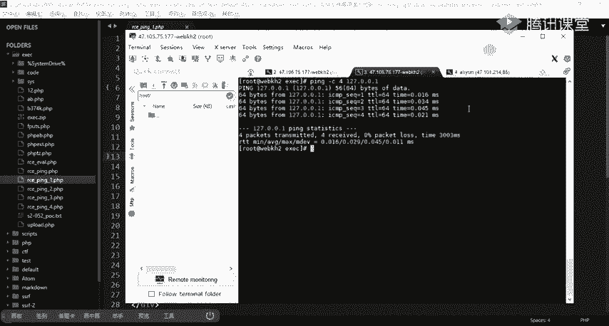

演示以及讲解。啊，不知道大家有没有听懂呢？就大家对这一个有没有什么疑问。

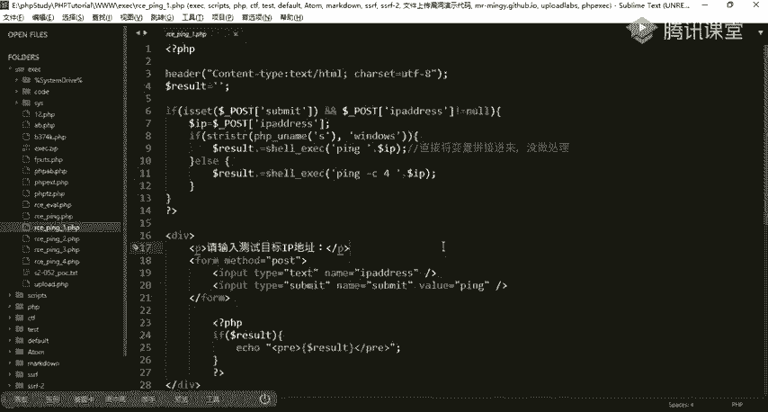

大家有有没有什么疑问呢？好好。大家可以去进行一个尝试。

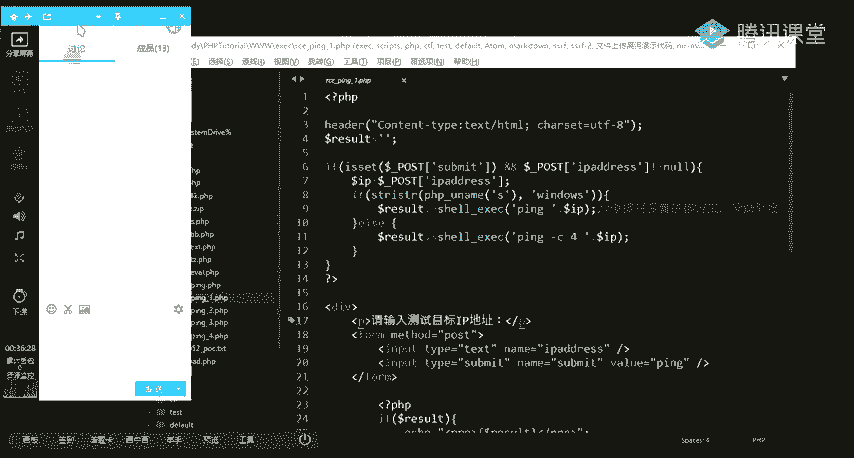

Okay。系。链接的话就是这里学逍遥的话。Okay。因为你这里的话，你能够通过这样子的一个啊。王道福对吧？来去拼接我们的一个命令，对吧？如果你哎。你既然能够执行命令了，对吧？比如说我可以用echo来呃。

就执行这样子的一个e命令，对吧？来像我们的这样子的一呃，比如说写入一个一点tex这样子的一个文件。Okay。Okay。好，我们来执行一下。Yes。咨行之后的话，我们可以来嗯。

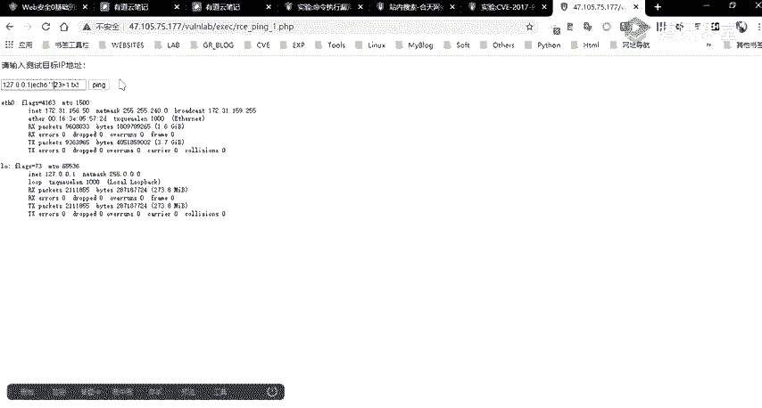

Yeah。Next。あ。哦。

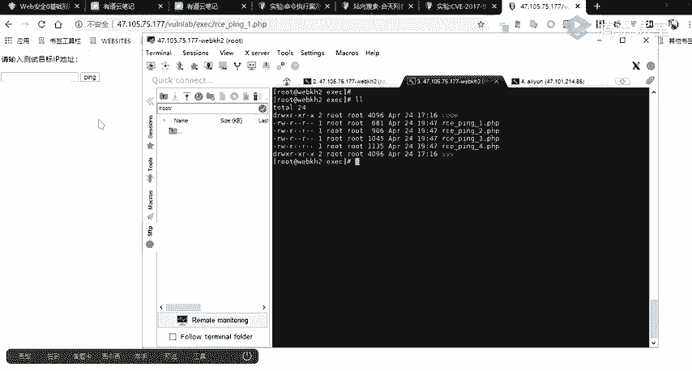

Okay。Okay。Yeah。Okay。Yeah。哎呀。

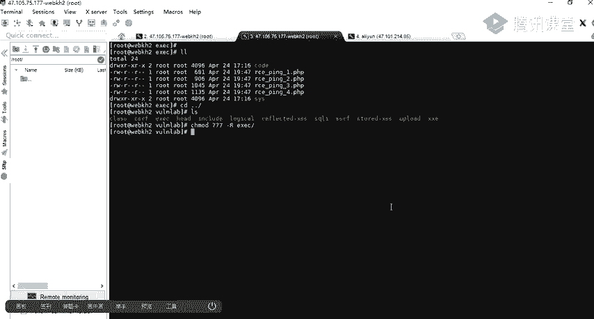

我们可以用来测试一下，用ele执行，就是一个写入的一个命令。Okay。我们写入到1个一点texax来去进行一个尝试。然，执行之后的话，我们可以来看一下呃，应该是有了的。

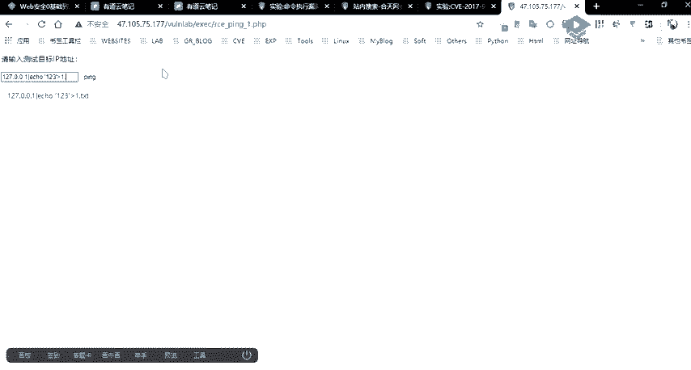

Okay。可以看到我们在这里的话呃已经写入了这样这样子的一个文件，对吧？我们可以查看一下里面的内容就是123对吧？我这里先可以测试一下。

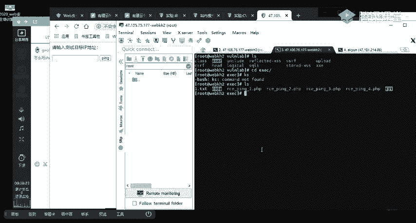

呃。

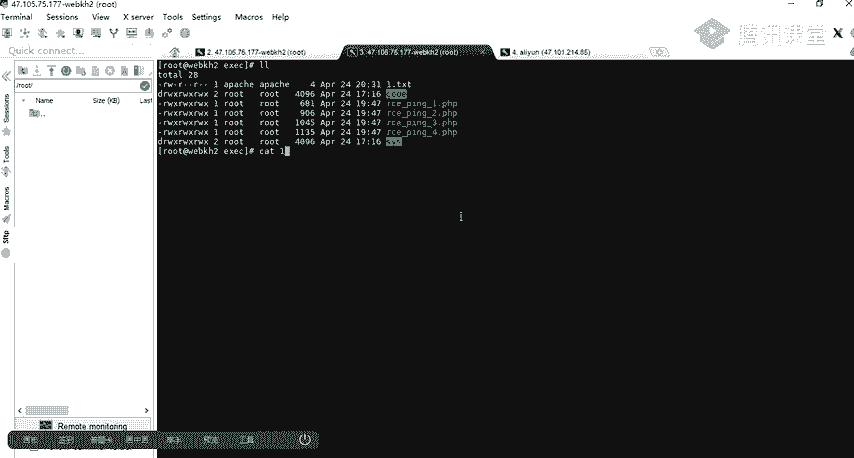

然后的话我们可以来访问一下嘛一点text这样的一个文件，对吧？就是123的一个内容。然后我们我们就可以通过Eal来去写我们的一个一句话码，对吧？写我们的一句话码，把我们的一句话码命令。呃。

把它写到服务端，就能够直接去进行一个连接。然后的话呃。还有就是呃其实我后面的话也会有介绍到，就是通过呃通过这样子的一个命令执行来反他一个shall，就说直接反他shall。

因为它能够它能够直接执行我们的一个系统命令，对吧？那么我们可以利用它来执利用就是说呃在inux上面或者说windows上面反弹需要的一些方式来直接反弹一个需要给我们。就不需要去进行一个传码什么的。

然后的话当然的话也可以去用命令执行来写shall，对吧？我们可以直接用echo这样子的一个语句写我们的一个一句话码，对吧？然的话呃。还有的话就是我们之前有讲到的。用这样子的，就是呃如果想你想要用大码。

对吧？想要上传一个大码的话，你就呃可以用这样子的一个FP来写我们的一个小码。然后的话通过小码来上传我们的一个大码。这样的话呃前面的话有讲到了。呃。这里的话我等会再细讲吧。好，我们先呃说前面的吧。

这这里的话呃你明白了吗？有理解了没有？嗯。就说你都能够去执行命令了，对吧？你能够通过这样子的一个方式执行命令，那么等于就是说你直接是在这样子的一个呃。等于是直接在这样子的一个呃需要环境下面去执行命令了。

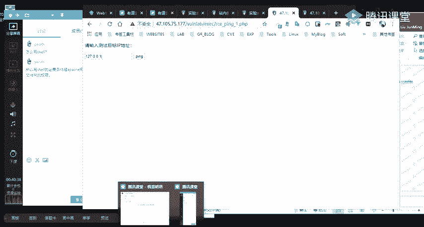

🤧对，因为你单因为你默认的一般的就是一个。呃，阿帕奇的一个权限对吧？然后的话你的这样的一个目录，你要想你要能够去写文件的话，因为我这里的话是直接用root用户。然后的话呃。

这里的这样的一个文件文件权限的话是呃root组的。

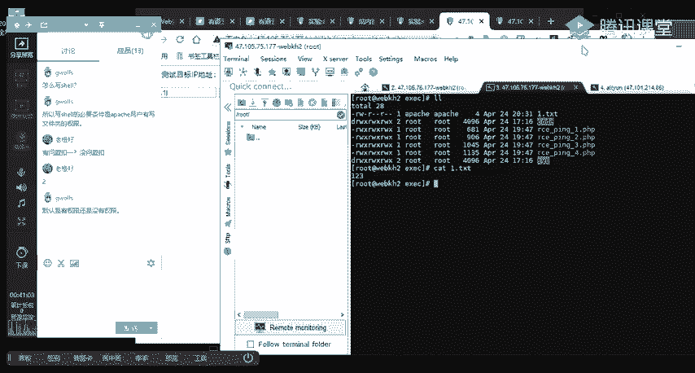

🤧嗯。And。所以的话你阿帕奇的话呃，然后的话呃之前的话是1个RX，它没有写的一个权限，没有一个写的权限的话，你是无法向这个目录下面去写文件的。所以的话我这里的话是图方便就改了1个777的1个权限。

然后的话呃就是说一般的就是说你的一个外b服务器的话，它会有存在这样子的一些目录。就是说你的一个阿帕奇用户，比如说你写这种日志，你呃或者说还有其他的一些一个要求，或者是说上传文件的这些目录的话。

他呃阿帕奇的一个用户都是能够去进行一个呃写文件的。

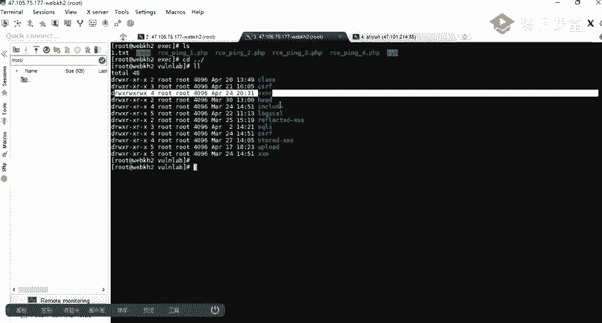

除非的话有呃额外的一些性质。Okay。啊，理解了是吧？啊，对，有啊有问题的扣一，没问题的扣2。😊，Yeah。啊，还有问题吗？没有问题了。好的，没题话，那么我们继续。Okay。呃。

前面的话我只是呃测试了这样子的一个管道符，对吧？然后的话我们还有其他的这样子的一些字符，它同样的能够去达到我们的这样子的一个目的。然后我们可以看一下这里呃。

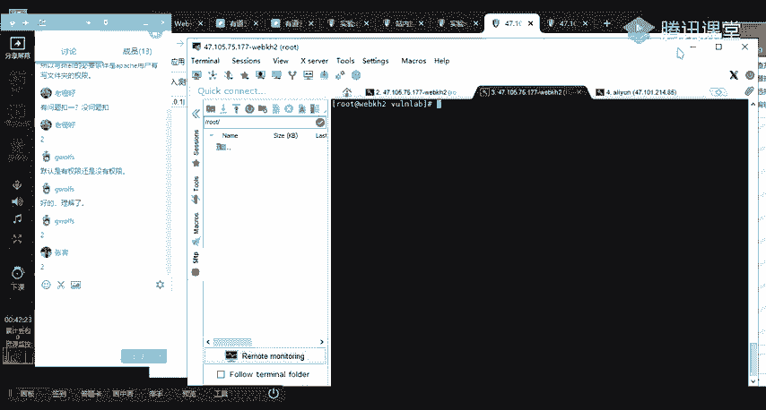

我这里的话有贴了一个现成的一个代码。Yeah。呃，大家可以去访问这一个地址。能够直接访问到。

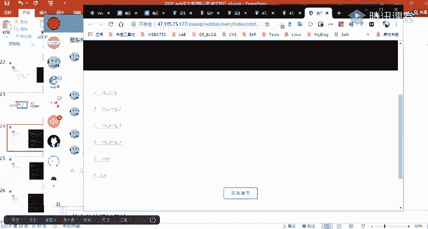

Yeah。Okay。Okay。啊，就是这里的哎。这里的4个。

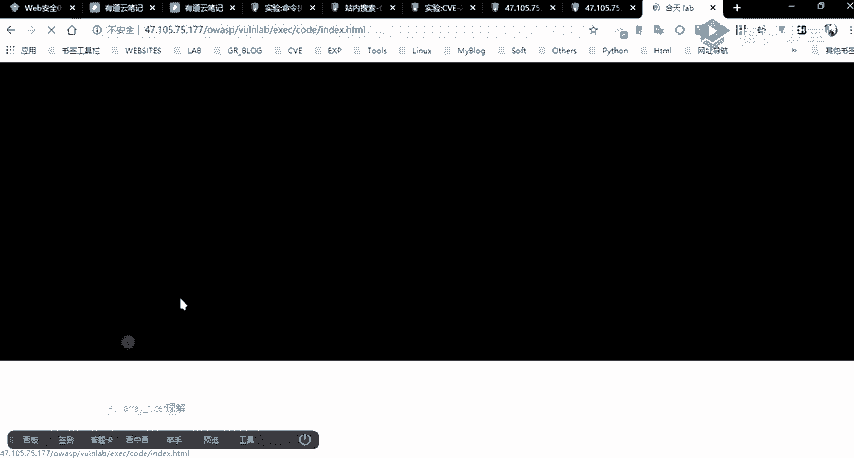

这里面四个题目大家可以去尝试做一下。

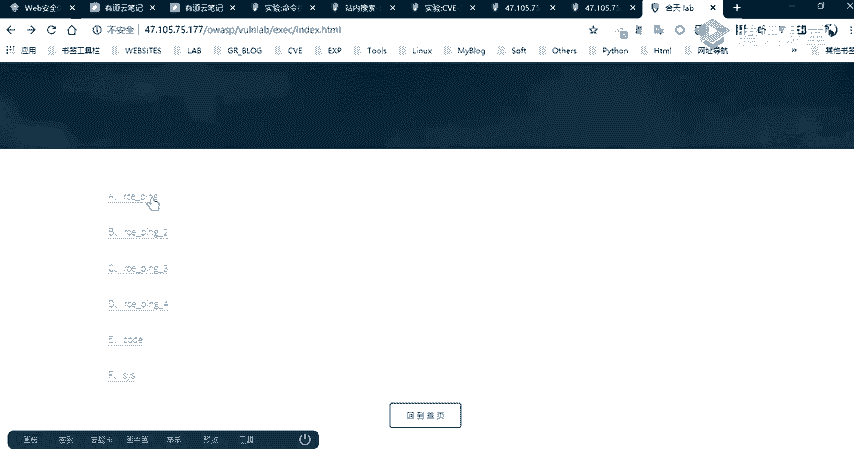

Okay。

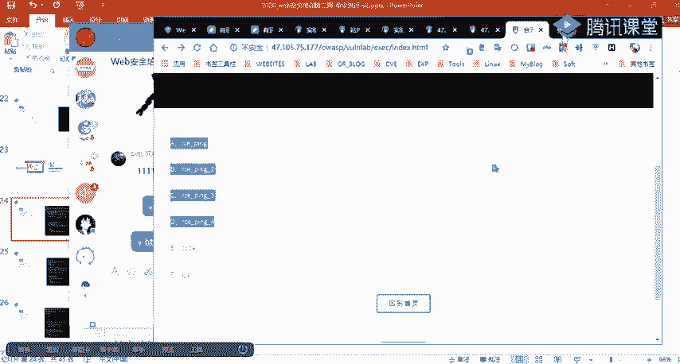

然后这里的话呃我刚刚的话是只讲讲到了用这一个管道符，对吧？然后的话还有其他的一些符号，特殊的一个字符能够去进行一个命令的一个拼接。然后我们呃依次来做一个演示。

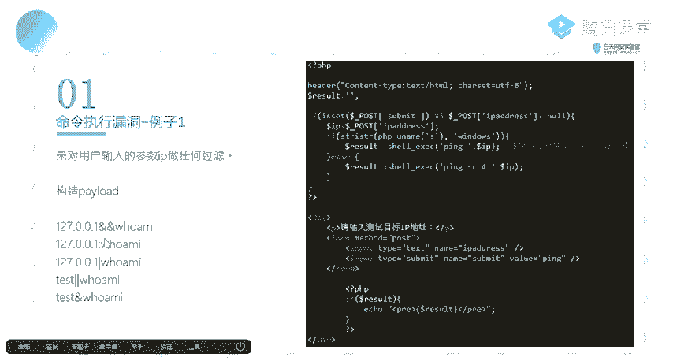

首先第一个的话就是这一个and and for。😊，Okay。Okay。Okay。嗯。哦，不是这个搞错了。是。这个。Okay。No。Okay。好的话就是这个end and方。呃，这个。这个是叫N的吗？

还是叫那个叫啥？反正就是这样子的一个符号。这个符号的话，我们同样的可以跟前面的一个啊类似，能够去进行一个命令的一个拼接。就在后面拼接我们的一个命令。来进行一个执行。

Pso可以看到他这里的话输出了一个拼的一个命令的一个结果，以及我们啊。它临接符后面的一个命令的一个执行结果。哦，还有其他的这样子的一些字符，这里的话我就不一一的一个尝试了。

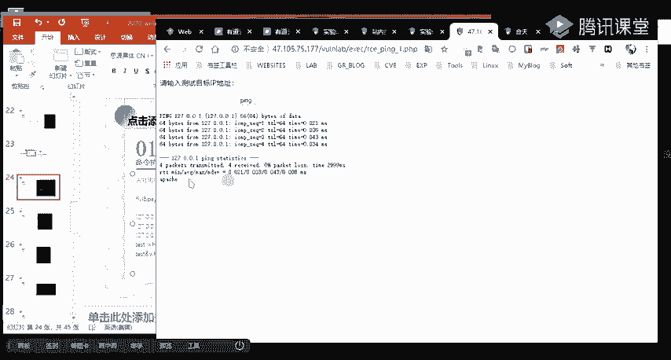

Yeah。啊你个诶。大家可以也可以直接在我们的一个就其实嗯可以直接在一个lininux系统里面去进行一个尝试。就其实就是啊我这里这里的这一张图片，其实就是啊列举了这样子的一些特殊字符它的一个啊效果。

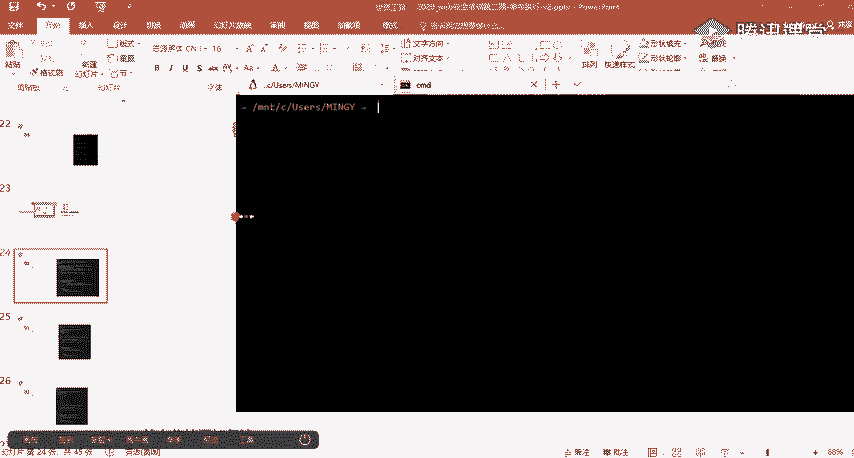

好的话，我们继续。

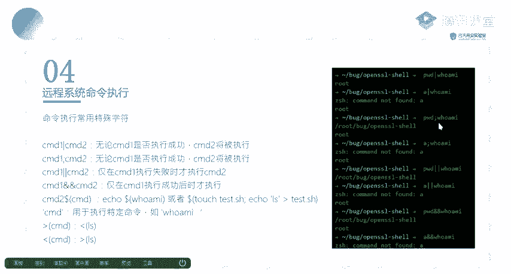

这的话是第一个例子。第二个的话就是呃。

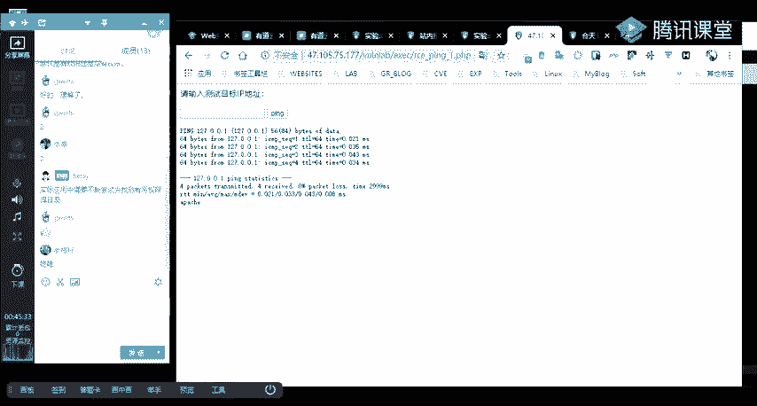

我们同样的。呃，我这样的话我就不做一个测试了，我只对呃我直接通过代码来去进行一个讲解。啊，前面的话这里的一个代码的话呃，大家应该理解了吧，就就是他没有对我们的一个呃传入的一个数据做一个处理。

然后直接的话带入到了这样子的一个呃执行系统命令这样的一个函数去进行一个执行。然后的话执行系统命令的话，我们就可以通过这样子的一些特殊字符，对吧？来去连接啊，我们的一个命令。

执行我们想要的想要服务端执行的一个额外的一个命令。Okay。然后这里的话我们看一下这一个代码，这里的一个代码跟前面的一个不同之处的话，就在于就是我这里的话设置了这样子的一个黑名单。

就这一个blacklist。这里的一个黑名单的话，其实跟我们前面的一个文件上传的话也是啊类似的。就这里的话。🤧我们可以看到这里的话是有一个数组，这个数组的话里面。呃，存储了这样这样子的。而。

这个数组它里面定义的话就是把我们的这里的一个呃end符号，把它给替换为空。然后这里实际的一个替换的话，替换的一个操作的话，就是这这里的一个strberry pace。我们的一个嗯。

替换我们的指店字符串的你呃，哎，这个应该讲了吧。

Okay。time。Okay。Okay。哎呀。So。就字符串的一个替换的一个函数。就是说这个函数的话，它会呃把我们指定的这样的这个subject。比如说不管它是字符状或者是说数组。

他都会把我们就这里给一定的这一个呃。我们看这一个原形吧，就是这里的给定的这一个字符串或者是数组里面所有的这种元素，它都会被呃。这里的一个repa，就是说我们这里指定的这里的一个啊替换的一个字符。

都会被它进行一个替服啊，不是被它进行一个替换。然后替换的话，这一个str re它需要定义这样子的一个就是一个。啊。规则就说你要匹配什么样的一些字符，然后的话去进行一个替换。在这里的话体现在代码上面的话。

就是我们呃从我们的一个黑名单当中。

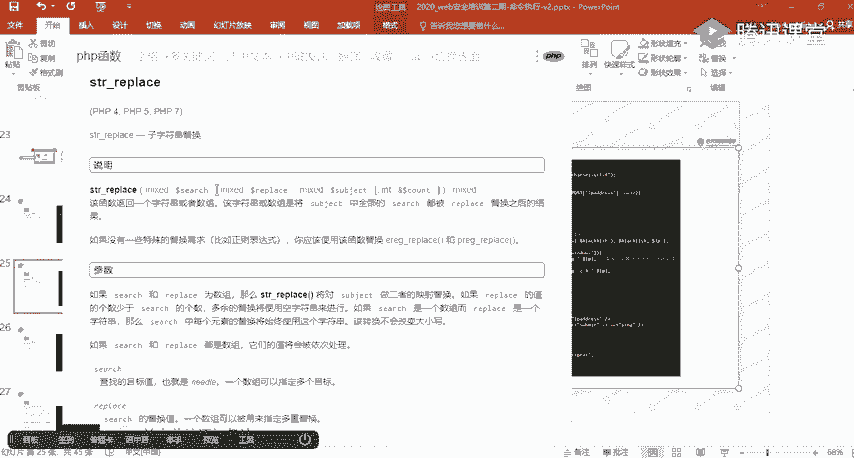

Okay okay。Okay。Okay。就从我们黑名当中取出我们的这样子的一个key。就是我们这里的一个and and还有这里的一个分号，对吧？比如说我们的这里的这两个字符，然后的话呃。And。

再去进行一个呃。进行一个替换我们这里输入的一个呃数据，或者说字符串里面是否有包含有这样子的一个呃黑名单当中定义的这种字符。如果说包含有这种and，还有分号这种字符的话。

它就会呃把它进行一个替换为空的一个操作。这里的话就是呃这里的一个意思。就是呃。概括来说的话，就是移除所有包含在我们这里黑名单当中的一个字符。就是把我们这里的一个字符替换为空。

然后后面的话就是跟前面的一个代码的话是一样的一个意思。这里的话主要的话就是在这里的定了这样的一个黑名单，对吧？啊。然后前面的话我们有说到。

就是我们可以用这样子的一个and还有分号来去作我们作为我们的一个命令的一个连接符，对吧？然后执行我们的一个额外命令。然后的话这里定义了一个黑名单的话，就过滤过滤了我们这样子的两个字符。

但是的话我们其实从前面的一个文件上传他们的一个黑名单的一些规则当中也能够了解到就是说黑名单，它的一个啊这种策略的话，它是有很大的一个缺陷的。因为你黑名单的话。

你不可能把所有的这种特殊的一些字符都能够把它给列进去，然后的话进行一个过滤，对吧？这就是它的一个局限性，所以说的话我们就啊能够寻找。

或者说通过其他的这样的一些特殊字符来去进行一个绕过它的一个黑名单的一个过滤。然后的话我们就可以构造以下这样子的一些payload。我们首先的话来看一下第一个。

第一个的话就是通过这一个and封号and这样子的一个字符。对吧啊，为什么这样子的话能够去进行一个绕过呢？我们从代码里面代码的一个流程来看一下，对吧？我们把我们这样子的一个数据，把它给传到服务端，对吧？

用pos的方式获取到之外，给到这的这里的1个IP的一个变量。あ the way。然后这个IP的话，他会呃给这一个str这一个函数做一个替换替换里面的一个and file有分号，对吧？然后的话。

在这里的呃一个字符的话，它会把我们的这里的一个分号给匹配到，然后的话进行一个替换。替换之后的话就是呃这样子的一个形式。🤧嗯。🤧Yeah。Yeah。

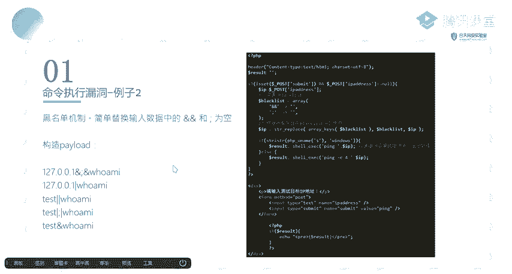

And。🤧。怎卖。然后的话它替换之后的话，就是把我们的这里的一个分号给替换为空，对吧？替换为空之后的话，就是这样子的一个字符。

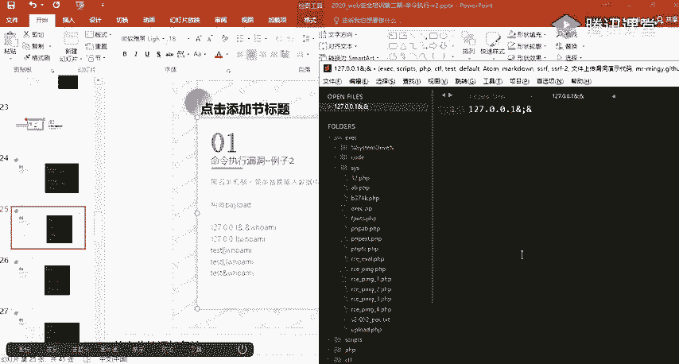

这样子的一个字符串，然后这一个字符串的话。

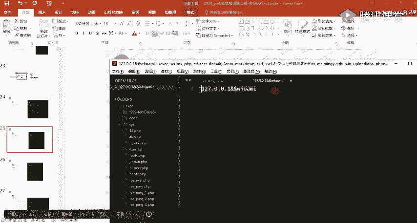

它会继续往下面走啊，继续走到下面的话，它就会执行他会把它带入到这里的一个执行系统命令，对吧？就是pin。

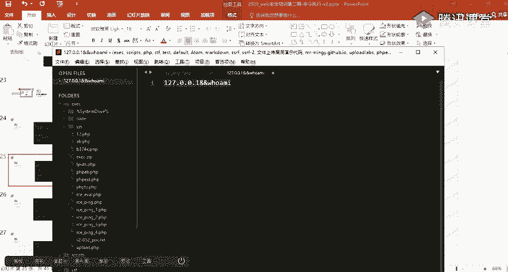

嗯。

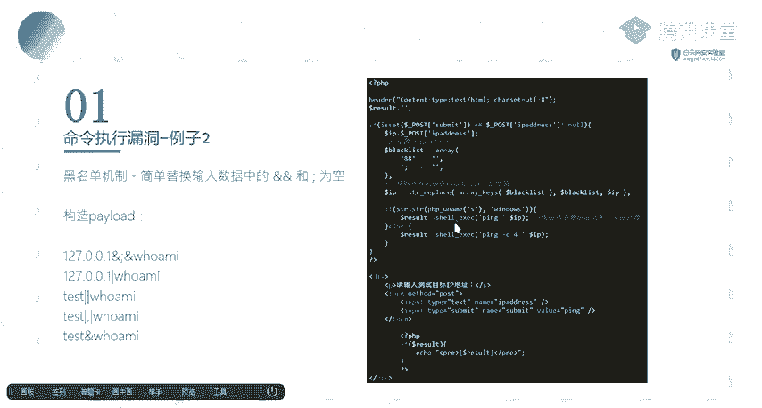

就是pin，然后的话接我们的一个这样的这样的一个字符，对吧？然后其实从这里的话，我们就可以看到我们这里执行之后的话，同样的是能够得到我们的一个结果的。

因为他这里的话，我们虽然把我们的这里的一个分号给替换掉了。然后我们通过它的这一个黑名单替换这个分号的一个规则。我们构造这样子的一个。呃，形式它把它替换掉之后的话。

我们就能够我们同样的能够组成这样子的一个end等的的一个形式，同样的能够去执行我们的一个系统的一个命令。Okay。Yeah。Okay。

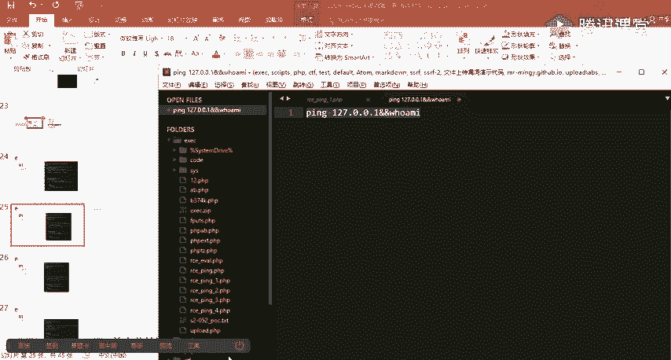

然后这的话。Yeah。可看到这里的话，就是它的一个执行的一个结果。前面是pin，后面的话是执行我们的一个货外卖。然，自然的话我们就可以。人伸呢。

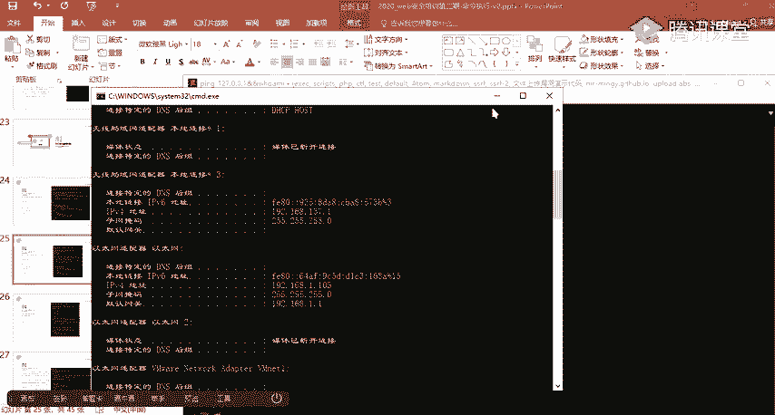

啊，不好意思啊，就可以银伸去构造其他的这样子的一些payload的。对吧还有还有的话它的一个黑名单的话是没有替换权的，就说没有规则，它是不全的。我们还有其他的一些字符。前面我们也说了这种管道服。

还有两个树干的这种。还有的话呃一个人的符号也是可以的。🤧然后的话。还有就是通过这种呃它它的一个替换规则，对吧？我们把这里的一个替换之后的话，能够构造成其他的，能够能够构造成其他的。

同样能够去呃达到呃命令执行的一个连接符的一个呃符号，就构造这样子的一个符号。呃，还有其他的一些，比如说它替换等等嘛，对吧？你可以把等的放在中间，然后的话它把它一替换掉。

这后的话就组合成了这样子的一个呃两个树干。然后的话带到这里执行系统命的话，它同样的能够执行我们的一个外卖的一个命令。这就是这一个例子。Come。然后例子三的话，我们同样的看一下代码。从代码的话。

我们其实也可以观察到。如果说你不看代码的话，你去进行一个测试的话，它你可能会发现我们前面啊我们前面能去使用到的一些特殊的一些字符，它都不能够去进行一个使用了，对吧？然后的话。

他把呃他这里的话跟前面的一个不同，就是它的一个黑名单的话是就是它的一个规则的话变多了，对吧？替换了这种我们的呃两个竖干的，还有呃分号and form，对吧？啊，其他的一些符号呃。他都给他做了一个过滤。

然后这里的话就是它同样的是一个黑名单的一个策略。然后这里的话就是要注意的一个地方的话，就是它这里过滤的话啊，我们进行一个loggo的话，就是这里它过滤的是一个呃竖干后面加一个空格，对吧？

但是的话它没有过滤我们的这样子的一个树干。所以说的话我们可以通过这样子的一个特殊的一个字符来去进行一个rogo。啊，配料的话就是像这样子。这个的话就是呃比较严格的一个黑名单那一个机制。

他把我们能够去进行一个命令拼接的一些字符都给它进行了一个过滤。但的话。黑名单那个局限性就体现在这里，它无法过滤完全。呃，过滤所有的这样子的一些呃制符，这就是它的一个呃缺陷。

也就是我们能够去进行一个利用的一些点。然后第四个的话，这一个例子的话呃。我这边的话就是特意把它给拿出来，就是说这里的话这个例子就是一个呃比较正常，就说没有漏洞的这样子的一个例子。

然后他为什么会没有漏洞呢？漏洞呢？我们从代码来给大家做一个分析。呃，这样的话可能看的话比较小。我这样的话。在编辑器里面去行一个查看。

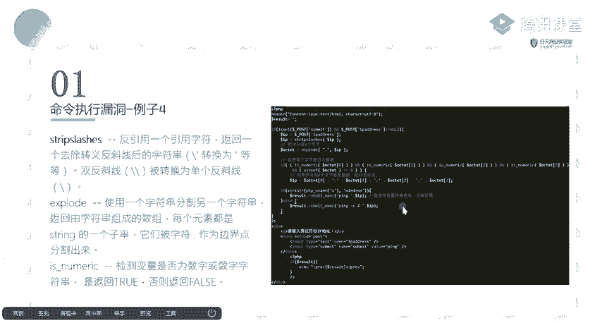

我们同样的呃。

就代码的话，我都有做一个注释啊，就大家在服务器上面呃查看这些代码的话，应该其实也是没有问题的。啊，有做一个注释，就是其实这里的话。呃，主要的话就是给大家过一下流程，就是说。啊，以这一个例子。

我们如何通过就是比较呃好的一个代码的一个呃书写的一个方式来去。呃，防御这样子的一个命令执行的一个漏洞。当然的话是只限于这样的一个例子。那我们可以从头的话来过一下啊。

前面的话就是同样的就是接收我们的一个传递的一个数据，对吧？通过pos的方式给到这样子的1个IP变量。然后的话传到了这里的一个tripe这样的一个函数。这个函数的话。呃，调用这样子一个函数。

对我们所传入的1个IP啊，这里的一个字符做一个处理。然后的话这里的一个striep。呃，这一个函数的话，它的一个意思就是呃反引用一个引用字符，然后的话返回一个去除就是转移返斜信后的一个字符上就转移转移。

大家能够理解吗？就是说这里的一个反斜盖，就是我们的一个转移的一个字符。然后的话如果碰到这样子的一个字符的话，它就会。把它给替换呃，就是反转移反引用，把它给呃。反引用为这样子的一个原来的一个字符。

就说你原来是所传递的是这样子的一个有带有一个转移符号的一个字符，它会把它给转化成啊它一个转转移符给去除的这样的一个原始的一个字符。这就是它的一个函数的一个意思。

然后的话他做了这样子的一个转移的一个处理之后的话，它会带到这样子的一个函数。这个explode。这个export函数的话就是以我们这里的一个字符。

在这里的话就是以点这一个字符来对我们的一个数据做一个分割。哦，分割的话，它是以点为一个分割。因为我们知道我们的1个IP的话是一个顶分实进制，对吧？顶分十进制的一个形式。比如说。

这样子的127顶0顶0顶1对吧？它是你点做一个分隔的。然后的话他在这里的话，他把我们的1个IP以我们的一个点字符做一个分隔，把它分隔成了四个字节。

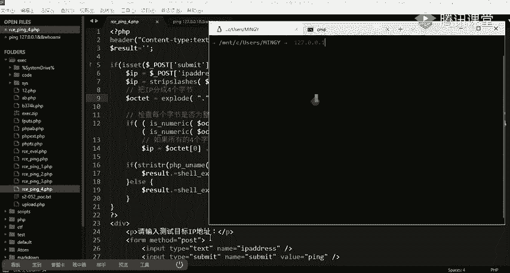

对吧就是四个部分。然的话在把它带把我们的每一个部分都做了一个警察，就是说使用的这一个eomic这样的一个函数。这个函数的话就是警察，你的这里的一个啊。呃，这里的一个。数据它是否是一个整数。

就是判断它是否是一个整数的一个类型。因为我们的1个IP它是顶分十进制，对吧？我们所传递的这样子的一个呃，就是说正常的1个IP它分开之后的话，它都是以一个整数的一个形式存在的对吧？

然这样的话他就把我们的啊分开之后，就说以点分隔之后的这样子的四个部分都做了一个判断，判断你的这这一些数据它是否是一个整数，就是判判断它是否是1个IP对吧？然后判断完完毕之后的话，如果是都是整数的话。

就说明能它是1个IP地址，对吧？

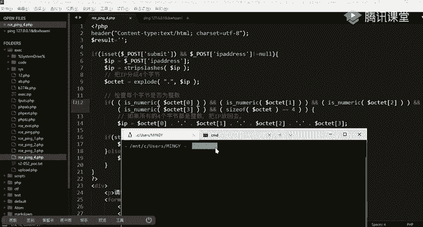

然后的话再对他做一个呃就是一个拼接。拼接成1个IP。然后拼接成IP的话，下面的话就是呃执行我们就是调用我们的一个系统命令去进行一个执行，对吧？然后啊为什么通过这样子的一个。代码的一个过滤操作的话。

就能够去啊。就防御我们的这样子的一个命令执行漏洞呢。在这里的话，我们。啊。以这一个配肉的为例。呃，嗯就以这一个吧。对吧就以这一个我们。像我们的。在这里传递我们的唉。

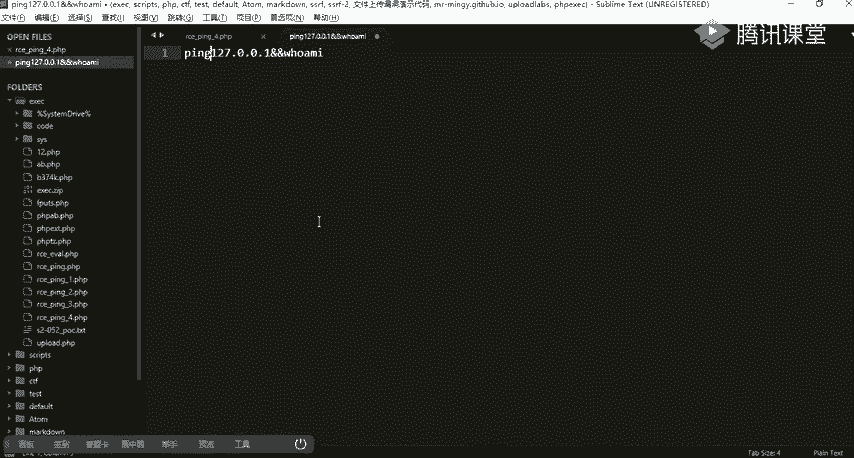

输入我们的这样子的一个直线命令的一个语句，对吧？然后他输入之后的话，它就会给到我们的这里的一个代码。给到之后的话，它会呃首先对我们的一些转移字符做一个处理，对吧？我这里话是没有的。

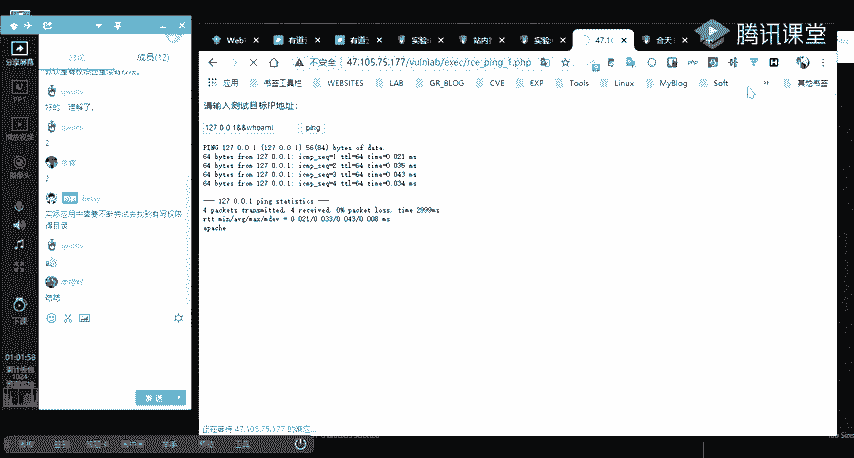

然后处理之后的话，它就会把我们的1个IP分成4个字集。然后他分的话会是这样分你一个点。就是。嗯。Right。Okay。以我们的一个点的这个字符来进行一个分隔，分隔成四个部分，对吧？就是这四个部分。

12344个部分。然后的话再对我们的这四个部分，四个字节做一个整数，是否是一个整数的一个判断，对吧？然后他在判断的时候的话，发现前面三个都是正常的对吧？它是一个整数。

但是我们后面我们的一个拼接了我们的一个2意的一个字符啊，就是2意的一些命令，对吧？所以说它在进行最后的一个字节的一个判断的时候，可以看到它明显的是包含有这种字符的，就是说它不是一个整数类型。

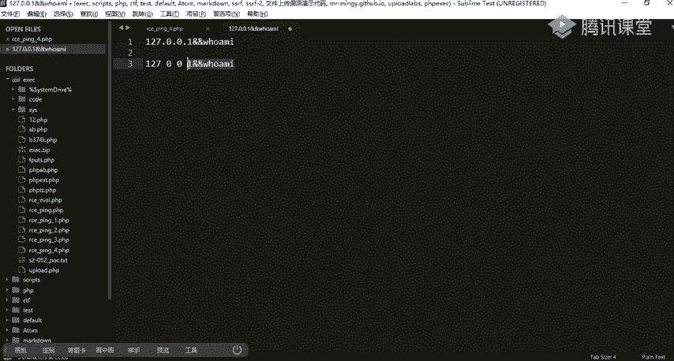

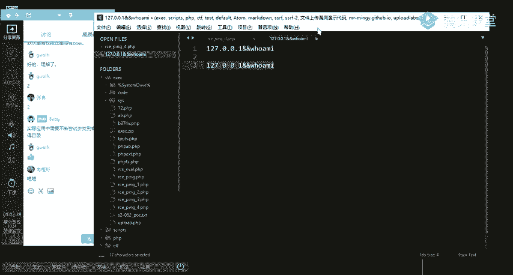

所以说的话他在这里去进一个判断的时候，他就不会。🤧啊，就是。

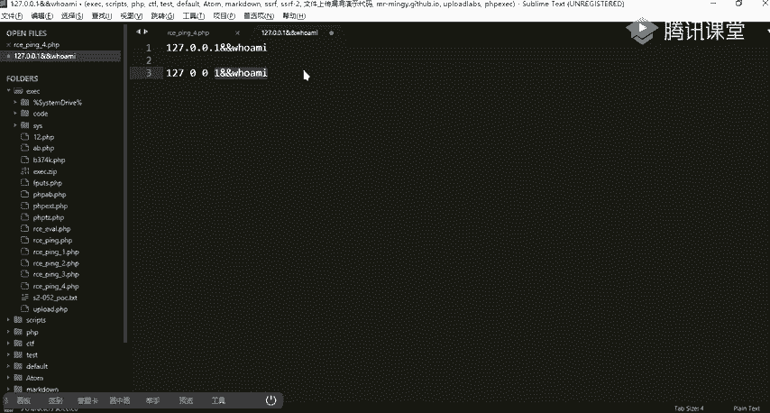

就在这里判断的时候，他就会啊能够判断出我们这里传递的这样的一个呃字符，它不是1个IP地址。然后的话他就不会去代入到下面的一个呃命令执行的一个步骤。P。然后的话呃我们前面的其他的就其实这里的一个例子的话。

就是几乎呃比较。呃，合理的比较完美的就是把我们的这里的一个命令之前的一个漏洞进行了一个防御。这里的话大家能理解吗？就说这一些这里的一个代码。🤧嗯。😊，啊，有问题的扣一，没问题的扣2。P。🤧P。

这里的话不是一个白名单。他是通过代码对吧？我们首先的话因为。

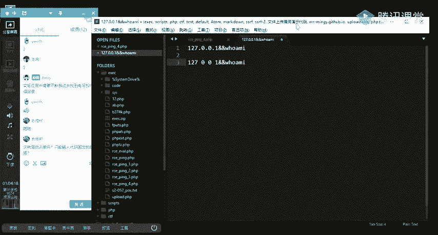

嗯。😊，喂。我们首先的话我们先看一下这里的这样的一个页面，对吧？这里的一个页面，我们假设它就是一个呃。就是。嗯。就是通过这样子的一个啊功能点来去检测指定的1个IP它是否存活去去调用一个片面，对吧？

这样子的一个功能点，然后这里的一个功能点的话，我们在这里的话正常的一个方式是输入我们的1个IP地址，对吧？就说正常的方式输入一个我们的1个IP地址来去进行一个pin。好同话。

如果说攻击者通过我们之前的一些方法来去进行一个命令的一个拼接。然后在这里拼接的时候的话，它就会在代码里面可以看到它通过这样子的一个方法，把我们的1个IP地址。因为IP地址是一个顶分十进制的一个形式。

大家都知道对吧？就说一个正常的1个IP地址，它都是呃这样子的一个形式。

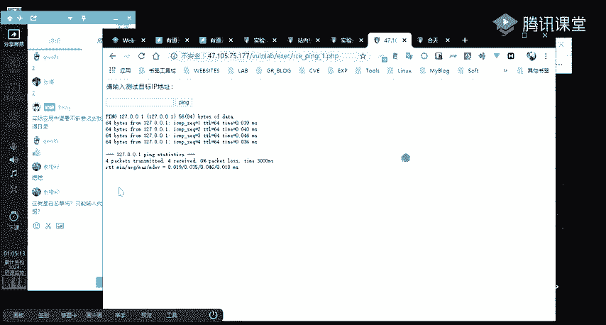

对吧。好的话，如果说你这一这里这个IP地址包含有其他的一些字符的话，那说明你的这这里的话它是不是1个IP地址。如果你不是1个IP地址的话，你就不会让你去执行这样子的一个命令。

因为你的这个功能就是为了去聘这样的1个IP地址，而不是说呃其他的能够去传递其他的一些字符。然后通过这样子的一个方法来去啊过滤掉，或者说来去防御啊攻击者。

通过这种啊通过我们的一些命令拼接的一些字符来呃传递我们其他的一些命令。这句话呃能明白吗？Okay。看看。因为我们这里要去调用，就是说要去执行这样子的一个拼命令的话。呃。

就说要去呃带带入到我们的这里的一个需要干EX一去执行我们的一个拼命令的话，我们首先就需要呃经过前面的这一些警察嘛。如果这里的话这里的一个代码的话，就是把我们的就是首先去判断我们的传入在这里的一个制符。

它是否是一个正常的1个IP地址。如果是正常的话，就呃带入到这里去执行。不正常的话，那说明它是恶意的一个制服，就不允许你去进行一个呃命令的一个执行。好，有问题的扣一，没问题的扣2。

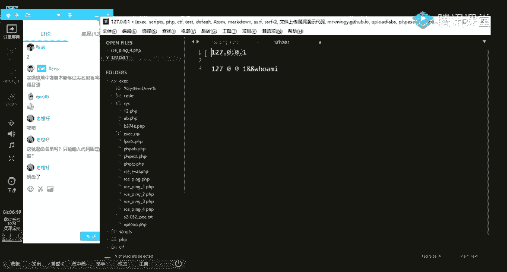

P。

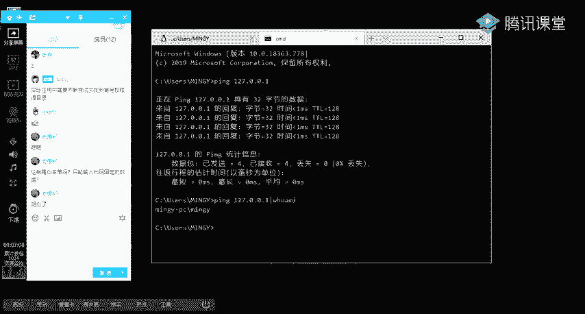

好，都没有问题了。那么我们继续。Okay。呃，前面的话呃，我通过这样子的四个例子，就是说来给大家就是呃。介绍了演示了。呃，通过这样子的一些字符命令拼接的一些字符来去执行我们想要的一些命令，对吧？K。😊。

然后的话我们来看一下。我们通过啊就是说通过这样子的一个命令执行的一个漏洞，我们能够去啊。做一些什么样的一个操作。首先第一个的话，我们可以通过这样子的一个命令执行来反谈一个hell。好，那现有的话。

第一个话就是啊我们。呃，常见的1个NC来反弹需。他的一个命令的话就是像这样子。Com。给。

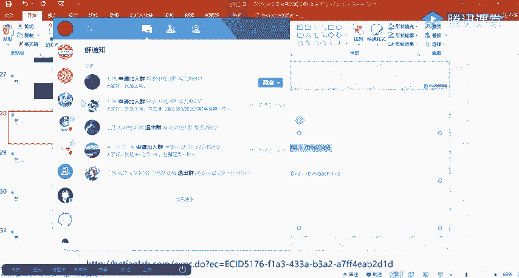

Okay。Yeah。Okay。

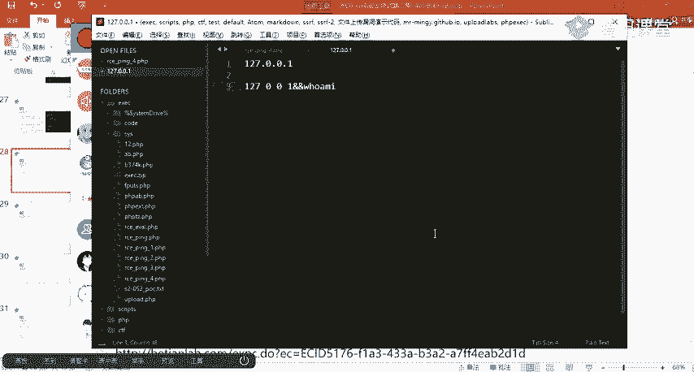

这的话是利用了一个这个NC。

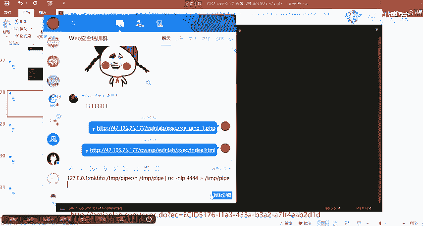

呃，关于这个NC的话呃。大家呃有去使用过吗？或者说了解这一个工具吗？这是一个呃我们常用的一个命令，常用的一个工具。就是n cat。😊，如果大家不了解的话呃。😊，大家百度一下吧。

因为这种工具的话就是一些常见的一些命令，它的一个使用，然后也没有什么太多的一个好讲的。这啊。我们这个NC的话，它它那个功能的话很强啊还是比较强大的。你看到它这里的话可以进行一些端口扫描啊。

就是通过NC啊来去呃。呃，就是探测指定的一个端口，它是否去是否是存活的。还有的话我们可以进行一个一些文件的一个传输。还有呃传输一些目录。呃，还有的话就是我们常用的通过NC来去进行建立这样子的一个连接。

就是呃得到一个hell。我们具体的话以这一个例子来进行一个查看。首先的话你要反弹这样子的一个需要的话，呃，这里执行的一个命令的话是NC杠NLP。是是是，这这里的一个意思的话就是。呃。

他通过NC这一个命令，然后的话在本地今听了1个444的一个端口。喂。然后的话我们。以这一个例子。来去进行一个执行。

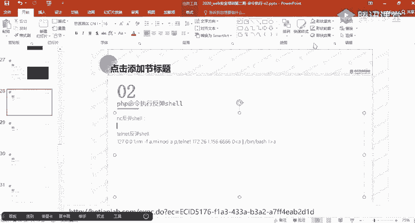

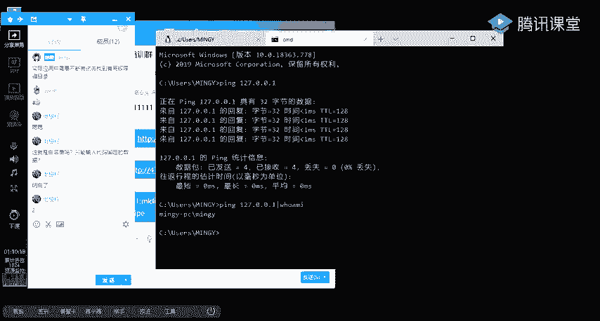

就以这一个例子来去进一个执行，对吧？我们在这里的话，我们通过这一个分号或者说其他的一些符号来去进行一个呃命令的一个拼接。我们可以在后面的话接这样子的一串，主要要更改的一主要就是要去更改的一个地方。

就是我们可以更改其他的一些端口。比如说我这里的话改个1个555的一个端口。然后的话去进行一个执行。🤧执行之后的话。😊，你会可以看到的话，它在这里的话是一直在转的，就说它是有它的一个命令的话。

是今天一个端口，对吧？这个端口的话，它其实是呃在我们的一个服务端，它一直有在倾听的，就是说等待呃。

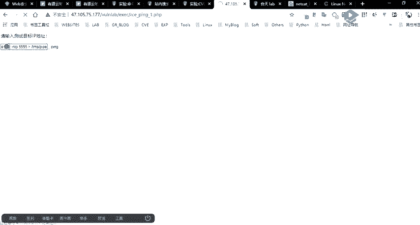

等待一个客户端，或者说等待一个呃就是说等待一个客户端去连接他。然后的话我们可以呃，因为我是在这个服务器上面执行了一个命令，我们可以通过呃。

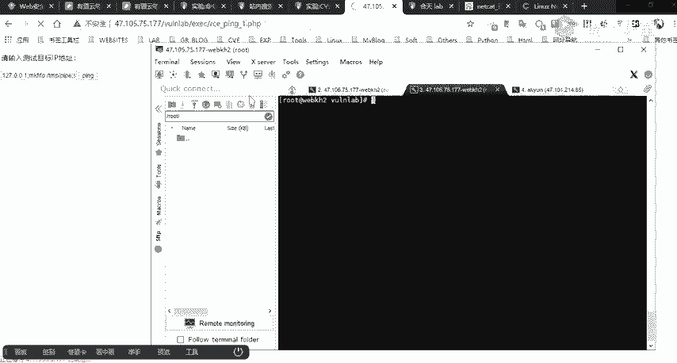

Lets start。这样子的一个命令来查看我们的一个端口。就说我们之前的话是呃执行的一个命令是在这个服务端，对吧？就是说在这个服务端今天1个444的一个端口。

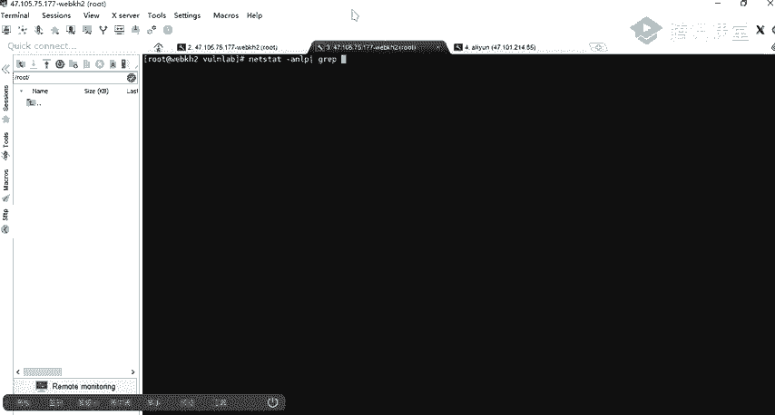

我们这里的话来查看一下这个。好不，不是44455的一个端口，来查看一下它这个端口，它是否有在处于一个leason的一个状态。

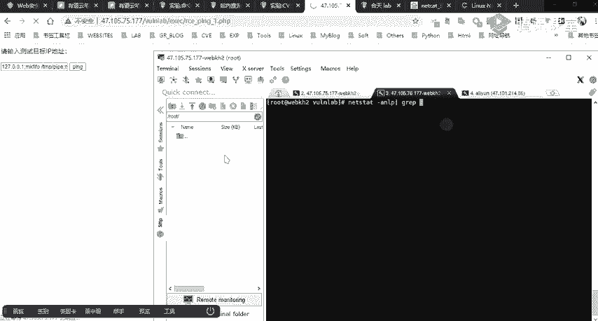

然后这里的话我们可以看到。我们通过这样子的一个let start查看呃，就查看端口的话，可以看到这里它本地的话是有一个55的一个端口，是处于一个listson，也就是处于一个今天的一个状态。

它使用到的一个工具的话，就是这1个NC。这样呢一共一个工具。然后的话他在这里今贴了这样子的一个端口的话，我们怎么去得到一个hell呢？我们。

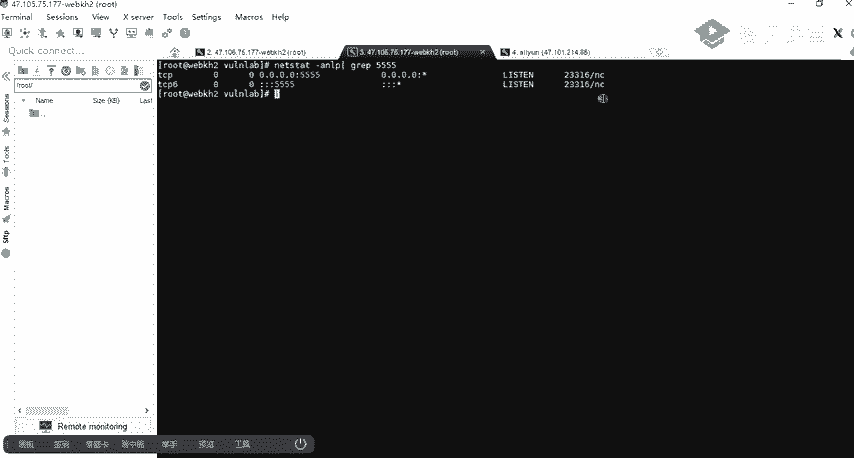

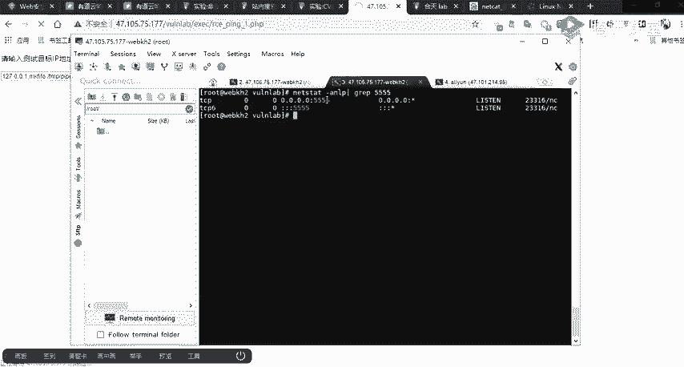

在另外的一个机器啊，这里的话是我们的一个靶机机器，对吧？然后这里的话是我们的一个啊是我另外的一个。购网的一个机器。在这里的话，我可以通过NC。然后的话接我们的这里的一个把机的1个IP47点。105。

575。10177。然的话接啊加我们的就是说它这里今天的一个端口，也就是我们要去连接的这一个服务端，它的一个端口55的一个端口。🤧然的话你可以看到。我今天之后的话，他这里的话有呃返回了这样的一些数据啊。

然后这些数据的话，我们其实可以看到这里的一个数据的话就是我们。嗯。不对啊，是这里啊这里的一个呃目录，这个目录的话是在EXEC。啊，为什么是在这个目录呢？就是说因为我们在这里它执行的话，它执行之后的话。

它的一个当前目录就是在这个目录，对吧？

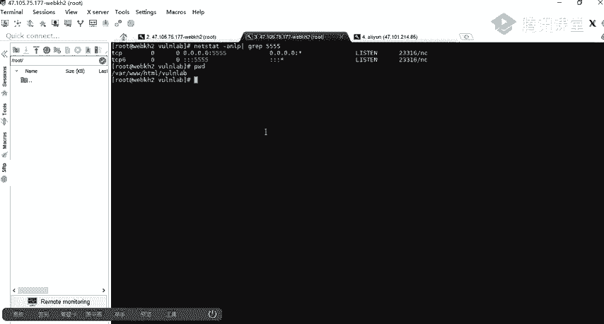

Yeah。

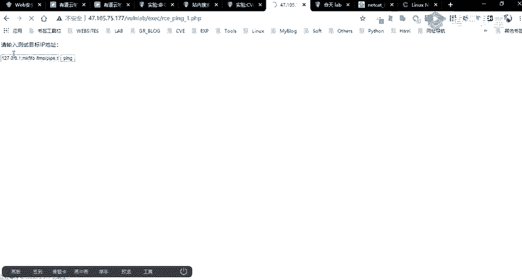

Yeah。切换到这一个目录来查看一下它的一个文件。

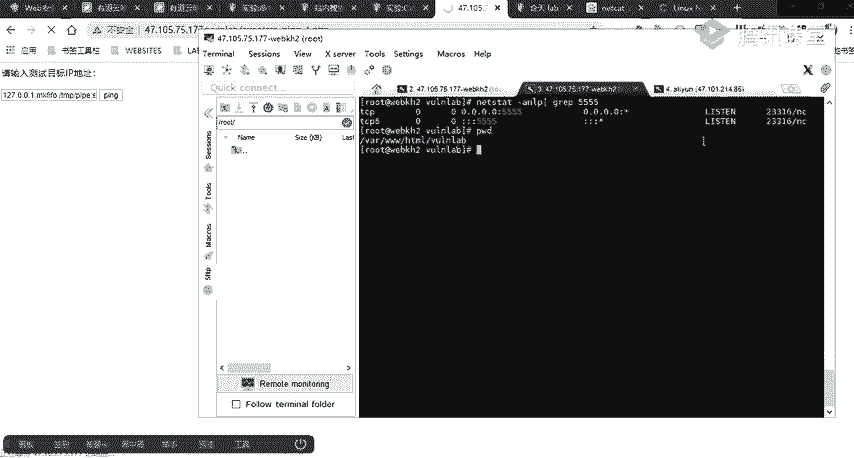

🤧你看呢他这里的。😊，这里NC连接之后的话，它返回的这样的一些啊数据的话就是我们在这里。这个把机上面的一个目录对吧？然后的话我们可以来执行其他的一些命令。🤧And。🤧K。🤧好，这里的话。

🤧我这里就是我这边的话，我把它断掉了，就这个连接一断掉的话，就这边的一个呃。

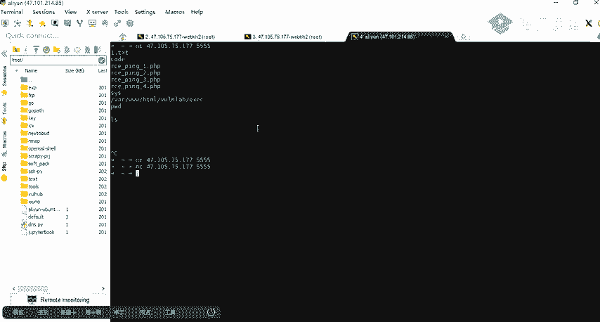

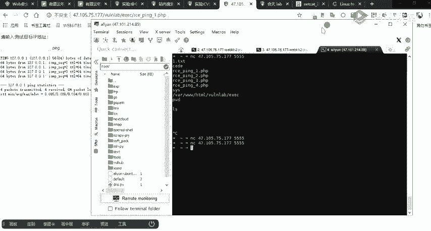

就是这边的一个今听状态的话，就会被啊也会被断掉。我们可以看到当前的话，它是没有这样的一个端口。今天的。然后可以看到这边的话是啊刚刚的话是一直在转的对吧？是一把叉，这边的话是已经就是啊程序已经执行完毕了。

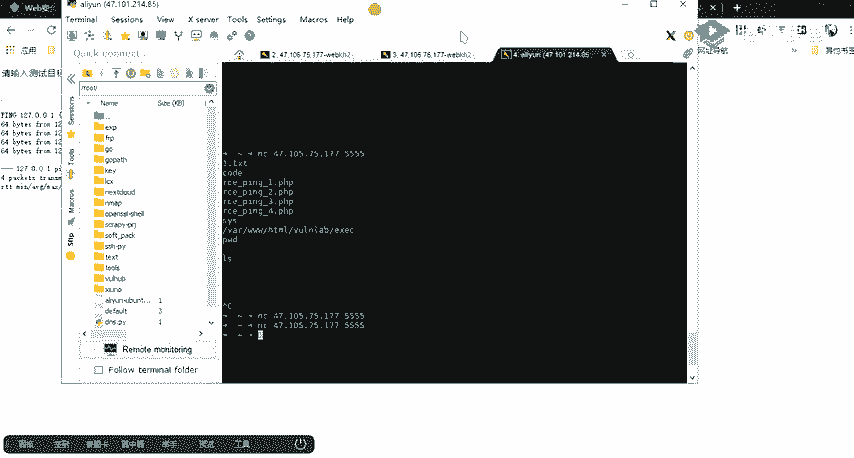

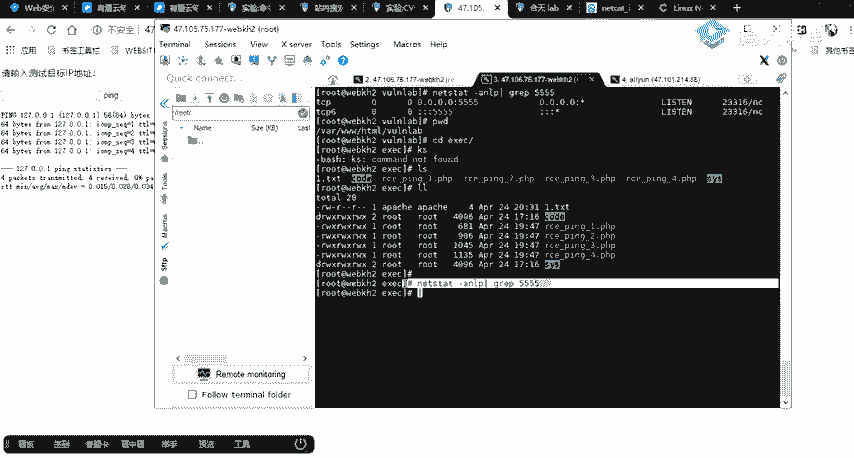

我们。重新来一下。迷年。😔，Com。Oh。这的话我换个44的1个端口。然后执行执行之后的话，它就在我们的一个在这边的一个服务这边的一个服务器上面执行了一个今天端口的一个命令。Okay。Okay。

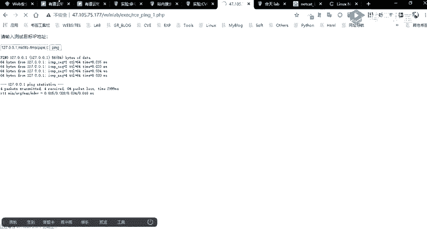

44444的一个端口，对吧？然的话我们在这边的话去进行一个连接。连接绍的话就是这样子的一个状态，你可能看可以你可能觉得这里的话是卡了，其实不是他这里的话是返回了一个需ll，我们可以执行命令。He。😊。

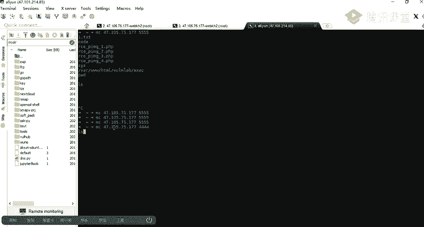

有问题啊。

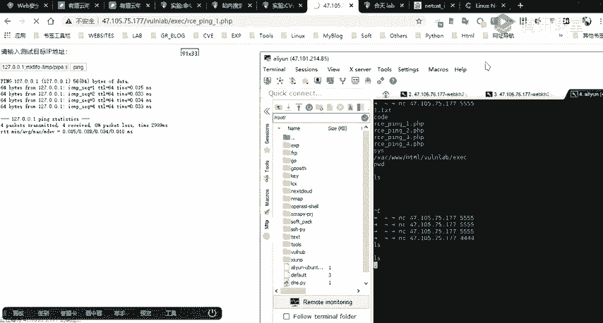

是不是你们在临吗？

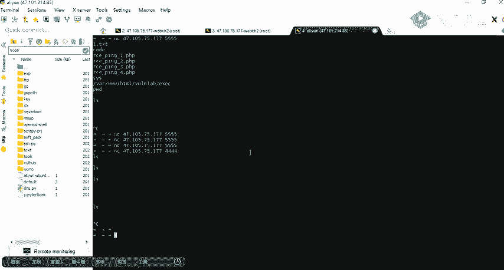

我不使用这个了，我直接在服务端。这边执行这样的一个命令。Okay。Thank。

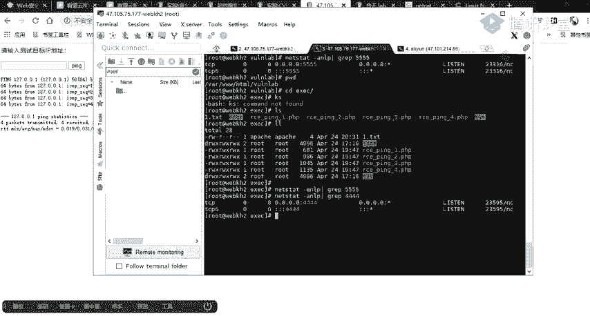

啊，我这边。进行一个凝接。连接之后的话，可以看到它是可以。返回这样子的一个sed。

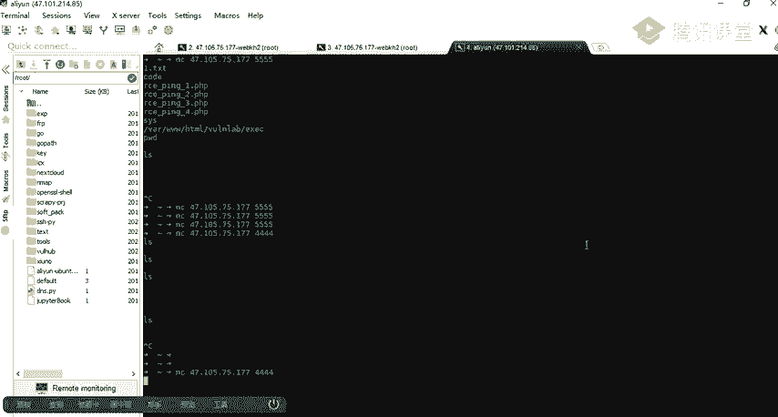

就我们可以在这里去执行一个命令，非答努当前的一个目录，对吧？ID当前的一个呃用户的话是root。因为在这边的话，他执行的话是一个root用户去执行的。Well might。

对吧这就是得到了这样子的一个呃能够执行命令的一个需要。然后这个需要的话，其实跟我们就是大家之前。用的一个用菜刀对吧？用菜刀通过一句话码得到了这样得到了一个虚啊就是啊连接成功之后的话，我们有一个虚拟终端。

对吧？那个虚拟终端的话，其实也是类似的。通过呃我们的一个一句话码建立的一个连接来得到它当前的一个用户的一个终端。就是得到了这样像这样子的一个可以交互式的一个命令终端，对吧？然后呢，这里的话就是1个NC。

然，第二个的话还有就是一个tenet这里的话其实呃也是。这里的话就是利用的这一个tellnet这一个mining。然后这里的一个不同跟上面的一个区别的话，就是在于这边的话。

它是呃用telnet主动去连接指定的1个I指定的1个IP所今天的一个端口。所以说在这边的话，它是一个正向的一个连接。

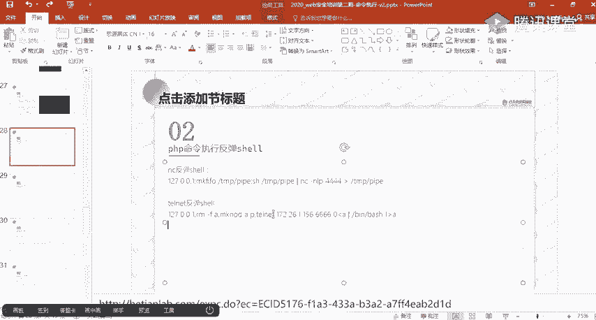

就说我们首先需要在我们本地。用NC来今天这样子的一个端口。啊，今天这样子的一个端口，然后的话呃。我们在在这边。

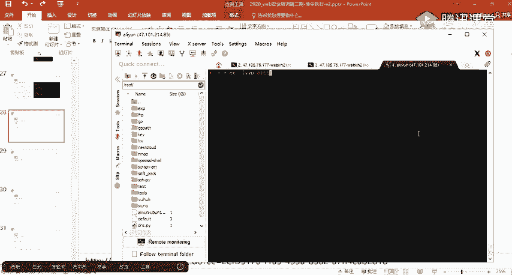

这里的话需要改一下tellnet。连接的1个IP是。

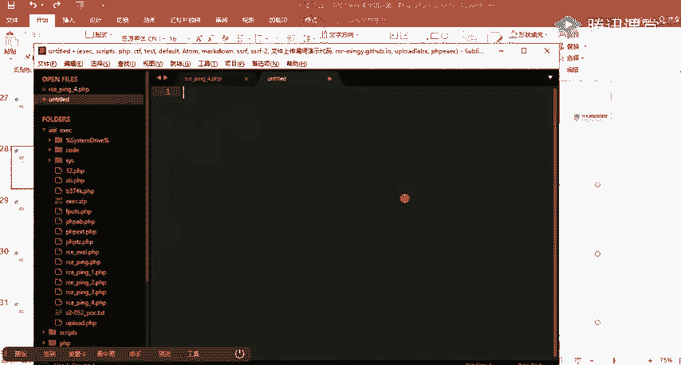

然后连接一个端口的话是666。嗯。😊，然后我在这边去进行一个执行。

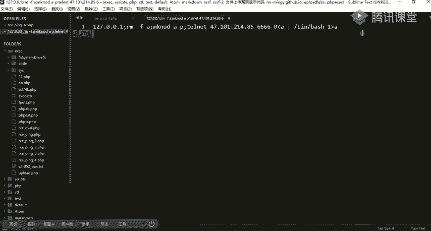

门执行之可以看到的话，他这在这边的话，同样的是一直在转的。

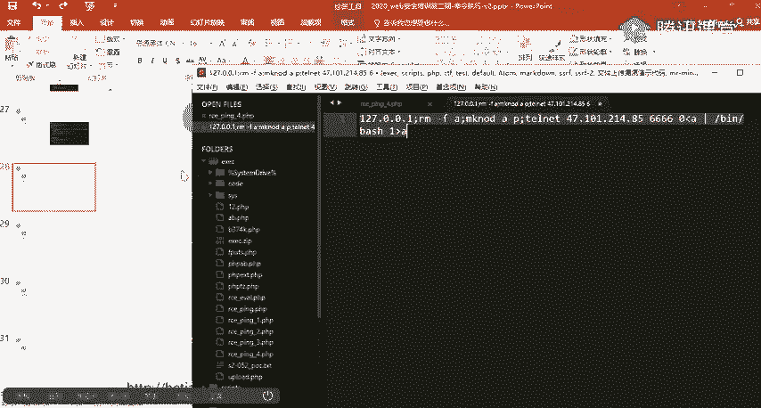

就是说然后的话可以看到在这里的话返回了这样子的一个连接。可以看到这里的话是呃来自于这一个时期这1个IP的一个连接，就是这里的。

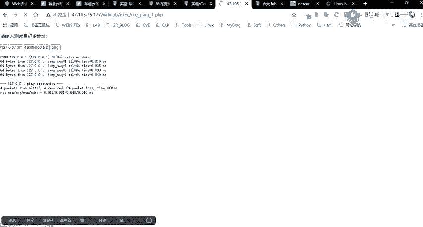

这个呃这个服务器的一个连接，它主动的连接到了我们的这个端口。然后的话。返回了这样子的一个需要，我们可以通过执行命令。通过这个需要执行命令查看呃。可以看到这里的话就是这个呃服务器上面的这样的一些文件。

我们可以就通过了这样子的一个呃tailnet的一个方式反弹回了这样子的一个hell。

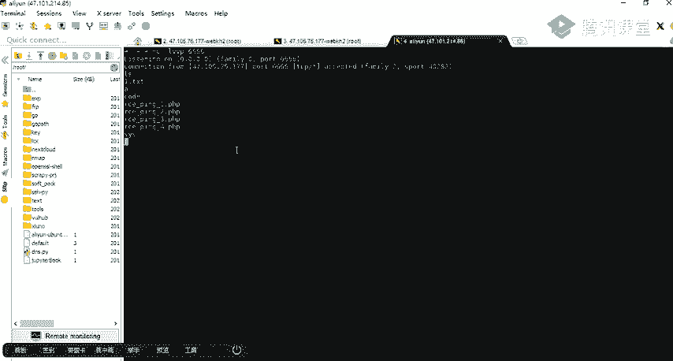

然后其实大家呃也可以去。进行一个连接的。就是呃。就说这一个te呃用这1个NC的一个方式的话，就是说你在这边执行之后，对吧？执行之后的话，它就会呃今天一个端口。然后的话你在本地，或者说你用你在外上面。

你也可以通过NC去进行一个连接。然后这里的话第二个的话，这个tnet的话是主动的去连接一个IP地址。然后因为这里的一个服务端，它是在公网，对吧？然后在公网的话，所以你需要一个公网的1个IP地址。

也就是说能够在被这个公网服务器能够访问到的1个IP然后的话，它才能够找到你。

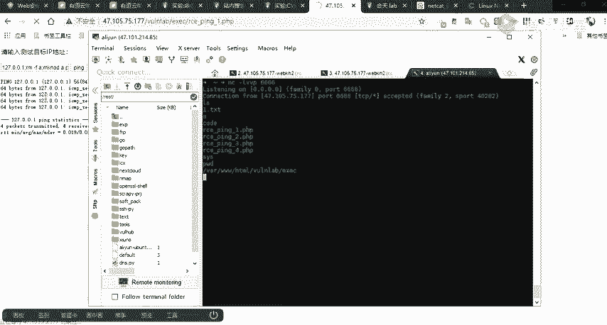

找到指间的这个端口，然后的话去进行一个连接来反弹一个hell给你。哦后哦还有的话就是我们可以通过命令执行来写需要。这样的话我我就不演示了吧。其实呃就通过直接通过A口命令嘛。

因为它能够它允许我们执直接执行命令，对吧？我们直接通过A口来写入我们的这样子的一个一句话就OK了。然后这里的话呃就是下面跟上面的话，就说这里的这个一句话的话是。呃，稍微有一些不一样。

它不一样的一个地方的话，就是我们可以看到上面的话上面的这样的一个呃需要的话有这样子的一个分号，对吧？这样子的一些分号，还有这种单引号。然后的话如果说我们比如说我们上面的那一个黑名单，对吧？就是。

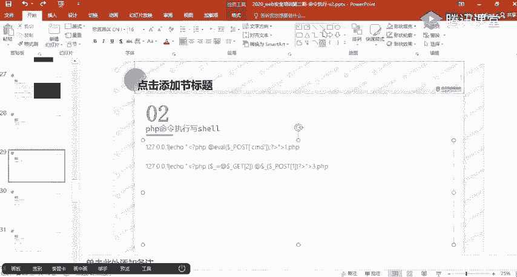

比如说我们这里的第二个这个例子，这里的一个黑名单，对吧？他对我们这里所写的这样的1个PHP的一个一句话。对吧因为我们的1个PHP代码的话，它是以分号做一个结尾的。所以说你在这里的一个黑名单。

它把我们的一个分号替换为空之后的话，我们的写入的一个一句话PHP代码，它是呃解析不了的。就说它无法因为你从因为它是要以一个分号结尾，就是说表示你的这样子的一个代码结束了。

这样子以分号结尾的这样子的一个代码才是一个完整的一个符合PPPHP的一个语法结构的一个代码。然后PP解释器的话，才能够去正确的解析里面的一个啊一句话。所以说我们在这里的话。

我们需要就是说不去使用到这样子的一个分号来上传我们的一个一句话。然后这里的话就是啊可以通过这样子的一个一句话的一个构造。

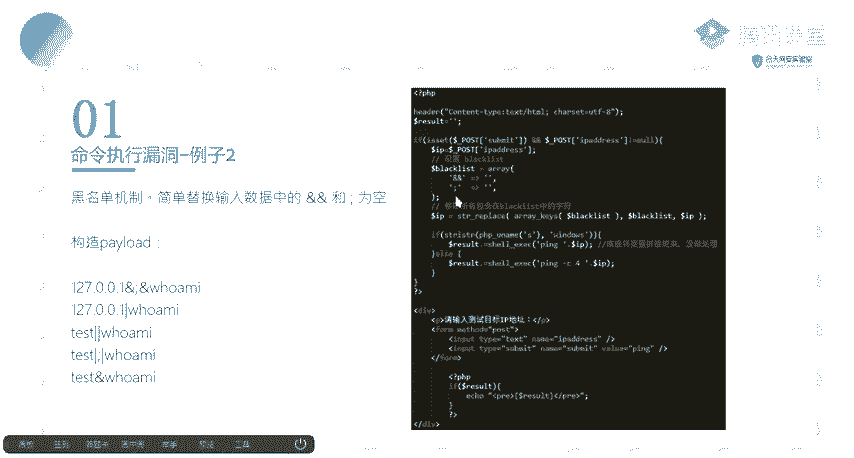

因为里面的话是没有包含有这种分号的，然后的话来绕过那一个黑名单的一个检测。然后它的一个使用的话，其实就类似的，其实它就是一个呃拼接啊，也是就是说一个。通过这样子的一个方法去进行的一个构造。啊。

首先的话我们可以看到就是说在这里。在这里的话，我们通过呃。通过在这里。呃，把我们的一个get用get方式获取2这一个参数所传递的一个值。然后的话付给了这样子的一个呃符号，就说付给了这样子的一个变量。

是这一个树干，大家要注意，就是这里的话是就这个多的伏式表示在PHP里面是表示冰凉。然后付给了这样子的一个下划线的一个变量。然后的话再把它拼接到了这里。听接到这里，然后的话在就在这边的话。

就是跟我们前面的一个一句话是一样的了，对吧？🤧嗯。🤧。然后的话还有就是呃通过PHP来去写项，就是说我们前面的话是写我们的一个一句话，对吧？然后的话我们可以通过呃一句话来写我们的一个小码。

然后的话来上传我们的一个大码，就说如果说你直接通过一个一句话去连接，可能服务端不稳定，对吧？你要执行命令，或者说有相应的一些呃检测的一些手段，对吧？就可能你的一个连接的话会失败。

所以的话我们可以通过这样子的一个命令执行来去写一个呃小码。然后这里的话是通过一个ask的一个兵码。通过一个编码的一个形式来进行的一个呃写入。就是说我们通过这种编码方式的话。

我们代码里面的这种特殊的一些字符，对吧？它可能有做一些过滤。🤧什么的就完全的进行了一个绕过。然后的话就是第二种的话就是通过这个base64的一个变码。就其实前面的话也讲过。就也是类似的。

然后这里的话呃再强调一点，其实前面也也有说过了，就是说在pos的参数当中的话，它是不能出现这种。出现这样子的一些字符的。你就说你在po参数当中，如果出现这样子的一些字符的话，你的这样子的一个请求是呃。

就是说是请求就发送不过去的。它是不会允许你出现有这样子的一些字符，所以说我们就通过这样子的一个base64的一个编码来去除里面特殊的这样的一些字符。因为你b64编码之后的话。

它是像这样子的一些啊数字跟大小写字母的一个组合，对吧？好的话。呃，然后的话就是我们知道就是贝斯64的话呃。他有一个特性，就是嗯比如说。我随便输入一个字符，对吧？他做一个编码，编码之后的话。

它后面的话会有两个。等号这两个等号的话，其实就相当于就是呃。就是你缺的这样的一个位数的话，它就用等号来去进行一个填充。关于具体的一个它的一个编码的一个原点的话，大家可以自己去了解一下。

然后的话我们想要去除这样子的一个等号的话，我们可以通过二次的一个b6兵码，就是说把我们的一个等号呃也可以去进行一个去除。然后的话变成一个呃完完全由这种大小写字母数字组成的一个字符串。这样的话我就不去呃。

前面也操作过了，我就不去进行一个操作了。好了话呃，下面的话我们一起来了解一下，就是命令咨询漏洞的一些防护。🤧。关于防护的话，主要的话就是呃三点。首先第一点的话就是禁用高危的这样的一些系统函数。

就说我们前面呃。大家回想一下，就是说我们前面讲命令执行，我特意就是呃给大家就是介绍了这样子的一些能够导致代码执行，或者是说命令执行的这样的一些函数。就是说这些函数的话，其实它是存在呃危险性的。Okay。

🤧Yeah。然后的话这一些函数的话。我们可以通过呃。禁用它。因为我们如果说代码里面存在有这样子的一些系统函数的话，对吧？如果你没有对它做一个严格的一个过滤，或者说呃程序员在写代码的时候有一些纰漏的话。

就会导致这样子的一个啊命令执行的一个漏洞。唉导致命令执行漏洞的话，这样子的一个漏洞的话，它的一个威胁是相当大的对吧？因为我们直接得到了服务器的一个权限，能够对他进行一些操作嘛，对吧？C。

然的话这里的话就是一些比较危险的一些系统的一个函数。像比如说Hin对吧？我们前面的话啊一直使用这种PH in的一个函数来去测试它是否能够去执行我们的这样子的1个PHP代码。啊。然后还有的话像L啊。

还有这种系统调呃调用系统命令的这样的一些函数等等的一些。前面的话我只是列举了一些，在这边的话呃。啊。比较全的一些就是一些高危的一些系统函数啊，我这边的话就大概列了一些。🤧然后的话。

禁用这样子的一些高位系统函数的话，我们一个禁用的方法呢就是在我们的一个配置文件里面，我们需要修改我们的一个配置文件。然后的话有一个DC波function时的这样子的一个选项。

然后我们在这个选项下后面添加我们禁用的一个函数名就OK了。就说大家再去进行啊。一个安全的一个防护的时候，对吧？或者说。配置啊，做这种安全安全配置的时候。

如果你不想要不用不到这样子的一些呃高危的一些函数的话，我们就可以通过这样子的一个配置来去进行一个禁用。P。Okay。🤧就。🤧Just。就是这样子的一个呃这一行。

然后的话我们在默认的话它是没有添加呃任何的一个函数的。然后的话我们在后面呃添加我们。这样子的一些。Okay。想要它禁用的一些函数，然后的话注意是要以分号做一个结尾。然后你进入之的话。就我们就。

在PH区代码当中，它是无法去就是说我们。诶。比如说我们得到了这样子的一个hell，对吧？我们通过呃wordb应用得到了这样子的一个sll。得到了这样子的一个sll之后的话。

我们想要去执行我们的一个系统命令，对吧？就是说。呃，通过一个虚拟终端。咨行我们的一个需呃系统命令。然后的话你在执行系统命令的时候。

它其实同样的就是啊要去调用我们的这样子的一些调用系统命令的这样的一些函数。然后的话如果我们把这样的一些函数把它给禁用之后的话，你就算得到了它的一个需要迎接。但是的话你还是无法去执行一些系统命令。

比如说查看你当前的一些用户啊，还有查看当前的一些目录啊。Yeah。就是说通过命令去进行一个执行。当然的话如果说你通过菜刀对吧？通过菜刀的话，他不是呃有返回给你一个那个就是文件管理的吗？那些文件什么的话。

是你同样的是能够去进行一个查看的。但是话你是无法去执行一个命令的。如果你无法去执行一些命令的话，那么你只就是说你只能是呃能够查看这样子的一些文件，而无法去做一些其他的一些操作。

比如说我们通过这样子的得到的这样的一个需要去进行一个呃通过。啊，进行一个内网渗透，对吧？如果说你得到了这样的一个服务器，它正好是啊某个公司的一个外网的一个机器。然后的话这一个机器的话，它是放在。

放在官网上的。然后这一个服务机器的话，正好它又能够去跟内网去进行一个通信，能够去访问内网，对吧？那么我们这个时候的话，我们得到这样子的一个机器的一个需要，我们就能够。通过因为它里面的话是这个机器话。

是能够访问到某个公司的一个内网的对吧？那么我们可以通过以这一个机器作为一个跳板机来去访问到内网的一些机器，对吧？Okay。当然话这句的话。呃，是后话。🤧You。第二个的话就是一个严格的一个过滤特殊字符。

就特殊字符话我们前面的话再去进行一个。诶。利用它的一个命令执行漏洞，对吧？我们想要执行我们额外的一些命令的话，我们就需要一些特殊的一些字符。来拼接我们的一个命令，对吧？2，我们。

既然我们需要去使用到攻击者，需要去使用到这样子的一些特殊字符来执行我们额外的一些命令，对吧？那么我们。就可以把这样子的一些特殊字符做一个严格的一个过滤。比如说前面的这种黑名单，虽然它是有一个缺陷的对吧？

🤧完后的话。😊，我们也可以通过。白名单的这样子的一些白名单的这样子的子的一个策略来去印证用户的一个输入。那白名单的话，相比于黑名单，它的一个呃安全性的话是要高的。

但是的话可能你的这样子的一些就是与你一个。这个的话要看你的一个业务的一个需求。因为你一个白名的话，你可能会你的一些需求，你需要到需要去使用到这样子的一些字符的时候。比如说那么的话你就会造成一个误伤。

对吧？然后呃其实最恰当的一个方法的话，其实就是根据你的这样子的一个功能点。对吧比如说我们前面说到的这样子的一个例子。这一个例子3例子4，对吧？我们。这里的一个代码的话就是它根据你的这样子的一个功能点。

它的一个实际的一个呃需求。来。进行一个防御。啊，因为你这里提供的是这样子的一个pin命令的一个功能，对吧？那么你拼的话，你肯定是你肯定是要去，就是说你输入的话，是你要输入一个正常的1个IP地址。

对吧然后的话你才能够是呃执行这样子的一个拼命令，对吧？来去进检测啊目标IP的一个存活啊吧？那么如果你不是一个正常的1个IP地址的话，那么说明的话你的这样子的一个输入的话就是一个恶意的。

或者说是不正确的不合法的这种输入。那么我们就不让你去进行一个执行。这个的话就是说呃针对这样子的一个拼命令的这种功能顶来进行一个代码的一个防御。然后的话如果说你是通过这种白名单，对吧？你通过白名单。

难道你去指定呃某些IP这这样子的话可能会有一些局限性。就是说如果说你只是你只是只希望这样子的一些IP能够去进行一个呃聘命令的一个执行的话，你就可以去使用这样子的一个白名单的一个策略。Okay。嗯。

然后第三个的话就是这个s model。c more的话就是1个PHP的一个安全模式。就就通俗的说的话就是以安全模式来去运行1个PHP。然后这个开启了这样子的一个safe mode的话。

就是我们在同样的是在配置文件里面设置我们的一个safe mode为 on就可以开启它。然后开启之后的话，就是它。我们前面有提到的这样子的一些访问文件系统啊。

还有调用系统执行命令执行的这样的一些函数的功能，它都会被限制。比如说像这种啊执行一些系统命令的。这种命令。Make个电呀 touch。🤧哼。这样子的一些命令他都会被限制。

然后的话还有就是PHP扩展当中的一些函数也会受到影响。Okay。比如说呃前面的有说到的这种。呃，就是那个房反引号。就是反引号，还有像这种需要干念XEC这种函数。

如果说你开启了这个sfemod的一个呃模式的话，就说这种这种能够去执行系统面的这种函数的话，是啊不能够去进行一个使用的。啊，就是在这里说的，就是这种啊操作服标记操作服。就是这种反引号，前面有说到。

就是说在这个反言号里面的这种啊变量的话是能够呃执行里面的一个代码的。And。然后就是在PHP安全模式打开的时候的话，哎，你打开之后的话，这些函数你都不能去使用的话，那么你有些需求的话。

你肯定是无法实现的。所以说的话它就你。想要去使用到这样子的一些函数的话，你你必须要在呃这个safe modeEXECDIR这个选项指定你呃就是指定你目录的这样的一个程序。就说在这一个目录下面的话。

是能够去执行我们的这样子的一些命令的来去调用我们的这样的一些函数的。Okay。🤧Yeah。然的话呃大家对呃。我上面。我前面讲的这一些内容的话，有没有什么疑问呢？哦。讲着讲着又时间都忘了。呃。

就大家对我前面讲的这一些内容的话，有没有什么疑问呢？有问题的话呃，扣个一，没问题的话，扣个。🤧嗯。😊，都没有问题吗？啊，都没有的话，那么呃我把最后的这样的一些东西把它说一下吧。啊。

就是呃面临这些漏洞的一些实验。这样的话我就写了有4个实验。就这四个实验的话，呃，今天不知道大家有没有去自己去尝试做，就说这两个实验呃面临执些漏洞。

还有的话就是这个str to的这种框架的一个漏洞导致的一个命令执行。啊，然后的话呃课后作业的话就是这几个实验吧。啊，还有这个生个PH5啊，还有呃这个inagic命令执行漏洞。

🤧这几个命这几个时间大家在课后的时候去做一下。然后的话呃在。Yeah。下节课就是周日，就这周日的话是呃要上班的。就说在周日的时候，大家要大家注意一下，就是。啊，周日的晚上的话是呃正常上课的。Yeah。

🤧然后的话在周日的时候呃。对，这些就是对这些实验，如果有必要的话，给大家做一个讲解。然后的话呃大家就是在做这些实验的时候做一些笔，建议大家的话做一些笔记啊什么的。然后的话呃我计划的话其实。

我计得话就是在下一节课的时候呃。就是能有同学能够就是说。就不是由我来去讲这一些实验，就希望有同学能够就是分别给对这几个实验。大家就是做完之后啊，有就是你所学到的一些东西啊，还有就是说。

这些实验怎么去完成？那么你从这些实践里面就是呃学习到了哪些知识点，希望大家能够呃分别做一个分享吧。好吧，然后的话如果有我还有的话就是。大家在呃把这个靶机上面的这一些。呃，昨天还有今天讲的这样子的一些呃。

题目大家做一下吧，然后的话可以的话把你的一个过程给记录一下来。啊后诶。就希望大家能够去养成这样子的一个习惯，就是做笔记的一个习惯。就是说呃因为你就其实。

就比如说我吧就比如说我我自己去就去研接一个东西的时候，你可能你刚开始你去呃你研究的话，你就明白了。然后的话你可能你过一会儿你不用的话，你就忘记了。所以说这个时候的话你就通过做笔记的话。

记录这样子的一些东西，就你方便你自己下次的一个查看，对吧？然后的话你这种笔记，你其实也可以就是呃可以把就是把你学到所学到的一些东西啊，记录下来，然后可以啊整理成文章什么的，或者说你可以自己搞个博客。

对吧？然后发到博客上面做一个分享嘛，对吧？K。😊，然后本节课的一个内容的话就到这里结束了。

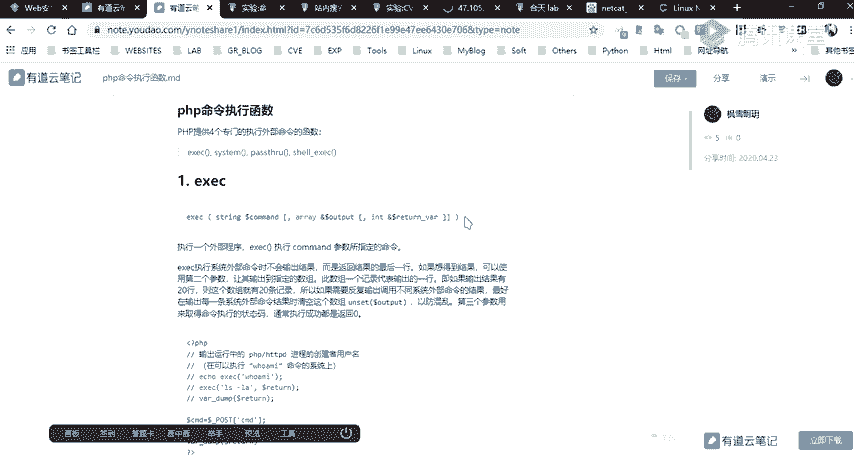

啊。应该没有什么其他的一个问题了。没有什么其他问题的话，那么我们下课吧。然后呃。我要把这些东西啊，我把B我把PPT发到群里，我会。

