# CTF教程：CTF初学者必备的1000个练习题，每日一练，百日成神！（ctf-wbe／ctf-pwn／ctf-misn／ctf-逆向） - P62：简介、类型、攻击方式等，CSRF防御 - 白帽子讲安全 - BV1dp4y1j7aN

🤧嗯哼。喂。😊，有声音。Yeah。嗯。🎼The。🎼1984年。🎼终稼还没收割完。🎼女儿躺在我怀里。🎼睡的那。🎼我天。🎼今晚的露天，电影没时间。🎼去看。🎼妻子提醒我。🎼小修缝纫机。🎼Paer。

🎼明天我要去邻居家，再见。😔，🎼看见。🎼孩子哭了一整天哪。😔，🎼闹着要去。🎼饼干。🎼蓝色的迪卡上衣通往心里。🎼算了。🎼蹲在车膀边上。🎼给了自己。🎼两圈。🎼这是我。🎼不今日记里。🎼的文字。

🎼这是他的青春留下。🎼留下来的散文诗。🎼只是。🎼是。🎼不前意切。🎼想你。🎼的影子。🎼一着就算。🎼就将早已。🎼一首歌完。🎼我的。🎼进去你。🎼离开了。🎼人生。🎼我抓着猫。🎼跑弃了。🎼校园。🎼可是他最近有。

🎼孤单瘦了一。🎼大圈。🎼想一笑而来。🎼好手。🎼Very球。🎼之前。🎼那时的女儿一定会美的。🎼很惊艳。🎼爱他的男。🎼要去看。🎼回家。🎼到这。🎼我却不忍看到。🎼真的是。🎼有些日。🎼这是他的手。🎼留下。

🎼只是。🎼可我能付。🎼已经。🎼想。🎼就抱是。🎼就保持那上面的故事。🎼就是。🎼一杯。嗯。🎼，🎼，🎼Yeah。🎼终究会选个爱自己的人。😔，🎼然后忘掉那个深爱着的人。😔，🎼数起天，全部再期待永恒。😔。

🎼任凭你和日子充满灰尘。🎼然后关上门，打开了另一扇门。嗯。呃，53。🎼看一下这有什么。发生了一个安全事验没有。🎼あ。🎼让我。🎼，🎼The。🎼，🎼パぱ。🎼点起心里火。🎼而心。🎼要销毁努。🎼要过。🎼可惜。

🎼这佛透着么。🎼怎。🎼好。🎼再共你一起。🎼真还是你。🎼丽ly我是你的 girl。🎼Afraid of the big white word。🎼She grew up。

🎼With a her cap so well。🎼Now when did she try to run and。🎼生喜伪念都月色会so afraid。😊，あ。🎼They want her。

 Don't go。🎼This creatures。🎼The dark something can create。えちゃ？🎼Don't you very good。 everywhere。

🎼爸我的毛这着满丽。🎼Everything you can dream in or just let me。🎼比的难。🎼三点吧。🎼えみ？哦，因为我记得我上次好像发现一个有意思的一个预授权漏洞。看一下。

叫什么去喽。啊。当时那个就不管了。开始了今天的一个课程。今天要跟你们讲。把这个关了。啊，有声音吗？有声音的话给我扣个一，好吧。好。今天要给你们讲的是1个CSRF的一个漏洞。呃。

这一个漏洞呢就是在我认为啊是一个比较简单的一个漏洞。也是我们在挖掘SRC的时候。网络断了一下，我刚网络断了一下啊。啊。这个CSF漏洞呢就是在我们SIRC漏洞挖掘里面是一个捡钱的漏洞，看得懂吧。

知道什么叫捡钱的漏洞吗？就是因为它这个CSIF它的一个实现啊，它的一个漏洞很好找，但是呢挖的人又少。所以呢我就可以利用这类的一个减钱漏洞去对我们的SRP进行一个刷版。好，今天就开始跟你们讲CFF漏洞。

首先看一下今天的一个内容。第一个是CSRF漏洞的一个简单介绍。第二个呢就是CSRF1个漏洞的一个利用。第三个呢就是CSRF漏洞的一个寻找。我们来看一下介绍。CFIF呢是叫跨站请求伪造。啊。

要跟你们的一个叉SS区分了呀。叉SS。CSIF。他这里呢他的意思呢就是挟持用户在当前已登录的微博应用程序上执行一个分本意的一个操作的一个攻击方法。这里呢是什么意思呢？待会儿给大家看实例啊。就是。

给大家通过大家从实例里面来看到一个是什么样子的一个攻击。首先我们看一下BFF漏洞的一个成因。第一个就是网上的cookie在浏览器里面不会过期，只要你不关闭浏览器或者退出。

那你只要在访问这个网站都会默认你已即是一个登录的状态。然后呢，这个时候我就可以发一个构造好的CSF脚本，或者含有CSIF脚本的链接。给你进行一个点击。然后呢。

你就会根据我这个攻击脚本里面执行一些你不想执行的一个操作。呃，CSIF的一个简单的操作呢，这里呢。是给你们发了一个预期的一个实验，就是CFF攻击实验。我们这里啊。应该有做预习的吧。

有做预习的就可以先看一下啊，先看一下我们的一个简单一个操作，好吧。

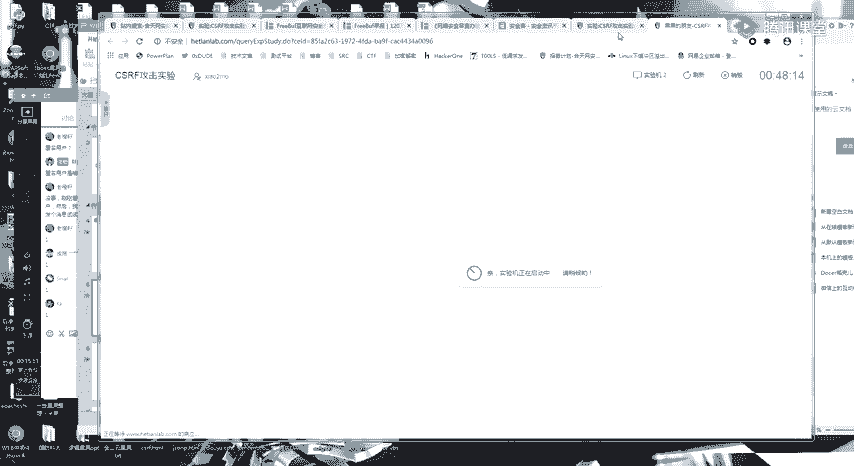

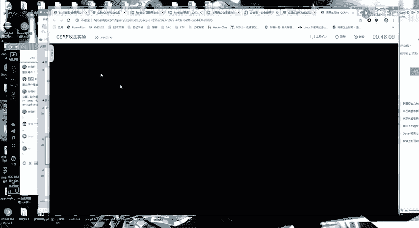

这里呢我们首先啊看他这个实验了，这里是用一个简单的一个账号登录。然后呢，你可以看到这里呢就是一个简单的一个留言的一个功能。他自己因为一个。因为一个啊试验机的一个原因啊。

只能通过我们的F12去看一下它的一个链接。记入选择这个地方啊，它会有一个历史的一个请求。这里呢我们首先来看一下。因为它这里的功能点，大家还记得吧？这里呢就是一个。添加一个内容的一个功能。

注里我首先添加一个功能。你可以看到一个请求。然后呢，在这个地方。你可以看我刚刚添加了t123。然后这个内容123。他的一个请求就是这样子的，对不对？就是我们在执行啊在登录了一个网页之后，然后要执行操作。

都是通过这一个请求来进行一个操作的。然后这里呢的一个。添椒。留言的一个请求就是这个样子。然后我们看一下啊。看一下它的一个。恶意请求网址。好，我们来看一下啊。我们的正常操作是不是这样啊。

我这里登录了一个页面，然后我没有。活动每一个网页，我们要把它关掉。首先你要记住一个点啊，CFIF所有都是进行在我登录了这个页面的一个情况下。然后呢，我又访问了这个链接。然后我们再刷一下。

是不是可以看到这里就多了一个恶意的标题跟一个恶意的内容。那他这个是怎么来的呢？我们看一下这个攻击页面。看到这个位置没有？这里呢有一个A imagine SIRC等于。这个tle等于AE标签。

然后等于OE内容，然后进行一个添加。这里呢就是因为我们刚刚的一个。添加。留言的一个请求。是一个这样的一个样子。然后呢，我这个攻击者在自己的网页上。也添加一个这样的一个请求。然后当别人。在登录的情况下。

访问到我这个恶意的页面。就会执行我这一个页面里面进心构造的一个请求。JFF就是这么一个简单的一个漏洞。我们呃通过这一个CSF的一个模型来看一下什么是CSF。首先第一个。是登录网站A。

这就是我们的一个安全。网站，然后这里呢它就是产生了一个cookie，对吧？cookie之后，cookie因为是在浏览器这里。然后呢，我在这一个误登录出A的情况下访问微险网站B。然后B呢就会发出一个请求。

这是一个A网站的一个请求。然后呢。它这一个A网站就会执行B网站上的这样的一个恶意请求。比如说我这一个人在不知不觉的一个情况下，就执行了一些不想操作的事情。啊，你可能觉得就是像刚刚的，可能没有什么关系啊。

但是你要想啊在以前。就拿现在来说吧，如果你是一个管理员的个用户。或者你是某平台的用户。哦，我是不是有一个注销账号的一些操作，注销账号修改密码，绑定手机这一些都是一些危险的一个操作。

然后再仔细的回顾一下一个过程。登录A，然后产生cookie，然后不登录出A的情况下，访问网站B。然后就是执行这个网站B上面的代码。如果做过这个预习实验的，应该是对。DSF有一个。了解了呀。

就是一个简单的一个了解。那我们今天要学的是什么呢？这个CFF漏洞你理解起来非常简单。😊，那我们今天要学的一个操作是什么呢？我们要学的一个操路就是。如何去构造这1个CFIF的一个利用代码。

然后如何去寻找1个CSRF的一个漏洞利用。啊，理解CSF是什么东西的，你给我扣个一。对。你。What。C。啊，大部分的话应该是理解了呀。然后如果还有呃。如果还不理解的呀。

就是再去做一下我给你们发的这样的一个实验，或者你继续听啊，就是我后面的后面的一个过程会给你们看。首先CFF我先不看它的一个定义啊。它正常的是有一个增删改的一个操作。

另类的CFFjasonPCRS跟fsh快速结石这种文件读取的。我明天会讲我今天的一个重点。就是这样这个。基于增山改操作的1个CSF。呃，首先我们来看一个。操作啊。

首先你要知道CFIF的一个本质就是在不知情的一个情。啊，在一个不知情的一个情况下。执行一个请求。这里呢你要想到一个。是吧请求。我们在哦我们在浏览网页的时候，你们是不是学过几中请求啊？应该还记得吧。ge。

Po。这两种请求是最常见的对吧？当然还有更多的一些其他的一个请求，这里就不说了。进能最多的就是一个get跟一个pose。这个post呢。这个CSF呢也是根据你这一个请求来进行一个划分的。

这里呢用1个DVWA的一个靶场给大家看一下啊。

就是先给大家看一下。DVWA的话呃，因为它这个有点臃肿，我就没有搭在个网上了。

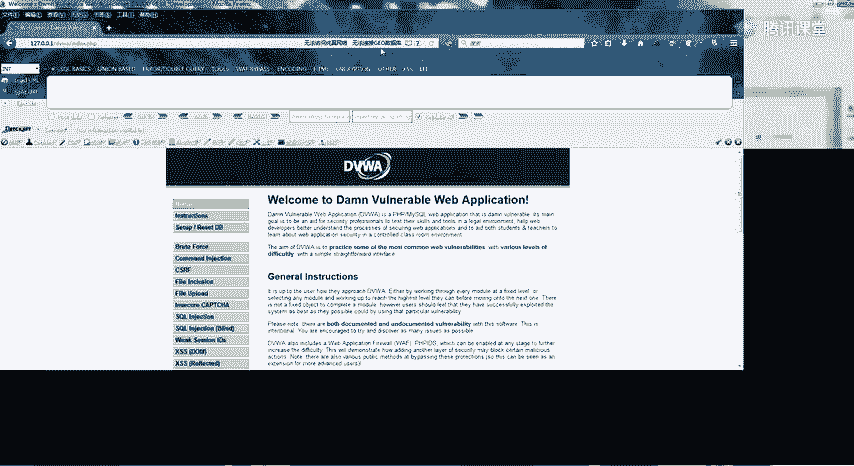

网上的话也是有一有一些那个有一些也有巴场的。正上有一个骑士CMS的1个CSIF。待会儿呢课后我会给你们布置一个特殊的课后作业啊，一个特殊的课后作业，可能跟平常那些课后作业会有一点点不一样。

这里呢我们还是先来看什么是。谢3F。好。这里呢DVW的一个简单靶场是这样的。它这里的CFF呢是一个修改密码的一个操作。我们我这里先随便输一个密码呀，这个命额的命。呃，然后你可以看到。

我修改密码的就是一个这样的一个get请求。这是一个这样的一个简单的一个get请求。那你说这个请求我们是不是可以模拟过来？啊，如果我。是这样。我在我的网页上插入了一个这样的一个链接。What。好吧。

我在如果我在我的网页上插入了一个这样的一个链接。大家觉得会发生什么？这呢是在我一个登录的情况下，你可以看到我这里的密码是改为了adminadmin。然后呢，我把这个页面先把它关掉。

我这里呢我就随便写1个STML。嗯行吧。先关掉吧，随便上。有。我插入一个请求啊，你们首先要看到呀。我这里的1个STDP。它的一个链接。跟我的这个修改密码的这个请求是一模一样的。Right。然后呢。

我就用。这个浏览器那你们还可以看到啊，vi5这个浏览器。访问一下。看一下我们的一个。你代码。看到没有？它这里呢就会加载一个这样的一个请求。我通过F12看啊，这是因为呢我们的imag。的这1个HTML。

你们之前学了一个X，应该是知道的。它这一个呢是会自动加载。然后我。看啊，这还是之前改的的命的命，然后我退出来。再试一下啊。他的命的命。你可以发现。登录不了了对。证民123。

他自己的密码呢就改为了一个addmin123。也就是说执行了我们的刚刚这样的一个请求。因为我修改密码的一个请求是这个样子的。可以看跟这个是对应的。那这里呢你们是不是可以想到一个攻击点呢？

就是我们怎么进行一个攻击。就是首先哦。这举个简单的例子。我就拿和天为例啊。你们有登录了和天的吗？有登录了和天玩实验室的吗？登录的给我扣个一。一个都没登吗？呃，这个因为无所谓啊，这个位置。这个位置无所谓。

因为影响不大，就比如说我呃CSF修改性别。嗯你这像这种东西。所以我们的一个攻击场景呢，就是我在登录的一个情况下。我发啊，我就给你们发1个STML的一个代码。呃，为了逼真一点，我就发个网站吧，好吧。

我掉我服务器上面去看一下。啊，你们可以。地址修改还是到哪个地方去了？What。还是同样的是一个请求。修了修了修了，你可以看到。他这他这个位置已经加了token了，但是我把token删掉，我再试一下啊。

违法操作。他这里已经修复了。那我就再找一下啊。修改学号。修改序号这里，我这里呢就改我看一下能不能改特殊的字符啊，可以加。뭐。嗯，这里的话。自动加载吗？我在想。嗯。Yeah。然后网址。啊。

我这里呢就给你们发个链接。据说啊你要在登录和田网上实验室的一个情况下。然后你们呢去。访问一下这个链接。应该还记得吧，我这里的学号直接3456，然后我再切回来。就是因为我访问了刚刚这一个链接。

我记得学号它就进行了一个改变。对吧。所以说啊假如说假设。假设你这里比如说你有一个。你重新刷一下，你登录了吗？肯定是可以改的。其他信息这个学号这里。假如说呀假设我这个请求是修改密码的请求。

然后你点了我这个链接的话，是不是有可能可以把密码修改了？当然这里是不行的呀。晚安实验室对于重要的影响大的功能全部都是做了验证的呀。所以我们的一个攻击场景就很容易解决了，就是很容易知道怎么弄的。

这里呢首先。看一下我的刚刚的一个。唉，学号无所谓了，这个无所谓的。这个无所谓了。啊。首先我们要有一个。首先你看一下我的一个工具的一个。构造过程啊，首先我是不是通过一个抓包？通过一个抓包。知道这个请求。

然后呢。构造这个请求的。天没有。然后再给用户进行一个打开。

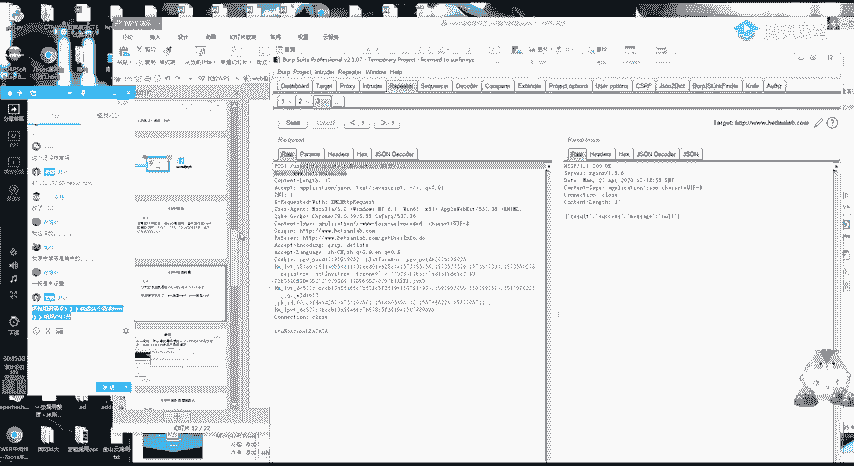

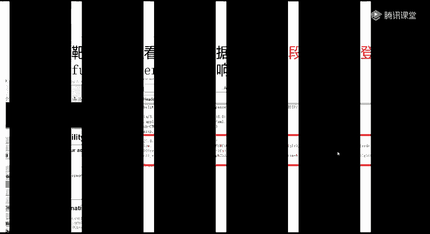

你可以看。那我为什么啊，首先其实你们刚刚可以看到，为什么我一眼就能看出来。哪些地方有1个CSIF呢？哪些地方没有。这里呢下一节跟你说，待会儿跟你说，好吧。这里我们先来看一下我刚刚的一个构造的一个利用。

首先第一个让你们加载页面的位置，它的一个标签如果是个get请求的，我们刚刚的1个DVWA这里。是不是就是有一个imag的一个标签？

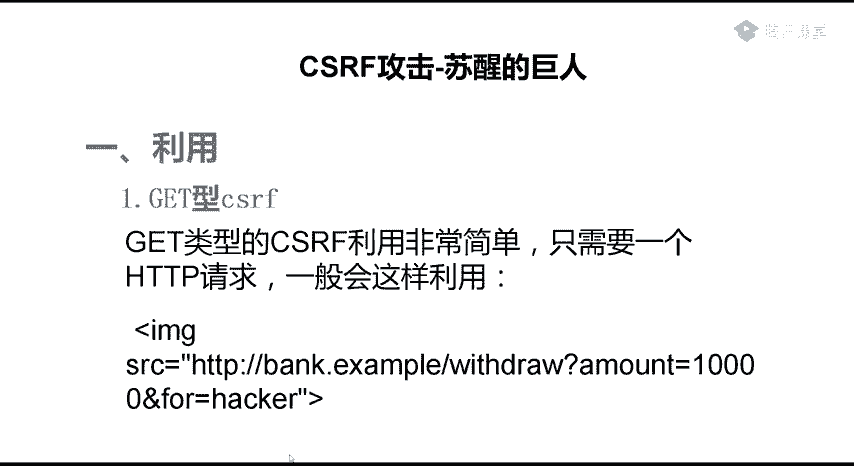

imagineARC等于这个。呃，我发到群里啊。首先这是get的。这一个链接呢就是我们的一个请求，你想要执行的一个请求，这一点应该明白吧。然后第二点呢，这个也很简单，是一个poss类型的。

就例如刚刚我们的这个请求，这个post类型的。这个3W和天。在这个位置。

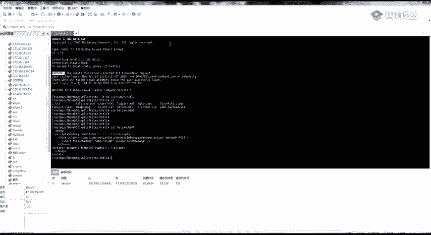

这里呢是我们的一个请求。位置。这里就要对应，然后这一个posts。这呢就是一个参数。然后这里呢是参数的值对应的这个地方。这个里呢就是自动一个啊自动提交表单，这个不用改，你改自己就可以了。What。

也就是说你照着这个模板去进行一个更改，这应该会改吧，应该还是比较简单的。

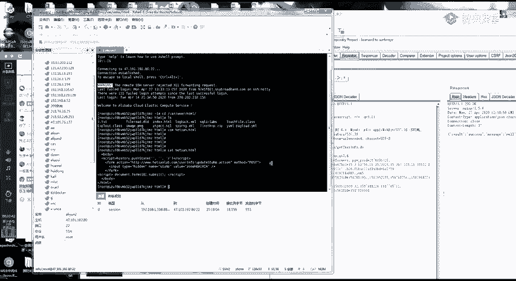

看一下他的一个简单利用。这里呢是之前的一个。这是之前的1个CFIF啊的一个实例。网上实验室的。这个地址的信息的这个位置。当然这里呢是有token，这是没有的。我正常先是抓到了这个请求的一个包。

然后构造了一个这样的一个请求。构造了一个这样的一个需球。待会儿呢我会给你们看一些案例啊，就是下完课之后。实际来里啊。然后让别人点击这一个。连接它就执行了。那我是怎么发现这一个数据包就有1个CFIF的？

首先我们要来看一个，首先我们要分析请求呀，就是要知道分析数据包。我记得我是跟你们说过的。挖洞全靠分析数据包。啊，首先第一个点。你首先看这个请求啊，我拉一个没有。没有。😔，就到这个包吧。等一下位置啊。

这一个包呢是没有CFF的一个包。这个包呢是有CFF的一个包。你们可以看出这两个的一个区别吗？这两个包的一个区别。对，token。这里呢还有一个。对应的1个ID。这两个数值是没有办法获取得到的。

然后我有CFF的包，就是所有的参数我都可以得到。然后我这一个包你可以看到我把所有的都删掉都无所谓。诶。这个不能删这个不能删。还哎。tablele啊，这个可以。这里呢就是我这个参数呢是。自己可以得到的。

我这里唯一的区别就是我这个token我没办法得到。那你想啊，如果我这个所有的参数都可以自己得到，那我是不是我就可以。伪造一个请求。就是请求可以伪造。CFF的漏洞就在于这里，我这个数据包可不可以伪造？

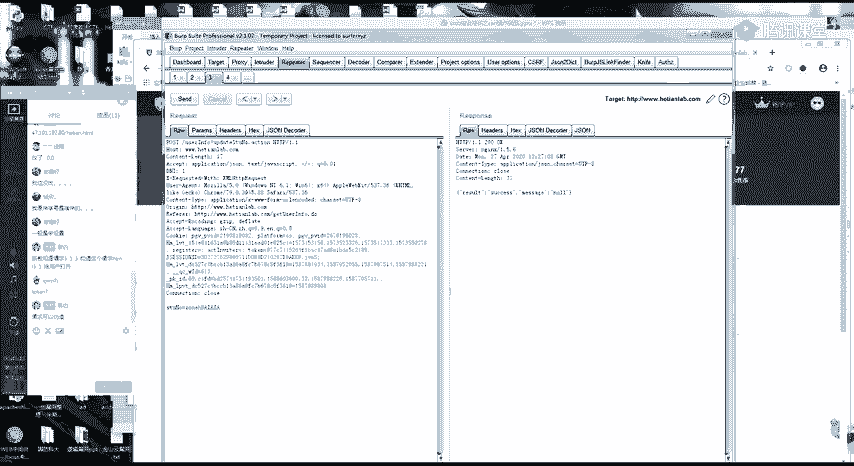

而且你可能会觉得麻烦。其实你要检查的参数。

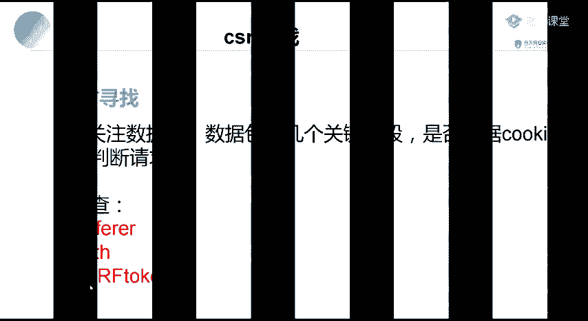

基本上只有这三个的样子，只有这三个，没有什么其他的一个特别的一个点了。这里呢还是同样的。给你们看一个真实的一个数据包进行一个分析，好吧。啊。最近呢刚好在弄那一个。VP方效有一个东西啊。

昨天我登了个账号给你们看。首先你要判断一个东西啊。我浏览器是怎么识别你的身份的？啊，你可以看到。这一个呢这就是VIBki的这个包。首先我要判断浏览器是怎么，他们这个包是怎么识别我的身份的。

首先第一个点是不是通过cookie来判断的，我把cookie删掉。411什么什么是么？什么鬼，他把我给ban了吗？首先我要来看。就是我这一个整个数据包。除了cookie之外。

还有没有其他数据是来判断我的身份的，还有没有其他的字端？首先这些正常的字段。都是无所谓的。这些正常的一些这些正常的字段啊。然后要注意的就有这一个。这一个参数。加上这一个。看到没有？

因为这两个呢是没有办法伪造的，就是浏览器不会自动生成的。好，我把它删掉试一下。会发现。托ken错误。也就是说我这个位置我是通过这个字段来判断的1个CSIF。那好，那我这里就没有1个CFF了。

这里我就可以判到我这里面有1个CSF。然后呢，还有一个re啊report，你可能觉得这里啊。它是无所谓的，它这里呢是一个判断来源的。比如说京东还有一个淘宝。他们来用来防止CSIF，还有防止CORS。

都是通过这个。是错来判断的。我们看一下京东的一个包。嗯，京东呢这里会有很多的一个叫什么。我找一下有没有特殊一点的啊。SSSS。这里呢就有我的一个很多的一个订单了，我一个个人的一个订单。哦。

我这一个个人的订单啊，正常情况下是会出现我这个个人订单的一些东西。我买了什么东西嘛？最近买了一个饭盒呀，一个体脂秤。然后呢，我尝试把这个re给删掉。诶。他这个居然还是可以。那我改一下COS啊。😊，啊。

COS没用。ていう感じ。用淘宝吧，京东打脸了。京东打脸的，我就用淘宝了。淘宝它的一个关键数值嗯。等一下啊。淘宝上次找了一个比较敏感的一个位置，但是它有一个re进行了一个判断。Okay。等下我翻一下啊。

它是一个co back。这就很尴尬了。이。系。他淘宝有一个他的reform的话。好。这里呢你可以看到。这是一个正常加载的一个包呀。然后呢，它也是通过我们的cookie来进行一个判断的。

但是呢如果我在这里把它的一个渔货给删掉。你可以看到。他这个re的一个字段就进行了一个判断，让我们没办法登录。

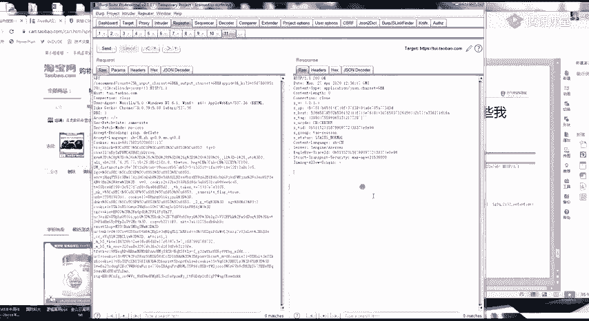

所以说你在测CFF的时候呀。

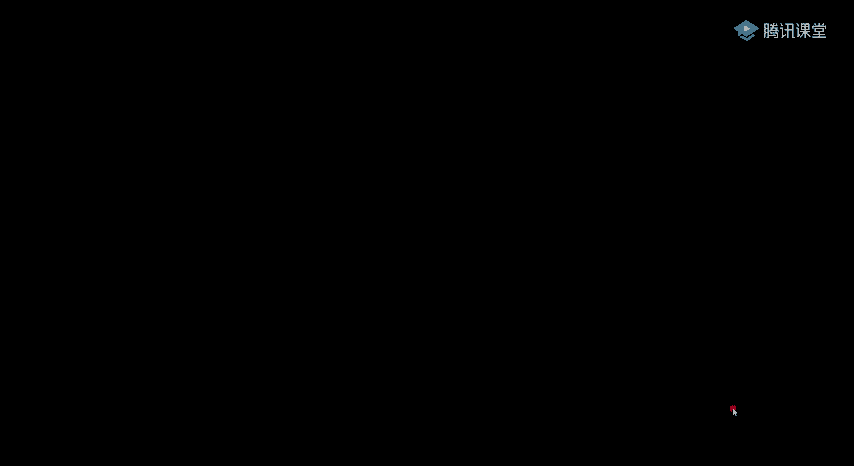

注意这三个注意。最重要的就是注意这三个请求头，这三个字段就可以了。然后呢，还有一个要注意的一个点了，就是。自己fuse的。句子叫什么意思呢？就是比如说我这里是一个请求包，对吧？我这里是一个请求包。

你们其实开始也是能看到。我这里呢是有一个token的一个东西。我原来的一个请求包是一个这样的，你看到这个托ken，觉得哎我有托ken，那我是不是肯定就不存在CSF。不是这样的，我把这个图给删掉。

这个请求还是可以进行。那我就说明我可以CF。所以说你只要把这两个字段我都给它删掉。就可以。就可以啊。如果还是能执行，那就说明存在CSF。所以呢它一个一个安全的一个C一个安全的一个请求。

就是它中间有一个token，或者有一些其他的我们没有办法获取得到的一个参数，它才不会存在CSF。The。那我如何构造1个CFF呢？就是呃我给你们发了一个刚刚这两个。包对吧？这里呢要告诉你们一个小技巧呀。

因为你照着这样去改，其实是一个比较麻烦的一个事情。教你们一个小技巧。BP的话用吧。应该有用BP的话，每个人都用嘛。这里呢BP有一个简单的一个功能。就是比如说我修改了一个请求。这是我的一个请求包。然后呢。

你右键。到这个位置。选择这个CSIFPOC。选择这个CSF的1个POC。然后我选择之后把它copy到这里。把它 copypy。阔py到这里面这一个。或者啊你只想自己体验一下。

就用BP它自己生成的一个链接。BPR它会自己给你生成一个这样的一个链接。这里copy这里，然后点击一下。他这里呢也会加载一个地球。你可以看到。所以说啊。遇到这种普通的呀遇到这种普通的一个port。

一个ge。ge post的一个请求，你用BP自动生成就可以了。然后如何找CFF，你就是看这个请求包。这个请求包里面除掉这一个。对话。然后去掉这个token。他这一个请求还能不能继续执行？也就是说。

只要我这个包里面所有的参数我自己都可以构造的出来，自己可以任意构造。那我就可以执行1个CSF的操作。啊，有没有不懂的，有不懂的话，现在赶紧提。Right。其实应该是很简单的。懂的话，你就扣个一，好吧。

嗯。然后呢，后面我会给你们。发一点CFF的一个简单漏洞啊。另外还有一个哦，对了，忘记给你们讲一个点，有一个特殊的一个点。因为你们如果挖了FIRC也会知道。有一些包呢，它是一个jason的一个包。

有一个jason的一个包。没有。它是什么样子呢？呃，我举个例子啊。嗯，就用约B记吧。我举个例子啊。Yeah。他有一些数据包。是这个样子的。二且数据包呢是这个样子的。

那我如何对这一个jason的格式包进行1个CSF呢？啊，如果你普通的一个操作的话，就是我普通操作。我利用这个CFF生成这样的一个拍load的，它是行不通的。他后面会多了一个等号。这里呢我今天也不讲。

就是你们自己去课课后进行一个练习。然后我今天就给你们布置课后作业，因为很简单呀。给你们布置课后作业。H。好吧，这是里面的一个课后作业。然后呢，有一个应该还记得有一个考核。

就是呢有一个考核是一直到后面的一天。这里来。我要你们做的呀，不是做1个CSIF。这里是一个骑士CMS的一个后台CSF添加。管理员账号。这里呢我要你们做的是。啊。

可以对我个人啊就是对我个人进行一个社工的一个手段。就是模拟，你们要想办法让我来点你们的1个CSF的一个链接，有如两天的一个时间。包括今天开始一直到29号。你们有一个两天的时间。

你们可以不可可以想什么办法，你们自己想一下，有什么办法让我自己去点到这个链接。你们首先可以自己先下载骑士CMS。去。看一下这个CSF漏洞是怎么利用的。当然有趣的就是。怎么让我上钩，怎么让我上钩。

你们呢可以对我自己呢进行一个操作，也可以写在文档里面，就是你对我进行一个欺骗的一个操作，也可以。不管你们用什么手段都行。好吧。😊，今天的个课程呢就到这。然后我就下课了。

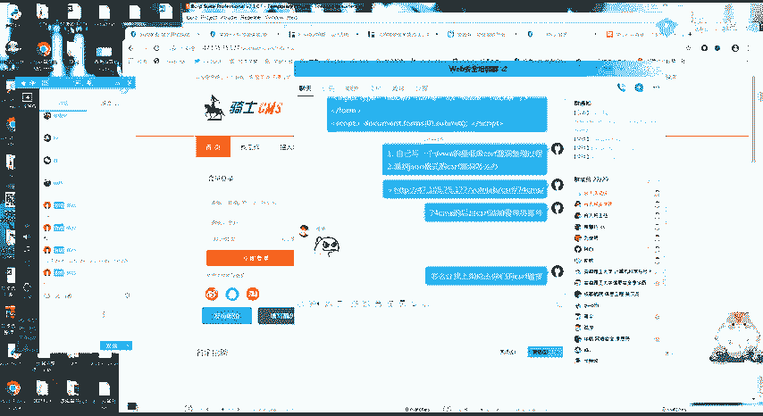