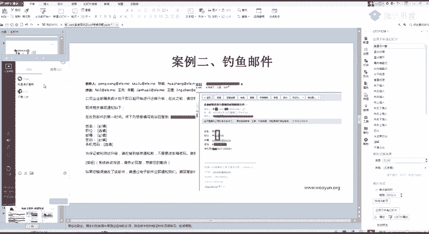
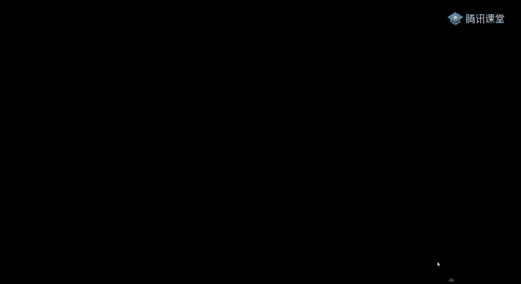
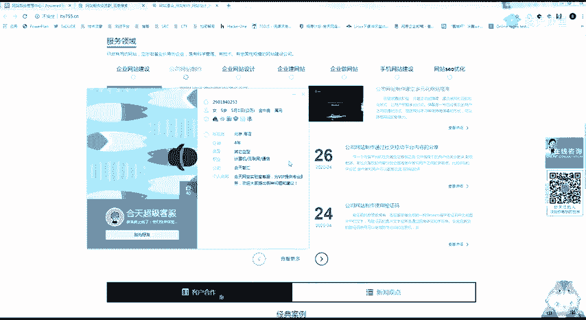
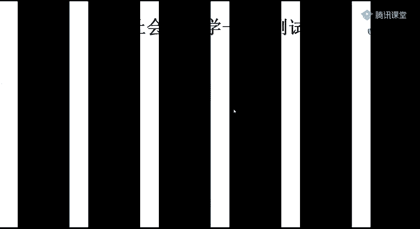
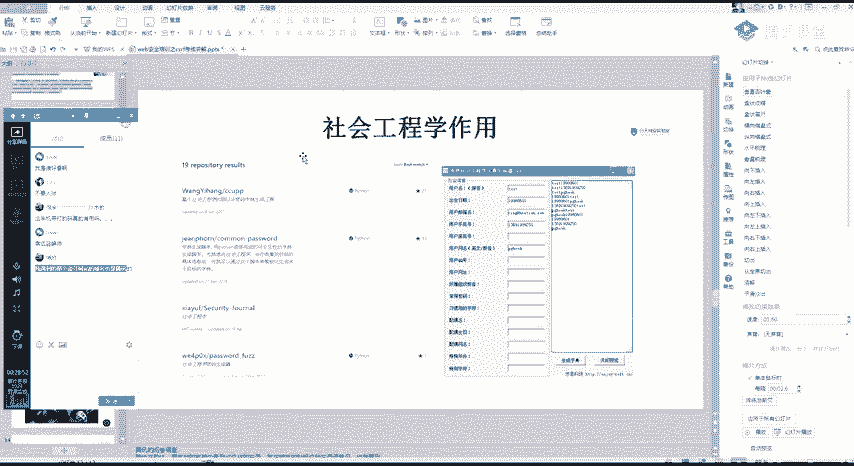
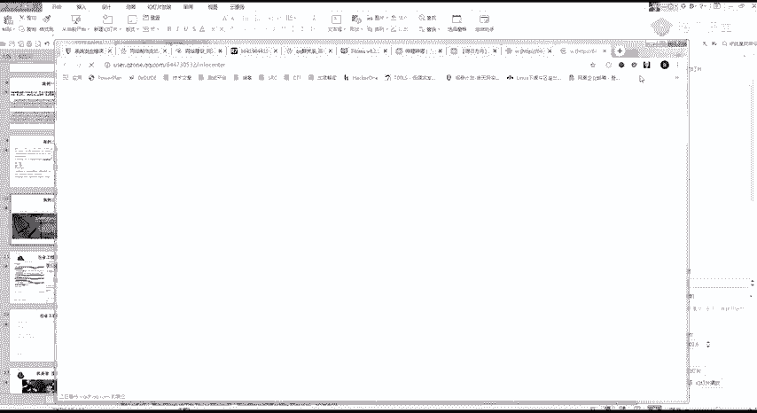

# CTF教程：CTF初学者必备的1000个练习题，每日一练，百日成神！（ctf-wbe／ctf-pwn／ctf-misn／ctf-逆向） - P64：csrf漏洞扩大影响 - 白帽子讲安全 - BV1dp4y1j7aN

嗯。🎼嗯。🎼千年。🎼你会在。😊，🎼身边有。🎼曾情。🎼故事。🎼却。🎼放起。🎼这。🎼嗯。🎼别着爱。🎼Theた。🎼や们。🎼The day need you。🎼一滴春天的雨总能够充满诗意。

🎼下地时的思绪落在了树。🎼中沉睡的。🎼不答应。🎼你的眼睛。🎼诉下心。🎼的世。🎼每个春季。🎼我很同意。🎼说着夜的。🎼听渐的在写城市。🎼的一的。🎼已经很。🎼ですか？🎼The star。🎼我看你。🎼别觉定。

🎼你在。🎼勇个。🎼我跟你呀。🎼，🎼，🎼No。🎼一滴春天。🎼都能够充满诗意。🎼下笔时的思绪落在了树根。🎼凌晨沉睡的灯。🎼可以。🎼像你的眼睛。🎼拂下了心。🎼的是。🎼每个传奇。🎼和你。🎼不之夜的传奇你开始。

🎼把自己城市。🎼给你的。🎼スタ。🎼，🎼你却我。🎼你在。🎼Da the。🎼我给你。🎼Da地。🎼The star。🎼我敢。🎼Did you carry。🎼This day。🎼，🎼Yeah。🎼，🎼，对。对。

嗯哼。😊，有声音。看一下啊。Yeah。好。好，开始今天的一个课程。今天是1个CSF的一个考核，其实。按道来说呢，课程是比较简单了。所以呢在这里呢我就给大家加了一点点小内容。

就是给大家会讲一下社会工程学的一点点知识。然后再给大家讲一下1个CSS的一个扩展影响。嗯，首先从这个CSF大家的一个交作业的一个情况上来讲。大部分同学是。基本上已经呃还可以了吧，就是基本上已经。

把CSF的一个知识给掌握了。然后呢，我给你们的一个要求，就是通过这个骑士CMS进行一个。对我进行一个射工，进行1个CSIF。然后呢，社工的一个。情况的话呃，不是很满意啊，大概只有一半的同学。

进行了个这样的作业。我当时的一个思路呢是这样的，就是。啊，你们比如说你可以加我1个QQ好友。然后跟我进行一个私聊。然后呢，你就或者假装问我问问我问题。就是你比如说我发现一篇文章。

然后你就说我啊老师我遇到一篇文章，然后自己哪些地方有不懂的，然后你就发个链接给我，我就就一点。类似这样的一些场景，或者呢直接发到我的邮箱。让我去进行一个山沟。但是大部分同学是。一半的同学吧。

这一半的同学是做了这个作业的。啊，作业的话，昨天呃基本上也是给你们展示的。几位同学的一个作业思路都还可以，好吧，都还不错。呃，然后这里呢我就简单的演示一下。啊。因为骑士CMS那一个。账号是多少？

Well。我找一下账号。嗯。What。对。这里呢就是天加管理员。Yeah。他的这个包。系。这里基本上大家都是完成了，基本上是完成了。然后呢，我就这里只做一个简单的一个演示。先把这个删掉呀。

然后直接利用BP给你的一个体验网址。直接copy打开。只有添加成功了。这里呢基本上大家都是完成了的呀，就是。基本上大家都是完成了这个CFF的一个操作。但是在社工这一块呢，大家可以尽量去做尝试。

你要想好不容易有这么一次呃合理的欺骗老师的一个机会。今天的一个重点内容呢就是给大家讲一下。这一个社会工程学是一个什么东西？有一些同学的话应该是已经了解过了。他社会工程学的一个意思呢就是。

通过他人合法的一个交流，使其心理受到影响。然后做出某些动作或者透露些哎透露一出一些机密的信息。这一类呢通常是认为一种欺诈他人已收集信息芯片和入侵计算机驱用的一个行为。简单的来说就是。啊，进行一个欺骗。

Yeah。呃，具体有哪一些例子呢？其实这张图的话啊，我觉得很叫什么很形象啊。这个图很形象。就是我们的社会工程学。通常认为是一种物理攻击的一个行为。我们看一些社会工程学的一些例子。嗯。What。No。

Yeah。这里没调，不好意思。看一些社会工程学的一个简单例子。首先这是以前很有名的1个16年。诈骗的一个例子。Well。啊，虽然我就是。正常来说的话，我们是叫诈骗了，就是日常生活中里面叫诈骗。

在思路测试里面，就是叫一个。叫什么？叫社会工程学。然后通过这个例子呢。告诉我们什么了？我们学的这一个不是叫我们去诈骗了，而是利用到一些。首先第一个是自己的一个安全意识的一个提升。第二个就是如果呀。

如果以后。你们是从事了一个安全的一些渗透，就是比较敏敏感的一块的一些东西啊，这里是什么东西就具体不说，你们就会发现社会工程学是一个。这个什么是一个很有效的一个方式吧。你可以看它这里的一个案例呢是什么？

这是因为某个人他侵入了一个招生的信息平台。然后呢，拿到了这些的信息。然后你可以看。这里呢也是通过一个网络技术的一个。说话。就是因为他拿到了一个个人的一个个人足够多的一个信息，这样才可以。啊。

让那一个受害者相信。所以还是自己再提一点了，讲了这么多课，应该也跟你们提过。啊。学了这个千万别去搞事情啊。网络安全法在心中。然后我们再来看一下最常见的一个社工案例，就是钓鱼邮件。我也跟你们说过。

钓鱼邮件的一个事情就是让你们通过一个钓鱼。比如说你模拟是我公司的，因为你知道吗？我是和田的，你要发条信息给我。啊，因为何天的一个什么邮箱要干什么事情，然后底下呢就是一个详情。

然后详情里面就是你的1个CSF的一个代码。正常人的话，他肯定是会去点开的。但是这里呢。给大家就是教大家一个。我觉得在渗透里面啊最有效的一个方式啊。钓鱼钓鱼邮件应该说是现在渗透里面攻击最有效的一个方式了。

这里呢你们可以去网上搜一些钓鱼邮件的一个模板。然后根据这个模板稍微涂涂改改。改一下。当然不要去尝试了呀，只是告诉你们有这个东西。然后这里呢是我们老大之前的一个案例啊。看到没有？他这里呢就是把这个收件人。

这些人发了这些信息，看到没有？迁移升级，请你把这些信息回复到哪个地方？然后真的有人就发过来了。呃，不知道你们有没有去尝试过。

这什么？我是谁好看。

然后记住啊一定要记住，钓鱼攻击是很有效的一个说法。呃，后面的话你们可以自己去尝试一下。第三个呢就是一个钓鱼的一个页面。这里举的一个很经典的一个例子呢，就是腾讯的一个问卷。你可以看到。

就是一般我们遇到钓鱼邮件，钓鱼软件是不是。就是不是腾讯的域名。但是如果我在腾讯的这个问卷上创建一个这样的一个信息，然后发给你。你有没有可能会相信呢？因为这个域名是腾讯的。

当然我们遇到的更多的一些钓鱼的一个是就是别人说什么啊英雄联盟啊，或者什么游戏啊，你有活动啊，然后领东西这种最多的是最多的是遇到的是那种。

应该是没有想过用这个QQ或者其他的一个问卷来制作这样的一个钓鱼页面发给别人。那这个社会工程学在我们的一个渗透测试里面有一个什么样的一个作用呢？首先它一个最大的作用是我们这里呢是进行一个信息收集。

因为社会工程学除了我们刚刚的一个钓鱼之外，还有一个就是对信息的一个收集。어。就比如说这里啊。我们通过一个人的一个。啊，比如说一个网站吧，我就举个例子。比如说这里呢是一个什么呃门户网站，门户网站或者是。

做网站的。晚上制作。对吧你比如说有这么多的一个广告。然后我这个人呢，我就我又不想出钱。去买他们的广告。但是我又想白嫖到他们的一个源码，那怎么办？那怎么办？呃，给大家讲一点点思路啊，上面是没有写的。

这上面是没有写的一些思路。大号的域名。有。可交好久的事情了，这个你不用管了，挺久的东西了。就比如这一种呢，现在很流行的就是找客服懂吧？就是跟客服进行一个聊天的时候哎。客服，我对你们的一个网站就很有兴趣。

然后看他能不能搞一个测试站出来。因为你要知道这种网站后台的话一般是会有一些文件上传啊或者什么样的漏洞。然后我就直接传文件给它进行一个getel。然后另外呢可能还有会遇到一些啊黄主毒的这种网站了。

然后你就可以跟客服聊，说你遇到一个什么问题，然后趁机就发一个木马给他。这种手法是最常见的一些事情啊，很常见的一些东西。然后当然还有我们这一种，就是我比如说有还是同样的。

有一些什么网站制作交流群啊或者什么东西。或者说呢我通过这里的一些信息收集查找到他们那个交流群。就比如说是我一个啊核心智慧，好吧。我们和田的话就有一个和平交易局。然后呢，我通过这个群呢。

我就可以拿到一些QQ号，对不对？拿到一些QQ号。然后拿到一些公告啊什么东西。就会有一些足够的一个信息。然后呢，这里你要想到呀，这些客服的QQ号。

我只是举例子啊，不要你们去试。这些客服的1个QQ号。

他可能他可能会不会有一个历史的一个遗留信息呢？就是。我们通过这个QQ号去这些施工库里面查询这个QQ号的一些旧密码，或者是一些信息等。然后。有可能是可以得到一些，就是你可以登录进去的呀。

这里呢是get up上面有一些社工字典的一个生成。你可以看到，根据你的一个用户名、出生日期、邮箱、用户手机。然后座机啊，还有什么东西，你知道的东西越多，它这个触点就会给你生成的一个密码越多。

还有一个常用密码等。嗯。这里的话应该还记得吧，我发了一篇文章给你们，不知道你们看了没有？嗯。😊，看一下。这里这是和田之前的一篇文章。你可以看一下这篇文章的一个东西。首先它是通过这个QQ号。

然后通过这个施工。酷的一个东西就是查这个群关系啊。通过施工库。然后再通过这个数工库查到了一些密码。然后再通过这个IEG007。通过这一个网站呢，它是可以。就是比如说你们可以查到手机号注册过的一些东西啊。

这个网站。哦，就随便查一个吧，哎，好自己的吧。你看。这里呢我是把我自己屏蔽了呀。这里比较搜不到。啊。随便找个人的啊。谈一下刘老师的。来听班主任。これて。What。看可以通过这个邮箱查到注册过的一些东西。

然后呢，我再根据我们找到的这个密码，就是这个施工库查的一些常用的密码，再去进行一个简单的一个测试。可以看到这里就通过这些简历，还有什么东西查到了很多东西啊，这个是三减版的，我那里有个原版的。

因为可能原版的会有一点点。有一点点。可能会封号，所以我就只发一个精界版给了你们。

然后社工的话。推荐你们去看一部电影啊。这部电影还挺有意思的。这部电影还是发群里面。我。建议去看一下这部电影。开完之后，你们可能就会对社工这些东西有一个深刻的一个。呃，关于施工这一块呃。

还有没有什么想问的？没有什么想问的，有什么想问的话，现在移出来。给你们稍微解答一下。What。没。姑娘。嗯。嗯。水工库。这里不能教你们了。待会儿待会儿群里面跟你们说。现在的有现在比较出名的就是一个TG。

URL不知道咋换。哦，你是说那个昨天的那个作业吗？如果在网上搜索到自己的账号没码。你没你现在唯一的防御就是改密码，懂吧？或者是自己清痕迹。也不用每个站，就是你设置一个比较复杂的一个密码。我就跟你们说吧。

就是说一个简单的例子啊。啊，就。包括微博呀、QQ，还有QQ的叉MLQQ的叉M那个QQ叉ML不太好改呀。那个QQ的产面，我待会儿下次给你们说，因为上课这个东西不好弄。每个网站密码不一样。

如果收到自己账号的话，建议就是改密码。我之前是去搜过施工库我施工过我自己，我发现我什么什么隐私都没有，还好我不搞事情啊，我一搞事情百分之百被抓，没有隐私。Yeah。然后你们可以去了解一下TG的一个。

做工不顾的吧。之前有一个什么样的一个新闻呢？央视央视都报道过了，但是到但是到现在他还是没有被打掉。帅工护机器人哎。请问。网上的话数据的话很多东西可以搜到，包括原来的1个QQ群数据啊。

QQ群数据的话大概是08年还是什么时候去了，搜一下啊，不是08年。看到没有？QQ群关系的一个数据库，14年吧。点久了啊。然后群关系的话，它大概有100多G的样子，我手里是有的，但是我们要自己去弄了。

车工库你可以选择自己搭建啊。可以选择自己搭建，但是你要有一个足够的一个机器，还有一些东西，最好是自己搭呀，或者是你花钱去查别人的。但是你如果要自己搭的话，那些数据啥的要去自己收集一下。

很多东西可以自己可以搜到的，但是搭起来要花时间。好，关于施工这一块，其实是稍微有点敏感的一些话题啊，就不多说了。讲一下CFF的一个扩大的一个影响。首先啊。我们要确定一个点了，就是。你如果是。

挖CFF的话一定要记住5个。一般有CFF点的情况是，整个站都会有1个CFF的一个漏洞，对吧？是整个站。然后呢，它修复呢。他也是直接修，就是全站进行修复。大家懂吧？一修就是把所有都都修复了。

然后读取类的也是一样的。所以我们操作类的呢就要尽量找敏感的一些信息操作。你比如说啊。删除账号更换手机这样的一些敏感操作。第二个，读取类的也是最好呢是找账号接管的一些托管信息。

然后还有一个个人的一些地址信息等，尽量找敏感的信息啊。这里的一个靶伞，其实你们应该是去搜购的。这个云骑士的1个CMS是可以get shell的，但是要在后台。然后它的一个get share的一个办法。

就是后台登录之后。然后。运行这样的一条命令。要S吧。疫行之间的一条命令。他自己呢就会写到一个com。一个看fi里面吧。啊，当然这里这里好像我把它权限是置没了。网上设置成了不可不可写的一个权限。

这就很尴尬了。是我们本地的环境吧。嗯不是说。그。然后他的一个后台get share的一个漏洞。在这里发给大家。这里呢包括骑士啊，还有很多CMS的漏洞，这里有一个集合，大家有时间可以看一下。

增长一下自己的一个知识面。它这里的也很简单，就是一个这样的一个。登录后台之后。进行一个这样的一个操作。但是这里的话是因为我。设置了一个权限了，让他权限不可写，所以他自己就直接报错了。

给大家看一下本地的一个环境。明我。这里要给大家讲的是什么呢？就是我你不要想着CSF它只能做一些单纯的一个。做一些单纯的一个叫什么东西是吧？单纯的一些读写操作呀。CFF它是可以。进行一个ge下的。

包括叉SS也是。HS。我的DFF。这里来给大家看一篇文章。这篇呢有一个叉SS加CSF组合权的一个get share的一个漏洞。嗯。Yeah。Okay。この。他自己的1个POC就是这样的。

我这里稍微改一下，因为我之前是运行过了。系。改不了的。哦，可以改。你可以看到我这里呢就是一条命令执行的一个语句。在这个位置。然后我们看一下我们刚刚的一个运行。可以看到是一条这样的命令。Yeah。

那这里是不是也可以构造1个CSF？CSFP的一个构造也哎，我也不做也不做测试了呀，因为这个东西就很容易就生成了。所以这里呢要你们学到的是重要的是一个思路啊，重要的是一个思路。遇到CF的时候，不要。

叫什么？先不要急，就是。先不要急着把这个漏洞就给他交了。包括是叉X，还有所有这个猪路，包括所有的漏洞都是一样的。你如果挖到了这个漏洞，首先就不要急，你要想到的是怎么利用这个漏洞去进行一个。

去进行一个最大化的一个利用吧。就是在这个过程中，你会学到很多的技术呀。当然不只是技术，他一个奖励也是很丰厚的。给大家看一下最近的一个私密项目吧。嗯，我去找一下那张图。这是五一期间的一个活动吧。

五一期间的一个活动。对。然后我就发5号群里，好吧。Wu。这是五一期的一个美团的一个活动。他的一个要求就是。你通过这个漏洞打入到美团的一个内部。Yeah。当然它这里是禁止了一个钓鱼的射工啊。不然的话。

他是很容易。通过待位施工的话，是很容易进入内网的。他这里明确禁用了。当你遇到一个漏洞的时候，如果加深就是。入侵到里面了，它的一个漏洞减直大概是5万块钱一个。像我们单独的一个漏洞的话。

他可能就美团院奖励比较高。单独的话可能就1万块钱或者是八九千块钱。但是如果你遇到这种活动，然后又知道把这些漏洞深入利用的话，你这个奖金是非常丰厚的。另外再给你们看一个例子。系。

一个例子呢就是我之前的一个漏洞挖掘的一个经历啊。这里的话我就。呃，因为已经修复了。응 응。啊，学不了也不好讲了的，我只能跟这样跟你们说。首先第一个叉SS等于DV。或者是中位。因V大概是啊中位吧。钟伟。

大概是。300块钱的样子。然后呢，又发现了1个CSF。大概是拆翻就50块钱。但是CSIF加上叉SS组合成一个。唔同。或者自动触发的操作。然后他这个奖励就变为了1个5000。所以呢这里要教你们一个经验啊。

你们现在虽然刚开始挖，但是也要有一个这样的经验。你遇到CSF跟叉SS可以先不交。先自己留着。找一些。组合漏洞进行一个寻找。然后进行一个攻击。呃，然后我再讲一个这个吧，今天的课程其实就这么点。

我感觉内容有点少。我看一下1个QQ的1个XML呀。Yeah。你社工的话，用QQ的拆没有，这一点其实很难弄到呀。因为QQ拆没有，它是自动加载的。他。他那个链接跳转，我教你们一个。更有趣的吧。

假如说这是一个哔哩哔哩的一个网站啊。然后随便点一个。哔D哔D我觉得是有一个分享的一个东西。呃，通过QQ分享或者通过QQ微博的分享吧。影响到微博吧。这样我简单的抓个包。Well。Yeah。对。

那么跳转不进去啊。就例如这吧，看到没有？他们这里了。类似微博这种有这样的一个分享的一个链接。这里简单抓一个包。就可以看到一些内容啊。首先我这一个是我这个名字，然后我这一个refer。就是他的这个地址。

我这里随便改一下啊，改为百度。然后。Link sell。うう。分享成功去我的微博看一下。然后我这里呢就是一个明日方舟，什么？诶。是我刚刚哪里点错了，刚刚这个抓包没抓到，好呀，重新分享一下。

那就不是这个点了。哔哩哔哩shall code。因为我很久没有抓过这个包了呀。微博要哔哩哔哩。然后看一下啊。这是什么鬼吗？分享成功，看一下哔哩哔哩，然后百度。那我就把这个改一下。Bge。各一下分享成功。

不。哎，讲到理应该是分享成功了呀。再改一下再改一下啊，有点尴尬。好久没弄了，有可能。哇，他们把这个路洞修了吧，应该是。这个就很尴尬了。这是我去年的时候找到的一个。就是我在分享的时候。

我可以替换至里面的1个URL。但是我这个图片呢。但是我这个图片。我这个图片还是那个。还是那一个叫什么去啊？我这个图片还是哔哩哔哩的图片，但是这里面的URL呢，我就可以进行一个替换。

可能他们这个漏洞是进行了一个修复呀。那我再想想。哪个地方能施工呢？如果分享的自资空间呢？试一下啊。Oh。Okay。啊。可以看到这里。我这个图片虽然还是哔哩哔哩的呀。但是我这个地址已经变为了百度的。

所以说如果你加我一个好友，然后啊就发一点我们这种肥仔比较喜欢看的这个图片，然后点一下。就跳转到了你的样1个CSF的一个地址。当然这种东西呢你就。把自己空间屏蔽了，然后去尝试啊，不然。啊。

网络安全法在心中还是一句话。好，今天的一个课程呢基本上就这结束了。你们有没有什么想问的？也感觉没有什么想讲的，CFF这个东西。哦。What。嗯。そそう。所以呢我就先把这个关闭。

因为刚刚那刚刚那位同学说的一个就是。

你利用一个叫什么圈，利用那个QQ的拆ML仪，拆ML扫描仪转发。你像我你像我刚刚这种说说，就是我刚刚删掉的这种说说，我根本不需要借助那个tmail的一个扫描仪了。我直接利用刚刚我空间的这个。

然后分享给你们，你们去点开。你们自己去点开，然后就会自动跳转到你的1个CFF的一个位置。Okay。好，这里我就下了啊。下课了。

