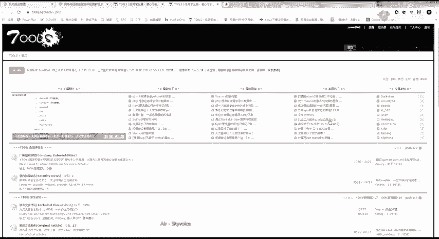
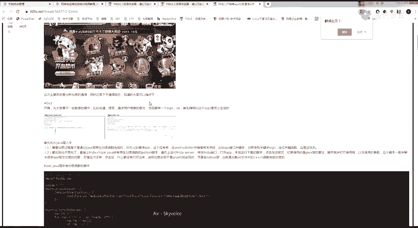
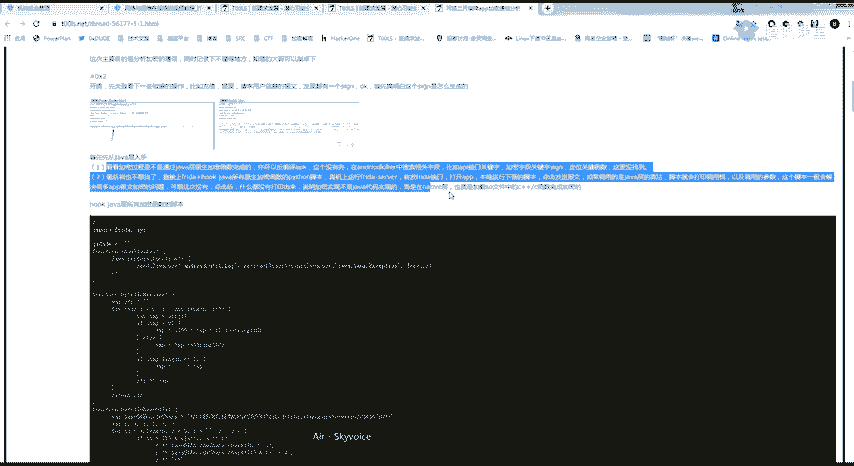
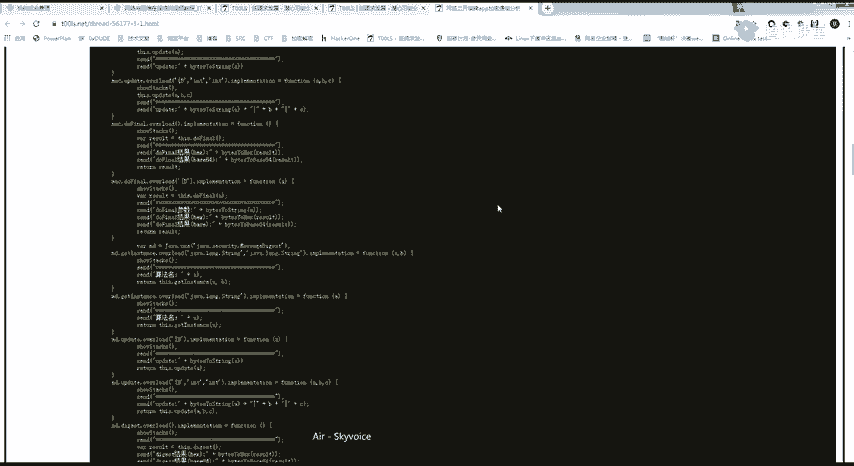
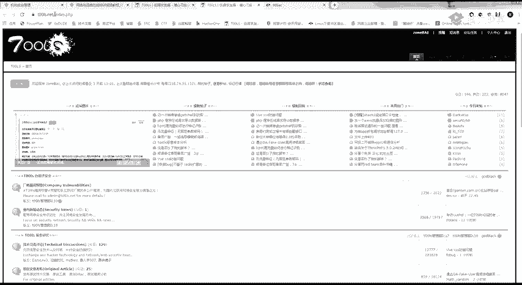
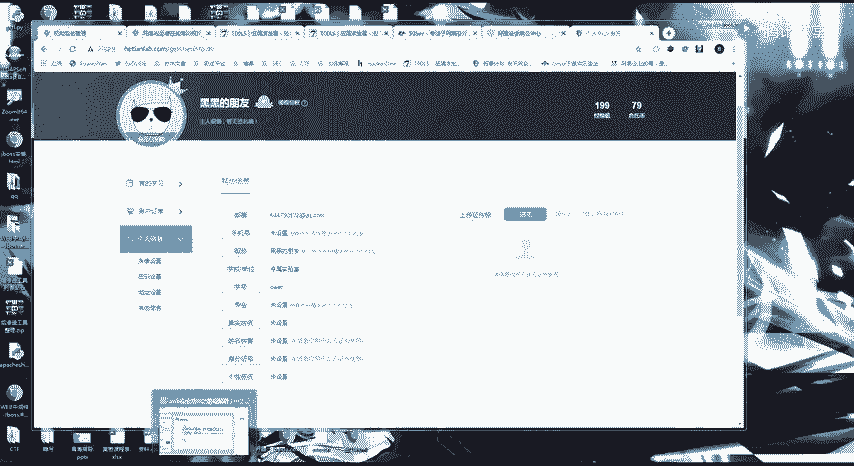
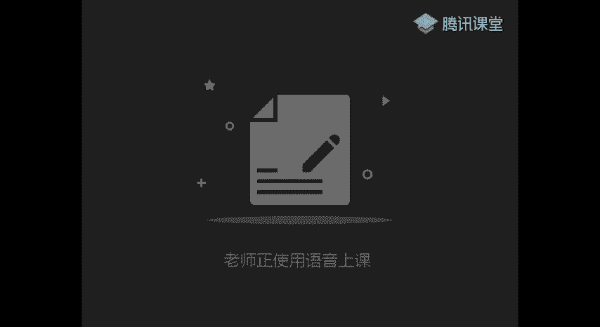
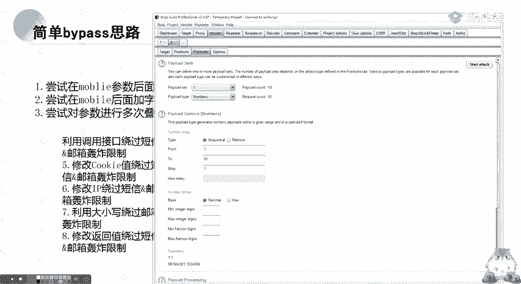
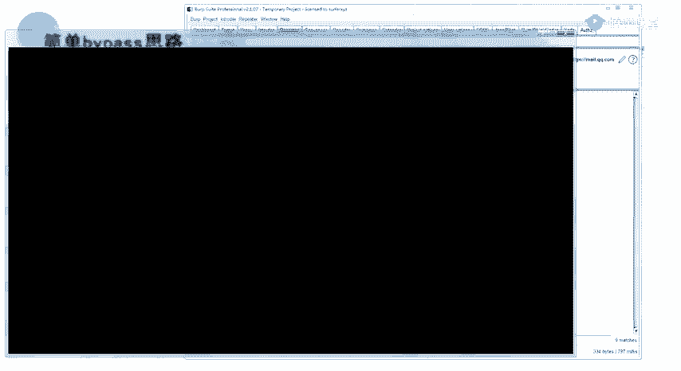

# CTF教程：CTF初学者必备的1000个练习题，每日一练，百日成神！（ctf-wbe／ctf-pwn／ctf-misn／ctf-逆向） - P65：逻辑漏洞简介 - 白帽子讲安全 - BV1dp4y1j7aN

Yeah。🎼对开。我。🎼也许还能在网上看到你的消息，也许我唱的歌还存在你的手机。也许我爱你埋在心底，变成秘密。也许你想我的时候，我也在想你。🎼多少次我告诉自己，此情可待已成追忆。多少次我告诫自己。

不再为你流泪到一败涂地，我和你不再联系，希望你不要介意，要怪就怪，当初没在一起。而你对现在也比较满意。所以我留下来也没有道理。🎼和你断了联系，不代表我不想你走到哪里开始会有天气，而我也开始试着去忘记。

😊，🎼抹去我们过去的放弃的所有。🎼我今。🎼也许还能在网上看到你的消息，也许我唱的歌还存在你的手机，也许我爱你埋在心底，变成秘密。也许你想我的时候，我也在想。🎼多少次我告。🎼我自己此情可待，已成追忆。

多少次我告诫自己，不再为你流泪到一败涂地。我和你不再联系，希望你不要介意，要怪就怪，当初没在一起。而你对现在也比较满意，所以我留下来也没有道理。🎼和你断了联系，不代表我不想你走到哪里还是会有天际。

而我也开始试着去忘记。😊，🎼抹去我们过去的放弃的所。🎼和你不在联系，希望你不要介意，要怪就怪当初没在一起。而你对现在也比较满意，所以我留下来也没有道理。😊，🎼和你断了联系。

不代表我不想你走到哪里开始会有天气，而我也开始试着去忘记。😊，🎼抹去我们过去的放弃了所有。🎼抱弃你。🎼Okay。🎼他说了的。🎼我们到底算。🎼难道听到。🎼却都是错的。😔，🎼暧昧你爱总是差了什么？😔。

🎼明明彼此笑了。😔，🎼却又不见了。😔，🎼你不在的世界里。😔。

嗯。二点。呃，给大家推荐两个论坛吧。

Yeah。个论坛的话，你们写一篇文章就可以了。呃，吐司的话比90的一个。曲线还啊就是一个门槛还低一点。吐司的话，你稍微写一篇，比如说一个漏洞复现啊，或者是你比如说一个四个猪入，1个CSF等。

然后你拖稿拖过去，基本上都是会过掉的，会过的。这两个论坛都是要邀请码的呀，因为稍微有一点点门槛，但是门槛也不高。这两个。嗯，好，开始今天的一个课程。今天开始呢就是讲一个逻辑漏洞的一个。总共4个课时吧。

我记录共4个课室。然后大家在玩掘SRC的时候，逻辑漏洞是一个。很重要的一部分吧，因为它很简单，但是它出现的一个漏洞点也特别多。今天要讲的是第一个是简单讲一下什么是逻辑劳动。第二个就是URL跳转。

第三个就是短线轰炸。短线轰炸的话，我记得是上小课的时候是给你们讲过的。所以说今天的一个学习任务还比较简单。啊，同时也在这，祝大家五一快乐呀，要放五一假了。呃，首先我看一下啊。我这个声音还好吗？

因为是在因为今天是在家里。我这声音有没有小了或者大的？と。嗯，还好，那就开始讲。然后呢，首先先给大家讲一下什么是逻辑漏洞。系。逻辑漏洞呢，它是因为一个程序员在编写程序的时候。

跟着人的一个逻辑思维产生的不足。要记住啊，逻辑漏洞跟我们传统的漏洞有一点不一样。他是通过一个合法的方式来达到破坏的。啊，你就比如说这个密码找回用户登录验证等这些。

大家应该上次还记得那一个四位数爆破的一个漏洞。你要这样想，本来本来的一个验证码我是个思位的，它是一个正常的逻辑，对吧？但是它只是没有考虑到我思位数的一个验证码，它是可以进行一个爆破的。

这呢就是因为程序设计的不足而产生的一个问题。这一类防护手段是因为。设备因为它是一个呃正常的一个功能来达到一个破坏的。所以我们的一个设备，还有一个扫描器，是很难发现这一类漏洞的。这也就是为什么我跟你们说。

在SIRC里面，它的一个逻辑漏洞的占比很大。啊，大概的一个占比就是入口入啊我在SIC里面入口令占高位里面入口令占了一半，然后逻辑漏洞占了30%到40%。然后他一个产生的原因应该也很清楚了。

就是程序员的一个逻辑，它不严密或者是过于复杂。特别是这一点呢，大家要记住。一个网站的功能点越多，它存在的逻辑漏洞可能性就越大啊。你就比如说类似淘宝、淘宝呀，还有一个。

淘宝、京东这一种逻辑漏洞的存在可能性是非常大的。但是当然啊就是经过白帽子的这几年的一个挖掘，基本上是没有了的。这里提到逻辑漏动给大家。要给大家看一个吹个逼。就是我们团队的一个水泡泡师傅。

当时呢他们是挖掘了一个逻辑漏洞，就是。阿里的一个逻辑漏洞。嗯。😊，哎，好像翻不到，待会给你们翻是我们团队的一个，他就是发现了一个。简单的一个漏洞吧，应该说是一个简单的一个月权漏洞，就是蚂蚁金服的。

当时当时他淘宝的还是蚂蚁金服的去了，当时他那个淘宝直接给了1个21万的额外奖励。所以说你们要记住这一点。就是。😊，越复杂，他出现逻辑漏洞的一个可能性就越大。特别是在这些地方。

然后我们看一个简单的一个例子。这里呢是一个最经典的一个逻辑论go的问题啊，就是因为一个四位数的一个验证码。这是顺羽泉的顺丰的一个站一个网站。这也是因为它的一个大家其实可以看到这里重置密码的这个位置。

它只有一个四位数，然后可以进行一个包破。啊，我上次再给大家讲一个讲那一个云集的漏洞的时候，就应该是还记得吧，那一个四位数就可以爆破，然后呢就可以进行一个任意的一个用户密码重置或者登录。最经典的一个例子。

这里呢就是一个逻辑漏洞的一个。部分吧，因为我们课程时间还是有限的。我就会给大只会给大家讲一个部分的逻辑漏洞。在挖掘这一部分逻辑漏洞的时候。啊。大家记住了，其实这里呢你分类你可以先不看懂吗？

他总共有逻辑漏洞是应该说是属不变的。不知道大家听过一句话没有？就是。啊，漏洞是人找出来的。Yes。就是如果只要你够牛逼，本来你没有这种类型的漏洞，你都可以说，只要你能证明你这个操作有危害。

然后写给那1个SRC他相信了他就认为这是一个漏洞。也说漏洞是人为造成的。并不是他本来就存在的。标记住的点呢就是几个要点吧。这虽然这虽然说的有一点笼统。但是我觉得最重要的是这两个熟练BP，然后思路体系。

也就是我之前一直跟你们强调的BP里面的一个包。你们会看BB里面的一个包，就可以挖掘一个逻辑漏洞。然后看一下逻辑漏洞的一个场景。啊，你们应该还是有印象的。我在挖洞的时候，我是直接给你们。就是我。

我挖罗辑的东，一般就是我直接找一个网站，就比如例如呃。例如之前在火线给你们看了一个。是的。比如说这一些平台。他的一个逻辑我懂，我都是直接。挖逻辑的洞就是我直接只用1个BP，只用1个BP就够了。

然后另外的话。嗯，逻辑中有一个点了，就是一一些的一个经验之谈。这句话我觉得。挺有意思的。给大家讲一个例子，就是。啊，我们团队那个ki师傅，他当时有一个挖洞的一个场景。嗯。

我待会儿我会把那一个漏洞的一个文档颁给大家。当然这里面也是有的呀，吐司里面也是有的。他就是利用一个啊，就是你这个包所有的参数都尝试过了。我这个包的。所有参数都尝试过了，发现没有漏洞。那他怎么办呢？

他看到一个返回包里面是一个jason的。嗯。时间有点久远了，我要找时间给翻一下才可以。我还是抓个包给你们举例吧，抓个包。当然他那一种情况很罕见啊，特别罕见。还是拿我们的一个和田给你们举一个例子。

这一种思路的话呃，你们平时是学不到的呀，你们就稍微先看一下这个思路。Yeah。Yep。对。一。举一个例子，这里一个个人信息的一个位置啊，我们首先看一下啊。这里有一个其他信息。你们可以在这里看到呀。

这里呢有一个user name。然后呢，这里有一个S to you no。对吧。这是一个jason的一个包，可以看到它这里面呢有很多的一个参数。你比如说这个电话，还有这个。这些什么东西。

这些邮箱外还有什么？然后呢，我们在修改的时候啊，我们首先看一下啊。我这里比如说我改学号的时候。是不是可以看到这里只有一个S to no。对不对？然后呢，这一个。S toU know是在这个位置。

那如果我我把这里面的一个jason，把这些参数都拖过来呢。啊，我比如说我这个月算面。我把这一个参数直接给它替换掉。你说他有没有可能可以进行一个修改？就是包括一个手机号呀，还有包括一个。

包括一些不能修改的东西，它只是没有这个参数而已。哇。他当时的一个思路就是这样，然后呢，就通过一个ID的一个值发现ID可以啊ID123456嘛，然后发现那1个ID可以直接进行一个便利。

就拿到了很多的一个信息。

当然这个思路这个思路的话，你们就稍微记一下。一定要记住啊。抓不动，你就自己想自己是。因为因为漏洞就是别人瞎试出来的。好，然后我们看一下今天的一个学习内容。首先第一个是URL的一个跳转漏洞。呃。

什么叫UIL跳转漏洞呢？URL跳转漏洞也叫开放从逆向漏洞。它的一个重点在这里，就是把用户从定向到攻击者自己构造的一个页面去。大家应该还记得上节课有1个CSIF。CSIF。啊，这画的有点丑啊。

我们CFIF是不是有一个攻击的一个页面？对吧。然后呢，它这一个URL跳转就是我发我发一条URL给你，然后。啊，它就会跳转到一个我攻击者想让你跳转到哪个页面就跳转到哪个页面。其实你简单的来说。

就是我可以指定你让你跳转到任意的UIL底下。它当然产生的原因跟其他的一样啊，就是没有对传入跳转UIL变量进行一个检查和控制，可能导致。可以恶意构造一个任意的地址，导致用户跳转到恶意网站。嗯。

这里呢我举个比较形象的一个例子。举啊举一个比较形象的一个例子。首先我们打开看一下，这是一个京东的一个位置，对不对？这是一个京东的一个登录点，我们点击登录。看一下上面的1个URURL呀。

他这里是不是由他这个认证的位置跳转到这个京东的网页？啊，那如果我随便选一个啊，就是比如说我选一个三星什么。看到没有？看到这个位置没有，我们再点一个登录。他是不是就跳远那个。秒杀点京东点com这个位置了。

如果我这个路径，比如说我可以改为3W点。百度点com。或者是这里呢是你的一个任意攻击的一个网址。然后我就把这一个网址。发到群里面，别人去点击的时候，你可以看。京东当然它这里是改了呀。就是他点击之后。

就会让你进行一个任意的一个账号输入。那我输入之后，它就会跳转到最后面的这个地址。如果我这后面的地址是一个钓鱼网站，或者是一个存在叉S，或者是存在CFF网址的一个地方。那他就会有一个。被盗号的一个风险。

所以URL上本就很简单。给大家看一个。看一些例子吧，你看这里就是京东的1个UIL跳转。然后他这个URL跳转可以干什么呢？刚刚我给你们说的基本上已经说过了。首先第一个就是钓鱼，第二个就是配合CSF。

第三个就是配合1个叉SS漏洞。第四个呢叫配合浏览器的一个漏洞。这个浏览器漏洞是什么意思呢？就是你们常用的这些谷歌。还有火狐，还有这种IE浏览器。因为你们是没有学一个渗透测试那一块的呀。声测试。

这里呢我给你们个关键词，你们自己去。搜啊自己去搜索，然后学习一下，好吧。双手漏动是。好久了呀。8174吧，应该是。De。你们可以去搜索一下这个漏洞。就是说如果啊他那个漏洞大概的一个情况。

就是我这里有一个网页，就是我有一个攻击者的一个网页。然后我只要受害者用这特定的浏览器访问到呢我这个网页。就比如说我这个爱淘宝就是我的一个漏洞的一个网址。然后你只要有只要访问到了这一条网址。

那你这台电脑就会被我进行一个控制。这就是一个浏览器的一个漏洞。老熟悉了。对，挺出名的一个漏洞。20188174。然后我们看一下呢，他一个漏洞的一个寻找呀，对吧？我们关键还是要去找漏洞。

然后就是挖洞赚赏金。Yeah。它最常见的就是认证完会跳转。所以在登录的时候观察UIL。登录呢就是刚刚我京东给你们举例的一个这个位置，登录的位置。我记得好久好久以前是因为我刚入门，那会儿就刷UIL跳转。

啊，一个漏洞也有9十几块钱，100块钱。刷的还是挺开心的。大部分就是都在这个位置。都在这个登录的位置。然后第二个呢就是一个用户分享的用户分享收藏了之后会进行一个跳转。这里先看一下UIL跳转的一个。

插点好吧。我记得我好像是有一个简单的一个。场景。给你们看一下什么叫UIL跳转。其实你从这个字面上来听的话就已经知道了呀。我。What。Yeah。完了，这个是。这里。我。嗯。好，我们看一下这一个例子啊。

就是我比如说我这里是存在1个UII跳转的一个地址。然后呢，我就直接把这条地址这样发给别人。你正常来看都是看前面这个域名，对不对？但是呢你通过我这个漏洞啊，我就比如说我在这上面打开。

可以看到它直接会跳转到百度这里。你这里随便改。그。这样就会跳转到淘宝。那如果我这个UIL是我们的一个攻击者的一个地址，那就可以进行一个任意的1个UIL跳转。其实你简单来说。

就是你这个URL后面的一个地址，你随便怎么填。他都会跳转到一个地址里面去。这己角UIL跳转应该就还是比较简单吧。

那我们的关键呢是在哪个位置？这里呢我同样的，我给你们截张图，好吧，就是。你们自己去思考一下他的这一个业务的一个地址。Okay。同样的你们也可以就是在那一个。讨论区敲出来。

你们印象中哪个哪些位置还会进行一个URL的一个跳转，就是会进行一个跳转。可能我这上面都没有写的全。直接评价成功呀，写业务呀。然后业务完成之后跳转了。比如修改密码什么的。对。你们还有啊。

你们自己有没有一些想法，就是除了我这上面写的这几个点，还有哪些地方会进行一个跳转？No。其实包括昨天的，应该你们还记得吧，我给你们分享了1个QQ空间。他那一个转载之后。

里面的1个URL是可以进行一个修改的。那你的话呃。我也不确定它会不会算1个UIL跳转漏洞啊，但是从字面上的意思来说，应该是算的。就是我那1个URL是可控的。分享到分享到一个。QQ空间里面。好。

然后呢这里是乌云里面的一些例子呀，就是以前的1个QQ空间的1个U1跳转。这里呢要你们记住的是这几个位置。第一个。

哎，等一下。你就说忽然之间感觉没有了。给你们看一下这两个例子，QQ空间的1个URL跳转的一个地址。你们重点呢是要记住这几个东西啊。看到他的一个例子没有？你们找他的一个跳转，告我告诉你们怎么找。啊。

就比如说。就是看这一个包子，道吧？找一下有没有1个URL的一个参数。好，我们这里看一下。他的这个请求里面，你看比如说这里有一个U的一个参数。但是他这不是一个跳转的一个地址啊。Yeah。嗯。Yeah。

这里是我本地的，你看这种。这里呢有1个URL后面有HGDP，然后呢，这里有1个302。或者301的这种。状态码。最好呢是看这个302的1个跳转的一个状态码。你看京东的这个位置。

U2L30I跳转是跳转到这个位置。然后我找一下，看里面有没有。不常规的一个三连的一个跳转，好像是没有的。反正你就是看URL里面。有没有有没有类似的，有没有类似像这样的一个链接？

他这里呢就可能会存在1个SSIF。跟1个URL的一个套转。基本来说是两个漏洞啊，就是存在URL的一个参数，你一定要敏感。然后你要验证的时候，就是把这个URL改为自己设置的URL跳转成功。

就可以访问到上面的个地址。所以说特别简单。但是呢。要教你们一点点比较特殊的吧。这里面好用的。就是我们有时候啊遇到一些厂商，他是会把这个UIL跳转做一些限制的。

但是呢我们可以利用浏览器的一些特性进行一个简单的一个绕过。这里呢。他绕顾的方法有很多呀，但是我还是觉得这一种办法跟这种办法最好用。就是除了这两种，其他的都是基于一个情况下来。都是基于一个叫什么东西去了。

还有这个吧。这三个除了这三种，其他都是基于一个过滤的一个情况来的。我们来看一下为什么。我。比如说我这些个链接哦，我这在后面加1个3W点。Never健康。你看。就是我访问这个链接呢。

它会直接访问到艾特后面的这一个UIL。这是加艾特的一个绕过。然后第五个呢就是利用一个子域名的一个绕过，因为它可能会检测就是。Okay。可能会检测，比如说淘宝它可能会直接检测。

我只能跳转到淘宝的这个域名字底下，但是他可能没有考虑过。比如说淘宝点百度点com。那我们的域名还是不是百度，对不对？如果这个后面可以进行一个任意修改，那也可以跳转到我们的一个任意。

这是攻击者的一个页面底下。然后第8个。就是这个位置啊。这个我觉得是比较好玩的呀。嗯。Okay。不知你们有没有去试过？他自己呢会直接访问到127。0。0。1。

进呢都是根据一些浏览器的一些特性啊来进行一个访问的。我这里是因为有缓存啊。实际的话应该是跳远到我这个PSHP4巴底的这个底下。Okay。你可以看到。他实际呢访问的是这个127。0。0。1这个位置。

记住这三个常用的就可以了。其实我觉得。同样的给你们发个截图。另外呢还有一种特殊的呀。一种特殊的一个办法就是。只能说是一个姿势吧，具体的话就是它具体一个原理我也没有去研究。啊，你比如说这里1个IP对吧？

这个地址也发给你们。你们在这输入1个IP。然后我点击一个变化。看到没？他会得出这样的一串数字。然后我们去访问这一串数字。我们访问这一串数字，可以看到它会直接跳转到127。0。0。1。就是这一串。

这里也是利用一个数字的一个单纯的一个绕过。算是比较有趣的。然后你们去做一下这1个UIL跳转试验。我今天是发给了你们预习的，就是那一个逻辑漏洞里面都包括了这个去做一下晚实验室的，应该就会有一个简单的了解。

但是很简单。第三个呢，短信轰炸的漏洞，这里我也不多说，因为给你们讲过了。短信轰炸它的简单意思就是你发短信，还有发邮件的这个包可以无限制的一个发送。对吧这个很好理解吧。诶。因为这里没发现是呀。

就例如吧就例如我这一个发发送1个QQ邮箱，好吧，我QQ邮箱给自己写邮件。Yeah。对吧我给自己发邮件，那我是不是发邮件呢，这里就会有一个数据包。ほ。Yi。发邮件的那个包呢。再抓一下啊。Yeah。

估计是这个吧。我。然后可以看我自己呢就可以无限发。我这个QQ邮箱的。然后呢，我如果我放到这个包破里面，就是这个包破里面。我随便就改一个，就是改一个无关紧要的一个数值。1到200吧，别发多了。

自己的原箱不能太狠吧。八五十分吧。可以看。当然我这里是网络比较慢了，你可以看。这稍微跑一下，如果快的啊，你一分钟的话可以跑好几千条的一个信息。然后我这邮箱就被轰炸了。这就是一个简单的一个短期轰炸。

就是这个包可以无限发。它产生漏洞的位置也很简单，就是登录啊、验证啊，修改账号，一切要需要验证的位置。记住这一点，一切需要验证的位置全部都会有，就是所有发要要发短信的位置都要进行都要敏感。아。

然后这里的话就是一个简单的例子嘛，这里就是获取短信证码。啊，然后这里就是一个短线轰炸的一个例子。一分钟的话，发个几百条，简简单单，根本就无所谓。然后有一些简单的一个bypass的一个思路啊。呃。

最常用的就是在这个后面加20%，就是一个空格。我是遇到过很多次的一个，就是因为它只验证了前面的这11位数，但是它没有验证后面的一个空格。这是一位数。然后我在后面无限加空格，就是我加一个空格。

它就是一个新的短信，新的一个手机号，然后无限制的一个加空格。然后就可以造成一个短信的一个轰炸。然后加字母这些也都是一样的一个道理。然后有一个参数叠加，参数叠加是什么意思呢？

参数叠加啊，我还是同样的。

用完先是做个例子。No。比如说我们在忘记密码的时候。点击一个提交啊，获取一个手机号。可以看到这里吧，这是一个参数。那我是不是可以这样的进行一个叠加？对。就是我这样进行一个无限的一个叠加。

那他有没有可能会识别4个手机号？操作很都是些操作很简单，但是思路很有意思的一些操作。然后这里呢有一个调用接口。绕过短信轰炸，然后修改cookie修改IP用大小写，还有修改返回值一系列吧，应该说是。

当然我觉得很多都有点扯呀，很多都有点扯。就比如说。这个还是比较可靠的，利用调用的一个接口。他这里是什么意思呢？你比如说啊我一个。网页是不是有好几种，比如说找回密码注册，然后修改密码。

然后还有什么增加安全验证啊，这四五个接口它都是需要有一个短信验证的。然后他判断的一个依据是什么样子呢？还是同样的，找个实力吧。实力也嗯找实力有点太过分。就是后面呢它比如它可能会有一种ID等于D。

就是代表一个短信验证码的一个类型。ID等于2ID等于3这种。那我到时候我就可以直接爆破这个IDF去修改我们的一个手机号。利用这个接口，利用它不同的功能发送不同的一个短信轰炸。

第五个修改cookie logo。它的一个意思呢就是我们在。找回密码的时候或者修改密码。因为我们登录之后嘛，修改密码是要验证手机号的。我把这个cookie给删掉，看能不能无限发。

第六个修改IP修改IP当然这里有点假。第七个就是大小写，跟这个是一个意思。第八个是通过修改返回值。但是修改返回值这个呢也还挺麻烦的吧。修改返回值的话。不知道你们有没有去做过呀。他的一个情况是这样的。

这里我找一个特别经典的一个修改返回值的一个例子给你们看了。你比如说我这里要登录，对不对？这呢就是我的登录的一个包。然后我这个位置呢。就是可以用抓他的一个请返回包。好，然后呢这里呢就是我的登录的一个包。

对吧。这是我登录的一个包。我就不发出去了，我放了。然后我是不是就成功的登录了？那我再退出来。啊，我带动录，我输入一个错误的错误等于码，我随便输入。然后我再抓他的一个反回报。好。

然后我把这个返回包给它替换掉，替换成这样。当然我这里是无效呀，我这里是无效。如果遇到有一种啊，就是他会。他会认为我这个返回包他是正确的。就是我先抓一个正确的反回报。

比如说它这是一个发送手机号的一个返回包。发送验证码的一个返回包。发送验证成功，然后就把这个包copycopy一下。然后呢，我在这里修改返回包的时候，就把这个包改为返回的一个正确值。直些是修改反汇报。

各种的大家都可以去试一下。Yeah。这里基本上我都是给你们讲完了，大小写主要是用来绕过一个邮箱。这里的话是啊。当时支付宝的一个支付宝的一个国际呃支付宝国际刚开的时候进行一个的一个测试啊。

这是一个支付宝的一个短期轰炸。好，今天的一个课时讲解的话就到这里了，应该还是比较简单的。最后还是祝大家五一快乐啊，有时间的话多去挖洞，多时间。争取大家早日先把这个学费给挣回来，好吧。邮件的有一些算。

你要看SRC。有一些算有些不算。好，今天的话我就下课了啊，待会儿我会把这一个。PPT发到群里。