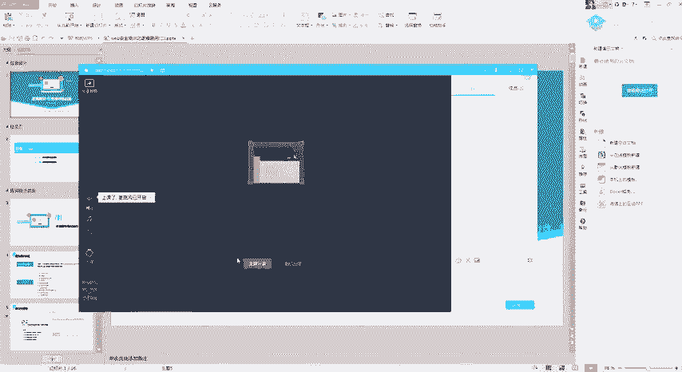
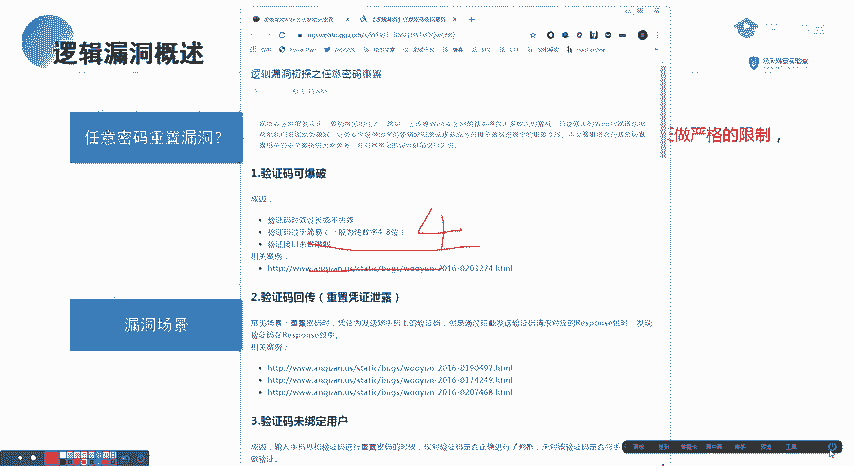
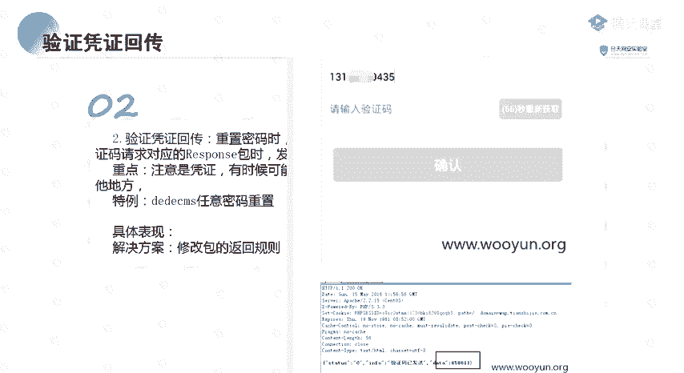
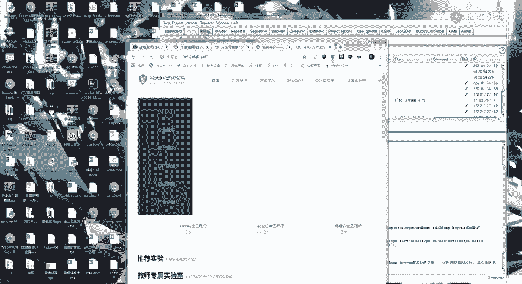
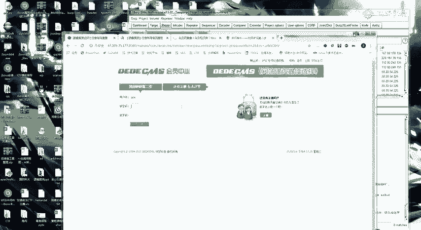
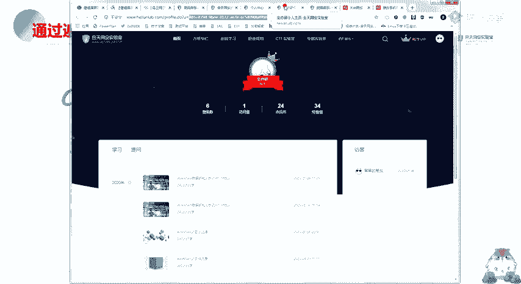
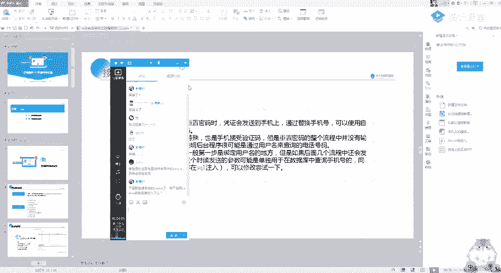

# CTF教程：CTF初学者必备的1000个练习题，每日一练，百日成神！（ctf-wbe／ctf-pwn／ctf-misn／ctf-逆向） - P66：逻辑漏洞讲解 - 白帽子讲安全 - BV1dp4y1j7aN

Okay。

No。嗯。😊，う嗯。买谁。ね？そこにな。맞。Yeah。嗯。🎼，思念绵长延伸到眉头，送出的折柳。😊，🎼么走草几声的候。🎼这者。🎼很久。🎼你是。🎼炊烟乱四周。🎼抱了多久？🎼无常写到不朽，却为你迁就。🎼一下。

🎼不愁。🎼有些。🎼牵挂不肯走。🎼廊下的尽头。🎼他说刻在桥头里。🎼曾前说。🎼为的。🎼，🎼声色悠悠，去一捧小溪流。🎼鹅卵水下走，青蛙红桥绕村口，谁家姑娘眉眼弯弯香挽留。🎼小少年一路别匆匆奔走，声色悠悠。

纷奔糖醉如酒，像花中温柔。😊，🎼写衣被人靠惶惶口。🎼变成夜深的。🎼痛楚的针。🎼谁。あ。🎼雨下场。🎼久。🎼昔日。🎼流炊烟了四周。🎼等保了多久？🎼无常写到不朽，却为你迁就月下君。🎼无愁。🎼被写。🎼不留。

🎼牵挂不肯走。🎼暖家的尽头，传说刻在家子里。🎼曾牵手。😊，🎼杯酒。🎼年被雪。🎼炊烟落四周。🎼过了多久？🎼无常写都不休，却为你强求也将了君。🎼不着。🎼牵挂的很草。🎼冷下和轻空。🎼当说可别叫的。🎼曾享说。

🎼我会忍受所。🎼Yeah。🎼，🎼Yeah。🎼，🎼，🎼，🎼，🤧哼。Okay。啊，应该有声音吧，麦。唯音小说。Yeah。嗯。I。嗯，今天给你们发的那两篇文章，不知道你们去看了没有？뭐。

这一篇逻辑漏洞之任意密码同志。还有这里的一个。今天要讲的内容呢，主要是跟给你们预习的内容基本上是一样的。因为。我觉得吧逻辑漏洞它一点都不复杂，主要是在于一个思路。R。系。我觉得基本上就是一看就懂的这种。

好。开始我们的一个漏洞的一个讲解。学了这么久了的话，应该大家都还是有一些基础的呀。今天要讲的一个逻辑漏洞呢。就是我觉得吧在所有的漏洞里面，无际漏洞应该是最简单的那一类。但是也是出现的最多的。

看一下今天的一个讲课内容。第一个呢是任意密码修改，第二个是任意的一个账户登录。我们呃有其他话不多说，直接来看一下这一个认密码同事的一个漏洞。它的一个原理呢就很简单。就是我们在进行一个密码修改的时候。

没有对修改密码的一个凭证做一个严格的一个限制。导致可以被绕过进行一个任意的一个密码修改。简单的来说就是。哦。这一个修改密码的一个接口，我可以通过这个接口修改任意用户的一个密码。

这样说应该还是比较好理解的。它主要的一个漏洞场景呢，我这里呢是给了实0处。第一个就是验证码可以被爆破。大家应该印象是比较深的。上次给你们做的一个漏洞加解，就是因为只有4位。4位的一个验证码。

然后就可以被爆破。然后第二个验证码回传。回传的意思啊，就是他这个验证码的话会出现在那一个返回包里面。这里给你们看的一个例子，上面也是有的。你们看了一个例子。

进然也是比较明显的。其他的后面的几种的话，我们就根据一个实际的场景来进行的一个查看。Okay。首先我们来看一个验证码被包破。这个的话当然我觉得就没有什么可以说的了。就是他的验证码只有4位。

然后这个验证码的话，短信验证码可以进行一个爆破。这个很简单，就是因为。四位的验证码的话，一般来说大概。3分钟之内吧，3分钟之内可以把1万个数据给跑完，那就可以进行爆破。电然也不多说了。

但是呢要记得看一下。他卖一个4位的。等一下。

掉了吗？哦。刚刚刚刚可能哪里波动了一下。嗯，还是回到这里。这的四位我们是看过的。我们看一下它的主要的一个要点呢，就是我们验证码可以报货的一个要点。出现的最多的就是一个4位，然后没有对这个验证的一个次数。

还有时间做一个限制。这个大家比较详细了。但是呢另外还有两种特殊的一个例子。第一种也是6位的。就是虽然是6位，但是他没有对验证的这个次数进行一个限制。然后他可能一个验证码的一个时间可能有2个小时。

有效时间有2个小时。然后的话你也可以进行一个爆破。第三个就是验证码，它不会过期。这个是什么意思呢？就是比如说一个正常的逻辑来说，就是我得到了一个验证码啊。

然后这个验证码的一个有效期大概可能是10分钟或者半个小时。但是实际啊有一些有一些地方。嗯。也可能是10分钟或者半个小时。但是实际啊有一些有一些地方。嗯。点错了点错了，我的我知道为我知道为什么画面没了。

😊，We呢。有点傻了，点错位置了。我是要关画板的位置，然后把那个关掉了。他的一个。验证码的一个。过期就是不知道你们有没有尝试过呀，就是我手机。手机上接一个验证码，它会告诉你一个有效期，可能是半小时。

可或者可能是5分钟。但是实际呢它有可能。一天都不会消失，就是我不去验证的话，它可能一天都不会消失。这就是一个验证码不会过期的一个表现。但是这一类动的话不建议去测呀，嗯浪费时间有点久。

最主要的还是第一个思位。还有一个6位，6位的话，你看他验证次数有没有做限制，还有一个时间就可以了。很简单。然后呢，这里呢有一个特例。是对IP的验证进行的一个测速验证。当然这个呢在国内它是不会是被忽略的。

国外的话，facebook之前是出过一个这样的漏洞的，所以这里我不会多讲，你们大概理解就是我1个IP就是我啊你们在微信微信以擎不是有投票嘛？它可能是根据IP来判断的。他是根据IP来定证这个次数的。

然后看一下验证码的一个凭证回传。这个也是出现的特别多的呀。呃，这里。他就是在重置密码的时候。他会把这个凭证发送到手机上嘛？但是就例如我们刚刚的这个例子，它这个返回包里面呢，它可能会带有一个。SA啊。

就是一个验证码直接带在这个返回包里面了。然后。的话要记住这个点了。这不仅仅是验证码呀，还有可能是一个凭证。这里的话呃待会儿我会给你们看一个比较特殊的一个例子，就是。啊。当时我遇到的是一个这样的一个站。

它验证的不是就是它重置密码的凭证并不是验证码呀。这里的话后面我发一篇文章给你们看你就知道了，一定要记住啊，是凭证，不是。是凭证无限验证码。这里呢就是一个乌云的一个例子，你们可以。

去网上搜就是乌云的那一个漏洞库。因为你们可能。去搜一下无云的一个迹象吧，就直接你百度搜一个无云迹象。然后就可以看很多的一个比较久的呀，比较久以前的一些漏洞报告，当然也是。挺有一个参考意义的呀，这些。

什么内心的内洞都有。然后呢，有一个特殊的一个例子，就是我们的一个德个CMS的一个验证码的一个重置。

啊，我这里先给你们看直接看吧。

他这里呢。他这个都是CMS呢，是什么样子的？就是因为。它访问到这个链接之后，在那你看这就是访问我们的这个链接。这个ID呢就是我们的个user的1个ID，就是用户的1个ID。然后呢。

在我们的1个BP的一个抓包里面。就可以发现，就是我根据这个ID的变化。在这个位置。它会产生一个重置密码的一个链接。就是在这个SPL里面。自然也可以叫一个重置的一个凭证。呃，当然给你们的一个。

是8080端口呀，现在改了。给你们的这一个多嘟CMS里面。我把这个发群你。给你们的靶场里面是有这样的是有这样的一个漏洞实验的。然后我就根据这里面的这个链接，然后就访问到了这个。重置密码的一个页面。

然后输入。账号密码它就修改成功了。呃，我看一下治疗。这里的话。我们看一下它的1个URL。Yeah。你看他这里有一个非法提交。但是我们这里呢用BP抓包。当然这里呢这里我不是教你们怎么去密码重置。

而是让你们记住这样的一个思路。挖国机漏洞注意它重要的不是一个漏洞场景，而是一个漏洞的一个思路。这也是跟其他漏洞有一个。不一样的一个地方吧。我刚开始入门就是通过挖逻辑漏洞进行一个入门的。谈一下。

10分钟之后尝试。啊，这是因为我点了点了刚刚那个ID等于一啊，比较尴尬。改一个看你怎么样？然后跳转到修改页面。就是这个位置。你可以看到。ID等于2。然后呢，这里呢就会有一个同步的1个UL。

我们把这个就把这里面这个链接扩别过去。呃，注意这两这里是经过编码了的。改成这样。可以看到这里就可以修改它这个test的一个密码。这里其实偷偷的说一句啊，以前就是呃。以前其实。其实包括。

包括何天啊，何天的话，我以前都是挖到过一个类似的一个密码通知的一个漏洞。就是因为有一个验证码的一个返还，只是那个接口比较难找。

其他的你们可以就是如果还是没有搞懂的，直接可以去这个无名的这个网站搜。看一些相似的一个案例。其实看两个案例，你基本上就完全了解了。但是他可能有点卡呀。

然后我们再来看一下第三个。

就是一个验证码，没有绑定用户。呃，例如这俩。他这里的一个意思呢就是。在进行一个验证重置密码的时候，它只对验证码进行了一个正确的判断，但是没有对该验证码是否与手机号匹配进行一个做了一个验证。

他这个是什么意思呢？就比如说啊你有两个手机号，对吧？你两个手机号。然后呢，我随便获取一个验证码。我随便获取一个验证码。这他自己的表现写的很清楚了。然后我这个验证码可以。他只验证了这个验证码。

他有没有发送过，但是没有这个验证码绑定的是哪个手机号？那我这个A手机号的一个验证码就可以用来重置B手机号。它的一个具体表现，你可以看这里。这里呢是一个邮箱啊。就是他在修改的时候。

我直接啊我直接任意修改这个邮箱就可以了。我这个验证凭证根本就没有绑定。然后这里呢还有一个另外的一个案例。这样你看这里是两个手机号。然后获取验证码。先用自己的一个手机号去获取到一个验证码。然后呢。

看到没有？这个6954，然后这个验证码是正确的那我再把这个手机号改一下，点击下一步会发现居然可以修改另外的手机号的一个。密码。这个的话应该也比较简单啊。可以看到。Yeah。然后再。讲样第4个。

第4个很奇葩的一个例子啊。就是一个前端验证。应该你们在学那个文件上传的之候，就知道有一个前端的一个验证，对吧？就是我这个验证码是个假的。我只根据这个前端。就是我这个验证码是写在我前端的1个GS里面。

前端的GS里面。他这里只验证了这里的。验证码有没有跟我这个GS的一个验证码相匹配？如果相匹配的话，它就是正确的。它的一个表现就是。他在前台进行一个对比，然后在GS里面进行对比。

第3个还有一个修改返回包的一个操作。修改返回包的操作的话。呃。这里的话也有。刚好今天有个同学问了一下，就是。BP怎么修改返回包？我之前记得是跟你们讲过的呀。就是。BP我们这里，比如说我抓个包。

然后这个位置右键。右键。嗯。右键这里有一个抓返回包的一个操作，在这个位置。我们看一下它的一个区别啊。你看到没有？这就是我这个包的一个请求。然后我随便添加一个。他修改的是前端的东西啊，没有什么用。

你看它这样就是不是有弹框了，但是实际没有什么用，它只。他只能嗯就是修改前端的一个东西。他服务器上的东西是不会修改的，你可以看。当然这里啊这里是特别特别奇葩的场景才会发现的，基本上是不可能的。

最多的最常见的就是前端认证呢，还是修改粉回报。再来看一下第五个叫跳过验证步骤。他这个是什么意思呢？就是他对这个修改密码的一个步骤没有做校验，然后导致可以直接输入这个最终的修改密码的网址。

直接跳转到这个页面，然后输入新密码就可以重置。这里的话我是写了一个测试的一个过程。就是你先用自己的账号走一遍流程，获取每个步骤的一个页面链接。然后记录输入密码的对应链接，重置他人用户时。

然后获得验证码后。直接进入这个输入新密码对应的链接到这个界面。诶。同样的给你们举个例子看。啊，这天举例吧。首先我们的一个验证码。就是忘记密码的一个。你首先看啊。我们的一个忘记密码的一个操作。

首先是获取验证码。对吧。获取使金证码。然后你注意看链接啊。这里呢是获取手机验证码的链接，我点击提交。我点击提交是不是直接到了这个页面？对不对？你看。然后呢。这个链接就是我不经过前面这个链接。

我不管这个了，我直接输入这个页面。他是不是也能修改密码？这样就相当于直接跳过了。当然我这里呢是因为我这一个验证的手机号跟这间验证码呀，在这个前端，所以是不会有这样漏动的。系。简单的说就是我在。哦。

我不管前面这个重置密码的链接，然后我直接就是我不管这个页面。我直接copy这一个链接到另外的一个服务器上面打开。Oh。这样就相当于是跳过一个验证的一个步骤。这个也是很常见的一个场景啊很常见的一个场景。

大家可以仔细的记一下。基本上你们挖两，只要两个挖两个任意密码，同知，你们的学费就回来了。然后第六个就是叫托ken可以被预测。他这里的表现是什么样子呢？呃，我通过举例来说明吧。

首先我们可以看到一些重置密码的一个链接啊。存输密码的一个链接。诶。也是这种它会发一条重置密码的一个链接过去。然后呢，我们可以看到。这里呢。他就有两个东西啊，这个是验证身份的，这个不用管。

这个呢就是我们的一个最终的一个。Token。就是随机生成的。如果这个token它可以被预测。他这里的几个表现是四种的。其实。总结起来就是一句这个token有规律，我可以把它给拆出来。我们看一个案例。

这里是乌云的一个例子。他这个位置呢你可以看到。他这里的一个托ken。是在这里对吧？是1个77什么什么什么东西，然后去CMD解密是得到这样的一串数字。然后呢，他又用另外的一个又验证了几个。

就是你可以看到它这个数字是不是都是基于这个进行一个变化的。这是有规律。或者是它是一个递增的。然后呢，你可以看到看一下它的一个对比。只要后面的思维不一样。然后因为有规律嘛，有规律的话。那就可以直接。

根据这个规律进行一个把那个同置。密码的一个链接给它给推出来。然后就达到了一个任意密码存置的一个作用。应该还是比较简单的吧。前面有没有什么？前面有没有什么不理解的，就是那一个漏洞。

我感觉逻辑漏洞应该就是一个思路。记住就很简单了。嗯。没有的话就可以看几个，就是跟平常有一点点不一样的呀。这是我们的一个逻辑漏洞啊，你要记住啊。逻辑漏洞是什么？就是一个程序员的一个逻辑的一个问题。就是。

你要在他的一个基础上，就自己想一些东西。就例如这个漏洞啊，就是。他会同时向多个账户发送凭证。他这个是什么意思呢？给大家看一个比较有意思的一个图。它这里呢是一个获取验证码的一个页面，对不对？正常来说。

我们的一个手机号。就是填自己的一个手机号。但是他自理了。他这里用逗号隔开填了两个手机号。然后结果就得到了这样的一个页面。就是两个手机号，它都接到了这个短信。然后这两个验证码都是一样的。

那我是不是就可以重置任意的一个手机号的一个账号？这些思路的话应该也是没有想过吧。呃，然后的话这个接收端可以被篡改，基本上我是。叫什么呢？就是我觉得这种情况很少出现吧。同样的给你们看一下那一个例子啊。

我以前是。挖VIP分效的话是挖过一个。认密码重置的一个漏洞的。就是他有一个判断嘛。啊，直接这样跟你们说吧，他有一个这样的一个判断。啊，首先你有一个过程。就是首先第一个。第一个是验证一个验证码，对不对？

第一个是一个手机验证码的一个验证。对吧手机验证码对不对？然后第二个。然后第二步就是修改手机号。就是我这个验证码我直接通过了呀。手机手机号跟验证码啊是正确的。我这里通过。然后第二步。

就是验证这个手机号进行一个修改。就是修改这个手机号的一个密码。然后他可能还有第三步。就是可能会有查看这个手机号是否绑定这1个UID就是你这个用户。嗯，这样讲不行呀，我给大家看一个例子。

现在现在的话它是修复了呀，我给大家看一个简单的一个例子啊。嗯，给大家看一下。这是一个更改手机号的一个位置。这里我随便我先输随便输一个手机号啊。呃，我看一下啊。手机号是。报取验证码。

你看一下这个位置的一个验证啊。嗯，你可以看到这里呢除了一个。D。他们改了吗？应该没有吧。白。哦，用手已经绑定了。嗯。他们当时的话是这个地方应该是还有1个UID的。原来的一个场景是这样的。

就是我除了我这个验证码。然后我还有这里有个username，还有个UID等于123。然后他就是根据这个UID来判断是哪一个账号要修改手机号。然后我当时我通过修改这个UID就可以。啊。

修改别人的一个任意的一个手机号。然后第九个场景，最后一个的话基本上是基本上是预不到呀，基本上遇不到。又是一个万能的一个验证码。因为很奇葩的一个厂景，可遇不可求。

所以你们就当就当有呃就什么就当增长一个芡势。这个我觉得去试的话是很浪费时间的。呃，然后你们对前面的这几步啊，就是前面的这9个案例有哪一个不理解的？你们可以在这里。提问一下。

因为后面的后面的一个任意账户登录跟这一个密码修改基本上是差不多的。前面理解的话，后面基本上也就理解了。呃，没有。没有的话，我们就再来看一下一个任用户登录的个漏洞。这里我觉得主要还是要靠大家去实操呀。

这个讲的话，你你只能听一个思路而已。任意用户的一个登录，前面的任意密码修改是跟这个是重叠了的，懂吧？这个是重叠了的。然后他任意用户登录的话，有几种场景，可能是跟那一个任意密码修改有一点点不一样。

我这里呢就稍微列了出来。它的一个定义呢就是逻辑错误，可以导致任意的个用户登录。然后账户可以用得到一个用户名啊，然后通过验证码登录。好吧。我们主要还是呢逻辑漏洞，看场景。首先第一个是验证码的一个回显。

这里的话就不多说了，跟那就是你手机在验证码登录的时候，它那个返回包里面有一个验证码的一个回显。然后第二个就是修改返回包进行一个登录。这里的话同样的给你们看一下一个比较有意思的一个场景啊。啊。

我们抓一下登录的这个返回包呀。这是我的一个账号密码登录，对不对？我们抓一下它的一个返回包。啊，可以看到这一个返回包呢，就是我们登录的一个返回包。好吧。我现在这挂着。然后我就把它给放出去。

这就是登录了我的一个账号，对不对？那我再换一啊，我再换个浏览器啊。对。呃，然后我再随便输一个账号。我同样的我抓他的一个返回包。好吧，这里应该是一个登录错误的一个位置啊，在这里。

这才是他的一个登录的一个box。可以看到他在返回啊。邮箱或密码错误。我们就把这里改一下。改为我的一个刚刚那个账号。发现了什么？我这个账号我登录进去了。这里呢就是因为这个返回包。

它这个返回包里面有什么东西呢？呃，我们看一下我刚刚的一个copy的一个返回包。他这里面有1个GS。对吧。我们和天的话是根据这个GS来判断有没有登录的。但是有一些情况下有一些情况下。

他他那一个包可能直接就是这个样子的。就是你所有的参数都可以自己构造。然后根据修改这个返回包里面的，比如说这个UUID修改这个ID就会进行一个登录。我们看一下同样的，看一下这个UU支付的一个例子。

它这里呢是在重置密码的时候。修改这个返回包。重置密码的时候。把这个修改成功的返回包给抓到，然后copy下来。然后呢，在第二次抓包，就是我随便输入第二次抓包，然后把这个错误的信息改为一个正确的。然后呢。

他就会发现他这个身份认证直接就跳转过去了。然后到了这个重置密码的这个位置。然后他就是。修改通过这个修改数据包，然后就跳转到了这个页面。修改成功。这就是一个修改返回包的一个经典例子。嗯。

然后再看第三个场景，就是通过修改us IDD。自然也是一些比较奇葩的一个东西啊。我觉得是比较奇葩的一个东西。嗯。我先不讲这一个，我先讲一个简单的一个类似的一个例子。啊，就拿我们的网页实验室来说。

你比如说。我点开一个人的一个页面，它是不是通过这个U等于多少来进行一个判断的对吧？U等于多少。你看。根据这个参数来判断的。你这一个人就是你这个人的主页是多少？然后呢，有一些场景就是我点开我的个人中心。

也是通过这一个。这个什么IG来判断的。

就是他可能会是有一个这样的一个场景UID等于1234呀。比如说有可能是这样的一个场景。然后我通过修改这个UID1234123456。就是便利这个UID就可以达到一个任意任意登录的一个效果。

就是有这种场景，你们要自己去尝试。这个呢VLCMS的一个任意登录也是。就是一个特殊的接口。登录的时候有一个特殊的接口。它是根据这个UID来进行一个判断的。然后我修改这样这样的一个任意的一个。

我修改这一个任意的1个UID就可以达到一个任意登录的一个目的。然后万能。这个注入的万能密码的话，我就不多讲了啊。因为这个在斯刻猪的时候，应该基本上是讲过的。你看这条例子。他一个登录的是这样写的对吧？

usname等于的命。然后我再在后面添一个这样的一个语句，这一条是我们自己添的。根据它的一个条件判断。沃一等于一哦是一。然后0或一，它就会返回一个正确的。然后万能密码它的一个简单的一个讲解。叫什么？

就是。通过这个word判断吧，然后这是一个叫什么入署符。把后面的这个语句全部给它划掉了。然后我们看一下这一个四客语句就变成了一个UCM等于的命过一等于1。然后他这个语句。视为一。好，数据库就执行正确。

它就执行了这个USfin的余的命进行了一个登录。是有系个万能密码。最重要的就是出现的最多的，我觉得出现的最多的。是一个。系统的默认口令啊。呃，我举个最简单的一个例子啊。就是我以前的一个学校，对吧？

我读大学的时候。我们当时的一个教务系统，它的一个密码是这样的。啊，他的。账号跟密码是一模一样的，没有修改的，账号跟密码是一模一样的。或者是说有规律的，好吧，或者要不就是默认口令类似123456。

那这里如果我知道别人的一个学号，那我就是不是可以登录。我记得我当时是呃随便试了一下自己的学号呀，或者老师的工号，有很多没有修改密码的呀，然后直接用那一个账号加密码。账号跟密码因为是一样的嘛。

然后直接用相同的一个账号密码就登进去了。当然我就没。🤧嗯。当然登进去的话，千万别搞事呀。以前有一些前辈就是因为利用老师的账号进行一个登录，改自己成绩就被查出来了。常用的话还是学校比用的比较多。

可以看到这是我拿的某个学校的。大量的绕口令。最常见的入口令还是123。lio。最常见的还是这一个，然后还有什么al的命啊。得命 root这一块。系统的一个默认入口令，别人没有修改的。然后看一下一个装库。

第6个。叫装铺。大家应该还记得我给你们讲过的一个施工库吧。施工库。社工库里面呢应该是这个功啊。顺工库里面呢就会有很多的一些呃。以前用过的老密码，然后可能别人就会拿这个老密码去碰撞你的一个账号。

比如说登录京东啊，或者12306啊，或者一个淘宝等。最常见的就是。19年吧，就是18年啊。18年的时候，12306的那一套数据。这套数据的话都是经过一个装库来的呀。但是啊这个excel表我们去试了的呀。

给的基本上是可以登的，然后每一个账号里面都有十几个身份证，因为是关联了家人或者什么的。这家装库。然后给你们看一下乌云有一个，我觉得有一个很经典的一个例子吧。嗯。Y。没看见呢。No。呃。

登录返回包里面有特有用户的cookie。嗯。如果有CS的话。基本上是没有危害的。基本上是没有危害的。就是除非你有CRS，比如说我通过这个CRS去读取到了别人的一个账号，就是读取到了他的一个cookie。

但是基本上是没有用的呀。这里好像看不到了，我就具体讲一下吧，就是因为呃他通过一个邮箱。就比如说这是我们的一个企业邮箱。通过一个邮箱。然后再去。查找到了一个公司的一个邮箱，然后通过那个邮箱呢就去查社工库。

然后通过社工库查到了密码就是旧密码。然后你用那个旧密码发现可以登录别人的一个邮箱。然后就在那个邮箱里面找到了很多东西，包括一个域名的一个接管呢，还有什么东西，一大堆吧，反正大概就是一个装库，利用施工库。

然后第七个就是一个cookie的一个混淆。最常见的就是类似这种了。你们在cookie里面应该是见过很多有这种通过user IDD呀，或者什么student ID。来判断他这个当前用户登录的是什么。

对不对？然后修改这样的1个ID的话，就可以进行一个任意的一个。任意的一个账号登录。具体的案例的话呃，你们可以去搜一下CMS啊。可以去搜一下CMS，然后我记得给你们的靶场。game的靶场是这个。

琼海CMS吧，琼海CMS的一个后台。熊海是哪一个黑名色球？具体忘了啊具体忘了，好像是这个CS。他有一个任意的一个。登命的一个任意登录，你们自己去搜一下，把这个题目做一下。然后基本上的一个作业。

作业就是这4个CMS。整个逻辑论门考核就是这4个。课后作业的话，你们可以去做保安实验室的那一个。逻辑漏洞专题的这一个常规业务的一个逻辑漏洞，我是发给你们的。可以去做一下。密码找回漏洞。是的。

有很多很多例子呀，逻辑漏洞全在于你知道思路，然后去做一个场景就会了，特别简单。好，今天的话一个分享就大概就这样了。待会儿我给你们发一点点实力，就是实际的一个场景在群里面。你们自己去练习就OK了。

然后今天有什么问题吗？有的话可以简单的提问一下。不是读取到它的 cookieookie就可以cookie直接进去吗？对呀，但是问题你怎么才能得到它的一个cookie呢？因为你是登录的返回包呀啊。

我比如说我登录的位置，你首先要确定一个我我为什么会返回这个cookie啊？我这个返回库里是因为我账号密码输入正确了。输入正确了，然后我这个返回包里面才有这个空题啊。你说对不对？啊。

如果我知道他的一个账号跟正确的账号跟密码，那我干嘛还要别人的一个库呀，我都知道账号密码了。还有没有其他提问的？好，没有的话，我就下课了。待会儿大家记住啊，逻辑漏洞全在于多练了，还有一个思路。

如果思路还是不清晰的，大家就是看一下PPT我待会儿把PPT发给你们。其实我觉得基本上看一遍的话就OK了啊。

好，下。