# CTF教程：CTF初学者必备的1000个练习题，每日一练，百日成神！（ctf-wbe／ctf-pwn／ctf-misn／ctf-逆向） - P68：课程考核讲解 - 白帽子讲安全 - BV1dp4y1j7aN

对。🎼燃烧华丽的烟火绽放一。🎼就足够了。🎼舍求舍。🎼无名之辈。🎼我是谁。🎼是谁？🎼谁不是。🎼经走到生命。🎼的结尾。🎼也是很。😊，🎼的狼狈，也许。😊。

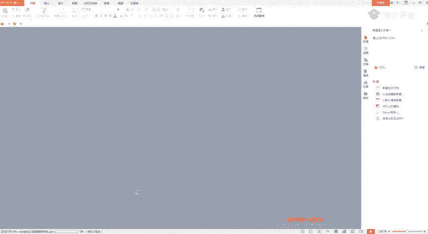

🎼真为。🎼也许有。🎼我是谁？🎼无所谓。🎼しし。🎼不是的。🎼ビス。狼狈。🎼也许被为。🎼谁想来？🎼当是一。🎼尽管笑我。🎼我是谁，忘了谁也无所谓，谁不是拼了命走到生命的结尾，也许很累是狼狈，也许卑微甚畏。

也许永远也成为不了谁。😊，🎼无名之辈。😊，🎼我是谁？🎼无所谓。🎼你是谁？🎼的光。🎼不是代。🎼也许。😊，🎼的狼狈。🎼也许卑微。🎼认为。🎼谁生来？🎼都是一。🎼关上我。🎼管家。🎼Go个绑在幸福贵。

🎼I like keep back so。🎼Se you sorry before the damage。

 and you pick get the pieces put up and look back together。🎼别起所。🎼在这。🎼So。🎼在开窗情情慢慢。😊，🎼这。没。🎼我觉得。ま。🎼我又美你。

我有没。えね。🎼Feeling。🎼Can help。🎼Little skipboard is a subtlefish。🎼Becauseuse the phone is love。

🎼there's no for。🎼This。う。🎼梦是 feel算 right。😊，🎼我。🎼白穿的青春暖。🎼Yeah。🎼我有没。🎼ど。🎼加你。🎼でも全福。🎼我想爱你我想爱。🎼。

🎼Tell me all you sweet， sweet little lies。 Other about the dark places you hide。

 Tell me all your problems。 Make the mind。 Tell me your your sweet， sweet little lies。

🎼I live a picture in my head color soing I suffered but my body in my bed yeah。

 and I wonder from this or the white light take So I wake up in the flick or。

🎼going off because don't that I train thinking about this shit。 I'll never tell you that。

🎼I can shake it off。🎼One piece and rice， but you。🎼Really wanted was a friend。 Tell me are you sweet。

 sweet little lies。 Other but the dark places， your high。 Tell me all your problems。 Make the mind。

 Tell me are you sweet， sweet little lies。

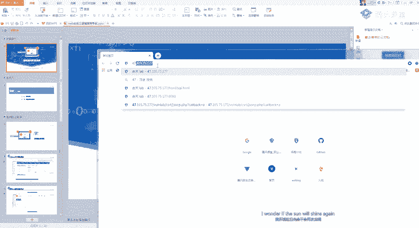

🎼get。🎼Bas。

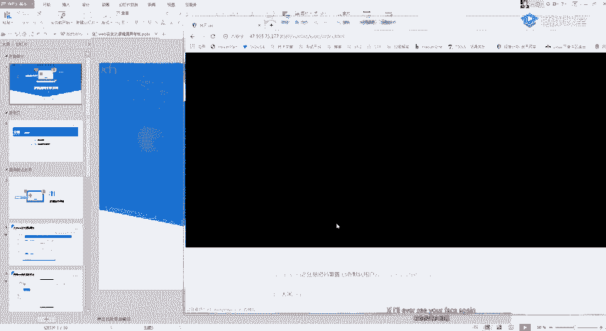

🎼Rther die then say goodbye。 So他们要也随 see。🎼Its nice fantasy。 It's when I teleport again。

 I gotta speak you。 We can go on paper time。 We can Yeah， We can really trans and all。🎼有。

🎼They can get。🎼F two， if you play your part and not play my。🎼I'll never take my eyes off， yeah。

🎼没有也岁岁。🎼自己还。🎼Tell me all your problems。 Ne the mine。🎼没有一岁岁。🎼TheSo。🎼And can。🎼If let see。🎼Ba。

🎼Rather die than。🎼Goodbye，在他们摇夜岁岁。🎼随。🎼岁岁。🎼爱想你。🎼最早。🎼岁岁。🎼I love the picture in my it。

 but I know that it's not。🎼I love a picture。🎼Cause I like God makes me feel。🎼没有也岁岁。🎼我的走。🎼谢起爱。

🎼他们要也 problem。🎼The my。🎼当美摇叶岁岁。🎼And again。🎼Lo to see。🎼Bas。🎼的代in say goodbye。 so Tom们 are也 sweet岁。🎼随岁。

🤧哼。😊。

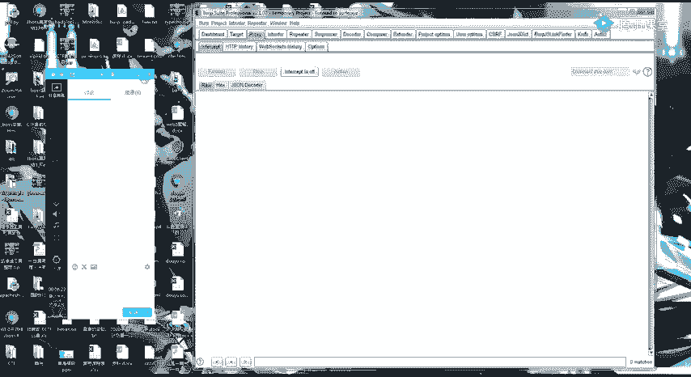

Yeah。Yeah。看一下啊。麦有声音吧麦有声音吗。哦。还有一分钟吧。开始今天的一个内容的一个讲解。今天呢主要是对之前的几个题目进行一个简单的讲解。然后呢，在后面我会讲完这几个题目。

我会给大家看一点点就是逻辑漏洞里面的一点点的一个脑洞吧，或者是说我的挖逻辑漏洞的时候的一点点经验，也会给大家讲一下。然后大概就是分为2块，第一块就是一个考核的一个讲解。

然后第二个就是逻辑漏洞的一个老动物片。我们首先来看一下让你们做的那几个题目呀。首先第一个是大米CMS的一个支付逻辑的一个漏洞。也就是这一个。这个大米CMS。然后交这个作业的话。

我暂时就看到两个同学交了呀。嗯。你们没有做的，可以就是自己找时间做一下，然后把作业交给班主任。我们先看一下简单的一个步骤。这里呢我是随便注册了一个admin的一个用户，名字叫。然后呢，我随便注册之后。

就去找了他的一个工程案例，就是它的一个产品，然后点击一个购买。然后呢，这里在购买的时候就进行一个简单的一个抓包。这里修。然后呢，就看这个包里面的内容嘛，把这个数量一改为-一。他就实行了一个。看到没有？

就这个位置实行了一个赚钱的。就是昨天给你们说的嘛。变为了一个赚钱。然后这里数量-一，加个6000。就可以看得到。这个约里面只有12000。这里呢我们进行一个简单的一个演示啊。首先注册嘛。

你随便注册一个账号。注册账号这一不就不多说。好，我们看一下看一下注册账号之后。他这里是一个购买的一个功能嘛。然后在这里呢就会有一些产品展示呀或者。网站案例啊对吧？这些东西。一般来说。

产品嘛就是在这个里面。然后我们首先看一下，随便点一个产品。5000多6000多。应该还记得吧，我跟你们说，所有的逻辑漏洞基本都是基于一个抓包改包来的。这样我首先你就随便点个购买嘛。这里也随便填。

然后一定要记住啊，这里有一个付款的一个方式啊。因为如果是支付宝这种的话，没有配置。然后这里呢就是选择一个站内的一个扣款。因为你想一下，如果是货到付款的话，它这个负一肯定也没有用。

然后这里如果是支付宝的话，那肯定也没有用。那我们就选择一个站内的一个扣款。然后在这里抓包。应该还记得我跟你们说吧，逻辑漏洞就在于你对这个包的一个。认识清不清晰。这里你们来听我说，你看首先我们看这一个。

包里面的一个东西，它的价格是5400，对吧？然后这里是我的名字，这是我的电话。然后这里有一个一肯定就是一个数量，对吧？然后这里呢就是它的名字，还有什么t呀？这个ID就是这个东西的一个类别。

这样这样来看的话，这个包应该还是比较清楚吧。你看。那我在这里把我的一改为一个-一，看一下。订单提交成功。发上我的订单。价格5400-1。然后看一下在线充值，我要提现。是不是就赚了。1万赚了1万块。

那我们再再来试一下，就是除了。他这里呢除了购买这个价格，因为刚刚我们看了有好几个包，对吧？比如说他这个5400的包。我们再简单的试一下啊。然后我们再抓一个包。那我们是不是也可以继续改这个价格。

我把这个价格如果改成1个-5400呢，行不行？试一下。你看也提交什么了。但是这里呢你可以可以看到它这里是没有发生变化的。然后再看一下我的一个价格。只要5400了。所以说就是我们在测支付逻辑漏洞的时候呀。

他这里的每一个参数你都可以。定点的去测一下。每一个参数，因为它有可能啊我这个价格的参数它是正确的做了判断。但是我这个数量又没有做判断。因为你可以看里面出的价格，还有数量，还有这个ID。

这每一个都可以去自己。进行一个变换。所以说他这个支付逻辑漏洞就是这么简单，只要会抓包改包就可以了。这个有没有不懂的，懂的话，你就扣个一。不懂，我就继续问。好，大部分的话应该是因为比较简单了。

你就这样转思路嘛，就是我抓到改包就OK了。我在上传订单的时候抓包，然后改一个包。哼。然后我们再来看一下这个熊海CMS的一个。老动。这里呢我觉得呃你们做的比较好呀，因为你们记住记得我以前讲过。

就是发现1个CMS去百度进行一个搜索。因为我自己呢主要是考逻辑漏洞，所以我这只把一个月权给你们列出来了。然后我看有同学交的作业啊，包括熊海CMS的一个四个注入呀，还有一些四个四个注入。

还有一些其他的一个漏洞也都写在上面了，这一点思维就很对，因为我们挖漏洞，漏洞是怎么来？你肯定要用不常规的思维啊。啊，叫什么黑客的思维能跟我们普通人啊能跟普通人一样吗？肯定。肯定要不一样，对吧？

想的要比较多。🎼这里呢其实也很简单，我记说我是跟你们讲过，就是有一些CMSS呢。它是经过cookie这个位置呢来进行一个判断的，就是。cookie里面的一个user name来进行一个判断的。

这个琼海CMSF呢也是这样的。他这个熊海CMS的一个判断就是。呃，首先我们来抓个包呀。熊海是MS。

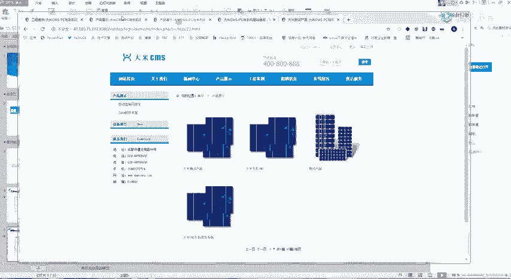

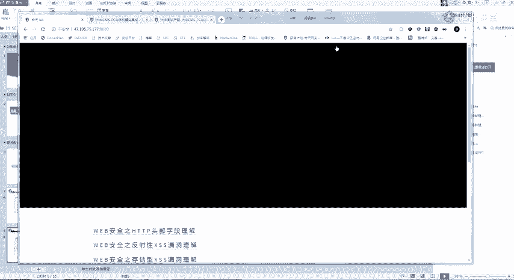

它这个CMS呢是一个后台的一个漏洞。我们看一下，首先我们来确定一个东西啊。首先要知道参数。里面书。还是同样的，我跟你们讲过嘛，逻辑漏洞一定要熟悉每一个参数，不管是逻辑的，其他漏洞也都一样。

就是每个参数有什么用。首先第一个R等于logan，是不是这一个页面就是叫什么去了？这个登录的一个页面。这个R得是一个位置。然后这里用户名密码这里就不用多说了。然后我们先正常用一下用户名或者密码错误。

对吧。你看。如果我在这里啊，加一个us name等于go的命。可以看到它还是一样的，没有用。那是因为呢我这里的一个。我自己的这个位置，它一直调用的是这个logan的一个页面。那我们如果要跳转到后台。

是不是就要找一下后台里面有哪些参数啊，对吧？就是有哪一些页面。你可以看这是他后台拥有的一个页面了。当然你可能会这样子跟我说，就是。哎，老师，我拿着这个赞，我我怎么知道他后面有这些东西呢？对吧。首先我们。

拿到这个东西呢，听思路啊，有两种办法。第一种它是1个CMS，对吧？CMS是什么呢？就是开源的系统CMS。什么叫CMSF啊？这是共享免费的开源的。那我这里第一种办法，我就是去搜熊海CMSS。然后我去下载。

给他下直接下载一个源码。然后我们就可以看到里面有哪些目录了，就是你直接去把它这个代码给下载下来。然后包括你看这随便一搜都可以看到它这里有很多的一个漏洞。自己去下载源码。嗯。对吧你看这里很多。

然后我们随便下下来。这边下载下来就可以看到啊，就是在他的后台这里就可以看到它的一个源码。那我们这里呢如果我这里改个Y，改成哎。可以看到这己就要跳转。他这还是跳转到登录的位置。我们这里呢就还是同样的。

先抓个包。减天素。不说吧。就森那还是优所去了，我都快忘了。看一下啊。有声呢。然后这里改成。index它不行，那我就再挑一个这里啊，这里有很多。那我就再挑一个嘛。比如说他等于。WCI。还是没跳整过去。

难道是呃。我再看一下啊。And mean。然后再随便选一个。改为一个get类型试一下。还是跳转到弄的。那是不是这里是一个user呀，不是user name，可能是我记错了吗？这里是user呀。

你可以看到这里是我记错了。我们再来改一下。登录。然后这里加一个US。要证明。然后呢，这里再重新的。选一个。这个是吧最常见的。可以看到。我直接跳转过来了。所以这一题呢也很简单。

就是在这个cookie的位置啊。在这个cookie的位置。哪里去了？嗯，可能不见了，在这个cookie的位置加一个user。人为的命在这里。这里呢就是第二题。所以其实逻辑漏洞都特别简单。

这一题你们有没有什么想提问的？还是同样的，你懂了的话就扣个一，让我看一下，好吧。不懂的我就再给你们讲一下。啊，如果还是不会的呢，你就去叫什么呢？自己把这三个自己一定要去做一下，就是逻辑漏断。

只要你动了手挖到挖到了第一个类型，你就知道后面的该怎么做了，全部都是相似的。呃，包括昨天在给你们讲课的时候，然后我昨天又稍微去。挖了一个也也还挖了几千块钱，你看积分又上来了。也就是简单的月权。

我就跟你说，就是简单的，我抓包，然后改个数值，发现可以变。那好，OK。一两千0块钱就到手了。当然啊就是你类似熊海CMS这种通过cookie修改的很少很少见啊很少很少见。然后我们再来看一下。

第三个就是最经典的一个月权。昨天其实是跟你们讲过了的。就是这一个。嗯。😊，完了完了。又点错了。他从运证堂这个设计的有点不科学，他这个画板。就是这个呢。think shop的这一个收货地址的一个月权。

昨天是给你们讲过了的，其实。这里呢就是跟你们说添加一个新地址，然后修改阅权。然后我要跟你们说呢，你们知道这些漏洞，这里这里这些漏洞啊，就是月血漏洞在哪个在哪些地方出现的最多嘛？😊，其实是那个。

医院医院你们懂吧？就是医院里面可能会有很多的一个病患信息。然后通过一个查询1个UID的话。医医院的几十万病例基本上全部都在里面了，发生过很多这样的事情了。医院还有学校。呃，然后你们有没有用过那个超星？

诶。你们有没有去用过这个东西啊？这个操心。要。应该应该大部分都用过吧。然后呃我这里只提点你们一句啊，我不会给你们演示，就是这个东西啊这个东西里面应该是有很多漏洞的。大概自己心里清楚就行了。

以前是超新有一个。有一个月权的一个漏洞，可以便利所有学校的一个学生的一些资料。它的一个测试就是这么简单，就是抓个包。你比如说在某些地方啊，抓个包，然后看到有1个ID。然后改一下ID就可以了。

特别特别简单。然后呢，其实今天的一个重点了，不是前面的三个考核啊。是要跟你们讲的一个脑洞片，就是我平时挖漏洞的一些。思路吧就是。因为你首先要记住一个点了。四个猪入，它是不是一个增山改查？的一个操作。

然后逻辑漏洞，你再仔细想一想。逻辑漏洞你是不是指。做啊，就是只操作过这个改的操作。登山的操作都没有。这边都没有去做过。其实逻辑漏洞里面呢。还有其他的中啊，也都会有一个增山的一个操作。呃。

然后看我首先第一个案例啊，是我昨天给你们讲的一个社工的一个案例，就是脑洞片嘛。逻辑漏洞大家一定要记住，不要局限死了呀不要局限死了。首先第一个要讲的是昨天的一个施工的一个漏洞。啊。

他这里呢从这个呼is看到一个域名的注册邮箱。这个东西大家应该还记得吧，就是我们。站长工具可能就可以查得到。在场工具。然后查一个备案，比如说我查我的和田。啊。有点卡呀，他这个。比如说查我们可田的一个公司。

这里呢就会有一个域名的什么年龄啊，域名解析啊，就是一些。简单的一个信息，但是呢它还有一个叫 who is。的一个东西。这是叉SU啊。啊。然后我们看一下。系。做一个哭意子的一个查询。

他可以查一个域名的一些备案啊，比如说查我们的一个。昨天你可以看到这里呢就会有一个邮箱。就是在哪里注册的？看到没有？这里是阿里云了吗？对吧。然后呢，他自己是通过这个会议着。查到了一个邮箱。

然后再通过一个社工库的一个查询。呃，设工库的话，因为。现在有的要涉及到的。可能要翻墙了，可能要翻墙。呃，今天有一个。有一个稍微新一点的，就是我算收工库吧，就是可以查你有没有一个密码泄露的。

我把这篇文章发给你们。你们可以去查一下，就是可能会有一些。泄露的密码。就是施工库有一些老密码。他自己的思路就是。通过这个邮箱。对吧通过这个邮箱拿到一个旧密码。然后呢。拿到这个旧密码之后。

大家应该还记得我给你们讲的1个IG007这个吧。可以可以查邮箱跟手机注册过哪哪些账号。他自己就通过这个密码呢，然后去登录一些相关的一个网站，然后又获得了这个12126的1个邮箱。

最后呢就是登录到了一个百度云盘呢，然后就拿到了很多东西啊。你看这个身份证啊，还有什么住址啥的，什么东西都有。然后就通过这个邮箱，这个密码登录了这个我们的一个旺阿里云旗下的一个旺旺。

然后就把这个域名给结持了。这是一种比较新奇的一个思路。这样你们讲。然后就讲今天的一个重点叫逻辑漏洞的。分三的一个操作。他这个思路呢也很有意思呀。就是。我在我在当时学的时候，对这个是叫什么呢？

我觉得对我有一个很大的一个启发呀。首先第一个。删除参数查看结果。啊，我举个最简单的例子啊，你们还记得我在讲CSIF的时候吗？在讲CFRF的时候。啊，包括蓝河天呢，还有包括自节跳动的一些网站呢。

是给你们演示过的吗？就是有可能啊。有可能这一些参数有可能是一个假的，就是不起作用的。一直给你们讲和天的时候是讲过这个位置的。嗯，你可以看一个数据包。首先看一个数据包。这里修改的时候。这里修改的时候。

它是带有一个。token的。对吧它就是带有一个token的。然后呢，这个托肯正常情况下，我们看到一个托肯就可能会觉得哎这肯定就没有CFF漏洞了。然后你看完之后就会觉得我们如果把它删掉试一下呢。对不对？

这就是一个憨的一个操作。然后我们看一下这一个例子。这里呢是请求一个。比较敏感的一个参数啊。一个比较敏感的一个请求。那然后他这里呢他把这个cookie给删掉了，标面的这里就是。删的操作把cookie删掉。

然后还是可以看到结果。那这个时候。你们是不是有可以有一个启发呀？呃，还是用我们这个举例。因为如果他一个浏览器。判断用户登录的话是一个cookie来判断，对不对？我们和天来做测试。

我是根据cookie来判断的。如果我把这个cookie删掉之后。这个包里面还有敏感信息。那他是不是就会存在一个未授权的一个漏洞？也就是说我们查件，然后位数权的话，那我这个参数可以任意修改。

比如说这是修改的吧，那我是不是就可以达到一个。达到一个叫什么东西去了？啊，月权的一个操作。然后我前几天的话，VIPK的那一个高危基本上是跟这个类似的。就是我一个修改一个特别重要的一个地方。

我把cookie给它删掉了。然后这里我把coook给它删掉，然后这个ID的地方。ID的地方不变，够一下，它还是可以修改成功。那他就肯定存在一个越权漏洞。因为他根本就没有判断你有没有登录。

这就是我说的一个三的一个操作。那我们的一个添加的一个操作是什么意思呢？添加的话就更有意思了。

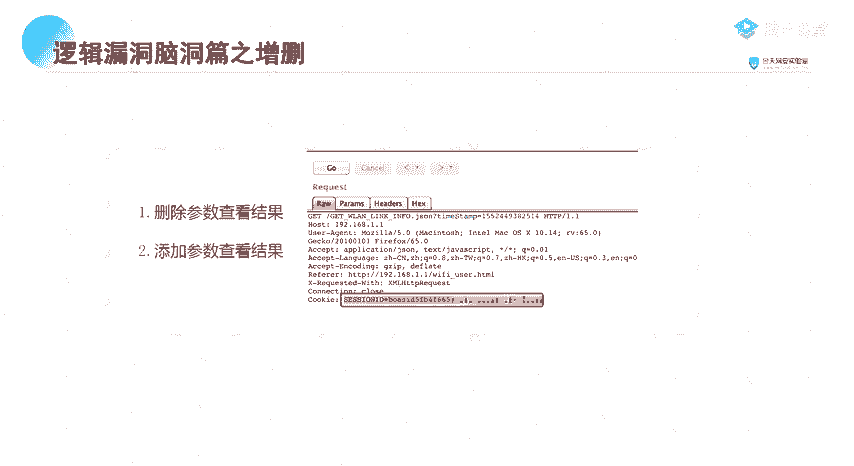

添加的话，你要记住一个点嘛，就是这个办法只适合于。你啊比较。斑点的渗透呀不适合批量的一个挖洞。好。就是我们的一个数据包里面。

可能会有一些隐藏的一个参数。

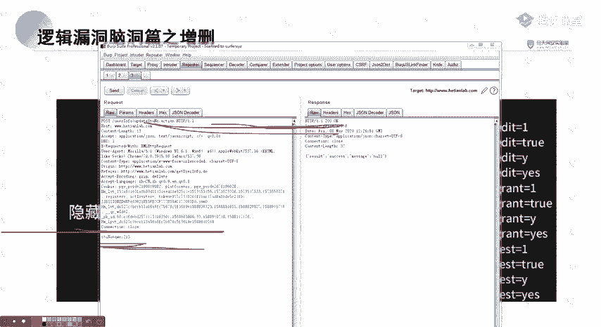

隐藏的一些参数啊，应该你们。叫哪里去了？我想一下，有个例子嗯。啊，对啊。应该你们对一个。用字典跑步录应该是有印象的对吧？

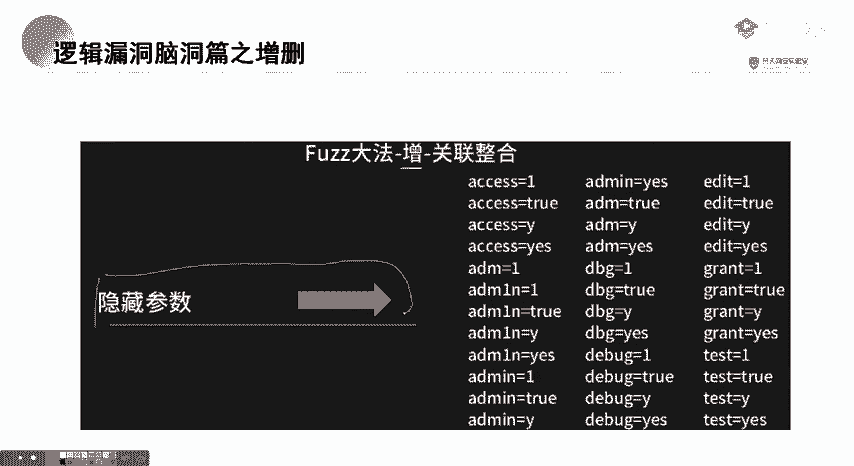

就是比如说我这个网站这里如果点不到的话。比如说我网上那个目录，它是有一些隐藏的一个目录的。那我这个参数呢也是有可能会有一些隐藏的一个参数了。

那我怎么测试呢？

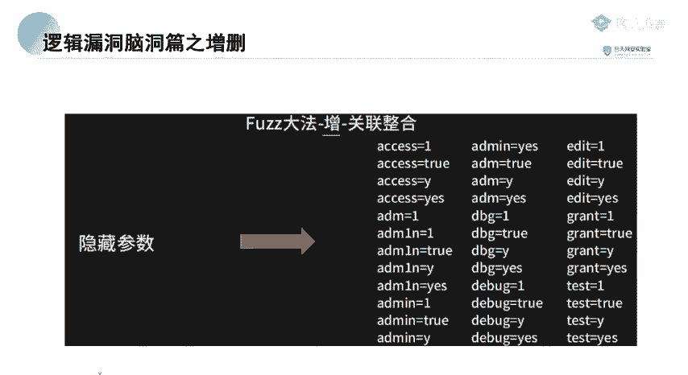

首先第一个是要有一个支点。跟你们跑目录一样，是要有一个字典。然后你把这个字典你就放到BP里面嘛，然后你就把这个参数给它。弄起来。然后翻一下字典。字典的话还是推荐你们一个字典。就是。

我们也是我团队一个师傅的一个字典。이。是一个字典。发群里啊，以前也是给你们展过的。这一个字典里面呢就会就有一些参数字典。他这个参数字典呢就是。给大家看一下。这里面有很多很多的一个字料。

HTDPDR点哎啊。诶。随便找一个呀。那我也忘记我的字典在哪里去了，有一段时间没有弄了。Call back。呃，哎，拿这个coback举例吧。应该大家还是有印还是有印象。

给大家讲的这个jasonP的一个。漏动。首先我们看这个ja省PR。大家还记得吗？就是这个我给大家说过，就是这个coll back呀，可能要自己。是通过co back来判断的。那我如果遇到这种啊。

就是我们正常的一个这种。这种ja，那我是不是他要通过增加一个co back？增加一个collback才知道有这个JNP的一个漏洞。也是我常说的一个增加的一个操作。

那我们这己就比如说我随便在这里啊打个问号，然后写个一。然后呢，我就把这个字典给它导进去。然后就把这个字点导进去就跑一下。看一下它自己有没有什么一些变化或者啥的。明。记住要把这里点掉。

它这里会有1个URL的一个编码。然后可以看一下是不是看到有一条明显不一样的。那我是不是就可以确定它这个位置有一个。加上P的一个漏洞。这就是一个。增加的一个操作呀。增加参数的一个操作。

然后还有一些更有意思的一个这个隐藏参数，它怎么来呢？嗯。还是同样的，再给大家看一下1个VK的一个比较有意思的一个东西啊。它那个地方虽然没有漏洞啊，但是我觉得可以给大家讲。我们来看一下。嗯，应该是。

物流里面吧。啊，你比如说这个地方。对吧。我这里有一个物流。他这里就单纯的只有一个参数ID。然后我们看这个包里面了，看这个包。他是不是这一个呃54680？对应的是这里面的一个数据啊，对吧？对应的是这一个。

那如果我把这一个copy过来改一下。哎，你有没有发现？你没发现很神奇的地方，它还是出来了。那我再加一个test ID。对吧。你啊它就是这个list，这个里面的一些东西啊。我估计我把他们都删掉。

应该也无所谓吧。没有。他自己就是一定要有东西啊。어。然后我再随便点开，我点开一个看一下啊。这个地方它就有1个ID。嗯，ID等于2486，然后我尝试我在这里修改参数啊。然后我的参数是从哪里来呢？

从这个加层包里面看。你看这里对应了1个54680。看一下。不行。那我再尝试看一下。通过这个ID呢。通过这个ID在这里进行一个修改。还是不行。是哪个位置去了？嗯，那我们再换一下其他地方啊。看一下啊。哦。

带那个牛。没有在这个位置呀。我想一下在哪个位置。他可能是在这个APP上，在APP上。他的一个简单思路就是我告诉你们那个漏洞当时是怎么来的呀？他的那个漏洞呢，当时就是这里只有1个ID的一个查询，对吧？

IDI548，然后我改一下，发现它非法调用没有办法实现。然后呢，我就想一下，我这里面有这么多独立的一个参数，那我能不能修改呢？就是比如说我这里修改成1个54680，把这里进行一样的一个修改。

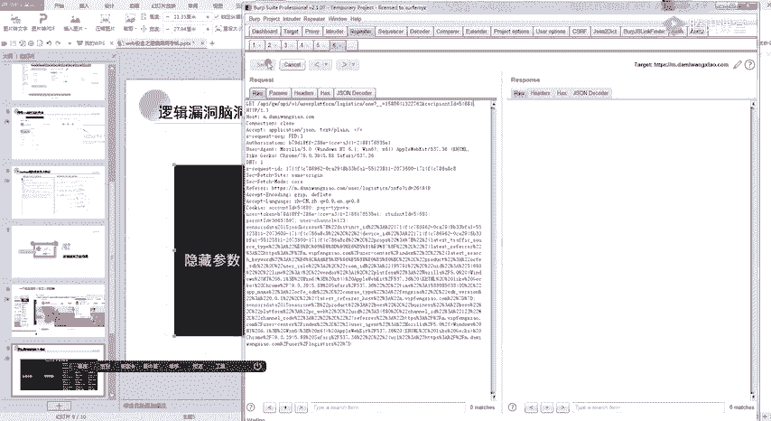

然后我当时呢也可以说叫运气好吧。当时就刚好他有一个student IDD的一个判断，然后还有一个family ID的一个判断，我就取这个family那个student ID它直接做了一个限制。

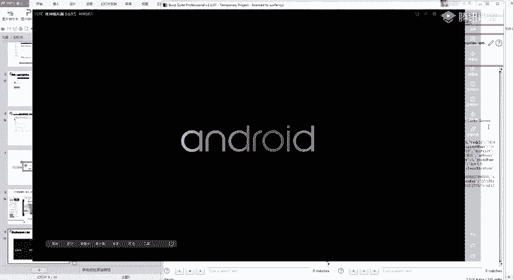

然后他那个familyly IDD呢，它没有做限制。然后就直接造成了一个月权拉了3000块。我看一下我看一下他们那个位置还可不可以啊，那里是没有月权了，但是修改参数应该还是可以的。

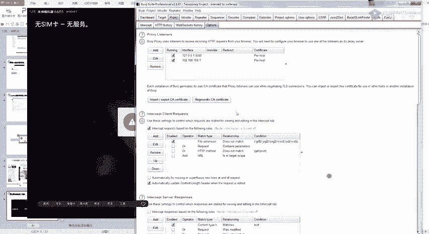

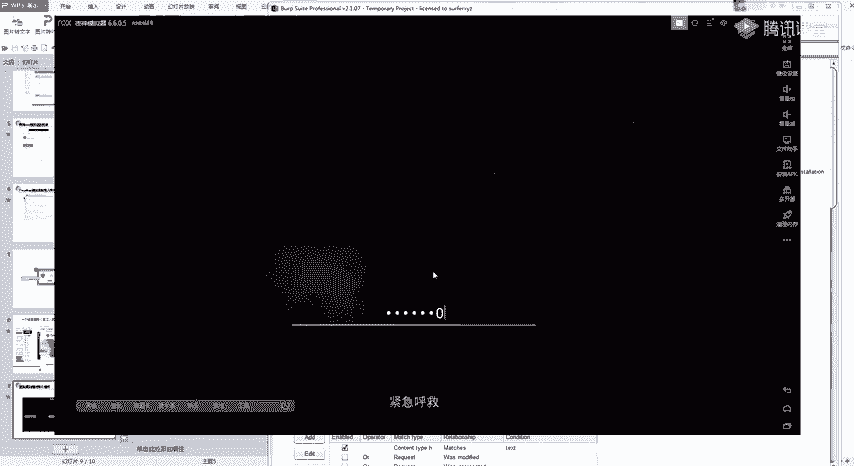

这里的话我就是抓了一个手机的一个包呀。嗯，是GPB的一个包。没记错，好像是太G。嗯，我换一个账号。

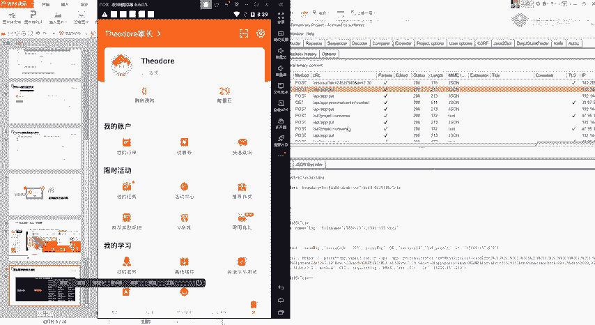

就这个位置。你看一下这个ID啊，它这里呢是通过这个finman的ID来进行一个判断的。我们把这个finman ID在里面。看到没有？那你想一下，我这里面有这么多，我把这个finmin IDD去掉了。

首新去掉看一下。没有用。参数为空，那我再取一下，我取这个是 student正 IDD。你有没有发现我通过这个里面的这个student IDD也是可以进行的。那是不是说明一个什么样的问题？

我这里存在一个隐藏的student IDD的一个参数。那我再同时查这个。O寇的。那还有没有？那就说明。我们这里存在一个隐藏那个 student ID的一个参数。

那他有没有可能这个student开D就可以进行一个便利呢？然后还有后面的一个，你比如说有一个还有专属的。啊。比如说还这里还有1个ID，那还有没有可能这个ID也可以进行一个修改8820。不行。

所以说呢我们的一个思维就是什么？思自己要思维要发散了。不要局限于一点，就是我唉我这些参数我可能没有漏洞，那我就不去进行尝试了。你只要自己去进行尝试。才可以发现更多的一些漏洞。

所以今天的话要给你们讲的就是这几个思路吧。

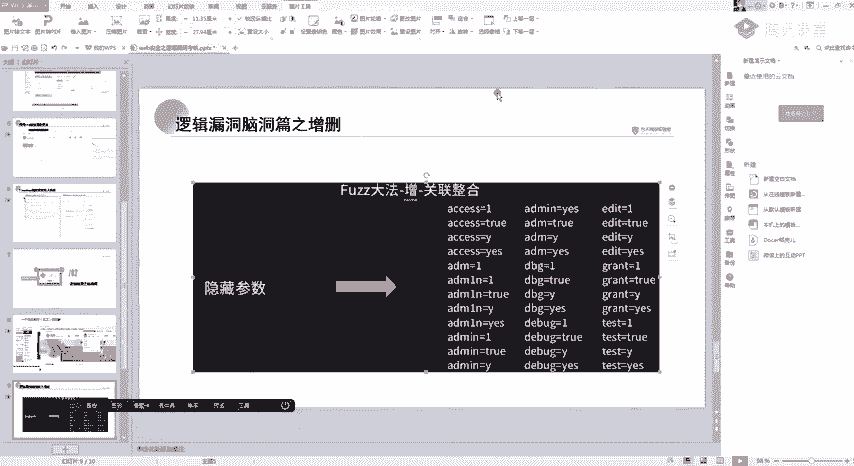

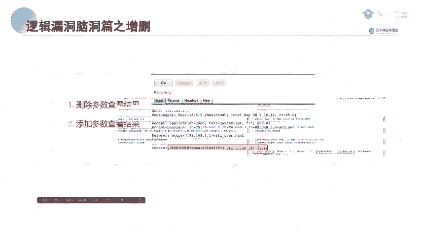

另外要记住啊，这一个隐藏参数的一个方法是特别特别好用的。因为你要想一下，我为什么要把这个函数隐藏掉啊？然后这个隐藏参数，别人是不是根本也找不到呀？那存在漏洞的可能性是不是就更大？好，今天的一个课程的话。

基本上也就这样了。如果你们啊你们有什么不会的，现在继续提出来。就是哪哪一个位置不明白。对。在可疑的后面添加一个参数，看有没有。机会。因为你想一下，就是你不要参数单纯的从月权来讲啊。

就是如果我既然可以添加参数，那我有没有可能这个参数也还可以设置注入呢。那我还可以啊，比如说SSIF啊这种各种各样的漏洞都有可能存在啊。这是思维，包括你们是以后工作呀，包括以后工作。在做渗透的时候。

脑洞一定要大呀。自己要想事情。呃，还有没有什么想要提问的？还有2分钟。呃，如果没有想问的那我就直接下课了。然后你们可以在群里面一起讨论啊，群里面反正大家都自己人嘛。你遇到比如说你遇到哪个地方。

如果漏洞不知道想讨论的，你可以直接在群里面问，大家一起大家的思维嘛，大家可以一起讨论。每个人的思维都不一样。漏洞的有趣就在这里这里，每个人的思维可能会造成不一样的结果。

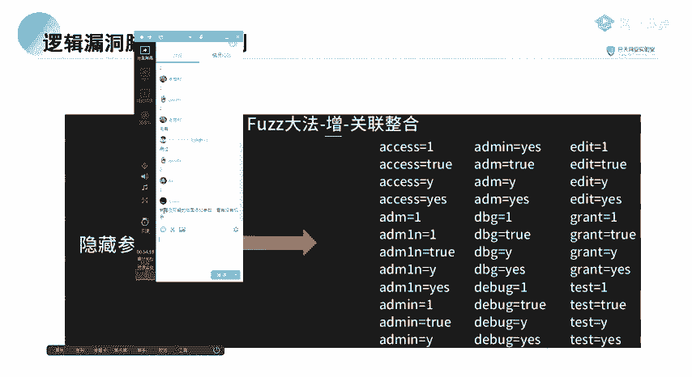

好，我就下课了。😊。