# CTF教程：CTF初学者必备的1000个练习题，每日一练，百日成神！（ctf-wbe／ctf-pwn／ctf-misn／ctf-逆向） - P72：课程考核讲解 - 白帽子讲安全 - BV1dp4y1j7aN

🎼固めてしまう。🎼君玉は。いけないけ。

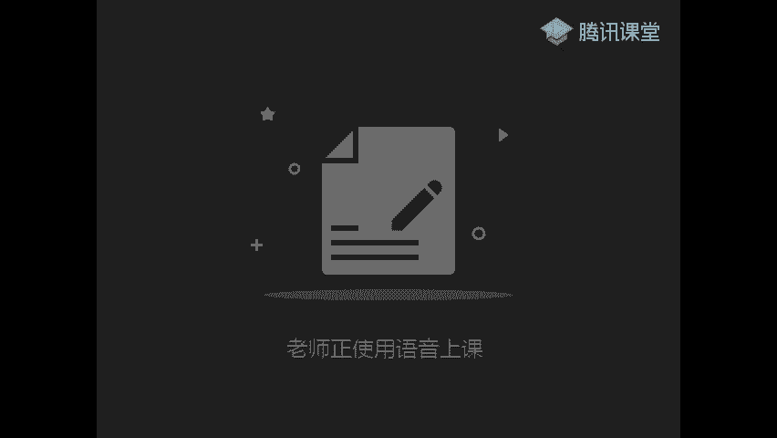

hello hello，大家能听得到我声音吗？😔，嗯。好的。😔，🎼哎，对呀，你们今天好像没有交作业给我哈，那你们做了没有啊，就是昨天说的这两道题你没有做吗？😔，你们都没有做吗？😔，まさかのて。

昨天有约定好，就是来讲题目的那个。还差得多。😔，什么东西还差得多，就是。

到哪一步了呢？就是你到哪一步了呢？怎么说还差得多呢？

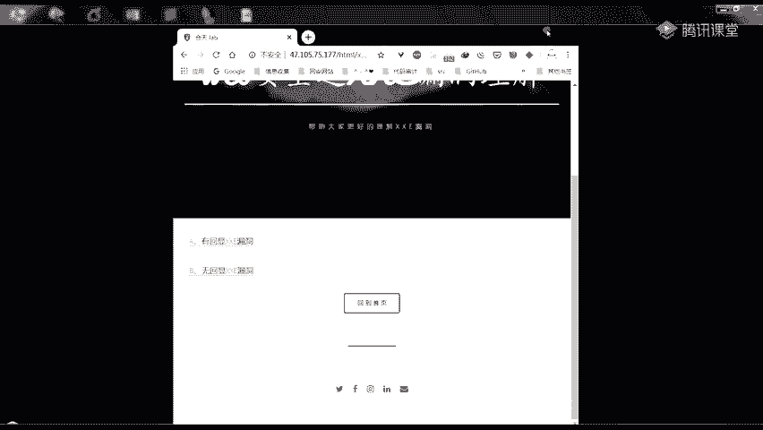

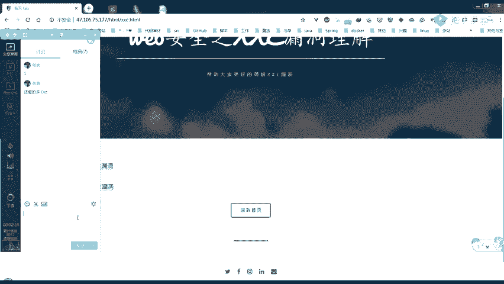

其他同学呢就是关于昨天的。作业。没有人做吗？难道。😔，这么晚吗？😔，嗯，那要不然。😔，你来分享一下。😔，She。其他同学没有做吗？都。😔，S。是我这边网络有延迟吗？所以你们没有和我说话。

昨天的作业应该还算是简单的。然后你们有什么问题吗？所以就都没有人回答我。😔，嗯。刚到学校。哦，你们就是大学开学是吗？就是刚开学。好吧，那。😔，那我不知道读你这个。😔，单词啊就是。嗯。

要不然你来举手来给我们就是演示一下好吗？就是。SNIAL同学。嗯，你说句话让我们看看了喂喂喂喂喂。嗯嗯，能听得到，大家能听得到吗？嗯，大家能听得到吗？啊，各位如果听得到听得到吗？嗯，好好，他们也听得到。

那你说吧。说。我开一下我的文档。Yeah。啊，就是。你讲哪道题有危险的？有回险的嗯，对。是。

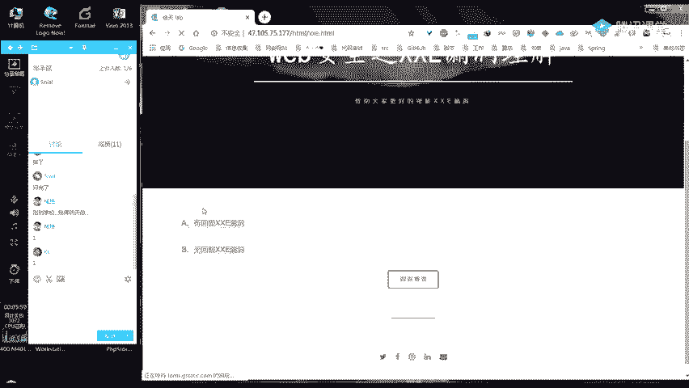

怎么这么卡？😔，嗯，有危险的，你先就先再抓个包。

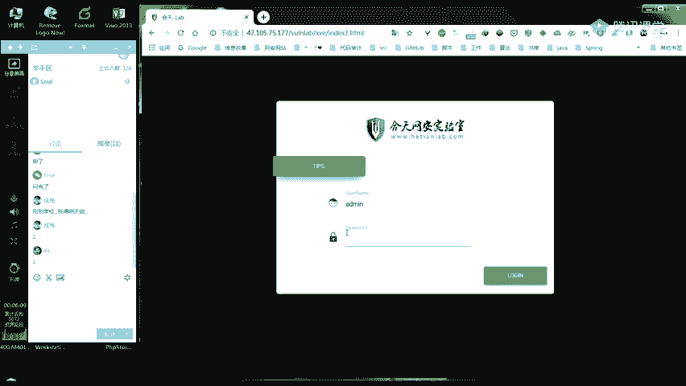

插个吧开一下BP。然后天天。放放行吧放行吧。放心放心，然后看他看他那个看他那个。看的那个叫什么来着，看什么回包，看他的防回包。嗯，这样是吗？你的意思是对。

然后看到那个看到它显示的回显的是ad me的那个位置。然后啊这个位置，然后我们就。就是我就。我就输了个这，然后我就在那边写这个写这个这个叉叉E的东西。哦嗯你就写这个，然后在那个得命的地方。呃。

人命的地方就是。加上那个叉叉E，然后我的那个HNIA然，我就。就就就就变上去了。嗯。这样是吗？还是怎么着？对对对，就这样。嗯，哦这这就是迟到他回醒的位置了。嗯，然后然后我再看一下。

然后大家到这里应该没有问题吧。然后就是执行那个啥SYSTM，然后就就就是那个文件包含的东西写上去就就完事儿了。Yeah。啊，你说啥SYS什么就那个命令啊，就是这个就是这个。熬呀。然后后面再加上那个。

这个。为了。这。啊，这个放在哪呢？这个sister。就就把那个把那个叫什么来着，我看一。就放在那个叉叉一的后面嘛。这样是吗？对，然后换一下那个那个是2。是那个是我做无悔险的那个。嗯。

你换就把这个换成一一换成当前的这个对吧？当前的那个。嗯。😊，然后就执行了。勾勾一下。勾一下，然后就就解个码就找到密码了。好吧。我这个走了走了嗯，然后就。就可以登录了。

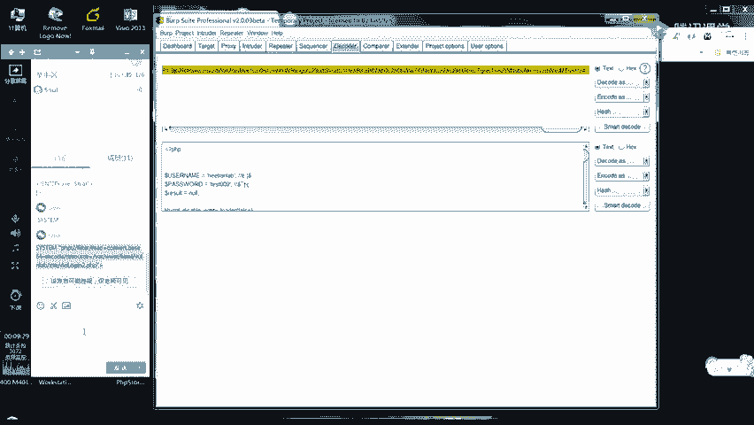

嗯，登录就完事儿了是吧？对，就完事儿了。没错啊。Yeah。嗯，那有同学没有听明白的吗？这。这个KK同学，你分明就就在线吗？所以我我要点你哦，那你有听明白了吗？😔，我以为都没有人嗯在线，所以。😔。

没人理我，既然你在线的话，你就说说你理解了吗？就是明白了吗？他整个过程。😔。

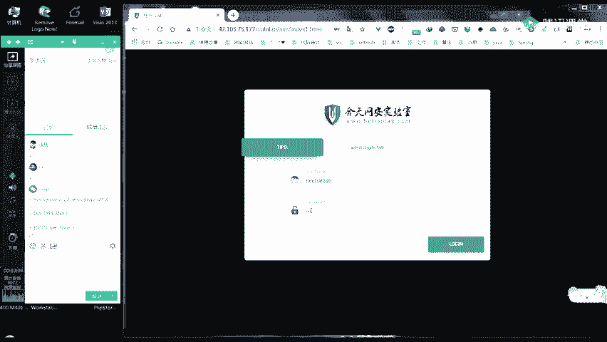

如果没明白，我们就让他再讲一遍。

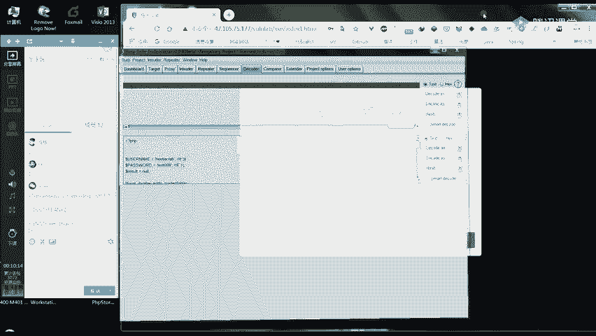

没。明白了是吧？😔，嗯，这里就有一个login success。

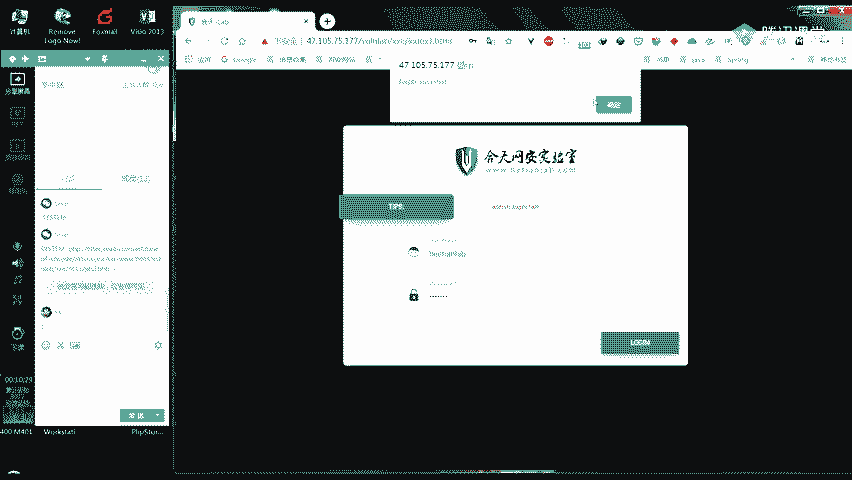

嗯。那其他同学呢这这个题目还有什么问题吗？如果没有问题的话，就扣个一。如果有问题的话，就扣个2。好的。😔，那KK同学月同学以及老陈子张喜同学，你们做了第二题吗？

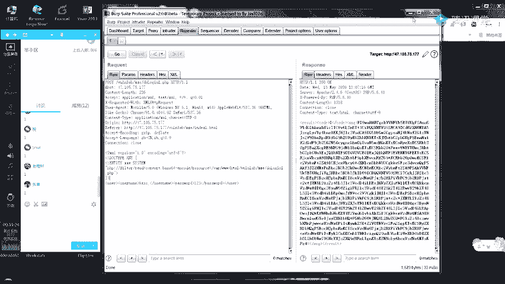

你们有谁要来分享，就是这个无悔县的吗？

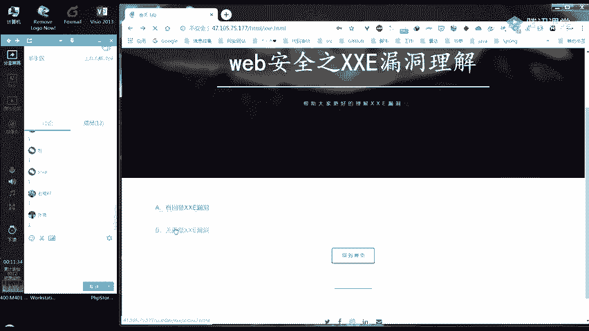

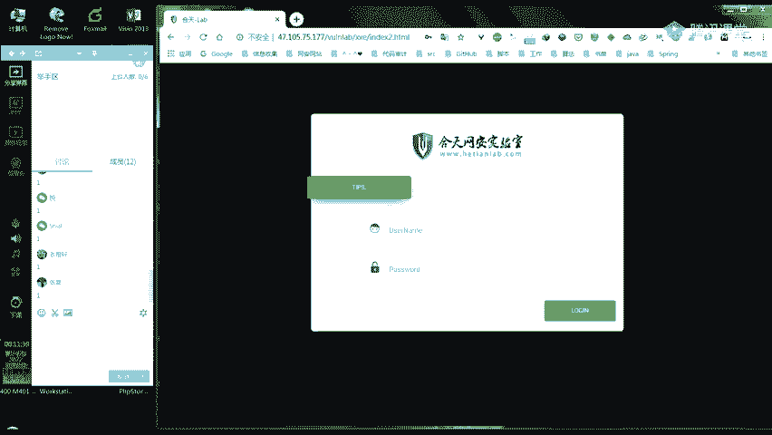

如果有人做了的话，就举手。没错。😔，为什么没有做呀？😔，错不出来。😔，嗯，是哪个地方出了问题呢？还是怎么着？

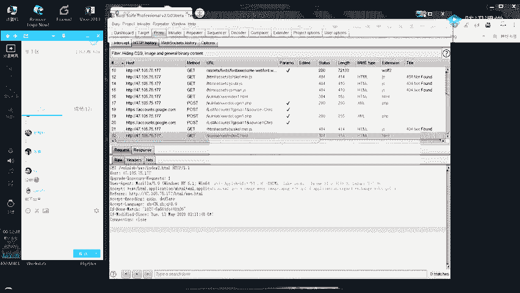

你们关于这道题就是有想法吗？还是没有。想法。所以不知道怎么做。Yeah。好吧，你们。😔，想法就是放问服务器，看日志。F。She。访问服务器看日志。😔，你是说访问我们这个靶场的这个服务器，然后看他的一个。

日知吗？自己的。😔，嗯，那为什么会。😔，有这个想法呢。😔，昨天上课说的。😔，嗯，好吧。😔，嗯，我想知道就是其他同学就是是第一题。

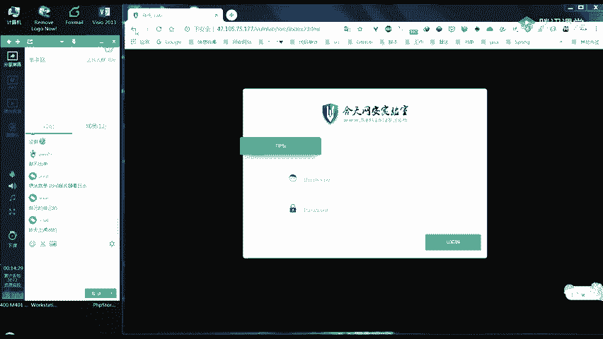

嗯，对，第一题。😔，嗯，做了吗？还是第一题也没有做出来，还是就第二题没有做出来而已。如果你是第一题没做出来的话，就打个一。然后如果你是第二题没有做出来的话，就打个2。第一题做了，第二题没做出来。😔，嗯。

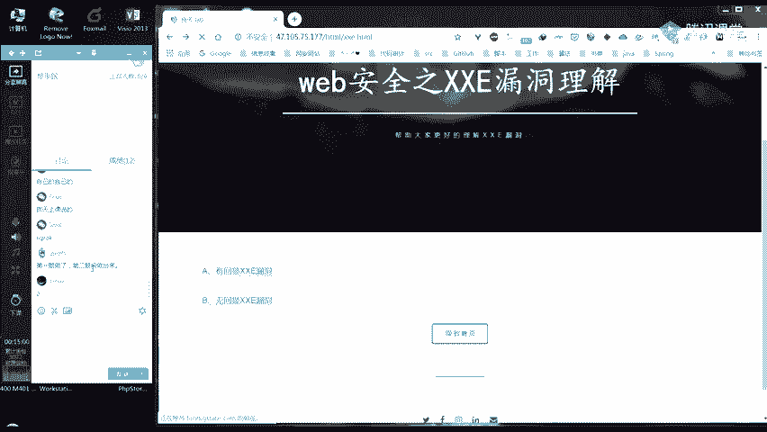

好吧。哦，那看来大家第一题应该都没有什么问题。那有人分享第二题吗？嗯，我们。都没有。😔，Yeah。不会有不会有这个S嗯，我真的不知道读你这个名字，所以好像只能。😔。

把你拼出来就是SNIAL然后来分享第二题嘛，没有其他的人。做出来了吗？嗯。如果有同学做出来了，然后想分享的话就扣个一呗。让我看见。嗯。大家第二题是出现了什么问题呢？就首先也是同样的嘛，就。

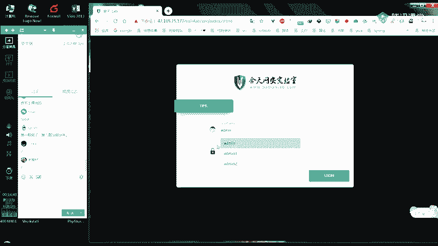

先抓个包试试，看看。

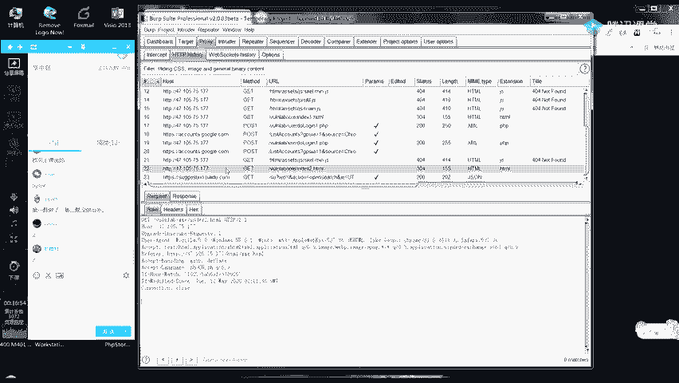

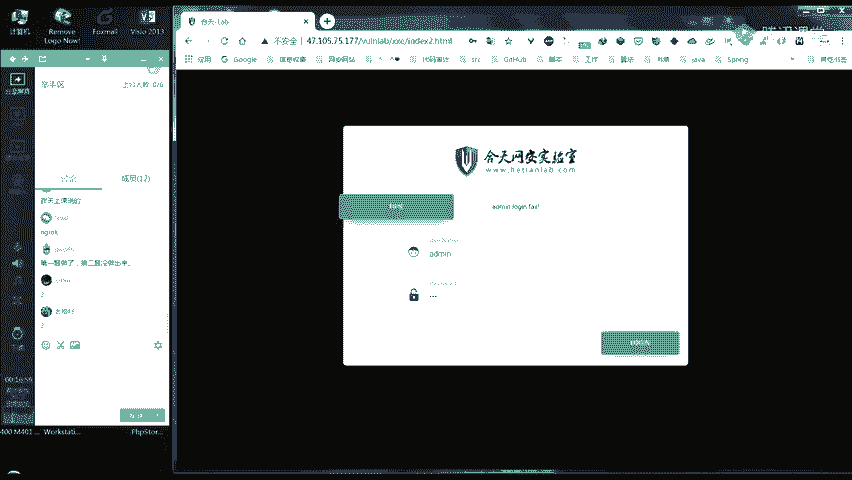

然后这个时候我们点购的时候，就是发出去，把这个包发出去之后，你会发现其实它相比第一问的话，就是第一个有回险的地方。他其实就没有把这个message。

就是message中我们这个username的一个内容回显给我们。它现在就只是一个code，就是你登录成功的一个就是登录成功与否的一个code。如果你登录失败的话，它就是一个0。如果你登录成功的话。

它就是一个一。这样子的话，它就没有把这个回旋给我们这个message这个这个地方回旋给我们。所以这里的话我们可能就是。有一个无就是它是一个无回响的嘛。叉叉E那个标题也有说。所以无悔线的叉叉一。

我在课堂上。嗯，给大家讲过呀，大家。是哪个地方出现问题了呢？😔，陪了高档失败。😔，嗯，我知道你我知道你的问题。😔，其他同学呢？出现什么问题了吗？😔，就是关于无回线的话。

我们为什么会想要DTD文件放在网站跟目录上吗？可以引用DTD，但sstem连接不到。😔，可以用DTD，但system连接不到自己服务器开的端口上。😔，嗯，什么意思？😔，DTT文件放在网站的跟目录下嘛。

对呀，你可以放在跟目录下，也可以放在别的目录下。只要是你的外网能够进行一个我们这个17。105。75。177能够访问到的一个地址就OK。Yeah。阿帕奇日志上有访问D滴滴的日志。那应该就没毛病啊。

其实这道题直接拿我PPT这个来套就都行啊。我们只需要把。嗯。只需要把这个地方改为我们外网可以访问的1个UIL，然后后面存的是你这个DTD的一个位置。然后在这里的话。

你把这个文件改成我们这个do login2。点PHP。然后这里的话也改改成我们那个外网能够访问的一个地址就OK了。阿帕奇日志上都有访问DCT的日志，就是python开的呼务器。😔。

收不到实体中stem的请求。😔，Okay。😊，好吧。嗯，那要不然就。😔，请个人给我们演示一下。那其他同学都没有做出来的话。SNIA。L同学，你要不要再次上台为我们展示一下。我是吧，你后来还没有成功吗？

那你给大家演示一下嘛？没关系，就。😔，嗯。😊，嗯。嗯。因为其他的同学。都没有。😔，都没有做出来，或者是有其他同学想要。嗯，分享或者是。看一下，看一下自己哪儿不行的话，也可以上台。我们一起来看一看。

没有人上台吗？好尴尬呀。😔，没有人举手吗？😔，嗯，我今天下午自己试的时候，我发现。就是那个啥。😔，我不是给大家发了一个这个吗？但是我发现他我下午试的时候打不开，我不知道是不是。是用的人太多了。

还是怎么着？

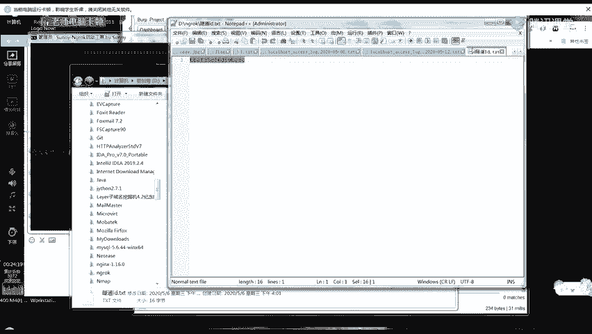

所以说。😔，大家如果可以的话，还是自己去买一个吧。嗯，还是。还是打不开，好吧。😔。

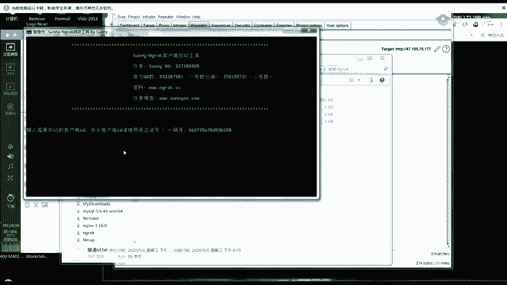

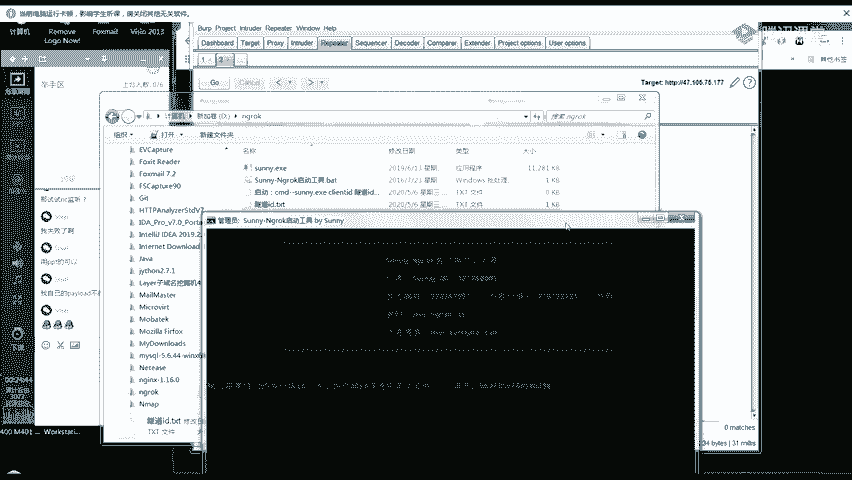

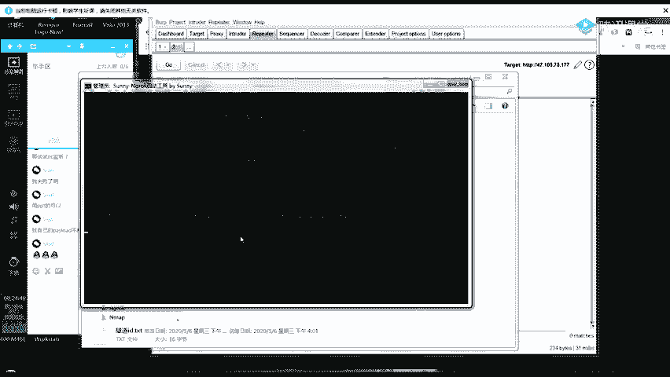

好尴尬。😔，Yeah。没有没有人没有人举手要分享这道题吗？😔，SSNIL，你要不举手吧。我整你。你的思路我来走一遍。Yeah。

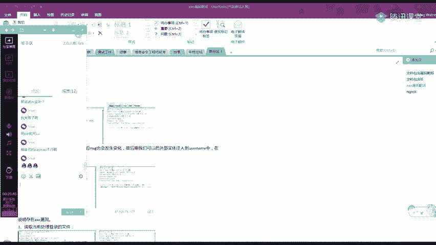

好了，没有人举手。😔，嗯。那我就自己讲吧，但是我那个它开启不了，所以说。如果你们谁有服务器可以借我的话。

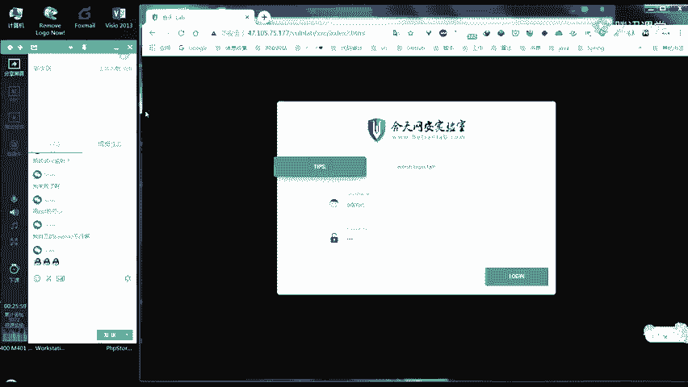

算了，还是不要不要就大家就直接看我的写的这个文档吧，好吗？我给大家讲一下。😔。

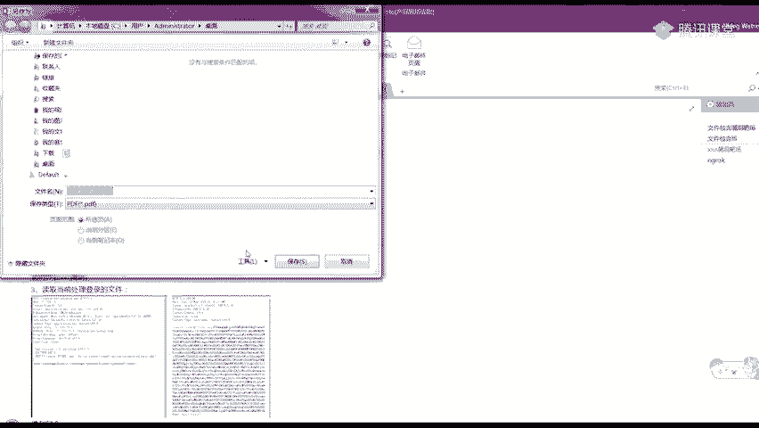

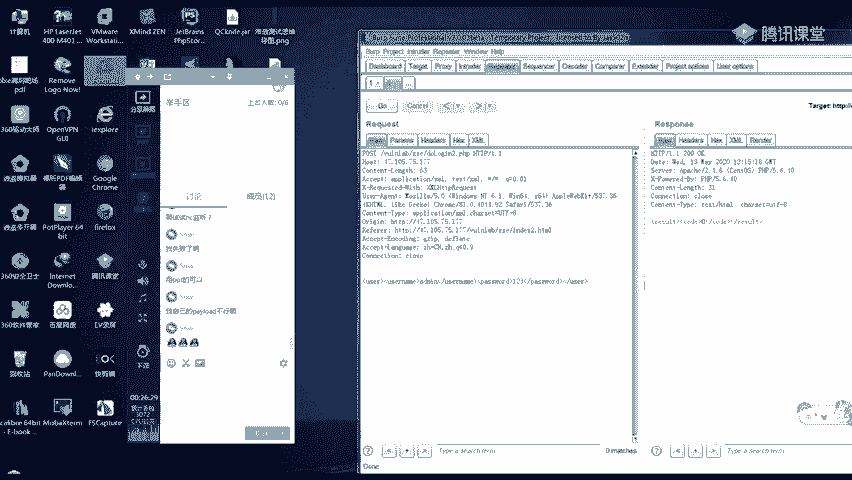

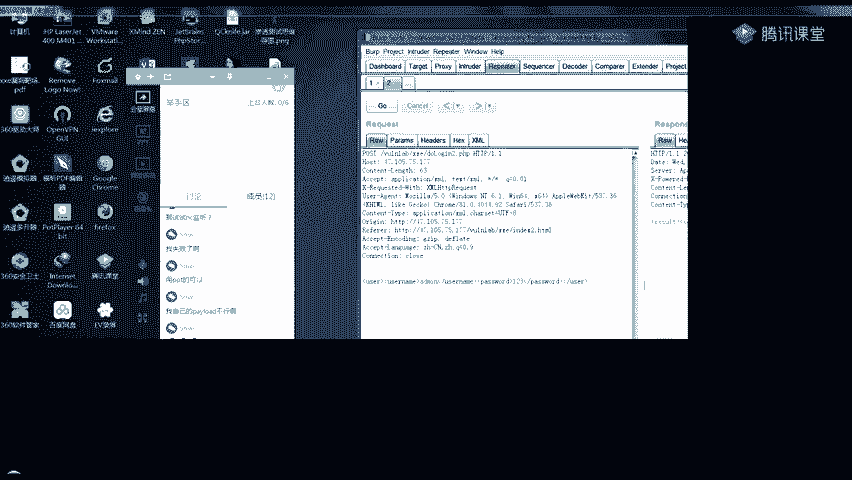

那首先第一题的话，应该大家都都会了。然后我们就把它先过一遍。嗯，首先抓个包，然后我们尝试更改这个username的值。其实我们第二关也是一样的，所以我们也可以进行就是来试一下。把这个。哦。这里没有回血。

😔，对。嗯，你会发现它这边回显给我们的这个值是能根据我们这边输入的，就是在那个页面中输入的这个username而进行一个改变的。然后它这里的话又是能够解析我们一个这种叉ML格式的。

它里面就是一个user这个根元素，然后里面有两个嘛，一个是username，一个是password嘛，对吧？嗯。这个时候的话我们可以尝试来。就是看一下引入一个外部的一个实体，看看能不能。把他引进来。

然后我这里用的一个plo的话，就是那个CEYE自带的一个palo的。然后我们发送之后。就会看到那边已经有我们这个请求怪了。就是我们登录到那个CEYE点IO。就会看到这个请求。

那么就说明它存在这个叉叉一漏洞。因为我们当前是我们是要干什么，是要。我上一次昨天就是给大家说，就是想让大家能就是知道他的密码自己登录进去，大家也可以尝试其他的一些。比如说入口令什么的都可以。那这的话。

我们昨天学了叉叉一。的话。然后它明显这里也是一个叉叉E的格式这样子。所以我们就先就直接用就是叉叉E的思路来试一下。刚才试了也知道它确实是存在一个叉叉E漏洞的。

所以说那么我们就可以猜测他是去处理这个逻辑的时候，去判断就是是不是相等的时候。它的那个变量可能就存在我们去处理这个登录逻辑的这个文件里面。

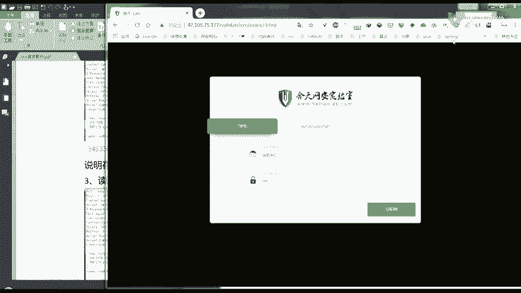

所以我们可以想到就是我们把这个文件给读出来，对吧？然后可能会看到他的一个。登录的。😔，Yeah。登录了账户和密码。所以说我们就在这边的话，就其实是一个读文件的一个操作。那读文件的操作的话，就像刚才。

我们那个同学有说过的。嗯。Yes。把这边加一个。Dooc type。Any。然后这里面的话就是一个外部实体，对吧？我们不能定一个外部实体。然后这儿的话其实一个外也不需要用到一个参数实体。

因为我们只需要把它。就是带出来就就好了。因为它这是有回显的，我们不需要再去就是把这个数据带到我们自己服务器的一个访问的UIL上面，我们就可以直接从这边来获取到它的一个信息。所以在这的话。

我们就只需要定一个外部的实体。外部普通实体在这边的话，它的值的话，我们就一般用。PHP那个就是为了防止它是有那个。特殊符号的嘛。564杠encode。😔，然后resource。就会等于do login。

😔，2。😔，E。嗯。嗯，对吧我应该没有打错吧，然后在这个UCname这。就是替换为这个remote。这样的话，他能就他就在这边会回显嘛，因为会回显给我们，所以他就会把这个数据给带出来。我们go一下。嗯。

就和刚才那位同学讲的一样，然后进行解码，就可以看到他的一个账户名密码。内无回写的话。就是我们如果输入刚才的这一套东西。它都是在这边是没有回显给我们的，只有它的一个登录。它的这个code的话。

可能就是表明你当前它返回的那个值是true还是forse，它这里的话就用零和一来代替。如果是一的话，就可能能登上去。那它除了这个之外，这个是我们没有办法改变的。因为它是通过后台进行处理。

然后返回给我们的。我们没有办法从我们就是这边。来进行一个绕过，只能说你把这个username以及password写对了才行。那这样的话。

我们怎么样把它的一个就是它的username以及password的写对的话，我们也同样可以利用上一个的这个思路，就是去读取它当前的这个文件。当前处理逻辑登录逻辑的一个文件。那在这儿的话。

因为它是一个无规险的。其实我们上课的时候也有说过。嗯，我们就直接看到第二步。首先前面判断的话是跟前面的步骤一样。但是我这儿好像不能给大家演示，因为我我也不知道为什么，他就一直。打不开呀，你们的能打开吗？

你没有装这个吗？

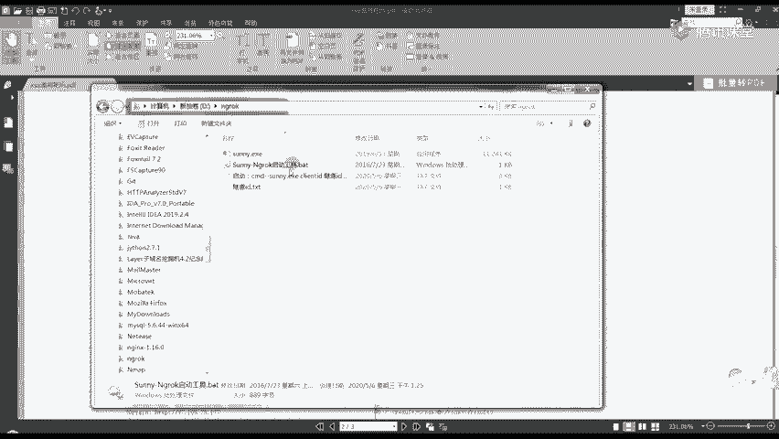

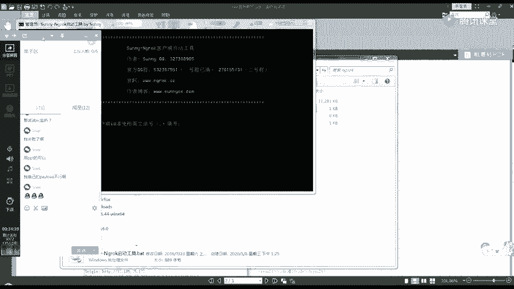

你们的能打开吗？哦。

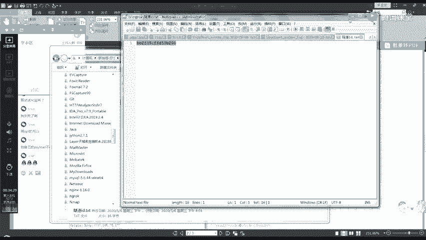

我的就是一直在这边，嗯，今天下午也是，今天下午试了一下。然后他一直在是这个样子的。

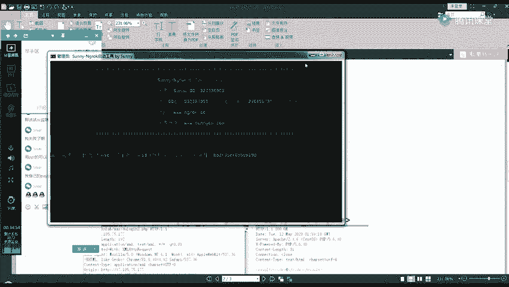

嗯，所以的话我就可能。不能给大家演示，就是它出来的一个效果。但是我这边都已经截图了，所以也是一样的。嗯。😊，这个代码大家应该都理解是什么意思吧，就是我在这边。对，这个代码。

这个代码是和我们PPT里面是一样的。其实就是这个本地文件读取无会显制。就是这个地方。然后他的DDT文件里面的话。Yes。就是这个。当前它的值就是do login2点PHP，然后把我们这个file。

带出来怎么样带出来呢？就是去请求。在这里有一个在这个int的外部实体啊，不对，就是实体参数，内部实体参数里面它有一个。外部的参数实体，这个send。在这里的话，他是去访问了我们这个当前的域名。

然后加上了。这个的值。其实就是我们这个dlogin2点PHP它进行被464编码之后的值给带出来，怎么样带出来了？你肯定要就是你这只是进行了一个声明。都没有调用，就只是这个file在这里进行了一次调用。

你这个int以及这个send都没有进行调用。所以说我们可以在。这这个地方。首先你肯定要先把这个给调用了，你才能获得他的这些。其他的一些文件的声明。所以第一个写的话就是这个百分之DTD。

然后一个分号把它调用，然后把它们的一些这个fileint以及这个send的声明都应用进来。接下来的话我们就去调用这个int。再接下来的话，我们就去调用这个send。对吧这个代码大家应该没有问题吧。没有。

嗯。嗯，我这里也是一样的，然后可以在日志中怎么看。看到就是因为我前面有给大家说，就是在我们tca啊，刚才有个同学说是不是可以放在。就是放在跟目录下，那你。一般就是放在跟目录下就好了。

你如果跟目录下不方便的话，你另外创一个呃。嗯。然后你把这个放到这个里面去。那你在这个拍lo的这个地方。你在前面加一个叉叉E就好了呀，只要是能够访问到的一个位置，对吧？这都是无所谓的。

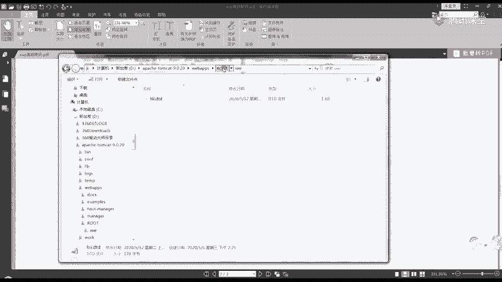

一。然后昨天配置那个。NG rock rock的时候也有说过，就是我们。在。config，然后serv点tmmail里面就是配置了一下它的一个日志存放的位置嘛。就是他会。😔，存放到我们这个logs下面。

The。Local。Local hostel access。杠5logo点后面后缀是点TXT。

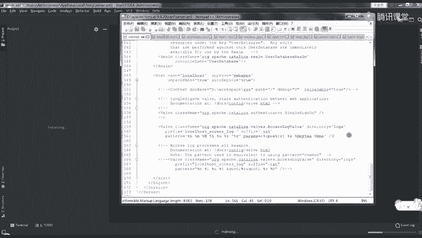

所以我们就可以来到它的一个日志。

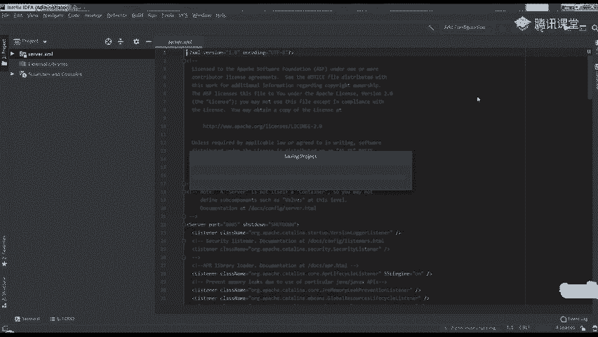

去看一下。就是这个logs目录下。今天是多少号？13号。😔，哦，这个是我那个的。😔，你看。😔，我测试那天应该是昨天。😔，嗯。昨天的话对，就是他的一个带出来的这个数据。Yeah。嗯，他的流程就是这个样子。

就是。在这边sign go之后。然后这边可能是没有，就还是这个样子。但是你在我们的服务器上。扶起的一个日志中。就可以看到。嗯。它带出来的一个数据，同样进行解码之后。就会。😔，有他的一个。账户名密码。

其实和L给你一点PHP是一样的。嗯，我这就没怎么改。啥想法？😔，嗯。你用这个服务器添加一个，看能不能用。什么意思？你用这个服务器添加我放问文。嗯，可是。😔，Yes。可是这个样子的话。

你访问的日志的话也是在他那边的呀。那我们怎么看呢？你是说就是为了有一个服务器，然后给大家演示一下，然后大家就把这个服务器当成是我们自己的一个服务器的这个意思吗？还是怎么着？那如果不是这个意思。

你是说直接就是如果是。嗯，我们并不是我们自己的一个服务器，而是真实的一个。的一个。别人的一个服务器的话，你把在这个服务器上添加1个DTD文件，然后进行访问。那你数据也是看不到的呀。

你最终还是要返回给我们自己这边。对吧。点野。大家有其他的一些思路吗？或者是这个有没有听懂的吗？Yeah。哎，你们的这个东西能。能登录进去吗？就是访问进去吗？

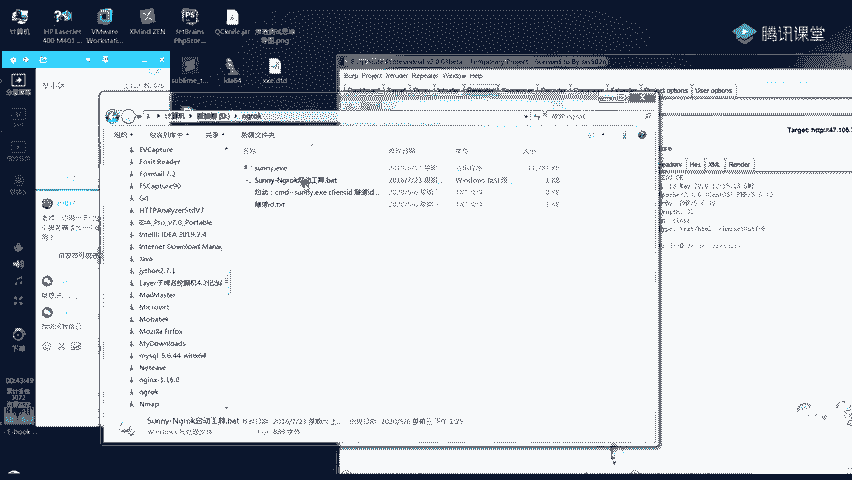

就是这个。

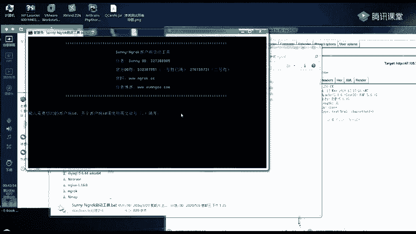

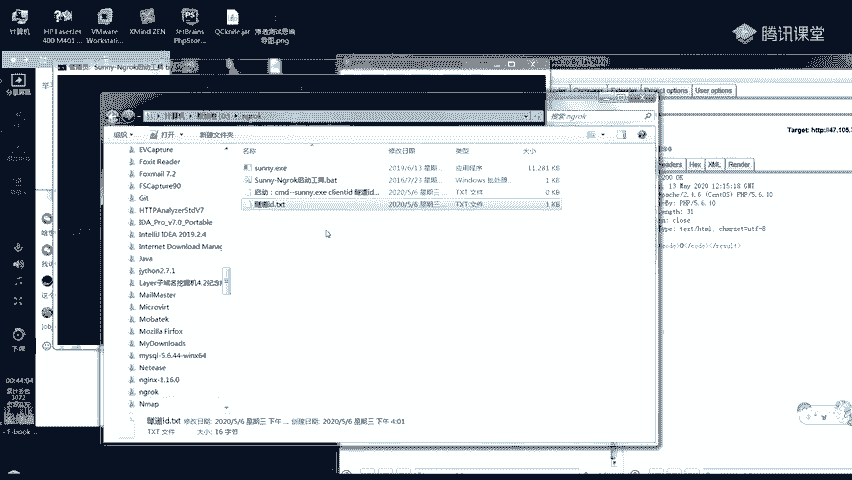

Yeah。我为了给你们演示，专门找了一个，结果他现在又演示不成了，我真是服了。😔。

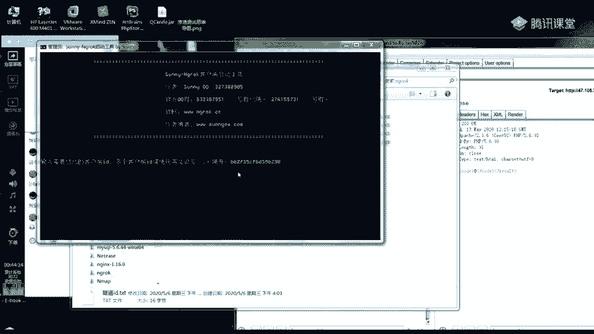

这个有发吗？我记得只发了。PDF对呀，我只发了PDF呀，然后在PDF里面的话，有它详细的一个嗯部署的过程呀。你们就是没有去看是吧？我知道了。😔，H。就是那个PDF都没有去看。反正我每次发在群里面。

你们也没理我。看了好吧。😔，He。太麻烦了，买了个服务器。😔，有没看完，有腹肌不打赛有。为什么有服务器不打算用呀？😔，那个分号linux，你你说一下，你第二题为什么没有做出来？注册号麻烦。😔。

符号lins，你第一题做出来了吗？然后你第二题做出来了吗？

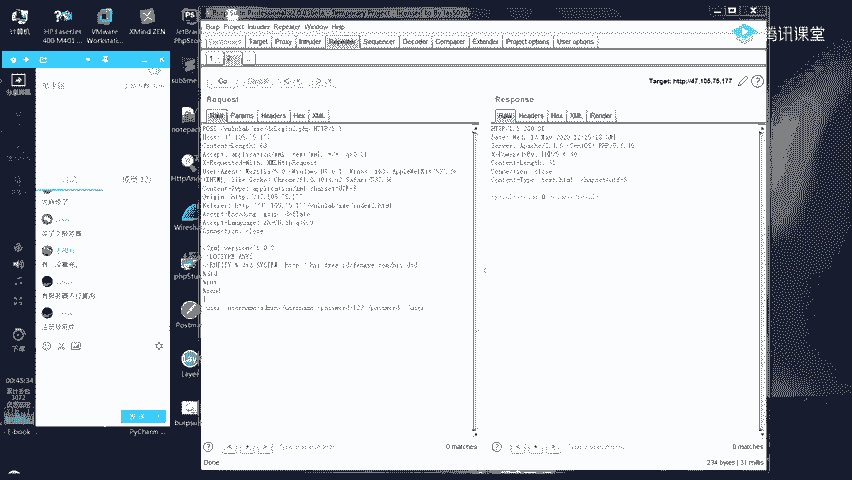

Yeah。Yeah。Yeah。嗯，第一题OK那第二题是什么原因呢？大家第二题，我刚才说的应该有懂吗？有听懂吗？嗯，这个的话我其实上课的时候有给大家，就是已经说过了。

只是在这里的话换成一个外网能够访问到的地址就。O了。可能还是配漏的，我再试试。嗯，好的。Yeah。那你那你们用的是哪个拍lo呢？能发出来让我看看吗？你。Yeah。

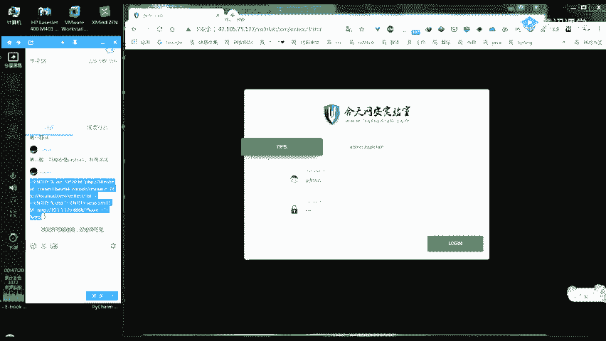

我先把他。😔，不知道这边。😔，Lo口号。😔，嗯。W。嗯。有大家有人来。就是来分析一下这个错误吗？就是这个分号linux这位同学的。我先把他的封号给加上。然后有同学能够。给我们说一下。他的出现的问题吗？

read错了吗？哪个read。😔，对。这个read吗？😔，这个read是没有关系的。😔，读的不应该是服务器上的东西吗？对。你这访问访问local host是什么意思？你这访问的话。

应应该是去访问你自己搭的那个服务器的一个位置。我们为什么要去访问自己搭的一个服务器的一个。位置呢，因为你这个东西就是你存的这个DDD文件，在你搭的那个服务器上面。所以你要去访问这个。

这个EVL2点GGD的话，那你就要你你这样子。你就要把这个DCD文件放在你自己搭的一个服务器上面。然后你在这儿的话，你的一个地址就不应该是一个local host，而是你服务器的你自己服务器的一个位置。

相当于是这个47。105。75。177来。进行访问。他为什么会访问呢？因为你在这儿就是你把这个发发给服务器之后。他那边不是会去进行一个解析吗？解析之后解析之后，他发现它是一个这个root。

这儿它定义的是一个外部实体，然后它的UIL是这个，所以它就这边的话应该改成你自己搭的一个服务器的一个地址。嗯。我这边就直接用叉叉叉叉代替吧。这个应该是。嗯，我们自己EVALL吧。嗯。

我们自己这边的一个位置，让他来进行访问，访问我们这边我们这边存的1个DTD，因为它服务器上不。正常情况下是没有这种DDD文件的，是我们自己写的。所以要让他来访问我们服务器上的一个。东西。嗯。

dooc type嗯，对对对，这里也写错了，就是。P做 type嗯。😔，还是我复制错了呀？嗯，没有。😔，嗯，这里要就是有一些细节的话，也是需要注意一下。嗯，所以说在这。这是第一个地方。

然后第二个地方的话，你不应该是local host，而是我你自己搭的一个服务器上的一个。就是你存放DTT的一个位置。这个样子的话，这个司机它就会来访问这个EVL2点DDD。然后在你搭的服务器上面。

你把这个存成，你把这个存成1个EVL2点DDD。然后大家可以看一下。就是坠一串有什么？😔，问题。这个就是在你服务器上存的这个DTD文件的话。同样的一个地方就是你在这的话，不应该是去读这个文件了。

这个是你本地的一个文件，你现在应该是读的是我们要把它我们要读取服务器上的那个文件，把它放在这边来。所以的话这里就是这个。do login2点PHP。这个样子。接下来的话，你就把这个带出来，就是通过。

这边。然后给带出来，就是这个。这个给带出来嘛，通过到时候我们去那个日志里面看它的一个访问的1个UIL。嗯嗯我这么说。😔，你能听懂吗？或者是你根据我刚才我们说的这些，然后你改一下，然后看看能不能就是成功。

嗯。还有其他的同学的一个，就是我刚才说的，大家有明白吗？或者大家还有其他的一个拍load的，然后想分享给我们，然后是自己没有做出来的。然后想让我们一起来看一下的。Oh。嗯。嗯，这是第一题。那我。Yes。

嗯。好像。好像并没有什么问题的样子啊。😔，嗯，大家有看出来就是这个。嗯，就是这个第一题，大家有什么就是他发的这个拍load的有什么问题吗？我好像也没有看出来有什么。什么问题呀？😔，哦哦哦哦哦哦哦哦。哎。

你可以哦啊，对。😔，啊。对，com问。ok。嗯。我对嗯，那个这个应该是第二题的吧。😊，嗯。嗯。嗯，这个地方你不能再去用1个HTP这样子了，你去看一下，就是我们之前学文献包含的时候。学文件包含的时候。

不是说过。而且这个是等于啊，不是刚就是read等于。不是不是杠。你去看一下那个文件包含的时候，我们那个resource这边不是他要读取的一个文件吗？你这不能再加1个HCP这样进行一个访问。

你就加一个相对于我们这个。当前这个路径下就是这个叉叉一路径下的一个文件就好了。那在这的话，我们就可以直接使用一个相对路径dolo gain2。因为它就是在这个叉叉一下，就是这个文件嘛。

所以我们就可以直接这样写。嗯，然后哦这个是那个DTD文件是吧？B。Right。嗯。Yeah。嗯。嗯。这个应该是没有问题的吧。这个是不是不要这个封号呀？就直接是这个样子的。嗯。

但是有时候他这样是带不出来数据的，就是使用这种形式写的话，是带不出来数据的。所以说最好的话。就是。按照这这种形式，就是你在这个DDD文件里面再定一个实体参数实体。嗯。😊，而且你在这个send这儿。

就是我把这个放大。这个send这儿也把它定义为一个参数实体。就是一个外部的参数实体。在这里就直接进行引用了。嗯。好吧，还有其他同学的拍lo的想发出来，我们一起看一看嘛？你。Yeah。没有的话。

那今天课程。😔，也9点了。😔，嗯，如果有的话就扣个一，我们就等你。如果没有的话，就今天就得下课了。如果还想发的话，就扣个一。如果没有要发了的话，就扣个2。KK小朋友，你是怎么你是。你怎么刚开始说话。

后面又不说话了。嗯，好吧，没有人理我。😔，嗯你哭。潜水。😔，嗯。😊，你们我以为是你们就是网络有延迟，所以我就以为是你们没有，就我还你们还没有听到我说的话。😔，原来你们就。😔，都不说话了是吧。

就也没人跟我互动，就我一个人在这瞎讲。😊，好吧。😔，啊。那大家没有什么问题的话，没在等人说话。嗯，但是我不是说如果有就是有想要有想分享拍多的出来的话，就扣个一吗？然后不想的话就扣个2吗？你们也没有打呀。

真听课。😔，嗨。行吧。之后如果有什么问题的话。嗯，好，之后有什么就是大家还有什么问题的话，就QQ找我呗。嗯，那今天就先下课了。

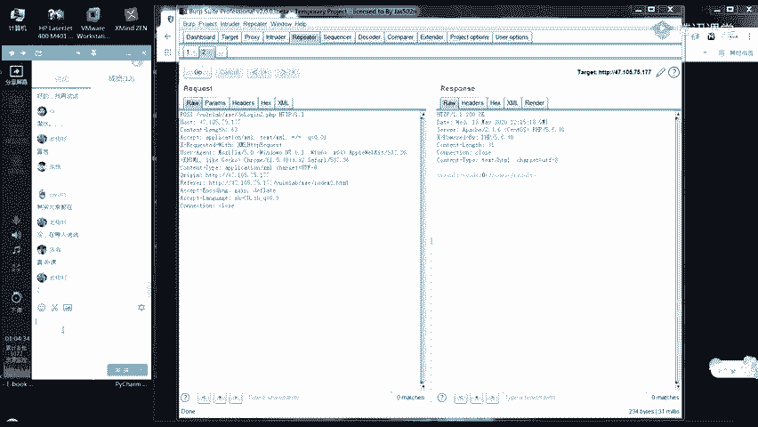

大家拜拜。😔。