# CTF最强战队-蓝莲花内部培训教程，CTF入门课程及历年真题，全100集持续更新！ - P28：28.综合测试 - 网络安全基础入门 - BV1vV411T7jY

哎，我们今天哎继续来学习。万不安全哎，通过万不安全的漏洞来最终哎获得夫务妻的权限。提升权限至root权限呃，最终拿到服务器的全部权限，取得对应的flash值。在课程开始之前哎，我们先介绍一下哎外部安全。

随着 webm技术的不断发展，呃社交网络、微博等一系列新型的互联网产品诞生。基于哎外部环境哎搭建的这种应用和平台哎越来越多。那么外部业务的迅速发展，也引起了黑客们的强烈关注。接踵而至，哎。

那就是万不安全危险日趋凸显。黑客利用网站操作系统的漏洞和web来中间键服务哎的一些。漏洞哎得到服务器的控制权限。轻者哎可以篡改网页内容，管些黑夜，重则则窃取公司内部的重要数据。更为严重的哎。

则是在网页中植入一些恶意代码。实现哎网页中。指马哎，比如说今年哎最火的就是网页当中植入哎挖矿木马。使用户哎为黑客哎免费贡献哎一些带宽了资源进行挖矿。使得网站访问者受到了各种各样的危害。

那么通过we部入侵服务器之后，哎，利用服务器漏洞获取权限。哎，这是咱们今天的内容。首先介绍一下实验环境。公积机使用卡里linux。IP地址是192。168点。253。12。靶场机器地址是192。168。

253。14。那么咱们拿到了这样一个实验环境，该如何进行下一步操作呢？咱们哎无论是在以后的渗透测试过程中，以及ICTF比赛当中，一定要有一个目的性，那就是获取靶场机器上的root权限。在CTF比赛中。

一定要想着哎拿到对应的flag值。下面咱们开始。首先要进行信息探测。对服务器，也就是靶厂机器。的开放服务进行探测。对开放服务的类型版本进行一定探测。这里咱们使用到M map这样一个工具。

然后使用小S打V这样一个参数，加上靶场IP地址，探测该靶场的服务信息。下面咱们回到公积机当中。

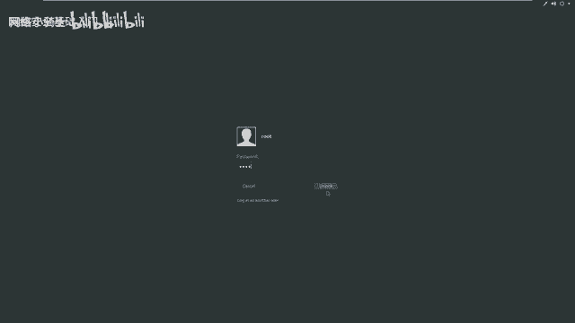

这里我先关掉呃，关掉。咱们哎使用NF杠小写S大V靶场地址。253。14回撤。这时候，MM开始探测靶场机器所开放的服务及服务的版本信息。这时候。探测结束，返回了哎对应的结果。

咱们除了哎可以探唱靶唱的开放服务信息，也可以使用A map的。更高级的参数。使用M map全方位探测参数。探测靶场机器的全部信息。命令是N map哎加上杠T4。

这里杠T4哎是代表使用最快速度按现程最大的N map来进行扫描靶场机器达到哎扫描的速度。然后加上杠大A哎，表示使用全部的哎这个探测方式来探测靶场机器。所暴露的信息。

比如说端口开放、服务开放、操作系统版本等等等等。之后是杠小微表示返回所有回显信息。最后加上靶场的IP地址。嗯 map。杠T4杠A杠V加上靶场的IP机址。114回撤。

这时候咱们可以看到N map哎开始探测信息，并且不断的哎有这个信息返回。而且这个速度还是比较快的。这时候哎咱们探测哎结束。除了哎可以使用M map进行探测。也可以使用其他工具进行探测。

下面哎咱们再介绍两个关于web信息探测的工具。首先哎咱们探测一下靶厂机器开放的这个服务当中web服务的哎目录信息。比如说外部服务当中泄露了一些敏感信息，咱们就可以使用nic to来加上杠ho。

然后加上HTTP，然后是冒号，然后们8场IP地址之后，加上对应端口号来探测该HTTP开放的。页面以及敏感信息。如果说这个端口是默认的80端口，咱们就不需要哎加端口。如果不是80端口，是必须加端口的。

否则尼wo无法识别该命令，并且无法探测。你可 to讲ho。然后加上HTTP。192。168。253。14。因为我们这里哎是开放的是80端口，哎，咱们就可以省略不写。所以说这里不用写端口，直接回车。

那么这时候哎尼 two就会对我们的靶场机器进行探测，探测HTTP服务所存在的啊一些弱点，以及它存在的啊一些斑脑信息。我们在这里哎可以看到啊它在不断的返回一些值，这里哎我们输入。no哎，不对他进行更新。

这时候哎探测结束。我们会发现哎，这些很多信息已经返回。除了使用那 two，我们也可以使用DIRB来加HTTP，然后加上靶场IP地址之后加上冒号端口号来探测按这个HTTP的目录信息。当然。

端口号和我们上面n to使用的端口号哎，这个使用方式是类似的。如果它是80端口，我们就不需要加。如果不是80端口，是必须要加端口的，否则也是无法探测。下面我们来尝试一下这条命令。首先。

DRIB有HTTP。加上靶场的IP地址。回车。这时候哎我们就开始扫描对应的目录。我们在扫描目录的时候，会发现很多信息。我们现在让他在这里扫描，我们继续回到课程当中。我们探测完信息之后，哎。

是想通过探测信息。自行进行挖掘，最终找到可利用的点。下面我们来看一看如何进行挖掘。首先呢我们要对n map和newto扫描结果分析，并对结果来进行深入的挖掘，找到可以利用的信息。

比如说如果发现某个敏感的页面。比如说配置文件哎，或者是。用户名的文件，我们可以打开查看，找到敏感信息，然后找到我们可以利用的位置。例如，本节当中，我们查看是否是某个CMS是否具有可以直接利用的漏洞。

我们这里哎就回到刚才扫描结果，判断一下该CMS究竟是什么类似的CMS。我们呃这里还在扫描，我们先把它暂停掉contrl C。这时候我们向上看。在这里哎，我们看首先看n two哎的这个信息。ne to哎。

这里我们直接看。robots点TST呃，这个应该是一个比较敏感的信息。但是我们现在要找一下它究竟属于哪个CMS。这里啊我们直接看到了wordpress，啊。

这是一个非常受欢迎的一个基于啊这个PHP的这样1个CMS。管理系统。他现在啊这在这个网站搭建上以及个人博客搭建使用哎，这个Wpress是最多的。那么咱们直接判断它就是1个CMS。Wdpress， C。

 M S。咱们下面啊就使用WP scan，然后加上杠杠URL，然后加上它这个URL，然后枚举一下它可以哎是是获获得的哎这个主题以及可以获得的这个插件，以及枚举一下它的用户名。下面我们来操作。首先。

输入哎WP scan。杠杠URLHTTP。然后是靶场IP。168。253。14。之后。你那么。R。AT。枚举一下他的主题。然后是枚举一下它的插件之后一拿。rate他的用户名。

我们来查看一下这条命令是否正确。umberate number rate然后正确啊，那我们开始执行回车。这时候哎WP干啊。啊，这里我们并没有哎加上它对应的这个参数，它有对应的目录。哎。

我们需要加对应的目录的。如果不加对应的目录，哎，那么是无法进行探测的回撤。这时候哎我们就开始哎探测该CMS哎所存在的一些弱点。我们这里哎先让他在这里执行探测。当然哎，我们在进行外部渗透时候，哎。

首先要有以下几个注意点。哪里存在弱点，我们需要在哪里挖掘？比如说在CTF当中，大家一定要注意扫描到你的登录页面是否存在设刻注入以及是否存在入口令。并且查看扫描到的目录信息是否存在一些敏感信息。

比如说页面当中的源代码是否哎已经有一些敏感信息可以利用。之后还要注意一下该系统是否是本知的1个CMS或者系统，并且在网上可以直接查到对应的利用方式。再然后还需要注意哎备份文件。

备份文件中往往是有很多值得利用的信息。比如说配置文件信息里边或多或少哎都有一些用户名和密码的信息。以及可以对其做代码审计，找到哎未知的零被漏洞。当然，我们利用这些弱点，无论是哎日常工作当中。

日常渗透测试过程当中，以及CTF比赛当中，都需要哎。对这个信息进行很深入的挖掘。对每个信息保证不放过不错过，脑洞一定要大对信息来进行深入的抽象挖掘。下面啊我们就来看一下啊这个。扫描报告。可以看到哎。

我们在这里啊已经找到了很多这样一个信息。以及发现了他的用户名。他登录使用的用户名以及他个人的用户名。这时候哎我们会想到他是否哎存在一个弱口令权益把他命登陆呢？啊，这里存在一个可以尝试的弱点。

以及我们继续看它上面的扫描结果。我们一直向上翻，可以发现哎，他这里哎有13个这样一个漏洞哎，被发现了。我们可以。查看啊对应的信息。来依此来使用。这里啊发现了一个叉SS的漏洞。又发现一个存储叉SS的漏洞。

我们可以哎点击对应的链接来访问。可以ctrl C。复制，然后在浏览器当中粘贴之后查看如何利用。一直向下看一直向下看，以及这里有s科注入的漏洞。呃，这些漏洞咱们就一不一一解释了。下面哎，咱们就来。

登录一下哎这个页面。来看一看。是否能通过弱口令来登录这个系统？这是。疑似。如果说哎咱们没有加wordpress，那么他就哎。灯打开这样一个界面。怎们需要哎。

输wordpress之后进入wordpress这个CMS。之后哎这里有个log in，咱们看是否能登录，咱们输 andmin之后哎输 andmin。点击登录。这时候哎过程是比较缓慢的。哎。

我们登录成功会发现哎登录到wordpress的后台。这时候哎，咱们就可以进一步利用一些漏洞。当然哎，如果说哎咱们没有通过绕口令登录，那么咱们这时候就需要哎来。使用刚才哎咱们扫描到的这些漏洞来。应用。

最终。获得。站点的后台访问权。对于modpri来说。咱们找到他的后台，并且登录之后，咱们更常见的是哎上传一个web shell。之后执行对应的wep shell。咱们在公积机获得主机。

也就是靶场机器的 shellll。下面哎咱们首先要进行的是生成mshop。生成Vapp shell之前，要采取监听模式，监听返回的sll。之后哎生成excelseel上传之后，然后再把唱机器执行。

返回给咱们这个启动监听的这个模块当中。就可以执行对应的这个sel操作。

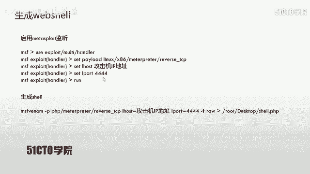

下面哎咱们来尝试执行。首先，启动。Matterport。这个过程是比较缓慢的。咱们再打开一个终端，用来生成web shell。MSF。然后哎输入V一。然后杠PTHP。之后是mattter。R。

之后是reverse。TCP low host。等于192。168。253。12。lowport等于4444。之后杠Fron。咱们生成哎这样一个效，咱们来查看一下哎，对应的源代码回撤。

咱们让他在这里来生成。咱们在这里呃，启动这个监听。首先useex，然后是。

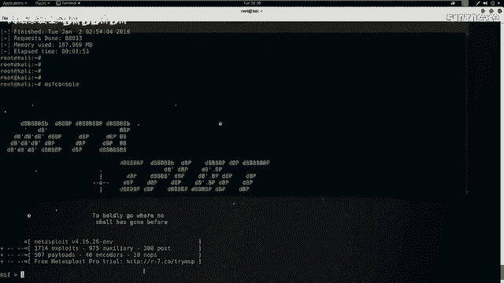

metal handle回车设置对应的payload。呃，PHP。Matter。Reverse TCP。呃，这个如果说你在输入过程中使用tamp自动补权会出现一定延迟。设置完这些之后，哎。

咱们需要查看一下我们需要哎设置的参数show options。上次。low host啊，这里需要设置啊监听的这个位置。2。呃，咱们看一下哎，这个公积机的IP地址是否是江以IP地址哦，是253。12。

是咱们这个设置的IP地址回撤。咱们设置完这些之后，哎，开始执行R。这时候啊咱们就开始了监听444端口返回的摄项。接下来啊咱们在后台上传一个we shop。对于哎这个。

wordpress咱们可以哎在这里上传。appears，然后adit date。啊，这过程还是比较缓慢的。这时候哎咱们达到了这样一个界面，在这里选择404。

咱们将shall上传到啊这个twenty forty呃这个主题下的404页面。之后哎咱们把这个hell给它复制进去。从这里哎，咱们给他复制到这里copy。花呗之后，哎，然后咱们。

conttrol位之后点击upload file。这时候哎咱们就已经开始上传。上传完之后，哎，咱们需要执行这个项。咱们找到哎对应的页面来执行对应的sel。下面哎我们就在这里。

把这个上传之后的页面复制出来。复制进来之后还输入靶场IP192。168。168。253。1214哎，这是咱们靶场。给他呃，然后执行之后，咱们看看监听端是否返回了对应的shall。可以看到哎。

咱们现在s for。已经哎这个成功的返回了对应的项。但是哎咱们。需要ID哎，并不是root权限，只是一个普通的这个3W date这样一个权限。咱们可以发现哎，取得这几个用户并不是root权限。

那么咱们哎对于这个渗透测试也好，对于CTF也好，哎，都需要提升服务器的root权限。那么咱们这时候哎就需要使用到一些方法来提升对应的权限。对于CTF比赛当中。

在服务器上哎肯定会有或多或少的信息提示来使你直接来提升权限。而在真正的测试过程当中，可能该系统并没有对应的敏感文件，而是需要我们利用。对应的内核一出。或者是其他溢出代码执行本地一出的E叉P。

然后获得对应的root权限。那么咱们下面哎就来查找一下该服务器存在的内核溢出漏洞。

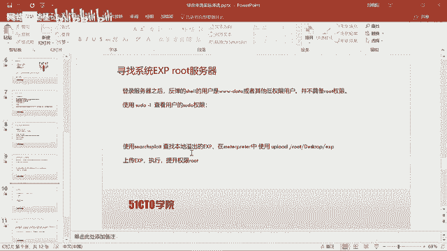

首先打开卡利，咱们启动一个终端。之后咱们利用一个工具search。spolight这样一个工具来查找该服务器的一个漏洞。那么接下来啊咱们把乌斑图把内核4。4。0这样一个信息给它拷贝出来。

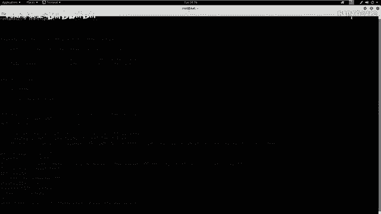

然后粘贴到哎咱们对应的这个st product哎这个软件当中。回撤咱们这时候会弹出4个哎这样一个漏洞。那么咱们今天使用到的内核一出漏洞，哎，是这一条。那么咱们接下来来切换到哎该目录查看对应的代码。

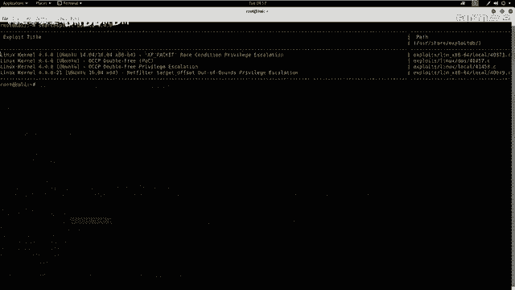

you shall export it哎，咱们可以在这里看到它的这个根目录。接下来。Export Linux。0。5之后哎local本地一出。之后是。切换到该目录，然后cat一下。

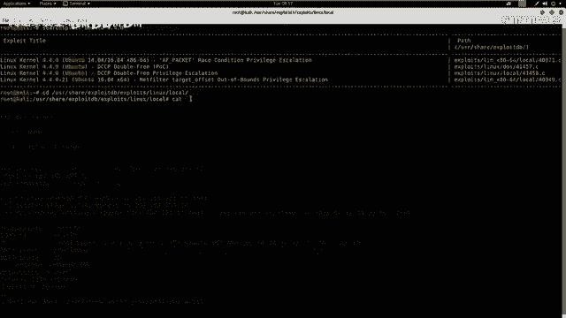

414。58点C一下，这就是咱们哎这个。

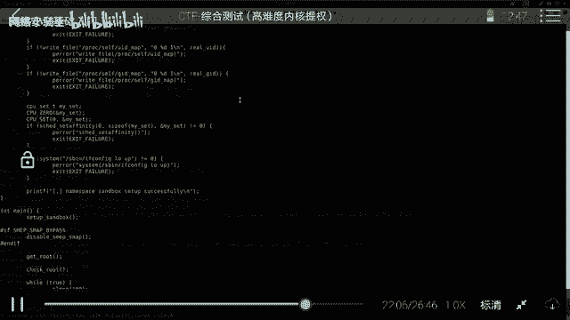

溢出代码，咱们光有这段代码哎，并不行，而是咱们需要把它编译成计算机可以执行的哎代码。咱们下面首先把它。

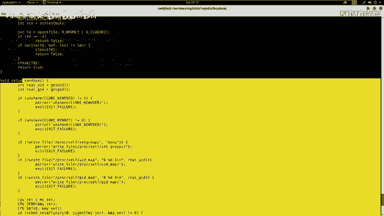

复制到哎咱们桌面copy。

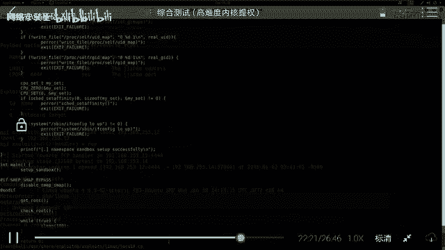

414。3。41458。点C，然后copy到root。

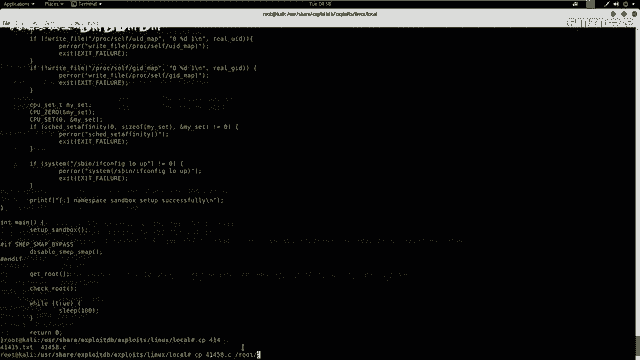

desktop啊，这样一个桌面LCD然后杠ro。切换到桌面LS哎，看咱们这里哎就有个41458。那么咱们这时候需要把它编译成计算机可以执行的程序之后编译的这段程序上传给服务器在服务器执行，那么就会。

进行本地一出获得服务器的最终root权。下面我们使用GCC。来编译下414。杠O输出hellro。也就是将这段代码编译而之后给它。编译的程序的名字叫做sllro回撤。这时候咱们查看桌面。

会发现有一个sell route这样一个程序。那么咱们接下来的操作是将这个sell route给它。上传到服务器ctrol Cy。upload咱们使用，然后将root desktoptop之后，哎。

是咱们对应的代码shall code。回车哎，这时候咱们就把该程序上传到对应的服务器。咱们LS下查看一下。会发现哎，咱们在该目录下具有。这个hellro哎，这样一个程序是在这里。但它并没有哎执行权限。

咱们需要给他赋予执行的权限，使用ch mod777赋予哎最大的权限。sell code sell root。因为哎我们在这个mateprint哎并没有这个。che默呃这样一个命令。

咱们需要在se里边执行。接下来LS查看啊，咱们有这个。shallro啊，咱们开始哎给它赋予权限turn more加哎应该是。777哎，然后是1。root回撤，这时候哎咱们LS杠AL回撤一下。

看一下是否具有执行权限。那么咱们这时候哎是具有执行的权限了。啊，因为这有RWX代表可读可写执行。那么咱们接下来哎执行。以下这段程序使用调杠shallro。回撤这时候哎咱们返回了哎这个root权限会发现。

咱们这个地方这个并不是哎这个do，而是井号表示root。接下来咱们使用ID来查看一下是否是root。回车会发现哎，的确是rootwho am I。回车哎，发现咱们的确是root。

那么这时候哎咱们就完全拿下了咱们这台服务器的权限。提升权限成功。对于CTF比赛当中，大家可能还是需要哎切换到对应的目录，哎，寻找对应的flag值来查看。最终的flash值提交获得对应的分数。

通过这节课的哎咱们这个学习总结哎两点。第一，在对目标外M渗透时，首先考虑目标是否是某个CMS系统，能否直接找到对应的E叉P。在服务器提全时查看系统。能够哎获得的信息。

比如说you name杠A或者是咱们在mettter printer使用的s in four。也就是反弹回来的这个sll。使用这条命令来查看对应的信息。当我们知道服务器的唉内核版本。

那么就可以使用shirtsp查找对应的E叉P，然后利用本地溢出来译出对应的服务器root权限。

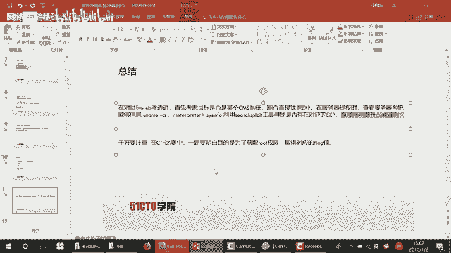

大家一定要注意，在CTF当中，咱们一定要明白，最终的目的是为了获取root权限，并且取得对应的fge。那么咱们今天的课程就到这里，再见。

