# CTF最强战队-蓝莲花内部培训教程，CTF入门课程及历年真题，全100集持续更新！ - P34：34.Linux系统安全_3 - 网络安全基础入门 - BV1vV411T7jY

大家好，本课成为linux系统安全。

本小节主要包含linux网络安全配置，自是审计安全和lininux下系统常见的安全工具介绍这三部分内容。首先是linux的网络配置安全。主要是网络参数配置和IP table的自定义规则设置这两大块内容。

系统中提供了SSYSPL命令，可以查看当前的网络参数。我们可以使用SYSCTL杠A查看当前的网络参数配置。然后我们可以通过修改ETCSYSCTL都 complete这个文件内的参数来调整。

我们当前系统的网络参储配置。如PPT所示，我们可以配置忽略ICNP广播，这样就不会对聘请求做出回应。这样就无法。通过P来发现该主机。同时我们也可以通过修改TTL值来隐藏当前操作系统的正确类型。

因为有些扫描器是通过系统返回的TDL值来判断当前的操作系统类型的，然后完成。修改配置后，我们可以通过SYSTL杠P命令来使配置生效。这是网络参数配置部分的内容。下面讲一下IP table。

IP table是linux内核集成的IP信息包过滤系统。如果链接系统连接到int网，或者说局域网内。只该系统有利于猎点系统上更好的控制IP信细胞过滤。及实现我们的防火墙功能。

下面讲一下linux的IP table命令选项的输入顺序。如PPT所示，第一个选项是杠T表明，然后是我们的规则列名、规则号，我们的网卡名，然后我们的协议名，还有我们的源端口。还有我们的目的端口。

最后是我们的。动作就是针对匹配规则之后，我们对这对相应的数据包做出的一个动作行为。我们先讲一下常见的参数选项。杠A选项就是向规则链中添加条目，就是新增一个防火墙，一条防火墙之列。

杠D选项是从规则链中删除条目，就是从当前防火墙中删除对应的规则链。杠A选项是从防火墙IPT中。插入对应的条目。干L选项是查看当前已有的防火墙规则策略。杠P选项是用来匹配。具体协议的数据包类型。

杠S选项是指匹配数据包的原IP地址。杠J选项是指要跳转的目标。杠I选项是指数据包进入本机的网络接口。杠O选项是指是一包离开本机所使用的网络接口。这是常见的几类参数选项，我们会比较常用到。

下面再讲一下规则恋明的主要内容。input链是指处理输入的数据包，就是系统接收数据包。output链是指处理输出数据包，就是本系统向外发的数据包。转发链是指处理转发的数据包。

动作的话有第一个是reect，就是表示接收该数据包。ro表示丢弃跟数据包。redirect是重定向，就是说将这个数据包转发到另一个指定的地方。下面我们看几个具体的。IT接口的例子。如PPT所示。

限制进入链的第一条规则，这里我们可以看到。限制仅从U92。668。U0。0斜杠24G管段内的IP地址才能够连接到本机的22端口及限制的访问本机SH服务的主机只能是U92。668。U0。0管段内的主机。

这样就达到对HH服务达到一定的防火效果。我们后面还有两条规则，我们再看一下限制外发连接的规则。限制外发连接的第二条规则。是像规则链中添加条目。

限制本机网卡的ETH0网卡无法向外发起UTP连接及向外的UTP包都会被掉弃掉。这是两个具体的例子。添加完自定义规则后，我们可以通过IP table干list命令来查看当前的所有规则链。

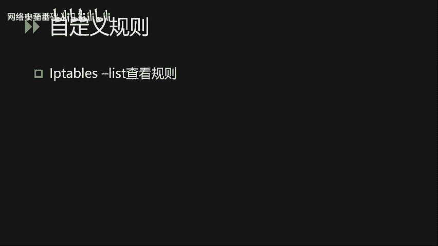

就像我们PPPT上面显示的内容，可以看到规则链是分3块，第一块是进入的规则链。圈银铺。显图上显示的是最近添加的一条规则链。然后第2块规则链是转发规则链，当前是空的，没有配置相关的规则链。

第3块是外发规则链，当前也是为空的。网络配置内容大致如上。然后我们下面讲一下linux的日志实际安全。

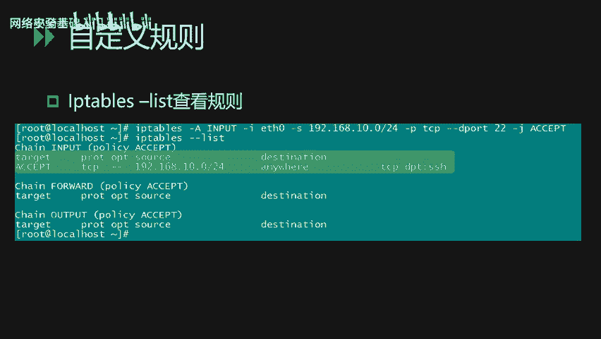

这次审计安全主要讲解这次审计功能配置和日制的简单分析。从日制的分析这一块，我们可以发现一些可疑的攻击行为。首先我们要启用lin系统的安全日制审计功能。

配置ETCRSYS log complete文件来启动这次审计功能。如PPT所示，系统的错误日志内核日志。错误日志、内核日志、调试日志等都会被记录到VRAADM message这个文件中。

这里我们可以看一下一个简单的事例。

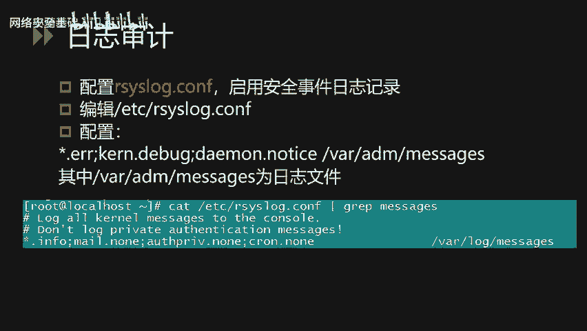

系统的这置默认情况下都保存在VR log目录下面。该目录下。一些常见的重要就识文件。如我们PT上面打印出来的。首先第一个是mo这文件，该这质文件记录了系统在引导过程中发生的事件。

就是另一系统开机自检过程显示的相关信息。控制制记录的是contable守护进程所派生的子进程的相关动作。security日志记录了与安全相关的信息，包括用户进行的重启登录等动作内容。

last love是一个比较重要的日志。该这制文件记录了最近成功登录的事件和最后一次不成功的登录事件，由lock印生成。在每次用户登录时被查询。因为该文件是一个二进制文件。

所以我们需要使用last log命令来查看。WTNP日志永久记录每个用户的登录注销及系统启动停机等事件。我们可以去用last命令来访问这个文件。我们下面看一下一个例子。

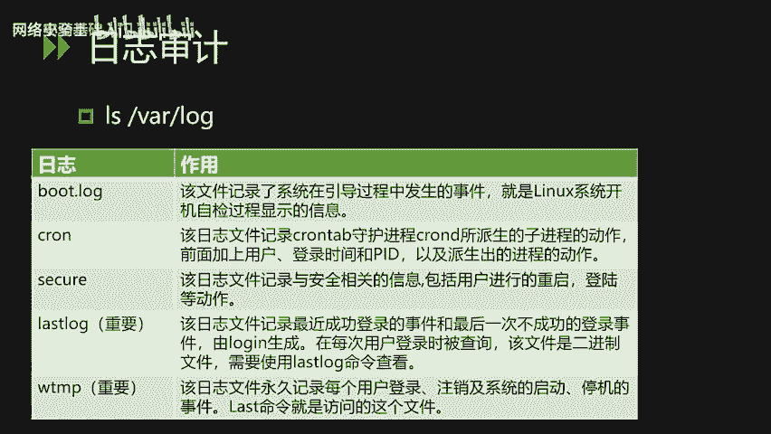

就是某台lin系统上面查看到的一些这置内容，可以看到我们这里有一个控制制，还有一个last log的志。还有一个seity录制录志。除了这些系统设置外，我们还可以看到有。我就都老日次。

WTMP日志除了系统的日志之外，第三方服务的日志也会保存在该目录中。如图中所示，还有我们的HTP日志，我们的通ca日志。开启对应的日次审计功能后。

我们就可以通过这次分析来发现恶意的攻击行为或者非法的登录行为。

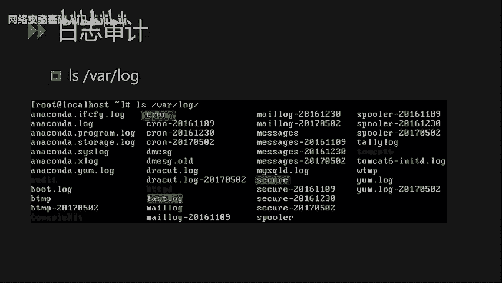

嗯看一个例子。如PPT所示，mes日志内容格式一般如图所示，包括了我们事件的发生时间节点。我们再看一下控制字的内容。控制的内容包含了也是一样的时间节点，还有一个我们的进程ID。

下面我们做一针对一个详细的例子，做一下这次的简单分析。下面针对sqQ日志的SH异常行为进行分析。首先我们可以通过命令查看一下SQ日志的内容。我们通过ca命令，然后再加上一个广告服，用glip。

这个参数来匹配SHD这个服务的相关log日志内容。我们可以看到当前的日志记录下每个SH规话的原IP地址。我们可看第二条日志，这里是从U9。668。68。1的9528端口。

发起的1个SH登录行为使用的是root账号，而且密码被接受成功登录。下面我们看一下IC取值周口令爆破日志是怎样一个情况。如PPT打印出来的，我们可以看到这里有很多的SH登录日志。然后我们简单看一下。

可以看到有很多的fail或者说emval的一个事件。从事件的发生的时间节点和频繁的密集度来分析，我们可以初步断定，这是1个IH口令爆破的一个行为。因为我们可以看到有大量的登录失败信息。

如果我们在日常的一个运维中，通过日志分析发现有这样的行为后，我们建议是将日志导出，然后做一个批量分析检查是否有登录成功的情况，然后再针对情况做一个做回令账号的定位。

下面我们再看一下last和last log命令的使用。lets命令查看最近用户的登录情况。如PPT所示，我们可以看到登录的账号名称，登录的位置是本地还是远程登录的原IP地址，登录的时间等。

我们可以看到这里录手用户。从192。168。685。1这个IP登录了3次。lastl命令查看的是系统内所有账号的最后一次登录信息。我们可以通过该命令发现异常的登录行为。如PPT打印出来的。

我们可以发现当前1234一共有5个账号，其中root账号从U92。668。685。U这个IP登录。而并用户demo用户ADM用户LP用户是从未被登录过了。

嗯。讲完系统自作分期之后，我们再讲一下。

给你下的安全工具。

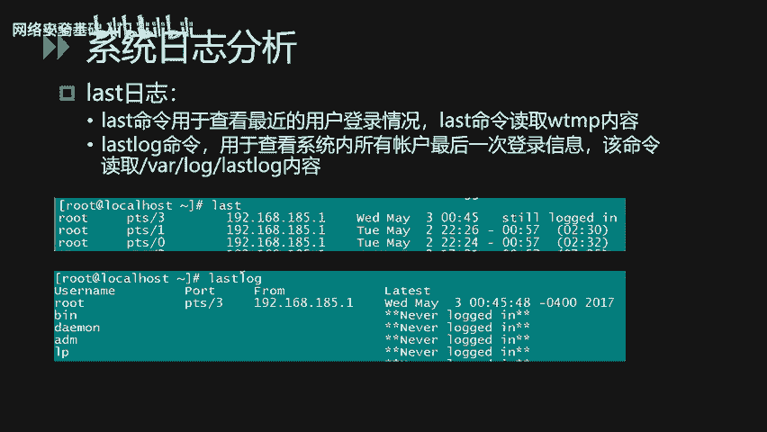

且你钱。主要是一些令一下的常见的。命令还有一些后门检测工具。首先是系统的自带的一些命令。通过自带命令，我们可以对可疑的进程进行定位分析，通过进行。分析可以定位让进程核对的动符号。首先第一个是PS命令。

该命令用于查看当前运行的进程。

L或者fi命令用于查找定位指定名称的文件。我们可以通过关键字的方式进行全系统搜索。nex state命令列出所有监清的端口和这些端口当前的连接值。g和黑WK都是一个文字字符串的处理工具。

可以用于我们帮助查找一些文件内的关键字。经常用到的话，就是我们通过一些关键字来匹配文件内的一些关键字服务，从而定位一些恶意文件。比方说我们的web shell home文件的。

ch命令显示进程所作用的所有系统对用，这个可以用来帮助我们判断程序的运行行为。s命令可以用来协助分析二进制文件的安全性。下面讲两个实际使用的例子。

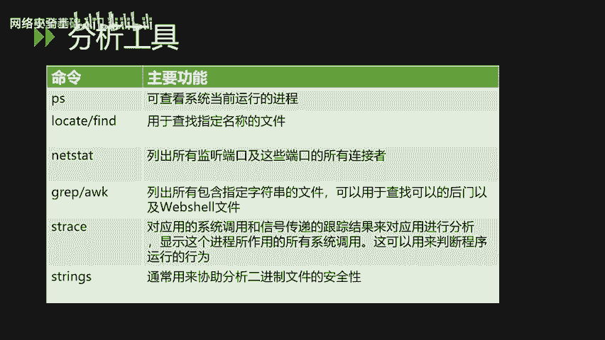

第一个是使用glip命令。首先我们可以了解到一句话木马的内容，如PPT所示。我们从中可以提取出关键字EBL跟po这两个关键字形成一个正值表达式。

然后我们可以使用glip命令来对lin下的web应用目录进行检查，看是否存在相关的内容。如PP中如PPT中的方法一。我们使用规命令。来匹配。其中，杠I参数表示不区分大小写。

杠2的参数表示指定搜索对应的目录及其子目录。通过这样的方式，我们直接指定APP website这个应用目录下面来查找该目录下面所有的文件内容是否包含EL跟pos字样的一个关键字内容。通过这种方式。

我们就可以手工进行。筛查来排查一些lookshop。第二种方法是使用fin命令。后面这里使用到了XARGS这个参数，将fin搜索出来的文件名变为后面过lip参数的输入。通过这种方式。

我们也可以手工来排查一遍webs shell。讲完这种自带工具的使用后，我们再介绍两个做口令的审计工具。做狗令。在我们日常运维中，核心是经常碰到的。所以这是一个工作的重点，特别是安全这一块。

所以说我们会从两个层面介绍两个工具，对另力系统的一个叫国令设计。进行审查。首先第一个工具是我们的。read这个工具能够对linux系统的一sha文件进行做回并审计。因此，该工具。使用该工具的时候。

必须有权限，能获取到目标系统的这的文件。能够使用。这个工具进行任文历史计，如果没办法提取到一个加密后的密码文件的话，是没办法使用的工具的。然后对于该工具，除了能够审计linux的系统热口令之外。

还能够审计orlele数据库的热口令AIAI系统的热口令。那么鉴于这个工具的特性，审计对应的热口令都是需要提取对应的热口令文件，然后按照。工具的格式要求，将密文亨账号名对一对应之后。进行包括。

这个工具有两种常见的使用方法。第一种就是我们PPT上面打印出来的。再加上一个我们又爆破的目标加密文件ETT shadow，然后加上一个我们爆破的参数，这里是杠杠新这个。这个参数代表的意思就是提取账户名。

之后利用账户名的体。各种格式变化来爆破对应的。密码。也就是说一些用户可能会。使用当前。用户名的变体来作为密码。这是第一种帮扶方式。第二种爆破方式是杠杠握历史等号，加上我们的密码字点。

这种我们可以通过收集内部常见的rap令，形成个字点后来做一个针对性的爆破。

如PPT打印出来的，我们可以看到爆破出来的效果可以显示有8个哈希被爆破成功。下面介绍另外一个热口令审计工具。

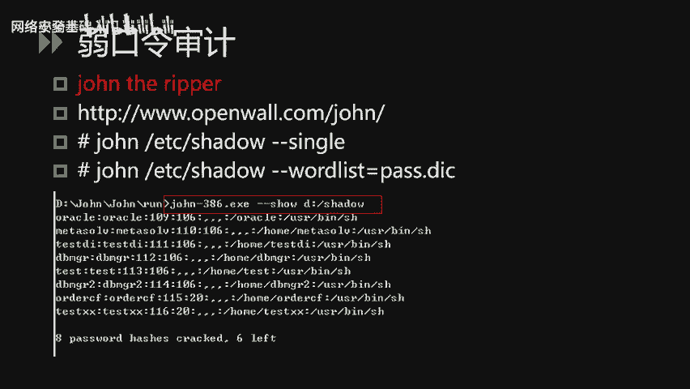

是海爪，海爪就是我们俗称的九头石。该工具与jo the level的区别在于它不需要提取对应的口令加密文件，而是通过在线爆破的方式进行一个否令实际。当然，这样的方法有好处有坏处，好处是不用提取密码文件。

坏处是因为通过爆破的方式。由于前面的口令设立安全设置化，会可能导致一些账户被锁定。因此，使用这个工具的时候，需要先跟业务跟系统管理员确认好相关的安全配置之后再做对应的一个。入口令审计。如PPT所示。

我们使用杠L参数来指定又爆破的账号名。后面的log in就是我们给包括的一个账号名，然后杠P参数。来指定我们的密码字点。然后U92。668。0。1，这是我们爆破的目的主机IP地址。

然后FTP是我们要爆破的目标主力上面的服务。至一最命令就是使我们使用。烙印账户，还有我们的pass list这个密码字点来爆破U92。168。0。1上面的FTP服务。的一个录印账户的密码。第二个例子。

这里看看我们爆破的是6920668。01EU上面的SNB服务烙印账号的密码。图上我们打出了一个实际使用的例子，我们是用。PW到TST这个密码文件来包括U92。168。U87。

129这台服务器上面的FTV服务对应的账号名是test一。然后我们可以通过爆破出来日志看到。包括结果是成功的，包括出来的用户名是test一，包括出来的pass我是123456是一个绕口令。

常见的若蒲令审计主要是这两大块，一种是在线爆破的方式，一种是提取密码文件的方式各有优缺点。然后看我们实际项目实施的时候，再选择对应的工具。讲完绕口令简测，我们再讲一下令令系统上面的。后门检测工具。

在另系统当中，后门一般被我们称之为looking。然后第一个检测工具就是我们的cha looking。它是一个用于linux本地的ly检测工具，官方地址。如我们PPT打印出来的。据官方介绍，跟目前。

目前的工具能够进行的looky检查类型可以达到60多种。然后使用方法是比较简单的，安装完了工具之后，直接在当前目录下面点斜杠运行looky，然后加上杠Q杠2参数，再加上我们的一个操作系统的根。

就会对当前整个操作系统跟下面的所有目录的文件进行一个后门程序的检测。

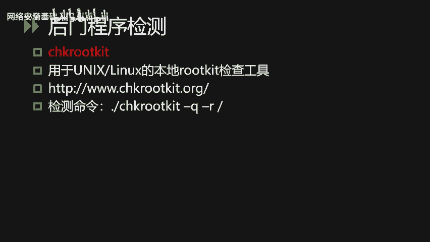

如图所示，这是官方。说明支持能够检测的looky类型。还是比较全面的。

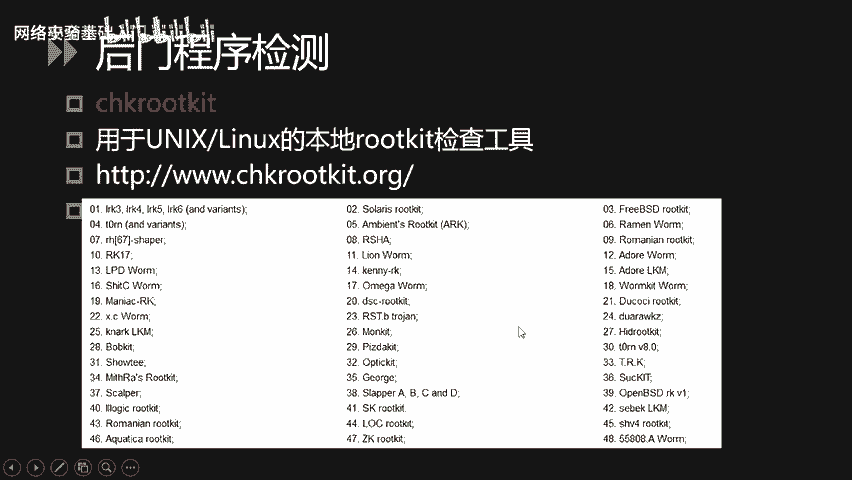

下面我们介绍第二个ly检测工具，叫做looky hunter。使用起来也是比较简单的，下载地址上面也有安装完工具之后，直接使用RKhuer杠tck命令即可。在检查过程中。

程序会随时打印出检每一项的一个检查结果，是否会发现一些异常的恶意文件。然后检查结果会生成一份具体的报告。报告的文件放在VRlog。啊K hunter登录的这个文件中。好。本小节的内容主要有3块。

一块是网络安全配置知识审计，还有链接下的常见工具安全工具的使用。大概内容就这三大块。

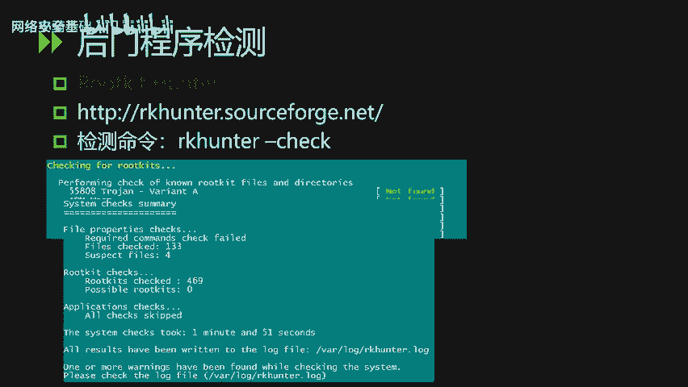

后门检测的内容到此结束。

