# CTF最强战队-蓝莲花内部培训教程，CTF入门课程及历年真题，全100集持续更新！ - P47：47.CTF 杂项_3 - 网络安全基础入门 - BV1vV411T7jY

大家好，本节课继续进行引写术密码编码和杂项部分内容的讲解。

本次课程主要介绍一些引写术密码编码题目中常用的解题工具。首先我们来看引写术题目常用的工具。因为引写术题目并没有固定的套路。所以说我们在这里只能列举出来一些最常用的工具。第一个stackof。

这个工具是一个图片引写术的常用工具。使用这个工具呢基本上可以解决90%以上图片引写出题目。我们直接使用两个题目的示例给大家进行这个工具操作的演示。

首先我们来看第一题的题目。

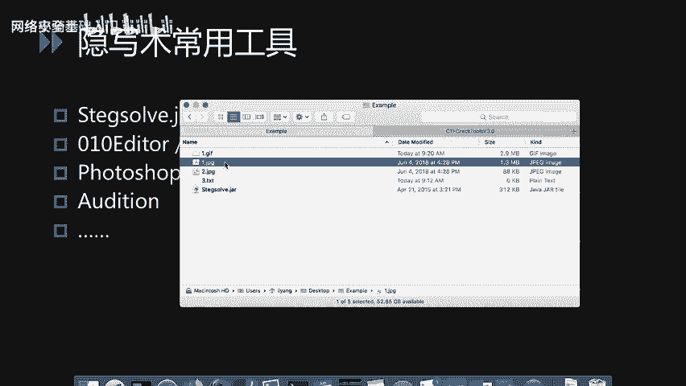

题目给出了一张图片，我们直接查看是没有任何。

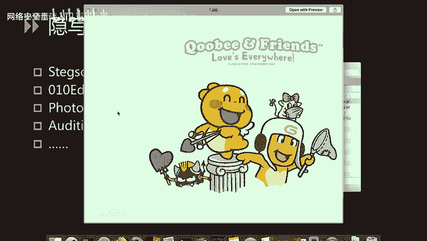

引写的信息。这时候我们运行stackaxof。这个程序呢直接是一个炸包的文件。如果我们电脑安装了java环境，可以直接运行。fell open打开。

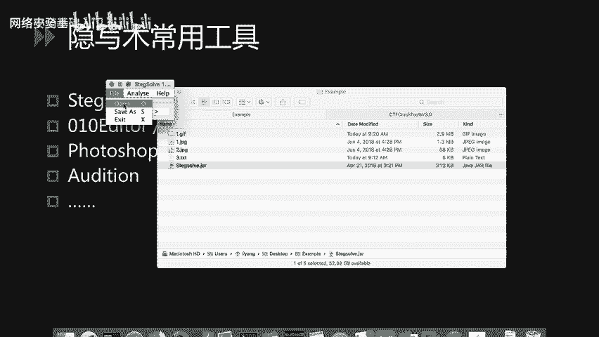

刚才的题目。直接查看也是没有任何信息的。我们可以直接使用窗口下面的箭头进行不同颜色通道。不同阈值下的查看。

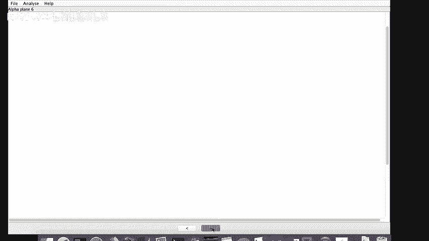

当我们点击到一定程度时，发现屏幕上出现了一个二维码。此时呢我们可以使用手机上的微信扫码工具。尝试扫码。发现呢这个位置并不能扫出二维码的信息。我们猜测可能是因为这个图片的杂色太多，因此没有办法扫出来。

这时候我们尝试打开手机QQ或者是其他的扫码软件进行一下尝试，发现某些工具可以扫出来。所以说在这里给大家推荐一个非常好用的手手机扫码工具。这个工具呢可以在多种情况下很快速的识别出图片上的二维码信息。

哪怕是一个非常复杂或者是存在各种杂色的二维码。可以直接得到它的flag值。

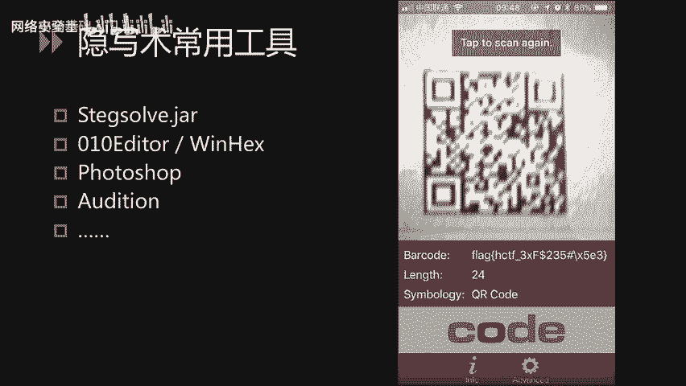

下面呢我们再看一个事例。这个实里是我刚刚制作的1个GF图，我们直接播放它是看不到任何引写的信息。如果仔细观察，可以看到屏幕的底部。有一个flag值一闪而过，而它闪的速度太快了。

我们是没办法记录下来这个随机数的。所以说我们还可以使用刚才的。tackof工具。打开。题目。点击窗口顶部的分析按钮，找到帧预览功能。此时我们只需要点击窗口底部的箭头。当浏览到包含flag的图片时。

这个程序会非常智能的把flag提取出来。我们可以看到fllaag值已经显示到屏幕的左上角了。tacktop这个工具，还有一些其他的关于图片的引写术分析功能，比如分析文件的格式。分析文件的附加数据等。

我们可以非常便捷的使用analyze分析这个图片中引写的信息。

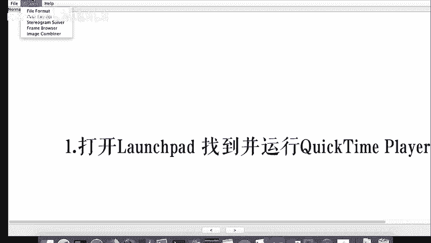

下面进行十六进制编辑器的讲解。在windows平台上常用的16进制编辑器，像010editorwin hack此类的工具比较多。在这里只对010 editoritor进行一个简单的介绍。

因为010editor有一个非常好用的功能，是导入16进制的功能。

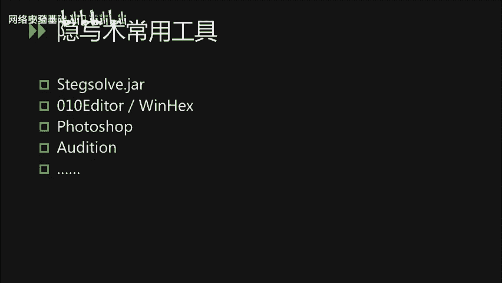

转到windows平台上。我们可以看到这道题目的代码是一串的1六进制数字。因此呢我们猜测它是一个1六进制的文件，被导出了文本格式。我们使用010editor去加载这个16进制的文。

我们使用000 editoritor去导入16进制文本。可以看到它的文件头是PK。熟悉ZIP文件格式的人，一眼就能看出它的文件头。代表。这是1个CIP的压缩包。我们直接将其保存为ZIP文件。

可以看到这个VIP文件已经可以打开了。打开之后呢，里面是一个图片，2。GPG。打开之后发现这个图片中有一段条形板。我们可以尝试通过扫码工具去进行解码。发现呢是无法直接通过扫码工具解开的。

因此我们可以考虑是不是需要对这个条形码进行拼接后才能解开。

所以呢我们下面进行photoshop几个常用功能的讲解。最近，各类CTF比赛中需要photoshop对二维码或条形码进行拼接的题目也很多。

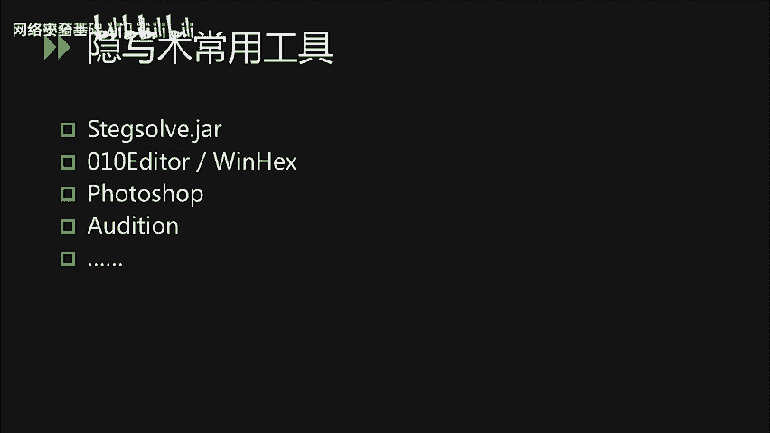

photoshop最常用的基本功能，我们也需要进行掌握。

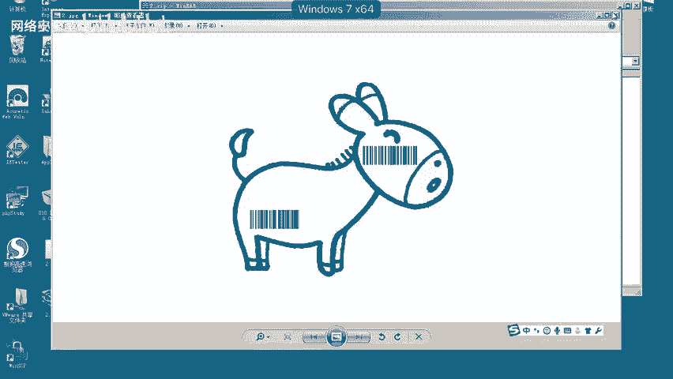

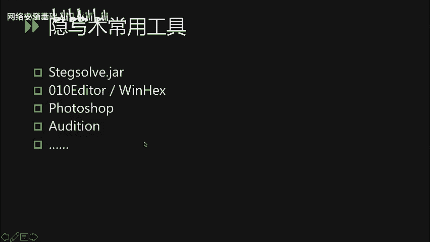

我们将图片拷贝到麦克下。打开电脑上的photoshop。

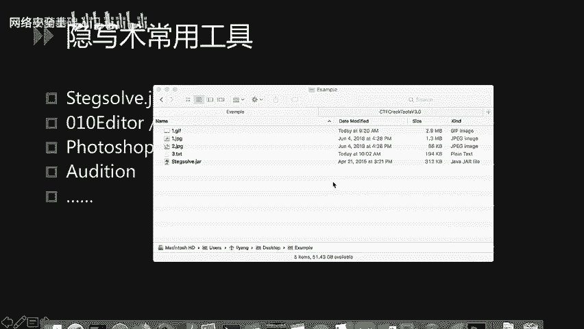

把刚刚的图片加载进来。

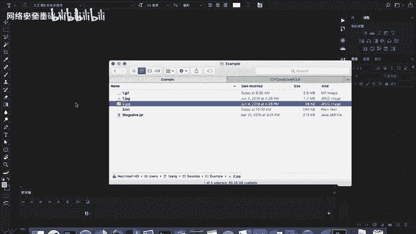

可以看到图片只有两部分存在数据。我们可以尝试对两部分进行拼接。简单的图片拼接在photoshop上很容易完成。我可以使用矩形选框工具。将条形码选出。我们使用control C或comman C进行复制。

新建一个图层。把有效信息复制到另一个图层上。下面再取它的另一部分的条件吧。ctrol C复制。

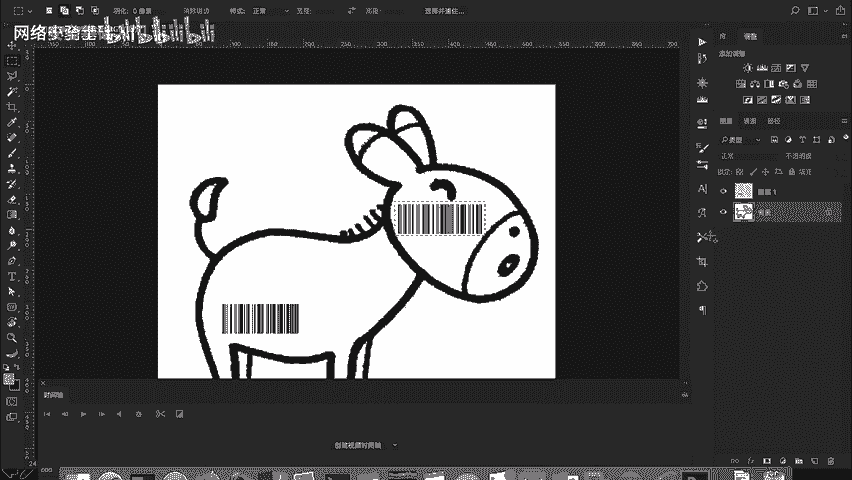

cttrol C复制。粘贴到图层上。这时候我们就得到了两段条形板。我们只需要把两段条形码拼接到一起即可。使用选择工具。将其移动到左边。我们可以调整。图层混合模式。只显示深色部分。移动上面图层的位置。

此时，在尝试使用扫码工具进行扫码或使用在线扫码工具。即可得出该题目的答案。下面简单对音频引写书常用工具audition进行介绍。audition和photoshop一样。

都是addobe公司出的多媒体处理软件。auudition主要负责音频的后期处理。

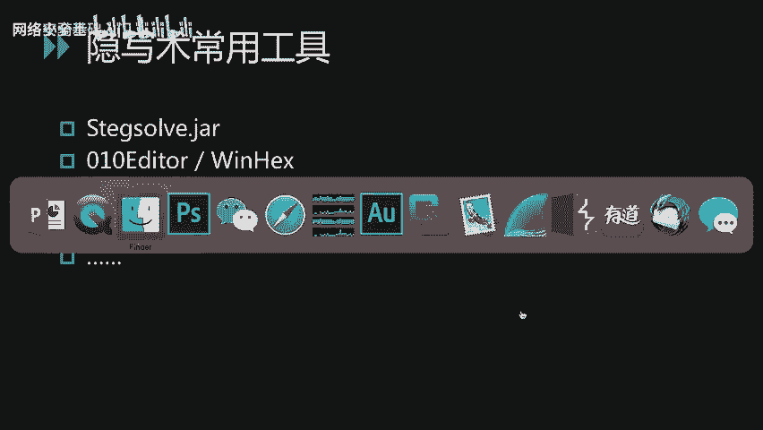

我们打开odeicion，可以看到左侧的文件窗口，我们可以在这个窗口加载CTF音频题目。

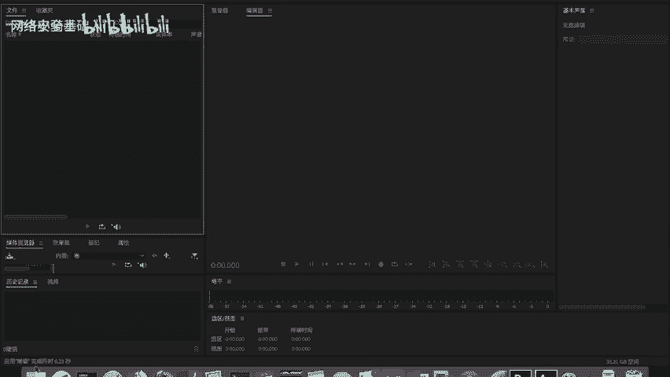

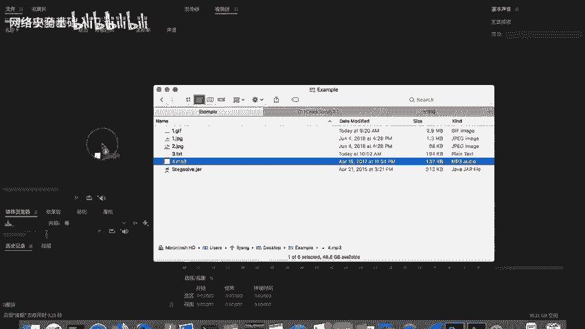

加载题目之后，双击即可对其进行编辑。右侧的L和R分别是左右声道，我们可以打开或关闭单个声道。我们看到该题目的信息主要在左声道，所以把右声道关闭。可以通过直接用光标进行选区，删除掉没有信息的选区。

保留包含信息的部分。我们可以使用该窗口上面的快捷按钮。对声音的振幅进行调节。比如对政府进行增大处理。此时我们可以就更加清晰的看到。音频中隐藏隐藏的信息。有的时候可能还会用到效果中的高级功能。

在这里不再过多介绍。

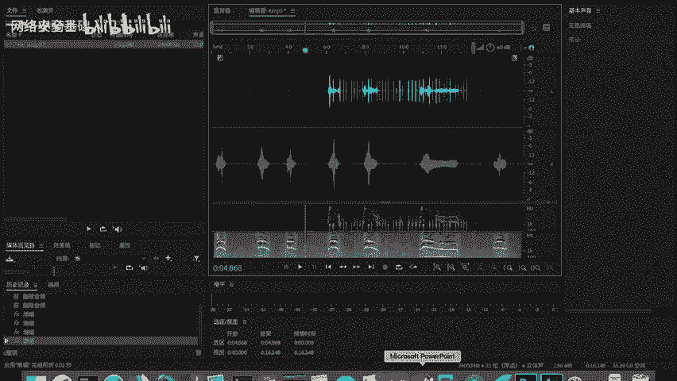

下面继续介绍密码学以及编解码相应的工具。首先我们可以在网上找到大量的加减密工具。我们可以直接通过搜索引擎搜索在线加减密工具，找到大量的常用加减密算法的加减密工具以及编解码工具。

我们也可以使用脚本的方式进行加减密编解码的操作。因为python语言更方便编写，而且可以在网上找到大量的使用工具。所以说我们可以使用python脚本的方式在本地进行加减名。

在这里就不给大家提供python脚本，大家可以通过在线搜索的方式找到大量的各种加减密算法的python脚本。在这里给大家推荐1个CTF解密用的框架。这是某个国内的安全团队编写的CTF解密框架。

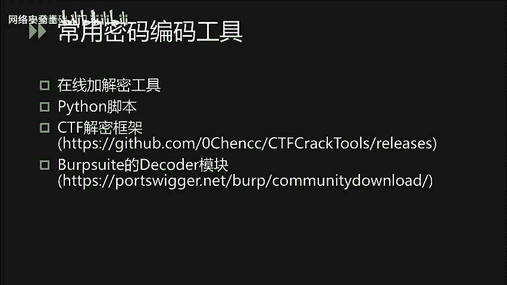

我们打开CTFcor tools。

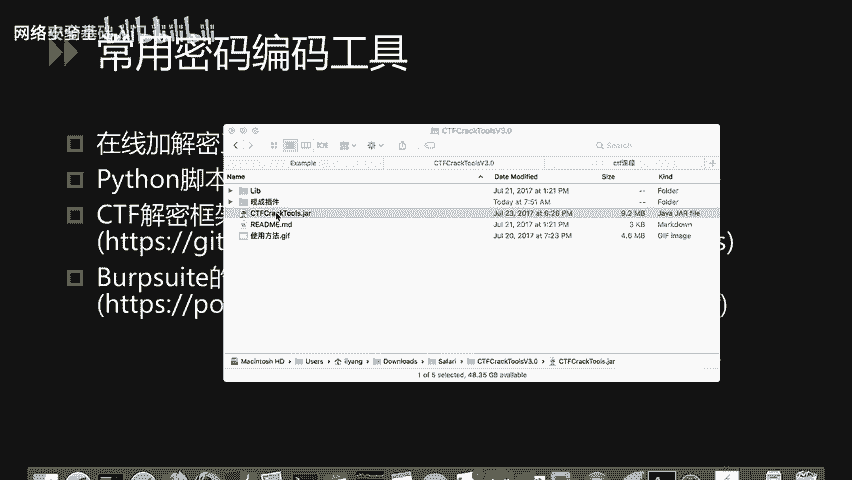

可以看到这个工具。具备多个。功能模块区。我们可以使用自己的python脚本，以插价的方式置入这个程序。因此，我们可以使用。因此，我们可以使用该框架集成多个。python脚本。方便CTF答题时的简密操作。

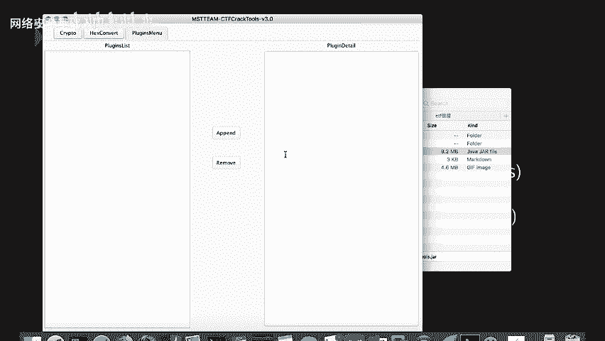

工具的get up地址已经显示在PPT中，大家可以。进行下载。最后给大家介绍一下。bb switch中最常用的decode模块，这个模块可以完成最常用的编解码操作。

我们打开boop，找到decode模块。以hello word为例，我们可以使用右侧的encoder进行不同编码方式的编码。也可以使用右侧的deder进行相应的解码操作。因为该模块直接内置在爆泡中。

所以使用起来更加方便。

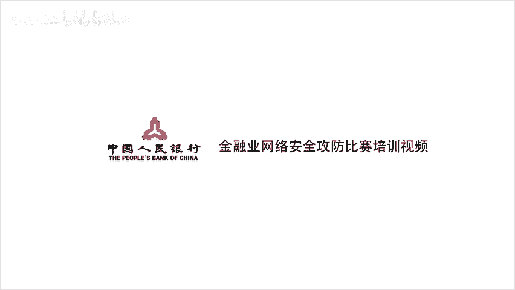