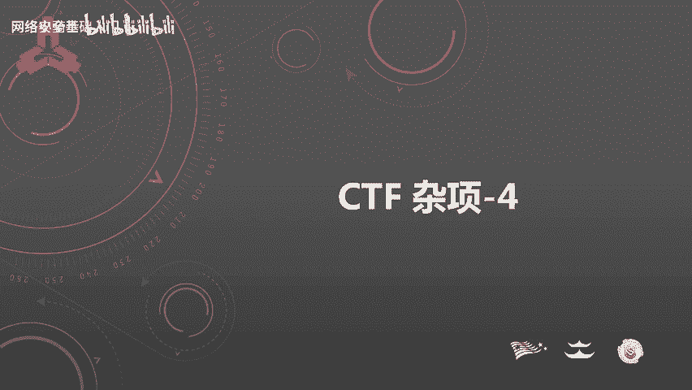
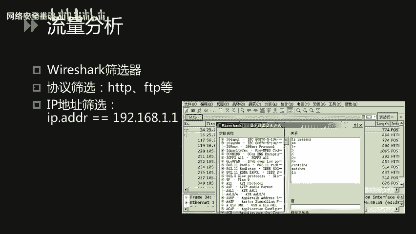
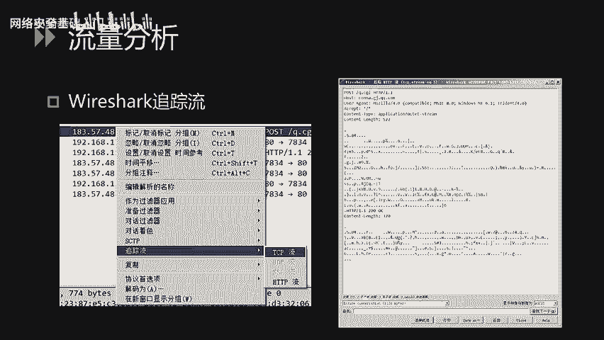
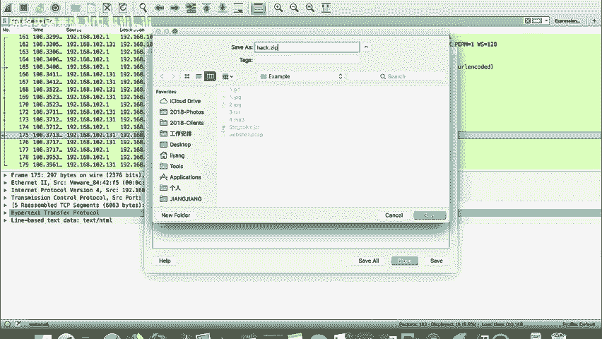
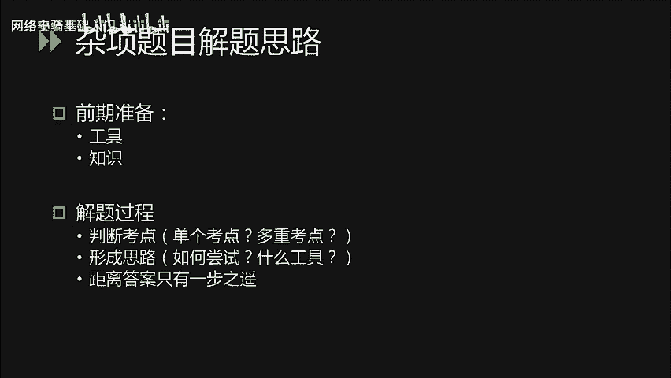

# CTF最强战队-蓝莲花内部培训教程，CTF入门课程及历年真题，全100集持续更新！ - P48：48.CTF 杂项_4 - 网络安全基础入门 - BV1vV411T7jY

大家好，下面进行引写术密码编码和杂项部分最后一节课的讲解。

本节课主要讲解CTF取证技术以及杂象题的解题技巧。CPF中常见的取证技术无非两类，一类是对流量进行分析。另一类是通过对日志的分析得到fllaag。首先我们来看流量分析。没错。

玩 shark是最常用的流量分析工具，它的功能非常强大。但是在CTF的题目中，用到的无非筛选器、追踪流和文件导出这么三四个功能。首先看玩 sha的筛选器。通过V sha的筛选器。

我们可以通过对协议版本IP地址等进行过滤。过滤后可以非常清晰明了的得到自己想要的信息。方便查看。我们可以点击筛选器右侧的表达式。使用where sha内置表达式进行过滤。表达式包含逻辑关系运算符。

我们可以使用等号不等大于小于或匹配等逻辑运算符进行逻辑值的运算。

ve shark的追踪流功能也非常实用。我们知道流量的分析无非就是分析请求与响应。当我们向服务端发送了一个请求后，那么服务端的响应是什么呢？怎样可以清晰明了的展现出来每一次的请求与响应呢？

我们可以直接右击where sha中的某一条记录，选择追踪流，追踪TCP流或HTTP流，即可在新弹出的窗口中查看到请求与响应的对应关系。我们可以使用查找框进行查找，也可以使用。也可以使用过滤掉此流。

将该数据流过滤掉，当然也可以进行打印、保存等操作。

v shark的文件导出功能在流量分析中也非常实用。假如我们的请求中有HTTB请求下载文件或FTP请求下载文件传输对象等。我们可以使用文件下的导出对象功能，将数据流中的文件导出到本地。

下面我就以1个CTF题目实例进行vesha文件导出的演示。这道题目的文件名是web shell点Pcap。所以我们可以得到一个线索。这道题目应该是对web shell进行一个分析。我们双击打开。

可以看到整个的数据请求。其中包含高层协议HTDP我们可以。很轻易的读懂HTTP的请求与响应内容。首先我们使用筛远器过滤HTTP协议。可以得到几组请求与响应的数据。我们可以看到。

首先访问了apploadPP。说明攻击者很有可能是在进行上传的操作。我们继续往下看。上传之后。攻击者访问了hack点PRPhack点PP这个文件很有可能是攻击者上传的web shell。

所以我们需要对整个的。请求与响应的过程进行一个分析。我们比较关注的是，攻击者上传webs share后进行了哪些操作？我们直接从hack点PP看起。追踪HTTP流。他的请求经过了贝斯6斯编码。

所以我们肉眼很难看出，看它的响应很明显，这是一个链目录的操作。我们继续往下看。当我们查看到最后的时候。可以看到响应中包含1个PK头的文件，说明这是1个JIP的压缩包。如果熟悉JIP压缩包的构造。

则可以知道JIP的文件头是PK。所以我们可以尝试将ZIP的压缩包导出。此时可以使用文件下的导出对象功能，选择HTDP。刚才我们包含VIP文件包的响应的编码是7175。175。

所以我们可以将响应中的175导出。将其 save入到本地。重命名为点ZIP。

打开本地目录，找到刚才保存的ZIP文件。尝试双击。发现解压失败。是因为文件头中包含两个异常字符造成的，我们可以在windows下使用。010editor或win hack进行修复。

之后我们发现这个压缩包是加密的，我们可以尝试在攻击者的操作中找到ZIP压缩的指令。ZIP杠P指令会对压缩包进行加密，我们找到加密的参数即可，对压缩包进行解密。这就是这道题的解题流程。

刚才讲解的是ve shark进行数据分析的过程。下面我们继续看电子取证。电子取证部分涉及到的知识点，无非就是日志的分析。可能是HTDP的access日志，也有可能是。系统日志或其他日志。

我们以access日志为例。右侧是某个网站access日志的截图。我们可以看到。它的每一行开头是客户端的IP地址。之后是。客户端访问服务端的时间。之后是HTTP的访问方法。后面是访问的路径。

以及协议版本。倒数第二个是响应的状态码。最后呢是响应的长度。CTF中有些题目会让参赛者。通过。查看access日志。找到网站的注入点。比如攻击者是在进行盲助的操作。

那么这个注入点很有可能是根据响应的状态码来判断是否注入成功。以及通过响应的状态码判断每一位的值。这个时候就需要参赛人员对access日志非常熟悉，对circle rule非常熟悉。了解盲助的原理。

以及如何通过日志编写脚本恢复。当然，也有可能是通过access日志查找服端的web shop。可能日志量比较大，我们可以尝试，我们可以尝试通过文本编辑器，比如noteify加加。

打开大文件之后全局搜索的方式。查找websshop的位置。也有可能是用户访问敏感路径的查找。通过找到某一个敏感目录。在对敏感目录下的网站进行相应的操作，得到flag。此类题目的出题思路比较多。

因此没有固定的套路。电子取证部分的讲解。就是这些下面我们看杂项题目的解题思路。与其他CTF题目相似，但杂项题目包含了各类CTF题目的综合利用。我们需要前期准备的东西比较多，比如各类CTF题目的解题工具。

各类考点对应的知识点，我们都需要前期进行了解。我们需要善用搜索引擎。下载和学习自己需要用到的东西。答项题目的解题过程非常重要。首先我们一定要知道这道题目的考察点是什么。

是考察单个考点还是多个考点的综合利用？比如。有个非常经典的密码题。困在栅栏里的凯撒。我们通过这个题目可以得到这道题目可能涉及到了两个考点，一个是凯撒，一个是栅栏。

那么困在栅栏里的凯撒是先解栅栏还是先解凯撒，这就需要进一步的思考，或者多次尝试得到答案。当我们了解到考点之后，要对这个考点形成一个解题的思路。怎样尝试最为高效，怎样可以最快的解出答案？

用什么样的工具可以解出答案？这些都是需要在解题之前进行深入思考。某些题目我们开始解题，发现。根据前面所想的思路。是无法得到答案的。此时不要放弃，有可能距离答案只有一步之遥。当然，也有可能选错了思路。

所以说，此时应该进行进一步的思考，判断自己的思路是否正确，是否需要继续坚持，还是放弃这道题的分数。把精力用在别的题目上。杂项题目的。练习非常重要。我们平时要多在在线平台练习各种CTF比赛的题目。

这样才可以在比赛的时候看到一道题目，很容易的知道它的考察点，形成解题思路。因此，我们需要多练习，多看别的队伍的r up。

最后祝大家杂项部分解题顺利。

