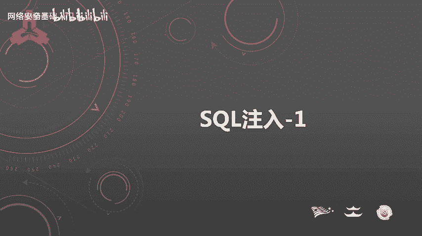
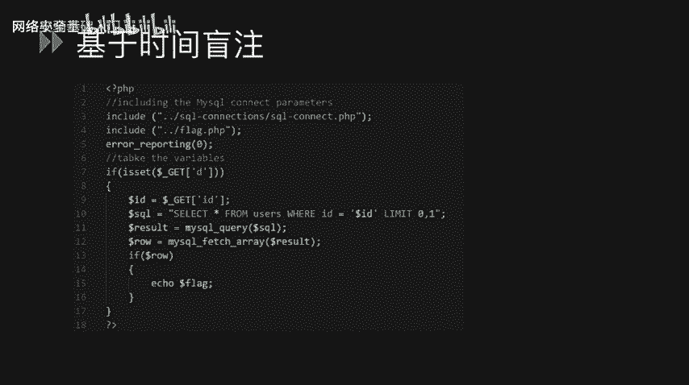
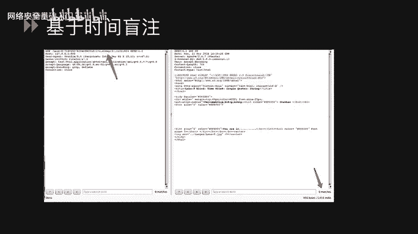
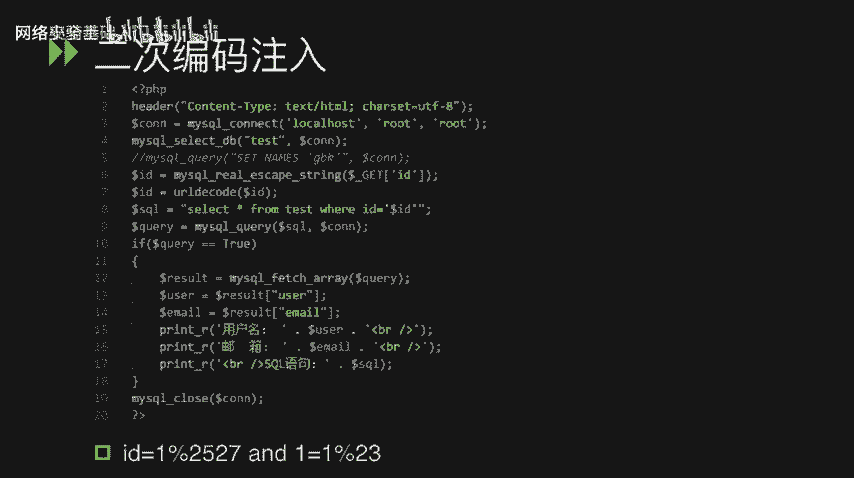
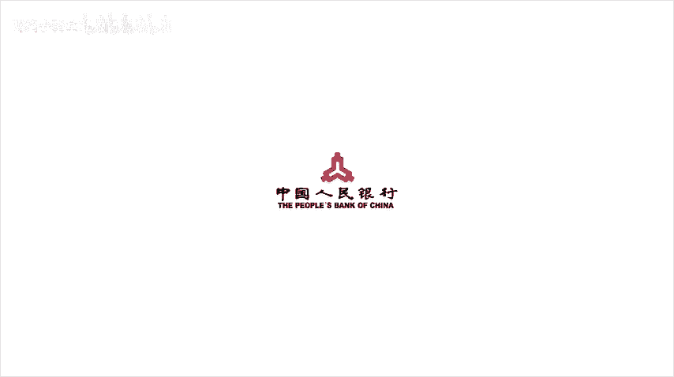

# CTF最强战队-蓝莲花内部培训教程，CTF入门课程及历年真题，全100集持续更新！ - P49：49.SQL注入_1 - 网络安全基础入门 - BV1vV411T7jY

大家好，这节课给大家讲一下SQ注入在CTF当中的应用。

那么什么是SQL注入？SQ注入它实际上是攻击者通过将SQ命令。恶意插入到postt提交的数据。或者在URU参数中的参数值。进行恶意的插入SQl数据。从而造成额外的SQ语句执行。

那这个额外的SQ语句往往就是攻击者构造的恶意的SQ语。它可能是SQL查询语句，也可能是恶意的删除更新语句。这些语句。除了对SQL数据库造成了一些可读的风险。往往也可能会对SQ数据库造成了一些严重的威胁。

那么在CTF当中，我们往往遇到的是myq数据库。那么我们这边就重点讲一下myq数据库的一些注入的技巧，以及myql数据。库在住当中。遇到了一些问题。那么s注入它有很多种类型。我们这边挨个讲一下。

第一种字部性植入，我们看一下这个。丁冇。这当中有一个SQ语句，在第四行是select新 from users were name的语。后面拼接了一个从get参数。链中获取的参数值。

那我们可以通过像name这个参数输入。参数值，并且构造恶意的SQ语句，造成额外的SQ语句执行。我们可以输入。name等于test加上一个单引号，而这个单引号就是为了去闭合第四行的那个单引号。

然后通过联合查询的方式去执行额外的SQ语句。比如。test单引号union select。这样的方式去查询额外的数据。数字性注入。我们看一下demo。demo里面有一个。

seecre语句select content from test where IDD等于ID变量。这个ID变量是第三行里面。通过get参数里面获取到的。这个变量是一个数直变量。

所以说我们称之为数字性主义。那么我们就可以通过。i d 等于。咦。然后。后面加上union select进行联合查询。执行额外的SQl语句。那么我们网可以通过单引号保护并过滤内容。

也就是通过一些安全函数来去做一些安全校验。比如ad slashes。对单引号做一个。转移my skill escape stream。对单引号进行一个。过滤。布尔行蒙座。而我们讲到的第三个类型。

我们可以看一下，在这个demo当中。在第九行。有1个SQ语句，这个SQ语句由于在ID这个变量后面加上了limit1。那么这边我们不可以通过直接的union select。来进行USSQL查询。

那我们只能通过。一些忙助的方式。来去判断是否存在SQ注入，然后通过盲助的方式。挨个的去读取我们想要的内容。首先我们输入ID等于一，加上一个单引号。从而去闭合。变量ID前面的那个单引号。

我们这样子我们就破坏了整个SQ语句，导致这个SQU语句是没办法执行的，所以说它是没有回显。好，接下来我们输入一单号and一。等于一，然后最后把那个最后的那个一的代引号去掉。

这样子我们可以完整的实现整个SQ语句。也就是说不会去破坏它的SQ语句结构。这个时候由于一等于一，它是等于 true，所以说这个加了跟没加是一样的。所以说他还是有回险。危险跟原来一样。我们再输入一。

单引号and一等于2，由于一等于2是foralse，所以说这边还是使用了逻辑运算V end。所以说这边整个SQ语句执行下来是个foralse，所以说不会有任何的回形。通过这样的方式。

我们就可以得知这边是存在1个SQU注入漏洞。那么接下来我们就要通过忙助的方式来去获取一些敏感的信息内容。盲住我们往往用到了几个函数。下面讲一下这几个函数。第一个Lance就是返回。字助串的长度。

第二个sub string去截取字助串。s stream01就是截取这个字符串的第一个字符。那挨个可以挨个去截取自助串的每个字符。ask就是返回这个字符对应的askk码。

sleep这个函数是将程序挂起一段时间，也就是说休眠一段时间。if这个判断语句是一个。条件判断。那么如果我的衣服里面三个参数的第一个参数，也就是说第一个参数我获取到这个依句是正确的，就te。

那么就会执行第二个依句。那如果。第一个是错误的那就会执行第三个语句。从而我们可以通过这样的方式来去猜测它的长度。比如说衣服。呃，test这个自助帅。是不是。大于3，如果大于三的话。

我们就执行第二个啊select什么什么。那如果错的话，我们执行第三个呃， selectlect什么什么。那通过这样的方式，我们通过结果来判断到底第一个字符串的大小长度大小是不是我们想要的那个长度大小。

然后去猜测它的长度到底是多少。那我们也可以通过这种方式来确认他的。数据库名字的长度。我们通过盲碌的方式。将数据库的名字用dabbase这个函数获取到。然后。输入给less这个函数。

然后通过大于号、小于号等于号。来去读取。他。数据库名字的长度大小。我们这边可以看得到，当它等于八的时候有回显，大于八的时候没有回显。也就是说大于八的时候是forse，等于8的时候是te。

所以说它的这个数据库名字。的自助站长度就是8。我我嘢。可以通过这种方式。来去。挨个知道它8个字符里面每个字符对应什么。那如何知道呢？就是通过每个字符对应的阿克玛是多少来去知道。它每个字符对应是多少。

然后最后将这8个字符挨个串起来，就能知道它的数据库名字是多少。我们也可以通过这种二分法和阿斯玛的方式来去读取它的。表明和他的列名。基于时间的帮助。基于时间的忙助。

实实上和前面基于布尔型的忙助有异曲同工之妙，也是通过。一些无法获得直接回险的方式去读取一些想要的内容。我们demo跟前面那个demo是差不多的，但是我们这边使用基于时间的忙助的语句来去执行。

我们看一下，我们在ID这个漏洞变量里面。输入了一个sleep这么一个函数，让它消灭5秒。我发现。我们加上sleep。我。和没加上46。5。他的。整个请求得到返回的。期间长时间长度是不一样的。

而sleep里面的数值越大。response返回的。速度就越慢，时间就越长。通过这样的方式，我们就可以得知这边是存在1个SQL。注入漏洞的。并且可以执行sleep这个函数。

宽子接入宽子接入发生的位置一般就是PHV发送请求到Ms克时。字符集使用了charactter set client的这个设置值进行了一次编码。那往往它就是设置为GBK的编码方式的时候，存在这种问题。

我们可以看到这个demo里面，在第四行，我们将字符集设置为了GPK，也就是中文字符集。然后在第五行执行了一句SQ语句。Select content from test where ID等于ID变量。

这个ID变量在第三行做了一次安全函数的校验转换，用 add flashes。做了一次。转移。我们艾 slashes会将单引号转移为。扮引号字符串。也就是说在单引号前面加一个反斜杠。

那么这个时候我们如何去绕过这个问题呢？我们看一下下面的pload。那么我们叫ID。等于百分号DF百分号27。27%，也就是单引号的URL编码方式形式。由于这边存在一个艾 slashes，我们就会在2。

二期前面加上一个反斜杠。这个反斜杠的UL编码以后就是百分号5C。由于这边设置了GPK的字符集，那么百分号DF和百分号5C就会被解码为一个繁体字的运。这个时候我们的单引号就会逃逸出来。

形成一个单独的单引号，这样子就。我们形成了我们想要的SQU注入的。王助。那么这边。如何去修复这个问题，实际上就是把自路级设置为UTF8即可。宽子节注入还可以去绕过一个安全函数。

也就是msq real escape stream。msq real escape stream的话实际上是对如下的7个字符会做一次。转业。也就是说，在如下7个字符出出现的时候。在它的前面会加上。

反斜杠。二次编码注入。二次编码注入其实它是由于安全函数过于冗于使用导致的问题。我们可以看得到这边。在第六行使用了mscuial escape string。这么一个安元函数。

但是由于在第二行我们设置字录集为UTF8，所以说这边不能使用框子解束。我们继续看在第七行。又使用了一个解码UIU解码的函数UIUdecode。而这两个函数同时存在，导致了我们可以进行一次绕过。

我们输入的payload的变量就是ID等于1分号2527and一等于1分号23。重点就在于第一个输入。变量就是10分号2527。

由于1摆分号2527里面不存在my secure real escape stream想要。转移的那些7个字符串里面的任意一个。那我们这边my career escape string就会成功的绕过。

进入到了第七行。第一七行在做U儿抵扣的时候，我们1分号2527会做一次U儿游解码。也就是说百分号2527会被解码成百分号27。由于百分号25，它解码形式就是百分号。

所以说我们这边就形成了一个解码后的单引号。从而。进入到了第八行的SQ语句当中，从而达到了我们SQL语句额外执行的。权限。那这边就是一个二次编码注入的问题。

