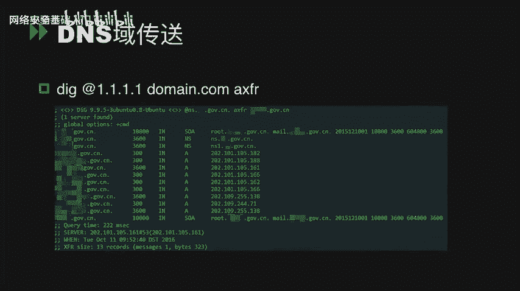
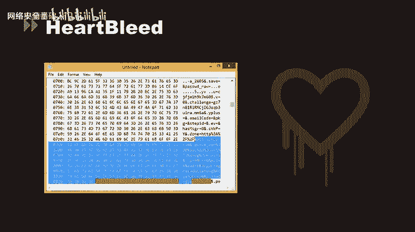
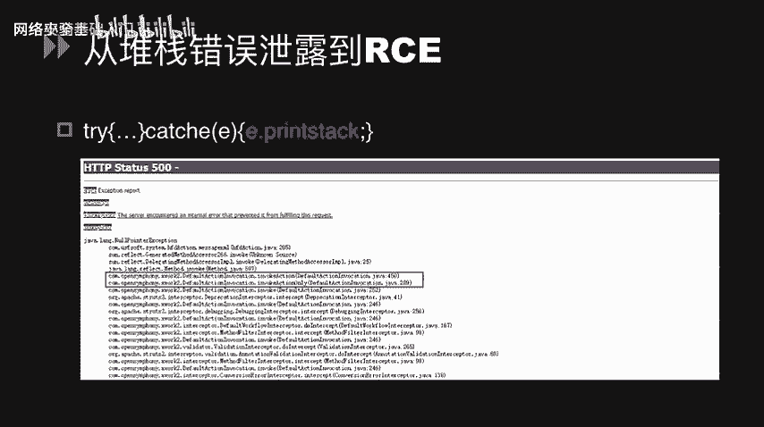
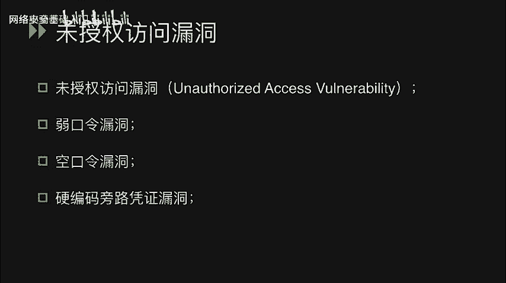
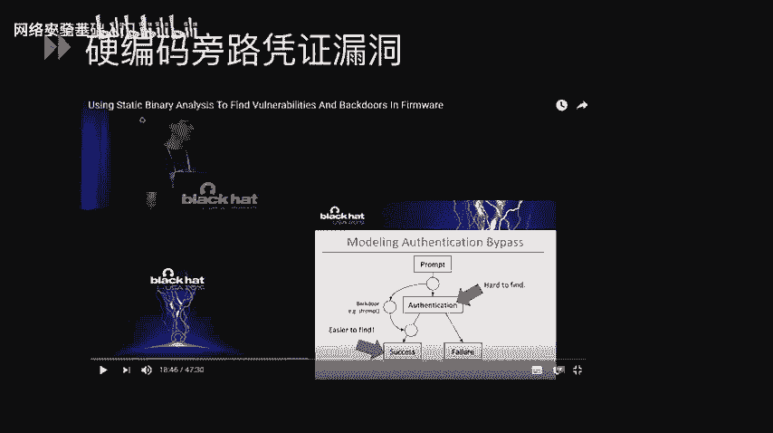
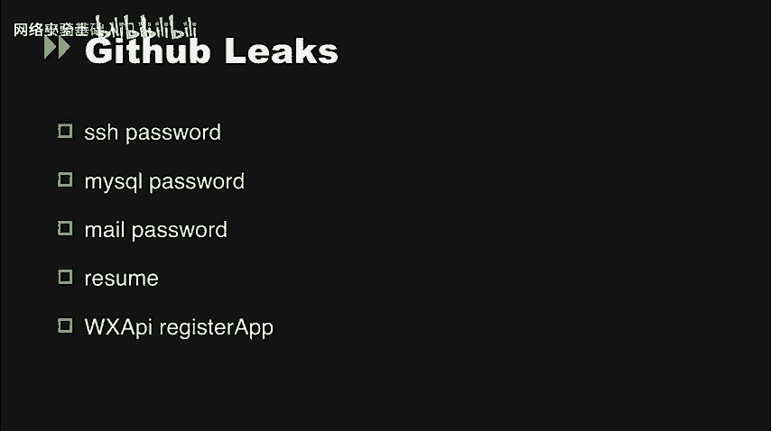
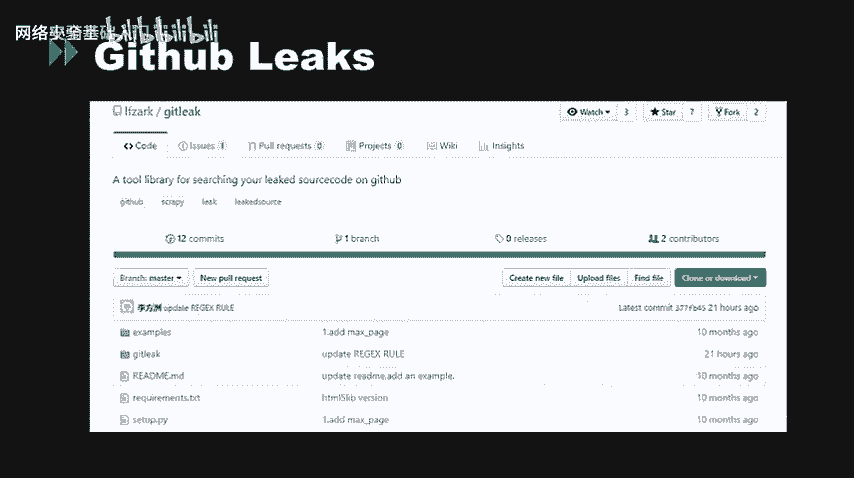
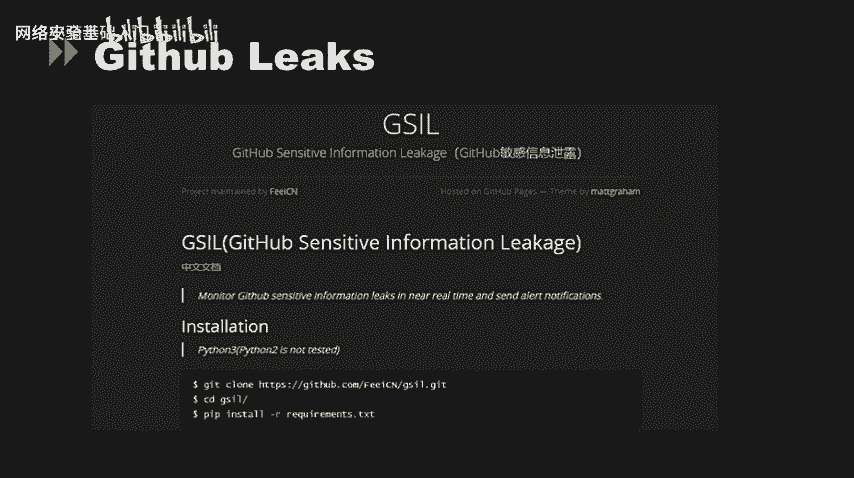
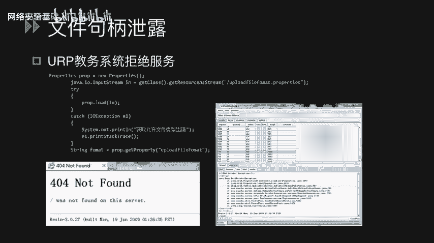
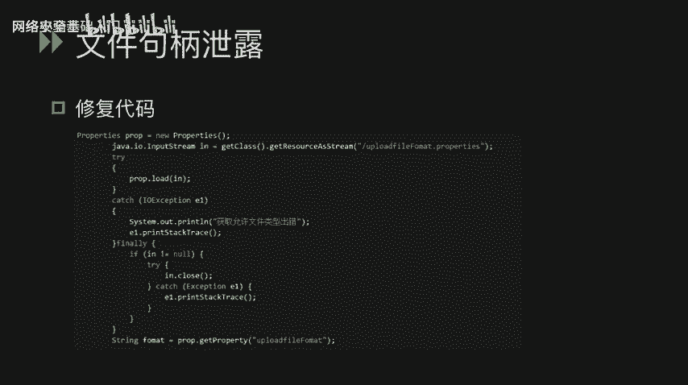

# CTF最强战队-蓝莲花内部培训教程，CTF入门课程及历年真题，全100集持续更新！ - P56：56.信息泄漏 - 网络安全基础入门 - BV1vV411T7jY

大家好，今天给大家主要讲述一下关于在CTF比赛中遇到的与信息泄露相关的安全漏洞。此类漏洞在CDF中基本上是解题的第一环节。通过这类漏洞，我们往往能够获取到出题者给我们留下的一些做题的提示。

从而能够更好的进入下一步做题的环节当中。

首先讲一下外尾源码泄露。wa尾源码泄露主要是由于代码管理工具和断代码管理平台的一些在备份和更新的过程当中会留下一些备份文件或者配置文件。这类文件往往导致了我们外尾源码的一些泄露问题。首先。

在mercurial这个现代化的开源分布式版本控制系统当中，它往往会使用HG in进行更新，创建一个项目。在FGin的时候，往往会生成一个点HG文件在网站的根目录下面。这个点SG文件往往会留下一些版本。

在更新的时候一些留下的信息和配置问题。我们通过在网站的根录下面输入点HG这个路径来寻找有没有此类的配置文件遗留。我们也可以通过自动化工具DVCSreappper来发现此类问题。其次。

在点get源码泄露当中，我们在运行get unit初始化代码库的时候，会在当前目录下产生一个点get的配置隐藏文件，用来记录代码的一些变更记录和commit。在发布这些代码的时候。

我们往往可能会忘了把这个点get目录给删除，然后直接发布。那使用这个文件我们可以来恢复源代码，同样也是在网站的根目录下面。访问点get。路径或者在点击的路径下面访问config目录。

我们就可以发现此类问题。我们同时也可以使用自动化工具，get hack。或者DVCSre这个工具来发现点get源码泄露的一些问题。点DS store源码泄露。

我们往往会在mac系统或者OS叉系统里面会发现点DS store的一些源码泄露的问题。而此类问题往往是在我们发布代码时被删除文件夹中隐藏的点点 store。

这就好像在windows中有一个点recycle文件，被发现以后，这个文件往往会泄露一些文件名的一些敏感信息。同样也是在网站的根目录下面去访问点DS store这样的一个路径。

我们去发现点DS store的源码泄露问题。那使我们也可以同样可以使用一些自动化工具来发现这样的问题。比如说DSstoreE叉P工具来发现在网站跟目录下面的一些点DS store的源码泄露问题。

那其实在CTF比赛当中遇到的最多的还是网站备份压缩文件的这么一个信息泄露的问题。那在网站使用的过程当中，我们往往可能会对网站的一些文件进行修改、升级，或者做一些呃删除的动作。那么此时网站的一些。呃。

整站或者其中的某一个分支就进行需要进行备份。那运维管理员为了自己的方便，以及后期的这个回滚，我们可能在备份文件的时候，或者在修改过程中，他会把这些嗯备份的压缩文件放到网站的根目录下面去。

然后从而我们可以通过对这些网站根目录下的备份压缩文件进行一个嗯字典爆破，或者进行一个探索，来发现网站之前一些备份备份文件。那么网站管理员为了自己的一些嗯习惯方便以及自己的喜好，往往会把这些。

网站的备份压缩文件其一些比较常规的，以及大家都知道的名字。比如说呃web点zip或者3W点ziip。那么由于这种错误的配置，那么我们可以通过渗透测试当中使用一些。

自动化工具或者使用一些扫描工具来发现这类的压缩文件，来从而获取网站的源代码以及网站的一些硬编码配置。这类漏洞可能是嗯被黑客用来做嗯服务器的整站源代码以及部分页面的源代码下载。那在CTF当中。

我们往往通过这种漏洞来获取PHB源码，从而进行代码审计，然后发现一些。比较严重的安全漏洞。那么一般这种网站备份压缩文件的后缀名，比如有点RR点VIP点7Z点TR点GZ点BAK点SWP点TXD点HTM。

那么往往我们可以通过两个自动化工具来发现这类的网站备份压缩文件。一个就是可以使用AWVS扫描工具。第二个就可以使用遇见珍藏版来发现此类的网站备份压缩文件。那么在这些后缀名的网站备份压缩文件当中。

我们可以看到有一个点SWP的文件。那么这个点SWTP的文件其实就是VMVIM的原文件泄露。我们往往可以访问，比如说index点PHV点SWP可以直接访问到index点PHP的源码。

那么我们可以访问index点PHP加一个波浪线的形式来访问这个文件的源码。如果当网站出现此类文件，但是无法正常访问，只能通过下载的形式来下载到SWP文件的话。

我们可以通过VIM这个命令行工具来去读取它的恢复后的原文件。通过VIM的R参数来读取对应的index等PSB点SWP的原文件。那另外一种还有通过SVN来导致文件泄露的一个安全漏洞。

SV就是sub version，是一个开源的源代码的。版本控制系统相对于RCSCB采用了一些分支管理系统。然后SVN它使用了服务端和客户端的结构。当然，服务端和客户端也可以同时运行在同一台服务器上面。

那服务端是存放着所有受控制数据的subversion仓库，另一端是subversion的仓客户端程序。管理着受控数据的一部分在本地映射。那在这两段之间是通过各种仓库存储层。

也就是RA的多条通道进行访问的。它往往可以通过HTBSSH或者FTP等形式来对仓库的文件进行操作。那么SVN文件的话。

我们也可以通过在网站登录下访问点SVN目录或者点SVN路径来访问是否存在有SVN文件泄露。我们也可以通过自动化工具。

像DVCSreappper和CSVN这两个工具都可以访问到是否存在这种SVN的文件泄漏。那以上就是关于在代码管理工具和代码管理平台遇到的一些呃外部源码的泄露。

那接下来是关于在应用服务应用软件层可能遇到的一些信息泄露的问题。呃，第一个比如说在DS层面就会有存在一个预存送问题。那DS服务器往往可能会有主备服务器。那么主备之间进行数据同步使用的就是预传送功能。

这个预传送的关键配置就是如PPT上面所写用al transfer这个关键词来配置一些IP和一些。K。呃，那么DNS预传送问题就是在DNS服务器配备的时候，往往会存在主备的DNS服务器。

那么进行主备数据同步的时候，往往就使用的是预传送功能。那么预传送的关键配置就是使用allow transfer这个关键词进行配置。那么设置方法是一种是在options配置域，一种是在zoom配置域。

那么优先级为如果zoom没有进行配置的话，那么则会直接遵守options的配置。那么如果zoom进行配置的话，则遵守zoom的配置。那么Otion配。options的配置和zoone的配置呃。

如PPT中所配置的一样。那么如果直接使用默认配置文件进行配置的话，就是说不手动进行添加al transfer关键字的时候，那么就可能会存在DNS预传送问题。那DN次预传送的问题往往会带来它的子域名泄露。

我们可以从这个图中就可以看到，我们通过用这个方法来去。探测的面点com，然后使用AXFR参数，可以看得到有很多的。在结果中看到了有很多的子域名。

我们可以通过这种方式来对一些子域名进行膨站攻击的方式来获取主服务器的一些权限。

接下来讲一下hard blade的这个。安全漏洞。哈布利早先是在SSL层的一个安全漏洞。这个漏洞当时引起了广泛的注意。就是由于我们可以像配置了HTPSS协议的网站。进行使用hel blade。

攻击脚本进行攻击，可以获取到一些用户的缓存信息，在内存中的缓存信息。比如说他的cookie，然后我们可以通过。获取到的cookie进行解食的方式。

使用匿名身份进行登录。接下来这个漏洞我们往往在平时的安全渗度测试当中会遇得到。那么我们可以通过故意去修改一些。路径或者说修改HB方法来使页面报错。然后可以获取到页面的一些堆栈信息错误。

那这个堆栈信息错误往往是在代码中写的时候，它使用try和try cash。这样的一个。抛出异常的过程当中，使用了print stack这么一个函数，这个函数就会把当前的对账信息错误给输出出来。

那如何从对栈错误可以直接获取到网站的权限呢？我们可以看如下的一幅图里面。我们可以在这个。对量信息报错的页面当中可以看到一个ex work的这么一个错误。

那么这个x work2的其实就是str two的一个重要组件。那我们可以判断该网站使用的str two的架构。那们可以通过尝试使用strat two的一些经典的远程代码执行的漏洞，获取服务器权限。

那接下来讲述的是一个比较重要的。在应用服务层面的信息泄露问题，就是未授权访问漏洞。那未授权访问漏洞和弱口令漏洞以及空口令漏洞和硬编码旁问凭证漏洞。这四个漏洞从原理上讲都是差不多的。

但是它在利用程度方面来说都是有一点微小的区别。那么一个一一来解释一下这个问题。那未授权访问漏洞，实际上是针对一些应用层服务的一些。问题。他在。服务启动以后没有配置任何的认证口令，导致了攻击者可以直接。

进入到服务内部获渠到。应用服务里面的一些关键信息。那入口令漏洞其实就是配置了。凭证口令，但是配置了一些比较弱的凭证口令。比如说123456ABCDE。这种入口令。那空口令漏动是。

该应用服务或者该系统确实可以配置。口令，但是。也可以配置没有口令的用户名。也就是说我可以输入用户名为addmin或者然后口令为空，可以直接登录进去。那这种是空口令漏洞。那还有硬编码旁路凭证漏洞。

硬编码旁路凭证漏洞首次在2015年的USAblack hat当中提到了这个问题。

硬编码旁路凭证漏洞实际上是在整个系统当中，我们可以在系统中找到一个硬编码的一个。认证字符可以通过该认证字符绕过系统中的复杂的认证逻辑，直接获取到系统的权限。那比较出名的有。

在海康卫视的某个型号，某个版本的摄像头中就存在了该问题。在该型号的摄像头当中有一个硬编码认证写在前端。用户名为匿名者。密码为斜杠177，斜杠177斜杠177。

然后我们可以通过user冒号pas的形式做b64编码，然后在login SP中新建一个name目为user in80的cie字段。然后通过伪造cookie的形式，直接访问面点SP。

在2018年的RSA conference当中，它官方发布了1个APP软件。该APP软件由于泄露了1个API接口，该API接口可以直接读取。约百来位用户的。用户名。这也是比较典型的硬编码漏洞。

被授权访问漏洞是目前比较热门的内网漏洞。在公网服务上面也经常存在这种问题。那么在CTF当中，我们其实往往也会通过这种漏洞获取到一些关键信息。目前主要存在未授权访问漏洞的有如下一些应用服务。N F。

 S4 sabafu， LD A P， R S， F T P， Tla， Jenkins， Mongo， D， B， Rais， zookeeper， El search， memory cash。

 coach， D， B， Docker， solar hand duop。首先我们可以看到，在FTP当中就存在有匿名访问漏洞。FTB匿名访问是指开启了FTB的用户，设置了匿名登录的功能。

我们可以通过使用anims这么一个用户，然后输入任意码就可以成功登录FTB系统。radio为手点访问漏洞radius是一个开源的使用ANSIC语言编写的。

支是网络可基于内存易可持久化的日志型key value数据库，并提供多种语言的API。它在windows下使用了redius client这么一个客户端工具。

在linux下使用redius杠CLI这么一个客户端访问工具。reos在默认的情况下会绑定在6379端口上。那么这样将会将redus服务暴露到公网上。在没有开启认证的情况下。

可以导致任意用户在访问目标服务器的情况，未授权访问redius以及读取redus的数据库。那么攻击者在未授权访问radius的情况下，可以利用radius的相关方法。

可以成功的在radius服务器上写助公钥或者。定时任务，从而可以使用对应的相关配置，直接登录目标服务器。那么如下是reduce的一些基本命令参考，有confi set来调整reduce服务器的配置。

还有confi get获取redius的服务器配置参数。那么我可以在先在本地生成一个公钥私钥，使用SSHking来生成这么一个公钥私钥队。然后将公钥写入for点tT文件。

然后我们用redius CI的命令行工具。通过被授权访问漏洞连入redus，并写入一个crrack kit文件。

然后我们可以通过comic set来转换它的当前目录路径到root下面的点SSH文件夹里面。然后我们可以通过confi get。来获取到当前的。冇录路侵。

再用confi set来修改D B file name这个authorized case。将我们的。公要写入asorize case，然后最后保存。保存成功以后，我们就可以在本地使用私钥进行免密登录了。

那么我们也可以通过mate sp当中的。成熟的工具。payload来使用利用该漏洞。接下来我们来看一下git hub上面的关于一些。信息泄露的问题。就系。前几周的抢网杯比赛当中有一道。

彩蛋题该彩蛋题就是使用了get up上面的一个开源源码。这个源码经我们下载以后已行分析，可以在配置文件当中看到posts gry SQ的。数据库连接账号密码。这也是比较典型的硬编码漏洞。通过。

该硬变码问题，我们可以直接获取到数据库的。登录方式。从而进入数据库，修改数据库里面的相关数据。那么github上面往往还会泄了一些比较敏感的信息问题。比如说SSH的密码，mysq的密码。

还有一些邮箱的密码以及一些简历和一些API的注册接口。

我们也可以通过一些自动化工具，比如说get link来自动化搜索。

上述为一些信息泄露问题。也可以通过GSIL这么一个工具来获取一些敏感的信息问题。

那么最后我们来讲述一下在文件聚丙泄露当中遇到的一些问题。那么文件具体泄露从严格意义上来讲，它并不算信息泄露。他只是。在代码编写的过程当中。就系。打开了文件IO以后，进行了文件处理操作以后。

并没有对该IO进行关闭。由于这种操作导致了大量的IO资源泄露。我们可以利用该问题对服务器进行。远程拒绝服务攻击。通过barber suit的intu模块，对该接口进行一个。帮你工资。来讲夫气。

资源耗尽，造成拒绝服务。那么修复代码就是在最后一行加上。关闭函数close。

