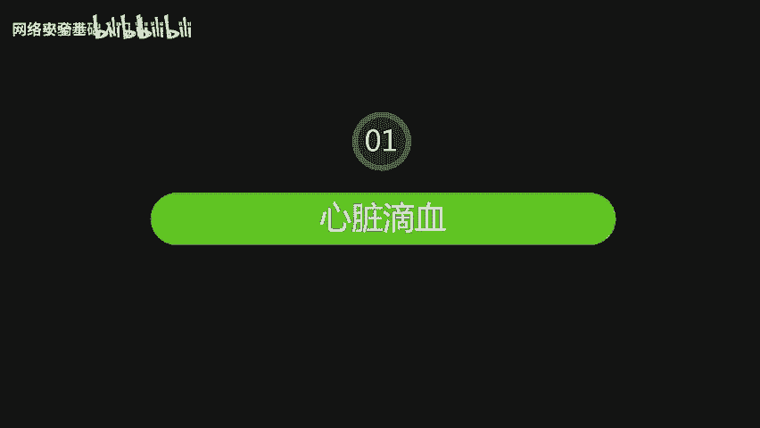
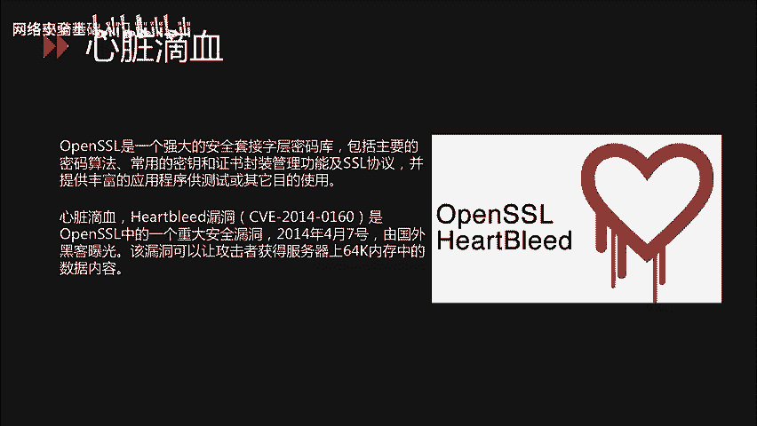
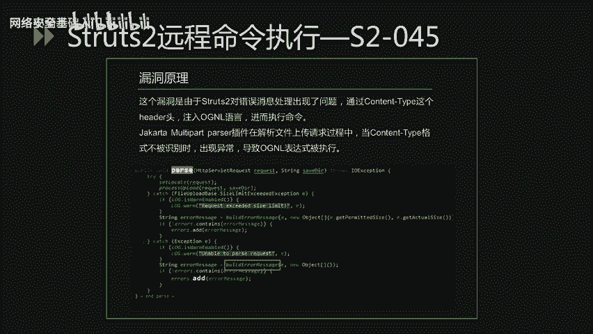
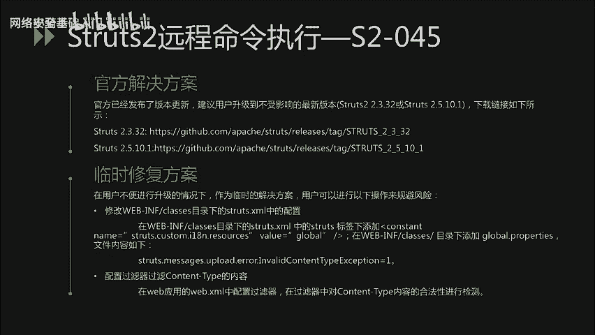
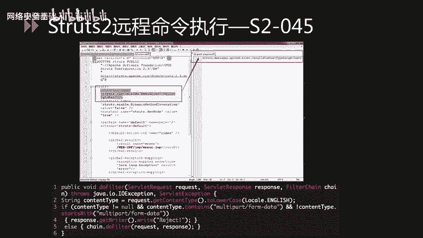

# CTF最强战队-蓝莲花内部培训教程，CTF入门课程及历年真题，全100集持续更新！ - P64：64.重点漏洞分析_1 - 网络安全基础入门 - BV1vV411T7jY

大家好，本节课内容是重点漏洞分析第一部分。

主要分析心脏低血以及str to远程命令执行两个漏洞。心脏低血漏洞存在于open SLL当中。

open SL是一个强大的安全套接自成密码库。包括主要的密码算法，常用的密钥和证书封装管理功能及SIL协议。并提供丰富的应用程序供测试或者其他目的。心脏滴血漏洞又叫hart不ed的漏洞。

CVE编号是20140160。是open SR当中的一个重大安全漏洞。2014年4月7号，由国外黑客曝光。该漏洞可以让攻击者获得服务器上64K内存中的数据内容。该漏洞可以泄露服务器的内存当中的数据。

其中包括大量主机托管数据等敏感信息，如用户名、密码、信用卡、号码等。另外，管理者还可以复制服务器的数字密钥。随后，伪到服务器或解密通信。由于使用openSL的源代码的网站数量巨大，各大互联网公司均中招。

因此该漏洞影响十分严重。

下面看一下漏洞原理。TL心跳由一个请求包组成，其中包括有效载荷。通信的另一方将读取这个包，并发送一个响应，其中包含同样的载荷。在处理心跳请求的代码中，载荷大小是从攻击者可控的包中读取的。

由于open SLR并没有检查该载荷大小值，从而导致越界读取。造成了敏感信息泄露。泄露的内容可能会包括加密的私钥和其他敏感信息，例如用户名、口令等。对于该漏洞的验证。主要流程如下，首先。

建立sockcket的连接。然后发送TLSLclient hello请求。接下来是最为关键的部分，发送机型hartbl的数据。向服务器发送机型hardbleed的请求。

如果服务器响应会伴随有encry heartbeat message。也就是泄露的内存数据。最后一步，检测漏洞存在。漏洞验证的流程可以使用pathon脚本来去完成。

这里给出一个git up上开源的漏洞验证的一个脚本。大家可以作为参考。那么该漏洞受影响的版本也是相对比较多。大家可以根据PPT当中所列举的受影响版本及不受影响版本。对服务器当中的open SL的。

是否受影响进行排查。那么对于该漏洞的修复主要是有两个方面。从官方的解决方法来看，open SLL已经发布了1。0。1G修这个版本来修复此问题。因此，建议升级到open SLL1。0。1G这个版本。

对于open SL1。0。2release。系列的版本。厂商表示将会在1。0。2。贝塔2当中这个版本进行修复。主流的linux发行版也已经发布了相关补丁，建议尽快升级。

那么第二个方面是从临时临时解决方法。如果不能立刻安装补丁或者升级，可以采取以下措施，以降低威险。使用Dopen SLLno heartbeat选项，重新编译open SLL即可。接下来。

分析structure to远程命执行漏洞。str two是一个基于MVC设计模式的web应用框架。它本质上相当于一个slet。在MVC设计模式中，str to作为控制器来建立模型与视图的数据交互。

下面这几个漏洞是2017年被曝出来的，主要做是远程命令执行类的漏洞。从str to远程命令执行漏洞爆出的数量来看，strike to这个框架存在的安全问题是相对比较多的。S two045这个漏洞。

使攻击者可以在使用strat to。jaarta multi parel插件上传文件时，修改HTDP请求头中的content type值来触发该漏洞，导致远程执行代码。

S two046是S two045补丁的绕过攻击者通过设置conttain dis file name字段，或者设置con lens超过2G这种两种方式来触发异常。

并导致file name字段中的OGNL表达式得到执行，从而达到远程攻击的目的。H two048是阿坝奇str one插件存在远程代码执行的高危漏洞。攻击者可以构造恶意的字段。

只通过str two的str one的插件远程执行代码。S two052。这个漏洞是。刷子2。5点差以及之前的部分。2。叉版本的REST插件存在远程代码执行漏洞。

漏洞的成因是由于使用extre handleler反序列化exre实例的时候，没有任何类型过滤，导致远程代码执行。S two053。该漏洞源于在处理frameme mark标签时。

若程序员使用了不恰当的编码。若程序员使用了不恰当的编码表达，会导致远程代码执行。S2054。是阿帕奇strRESD插件使用了过时的jason live库攻击者可以通过构造特制的jason恶意请求。

造成dos攻击。S to055。是由于app帕ache structure调用了存在反序列化漏洞的jackson jackson库。导致了反气硫化漏洞的产生。下面以S2045为例，分析该漏洞的。

利用过程以及修复方案。

S two045这个漏洞是由于str to对错误消息处理出现了问题。通过contin type这个h头。注入OGNL语言进而执行命令。

jakata multipart parel插件在解析文件上传请求过程中，当conuter type格式不被识别时出现异常，导致OGNL表达式被执行。

该漏洞触发是在building in message函数，在代码中的位置已已用红色框来进行表示。

对于该漏洞的检测方法，主要是由通过POC验证或直接查看structure two的版本。还可以通过漏扫工具进行检查。最后呢。也可以通过在线检测的网站来对这个漏洞进行检测。对于该漏洞的监测呢。

可以通过安全防护设备来进行监测。或者定期的对框架进行升级维护。下面我们看一下POC当中的关键代码。该段代码。是配漏的的关键部分。将该代码复制为contin type，然后发送给服务器。其中。

远程命令执行的代码部分用橙色字体来表示。该漏洞受影响版本是strch2。3。5至2。3。31之间的版本都受影响，以及str2。5至2。5。10。不受影响版本是2。3。32以及2。5。10。1这两个版本。

对于该漏洞的解决方案，也是从两个方面来去解决。第一是官方解决方案。那么官方已经发布了版本更新，建议用户升级到不不受影响的最新版本。下面也给出了。新版本的下载链接。在用户不便进行升级的情况下。

可以采取临时修复方案。修改web inclass目录下的str点X amount配置文件。在该配置文件当中的str标签下添加constant标签。

并且在web in classes目录下添加global点proties。文件。并将文件内容填写为PPTPPT当中展示的内容。第二个步骤是配置过滤器，过滤con type的内容。

在we部应用的web点Xmo中配置过滤器，在过滤器中对conon type内容的合法性进行检测。下面展示对于临时修复方案当中的部分截图。

第一张图片是修改。strch的配置文件，并且添加globe点properties配置文件。下面的截图是。过滤器的关键代码部分。

