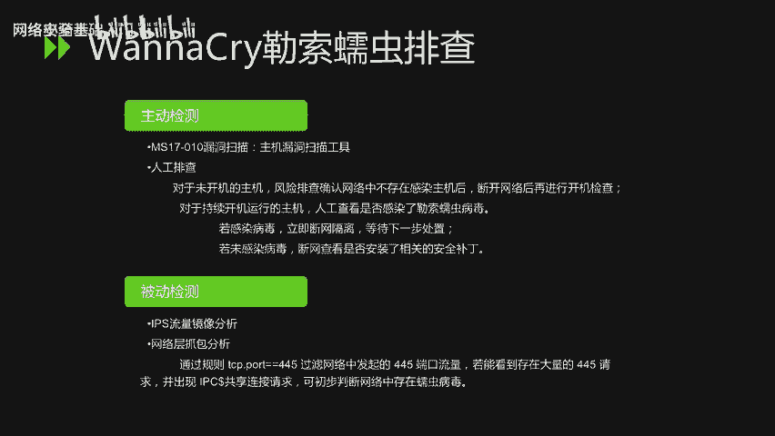
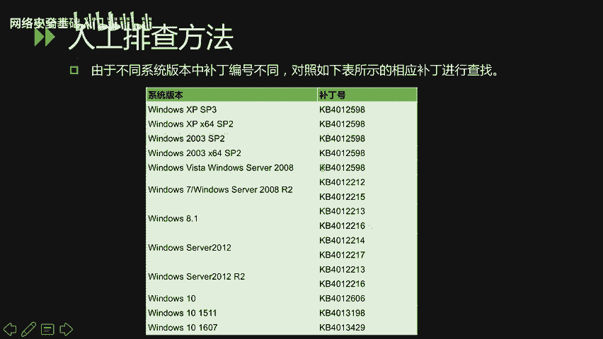
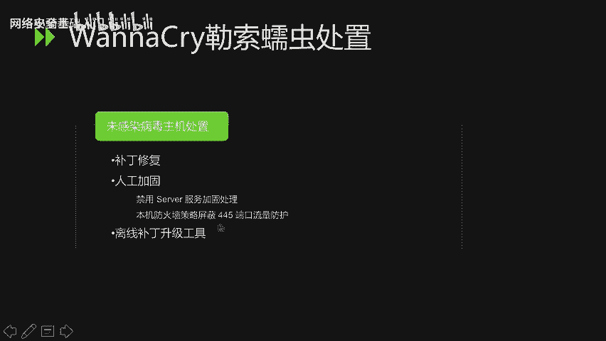

# CTF最强战队-蓝莲花内部培训教程，CTF入门课程及历年真题，全100集持续更新！ - P65：65.重点漏洞分析_2 - 网络安全基础入门 - BV1vV411T7jY

大家好，本节课内容是重点漏洞分析第二部分。

主要分析ssha和永恒之蓝两个漏洞。sha要少可也叫破壳漏洞。在讲解该漏洞之前，首先介绍一下拜事。拜是是大多数linux系统以及mic克OS叉默认的 shellll。

它能运行于大多数unux风格的操作系统之上。对于shasha克漏洞主要是有两个，第一个是CDE20146271。攻击者可构造特殊的环境变量值，以及已在这些环境变量的值中包含特定的代码。

当shall对这些环境变量求值时。这些特定的代码将得以在系统中执行。某些服务和应用接受未经身问者提供的环境变量。因此，攻击者可利用此漏洞，源于在提供这些服务和应用的系统上执行任意的shall命令。

第二个漏洞是CV120147169。该漏洞产生的原因也是CDE20146271这个漏洞的补丁并不完善，存在被绕过的情况。因by使允许在环境变量的值中进行函数定义。即在函数定义后，加入二位的字不串。

攻击者可利用此特性在远程写入文件或执行其他，可以影响到系统的操作。首先看一下CV120146271这个漏洞。受到该漏洞影响的拜使使用的环境变量是通过函数名称来调用的。二。圆括号和左花括号开头。

通过环境变量来定义。而在处理这样的缓函数缓定变量的时候，并没有以函数结尾符右划括号来结束，而是一直执行其后的s命令。验证该漏洞的过程是。在shall下运行词条命令。如果输出内容是monnerable。

this is a test则证明系统当前的blash版本存在漏洞。若输出以下内容，则证明不受该漏洞影响。下面看一下CVE20147169这个漏洞。在验证该漏洞过程中，我们可以看一下这条验证的命令。

其中，X这个变量，它的值就是单引号引起来的部分。那么其中。颜色标注的这这部分内容是为了让bs的解释器出错。当出错之后，在缓冲区域中就会剩下右监过号。和反斜杠两个字符。于是，拜使会把后面的命令。

换个行放到这个缓冲区当中，然后去进行执行。对于该漏洞的验证方法，也是在shall下运行该命令。若输出以下内容，则证明系统当前的bu事版本存在漏洞。

可以看到颜色标注的这一部分是执行了eccho date的一个结果。对于这两个漏洞的修复，那么主要是有以下两种情况。对于sinOS redhead系的系统更新bash。

使用ymupdate ba来去进行更新。对于woen to低变系的系统进行更新，使用APTge update，然后运行APT get installstore batch。

破壳漏洞的严重性被定义为10级，也是最高级别。而在14年爆发的。欧美SLR漏洞，也就是心脏低血漏洞。定定级才5级，因此，破口漏洞严重性是非常严重的。下面看一下永恒之蓝漏洞。

由永之南引发的onena cry勒索蠕虫事件。是闹得沸沸扬扬的。那么wnder cry是一种蠕虫式的勒索病毒软件。大小是3。3兆比。由不法分子利用方程式组织泄露的危险漏洞，永恒之蓝进行传播。

自2017年5月12日起，全球范围内爆发。英国、俄罗斯、整个欧洲以及中国国内多个高校校内网、大型企业内网和政府机构专网中招，被勒索支付高额赎金才能解密恢复文件。然而，事实是。即便是支付了高额的赎金。

文件也并没有恢复。该漏洞的一个漏洞原理是，当微软服务器消息块处理某些请求时，存在多个远程执行代码漏洞。成功利用这些漏洞的攻击者，可以获取在目标系统上执行代码的能力。该漏洞的影响范围是。

凡是未未达MS17010漏洞的漏洞补丁的window操作系统均受影响。影响范围是相当广泛的。对于w cry乐水如虫的排查，主要从主动检测和被动检测两个方向进行。主动检测可以使用主机漏洞扫描工具。

也可以使用人工排查的方式。人工排查的方式是对于未开机的主机风险排查确认网络中不存在感染主机后，断开网络后再进行开机检查。对于持续开机运行的主机，人工查看是否感染了勒索如虫病毒。若感染病毒立即断网隔离。

等待下一步处理。若未感染病毒断网查看是否安装了相关的安全补丁。对于被动检测。可以通过IPS流量镜像分析，也可以通过网络层抓包分析。通过网络从招报分析，可以基于以下规则。

TCP点port等于45来过滤网络中发起的45端口流量。若能看到存在大量的445请求，并出现IPC共享连接请求，可初步判断网络中存在蠕虫病毒。

人工排查方法中，以windows server2003为例。在添加或者删除程序功能面板中开启显示更新。查找是否存在KB4012596补丁。若存在该补丁，说明不受该路灯影响。在winI7。

在windows7操作系统下，补丁检测方法是打开控制面板程序和功能下的查看已安装的更新。查找win7操作系统的MS17010漏洞对应的更新补丁。KB4012212若存在该补丁，说明不受该漏洞影响。

由于不同系统版本中补丁编号不同，可以根据。如下的表格相应的。

补丁编号进行查找。win cry勒扯如虫的处置方法，对于已感染病毒的主机处置，首先进行断网隔离，判断加密文件的重要性，然后决定是否格式化磁盘重装系统。如果内网存在主机无法访问外部网络的情况。

需要迅速在内网中添加DNS解析。将这个域名解析到某台内网中可以访问的主机上，确保内网主机可以访问该域名，阻断如同的进一步传播。然后进行病毒清除。病毒清除主要从以下几个步骤。

第一是关闭touch catch进程。第个是删除服务。第三步是删除病毒文件。服务名称和病毒文件的名称是随机的，需要我们人工的去磁盘当中去进行查看。最后呢清除注册表象。那么对于未感染病毒主机处置的话。

需要补丁修复，人工加固以及可还可以通过离线补丁升级工具来进行一键打补丁。在人工加固这个步骤。主要是考虑两个方面，第一是禁用server服务来进行加固处理。

第二个方方面是本机防火墙策略屏蔽45端口流量防护。

