# CTF最强战队-蓝莲花内部培训教程，CTF入门课程及历年真题，全100集持续更新！ - P6：6.CTF培训-杂项的基本解题思路下半部分 - 网络安全基础入门 - BV1vV411T7jY

。我开始上课啊。你是。今天下午还是讲杂象题啊，然后晚上会讲一点点的密码学的题目，因为讲不了多的，为什么呢？你如我要讲复杂的一个，那我可能要讲个两天。就是我讲一个比较厉害的加密算法，那可能我要讲两天。

所以我没办法在一个晚上讲一个把所有东西讲完。所以密码学的话可能会讲的。少一点讲的最简单的这种东，这种最简单的一个密码学，明确的时间不允许。那什么样子养老回去有没有去复习呀？我们就是前面讲了两个部分嘛。

第一个部分是这个文件的一个影响。第二个是这个图片影响。那下午的话讲三四部分啊，三四部分。第一个第一个是这个压缩文件的一个处理。那第二个是这个流量分析题。那流量分机处于这个取证这一类的那这一块可能更多。

那压缩文件的话会比较简单一点。

我们先来看一下这个压缩文件的一个处理。那这里面的话压缩文件就是压缩包嘛，一般就是这个ZIRP，要么就是IR，就这两种这一个加密啊，压缩一个的一个算法。那很多时候你拿到一个文件。

然后你发你发现他是他告诉你是加密的，就是他让你输入这个密码。那有时候他其实它并不是真正的加密，就是它可能是叫做加密。那我不知道大家有没有印象啊，因为上一节课的话给大家演示，有时候打开一个压缩包。

有时候有加密嘛，不知道他家有没有印象啊。其实那个是伪加密，但是我还是用我的压缩软件把它解压的，为什么呢？因为现在的压缩软件都比较厉害啊。就是它能够比如说你下的是360的或者是2345好压的这种压缩软件。

他能够帮你去识别，比如他认为他它是边是一个维加命，他能够帮你自动去修复。就是有时候就这些软件，它现在的话，现在这些压缩软件它做的很比较成熟一点。那他遇到这个压缩包是有损坏的情况下。

他可能会对你的这个压缩软件做一个简单的一个修复。就很多时候如果说他题目，因为以前以前这个维加命是一个热点，就是考察就考考考考的一个热点，就是他经常会考维加命。然后以前可能我们的电脑还只是这个win7。

然后你的压缩软件就一个win IR。那你去打开这个加密文件的时候，它就告诉你是加密的，你没办法去解压。但现在现在的情况下，就是很多时候伪加密在我们面前是有点形同虚设的一种感觉。

就是因为你的软件实在是太强了，所以直接把它给识别出来了。那尽管如此哦，我们还是来介绍一下这个维加密这个东西。正常情况下，你去解压一个软件的时候，他会告诉你说它需要密码。

那其实我们前面有跟大家讲到这个16进制编辑器嘛，你用16进制编辑器打开，你可以看到一个文件的头部，包括内容，包括尾部。那在这个头部的某一个字段里面，它有一个一个位一个校验位是告诉你。

你比如说这位字为零或者字为一，那么就会告诉这个软件说我是加密的，或者是我不是加密的。那所一手里加密就是我没有在不是用密码去加密正常的一个方式的情况下，我这个出题人偷偷的把这个加密未给它制成了加密的方式。

那这时候你看到这个文件的时候，它就是加密的一个状态。那这个时候我们就是需要去把这个标志位就是加密的这个位置给它改过来就是了。那怎么改呢？呃，这里面的话需要接触这个随时定制编辑器。

比如说winintex或者是这个010edit，010edit。那我们要搜索为什么搜索504B0102呢？因为是从这个位置开始的，从这个位置开始的。然后你要找到这个是文件头嘛。

然后你要开始去找找开始数数数到多少位呢？数到从这个头开始的第九位或者是第10个字符，第9到第10个就9到10个。然后你把它改成4个0，你全把它制0，这时候它就不是任何的一个它就不会变成一个加密了。

那具体怎么涨呢？比如说。我们一开始打开这个我们的神6经制编辑器，那你要去搜索，那注意了，有的同学会问我说他去搜索这个1六进制的时候搜不到。就是他这边的话，这种编辑器，它搜索模式可能有两种。

第一种是我去搜索字符串，那我就不是搜索1六进制。所以你去搜索1六进制的时候，你会搜索不到。所以你要把它调成1六进制的一个模式，就是你要注意你现在查找的是查找1六进制，还是查找的是一个字符串。

你只有查找1六进制的时候，你才能够去搜到这个504B。0要02。那你找到这个504B0102这一段之后再往后数。比如说我们这边。找到这个504B啊，在这里啊在这里504B0102。

然后你往后去数到9到第10位，比如说12345678910。来这样子，然后把这个位把它制成1个00000。我看这张图吧，看这张图。

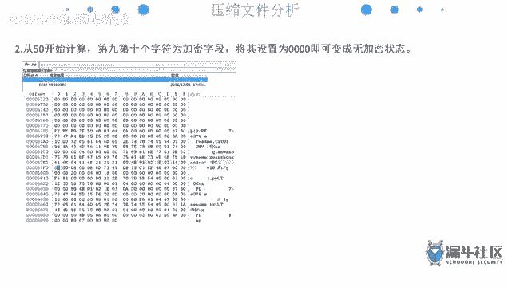

Yeah。刚刚说错了，这边是。这个算是一个字节，一个字节是算两位的。所以是呃504B0102。应该是最算一位两位，然后这边到4，哎，我算一下啊，12345678910哦，应该这两位。就是这两位啊。

要要注意是是呃。我们先收到5。4B0102嘛。对吧然后从这一位开始，这个是一，这个是2，然后一直数数数数数，这个是九和十嘛，这个是第九位，这是第十位。然后比如说这边有1个01嘛，正常情况下。

如果它是尾加密的话，这四位应该是0000码。所以你要把这个一改成这个0嘛，这能懂吗？就把这一位改成0，那这时候它就不是一个加密的一个标志哦。那前面这个是属于这个ZIRP的ZIRP的那IR的同样的。

因为它两种两种文件，它可能那个加密位段可能不是很很像，可能不是很像IR的话是这样子的，IR是说。

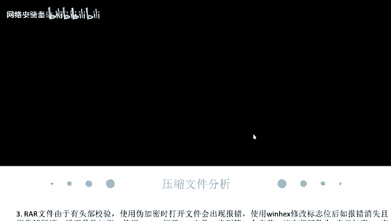

我们打开，然后从头开始数，一般就是7往下数两格嘛，为什么是七往下数两格呢？因为七往下数两格就是第24个字节。第24个字检，就是因为它这一行一行是16个字检嘛，这一行前面第一行16。

所以是17181922122324。那把这个位置。的尾数改成0啊尾数改成0，就是没有加密的嘛。所以这种方式叫做尾加密为加密。这就是要去修改这一个压缩包的一个内容。但这是这是一种吗？一种。

那韦加密的话会比较这个呃简单啊。就是如果它考伪加密，那其实你一打开，然后查看查看一下这个位置，你发现是不是有加密的那另外一种情况下，就是它真的是加密过后的。就真的是加密的但真的加密的话。

这个密码不会设置的非常复杂，就是它就是要考察你没有，它实际上就是要考察里没有包括工具，但是它不会那么简单的就告诉你说，就让你去盲目的去跑，他可能会告诉你说，比如说我前五位。前五位它有一个提示。

比如方密码是10位，但其实你只要跑后5位就行了，他会把前五位按另外一种形式，按另外一种提示告诉你，那你可能只要跑5位就行了。因为你跑10位是不可能的。在一个比赛的情况下，你可能跑一天都没跑出来。

那所以说他可能有前五位，它是会提示你说前五位是长什么样子。然后你只要跑后五位就行了，就是这样子，就真正如果是。呃，真的是要去做一个暴易破解的话。那么他一般情况下，他可能会告诉你。

比如8位纯数字或者是这个前5位是多少，然后他会这个提示要要么会直接给你，要么会以另外一种形式可能用来可能他还有图片。然后图片你做一般操作之后，得到一个提示，告诉你密码是前5位是多少这样子。

或者或者直接告诉你密码是多少，然后让你去解密，解密得到另外一个文件，然后你再去做另外一个，就根据另外一个文件去做另外一个文件的一个引写，是这样子的。就他压压缩包一般不会说。

我就是考我一道题就只考压缩包这一个点，就是压缩包很多情况下，它就是一个载体，就是我去出一道题的一个载体而已。就是我想出一道题，那我不想那么那你那么轻松，我就做个维加密吧，难道你为加密之后，你再去解压。

得到我要给你的题目，或者是我出个小小小的加密之类的。就是说压缩文件，它不会说我就是考压缩文件。那有一种情况下会就是考压缩文件，那是考到什么呢？就是考到这个压缩文件的一个修复。那这个时候就比较难了。

这时候我们要去知道刚刚打开的这这这一张图里面的每一个字段，每哪一个段它代表的是什么意思？正确的值是什么？错误的值是什么？那这个就会比较难一点。那通常情况下，如果只是考或易破解，那么我们需要有相应的工具。

那这边的话有几个工具吧。就是这个你们去工具包里面有可以找到这个叫做ARCHPR这个工具。那这个工具的话。就是你其实就是用这东具把你的这个压缩包把它打开，然后去选择你可以去导一个字典进去。

你也可以在这里面让它去选择。比如说我要去暴力枚取所有的代写字母，代写字母，所有的数字，然后符号空格，那你也可以去。你也可以去自己去定义去定义它。比如说我要格，比如说我我可能是跑所有的偶数。

那我就闹一位跳一位我去跑也可以。就是它他这边的话功能还是比较强大的。那。我把这个这个工具打开吧。没有。P。那这个工具的话。正常情况下，我们是打开我们一个，就是其他挺好用的，就是挺简单的，不会很单。

就是你把一个压缩包打进去，打完之后。有时候他就直接开始跑了，因为你可能设在一开始默认设置是你导进去的话，就开始跑，有时候不会开始跑点这个开始是不开始去跑这个字典。那如果真的是暴力枚曲的话。

应该要选择一个暴力枚曲。因是这边是暴力破解。然后呃除此之外呢，其还有其他的一些选项，其他一些选项的话，经常会考察的是这个铭文铭文的一个攻击类型，叫做铭文攻击。那什么意思呢？就是说。他可能。

密码是很复杂的。但是呢他告诉了你这个压缩包里面的一部分铭文内容。比如说他这个压缩包里面有两个文件，一个是一张图片，一个是1个TST记事本。他把这个记事本告诉你了。

那也就是说你已经知道这个压缩包的一部分铭文的那么你可以选择这个铭文攻击，就选择铭文攻击。那这时候你可以把这个铭文在加载进去，那其实上他还是要跑挺久的，就是我做过类似的题。如果是这种立码很复杂的哦。

密码很复杂，一般我们自己的电脑可能要跑个然后跑挺久的，我做过一道题跑了这个6个小时，我想你的做一道题跑6个小时，这题比赛都已经结束了。所以说一般情况下这种题目可能是属于那种在线让你去练习的题目。

就是我我这种题不是属于比赛题目，我属于这个在线让你去练习的题目，那我可能是设一个比较复杂的，因为我也无所谓。嗯，如果真正比赛的话，跑到暴力破解，那肯定是立马有提示或者是呃位数比较短的一个。

那这时候就是比如说我们选择长度，比如说他告诉你是多少位，然后。如果他告诉你是8位的话，你就不要从这个一位开始跑了，1到6位你就你就这个字点就可以不用跑了，你就直接从8位开始跑嘛。

所以这个长度是加重上你的一个效率。包括你们选个字点。选个字典，然后铭文如果说有个铭文的意思就是说你知道这个压缩包的一部分铭文了那你可以再把这个铭文给它添加进来。

那其他的项就是呃其他项我们可以就可以不用管。然后我们就可以点击这个开始，然后去让它去跑这个压缩包的一个密码。这个是啊这个是属于IR的一个暴力面具，IR的。那CIP的话客可能用到另外一个软件。啊。

先在看一下这个。这里还提到一个这个小技巧。小技巧什么意思呢？就是题目会告诉你说呃，我密码的前三位，我密码前三位是这个ABC。那要么你你这样子做，你做一个字，你自己要做一个字典，前三位，它统一都是ABC。

那这样子你也可以，就是那你你去考这个字典。如果你不去单独去做这个字典的时候，你要怎么做呢？你就是要选择攻击类型是叫做掩码。那这时候你你比如说你之前三位是ABC的，然后你要跑，比如说它有6位。

你要跑后三位，那你就把后三位写成这个问号的一个形式。那么这个时候他就去就是在这边我们攻击类型，就选择这个掩码，这都是一个小技巧，算一个小技巧。然后我们去跑这个后三位，然后这时候因为三位数字组成了。

顶多就999个嘛，所以他速度很快，马上就跑出来了。那看这个要看具体的一个题目的一个情况了。好啊，如果是跑出来的话，他会告诉你呃，你正正确的一个口令嘛。口令就是我们常说的这个密码。那标准的说法叫做口令嘛。

就比如说你登QQ，那你实际上标准的说法是你那个叫做口令。就是口令才是登录的一个凭证嘛，那这个也算叫叫做口令了。那我们晚上讲到密码学，密码学和你们认为的这个密码，它可能差的有点不太一样。

那铭文攻击的话就是我们已知文件的一部分内容，一部分内容。刚刚有说到过，比如说他给你一个压缩包，然后是加密的，然后他又给你一个铭文，就是说我这个铭文是属于压缩包的一部分。那么你可以选择铭文攻击的一个形式。

这个会比较简单，这个你要大概知道它是大概是哪种哪种类型，哪种类型。那还有一种是你跑跑完之后没有找到口令嘛。没有找到口令，然后他告诉你呢，你跑到了一个家运营啊，这有可能也是flag。这个这这个情况是有的。

就是你可能没办法把这个这个压缩包解密了，但是它既能能够找到一个东西叫做加密密钥。那有时候这个加密密钥就是fly，就这一串子，就不一定是口令，就是叫做加密密钥，这也是不一定的，就是有有时候会出现这种情况。

那这里面有一个注意的一个小点呢，就是。呃，就是铭文铭文攻击的一个注意的一个小点。就是。你去找一个铭文的时候，这个铭文也要也就是比如说我刚刚说的。啊。我们有一个压缩帽，比如说一点I呀。

这个IR里面有两个文件，比如说一个是1点TST。然后一个是1点PNG嘛。然后这个1点TSP是告诉你的，你要去导到那个铭文里面去嘛，然后那个去跑这种叫做铭文攻击嘛。这样子的话它跑了一个效率是更高的。

但是你这个1点PSP不是直接导进去的，你还要去做一次压缩。你要是注意是压缩，那这时候压缩的时候，你要去选择和原来这个1。I2的压缩算法是一样的。能明白吗？就这边有一个。操作就是你知道这个铭文。

然后你要打进去的时候，你同样要去对它做一个压缩。那压缩的时候，这个压缩包是什么压缩算法，你就要这你这一遍PSST同样也要什么样的一个算法。那怎么去看这个算法呢？正常情况下默认的，我们平时去压一个软件。

一个文件的时候，其实我们都不会去考虑它是什么样一个算法。那通常它可能就是这个叫store store默认情况下，它可能就是叫sstore。我看到大部分的这个软件。

因为你们要去选择特定的去选择它采用哪种压缩压缩算法的时候，它默认的就是采用默认的一个压缩算法。那如果说你发现你这种方式失败的，就有可能是这个压缩算法，可能和它和原来的这个压缩文件是不一样的。

所以这个时候。呃，我不知道你们电脑安了多少个压缩软件啊，正常情况下可能是IRwinnaIR嘛，然后360的压缩，然后2345，然后还有什么压缩软件，差不多这几种。然后讲一个。

比如说这个你用2345去压缩的时候，它因为平常我们可能都没有去关注到这个东西。但是它有这么一个功能，就是当你去压缩的时候，比如你那你能去做压缩，那他有一个地方，让你去选择压缩的一个算法。

那这个时候我们呃和前面的那一个以他给你的那个压缩方，选择一个相同的一个压压缩算法就行了。比如说这个是dflat或是什么。这个BZIP2这个就是它有孔算法是不一样的。那t是属于这种默认的一个算法。

默认算法。所以如果它是ststore，你就不用去改。这sstore是默认的一个算法。那这里面我再补充一个比较难的一个知识点，就是说。IR的一个文件格式。那这个时候这一块就比较难了，就是说。嗯。

很多时候很多时候你比如你打开一个压缩文件，但是它没有加密，它是没有加密的。但是你只看到一个文一个文件，就是你只看到一个文件。那这个时候很有可能是因为这个压缩包已经故意被它弄损坏掉了。就是这个压缩包。

你需要去对这个压缩包做一个修复。那如果你没有修复的话，可能另外的文件是出不来的。比如说像我们这个像我们这个正常情况下，你打开它，你只看到一个文件，然后它告诉你这里是没有flag的。

就是你打开这个TST你剪完之后，你只得到1个TST。然后他告诉你这个TST是没有flag。那如果你只细用职业禁制去编辑去去看的话，你会发现它除了这个TST文件以外，它可能还有比如说PN距。

那这个时候就是因为这个压缩包软件面损坏了，你要去对它做一个修复。那我们要去修复一个。如果你真的是要去修复一个文件的时候，你肯定要对这个文件的一个结构是很清楚的。那这边话是给大家做一个。

大家给大家介绍一下啊，就是说。一个压缩包的一个格式。这里面的话它分了好多个块，比如说就从头从每一个头部嘛，到这个尾部，它其实有这一个这么几个字段。比如说HheadCRRC，叫做头部的一个CRRC值。

然后head type叫做头部类型也叫做块类型，然后head flag叫做头部标志，也叫做快标志。然还有size就是这个大小头部大小或者是快大小。然后ADDsize是说我是不是有可选可增加了一个大小。

那你为什么要知道这一个呢？其实你可你可能大概知道有这么一些内容，然后最关键的是下面这一个就是。因为一个压缩包它是有很多文件的嘛，它正常情况不可能只有一个压缩包里面可能传了好多个图片啊，有个TSP。

那如果是文件的话，它的头类型是什么呢？啊头类型是我这边标好的叫做0叉74，就是它代表这个是一个文件头。那我也是说我读到这个地方的时候，我发现也就是我程序是解压嘛，我从这往下读嘛。

我我读说这个这里面有个0叉74OK这里有个文件，我把它解压出来，再往下读读到0叉74，我认为它有一个文件，我就把它解压出来了。那也就是说如果说我一直在我程序电脑在读这个压缩包的时候，我没有读到0叉74。

我没有读到0叉74这个文件头，我就不认为你有一个文件，那我就不会去做一个解压。也就是说你看到就只有一个文件。所以像如果是这种情况下的话，它。没有把文件显示出来的一个情况，就是说它读不到这个文件头。

那也就是说我们要把这一个它的头类型。把它改成0叉74，让他我们是人为的去告诉他，这里面有一个文件，那你要读到这里的时候，你要把它解压出来。那类似类似这种题目的话，就是说。比如说我们前面是一个flag。

那可能这边还资还是有点小，我虽然已经放大了。比读到这个尾部，那从这里面这个地方是开头的嘛。那这里面的第三个字节，它应该是一个快列型嘛。那像我这边这个地方写的是0叉呃，0叉7A嘛。那零叉7A在正常情况下。

它肯定是没有这么一个字段，是0叉7A的。因为72是标计块，73是压缩74是文件头，75是注视头0叉7A根本就没有这个字段，所以它这边肯定是错误的。所以我们要把0叉7A改成0叉74。

那这个时候它就可以把这个。标里的这个文件把它解压出来。对用的这个文件你把它夹出来。Yeah。呃，我找一下这个压缩包网。这个能看不到。这个我已经改过了，我先把它改回去。比如说嗯。最后位次。抱歉。

我这里没有一个压缩包，那现在我是因为我刚刚做我我刚刚又做一个修改嘛。你们看到了这个压缩包，里面现在只有一个文件嘛，对吧？那你解压完之后，它也就只有一个文件。但是我刚刚把它偷偷改了一下。

其实呃它就是因为这个。这个文件的头类型没有被读出来，我们再用这个十用进制编辑器去查看一下它。这个地方的话这个是1个IR的一个压缩包嘛。那如果你去看下这它最右边的一个ask字符的话。

其实你可以看到它里面是有两个文件的。比如说这里面有点明显的是它有1个TST，就是我们一开始在外面我们就会以看到这个TST。那这个PSP解压完之后，实际上是告诉你他说flag不在这里的。

所以它肯定不是flag值。那flag值是藏在哪里呢？它这边还堆了一个偏距的一个文件。那就是让这道题你把这个片距得到之后，你还要去做图片引写的那你至少要去把这个图片把它提取出来。那为什么我们解压的时候。

我们把这个文件解压出来呢，是因为它的格式出错了。那我们我刚刚说了这个第三个字节是这个文件类型，就是一个跨的头头部网网或数。第三个字节是文件类型。那我怎么知道头部是哪个位置呢？

我们看一下这个PST是到这个位置结束的。你们怎么知道我怎么知道这个天要这个结结束呢？我们来解压一下这个TST啊。因为这个TSD你解压完之后，它是不是到这里结束了，它最要是三个感叹号嘛。

它是在这个三个感叹号这里面，然后结束了。所以说我们怎么知道那下一个文件开始是不是下一个文件的开始，是不是从这里开始的？从这个文件结束，下一个文件开始吗？

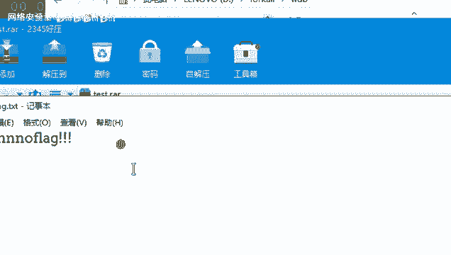

G。嗯。应该是从这个位置嘛，这里面是这里面是三个感叹号嘛，对吧？三个感叹号，从这里开始数三位，那我这边标志一下，从这里开始数三位、第一位、第二位、第三位嘛。那这一位它是0叉7肯定不对的嘛。

所以我们要把它改成0叉74。那这个时候林扎心思告诉告诉这个软件，告诉这个电脑说我读到这里的时候，我还是一个文件，所以我要把它解压出来。然我们去做一个保存。嗯。我我需要我要先把这个软件关掉，然后才上去。

因为我现在去对它做一个写操作，我要先把它关掉，然后才允许我去保存。

备。那我们再来看一下。这个时候我们就看到了。正面多了一个文件嘛多了一个文件嘛。然后我们可以把这个文件解压出来。

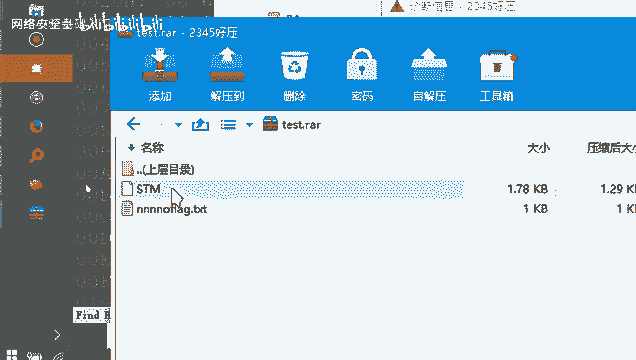

呃，虽然我已经解压过了，我先把我我原本这解压出来这个删掉。然后把它。

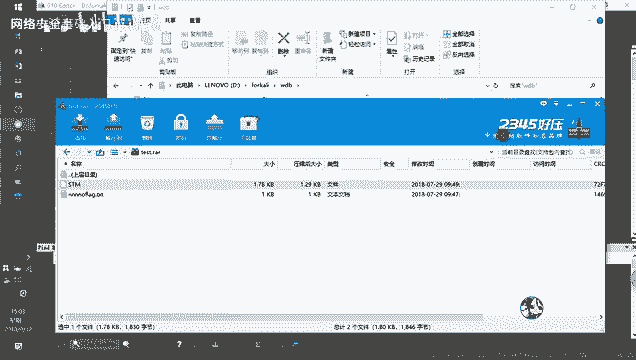

直接把它贴出来吧。贴出来之的时候，这个文件我们知道它是个PNG嘛，因为在压缩包里面，它告诉我们是个PNG嘛，所以我们把它保存。影偏剧。

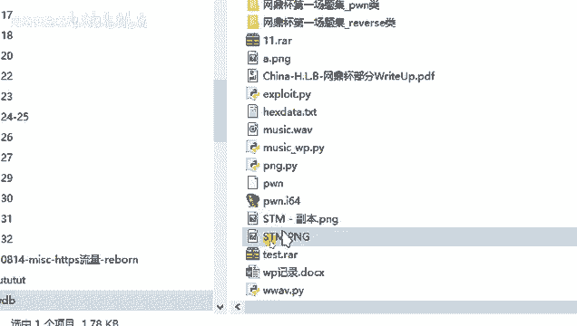

然后再把这个文件打开。它其实上是半张二维码，半张二维码，那为什么是半张二维码呢？因为高度有问题啊，所以这时候要去修改它的修复它的高度了。这所这是一个连续的一个考点啊，连续考点。

但高度这边我就不解不演示了。

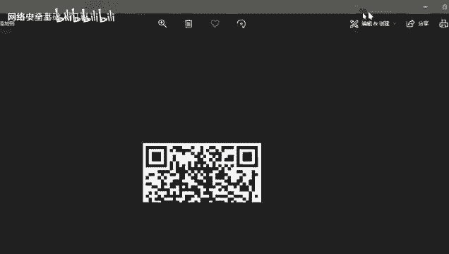

Yeah。那压缩包差不多讲到这里，还有一个还有一个是ZIRP的ZIRP的话也比较简单。其实它的操作方式是和这个IR是一样的。你们在GTF工具包里面的打向。第二个部分是这个压缩包破解工具嘛。

这里面给了两个，第一个是我们刚刚看到这个IR这个要去安装一下。然后第二个就是这个ZIRP的。

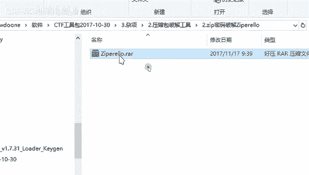

ZIRP的ZIRP的一个暴易破解的一个软件，打开是呃一个蓝色的这么一个软件。然后这里面的话，你就是把你的这个压缩包ZIRP导进去。然后导入一个字典，然后或者是让它自己跑。

因为这种软件它都自带自己带了一个字典，所以你可以直接让它去跑，点击下一步，然后就就可以去跑了。可以暴易暴易如果是暴易破解，暴易破解的话，方式其实很简单啊。那要是把我这里差不多讲到讲这三个点嘛。

因为因为其实如果他又考到一个东西叫ZRP，那其实你要去知道ZRP又是什么样一个格式。那经常会考IR，还没有遇到考ZRP的一个题目。那我们下午的重点是这一个流量取证技术啊，流量取证技术。

这个是这个是参考的一个点，就是。导样题里面他特别特别喜欢考的一个一个题型，就是流量题。

那不知道大家有没有有没有学网络的。有没有学这个网络安全网络的网工的？播单有没有去对各种这个网络协议有一个了解，或者是有没有自己抓过这个流量包啊。什么是流量包呢？就是说我们去比如说我们去上网。

我们去聊天QQ啊、百度啊，就是浏览器啊，或者是你去访问一个网站，他可能要去做这个你输的是一个域名，他可能去做域名解析，解析成你的IP地址，然后再给你去上网。那这里面的话，你所有的一个操作。

是让它都是需要通过网络去走的。就数据都是通过网络去传递的嘛。

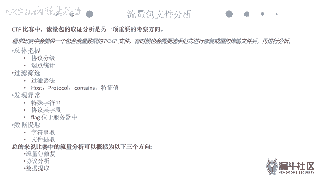

那流量包就是说我向你传递的时候，我把你这个传递过程中的数据，我把它抓取下来，保存成一个文件。那这个时候这就是一个流量包。你实比如说我给你传一个文件。那我肯定是要走走网。如果说我是走网络的话。

那我必然是通过流量包形式不断的发到你那边的那么这个时候我可以在我们之间中间搭一个这个。嗯，豹纹的一个截取的一个设备或者是软件。那我把这个豹纹给它截取下来。那截解下来之后，像这里面它你看到的是一个流量包。

那里面可能隐藏了很多的信息。比如说你的所有聊天记录，你的所有的文件，所有的图片，所有的音频视频，它都可以在流量包里面去体现出来。那所谓的流量取证技术就是说呃题目它会给你一个流量包。

那你要在这个流量包里面找到相应的一些文件。有时候是这样子，就是可能flag值就是藏在。流量包里面的某一个位位置。那这种题目属于比较简单的。

就是你只要对这个流量包做一个分析就行了那另外一种考点就是我流量包也只是一个载体而已。就是我考察了，可能我考察你这个压缩包考察你图片引起。但是我把这个压缩把这个图片，我把它藏到流量包里面去了。

所以你们要做的第一步是。我要先把我的图片或者是压缩包把从流量包里面提取出来，这是一种。另外一种是我可能考的是比如说我考的是未部安全的，我发生了一次网络攻击。

那比如说我我从这里面得到从你这里面得到了一些敏感信心。那我可能要分析你这些攻击的流量的一个特征。比如我通过你流量包的一个分析，我发现你对我的网站做了一次渗透。

那可能拿拿到了管理员的账号密码之类的那这时候可能管理员的账号密码，就是flag，那我要通过我的你可能还要另外具备另外的一些知识。比如说你可来需要具备这个网络网络未部安全这一块攻击的一个支持。

你才能够去比较有把握的去对这个流量包去做一个。分析。

那用包里面的话。我们看一下啊。大家有人给我抓过这个包啊？没有是吗？所以我感觉我讲这一问了，你们可能是懵逼了，就是说他可他就会给你一个包嘛。那我们接触一个软件啊，叫做叫做Y shop。😊。

不知道大家有没有安过这个软件啊？就是叫做YR项。就是我不知道你们你们可以先你们可以先试一下你们自己电脑到底有没有这个软件。因为有时候你安一些虚拟机呀，或者是安一些软件的时候，它会自己帮你安上这个Y刷的。

你们可以。打开你们的电脑，然后比如说你输输入windows加ar这个键嘛。拿运行运行的时候，你们输入这个蛙算了。WIRESHARKARK。

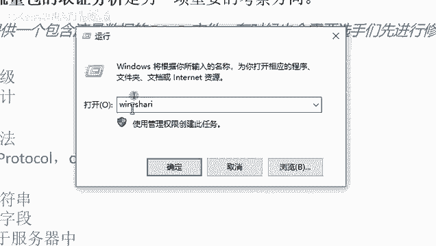

然后你们点这个确定，看看这个软件会不会弹出来。如果弹出来了，说明说你们电脑是有这个软件的。如果没有呢，没有你去工工具包里面去安装一下这个软件。那它是有这个英文版和中文版的。

所以不好说你到底是英文版还是中文版。那Ktylin也有这个软件啊，wifi kin也有，不过Kin那个就是英文版的。明白吗？那这个这个挖效果是你去做流量分析题是必不可少的一个软件。

就是你肯定是没办法脱离这个软件的，就是它肯定是你要对这个软件有一定的一个熟悉度。

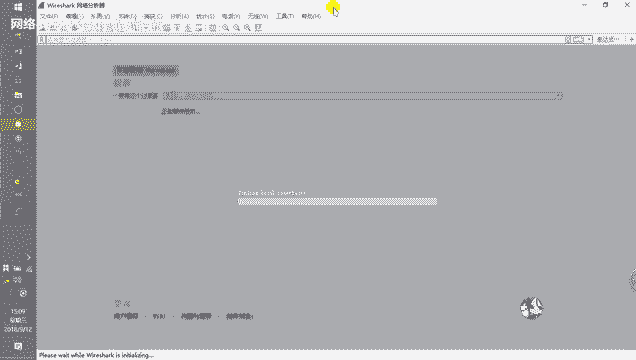

你将去做相应的一个题目。那我们现在看一下这个大概的一个描述吧，就是。银行这边分了好几个点。比如说我们从中继的一个把握来看，就是他可能你要大概知道有哪些这个协议，有哪些协议。

比如说我因为它这个流量包里面有各种各样的包数据包的那这种数据包跑的格格式呃协议是不一样的它可能有这个HTEP的，有这个Pnet有这个DNS的，有TCP的，或者是其他的一些协议。那这个时候。

你要大概知道它这个流量包都有哪些协议。这样情况下它可能有T7P的是UDP。那这时候你再去进一步去看一下是不是有这个呃比较明显的。比如说有HTPP的，如果有HTPP的话。

那很有可能就是它这个flag就是藏在这个HTP协议包里面。那另外一个是端列统计，这个这个可以不用太多去了解。大概知道一个流量是从哪里发，是从哪个IP地址报给哪1个IP地址的，大概知道这个样子。

那这个是总体的一个，你大概有这么一个认知。再往下就是你要对，因为你很你打开一个流量包里面是有很多的这个豹纹的。所以你要去把你的想要的报纹把它过滤出来，把它拿出来。所以我们要知道一些过滤的语法。

那这面我等下会列出来各种各样的这种过滤语法，有有比较常用的，也有一个你可能不是很常用，但是你要知道这么有这么一个技巧的一个过滤语法。那这里面的话，这个都是你你其实你要去你要去做完这个题目。

你可能才比较感同身受。那我这里面我这边这里面流量分析题，我可能有13道题，十三道题，然后每一道题可能这个嘉兴可能做过，你们包你们应该都没有做过。就是十三道题，每一道题都是一个考点类型。

然后我我会包给大家，大家可以回去练习。那这里面这1三道题的话，等下发给大家，就是他我把每个题的答案都已经写好了。所以你可以去，如果你做不出来，你可以参照这个答案去做。

那1三道题差不多包含了各种各样的一个流量的一个考点。那卡点最重要的最重要的就是我们要去做一个数据提取嘛，那可能是自助算提取，反能是文件提取就是两种。那第一个是我们要有这个Y下这个工具。

就是挖下了这个工具是必不少必不可少的。那么它大概长这个样子就长这个样子。那呃我直接去打开一个流量包吧。行行不行？Yeah。就是我刚刚说的这个12个112种考点题型嘛，其实有13种。那我这边只给了12种。

就是其实也不是12种。其实是我做过12道题嘛，我里面可能有这每一种里面可能好几道，那就是不同的题型嘛。那你做多的这种题目，它就是。就是你会你其实这种题目要做做很多题，做很多题之后，你有总结了。

你就感觉知道怎么做。一开始大家都是不知道怎么做的。那这里面这每道题呃，比如说我们答案一个点进去，然后里是有一个有一个叫做ro up。这个ro up就是一个答案。就是会告诉你啊，要怎么去做。

比如说搜索HTPP然后看到了什么文件，那这样子把这个文件怎样子导出来，所以这里面都是有答案的。那没答案的是实际上有两个没答案了，是最前面那两个是特别简单的。就是大家只要看一看。

就没答案的是没答案是属于你去看一看这个报文就行。他不需要你去做的，就是我所以我没有没有给答案，可能前两个是没答案的，然后后面几个全部都是有答案的，后面几个都是有答案的。

差不多有我我这个这十二道题是按照难度的一个排序哦。就是前面可能说越来越前面比较简单，后面可能越来越难，就是越来越难。就是可能比如说。嗯，最最难的应该是这道题的，叫做会飞的会飞的一个苍蝇。

这道题你们做完之后会得到1个E程序。然后你点开整个屏幕会跑出很多苍蝇出来，就跑满了你整个屏幕。所以这道题叫做会飞的苍蝇。那这道题会有感觉做完之后就感觉很恶心嘛，好多苍蝇会出来。

然后再往下是比如说流量分USB的流量分析。什么意思呢？就是我们去考数据嘛，拷文件的时候，你可能它的是USB嘛。那USB其实它这个流量也是可以被抓取下来的。那经常考的是两个，一个是键盘的一个流量。

就是我们这个比如你买了个机械硬键盘，然，放在电脑上，它你在敲的时候，像它走的是键盘流量，还有一个是鼠标流量，鼠标你点击呀或者是移动的补G，它其实也是一个数据的一个流量。这个我放在。这一个前面的最后面啊。

那第12个是属于这个流量分析，谁知道这个流量分析并不难，只有把后面我是最后面排的，所以把它放到12上面来。那不知道大家有没有去。但像我们这次课，这次集训之前有没有用过K06。

有没有知道这个不有没有听说过我们去这个破解别人破解隔壁宿舍同学的隔壁宿舍的wifi，或者是破解邻居的一个wifi。然后你可以去因为破解怎么去破解的呢？其实就是比如说我们去连一个。连1个wifi嘛。

那其实它是有一个握手包的，什么意思呢？比如说我们手机或是我们电脑，我们去连这个wifi，那它是会去和这个无线路由器去发一个请求的。单号请求就够了嘛，肯定是带上你的密码。

然后去发带上这个wi号密码去做一个请求嘛。那如果说你带上这个密码去发这个请求，并且认证成功了这个数据包，我们把它称之为叫做握手包。那正常情况下，我们去破解wifi密码的时候。

我们就是把别人这个握手包把它截下来。然后我们接下来放到自己的本地上，我们去跑他这个握手包。因为里面是有密码的，那我们就去跑，我们把我们字典加进来，然后去跑它这个握手包，然后跑出它正确的一个密码出来。

就是这这里面是第12号也是这样的，就是去跑这个别人的wifi密码。那我们我先打开一个这个影量包。这个电脑打开会点慢一点。这个这个工具也可以直接去抓取当前网卡的一个数据包。嗯。嗯，这个答有点慢。

先大家介绍一下这个软件。你们看一下我现在这个电脑。这个地方在动这个地方在动。那实际上这个地方在动是因为它有流量在去有流量在上传，或者是在下载。那是哪张流量卡？嗯，在最左边这一栏是你的你电脑的一些网卡嘛。

比如说以太网以太网商，那你可以看到是以太网三应该是当前跑的流量最多的嘛，一直在跑嘛。那其他的还比如说这个one可能也是这个无线的。那你你我们可以其实我们可以其实点进来点进来去抓这个无线的一个包。

去查看它当前在跑什么样的一个包。那你去点的时候，你可这个东是可以实时去抓取的，实时去抓取的。抓取之之后，你可以把它保存的。保存完之后，比如说你看到这里面这一个。这个比如这个数据包。

那这个这个这个可能就就四五个。有的你拿到一个之后，里面有好多个的这个数据包。那这里面的数据包的话，就这里面每一个每一行这个每一行我可以点击的每一行，它其实都是一个小的一个数据包。那数据包是这样子的。

它肯定是也对的。什么意思呢？就是有来有回的一对的，那可也就是说它有一个发过去的，就有一个发回来了嘛，是一对的，有是数据是有来有回的。那这里面的话。日常的一个考点就是。比如说我这一个我这一个数据包里面。

那我们第一件事情要去看一下我这几个数据包都有哪些协议，协议叫什么呢？协议叫做这个propro叫协议。比如说我这边大致口以看到，我这这个流量包里面可能有两种，比如说有TGP。

然后还有这个SMTP那除了此之外，可能就没有了。那这个时候有TCP有SMTP那其实你已经要知道你你可能还要稍微了解一下什么是SSMTP。那你可能不是很了解的情况下，你也可以去做。

就是你稍微对这种协议有一点了解的话，其实对你做这个做这个协议分析，做这个数据包分析它是有帮助的。那如果他有很多的这种流量包呢，你要去做一个过滤。比如说我想过滤TCP的那我就在这里敲TCP。然后点回车。

当你发现SNTP它本身也是1个TCP8。比如说我只想SMTPSNTP。那这时候我因为它这边这一栏就是一个过滤器，就是最上面的绿色这一栏。如果你输错了，语法错误的话，它会显示，比如我乱输，它会显示红色。

他会告诉你这是错误。然后你输对的，话就是你就你语法没有问题的话，它是显示绿色的。那这时候它是可以去正确的去过滤的。如果过滤SMTP那它这边显示的协议就是全部都是SMTP的。

那我这个我打现在打开第一个这个驴竿包，它是很简单的，它就这么几几个豹纹，就十几个豹纹。那有的有的驴竿包是很大的。打开一个蛋。比如说明这个。这个然后刚刚打开一小伙嘛，他其际实上已经装了很多包了嘛。

但它可能会很多很多，所以我们要用过滤的语法去把一些重要的报纹把它过滤出来。第一件事情是，我们如果要去用wi去做流量分析题的话，那我们所要的。除了你对这个工具有一个大致的认识。

那接下来进一步你就需要知道我的wishop它都有哪些这个规律与法。在这里面的话。最简单啊最简单啊，但然我不知道大家这个因为我不知道大家有没有学过网络，就是了解过IP地址怎么样。

我们下感觉有点我现在说的每一个都有点大家听不懂都有这种感觉。就是我说ID地址，你们听得懂吗？😊，然后我说等下说协议的时候，你们听得懂吗？就是有有时候可能你们并没有去了解这一块的知识哦。

所以我说的东西你们可能懂，就是如果有学网络的话，可能比较清楚我在说什么。那如果没有接触到这一块知识，可能不是很清楚我在说什么。那你们先了解一下先了解一下，因为。你这种东西都慢慢慢慢去了解的。

那我现在说的是这个过滤命令啊，过滤命令。那我讲先讲一些不是呢不是很有用的，就是有的命令它是很有用的啊，有的命令它不是很有用。但是你要知道的，比如说过滤IPB什么意思呢？我刚刚说了数据包它是成对的嘛？

就是我可以发给你，你也可以发给我们。那一般情况下，它最简单的就是。它这个这个地方。有一个圆头一个木地。这个地方是一个圆，然后这个一方是一个目地嘛，就是这个数据包是从哪个位置发出来的。

然后目的地是哪个位置。那通常情况下，我说了，我比如说我这边圆是169。254。11。78。我发给这个224。0。0。22，那可肯定会回给我一个包。那这时候圆是224，然后目的肯定是这个169的。

就是它是有来有回的，通常是这样子。那一般情况下，如果说这边的IP地址，这边实上不一定是IP地址，不一定都是IP地址。基本上都是IP地址。那也就是说我们要去。

比如说我们要筛选我我们要知道我们要筛选的是谁发给谁的那这个时候你要去指定原IP或者是指定目的IP。比如说我就想只抓到这个169。254。121。78发出去的流量，那我就要去过滤。

说我这个原IP址是169的25411。78，这个IP地址发出来的。那这里面的话。If。你就你可以这么写，比如说IP点SRCSRC是source的前三个字母，前三个字母SORCE的前三个字母。

然后这个EQEQ你也可以写等于号，你就写符号的等于号就行，就是等于哈等于某个地址，我这边用差点差点表示，就是你可以等于某个地址。然后你可以组合过滤，你可以加上and或者R。就是你可以你可以把这个。

条件设置的很长。比如说我既要你原因是这个IP，并且目的是哪个IP，你可以加上你的一个组合条件。比如说end，比如你写个end或者写的R，然I这个IP的一个目的地。

这个DST就是diinion的前三个字母，就是目的。目的地又等于等于哪个地址？或是我IP地址等于哪个地址，就这种这种方式是我去报滤这个IP地址的时候，我去用的。那我说的它不一定都是IP地址。

有可能是其他的一些呃其他的一些物理地址。那它一般都会显示在这个sourcece或者是这个disistination这里面。那再往下就是规滤端口了。呃。我们思常，比如说。

比如说你你要去抓的是他去用浏览器去上网，他上上网了所有网页的一个地址。那网页的一个端口，通常情况下是80端口。比如说网页的一个端口是80端口。

比如说我就想让他所有的这个就用浏览器去上网的这种HTEB的一个包。那一般我可我去过虑它的1个80端口。那也就这时候如果说你们不是很了解网络的话，你可能还要去了解一下常见的一些端口是什么样子的。

比如说那个Knet121呃23，然后SH122等等的。就是你大概知道有一些协议和对应的一个端口。然后这个时候你才因为你知就知道这个端口，你才知道这个端口它代表的是哪种协议。

然后你才能把这种协议把它过滤出来。那它的一个过滤语法和我们过滤IP地址的一个方式是横像的。就是说。也是那这边的话。因为我说端口的话，这个时候。如果你们不知道这个网络的话，其实很难讲清楚的。

就是网络里面有一个叫做OSR7层模型。7层模型里面其中第四层叫做函输层。传输层有两个协议，一个叫TCP，一个叫UPP。那我们说的所有的端口，因为我现在有点慌我，所有的人到底听不懂听得懂听不懂。

是我们说的所有的端口就是说它基本上就是处于这一层的，就是要么是TCP的某个端口，要么是UDP的某个端口。那如果你实在不知道什么是端口的话，你就可以想象这个端口就是移栋大楼的一个门。

一个大楼的很多门或者是窗子。那这个比如大门你可以人可以进去，那一栋大楼可能不止一个门，有很多人可以进去的那就相当于说或者很多窗口。比如说小鸟可以飞进去这样子。那也就是说它可以让你进进出出嘛。

那也就是说我们一台计算机，一个设备，包括你们手机也好，它其实上本身会开放很多端口出来。这个端口什么意思呢？我说它是一个进出的一个地方嘛，也就是它是用来交互数据的一个接口嘛。

那我们我这边是以80这个端口为例啊，80这个端口为例，就是说。80指的是你这个HTPP的。通常你如果没有去修改默认它就是HTP的HTTP就是说它是我们去上网的一个上你打开你访问这个网页。

你访问一个D这个链接的时候，它用的就是80端口。那我们去瞎选的时候，多常的情况下，比如说我们。大部分的一个呃端口，大部分的端口就是它基本上都是TCP的UTP的会比较少。UTP的一个协议的流量会比较少。

那比如说我们要筛选的是1个TCP的一个端口。那就是TGP点po，然后等于你可你你也可以选符号两个等于也是一样的。然后JODP的端口。那这里面是目的端口或者是原端口。就是我的我我的原端口发到你的目拟端口。

还是就只是我自己的端口。然后你还可以筛选出一个范围。比如说我要筛选出这个端口这个1到80的，我把1到80这些端口的流量全部筛选出来，你可以用这个大于等于的方式，并且加上这个与符号，然后就是大于等于一。

小于等于80，我就把1到80的这个端口流量全部筛选出来。那这个是一个过于端口的一个命令。这好像是一个关滤协议。过去学议是只有我们经常去用的，经常比如过TGP过于UDPARPIGMPHTP。那我经常上来。

我就先过滤，我没有一下子看花有好多个协议，那我就一般会过滤几个东西。比如说HTPP我先要看一下它有没有HTTP因为有HTTP的话。很多时候因为他经常考察的，就是我把这个东西藏在HTP里面。

所以我先看一下他有没有HTP有的话先对HTP做一个分析，然后就看再看一下其他的。那么关于协议很简单，就是我直接输入对这个协议的名称就行了。那我把这个协议这个显呃把它显示出来。

那再往下是过滤markt地址，mark地址的话，这个就更这个复杂一点了。就是还是另外一个地址。除以屏幕有提示啊，不然你可以忽略这个东西。那再往下是呃整个包的一个长度。这个是有一点要的。

就是因为我们刚说的嘛，它它里面是有很多是拉的嘛。那一般如果长度很小的包，其实它可能并不可能隐藏很多的信息的那比较诡异的就比较奇怪，就是一个包长度特别大。那你可以通过这种搜索。

比如说你把这种包长度特别大的，因为长度特别大，所以说它可能正在传一些重要的文件。把这个长度特别大的数据帮把它过滤出来。那这时候你就需要用到这个高长度的一个过滤。那这里面是几种过滤法，也是大于等音啊。

就是比较简单。看下这一部分是最重要的最重要的最重要的这一部分。还是HTTP你没发现我讲了好几次的HTTP因为HTP它是最常考的，所以它也是属于这个最重要的一个条件。所以我列了一张，专门针对这个。

HDTV的一个过滤的一个方式。那拉下的还是非常多的这源过滤语法，就我们也学不完。你大概知道有多能些，那这里面是HTTP的那也就说这时候你要对HTP这个鞋有所了解。VGTP它可能有哪几种请求。

比如有get请求，posts请求。那这时候比如我们要去筛选某一种请求方式。比如说我要筛选HTP里面的get的请求的方法。然后就这里写上get，如果先选post进去，然后这里写上post。

如果比如说我发访问的是一个例子，比如说他访问的是一张图片。HTD它实际上我说了它就是一个你去访问用浏览器去访问一个地址，这种它走的就是HTV协议。

比如我这边比如我三选它访问百3600百度点com下了某一张图片，那我已经知道它的路径了，我可以把这个路径指定出来，但就是访问这个路径，我把这个路径的协议包把它过滤出来。

另外一种方式是我可以用content。那content这个语法像非常好用，就是contents啊，你还朋有加了好几个全部都是contents。什么意思呢？这个这里面的话，比如说我想过所有的get。

那我可能不知道我可能不会拼在它前面这个request点，就我不不知道怎么写的这么详细。那我只要用contains就行了。就是你是不是有包含这个字段。

那后面这个技巧引申下来之后就可以引申到比如说我HTTPcons flag，我看一下你这个包有没有flag这个字段，HTPcons key，看一下你这个包有没有 key这个字段，那这样回声一点。

你可以不局限于TCP这个协议，但所有协议对都可以这么做。比如说TCP你可以用TCPcons flag，那这个是非常好用的一个技巧，就是。我刚刚说了么，我通常倾向于我打开一个流量包之后。

我先筛选一下有没有HTTP。如果没有第二件事情，我就去我看一下它大致都有哪些这个协议。然后我看一下它有没有包含这些关键的字算。比如说它有没有包含这个flag，有没有包含这个key。

有没有包含这个给它提示，它可能提示一些一些内容。我看下有没有包含它提示的这些内容。有的话，那可能我就可以迅速的，我说这都不用知道太多的过律语法。那我可以可以迅速的定位到我想要的值的报文上面来。

所conttainentscon这个语法特别好用特别好用。因为它是一个属于这种搜类似于类似于搜索的这么一个功能。那这样我们这样去就是一个技巧，就是大家就剩有好几个技巧。比如说这个协议分析。学习分析。

那协议分析的话，这个场景主要应对就是说你打开一个包里面里面有几十种的几十种的一个协议，特别复杂，几千个的这个数据包，你根本就没办法。一下始清楚主要的数据包是哪些，次要的数据包是哪些。

因为你想你要去想出题的那一个角度，就是他去做这个流量包的时候，比如说他想去做一个。用HTTP传一张图片，然后他他去做这个他去出这的他去抓自己自己一个人去抓这个流量包的时候，他是怎么去做的？

他一般是这么做的，他可能已经把这个抓包软件全部调好了。然后他点开始招包，然后点发送图片，所以发送完之后，他点停止招包，然后把这个包包拽下来。什么意思呢？也就是说这个过程中他抓到这个包。

大部分的流量是什么？大部分的流量是传递这张图片的数据包啊，他一般不会给太多的，就大部分流量应该集中在。投片吧，其他的一些流量可能是因为它来不他来不及非常准确的把，所有包给它剔除掉。

所以可能是一些额外的一些数据包。啊，协议分析是什么意思呢？它实际上这边叫做统计，实际上你是点这个哇。的一个统计，然后点这个协议分级，然后他会把你当前这个数据包里面都有哪些流量，他给他做一个统计。

那呃我我有时候会讲英文版或者是中文版，有时候没讲。那你要大概知道，可能要如果你不幸拿到的是英语版的wa shop，你可能要看一下这个单词叫什么意思。因为我这个是中文版，你们卡里的话可能是这个英文版。呃。

你再打开一个包吧，这个这个不是很好。我打开一个比较复杂的。比如说知道。这个打开都有点慢了。Okay。这个打开太慢了。打下了。这个包就非常大。这个包里面藏了太多的信息了。

这个包其实上这道题实际上属于一道非常难的题目。就是以前我们我我经常会说这道题特别难，因为他考察的知识。算是比较属于那种比较变态变态级的。对，就是呢我跟你讲苍饮的那道铁，那这个道理里面豹纹是非常多的。

协艺协议也是用的非常多的。一共写已。那我们接下来看一下刚刚讲的第一个技巧叫做。协议协议分级，也就是协议分析。那它在哪里呢？在这个你在前面这一栏是工具栏嘛，工具栏工具栏有个统计。如果你们是英文版的话。

那个单词叫tical，应该是然后里面有一个协议分级嘛，有个协议分级。北京的。点进来之后。你可以看到。当前的话都有哪些这个数据包？那一开始你可可可以先把这些都关掉。就把它缩小一点。比如它有两种数据包。

一种是IPV4的，第二种是IPV6的那一般我们只看IPV4的，就是这个internet portalal位选4M是的，因为大部分流量目前的话，大多流量还都是是的，不可能让你去分析IRPV6的包。

再往下你把它缩小一点，先先不用急着看这么多。还有两种，一种是UDP的，一种是TCP的UDP就是你看它前面这个小字容嘛，U对口口，这种是UTP的协议。然后你再看一下下面这个是TCP的嘛。

就是什么传输控制协议，然后这个是用户数据报完协议。那你看一下它的一个百分比嘛。是不是UDP只有3。0%，然后这个PCP有96。4%。所以我们接下来要看谁的，你们看一下UDP的嘛，你看一下TCP的嘛。

因为它主要的包在这里面。那再往下你再看一下这里面有个什么呢？😊，这个当是现在显全称你你看不出很懂啊，它这个要什么高文本传输协应嘛？HTTP嘛，明明白吗？这个是HTTP嘛，HTP是占了81。8%的嘛。

所以接下来你可以发现这个数据包应该最主要的豹文是选了。你经过我这样一个分析，你会以发现最主要包含是TCP下的HTT流量嘛，对吧？因为它占了81。8%的一个比重嘛。那再往下。

你再看一下这些PCP它可能都有哪些东西呢？比到很大一个程度是它有media type，就是media type这个这个位置，它它的比重是最大的是59。9。那就这道题，如果你有去看答案的时候。

因为我这道题，我我当时我也是看答案做出来。最终也是它它身上是一个压缩包。当然说这个过程中还反出了非常多的图片，但这个图片都不是flag的点。

因为你要先去通过协议分析协议分析发现它主要的流量是在这个media tag。那它实际上是传了一个压缩包，这个压缩包里面有1个EE程序。那。因为当初传这个压缩包的时候，这压缩包太大了。这个压缩包太大了。

所以呢它不可能在一个流量包里面传，就是把这个压缩包传完。所以他把这个压缩包分片了，它分了好几个，差不多有十几个小块，然后分片的全部藏在哪里呢？全部藏在mediat这个这个这个地方里面。

也就是说你其实要把这个media pack里面的数据把它提取出来。那接下来干嘛呢？用文件合并的方式把它合并在一起，合并成1个IR合并的时候可能还有一些这个挫波折哦，那这个我先不讲。

因为这属于文件一些文件一些的。就是我们为什么要这么看呢？你大致会看到这个包它最主要的信息是谁？最主要的信息是这个HTB下的mediadia tag。那其他的呢你会以看到它可能还有JP据的。

还有普通全文本的，全文本可能占了38。8%，然后图片的图片格式的占了4。4%，它是有图片的，它可能有几张图片，但是还没有还是没有这个压缩包大。你再往下，可能还有一些STM等等其他的GRF啊。

就是它这比这种占的非常小，但是有这些文件在。那协议分级就是让我们去大致的对这个包有一个直观的一个认知。就是我其实让已经大致知道这个包里面最主要的包是HG包，里面有一个media type。对。

这就是叫做协议分级。Okay。那另外一个是这个叫做过滤器啊，应用到过滤器什么意思呢？这个是一个小技巧啊，就是你看到很多数据包，然后你想把数据包的某个特征把它直接就是你因为你过滤嘛。

我们前面讲到一种是过滤语法嘛。另外一种是你看到某一种特征。比如说这个包它下面是有1个HTTB的那你想把所有带有这种特征的数据包都全部把它过滤出来嘛。那你就可以比如说它比如说这个数据包。

它这里面它的一个它这个包它的一个特点是它这里面有个GTDP80这样的一个特征嘛，就差不多长这个样子的。因一想把屏幕长这个样子的包把它回出来，你就会右键。然后点击这个作为过滤器应用，然后去选中。

当然你也可以把不带这种特征的，就是做一个反向操作嘛，我不带这种特征的包全部选中，叫做非选中。那你就会制作你过滤出来的数据包就全部没有这种这种特征了，这是两种两种方式。都是这只是一个小技巧而已。

可能会用到。是。那这往下是这个叫做刘慧聚。流荟去是经常去用的那正通常情况下流荟去的话，我们一般是用流荟去去追踪TCP的一个流量，或是HTP的一个流量。什么意思呢？嗯，我们来看一下啊看一下。

还是知道苍蝇吧。比如说我们我先我先去筛选一下这个HTCP的流量。因为我们知道这个我们现在当的这个流量包，它大部分的流量是这个HTCP的。所以我们把这个HTB的一个流量把它过滤出来。

就是说你可以一个个去点它，比如说你一个一个个点开，点它的话，它在下面。接下面会把这个这个流量包。显示出来嘛，那你一个个点这上是比较麻烦的，就是比较久。你可以看到吗？有信息要，比如说fre点啊呀。

这里面是有个压压缩包的。那我们先不管了。就是你可以单独去看某个包嘛。你想看它这个这个包它后后续的一个流量走向，后续所有数据包的一个流量走向是先发哪来个包再发哪个包。

并并且我想清清楚楚的看它这个包里面的一个样子。所以我们可以采用这个留废据的一个方式，我们右键。如果你们是英文版的话。

右键它这边有一个follow follows train followsllow train就是追踪流的意思。然后我们可以选择，你可以居中TCP流，因为它这个HTTP就是1个TCP包。

所以你可以居中TCP流。那如果你想更准确一点，你可以追踪HTTP流。你最中点击完之后，你就可以看到它弹出另外一个窗口出来。啊，这里面就是这里面，因为我们追踪的是HTTB的流，这里面看到了包。

数据包就是HTTB的包。比如说这个是一个什么访问这个mail点QQ点com吧，然后它可能是这么一个请求路径，对吧？然后这里面是数据包，前面如果你对HTP这个包有所了解的话，前面这个是包头。

后面这个是什么？后面这个是这个请急方的一个正文。然后你这样子你就会看清楚的去看到这个包。很多情况下，flag值可能就藏在这里面。就是你可能去追踪一下，你flags值肯能定藏在这里面。就是如果是字串的话。

那这个时候如果你要想去看下一个，那这个地方就有一个什么查找下一个，你就去追踪。如果没有下一个，有下一个的话，就可以查找下一个，没有下一个就没有了，就可以这样子。

然后你也可以把这个上面这个地方把它保存下来，比如说保存成任何一种自助串的一个格式。任一种自助算的格式，比如说askco或是16进制，或者是原始数据都可以。哎呀。那点这个s，点这个s就可以保证了。嗯。

那这是一种居中流，居中流的话也是。如果它题目比较简单的话，可能在这个地方你就会看到一些值了。可能这里面有一些密码，就是有些他可能做了一些什么操作，啊后这里面有一些密码，然后接下你就把这个密码提取出来。

然后再样往下可能就是密码学的题目了，就是这样子。这个是刘慧聚。然后我们来看一下呃，这个HTTP的，因为我我主要他考的最多设计TTP的。所以给你们看一下，如果你是对HTP做一个流汇聚的话。

有三个有三个要点。第一个是可能你在优惠券里面，你就可以直接收到一些重要的信息的。比如说它可能就是有一串密文。译文，那可能会是直接就写一个fag在这里，这种叫做直接可以查看到关键内容。

另外一个是这个这个HTP包可能是一个上传的，或者是一个下载的。不管它是上传文件的包也好，还是下载文件的包，它是上传下载这里面，你可以看到对应的文件名，然后可能有些号息值啊。

或者是你可甚至可以知道这个包位置某可能你只如果他这个文件比较小，他没有去做分片的话，可能就直接藏在这个包了。那就是一个TSP那你就可以直接在这里面把它复制下来。如果比较大的话，你可能。他可能做分片。

做分片可能就藏在media type或者是data这个字段里面的。那还有经常考的一个点是这这里面是一个木马。就这个流量是一个木马的一个流量。那什么意思呢？就是已经被别。

比如说我它事实上是可能是一个服务器被人控制控制了。被人控制了之后，比如说我我可以连上这台服务器了那我可以上去执行一些系统命令了。比如说一台服务器被我控制了。那我可以上去执行相应的一个系统命令。

比如我去查看它的目录啊，然后下载文件啊等等的那这个时候你看到的一个特征就是。它是一个这个后门的或者叫做一句话木码的一个流量特征。啊，这里面通常如果是这种的话，通常是这个po请求。

然后里面你可能看到有这个eword这个字段。包括你会看到它用的是这个base64的一个编码。你会看到很多。很多这个字符串都是长得很像贝s64，但我我还没有讲到这个变成64编码。

晚上会讲到这个变成64编码。就你看到很多基础上，它实际上是很像这个bease64的。那这个时候他就很有可能是这个。呃，就是被人控制的那这里面控制完之后，这个攻击者肯定是想要去执行一些系统命令的。

比如我说查看目录啊啊，或者是编辑一些文件啊，那编辑的命令，你可以直接在这个数据包里面去看到。我们可以来看一道题目吧。比如说呃这个。

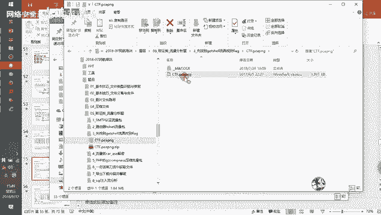

这道题它是有提示的，它提示什么呢？提示呃，它这道题是一个网站的一个题目，提示我们。

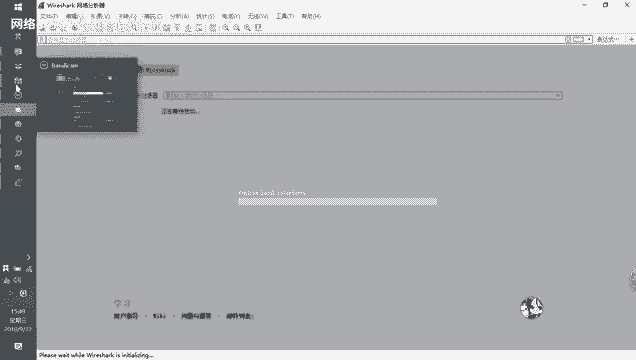

先找到get show再找到sag。怎么要get your share要呢？get your share就是这个网站被别人控制，被人控制了得到一个后门，一般是这个web shell或者是shall命令。

我们是需要需要就是。

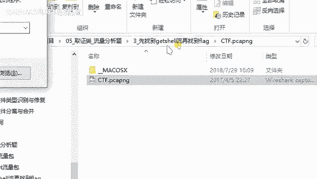

这个就是一个sure，能明白吗？这个就是一个sure。

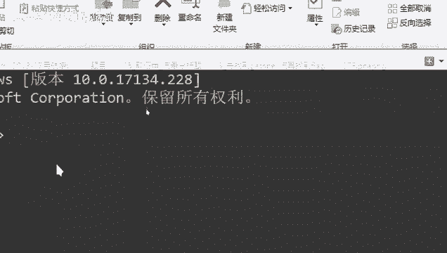

这就是一个sure，能明白吗？就是他能够我能够去执行系统命令的。比如说我们执行，比如说沃尔卖。我能执行系统命令的，我能去创建账号，我能够去对文件做创作的。说白了它就是一个命令行的一个操作方式。

叫做sha。需就是说这台服务器被人给人攻击了，然后攻击者已经在这个电脑留上一个op需了。那他对他对这个攻击对这个服务器做一个后续的一个操作。那这里面它是有个提示的，先找到geer需要留，再找到方案。

但是我用的方式不是常规操作。因为通常情况下。它这个第H需很有可能就是HTP的流量，所以我就直接去筛选它的HTP流量。没有，然后我发现没有。没有这时候我就要网上去退了。因为HTTP它是属于这个TCP的。

所以我再去筛选一下TCP的流量。因为HTP是没有的，所以我在对着TP做操作就没有意义的。我去看一下有没有TCP的。我有有很多TCP的。那这些P里面有很多这个奇怪的豹纹啊，我们不管。

我最常用的我讲一下最常用的就是可能效率是最快的，就是conttainentence嘛，我们去搜索快速的。那我前面我刚才讲有conts。这个flag对吧？那你可能就收到一个包，你这个包是不是呢？

这个包可能可能不是啊。那这个时候。你想它是ge的需要有嘛，ge需就是有一个需要命令嘛。那既然他得到一个需要命令，它肯定会去执行一些系统命令的。比如说执行一些这个LS啊，如果是linux的话。

它会执行一些linux的命令。如果是windows它执行一些windows命令，比如说DI啊等等。所以这里面我。我就下了一个一个自助串，叫是很man。然后得到了这几个帮忙，好像我筛选出来了。

那你也可以筛选其他的。比如说你筛试试一下筛选这个，比如说root。看有没有这个包筛选一下这个LS。有没有这个包有，但我一开始是筛选这一个，因为d可能不明显command。筛权完之后，然后我想去。

因为我得到这几个。CC7567CP的8马。那我刚刚介绍了一个操作，就是我们可以去居踪这个TC抛的一个流维码叫居中流维码。我居居踪这个狙击包的一个走向。我们和右键脑去之中它的流。1啤酒。

我们先把它放小一点吧。这里面你仔细看一下。什么你看到这个什么this problem，什么cannot run in什么do mode啊，然后再往下。它其实是有一些提示的。再缩小一点。这个没有下一个。

谢谢。这谁。我缩小一点，缩小一下范围这个。は。Yeah。嗯。这个可以。Yeah。我看一下答案，看一眼答案。好像有点不对劲。2。他这里面的话，这个不号刚刚装错了，是没有装错了，是我最踪的方式出错了。

因为我直接打开，点开第一个了。那第一个这个如果从这里去去究的话，是思路是错误的。因为。因为它下面有一个这个上区下面这个包还是对的。那我当时怎么知道这个下面这个包还是对的呢？因为你去查看这个包纹的时候。

它这里面是有信息的吗？因这里面可能会有一些你们大致能看得出来的信息。那这边有个包嘛，就你通过这条命令筛选出来乳歌包嘛，只有一个包。最后一个包的话，这里面是有比如说LS。L是一个猎目录的一个秘密嘛。

然后比如说这个符号嘛。就这个是一个吸盘下的一个formar，就这种这种这种特征的话就是很像很像我们说的这个一个surell。因为surell它经常就是有这么一个。有这么一个特征嘛。

所以我就可以去猜测出最后一个包，那可能就是我们要找的get share留了。然后应该是追踪这个流。其中这个留这个才是对的，为什么呢？因为你看一下这个流的话，你可以发现它这个就是一个。

就是1个CND的一个界面。对吧就是这个流量包里面就是1个CM的的界面，它可能执行S但之行出错了，说明说它是一个windows的一个界一个需ll。进行DIR是可以看到目录了。然后再往下，你看它滴压了一下。

你可以看到它这个流量包里面记录了当前的一个路径。比如说有一个什么。什么secret点TST有可能是关键信息要。然后他查看了一下这个s的点PST。cap是什么意思呢？太文是查看这个文件里面的内容吗？

得到这么一串值。然后他之后然后呢，他得到做完之作后，他干嘛st down尴尬，他就重启了，重重启了这个电脑了，他就把这个电脑重启了，也就这一汉子是这个sql点TST的。那晚上如果有上完这个密码学之后。

你可以知道这个它其实是一串B64编码。那我们要把至算备64编码把它复制出来。购置完之后，你用再64解码，比如说火锅浏燃器。它这边有个贝64解码的一个工具，比如说贝64抵扣。然后你终得到这个flag值。

这样子，这就是重造体。那这个话是属于这个流惠距的这一个点。Yeah。可一下，我们休息一个10分钟嘛，然后我们再继续吧，好吧。嗯。还是讲这个让飞机啊。嗯。嗯，接下来讲这个数据提取啊啊数据提取有好几种方式。

那比较常用的几种啊，第一种是这做导出对象。导出什么对象呢？一般是导出这个HTTP对象。那这里面的话也是针对于是它是HTP的一个协议。那你会发现。HD它就是一个请求嘛，然后把这个请求页面获取下来嘛。

那如果你是找出了GTT对项的时候，有时候你可以获取很多的。相应的一个信息。那这边举个例子吧。举个。你看下哪道哪道题比较。应该是这这。原是这个。我有我我有点忘了哪个例子，我先随便来看一下。你比如说这个。

又要打电好久，这是为什么呢？不知道最近我最近这个Y下脑出了什么问题。开个玩开个包看了好久。先把这些我是不是要先把这些包都开起来？导出下载内容并到货。没有什么。啊，出来了。这个也是筛选这个GTPP。

那以发现它有很多的这个HTB的数据包嘛。然后你进一步去查看它。进步查看的话，它这边有一个infer这个这个这个这个列啊这个列。你大致看一下他这边请求的一个路径。其实你发现它访问了一个上传的一个路径。

叫做阿ro。那你可以猜测它可能是上传了什么东西。就是他可能是上传了什么文件啊之类的那为什么能够去上传呢？这我们还不清楚。那他这边是全部TTP。如果说你是直接去过滤它的，看看我前面几张操作已经做完了。

发现没发现什么东西。那接下来我们可以去把这个HDV请求把它保存成保存到本地的一个文件下。那你可以点击，但你可以直接右键。然后遇见这个包，然后好像有个导出对象。啊，这边没有，那你就是点这个文件。

点这个文件，文件下有一个导出对象的功能。那其是其实它就是它其实这个导出对象功能是哇萨克它自带的一个文件分离的一个操作而已。我们它它显示说是导出对象，其实它就是一个文件分离的一个操作。

只不过它不支持特定特定的几种协议，不是所有协议都支持。比如说它只是这几种协议。那他支持HTV协议，我们就可以。把这个HTP的HTP的协议的这个流量打出来。点击导出。导出的话，你可以发有这么多的一个文件。

那现在它默认的文文件名可能都是这个，等一下你发现这些名都这些名字都重名了，你要保存在一个文件夹下，这些文件名都会重名，那不用管它，我们点击这个CF2。把这个选件全部保存下来。比如说我们新建一个文件。

让它让它这个存在这里面。哎，还新建不了吗？那就那就存在这里吧，先直接选选择。拿ing close。clos完之后，你再回到刚刚那个文件夹下，在这里面。啊多了很多这个文件呢。你这个文件会装什么？

因为刚刚是请求是请求1个HTTP的，可这里面的文件多是HTTP文件。然后你可以一个个去看，那我比较直观的，我想去看最大的就是它这个数据包里面最大的这个流量。如果你去一个个去看的话。我们点下第一个。

然后你可以发现这其实是一个菜刀流，就是这实际上是一个血耳流啊，血耳流也是一个血耳流。因为大家可能没有学过这个会不安全。我说这个菜刀的时候，应才不知道我要说什么。就它身上也是一个血流。

那我通常我们看下最大的是哪一个，最大的是这个138的这个。1382是最大的。然后把这这个12，我们把它打开。那时候你发现这个包哇，好多东西啊。好多东西，那如果你没有一点点的这个概念的时候。

其实你看不太懂这个是什么。就一开始我也不是很清楚，但后来我仔细一看，我发现了这里面有好长的这种字符嘛，特别奇怪。然后再仔细一看，这边有一个。89504E47，这是什么呢？这是一个哎R的一个压缩头，对吧？

89504147，所以它后面这里面其实是一串什么？它里面实际上是一串这个压缩，这里面是穿了一个压缩包。那我们再来看一下，这里面有一个什么e窝，对吧？有个衣窝，然后有这里面这在这里面这里这里是什么东西呢？

这里面是一个base就是4间嘛。所以这里面就是我前面讲的，它实际上是一个一句话木马，通过一句话木码去传了一个文件。所以你要怎么做？你要把这一串复制出来。很多啊。这么多。搞不玩，我不复制了。

复出来保存成一个文件。很多，然后我们把它用这个随别金制编辑器把它导入，保存成IR，然后再把它打开，然后你们你就会得到这个fag，能明白吗？这个操作前前面的课有讲到，所以这是不做这个这个文件还是有点大的。

其实也不是很大，只是你把它变成十六进制，它有几百K的一个文件，你把它变成16进制，就这么大，就反觉就特别大就是。那这个是这道这个方法。要导出2GTEP对象。嗯。那有时候你发现它并不是GTP的包。

或者是你导出了GTTP项之后，也没有找到你想要的东西。到时候你可能要稍微去手动一手动去抓取。比如说我刚刚讲到了这一个，我们来看一下，因为我一直讲这个苍蝇这道题。参得到其他也有也有TP有量。IT有量。

我刚分析了它。大部分的流量是集中在于media type。media time，所以说它应该不是HTV流量。所以如果你按着按照我刚刚讲的这个导出HTP对象的话，你可以得到非常多的文件。

但是这些文件都不是你想要的，我们可以来试一下。比如说我们还是来导出。TEP的，因为我们已经分析过了，它主要的包不在于TP，所以你导出是没用的那我们先给大家看一下，它这边还有这么多。这么多。全部保存一下。

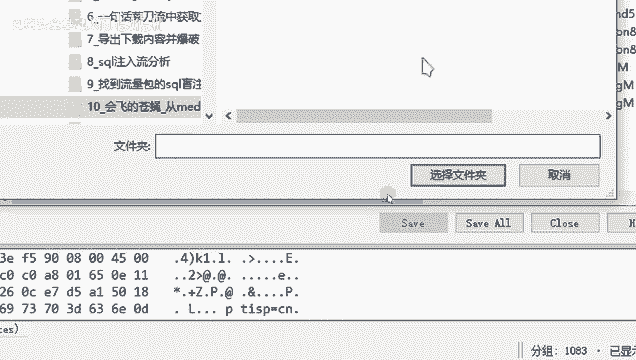

就好像这个文件夹。然后呢这个文件夹去看一下。你会到这里面有很多的文件，比如说有GIF。这是一个。这是1个GF很小的1个GF。所以它GF占了0。0。5%嘛，就是反正就是这个有GS文件，还有这个图片。

这是什么？哎等晚上啊。😊，这就是你们去访问一个网页，它就各种奇奇怪怪的文件嘛。这个是原本的样包，那这个这些都是一个图标嘛，ICU嘛全部都是一些图标，比个什么一个蜡烛啊，然后什么。

就是这些都是一些无效的一些文件嘛。其实它它这个关flag值肯定不会藏在这里面的。

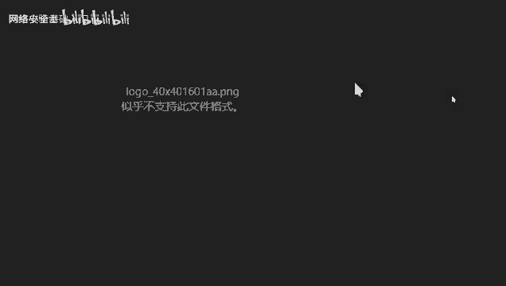

所以这个这里面这道题是没办法去用打出HTV对象去。第三种出来的。那这时候我们要怎么去做呢？嗯。找一个包找一个包。你觉如得这个帮。这个包里面的话，它是有这一个我这。这个包含是这么一个字段的。

就是叫做media type。med type。那我们刚刚分析过了嘛，这个包的大部分信息在media time，所以你要把这个media pad把它导出来。

就是把手动的方式去把这个media tab导出来。那怎么搞呢？你和右键。然后叫做导出分组自节流。你像你你这个就是一个意思啊，你就是就是一个意思，就是它这像是什么意思啊？就是把这一串值。

因为它这时候不是一个完整的，它就是一段一段一段的，所以叫做导出分子分组直接流。然后点也就是你可以按快捷键。那这时候为什么是叫做什么什么什么牛呢？一旦但凡你听到什么什么牛的。

就是它上是一个二进制的一个文件，啥意思呢？就是01010101的，就是我们想说的这种比特流嘛，010101就是比特比特流就是说它是用二进制的形式保存的。所以你可以看到它这边的保存类型是什么。

定啊、deta、low啊，这种全部都是二进制的有个格式文件格式。那你可以保存在本地，然后保存完之后你再。你可要保证好好多个，你把所有的man type把它导出来，然后把它合并成一个文件。

但这道题的话它更复杂一点，你要用DD这个工具。因为你每一个字节流端下来之后，它还有一段头部是HTE头部，你要把这个HTE头给它去掉。所以你后面操作的时候，你要先用DD批量把前面那个字段给它去掉。

然后再用这个文件合并的方式把它合成1个IR好完之后就是一个苍蝇了。

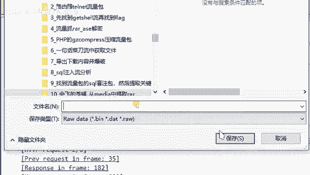

那这个是当然你可以在这个文件这个地方，它有一个con值，你要记住conctrl就行了。快捷键导出分主字节流。就这里也可以，然后或者你你选择这一段，然后导出分组字己来的览也是可以的。

那这种是偏偏向于这个手动的一个手动的一个导出文件导出方式。

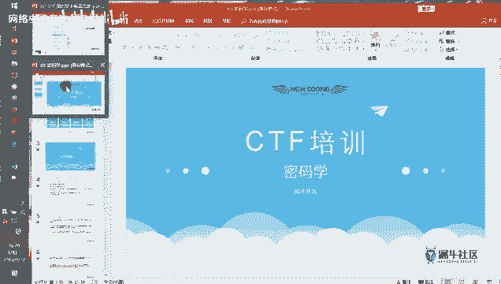

就刚刚导出对象的话，它就只有做四种嘛，最常用的是HTEP其他的你可能就是要用这种导出分组字节流的一个方式。O。那再往下就是这个前面前面到前面为止都是讲的是挖下的一些技巧嘛，挖下一个技巧。

比如说我们的一个过滤的一个方语法嘛，过滤语法，你要过滤IP啊、过滤端口啊、过滤协议啊、过滤豹文啊。还有几种，比如说最踪流的方式啊，然后这个导出对象啊，导出分有自节流啊。

都是对YR shop这个工具的一个认知。然后再往下就是说你前面这种前面这种技巧都是通用级的。就是你可能对所有的包，所有的题目你都可以做相应的操作。那这样一下就是我们遇到一些特定的一些包。

遇到特定的包就要用特殊特定的方法。什么是特定的包？比如说它是无线流量包，它是USB流量包，它是TPS流量包，他说这些包是很特特殊的。那我们来看一下这个无限流量包无限流量包。无限流量包的一个特点。

无线流包是什么？就是我们wifi密码wifi你去你就你你去连wifi的时候发了一个包，叫做无线流量包。那。比较重比较重要的那个包叫做握手包嘛，就是会带上你的这个wifi密码去。请求登录的时候。

请求连接的时候，这个包这个包是最重要的。那这种尺是一共提醒哦。我来看一下这个包。呃。う。我这里面这个包就是一个wifi的一个握手包。那它的一个特点是什么呢？嗯。

我不知道你们认不认识这个我现在录给器己的一些型号，比如说TPlink。对吧比如说TVlink，它就是一个无线路由器。那如果你不认识这个，我们再来看一下，比如说802。11。

802011就是一个无限的一个协议。那还有一个就不是它这边的这个圆航墓地啊，圆航墓地。都不是mark地址都不是mark地址嗯，都不是IP地址，都不是IP地址，都是一些奇怪的一些物理地址。

这其实上这个地址是什么呢？这其实这是一个设备的一个mark地址。就是每一个每一个设备都包括你们自己电脑，你们的。这个手机它上都有个主板嘛，每个主板上面在出厂的时候都会写上一就是印上一个这个商。

这个厂家他制作了一个mac地址。那这个mark地址，比如说他要去统计他一年生产多少设备，他只要去看一下他印了多少markg地址就行了。那这个markug地址就是独一无二的独一无二的。啊。

我们这边看到的都是这个麦克栗子，麦克地子。那还有一个是你去看这个协议分级的时候，比如这个包你去看协议分级的时候，不用看统计协议分级。然后你首先看到是大部分包都是什么呢？

8IE802等于11valencevalence无无线的一个局域网的一个什么怎么帧，就说明说这个包是上是就是一个无限的一个流量包嘛。那么对这种包的话。

比较参考的一个点是让我们去破解它里面的这个waword包的一个密码。那我们来看一下PP先来看一下PPT啊，其实它这边的话呃比较简单，你可以把它拖到这个candyin里面。因为我们获选获取这个无线嘛。

无限流量包嘛，那candy里面就有这些工具了。但你可以用这个windows下的都是一样的，这个工具叫做air。

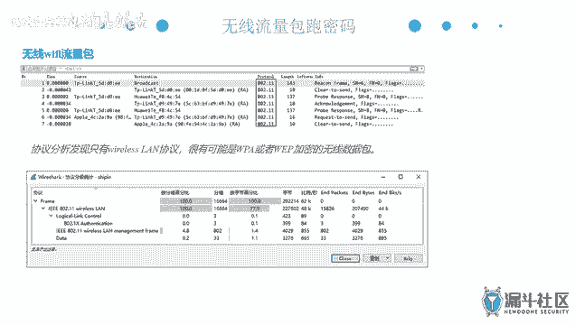

airircr airplane。那我。首先的话你要稍微了解一下无线加密的几种方式嘛。就是你们去设置wifi密码的时候，你们自己比如你们自己宿舍买了个路由器路由器，然后你们想去设个wifi密码。

后你面加一个。那你们要知道看有几种加易方式让你去选择。比如说WWEPWPWPAwo这里面的话，我现边算这几个都是无限的加易方式。其中它的加密强度是有强有弱的，我们说说1P它是加密强度最弱的。

就是可能分分钟就又被人跑出来了，就是密码密码分分钟就被跑出来了。PA可能是比较中短一点的那最强的是什么呢？最强的就是WPA two的。我说得你们家里的很，或者是你们去那你们去设置一个外密码的时候。

可能一般都会让你去选这个WPA two的一个加密方式。那第一种第一确方式是我们去检查一下这个包它的一个加易类型。也就是这个命令就是aircraft加文具，然后你加上这个流量包。然后你面看到几个信息嘛。

最主要是这个incorion是加密类型。你可看到它是一个打个PI的一个handnda shake。handnda shake就是说明说这是一个握手包。那在我们左边看，你可以看到几个ID值。

比如说BSSID，还有这个ESSID这ES3ASSID显示的是0719嘛，这个是什么呢？这个就叫做。wifi的名字能明白吗？比如说我们国科的国科的这个wifi叫国个，有一个tudent。

有个有一个什么有个office嘛，这就叫wifi名字嘛，这是wifi名啊。ESSID叫wifi名啊，只不过这个妈的wifi名叫0719吗？能明白吗？然后BSSID呢是什么意思呢？

SSID是代表的是这个流量？路由器的一个mark克地址是多少？叫BSSIDmark克地址是48位的，它这边是用16进制去表示的，就16进制里把它展成二进制，它一共有48位。

所BSSID是一个mark地址。ESSID就是。就是1个wifi名字。那很多时候如果让你去设置1个wifi的时候，他会他会告诉你或者他有一个选项是要不要去广播ESSID嘛。什么意思呢？

也就是我要不要让别人去打开wifi去搜索的时候，能够搜索到我这个wiY名字嘛。如果你不广播的话。可能就只有你你知只有你知道这个wiI名字，那只有你能去连嘛。但有些人他可能会用一些设备去扫，去扫描。

扫描到你的wifi。比你你们家你们如果说你们家里的wifi经常会有人蹭网怎么办？第一个是改个密码，第二个是把SESSID给它隐藏起来，这样子别人就找不到你们家的wifi密码，只有你自己知道。

那你要点怎么办呢？你要连你就要手动输入wifi名字，就是你连wifi的时候，默认情况下是它自动自己扫出来了。还有一种选项是让你手动输入wifi名字嘛，就是有可能是ESSID被隐藏的。

okK那第一个是我们看一下这个握手包的一个基本信息。第二步呢，我们要加一个字典，然后去让它去。这点我大给到大家。就是你可以加上一个字典，让它去跑。好的话，加字点的话就是在前面的基础上加一个杠W。干W。

然后这个pass点TST就是你自己的一个字典。

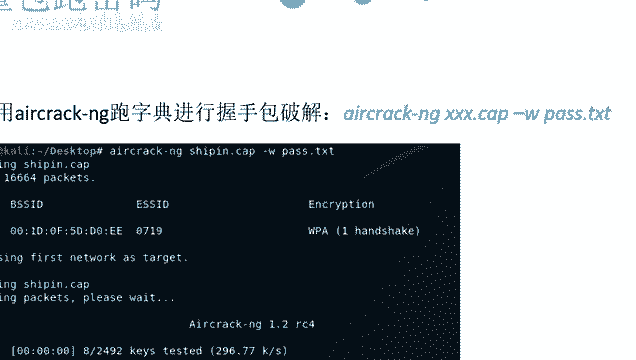

然后你去跑跑跑跑跑跑跑出来之后，如果找到这个密码，打完密码之后是会在这里显示这个P放的。这我是跑成功过的，我跑成功过，我隔壁宿舍的，就是还在大学的时候跑到隔壁宿舍的这个wiI密嘛。然后跑完之后。

他因为我们我们学校是那种，不是像你们是有的很是对接认证，我们那种是自己去电信移动去办的那种宽带，所以我会登上登到他的这个无这个无线路由器上。你接上去之后，无线路由器它是有个功能叫做日这个配置备份。

配置备份里面，你把它备份下来，备份下，它主要是一个压缩包。如果你会一点文件引写的话，你就可以在里面找到他的这个手机号码、宽带号码、宽带密码。那这样有什么用呢？就算你下次改了wifi密码。

我还可以用你的宽带去上网。😊，吃饭可饭。这个就是红花破解啊，红花破解。你看一下，我来演示一下这个这个比较简单。字典这里面的话，我前几天去下了一个字典。嗯。🤧我们在这里。这里面有4份。

你你们可以用文件合并的方式把它合成一份。就是我下想下来就是4份，我也不知道为什么他要排成4份。有有大有小，有这个巨大的应该是下面这个巨大。就常用的一些wifi的一些密码。这里面都是置顶。

然后你们用这种字典去。去破解吗？

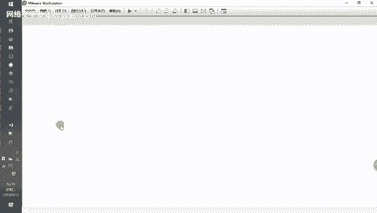

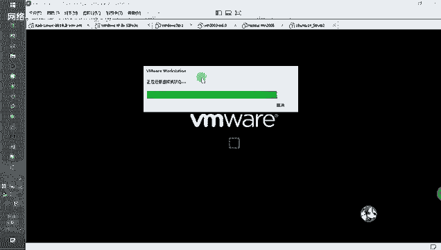

你先把这个文件复制到Kty里面来。这里面可以直接拖进来。如果发现拖不进来的话，有可能是某个进程占用的这个。这个虚拟机啊导致你这个文件拖不进来，这时候怎么办呢？重启一下虚拟机。就我发现有时候扣不进来了。

复制不进来了。是因为某个进程或者某个文件把这个程序占用了。这时候他没办法再去执行这个复制文件的这个操作。首副基金那里有。哎，他提示我有一个。不是我没找到。这是为什么？还有一个我发现有很很多人问我问题。

然后我发现你们好像不是很懂这个minux。就发现你们好像miniminmin应该是没有用过的mining吧。就没有用过这个inux这个操作系统。所以有一些这个基基本的一些操作。

比如说你把一个文件复制到桌面上来了，然后。那个人刚好他还是那同学，他刚好还是中文版的，就开开一还还不像我这样子，是英文版的，他是中文版的。然后他他他直接打开这个这个终端界面嘛。

然后他想去他比如说这面有1个TST，他想去查看这个TST。大家发现这个贴实要找不到了，为什么呢？因为看首先他还有没有进入到这个桌面。马我一开始告诉他，你要你要吸D到。its check top嘛，对吧？

这个桌面。他说他没有，然后很诧异，后来才发现原来他是中文版，他要输入桌面中文这两个字才能进去。所以这个是比较坑的啊。因为。要有一个。基本的一个操作啊，有什么叫基本的操作呢？就是说。我要进入到一个文件夹。

退出到一个文件夹，退出来进去退出来进去。然后呢，我查看一个文件，对吧？我编辑这个文件，然后保存我退出，然后再退出，创建一个文件夹，创建一个文件，复制命令移动。这就是最基本的，因为什么呢？

ininux实在很早以前，它是它最开开发出来，它就是一个命令行嘛，其实图形化是另外一个组织做的一个图形化了。就如果你要呃使用linux的时候，要问我出linux的时候，就是说其实你要用命令行了。

能明白吗？那也如说你要做一个最基本操作。因为我们可能平时用电脑用windows用的比较习惯了，那可能我们进一个文件就是点一下鼠标点进去嘛。那其实这个就是你可能你要学一点linux一些基本操作。

那我刚我在桌面上我是看不到，我刚刚拖进来了，我现在看一下，像已已经有进来了啊。他说这个。什么食食品视频连些。就这个什么什么什么那些聘嘛，这就是这个流量包嘛。然后我们来这个。这个名叫啥来着？

我们来跑一下这个工具啊。🤧AIR拿cl当问去。然后是这个流量包没车。回收完之后，我们发现这是一个这个握手帮了。那这时候我们要加上字典去跑。加上字典，那我可能还要再拷个字典进来。我考个字典。这点的话。

在这里考第一个。这时候找到了，刚刚那个谁么没看到，你要加上这个嗯杠W这个命令，杠W呢后加上这个字典，这个名称叫什么黄银。然后去跑，然后我这边这个这个很快啊，为什么？因为这个字点这个888在很前面。

如果在很后面呢，如果这个字点很大，巴8在很后面，它这个V直跳一直跳一直跳跳，然后跳很久。我为要演示比较快一点，所以我把它提到前面去的。所以它好上显示888了，能明白吗？😊，这个牛要要这个要包泡很久的。

那这个是包括这个YY的一个营量包。那接下来这一块属于比较难的。所以比较难的，然后我也不敢保证会考就是考流量包流量分析题啊，会不会考这个目前来讲目前来讲有一些CTU比赛会考，比如说。

之前的这一个就是绿门在。今在各个各个银行，它举办了一场CTF嘛，那一场是叫做金融的一场CTF就是各大的银行，各大银行的这个安全人员啊，运维人员啊都要去参加了一场CTF比赛。

其中它不管是测试的场景还是比赛场景，它都考到了这个流量分析题。呃USB的流量分析组。那我不知道黑盾杯会不会考，因为这种逆向的考察人员就对象都是不太一样的。但基本上都是因为人人都是这一批人。

就是因为我们这个黑盾杯，它是这个海峡。海峡信息举办了？海峡信息，他们自己也会参加金融比价的CTM。所以提醒可能也会涉及到这种提醒。那我们大致来介绍一下USB的一个流量包啊。USB这里面的话。

你们有没想USBU般会涉及什么流量呢？你们用到了USB设备嘛？一般是鼠标嘛，键盘嘛？还有这个U盘或者是移动硬盘嘛，那这三种东西，就键盘鼠标U盘，它这三种东西走的流量是不一样的。键盘一般走的是键盘流量。

USB走的是嗯鼠标走的是鼠标流量，那USUSCU盘呢，它走的是这个数据流量嘛，对吧？但它统称通通都是USB的流量。那这边的话如果是CDF题目，一般会考察的是两个，一个是键盘的流量，还有一个是鼠标流量。

那键盘有量很简单，就是说。我们敲一下键盘，它会它会产生一个流量，我敲一下键盘就产生流量。那你看你电脑上的键盘可能有我不知道多少个，这个四五十个，四五十个，每一个可能对应一个一个标志位嘛。那给你敲一下A。

它可能会产生一个标志位，这个标志位是一个流量发过去，敲一个B，然后这是个标志位，标志位，一个流量发过去。就是键盘的那如果是鼠标的话，鼠标的话其实如果最简单的鼠标的话是这样是这样子的，就是它有一个左键。

有一个右键。那它还有一个什么呢？它最大的一个流量是比如我移动我这个鼠标的时候，它这个鼠标叫做移动轨迹嘛，它现际在是一个移动轨迹嘛，对吧？那这个移动轨机怎么表示呢？这个我们这个这叫什么？

二维的二维的是不是X轴Y轴，我们通过X轴和Y轴，我们就可以画出一个二维轨迹嘛。所以最终如果你想得到一个鼠标的一个移动轨迹，其实你最终要把流量包，你找到流量包的鼠标移动的数据段把它获取下来。灰外怎么办呢？

把它变成这个A轴和Y轴的两个坐标，得到一串坐标，然后再用画图工具把这个坐标把它画出来。然后这时候你就会得到这个。然后这个鼠标的一个流量呢。那我们这先来看一下这个键盘的流量。键盘的流量的话。

它的一个特点是。啊，首先来看一下USB的一个特点是USB刚刚说的协议数据都在leftover capture data这个这个列里面这个列里面。也就说你们通常你们如果你们还没有去把这个应用为列的时候。

你们是没有这一列，你们可能就只有其他的列，比如协议列长度列信息列，这里面没有这个letttle oppo capture data这一列。

那你们要把这个little over capture data应用为例。那这一列是什么意思呢？这一页差不多有这么长啊这么长，这么长它是有信息的。比如说我们看一下这一串题。这个。

如果是键盘的一个如果是键盘流量啊，如果是键盘流量。它是有八个字节的八个字节。八个字节的话，基件信息什么叫基件信息呢？就是你按键的信息嘛，按键信息是在第三个字节，也就是说。123。在这个地方。

这个字节这一串代表的是什么呢？比如说这块代表是这个。这一串代表的是基建的，基建的，就是呃第三第三个字节啊第三个字节。2。然后你每次去按一下键盘的时候，它就多一个多卡，多一个这种流量包出来嘛。

就产生一个这种一个流量包出来了。那也就是说比如说我装到1个USB流量嘛，我想要知道这个人敲了什么内容嘛，我想知道他敲了什么内容，我希际望我就是看他的。这一列的第三个字节嘛，我把第三个字节全部装下来了。

你装下来之后，你再仔细看00FF这边全部都是16进制嘛。实上是在USB如果这等一下发如果你有兴趣的话，可以去看一下那个官方手册，但估计大家很多没意，因为我自己也没什么兴趣。我这都看一下什么呢？

看一下他那有几张我可能比较兴趣的，感兴趣的，就是。😊，第一张是他这个。这个标志位和键盘的一个对应关系嘛，就是比如说按A这个键，它对应的是哪一个标志位，按B这个键对应哪个是它作用。

然后我我把这个标志位把它记录下来嘛，然后再去查按这个标志位的时候，我就知道它按了什么键嘛。能明白吗？那这里面的话，这边是有一份这个USB的一个官方手册。这个。那你们有兴趣可以去下载。那这里面就是记录了。

记录了所有时间入进制，它对应的一个按键。我们来看一下这一份，这放的第这应该是第60多页了，就这份PDF的60多页有讲到，比如说00对应的是这么一个操作，那这个操作看不太懂。你往下看一下。

比如说04对应的是键盘的A和小A和大A。能看到吗？然后05对应的是键盘的小B和大B06对应的是键盘的小C有大C，它实际上是有一个映射表的，能明白吗？那正常情况下，一个人他可能会敲什么这样。

比如敲什么样的字符呢？字母的A到Z，然后数字的0到9，然后还有一些常见的符号和一些这个换行符号，比如说tablele键，大写大写的键，还有shiftft的键，conttrol。

然后回车键还有这个回退的键嘛，dele的键，还有什么括号啊，加号等号这些嘛，M叹这些一般从这些键盘，它会超常用嘛。我不用把所有键盘都记录下来。😊，然后我做了一件什么事情呢？我根据这个表，我自己写了一个。

我自己写了一个python脚本吗？我写了一个python脚本。对这是我写了一个脚本，然后呢这个脚本有自己的一个就是映射关系。比如说04我们刚说04是A码，05是B嘛，06是C码，我就写了一个映射关系。

然后当我把流量导进来的时候，他去查这张表，然后自动把它拼成。这要把它拼成这个键盘的一个一个字符嘛，明白吗？这是我写的，你们可以你们后面可以直接拿去用。你们可以直接拿去用。那这个时候。😊。

所以说电盘流量其实要去分析的话也不是很难。就是我们把这个值拿拿下来嘛。那现在一个问题是。我怎么去把这个。这些值。我怎么把这些纸把它获取下来嘛？有两种方式。第一种方式是一种处方法。

第二种方式是一种比专业的正常的一个方法。那我先给大家讲一下土方法是什么样子的。我马就是。就提取方式一啊，提取方式一是一种主方法，对它是一种通用型的。不管你要去抓，是不是要抓这个字段，它都可以导出来的。

还是一个主装吧，就是。它这边有一个文件。当然首先你要把这个应用为列啊，你要把这个应用为列。然后它这边有个文件，要导出分组解析结果，然后里保存成1个CSV文件。JSV是什么呢？你这你这道有用过吗？

excel是什么表格嘛？表格的后缀名是叉LS嘛？CSV也是也是表格的一种格式啊，它也可以用excel打开的，就是表格嘛。你们这一个考试的时候，我记得考这个计算机一级的时候。

不是有PPTwordexcel，对吧？那excel的一个实际让你不用操不用去操作它，就是那CSV也是excel的一个格式，就是你它也它就是一个excel。然后。一刀打开。你把它打开。

比如说你可以把它保存成。点赞以后自己去改后缀名了，后缀名改成点CSV的。然后呢，这时候你看下，它长这样，他是把这个。往下的这个表面的这些数据全部保存成这个excel。

那这一列距这一列是不是全部的我们要的这一列？但是这里面有一个缺点啊，就是excel特别讨厌，就是你输入一串数字的时候，它不他先不管你他这段数字是什么，他先把它变成科学技术啊。如果特别长的话。

不知道你们有没有用过一次啊，就是因为有时候我们这个数据，我我想我说一下数字嘛，我想让他认为是一算。字符串吧，结果他把它认为是数字的，而且他还很贴心的以为这个数字符串太惨了。

我把它用我帮你用科学技数法去表示，结果它就缩小了。所以这个是这个也el要比较讨厌的一个点啊，所以它有点自助说明的，所以导致你后面去打开这个地方的话，比第一个为什么是空白了嘛？

因为第一个是000000000，然后他以为这个是一个数字明嘛，所以就把它变成空变成空白了。😊，所以这个是有点讨厌的。你会完这些长度都不一样嘛。因为有些有些东西让给它自动给它去除了。所以这个是一个土方法。

但这个方法不好用，就是当你去保存些数字的时候，不好用，它会自动把它变成科学技术码。那第二种方式呢第一种方式是比较专业的。那比如专业的话。就需要用到专业的工具。那这个工具是什么呢？这个工具叫做T项。

是wi check，不管你们是windows下的还是linows下的。如果是windows架的话，你去wisha的安装包去安装目录下，你可以找到1个P下点ESE就这光是一套自带的，它是一个命令行。

只不过通常情况下没人去关注它它。那你6下，你可以直接用，你不管它放在哪里，直接可以在阴上下去用。只不过我发现了再开一下，你用它它会报一点错误，但是不影响它的正常使用，报什么错误呢？

报这个报一个也不算错误，报一个警告，就是他说你当前是一个入口账号，然后去搞这个很怎么。他说你这种操作是很是很危险的一个操作。根nge。就这种这是个警告而已。那这种无关我们去操作，他会报一个警告。

那这个t shop可以把这个level of capture data的数据单独的复制出来吗？就这样子的话，我前面这种组方法的话是一种通用的那这种复制出来的话，它就不会发生。我们刚刚说的这种。

它会把字数字当成字字串当成复制的一个问题。那怎么用呢？有几个参数吧，这个参数这个这个是个固定的。那你们只要改这里面的两个位置，第一个位置是。🤧嗯。这个地方这个地方是你们流量包的名字嘛。

就是你要分离出来的流量包的名字是这个位置。另外一个呢，你要把这个数据导成1个TST嘛。所以你们只要改这两个位置就行了，这个是你要保存的文件，这是你要导入，那么去分析的文件嘛。

但是你要导出的导保存到这个USUSUSB data上点PSST的一个文件。那我们来看一下这个命令啊。马退出来。

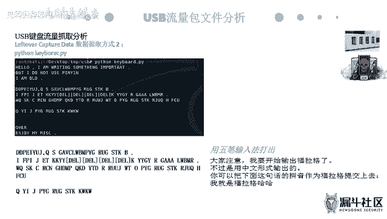

不看看。我在这里面这个文件夹下放了一些文件的，比如说USBUSB1USB2。然后这里面有产生一些数据的，我先把它删掉，先把它扔到回车站去。然后这里面还有一些脚本呢，这里还有一些脚本，有些是我自己改编的。

然后有些是网上复制别人的，就是写别人的，就是有些是别人写的。那基本上都是做一些改编啊，就是在别人的基础上去做一个修改。啊，我们先来看一下，还是这个第一个吧。我们要把这个USBE的流量给它复制出来嘛。

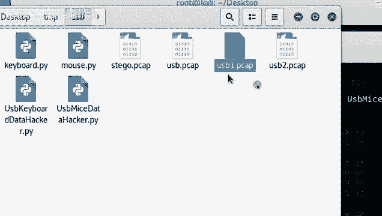

进把打开吧。这开里面也也有啊，也有。然后是我们要把这一个。

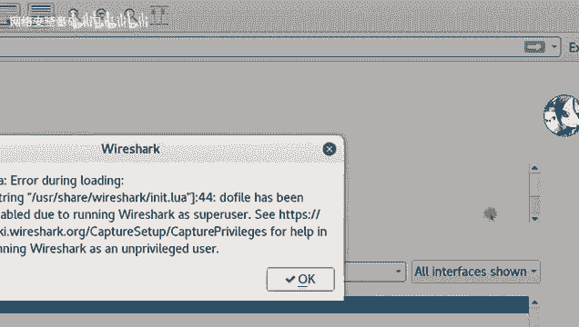

没清楚。就是你你这个流量它协议是USB嘛，USB然后这里面有一个每一个流量下，它有一个什么leve of capture data嘛。这就是它存放数据的字段嘛。那当现在是英英文啊，英文的英文叫什么来着？

英文叫。呃，apply as column。叫做应用为例。能明白吗？就是把它，因为这边本来是没有这一列的，你要把它应用为列是吧？😡，如果是英文版的，英文版的叫。

apply as column column是列，app plan是应用的意思，所以把列应用为就应用为列意思。

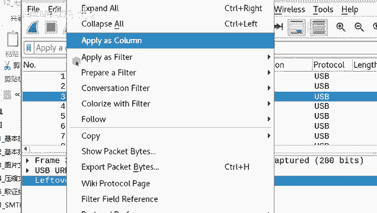

那就这样了。然后现在我们要要的是这一串数据嘛，就这一列的数据嘛，所以我们要用命令把它这个搞出来。我我看一下，我我我不想敲，我看下有没有历史记录。应该有。Yeah。就是我这边有历史记录了，我超超好长。

看一下有没有偷个来。首先我们我我现在说了这常命要改两个地方嘛。哦比如说我要是改USBE的嘛。E为就是把它导出导导出来嘛？比如说导出成USBEdata1点TS team。

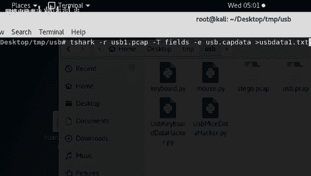

钱。他会报一个警告啊，这个不用管它。那这个时候。你这个地方就会产生1个TST嘛，把它打开。

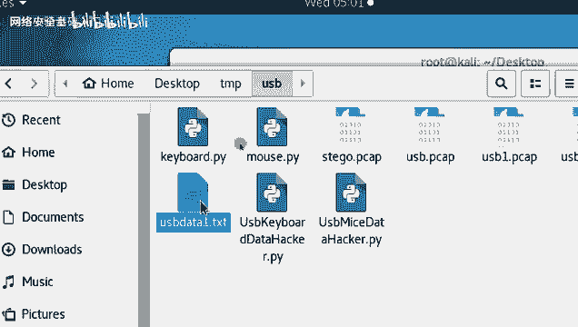

打开就是这一串子吗？

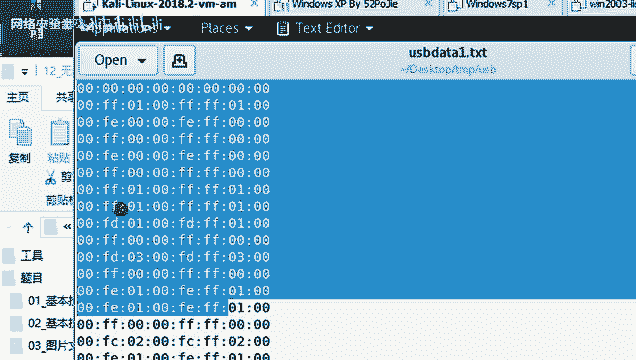

能明白吗？那这时候我给大家写了一个脚本，这个脚本也很容易去认认出来，就是它的名字叫keyboard keyboardboard点PY。

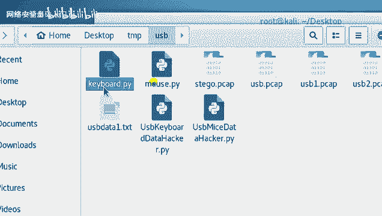

然后这个要去修改一下它，为什么呢？因为。你要不改一下参数嘛，我们刚刚现在是什么USB。贝塔1点TSD嘛，我们把这个导进来嘛，然后去分新嘛，根据这个映射宝去分新嘛。然后点保存。S。

那接下来去跑一下这个脚本。那这个最中得到这一串就是。么hello啊，I'm writing。你刚方还有还有个坑。大家这自有看得到吗？怎么hello 。

I'm writing something important然后butI do not use。这个人太不专业了，这两个是什么？😊，and and do not use拼音anod。

然后他这边又说了一段我们看不懂的字符。😊，然后然后然后oppo应经交易买。什么MC这串是什么？所以它是用五笔打出来的，看不看？如果你没有五笔输入法，你要下个5笔输入法，所以有点坑啊。

这里面是用5笔打出来的，这里面用5笔打出来的。给大家演稍微演示一下，其实我我不会无比啊，我。我我我其实不会无比啊。

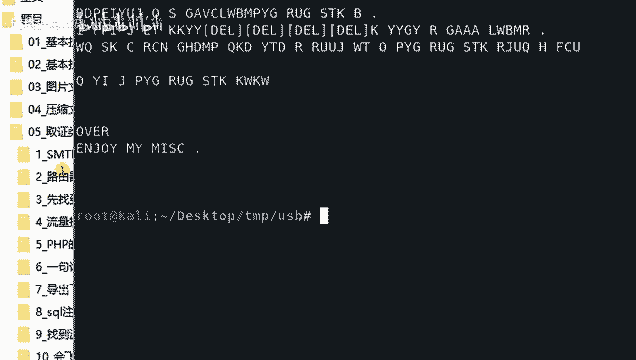

给大家演示一下。先把。啊，这有点大。救命。然后我要切一个5笔输入法特地。因为我如果用微软拼音的话，它自带了一个5笔。本这5笔不太好用，你要专途专门去下一个。比如说你下一个搜狗输入法的5笔可能会好用一点。

滴D，然后。看得到吗？PE。大疆，然后什么IY。因为我我其实不是很懂这个大家注意，然后Q空格S空格，我要GAV开始好像是V开始。然后吸了。哎来到W哎，我我我我不知道很懂无笔拼音哦，我给大家看下结果嘛。

它这边就是应该是我要开始输入flag了。😊。

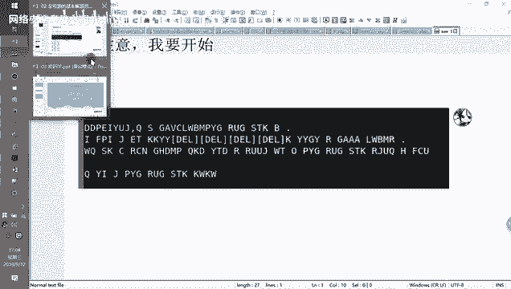

大家看下结果。就这一串大家之边有完开始吃是是什么哈格，然后因为有点坑啊。然后就上是你要把我就是flag哈哈变成拼音提交上去，这一串就是flag。😊，这是有点坑，有时候就是这么坑。

有说你好不容易得到了这个流量了，他还给你下个坑。那这个是这道题啊，这个是键盘流量。我们再来看一下呃鼠标流量。你要鼠标流量的话。呃，主要量会比较多哦，因为你想嘛。你键盘里让是你敲多少它就有多少嘛？

但是鼠标让你你你稍微这么滑一下。😡，对吧你稍微这么滑一下，它就产生很多一样，它是属于我们从这个数学的角度来讲，说什么连续性啊，离散性啊，真不用管它，其实它也是他说要离散的了。也就是说如果你们有学这个。

什么数据分析还是什么？它有一个采样啊。也就是说，其实它也是他去抓包的时候，也是采样的，也不是真的全把它转下转下来。就是你看的是连续的，其实它也是它也是采样下来的。

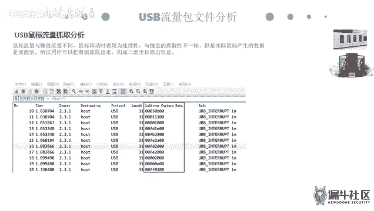

那也就是说。嗯。你如果仔细看一下鼠标流量的话，它这边的话长度没有那么长，它就4个字节。刚刚说了键盘有8个字节嘛，鼠标就四个字节，为什么鼠标只要4个字节呢？这个字己我们看一下啊。😊，这里面四个字节。

第一个字节是代表按键。如果是0叉00的话，就代表你没有按键。也就是说有左键或者有右键。如果是0叉01呢，就代表你按的是左键。如果是0叉02呢，就代表你按的是右键。也说第一个字节。

四个字节里面的第一个字节是03000是没有按键，01是左键，02是右键。然后再往下，第二个字节代表左右偏移。比如说你像往左偏移了多少，往右的偏移了多少，就是如果这个值是正的那就是那就是右移。如果是负的。

那就是左移。那所以第三个字节是代表是上下偏移，就是往如果是正的是往上，如果是负的是往下。那这样子的话，是不是就可以得到你希望你根据这个规律，你把这个数据采样下，你就可以根据这个规律得到它的一个坐标嘛。

得到坐标之后，你再可以把这个坐标化成主标的一个轨迹嘛，能理解我说的吗？当然肯定要用工具了，能能自己画画洒掉的，人能的话，肯定要画撒掉的。😊，那这里面的话。我还是给了一个，这边可能还有更好用的脚本了。

先点了一个。较土的脚本就是这种土脚本。土脚本的话也因为土脚本比较短啊，不会报大多的错误。就它这我这个土脚本的话，它比较短，那一根不会报什么错误。那别人给的有些大神那写了一些脚本很好用。

你直接用流量包导进去，然后直接把图给你画出来。但是。我说了嘛越复杂的东西它也有坏的一面，就是有时候你可能会缺少这种环境，缺少那个环境，导致这个脚本你没办法运行。

因为这个大神的大神电脑的环境可能就不是比你英为的高级的。所以我我这边还有两个大神的脚本，然后有一个我自己的也跑不了，我我自己跑的时候，好像发生错误了。然后其实如果你要去修改去分析这个错误还是挺复杂。

因为他那个脚本本身写的很复杂。那我们这种自己写的脚本的话，就是说它可能就几十行，几十行的话，哪有错误马上就可以定义出来了。现介商的这个脚本怎么去用啊？有几个地方要去改。第一个还是这个名字。

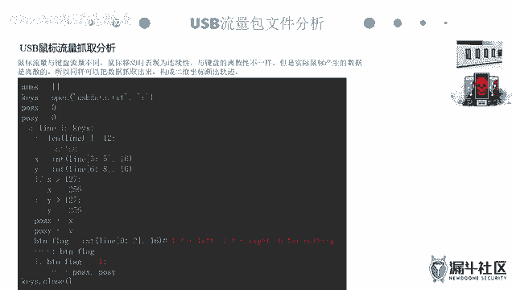

就是你这个你把这个USB datata导出来之后，它的个名字你要去改。第二个是。

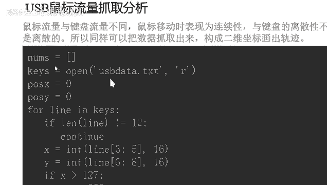

你要改一下这个地方，有时候改成一要改，有时候改成2。就是一是live，二是rouck，您是laning。有时候你要改成一，有时候改成2，有时候一是没办法的，你要改成二再试一遍。来拿，这个是一个坑。

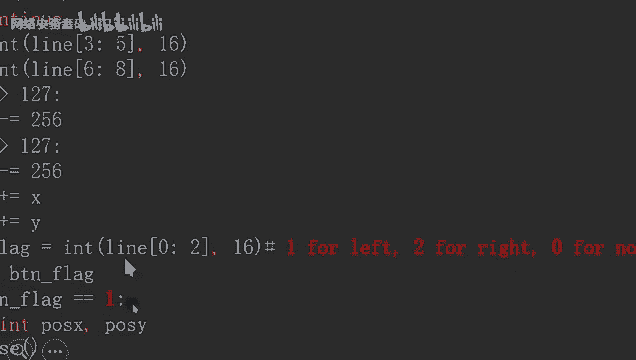

然后等然后你你就可以去去跑这个脚本，跑完之后，你是得到一些数字的，有正有负。就跑完之后，你是得到有正有负的一串数字数据。

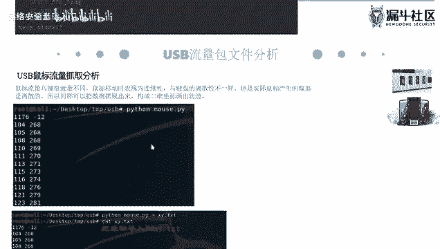

然后这个时候这就是一个坐标了，有正有负的像这就是一个坐标了。然后我们要用一个软件，这个软件就要做GUGNUPLOT哦。就是你给它一段坐标，它会根据这段坐标自动帮你去画出一张图来。

那这张图还有一点它是颠倒过来的，你要这样看它是。它是打打打过来的，我说完之后是打过来的，你要把它打过来，它才能看到一张图片。

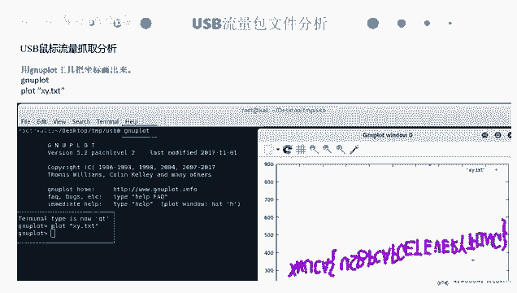

那如果你用的是另外一个工具呢，你可以直接可以看到这张图。字图看得清楚吗？叉SUCN你可能还要把它变细一点，然后USB什么什么什么，就是它实际上是一个。它事实上是就是一个轨迹啊。那我们先来看一下第一个。

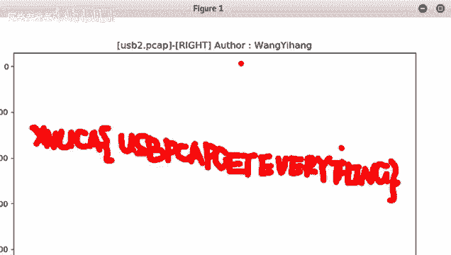

还是要把它导出来，导出来的话这里面。我要用的是第二个流量包，第一个是键盘，第二个是U鼠标的，然后保存成第二个。

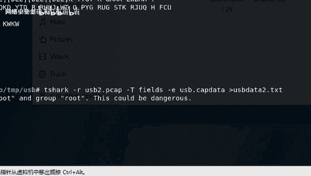

保存完之后。改一下这个脚本。把这个改成2。然后保存一下。那这里面的话，我不记得我这边是一还是二了，我有点忘了，先试一下二了。你是如果不行的话，我们再改成一的。

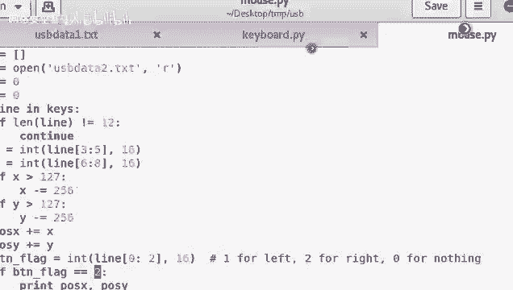

Yeah。那我们去跑一下这个夹本。好了之后，其实它还没有保存成TST，我忘了写了，把它转成TST了，那怎么办呢？因为这里面很长哦，所以我们要把它保存成TST。

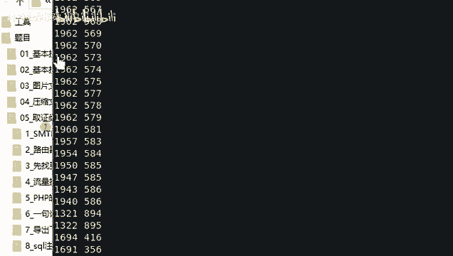

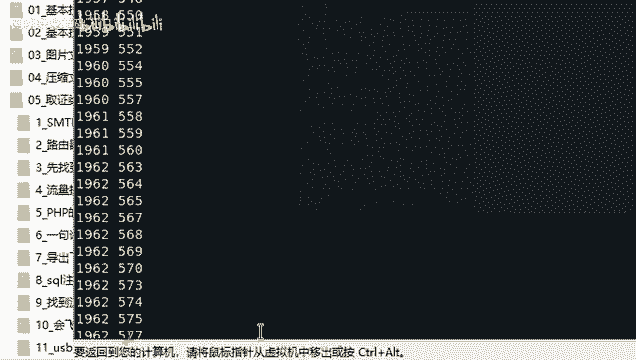

怎么保存呢？你用这个导出符，比如说叉叉YY。PST。回车，然后你再去看一下这个叉叉YY点PST他已经把这个数据保存在这个叉叉YY点PST里面了。所以这里面有一个导出符，就我没有写它做一个文件操作。

这因为生生成这么一个文件。你还到吗？ok那这时候我们就是所有这些工具，它里面都已经有了。除了夹砖以外，就是等下用的这个泡子工具，开里面有。嗯。那什么呢？叫做。

叫做G反正这个单词我不会练了GUGNUPLOT了，它这样是一个工具回车。回这进来之后呃，等下还要敲一条命令。PLOT啊PLOT。对。TLOT然后我们刚刚是叉叉YY点TST嘛，对吧？运行一下。

就是根据这个文件的坐标去画一张图。回车马上就画成画成这张图了，但这张图是导不来了，怎么办呢？很简单把它复制出来不就行了吗。先把它复制出来。哪有。要稍微处理一下就行了哦。比如说。这一个。打开你的电脑。

凹图工具来后把它贴进来，然后选择旋转嘛。它这边有个旋转按钮嘛，有旋转什么。其实翻转嘛啊其实翻转就对了。这个就是。12个了。它这在是一个鼠标轨迹嘛，能看到吗？那最中找到找到这个flag。

所以这种题就是这样子。然后这边还有一个题哦，那不是还有一个题，还有还有一个工具哦。是两个我在kitha上已下载的。然后这个作者呢作话叫王一航。给大家说一下，因为毕竟用别人的脚本，给大家说一下作者是谁。

就是我是这个getha上去下载的，然后他给了两个脚本，一个是鼠标的，一个是键盘的。然后键盘的话可能环境有点问题，还要去调。所以键盘就用我刚刚讲的那种方式。

然后鼠标你可以讲用我刚刚那种方式也可以用他这边的方式也可以。他这边方式的话去直接对这个。对这个鼠标去对这个流量包，就是你甚至都不用提取那lavella那个字段，你直接导到流量包一键运行就可以了。

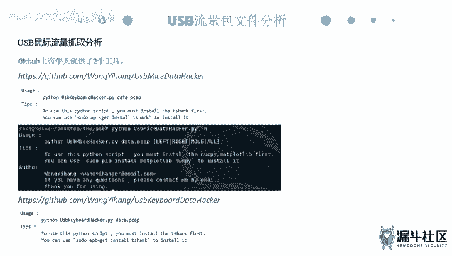

就是。但是你可能要加一个加一个顺序，比如说。它是一个PY下文USD mouse dataPY，然后导到这个流量标，然后写一个right或者是left。就是你要是左边的还是右边的。

因为我们刚刚自己设定了一和2嘛，那我刚刚设2二是right嘛，所以这面要写成right，就这个位置啊这个位置要写成right。

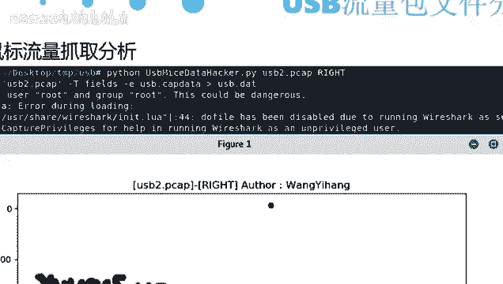

这个位置要选成right。如果是一的话，是le成。他这个脚本设定好的，就是这样子。然后装你像这个角度很简单，你应急一下，它就出来了。它自己自带的一个调用拍摄里面的一个画图库，把这个画图库画出来。

所以这个会以更方便一点。就是说你如个人去做了。但是越复杂的工具，其实你要越能够去修改它，它才能好用。不然的话，就是如果我们修改教本的能力还是不是很好，越简单的工具是越好用的。因为方便我们自己去操作。

这是两个两个点。那USB的话就讲到这里就讲到这里。嗯，我们再讲最后一点吧，然后我们就就下课了。这一个是这个HTBS啊。什么叫ETES呢？嗯刚刚讲了很多HTTP嘛。HTDP。那HTTPS是什么呢？

HTPS就是加密过后的HTTP所它走的是加密的。现在你去访问淘宝啊，访问百度啊，它的流量默认式HTTP它的协议默认设HTPS的。如果你用谷歌浏览器去打开一些HTTP的网站，他会告诉你这个网站当前很危险。

为什么呢？因为它不是HTPS的，就谷歌浏览器，它会现在是这样做。它如果你不是HTPS它会提它会发一个警告，上面写两个危险。然后你你这个HTP它不安全。

所以HTPS就是经过加密的一个安全的1个HTTP协议。那既然经过加密了，这个流量包还能看得到吗？其实你是看不到具体的HTV流量的。那怎么办呢？如果他给了一个题目是HTB的话。

那肯定还要用各种方式隐藏的一个T，或者是或者是直接还间接的给你就是一个解密的一个密钥。那你要导入这个密钥去解密这个HTPS流量。那怎么获取这个密钥，我就不讲，因为我也不知道他是会怎么给。

我们现在就假设他直接给给了我们这个密钥，那我们要去怎么去导入？就是首先啊首先你怎么知道它是HTPSS加密的呢？HTPPSS先给大家普及一个知知识点就是。HTTPSS。等于什么？等于HTDP。

它实际上GTb不是一个全新的协议。它是在HTP的基础上加上了一个安全的一个套接层。这套阶层是一个写叫TLS。那这个套流层有好几个版本啊，低的版本是有漏洞的。低的版本是有动，高的版本是没漏洞的。

那这个是后话的，就是ATPSS它并不是一个全新的一个协议，它只不过是在原来的ATTP的基础上加了这么一个套阶层。那就是说如果你在流量包里面看到很多TLS的。那而且还他大家看到这种东西，43端口啊。

就它是43端口。HTB是80端口吗？它是40张端口。那么这时候你就可以知道，原来它是经过加密过后的HTTB。那这里面怎么去导入这个密钥呢？就假设他给你那个密钥，你要去导入，那你要找到导入密钥的一个地方。

这面我给了因为这个不知道稍微多一点，就是你点击编辑或者是英文版的话，叫做proface，然后点击首选中文版要点击首选项英文版是直接点击proto call。然后点击收选项之后。

找到这个protocol里面的SSL协议，然后点点进来点进来，这里面有一个上传上传这个P的一个D上传按钮。你点击这个上传按钮，然后在这里面点个添加，把里面把你这个。把你这个密钥给它添加进去。

然后点O保存点O保存做完之后，你再去看你的流量。你就你发现你多了HTP的一个流量。就如果你没有导入，你这个HTTP是不会出现的。你导完之后，你发现你多了HTP的啊，这个时候你就会去查看这个HTP的。

有时东西很简单，你导完之后你再去居中旅游。嗯。怎么就结束了？导完之后，你去追中留，然后你就会在留里面它上flag这个词。

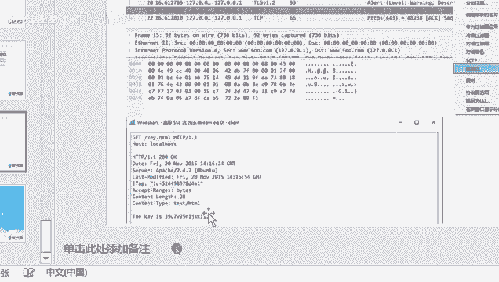

是不是有点小？放大一点。

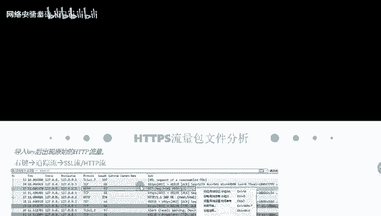

就在这个这个地方啊。

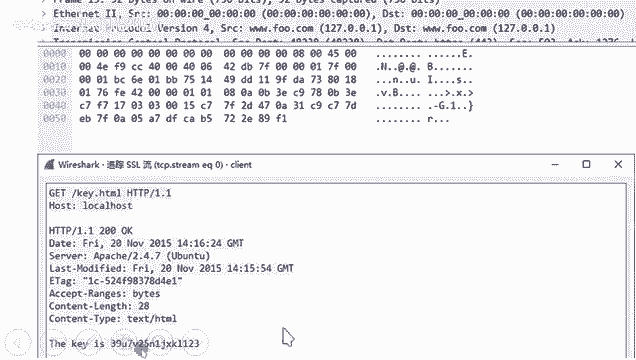

对吗？但题型不一定是这样子，只是一种一种方式而已。看看这个是属于HTTPSSABS。所首要的一点就是要去解密嘛，因为你不解密就看不到了，所以它多了一个简密操作。然后我们这节课就到这里吧。

就是差不多咱讲这些。因为他可能导上可能还会考其他的一些点。那第二一点再往深一点讲，要讲什么呢？就是要讲这个内存取证。就是取也是取在内的。磁盘取证内存取证这一块会比较难啊，所以我这边就因为时间比较短。

那我们就讲到这里吧。下呃晚上的话再讲一下密码学。

明先下课吧。