# CTF最强战队-蓝莲花内部培训教程，CTF入门课程及历年真题，全100集持续更新！ - P7：7.CTF培训-密码学下半部分 - 网络安全基础入门 - BV1vV411T7jY

Yeah。

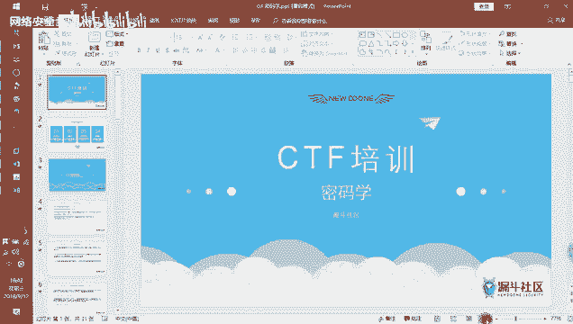

你们晚上讲密码学啊，密码学的内容并不是很多。

那我们来看一下这里面的密码是。这边有4个部分，那给大家介绍一下这个密码学的一个概述，包括常见的一个编码，然后加密算法，还有一个叫做摘要算法。那这里面有个概念啊，就是密码学它常见的有两种，一种叫做编码呢。

那第二种叫做加密嘛，其实这两个是不太一样的概念啊，就是一个是编码，一个是加密。那还有一个甚至都算不上编码和加密呢，叫做摘要算法，和摘要算法。

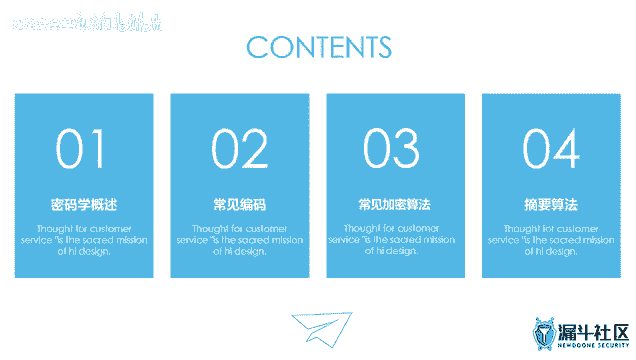

那我们先来看一下这个密码学的一个概述。

密码学的一个发展。为什么要讲这个呢？因为你去做CTL题目的时候，真历个它里面的题型涉及到了很多种，就是包括一些这个古典密码学，就是比较古代时期的这些人。

他是怎么去做一些这个数据的一个加密的那它涉及到一些。古典密码学，然后包括近代的这种，比如说有因为近代可能有些战争呢，那那可可能是什么发电报之类的那他们对这些电报。

他们可能有采用他们方面的一些自己的一些呃这个加密算法嘛。那这些是近代的一个密码学。那还有一部分是属于这个限代密码。如果是涉及到现代密码的那其实这种这种题目的话，题目题目难度就是比较大的。

因为我们现在的密码的话，其实它都知道能够保证一种叫做不可逆性不可逆性。但它采用的一种加密方式都是属于一种强比较强的一个加密。那你做的CTL题目的话，呃，一开始你去做练习题的话。

很你做到很多的都是属于这个古典密码或者是订单密码。那你做到的题目是比较难的。这种一般都是限代密码，因为现代密码是比较难。那编码学的话，它是属于这个密码学的一个分支啊，分支的它并它可能还并不算得上是密码。

所谓的编码基本上是这样子的，就是它可能找到一个对照表，就他可以找到一个对照的。包括你自己也可以去，你自己可以创造一套属于自己的编码。比如说你可以自己创造一个一些符号，然后每一个符号代表一个意思。

然后你自己自己把它用这个符号写成一篇文章，然后发给另外一个人，那只有这个人知道这个编码的意思嘛。这种是属于编码，编码的话更像是一种映射关系映射关系。那密码的就是加密的话，可能是属于另外一种形式。

你举个例子，比如说编码的话，可能比如说你有一盆一盆豆子，那编码的话，可能就是你把每一个豆纸都给它带上一个编号嘛，那就叫做编码，那如果是加密呢，比如说你有一盆你有一盆这个红豆，然后你再把一盆绿豆。

把这两个人豆子混合在一起。那这时候你就区分不开，哪里是红豆，哪里是绿豆了。就是加密的话可能属于一种它可能这个混淆的更更更严格一点啊。那加密是有加密的算法，编码编码更多的是一种映射的一个关系。

那这里面的话。如果是如果是这个加密的话，它涉及到。就是如果你要去解加密的题的话，就是会更难一点。如果你去解这个编码题。比如说ask克编码，比如说unic口编码，比如说UIL编码，比如说bes64编码。

那这种编码的会稍微比加密来的简单一点。它可能你直接用工具就能够直接去把它解除了。但是加密也可以，只不过加密你还需要多去了解一些东西。比如说加密它可能有这个加密的密钥。然后原始的这个铭文和和这个密文。

那加密密药可能。有这种同一种同一个就是我加密和解密是同一个加密密钥的那还有还有一种是我加密是这个密钥，解密是另外一个密钥。那这里面的话就涉及到两种不同类型的一个加密算法。一种叫做对称对称密钥算法。

一种叫对称密钥算法。另一种叫做非对称密钥算法。那什么叫对称密钥算法啊？就是我如果是对称密钥算法的话，就是我加密和解密，用的是同一个密钥，就是我这个密钥，我既可以用它去加密，也可以用它去解密。

就相当于你是一个你去开门，然后这个这把锁既可以把门关了，也可以把门开起来。是这个意思。但是另外一种就是叫做非对称密钥，那什么意思呢？就是我有两个密钥，我说两个密钥的。一个密钥用来做加密。

而另外一个密钥是用来做解密的那这里面的话用来加密的那个密钥，一般称之为公钥。那用来解密的那个密钥，一般称之为私药。那如果是。如果是公钥的话，我们知道公钥是用来做加密的，这个是用来做加密的。

那这个既然他要公钥，也就是说所有人都可以知道这个公钥。所有人都可以知道这个功效，我这个功效可以告诉给所有人没有关系，但是我解密的时候必须是专门的一个人去解的。就是说我解密是我自己才有的。

别人是没有的这种要私钥。那我只有私钥才能够解密。公钥是没办法去解密的那这种算法它的一个复杂度就远远比这种对策密钥算法让来都强的多了。你们举个例子，比如说。你用对策药去去。对策密钥算法去加密一个句的东西。

可能很快，可能就这个几十分钟这样子。如果你用非对称密钥去加密一个一个一个G的东西，可能要一两天这样子。就是对称密钥的一个加密效率远远会大于什么呢？远远会大于这个非对测密钥，能明白吗？因为非对测密钥。

它实际上它的加密过程是更加的复杂的，它需要它需要一个非常严格的一个加密算法，它能够实现这种。工药才能够去加密，然后私药去解密的这样一个机制。那这里面有几种这个。这这里面只是对称加密和非对称加密。

它只是一个列别而已。每一个列有自己的一个具体的一个加密算法。比如说这几个比如DES3DESIDEA和AES这里面都是属于这个对策密钥算法。那早期的话可能是这个DES比较多，3DES是什么意思呢？

3DES是在DES的基础上扩增三倍，什么意思呢？比如说DES的密钥长度是10，那3DES的密钥长度就是30，按样是全序的把这个密钥长度给它做一个增加而已。

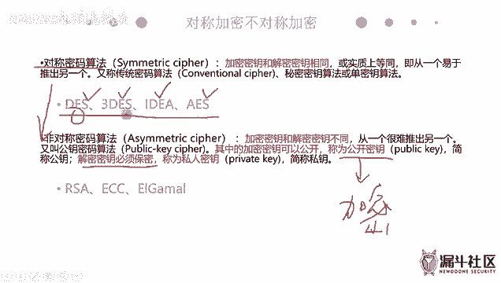

那这里面有一个算法很牛逼啊，叫做就是对称算法。对称密钥算法里面有一个非常牛逼的算法叫做AES这个是号称号称这个世界上最强的最强的一个对称密钥算法，就是AES嗯。应该是还没有人能够破解这个AES的。

虽然说它是一个必测密钥算法，但是它它这个它这个算法很强。那再往下的话，就是属于这个非对策密钥算法。非对策密钥算法这个就很难的。而现在的一些难题基本上都是难题都是堆积在这个非对称算法算法上了。

比如说这个IC这个IC要讲的话，我可以讲两篇。当然这个IC是比较难的。那IC算法的话。其他可能不常不是不是很常考，这两个可能不是很常考。IS是最常考的那他也经常作为这个CTF题来去讲。那这个IS算法。

如果你要去很懂这个IS算法，其实是其实你要稍微懂一点。等种数学啊，比如说你不知道你们高速有学这个高速还是复复变函数，有一有一个概念叫做费马费马定理。不知道你们有没有学过。

就是有一个费马定理来证明一个什么东西。啊后这这里面这个这个这个算法其实挺复杂的，要去要去了解它比较复杂。然后我们这边的话不会讲到这个讲到这个ISL，我们讲一些这个常见的比较常见的这个简单的一个讲密算了。

那另外这个是这个摘要算法，摘要算法，它为什么会出现这个摘要算法呢？它主要是用来去验证这个数据的一个完整性。比如说我数据从一端传到另一端的时候，那我我比如说我从从从A传到B的时候。

那我要去证明说我这个数数据没有被遭到篡改，或者没有缺失，没有被破坏掉。那我我设计的一个摘要算法，那用这个摘要算法来去实现这个数据的一个合法性，然，实现这个数据的一个完整性。那。

如果是数据这个摘样算法的话，我们也把它称之为这个哈西算法。还是算法。那哈希算法里面的话主要有两个，一个是这个MD5MD我们知道它是一个不可逆不可逆的一个算法。

那另外一个是这个叫做SHA啊SHA那这两个都是属于同一个级别的一个这个。还去算法，那这个用来干嘛呢？这就就是你去校验这玩软件是不是原来的这个文件啊。包括如果你们去网上去下载一些工具的时候。

它很多时候都会提供对应的NB5值或者是SHA什么意思呢？就是比如说你去下载一个工具带下来，那你去校验一下它的NB5是不是可和官方公布的这个是一样的。如果不一样的话，说明说这个工具可能有病毒啊之类的。

因为可能被别人篡改了，所以它计算出来的这个NB5是不一样的那这种摘要算法，它有一个特点，就是比如说我有串值嘛，12345789，你只要改其中的一个字符，那么计算出来的结果都是不一样的。

这种是属于这个摘要算法。

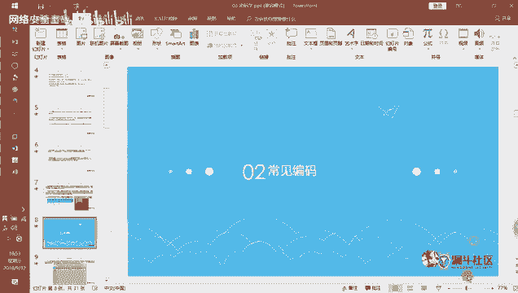

那我们看看一下常见的一个编码权，这里面第一个是这个ask码。那我如果你们去去看这个编码的时候，我建议你们去看一篇文章，就是你们可以去百度搜索一下叫做编码学的故事。编码学的故事。这边网上应该很有名。

就是你们搜索一下一篇文章叫做编码学的故事。然后你面会讲一个小故事。那你们可能会对这个编码有一个就是计算机里面的编码有一个一定的了解。那这个阿斯克玛的话，它是最早期的一个计算机的一个编码。

因为我们知道这电这个计算机最早期的是这个外国人发明的嘛，应该是这个美国人发明的。那美国人他们的话用的这一个字母，包括他们用的语言是这个呃英语的嘛，英语的，那么也就是说他们去做一个编码的话。

他们对自己的语言去做一个编码的话，可能就只要用到所有的这个英文大家写。然后这个包括一些常见的一些键键盘符号就行了嘛。不像我们这个汉字，同汉字可能有这个几万的这个汉字。那么英文可能就就是26个字母这样子。

所以一开始的话。奥克玛它就先开始被设计出来，根本就没有考虑过其他国家的这种不同的一个语言编码。那它就只有这个T位啊，就只有T位。其实。阿斯玛本来是有8位的那一开始第一位还没有用，只有7位。那7位的话。

一共有多少可能性呢？就是二的7次方等于什么？等于128。也就是一开始的阿斯克编码只有128个字符，128个字符。然后后面又增加了一些特殊符号，包括一些其他国家的一些特殊符号，然后变成了一个。256位的。

也就是叫做扩展的ask克码。扩展ask克码就是有256位，然后标准的阿克码是128位。但是即便是这种编码方式。他也只有256个字符。那这里面的话。这里面的话，你们要去解密。

我这边提供的可能都是这个在线的一个在线的一个解密工具了。那你们可以用到具体的一些工具。你们在这个CTF工具包里面。嗯。CDF工具包里面有几个工具，其中有一个叫做有一个叫做小葵多功能转换工具。

这个是这个是比较常用的那还有一个是这个米斯特，米斯特的话，这个工具也是比较常用的。再往下是这个密码机器。那其他的话你看一下具体到时候有用到具体的加密方式再去用。比如说我们打开一下这个小葵。那为小黑的话。

你说我们这边输输一串字母A。B123，那它会做一些转换格式。比如说UI楼，比如说HQ2楼，然后随时进制这个ACAC就是这个阿码。架是ND532位的ND516位的贝64贝46464为了加密和解密。

然后你可以点这个给我转，就是这边有个给我转。一键点击，然后它就可以一键去做一个加密解密。比如说你要点Uag格的，你就点在这里点还原这边每一个具体就是加密是点这里一键加密。

还原的话是点下面的具体的每一个还原项。那你比如说我们先输一个字母嘛，比如说输AA的话转转完之后，它的一个阿克码是97。但是它有一个la阿码是97。那比如说BB的阿码是多少呢？

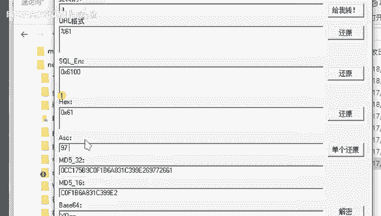

B的二码是98，那这里面的话就是它实际上是有一个顺序的，是有一个顺序的。

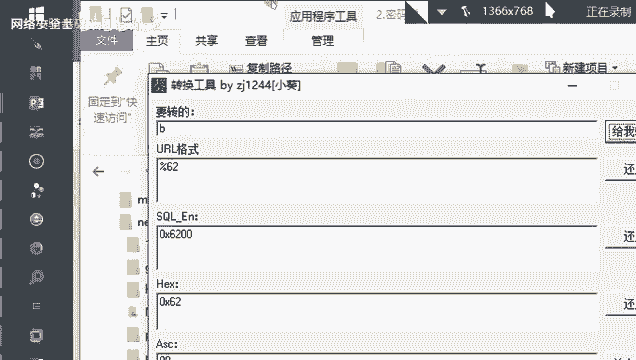

应该会组成一张这个阿斯柯玛表，阿斯克玛表。那我们大致其实如果你要去深入的去了解密码学的话，你要你其实还要去知道这个阿斯克玛。第几位到第几位是这个字母，第几位到第几位是这个数字，第几位到第几位是一些符号。

为什么要了解这些呢？因为有时候你去写一些脚本的时候，就是你先去写一些脚本去做一个自己手动写一个解密的一个程序的时候，你需要知道你可能要用到ask嘛，那你要知道ask嘛大致的一个顺序。这里面的话。

它除了一些可打印字符以外，还有分为不可打印字符。我们看这个ask表ask表的时候，我们可以这么看。就是比如说我们看这一列这一列的askask克玛，那这里面的话，你可以看它的十进制，比如十进制是0。

那从这里开始，0123456一直到120这个128或者6。那这里面的话，比如说这个字符它过来是一个空字符。然它的意思意思是这个呃，这个这个是一个怎么按出来的。然后它的代码代码的一个含义。

但是前面这几个字符可能都是属于这个不可打印字符。什么意思呢？你看一下字符解释，比如说第一个它是属于空字符，就是说这个是一个空的，什么都没有的。第二个代表的代表的这个字符代表是标题开始。

不代表的是什么正文开始啊，代表的是正文结束啊，这里面这些字符都是都是属于不可打印字符，就是它没没有没有办法打印出来的，它是没有打印的一个符号的。那不可打印字符，那什么是可打印字符呢？

我们看一下下面的也再往下。你们来到这里吧，来到这一列。比如这里从这里开始，比如说这个是字符00，它在实进在十进制里面是什么？是这个48，然后11是49这样子。然后这些就是属于这个可打印字符。

属于这个可打印字符。比如说2，然后它是它的它的阿它的二0码是这个50嘛，就是它这边是属于可打印字符。那我们要知道这个可打印字符。有时候你去你去写一些拍对脚本的时候，你想把这个字符做一个转换。

就当当你去当你去需要用到这个脚本的时候，你要知道这个规律。说我们举个例子。

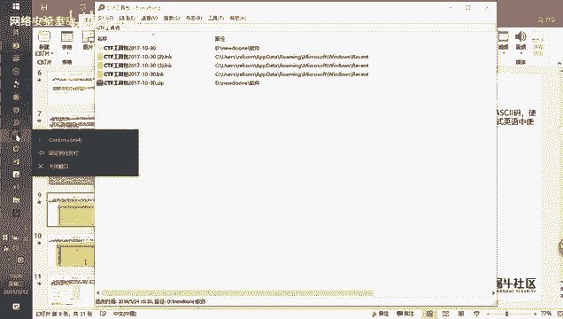

比如说你们进入到你们这个python它的一个控制台控制台。那你可以输入这个ORDORD。那比如说我输入里面在这个ORD里面，我输入这个我要去求这个呃字母A的一个ask码，啊，你回收可以得到这个97。

也就实际上你是它这个ORD是一个函数，可以把一个字符转成对应的一个askask克码。那有时候比如说你你可能你自己写了一个遥准程序，到某一个环节，可能需要把ask他比得到是ask码。

那你就要把ask码转成这个字符串。那你要知道你可能要知道这个过程是什么样子的。那更多的时候是这样子，就是你可能得到的是97。那你想把它转成这个那个字符串嘛，字符串。

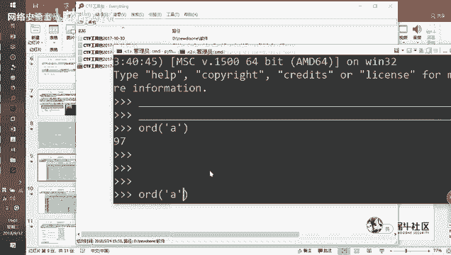

啊，这个这时候就不是用ORD了，就是用用另外另外一个函数叫做char。然这时候你就会得到这一个。这个ask编码所的对应的一个。所对应的一个字符算，这个是属于这个ask玛。那我这里面给了一个在线网址啊。

这个是你平时如果想要去解密的时候，也可以用这个在线网址，也可以用这个小黑工具。当然这里面的这些解密工具，它可能都有一些重复项，就是它可能这个工具也可以解ask嘛，那个工具也可以解ask嘛。

所以工具是有很多选择的那还除此之外呢，这里面还有一个比较牛逼的一个网站啊，这个网站。

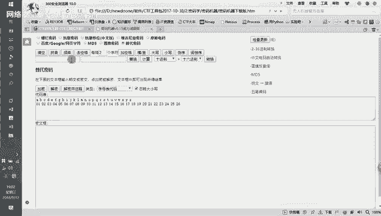

介绍了很多种的这种CTF的一个编码。包括这一个呃算法，然后甚至还有一些这个杂项的一些这个题目。我会把先把这个这个地址发发出来，你们大家可以先先试一下。就这个这个网站是都是属于这种在线的。这属于这种在线。

那你你比如说你你要去找一个解码或者是编码解密的哪些地方，你些工具的时候，一时半会找不到了那你可以用这个在线工具去使用这个在线工具啊。这里面罗列了很多这种在线的一个解密的一个工具和基上它都是呃一些脚本。

那这个是这个是阿克玛阿克玛。嗯。那除了阿码以外，你们遇到最比较常见的编码，还有一个是这个分驰64编码。那b64编码的话，它这个编码的一个特点，它主要是这样子，就是说他想把。

我三个八字节的字符变成4个六字节的。啥意思呢？就是我们把这我把这个放大一点啊。比如说我一开始我要传输的数据是3400A9嘛，我要传这三个字符。那么他们用这个二进制表示的话，是一个二进制是8位嘛。

你用二进制表示的话，这是三个嘛，3乘以8。一共是24个字符吗？那我现在要做我要做了变识64编码的话，我怎么去做呢？我其实是把这8位每分每6位他是换成一位，每6位换成一位。比如说这里面这6位放到这里。

然后这6位我把它放到这里。然后这6位我把它放到这里。把这定位放到这里。然后这时候我就得到4个什么4个6位的嘛，也是24嘛，没错吧。那这时候6为怎么可能表示一个字符呢？

所以我在每个字每个字符串前面添加了两个0，这里也添加两个0。这里也现上2个0，然后这里也现上2个0，这时候我就得到什么呢？我就得到4个8位的嘛。那这时候是什么？32位，也就是说你经过贝64编码之后。

它的长度是变长的，明白吗？你经过贝64编码之后，它的一个长度是变长的那这个是一个基本的一个原理嘛，就是它具体的一个原理是这样子那它的一个特点呢，其实我们去一开始去学编码学的时候，我或者学密码学的时候。

我们只要掌握这几点就行了。第一个是它大概的一个，它就这个密码大概是怎么来的。第二个是这个密码长什么样子？就是比如变这个密码它的一个特征是什么样子。第三个，我要去怎么解它有没有工具，有没有脚本。

然后有没有在线地址等等的那你们只要掌握这三个就行了。那我们来看一下，如果是贝64编码的话，它有一个特点就是一般这个贝ase64编码它会有一个或者两个等号。就是你加用完之后。加一版上得到一算数据。

那这段数据可能会有一个或者两个等号。比如说我们今天这个下午演示的，有一个就是被随就失训嘛，比如这个。有这一串这串纸的话，你把它去当会让这个工具也有也有加密和解密的一些小工具了。

比如说你用这个去对它做一个b64的一个加密。我可能发现这一串就是一串经过face64加密之后的一算编码。那这里面最后有两个等号，有时候可能有一个等号，有时候有个两个等号。如果说这里面等号被去除掉了。

有时候你解密还会出错。就是有时候你说你得到二次算式变成6个势，那那那他等下又去掉，有时候减历出错出错怎么办呢？出错，你就给他补上一个或者两个等号，然后再去减密。有时候这样就可以解出来了，这个是背64。

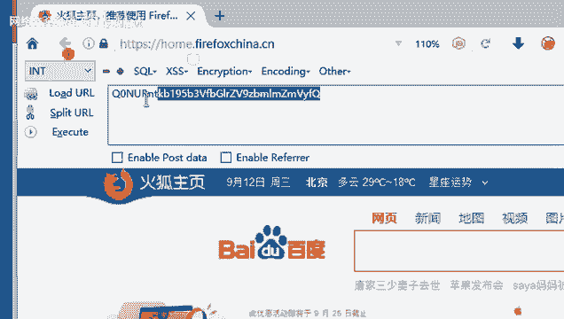

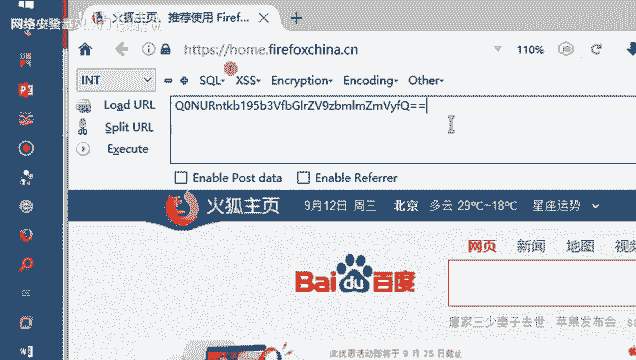

但这个是这个会比较好理解啊比较好理解。然后我这边也给了一个这个加密地址，这里面的话还有一个叫做密码机器，这个是一个离线离线版的一个页面啊。

离线版的一个网页页面就是在里面的这个CTI工具包里面有个密码机器。这里面是一个有一个离线版的网页。那这个离线版的网页，就是它不需要你去。你去联网就可以去使用了。

那这个密码机器它也可以去做各种各样的一些加密啊。这里面有些加密算法，我们等一下会讲不到，比如说账来密码，比如说改善密码，然后比如说维基尼亚模式电码等等。那这里面的话就是你们基本上要有这些工具嘛。

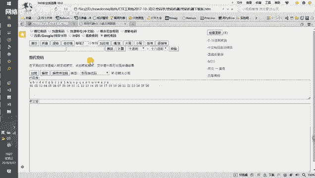

啊base64编码它也有它也有自己的一张对照对照表啊，有自己的一个对照表。就长这样子。你们可可以可以去直接去查表，或者是用工具去解也行。然后这种像是这个UI的编码。

这个也是比较常见的那这个是最简单的这个最简单的它基本上基本上正常的1个UI的编码，会对这个一些符号，对一些符号或者是中文去做1个UI的编码。因为很多时候UI的编码它。一开始可能更多的是在这个链接上。

就是在一个壁址上。那地址上很很很多时候都是没有没有这个中文的，所以他会去对它做1个UI的一个编码。但它的一个实质事实上是是这样子的，就是UI的编码实际上是有两个操作的。

第一个是我先得到这个字符的一个arcle码。然后我在。把这个阿特玛转成十六进制。就是我先得到一个字符的askask克码，然后再把这个字符字符的ask码变成十六进制，然后在前面加上一个白分号。

也就是说你看到这个编码里面有很多的百分号的时候，你就会以你就会可以猜测这个可很有可能就是很有可能就是属于这个UI的编码。那也就是说其实UI的编码还有一个还有一个称呼叫做百分号编码。

就是因为它的一个特点就是它这种编码方式的话。是属于这个百有1个分2的那我经常也是要么用这个小回，要么用这个火物预蛋器，用火预蛋器。

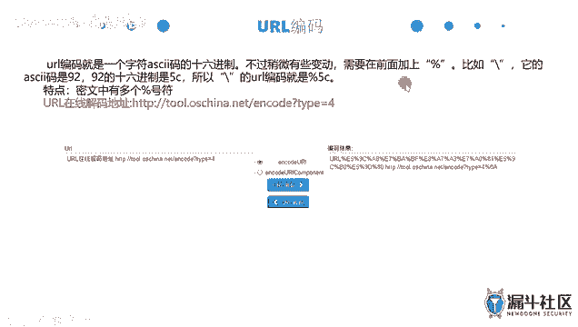

我浏览器这里面的编码它最主要的三种编码，一种是faces64，一种是这个UI的编码，就是前面是face64加编码，然后减码UI编码UI解码。然后这里面这里面的话，这个是属于这个十六进制的。

十六进制编码和1六进制解码。

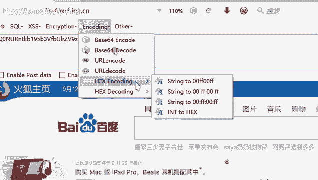

然后在这里面这里是一个加密，这些加密的小工具。加密这里面的话能解密的就有这一种LT13能够去解密。其他的这种，比如说MD5，它只能做加密，ACHA只能做加密。然后ACHA256也只能做加密。

它没办法做解密，因为这三种是不同立的。然后只有这个LT13，它是能够去做解密的。

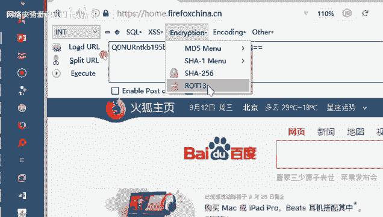

我们先在看一下PPT。

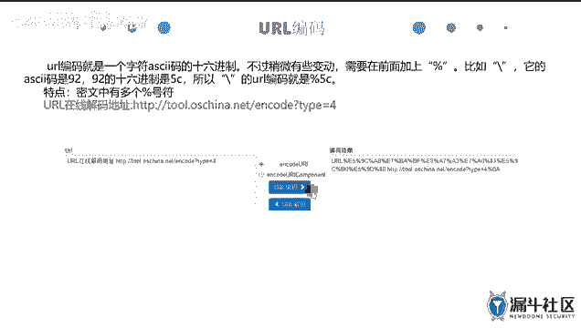

UR编码的一个。市常见的是这样子，就是呃。我一上字不券。比如说。我输入一下字状AABC然后空格，比如说我加一些符号，然后我再加一些数字，加一些字母。那它一般的话正常情况下。

他不会去对这个字母去做一个编码，就它如果是比较强的话，它可能连字母都去做一次编码。那通常它它会做对符号去对符号空格也是符号。它会对符号去做一次这个编码。

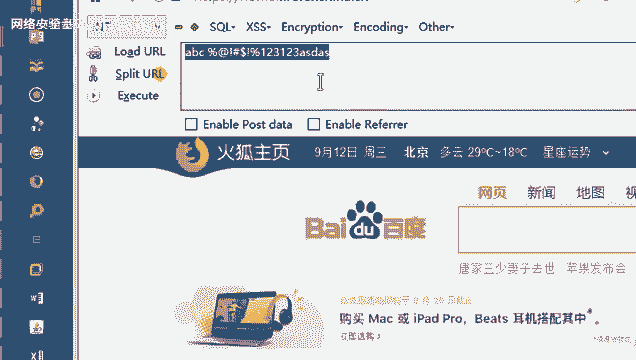

那有时候有时候你拿到的UR了，你需要他进过编码之后，它可能连字母都编码过了。所以你要去对字母也去做一次编码。这里面的话我们直接解码啊，直接去。这个编码。就得到这么一串，这就是这就是一串这个呃UR的编码。

UR编码后的一个结果。

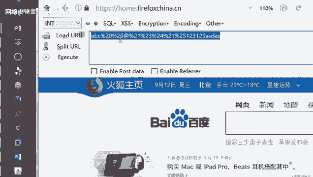

那再往下是这个叫做unicode编码。unicode编码它事实际上是它的前256位是和这个阿克玛编码是没有什么区别的。但它后面的话为什么会研发这个unicode编码呢？

因为因为世界上还有很多其他的国家嘛，还有各种自己的语言啊、符号啊，那可能需要一个更大的一个编码方式来去支持这些编码。那我们前面提到的这个ask克编码，它实际上最多最多就256位了。

因为二的8次方是256。也就是说最多因为阿ask克玛只有8位。那么它最多只支持这个。256个256个字符。那如果是用一口编码呢？unic口编码就是两个2个8位嘛，两个8位。也就是说比如说同样一个文件啊。

如果这部分文件是用asktq编码，可能它只有一兆。但是你用unic口编码完之后，你得到这个文件大小是两兆，因为它多了一倍的一个编码字符空间。那unicode编码刚说了两个8位，那也就是它有16位。

也就是它能够支持的是二的16次方，2次方2方已经啊非常大啊，基本可以支持任何的这种字符编码级了。那这里面的话。这个是一个解密软件，它的一个特点是什么呢？你们要记住这个特点。

就是它的一个编码完之后有很多这种杠U，就是有一个杠U的杠U叉叉叉就杠U多少的少。然后杠U后面可能有4位。你看到这种看到这种这种字符的那你就要知道这应该是一个这个。这个unic扣编码这个unic扣编码。

你再往下，这这些可能并不属于并不属于编码，它实际上是属于这一个一些网站的一个dress的一个回响啊。just是什么意思呢？J实际上是一个语言，just叫做javascriptb。

javascript这实际上是一个语言，它是属于这个网页前端的一个一个代码。那这个网页前端的话。怎么网页单？就是你们浏览浏览器看到的这些有一些动态效果的，有些动态效果的那比如说一个按钮。

一个按钮点击之后，它可以把这种东西提交，这个实际上是一个动态的一个效果。那这些功能都是用javascript去执行的那javascript这个它是一个代码。

代码肯定要有这个这个编编译的一个编解就是运行的一个环境。那实际上我们的这个浏览器，它本身就是一个javascript的一个解析器。也就是说你你如果它是javascript代码的话。

那么它就可以用浏览器去做一个就是可浏览器上可以运行这个任何的一个javascript代码。那这里面的话，第一种叫做坚实的一个回淆啊。比如说我们看到的这一这里面这一串。

这里面这一串这里面这一串是什么意思呢？这一串这里面这一串实实上它是一个它是一个16进制，它是一个1六进制。它原本是长这个样子的，原本是这个squabal XS，然后squab。

然后你对它去做一个十六进制的一个转换，得到下面这一个字这一串内容。那这一串内容你你我们正常你不你用不去做一个解解码的时候，你是看不懂的。但是你可以直接把它放到这个控制台上，放到控制台上去运行它。

比如说嗯。然后我们接下来解释一下这个是什么意思啊，这算squi，这个实上它是一个弹窗，就是它会弹出一个窗，框窗口的内容是什么呢？窗口内容是中间这一串字算。比如你写写成叉SS，那么它弹出一个窗。

这个窗的内容就是这个叉SS。那这个时候我们只我们如果要写这种编码的话，我们只需要有一个这个。

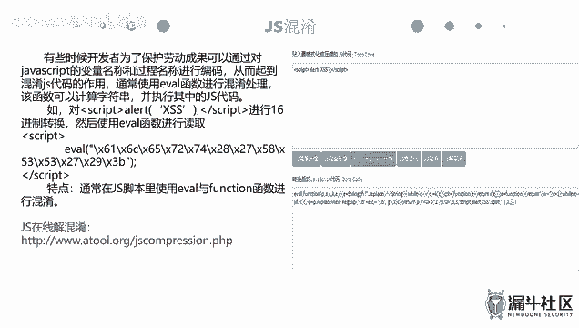

我们只需要有个浏览器就行了。我们可以把这个字串这串混淆过后的把它复制出来。然后你打开你自己的浏览器，任何浏览器都可以。因为任何浏览器它都有。

