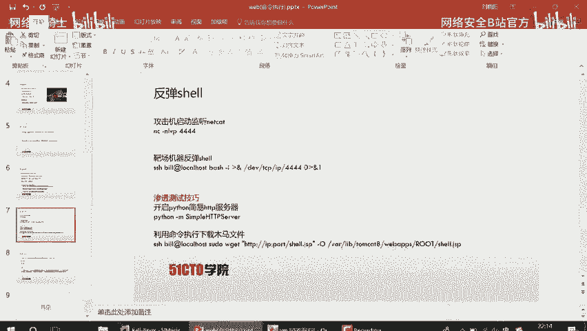
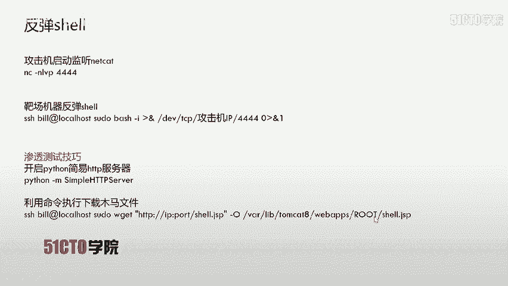
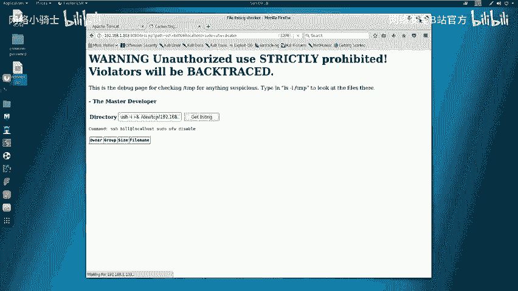
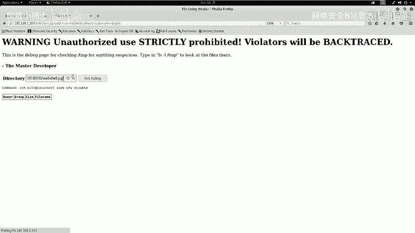
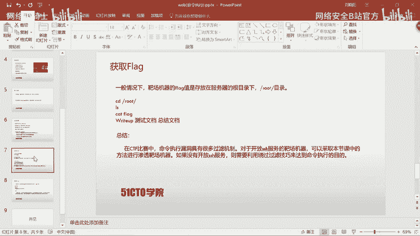
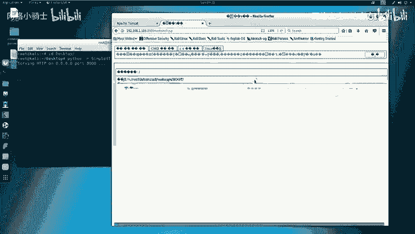
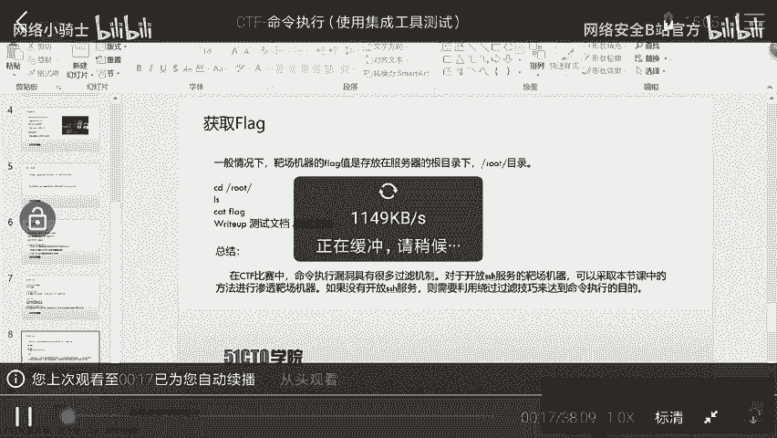
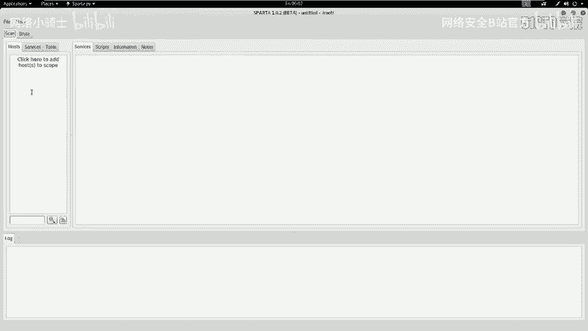

# CTF最强战队蓝莲花内部培训教程｜上千小时教程还怕学不会？ - P20：21.web安全命令执行 - 网络安全B站官方 - BV11M4y1J7mU

好，今天我们来学习一下万邦全当中的命令执行漏洞。通过在oneb应营程序当中执行系统命令。最终获得系统的。root权限。在root权限之上，对服务器进行对应的操作，取得对应的flag值。在课程之前，哎。

我们先介绍一下命令执行漏洞。当应用哎需要调用一些外部程序去处理内容的情况下，就会用到一些执行系统命令函数。如PHP当中的systemESECSHELLL下划线ESEC函数等。

当咱们个人用户可以控制命令执行函数时中的参数时。将可以哎注入恶意系统命令到正常命令当中，哎，便造成了命令执行漏洞、攻击。哎，这是命令执行漏洞哎产生的一些原因。当然哎咱们在调用这些函数执行系统命令的时候。

如果将用户的输入作为系统命令的参数拼接到对应的命令行中，并且哎对用户的输入哎没有过滤或者过滤不充分，那么就造成了这个命令执行漏洞。下面咱们看一下今天的实验环境。首先，公积机使用卡利linux。

它的IP地址是192。168。1。105。靶厂机器哎使用linux系统。他的IP地址是192。168。1。103。咱们拿到这样一个实验环境。究竟要做什么呢？在CTF比赛当中。

大家一定要有着一个明确的目标。那就是获取靶场上的。flag值取得对应的分数。下面哎咱们进入第一步操作信息探测。对主机的服务信息以及服务版本进行探测。咱们使用到M map，然后杠小S大V靶场IP地址。

来探测主机的服务信息。咱们回到哎卡利当中。输入 a map。杠SV192。168。1点。103回车。这时候哎咱们map向靶场机器发送大量数据报。以此来获得对应的。信息我们会发现哎，这里。

出现了很多扫描的信息。除了可以扫描服务版本信息之外，我们还可以使用。嗯m哎杠A杠V靶成IP地址。然后再加上杠T4。刚T4哎代表的是以最快的速度扫描主机信息。通过这条命令，咱们就可以扫描主机的全部信息。

下面哎咱们开始操作，使用N map杠A杠V杠T4输入靶场的IP地址回撤。这时候哎咱们速度很快的进行发包。和收报最终获得靶场的一些信息。咱们除了可以使用N map进行信息探测之外。

也可以使用nic two来探测哎靶场的HTTP。这个服务的一些信息。下面哎咱们使用M map ni two。来探测一下靶场的HTTP。服务信息。Nick to杠 host H T TP。

然后加上靶厂的IP地址。这里哎一定要注意，咱们一定要加上。靶场的HTTP的这样一个端口号是8080。不去。这时候哎咱们尼 two开始探测我们该靶场的一些信息。我们会发现哎。

这里探测到了一些这个HTTP爆头哎，没有开启。并且。呃，有一些哎这个弱点信息。呃，允许的爆头是put哎，put这样一个爆头，并且允许delete这个爆头协议。可以说这个put和delete是相当危险的。

put哎之前造成了引发了一个特别大的漏洞信息，也就是IISput。远程攻击者可以直接上传web share到服务器上，直接获取服务器的控制权。delete可以直接删除服务器上的文件。

造成服务器上系统的不稳定。咱们继续看这一条热点信息。看到哎该HTTP服务下有一个test点GSP这样一个文件，并且它可能是哎非常有趣的。咱们现在哎扫描结果已经出来了。对于扫描结果，哎。

咱们就需要进行下一步操作，就是深入挖掘咱们扫描到的一些信息。比如说咱们扫描到了哎这个HTTP的信息。咱们就需要按在浏览器当中浏览一下。这个对应的页面查看是否具有咱们可利用的信息。

这时候哎咱们继续打开卡利。在这里哎，咱们。有1个8080端口，那咱们就在浏览器当中浏览一下8080端口。打开火狐浏览器。输入。192。168。1。103回撤。呃，这里是不是没有输入端口号呀。

8080回撤。我们可以看到哎他这里有一些信息。并且啊这个是默认的啊，tom catt，也就是这样一个中间键的主页。并且它的文件系统还是存在这里。呃，这一点非常重要。他是我们。这个。

网站的根目录可以说是这个信息大家一定要注意。咱们除了哎刚才收集到这样一条信息之外，还收集到哎咱们这个test页面是存在的。那么下他面咱们就在浏览器当中访问一下这个test页面。TST点GSP回撤。哎。

这里哎，咱们是不是又没有加端口号呀？所以说大家一定要注意，一定要加单对应的单口号。哦，这里咱们IP地址是1。103。冒号8080，这时候哎咱们访问到了testGSP这样一个文件。咱们看提示呃。

他说这是一个哎调试的页面，主要是用来检测tamp这个数据缓存目录的一些呃变化。如果你输入这个。lists啊也就是这条命令，哎，可以查看tamp目录下的一些信息。这时候我们看到这里会发现。

在这个地方输入杠。LS杠L杠TMP。回车会发现他返回了一些信息。我们通过这里。就联想到之前的命令执行漏洞。也就是在web应用程序当中输入啊一些。参数或者输一些命令，啊，就会在服务器当中执行。

最终造成服务器的命令哎。通过web应用执行，咱们就可以利用这一点来root主机获得对应的权限。接下来呢哎咱们就使用哎这个漏洞哎的一些原理性，哎，以及使用一些命令。来利用这个漏洞。

我们刚才哎使用到了LS杠Lt这样一命令。而我们在这里使用到LS杠ALHt。杠A是显示所有的文件和目录。杠L是以长文件格式显示，杠H是以人类可以快速识别的这样一个方式显示。下面哎我们继续执行。

LS杠ALH。然后输入对应的目录。At least。我们会发现。我们通过这条命令。可以显示出更为详细的一些信息。之后哎我们更主要关心的是什么呀？是这个服务器上面的用户信息。

而我们linux每个用户在home目录下都有单独的目录来存储对应的信息。下面我们就使用这样一条命令来查看一下。linux系统上的用户信息。输入LS杠ALH。港。Hong。回撤哎，我们会发现哎。

这里出现了一条一些信息。一个点代表当前目录，两个点代表上级目录。而我们在这里出现了bill，哎，它还表示哎具有一个build这样一个目录。那么直接可以判断这个。linux机器上面是有biO这样一个用户。

在验证完之后，哎，我们需要进一步探测，也就是查看一下这个。挖掘到的这个用户是否还可以挖掘更深层次的信息呢？这时候我们就可以查看一下该用户的。对应目录下是否具有可以利用的信息。使用杠。

ALH然后是home，然后对应的用户名来挖掘一下对应的信息。LS杠ALH，然后是HOM。ME然后是B。At least。我们会发现哎返回了一些信息，在这里哎，这是系统默认的一些密这个。目录哎隐藏目录。

然后这里有些乱码，这里哎有nano的这样，这里有个配置文件的。这里有个点SSH哎，可以想到这个bill是可以使用SSH啊来远程登录服务器的。并且这里有段提示说。

如果我们使用SU do是可以哎作为管理员来执行一些命令的。哎，这一点很重要，哎，我们就可以发现，可以通过它来提升权限，执行root的一些命令。除此之外。

我们也可以使用U name杠A来查看一下哎这个系统的所有信息。使用you name。港A。该list哎，可以看到这里哎我们有一些哎这些版本信息以及乌斑图哎这样一个操作系统信息，以及它的一些这个。

操作系统的内核了啊，以及开启的时间了哎，这样一些信息。通过这里哎，我们直接联想到乌斑图上边哎有一个默认的这样一个防火墙，叫做UFW。呃，这一点以后大家呃一定要注意。

咱们刚才哎已经探测到了哎这个咱们服务器上面哎具有bill这样一个用户名。并且通过SU do哎，这个bill用户可以执行root用户的一些命令，哎，执行它对应的权限。接下来给大家扩充一点，哎。

就是使用SS命令哎，如何来进行。一些操作。当咱们使用SSH哎，加用户名，然后ant符号加上local host哎，就可以通过SSH登录服务器。也就是咱们本地通过SSH来登录服务器。

那么这时候咱们是不需要哎身份验证的，直接就可以登录到服务器上面。下面哎咱们就根据以上这样一条规律。来查看一下用户bi。执行SU do命令的一些权限。这里使用到SSH bill，然后艾符号。

然后local host免登录。来执行root权限，查看SU do哎权限信息。呃，使用SSH。Bill at4。Local host。呃，这条命令来执行。会发现哎我们这条命令哎执行成功。

并且返回来了一些信息。我们会想到，哎，这条命令是可以哎执行root权限的。那么咱们这时候刚才说到，哎，这个系统是乌斑图系统，它是有哎对应的防火墙的。那么咱们这时候就可以使用。B有用户。

来执行root权限，关闭UFW哎，这样一个防火墙。来避免哎之后咱们执行的一些操作受到防火墙的影响。呃，这里咱们是用SSH。B。As you do， are you F W disabled。咱们执行。

会发现哎，咱们这条命令执行成功，哎，并没有给咱们返回任何信息，因为咱们只是关闭防火墙。在进行完哎，这样一些操作之后，哎，咱们就需要。根据咱们目标要获取f，那么咱们就需要提升对应的权限。提升权限。哎。

咱们经常使用到的一种方式就是反弹一个shall，让这个shall反弹回来，哎，咱们可以执行对应的操作。这里哎咱们介绍两个反弹 shell的这样一种方式。咱们先做第一种反弹 shell的方式。

咱们使用NC在攻击机上监听某个端口，然后通过命令执行。来江。靶场机器上的。TCP协议反弹回来，反弹到咱们的公积机上面。使用下边这条命令。首先呢哎咱们在攻击机上开启一个终端。

使用NC杠。L楼。为P。4444端口，咱们在444端口监听。呃，在监听之前哎，需要大家查看一下咱们444监听是否哎已经被使用。

哎，这里哎咱们刚才NC刚启用。那咱们可以使用。在启用监听之后，哎，咱们就可以在。这个命令执行的地方，通过SSH。然后哎。调用SU do哎这样一个root权限，将base哎base反弹回来，反弹到哎这个。

对应的这个端口上。哎，咱们回到PPT来讲解一下这个命令。呃，靶场机器反弹效要哎，就是使用这样一条执行的命令。首先咱们。要把这里哎加上一个SU do。然后贝ase纲案哎以交互性的模式。然后将第一VTCP。

也就是TCP协议。呃，反弹给哪个端口呢？反弹给哎对应的IP也就是这里是咱们攻击者。公积金的。IP地址。然后对应的端口，然后是零，然后这样将括号哎，然后是。艾符号，然后是一哎这样一个情况。

咱们来执行一下这条命令。这时候哎咱们回到哎终端。这时候哎咱们终端成功的哎返回来了笑。呃，ID回撤。哎，这时候咱们已经是root权限。有的权限哎。咱们这是哎第一种方式。其实呢哎咱们在渗透测试当中。

还有另外一种方式就是给。HTP服务器啊上传哎这个万部嘛。通过木马来实现对服务器的控制。咱们在上传的时候，哎，需要具有一个可以联通的哎下载这个木马的HTTP服务器。这里咱们可以使用。

python里面的唉一个简易的HTTP服务器，也就simple hTTPserv之后哎执行命令，来让咱们靶场机器来下载咱们的sm脚本。咱们通过浏览器访问shall脚本，最终获得咱们对应的权限。在这里哎。

咱们这个下载的这个木马，一定要哎将它上传到哪里呀？上传到咱们的网站根目录。哎，在之前咱们index点HTM level里边发现它的根目录就是咱们现在wa8 web appPSroot这样一根目录。

然后上传到share点GSP这样一个文件当中，下面哎咱们来操作一下。

哎，首先我打开一个终端。呃，这里呃，咱们。打开终端之后哎。先把它最小化。然后打开终端来使用。CD。That'stop。哎，切换到桌面，在桌面哎，咱们这时候已经准备好了一个web shell啊这样一个。

脚本也就是木马we小。在。桌面哎启用哎这样1个HTTP。的服务器。那么咱们当前桌面哎就是咱们这个服务器的跟目录。Simple。HTTTP。S网。回撤这时候哎咱们就启动了这个服务器。

那么咱们接下来哎就需要执行对应的命令。

首先哎是咱们SU度，哎，这里不变。接下来we get。呃，咱们对应的。Rabxiao。上传到web shell上面，然后咱们这里是桌面的web shell。

At least。呃，这时候啊咱们开始上传这个效。

哎，这个过程可能比较缓慢。因为他要发送哎大量的这个信息到服务器上面。并且夫妻要跟我们进行交互。跟我们这个simple hTP server进行交互。那咱们暂时不等，哎，然后继续向下做。哎。

一会儿再看具体的这个。🤧效果。咱们现在哎已经用NC反弹回来哎，一个hell，哎，并且获得了这个root的权限。咱们想一想，咱们在做CTF8场的时候，是不是要最终获得flag值才能取得对应的分数。

那咱们靶场机器上的flag值，一般情况下是存在root目录下边，因为只有root用户才能查看root目录下的哎文件内容。那么咱们这时候就来获取一下flag。回到这个。

NC的 shellll当中PWD回撤会发现它是在bid的目录下，咱们切换到root目录下。回车哎，LSPWD。会发现LS有一个flged哎这样一个文件。那咱们使用cat flag。

来查看一下flag的值回撤会发现这时候哎咱们就得到了哎对应的flag值。那么咱们这时候哎就已经完成了靶场的哎这个所有测试，并且获得了最高权限。这时候SCTF比赛也就相当于接近尾声已经完成了。

那么最后就是要干嘛呀？要写一个。rightite up哎，也就是一个测试文档。呃，总结文档。来说明。说明哎你的这个方法是如何进行的，最终获得对应的flag值的过程。

咱们再看一下刚才咱们提示到的这个渗透测试的技巧，是否哎得到了咱们想要的结果。

呃，这时候他还没有。来，出现对应的结果。哎，可能是因为我之前哎上传了web shell。点GSP哎这样一些文件啊，那造成它并不能哎直接上传。那么咱们直接打开直接登录哎，登录之后会发现哎。

这里有一些对应的信息。

呃，这个CMD啊，怎么艾一下，是不是它是一个tom cat这样一个。咱们看一下LS杠AL，这是咱们一个木马执行这个CMD会发现哎，这是他跟录了下的一些文件，这是我之前测试所上传的一些文件。

可能说哎是因为哎这个服务器的一些设置，哎，导致哎这个文件上传之后，哎，不能覆盖上传。导致我们这个。简易的这个。服务器一直没有响应。哎，我们在这里可以看到没有任何响应。

那么大家可以嗯根据这样的方式来自己下去去尝试。那么咱们最后哎总结一下。这个命令执行哎的一些。常用哎这些技巧。以他的一些方式。在CTF比赛当中，哎，咱们命令执行漏洞，哎是具有很多过滤机制的。

并不像今天我们所见到的哎，这个靶场没有任何过滤机制，只有防火墙这样一个过滤机制，我们只需要关闭防火墙就可以完成所有的操作。CTF比赛当中是没有这么简单的一些靶场。当然，哎。

对于咱们开放SSHH服务的靶场机器，可以采取哎本节课中的方法进行。测试哎这个靶场机器。如果没有开放SSH服务，哎，则需要利用按照过过滤的技巧来达到哎这个命令执行的效果。但是咱们开放SS服务的时候。

咱们也需要注意哎，是否可以通过SSH服务来进行对应的测试。哎，这一点大家一定要分清楚。那咱们现在哎就到这里。

及。那么咱们下面哎介绍一下命令执行漏洞。命令执行漏洞哎，是这样产生的。当应用需要调用一些外部程序去处理内容的情况下，就会用到一些执行系统命令的函数。

如哎咱们PHP语言当中的systemESEC shellllESEC等。当用户可以控制命令执行函数中的参数时，那么啊咱们就可以注入恶意系统命令到正常的命令中，造成命令执行攻击。

那么咱们在调用这些函数执行系统命令的时候，如果啊没有把用户的输入。进行严格的过滤。那么咱们用户输入将作为系统命令参数拼接到对应的命令行中，造成对应的命令执行，最终哎导致命令执行漏洞。

那么咱们下面来介绍一下今天的实验环境。首先，公击机使用卡里linux，它的IP地址是192。168。253。12靶场机器使用linux系统。它的IP地址是192。168。253。18。

那么咱们拿到这样一个实验环境该怎么做呢？首先哎咱们一定要抱有一定的目的性去做一件事情。而咱们在CTF比赛当中，一定要抱有获取靶场机器上flag值作为对应的目标。来依此来进行对应的测试。咱们在进行测试时。

首先第一步要进行对应的信息探测。在之前的课程当中，咱们使用了很多命令行的工具，如nic two以及咱们DIRB这样命令行工具，在一个黑色命令框中输出对应的输入和输出。

那么咱们现在就使用更高级的工具sing工具来进行进行探测。它是一个对应的用户界面的这样一个工具。它可以调用很多唉命令行工具之后将输出结果输出到咱们当前的这个集成框架sty当中。

那么咱们下面就使用该工具对我们今天的靶场进行对应的信息探测。首先回到卡利linux。接下来哎，咱们输入。P来测试一下是否和靶场机器哎联通68。253。18回车。

咱们看到这时候靶场机器返回了对应的ICMP响应ctrl C哎结束。在这里哎也可以证明哎咱们和靶场机器是联通的。下面咱们打开今天信息探测的集成工具sspty。回车哎。

这时候咱们打开了哎这样一个图形界面的工具。在这里咱们首先将。

