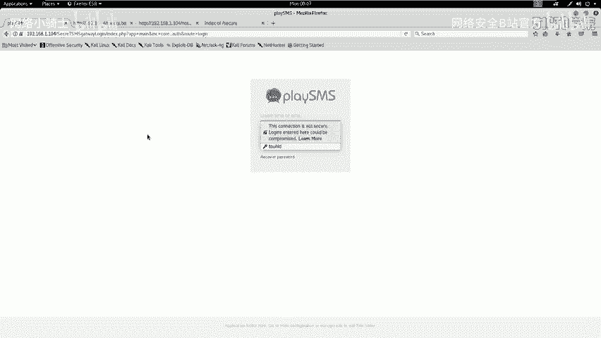
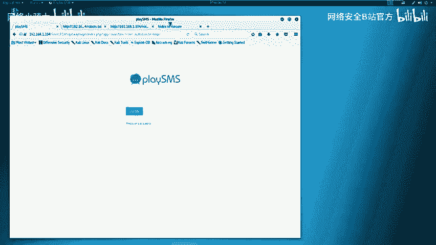
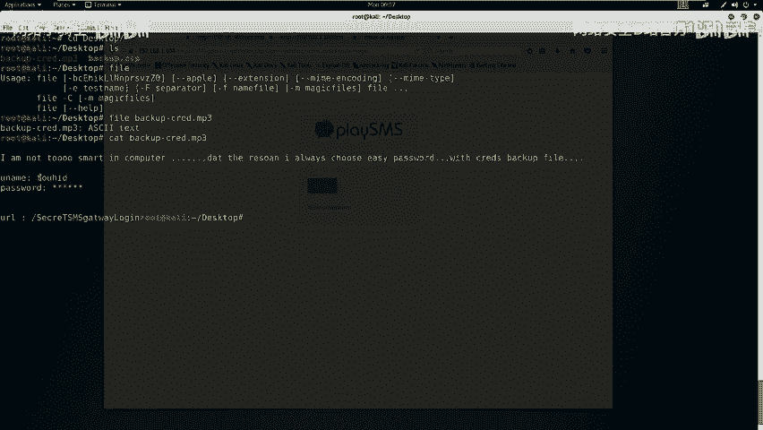
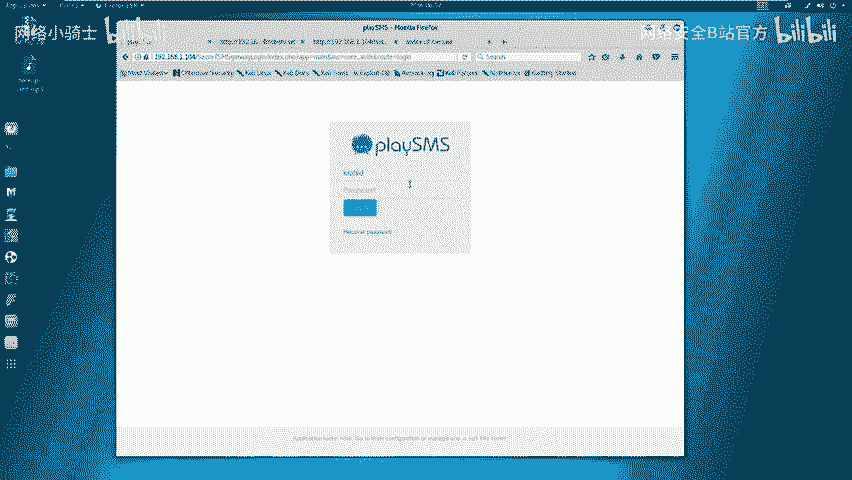
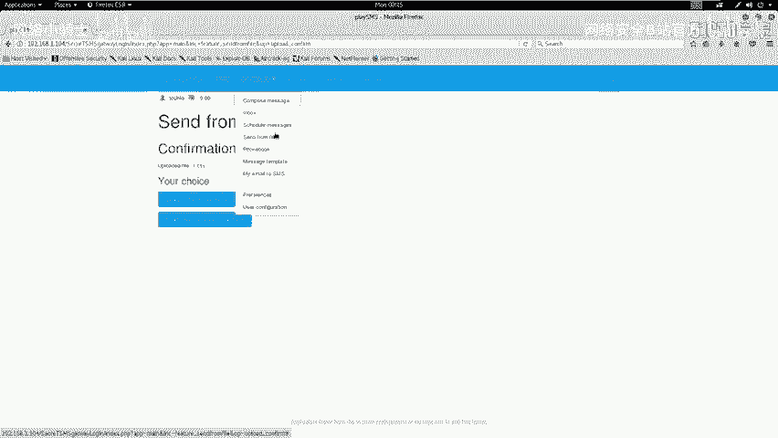
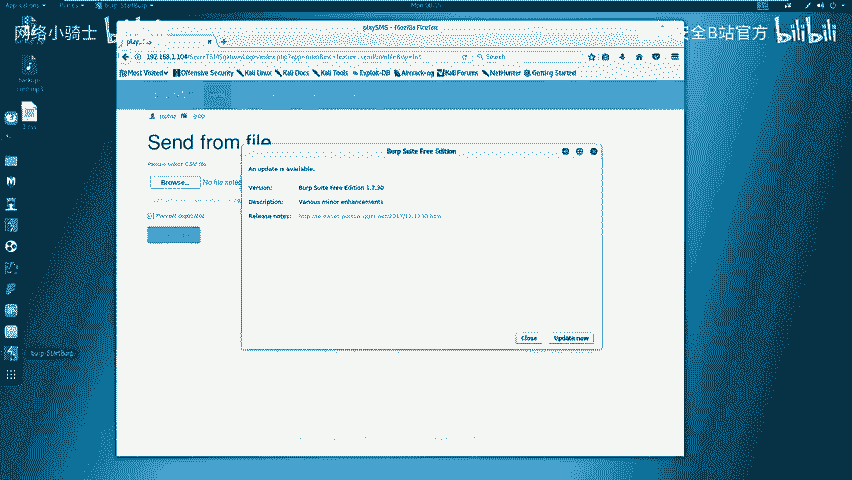
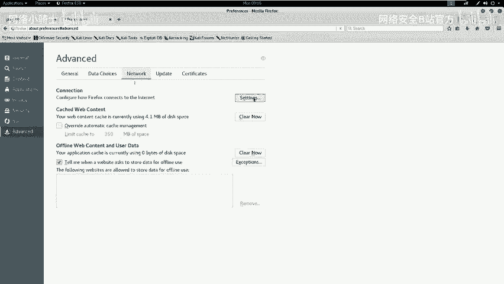
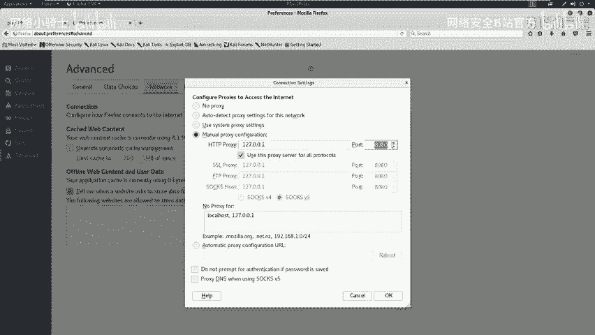
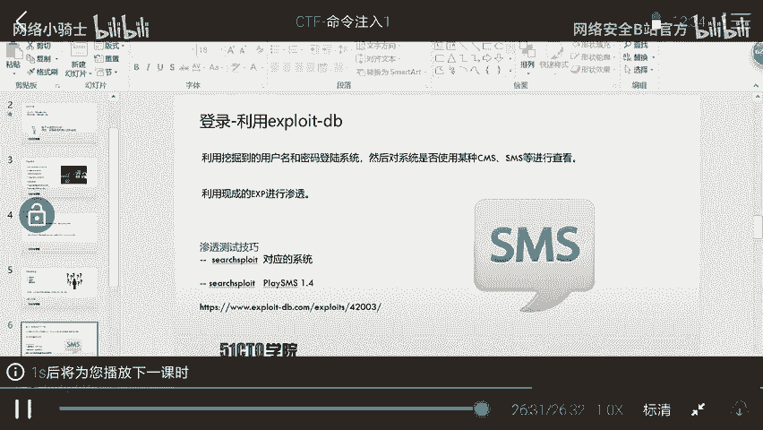
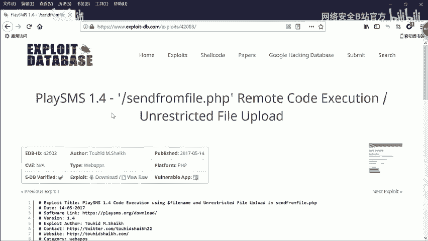

# CTF最强战队蓝莲花内部培训教程｜上千小时教程还怕学不会？ - P23：24.命令注入 - 网络安全B站官方 - BV11M4y1J7mU

好，今天继续来学习万部安全当中的命临注入漏洞。如何通过外b引程序哎从外部。来运行。主机的是要命令，最终获得主机的访问权限，提升root权限，取得对应的flag值。下面哎咱们介绍一下今天的实验环境。

公积机是卡利linux，它的IP地址是192。168点。1。1。106靶场机器打P地址是192。168。1。104。那么咱们拿到这样一个实验，哎，该做什么呢？在CTF比赛当中，大家一定要注意，哎。

咱们主要的目的是要获取靶场机器上的flanang值。并且咱们在整个过程当中一直以这样。一个目标哎为这个指向，让咱们所有的操作都是要来获取flag值以及root靶场机器。下面咱们进行第一步。

也就是在外围哎，然后对靶场机器进行信息探测。首先咱们使用M map来扫描一下靶场机器的服务信息以及服务的版本。使用M map哎，然后杠小S大V加上靶场IP地址。点168。1。104回车。

这时候咱们map开始对靶场机器进行一定的扫描。在过程当中，哎，他会发量发送大量数据包给靶场机器，靶场机器会返回对应的响应。哎，之后根据响应。返回对应的结果。咱们除了可以扫描版本信息之外。

还可以使用N map。杠T杠A杠V，然后把成IP地址来扫描主机的全部信息。A map杠。A杠V杠T4。可能之前哎我们课程当中哎扫描全部信息，直接使用杠A，然后加上杠V之后加上靶场的。IP地址。

并没有加咱们今天这个参数杠T4杠T4哎，是这样一个含义。咱们之前哎不加杠T4，它的扫描速度是比较缓慢的。如果咱们加了杠T4，哎，表示N map以最大的哎这个效率来发送数据包给对应的靶场IP地址。

那么咱们扫描的结果哎也是最快出现的。下面咱们尝试一下。这时候哎咱们会看到很快哎就出现了很多信息。并且哎咱们这个一直在扫描，哎，速度是非常快，哎，这里哎就出现了对应的结果。

咱们再探测完这个主机的啊一些信息之后，还可以探测一下，哎，咱们如果开放了哎HTTP服务，就可以使用n two和DRIB来扫描一下哎这个靶场的。HTTP服务开放的目录信息。下面哎咱们尝试一下。

首先使用n克 to。杠ho，然后HTTP。192。168。1。104回撤。这时候咱们尼克wo哎开始对靶场的机器哎发送数据包，然后接受对应的响应，然后分析出对应的这个扫描结果。咱们在这里可以看到哎。

他发现了很多这个目录，哎，发现了呃这样一个目录，又发现了upload这样一个目录，并且他发现了robots点TST。呃，并且包含5个入口哎。咱们可以看到是哪5个入口。呃，这里有sute temp哎。

这些一些目录。哎，咱们这个扫描器哎还是比较哎强大的，它可以扫描出哎很多这个服务器上的文件信息，并且哎又给了咱们一些注释信息。哎，咱们可以看到tamp哎，然后后面给注释信息是什么？

这个有可能哎是比较有趣的一个这样一个目录，哎，可能会有一些敏感的信息在里边。呃，并且啊他给我们扫描到哎可以使用的HTTP啊的一些哎使用方法。比如说咱们这个服务器是支持get方法。

hand方法以及post以及options。这些HTTP头。哎，咱们这时候哎已经扫完了，并且里边出现了对应的信息。咱们除了可以使用那个图来扫描哎这个靶场的。文件信息也可以使用DRIB哎。

来扫描一下它的目录信息。192。168。1。104回撤。这时候哎咱们这个DRIB开始扫描靶场的。目录信息以及他的文件信息。咱们在这里啊已经可以看到它扫出了啊一些目录。那咱们想想他在这里少。

咱们回到哎课程当中。咱们探测完这些信息之后，哎，最主要的目的是要从这些信息当中挖掘一些有用的信息，来帮助咱们渗透靶场机器。接下来哎咱们就需要对咱们扫描结果哎进行对应的分析，挖掘出哎咱们可以利用的信息。

比如说哎咱们如果开放了HTTTP服务，咱们就可以使用浏览器。哎，加上对应的端口来访问一下敏感的页面。哎，最终查看这个敏感的信息。咱们再回到机器当中，哎，这里哎咱们DRIB已经扫描完了这个靶场的一些目录。

咱们可以看到，哎，这里有一个默认的这个base的haist ray这样一个目录，也就是呃sha命令的这样历史系的一个目录。哎，咱们往下看往下看，呃，咱们先打开一个哎主页看主页究竟是什么信息。呃。

咱们在这里啊，因为。呃。看到哎他是返回了这样一个结果，哎，是他的主页。咱们再看一下哎，它的robots点TST哎，这是一个比较敏感的信息。咱们会看到哎它这里哎镜子我们爬这些目录。哎。

所以说哎我们就需要对它哎依次访问。来获取一下哎，是否有咱们可以利用的一些信息。啊，这里。哎，哦，这里是因为我设置了这个代理，哎，咱们需要关掉。我把代理关掉。

是在adance network setting。然后咱们no。O。然后关闭。哎，这里并没有咱们想要的信息。呃，咱们再打开robots。呃，咱们再打开一个页面。192。168。1。104。呃。

怎么打开这样一个页面？咱们下面哎访问一下这个目录。可以看到也没有咱们想要的信息，哎，咱们继续返回。接下来有个nocing啊，这里可能没有任何东西，咱们看看是否真的没有任何东西呢？回车哎。

这时候我们会发现它是一个not find go back，仿佛是哎咱们之前见过的这种404哎的一个效果。看它的页面也是404，咱们下面看一下真正的404是不是和它长得一样呀。哎，咱们下面随便翻一个。

会发现哎也是404n five。并且它俩这个页面还是有所不同的。咱们因为在这里随机访问一个页面，服务器肯定是不存在的，那么就会返回404。咱们这里哎它存在，但是它返回的结果跟咱们是不相同的。

那么咱们这时候哎就需要根据CTF常用的思路，就是要查看一下对应的源代码。右键鼠标，哎，这里有一个ve pay source，哎，查看一下。查看的时候，哎，对于HTML代码一定要注意它的注释。

这里咱们会看到呃my secret pass哎就是我的一些密码。哎，可以看到freedom，然后passwordhel word感叹号dI love root会发现这些信息有可能会是咱们后期需要使用到的哎一些信息。

比如说咱们后期哎的一些密码，哎，有可能在这里。咱们把这个页面关掉，哎，把这个也关掉。这时候哎咱们已经访问完nose，哎，再访问tamp。哎，他也没有任何信息。哎，咱们继续访问一下uploads。回撤哎。

他也没有任何信息，这时候哎，咱们已经把robots哎这样一些信息都挖掘到了。发现n子下面哎存在着咱们想要的一些密码。哎，这里咱们就挖掘到位。看到这里，哎，咱们再回到哎它的主页当中。

主页当中哎并没有哎咱们任何详要的信息。这时候哎咱们再回到之前的一些扫描结果，咱们依次向下看会发现哎发现了一个哎这样的一个目录。并且啊这个目录是sercle，哎，它是安全的意思。啊，咱们右键打开一下。

看它目录有什么信息。咱们打开之后，哎，发现了一个。back up点ZAPback up啊代表备份的意思啊，它可能是这个网站源代码的备份文件。那么这时候咱们点击哎对它进行下载。咱们把它保存OK。

这时候哎保存下来。呃，咱们点开这里。将它复制到桌面。Mu。呃。Cut。Xong cut。把它剪切到桌面。右键哎pas这时候哎咱们桌面就出现了这样一个文件。那么咱们这时候哎双击将它打开。

它这里啊有一个类似于MP3的这样一个文件格式，咱把它复制出来。在复制出来的时候，我们忽然发现它是需要密码的。那么咱们这时候哎就会想到，在之前哎咱们在robots里面。

robots的nocy里面有这些密码。那么咱们这时候啊就尝试一下frto。以及哎这个其他密码，咱们就开始尝试是否能解压这个文件。pasteO哎，这时候我们看到在桌面上就解压出来这样一个文件。

那么咱们这时候。在CTF当中，咱们看到点MP3文件。一定要注意它不一定就是MP3文件。咱们需要判别一下它是否是MP3文件。这时候哎咱们切换到桌面。会发现哎桌面由咱们解压出来的MP3文件。

那么咱们这时候使用另外一个命令fill。来查看一下这个文件的具体文件类型。Feill back up。杠creditM3。在咱们查看的时候会发现。

这个MP3文件哎是1个ask2test文件是一个文本文件。对于文本文件，咱们可以直接使用cat来对它进行查看。杠credit的MP3回撤。咱们在查看的时候，哎会发现。哎。

我不是一个简单的这些一些提示信息，哎，经常哎使用一个非常简单的一个密码。哎V资。呃，来对这个个。备份文件来加密。咱们看到这里有个user nametouch ID。以及有password，这里有个新号。

哎，咱们这时候就会想到，咱们之前虽然发现了哎5个密码，但咱们只使用的一个密码，并且这些密码都有可能是咱们这里替换的password。那么咱们这时候又在下面看到了URL哎，会想到它是一个网址。

那么咱们这时候就把这个网址复制出来。粘贴到哎咱们这个。浏览器当中。回撤。哎，咱们发现这里有个登录的界面，登录的界面。

咱们刚才已经有了对应的用户名和密码。

呃，他ID哎是咱们对应的用户名，哎，咱们给它复制出来。

复制出来之后，啊，咱们把它粘贴到哎Uilname这里。Paste。咱们的password哎在之前。之前的这个n里面是有password那咱们把这个password依次来尝试一下，看是否能够登录这个系统。

点击登录。update哎，它并不是哎咱们真正的密码，咱们再尝试下一个密码。

呃，password。复制出来，然后在这里。粘贴进去。哎，忽然发现哎，它也不是咱们想的密码，咱们继续来尝试。Hello， what copypy。loginupdate哎。

咱们发现它也不是咱们想要的密码。那么咱们这时候哎再尝试一下d脑这样一个密码。哎，那么咱们这时候哎已经登录到了后台页面当中。咱们发现哎，通过刚才哎对这个收集到的信息哎进行深入探测，哎，挖掘。

哎逐步哎跟着线索走，哎，最终进入了咱们想要的页面。其实哎咱们在CTF当中，一定要注意任何可利用的信息。比如说咱们查找到的任何一个文件，任何一个目录，它里边都是有可能隐藏有价值的信息。

所以说在参加CTF比赛当中，脑洞一定要要大。这时候哎咱们已经登录了这样一个系统。对于登录这个系统之后，哎，我们首先要看是否有值得利用的地方。

这时候哎咱们一般情况下的思路是一定要看这个系统是不是已知的某些这个系统。在网上可以查找到它对应的漏洞，并且对它进行利用。利用现成的这个E叉P来对它进行渗透。这里哎给大家介绍一个工具，searchsp。

然后查找哎对应的系统。比如说咱们今天这这个系统是play SMS，那么咱们就使用。s，然后来查找一下哎这个系统是否有对应的漏洞search。spot，然后是play。LAYSMS回撤。

这时候哎咱们在查找之后，哎，发现它出现了这样一些结果。哎，并且哎有对应的文档。那么咱们这时候来查看一下。呃，play SMS哎这样一个最新的啊这样一个漏洞。cat，然后usershaex DB。

然后platform。4，然后是PHP，然后是webAPP4。420。Ling。3。TSG。呃，很多同学哎会说我这个路径是怎么找到的呢？咱们在查找的时候会有一个基路径。也就是咱们最基本的路径之后，哎。

咱们根据每个漏洞给它分门别类，哎，跨在不同的目录下，最终有一个对应的文本文件。咱们看了一下。会发现哎这里出现了哎很多哎这个。咱们向下啊，这个划的比较上。会发现哎这里有它的验证哎这个代码。

以及他的这个漏洞描述。以及他漏洞的时间是17年5月份14日。好，哎出现的这样一个漏洞。呃，并且这里有它的描述，哎，是一个不严格的文件上传。任何哎注册的用户可以上传任意文件。

因为哎并没有合适的这个验证文件。在这个sd from file PHP哎这个文件当中，也就是说咱们可以哎上传任意文件。呃，咱们这里哎代码执行哎使用到了这个fiil name这样一个变量。

当我们知道哎这个文件啊，这PHP文件接受任何扩展名。并且哎只读文件内容，哎，不存储到这个服务器当时。呃，但是这里的这个漏洞，当用户上传哎这个案例，比如说哎这个我的后门这个文件。服务器哎非常快的接受了。

但是并没有存储到服务器的任何这个文件夹当中。所以我们的这个web shell啊并不能有生效。但是如果用户哎改变了这个文件的名字，哎，从这个呃。

这个my back door PhHP哎变成了这样一个文件内容。文件名，那么这个服务器哎就会执行这样一段代码，那么就造成了哎这个。呃，这个代码执行。对于更多的这个。细节啊，大家可以就是看这个博客。

下面呢哎咱们就根据。哎，他的提示。来尝试一下是否能够哎像他这样说的来执行一下对应的代码。那么咱们这时候哎会发现它下面有1个POC，也就是验证事应代码。咱们首先啊要给他访问。加上他的地址。然后是在这里。

给他右键。复制。这时候哎咱们回到对应的页面。然后再。indice然后。他赵伟。回车。哎，并没有找到。呃，咱们这样这样找。也没有找到。那么咱们这时候哎就在它页面当中，哎给它挖掘一下是否能手动点击到。嗯。

在。这里。哎，咱们这时候会发现。呃，咱们找到了哎这样一个目录。在这里应该是sd from file。会发现哎这样一个目录可以上传对应的文件，也就是sided from fire。

也就是咱们想要找的这个漏洞的位置。那么咱们这时候给它上传一个任意文件。呃，首先呢咱们这个提示呃说要上传1个CSV，那么就咱们在桌面上新建1个CSV。嗯，用touch1点CSV回撤。

这时候哎咱们在桌面新建了这样一个文件。接下来呢哎咱们就把。这样一个文件给它上传上去，点击。这时候哎咱们在这里会发现已经上传了这个文件名。哎，咱们把文件名显示出来了。

那么咱们这时候哎需要给它修改咱们上传的这个文件名，就需要使用到另外一个工具叫做。Bob stripped。那么咱们哎在这里打开botri回车。打开这个web应用的一个神器。

方啊啊，先回到这里。

close需要更新。Next。Start up。呃，给它启动哎这样一个程序。呃，咱们首先要设置哎代理。在浏览器当中。在选项当中。在这个。高级当中选择network有个setting。

然后选择呃这样1个HTTP代理端口是8080O。

然后关闭。这时候咱们选择对应的这个文件。点击upload这时候哎咱们在b sotri。里边哎就出现了对应的数据包forward。这时候哎，这是咱们上传的一个数据包。咱们把这个数据包按action。

发送到啊这个repeat这个模块，对它进行修改。咱们根据提示，哎，需要在fill name当中哎添加。呃，咱们需要执行的代码。调PHP哎添加这样的代码。接下来哎使用system。带。呃。

接下来哎执行咱们想要执行的代码。咱们案例当中提醒执行了you name。杠A哎，咱们来回到这个终端命令，来看一下是否是这样一个命令。嗯。嗯，在这里哎你看把fi name给它修改成哎，修改成这个。

PHP哎，这样一个。文件哎，咱们刚才把这个一点CSV修改成这样一段代码。咱们下面哎来执行一下哎这段代码。systm done，然后可以，然后点击go。这时候给咱们返回了200。对于这里哎。

咱们点击read来查看一下它返回页面的具体效果。咱们可以看到哎，它在下面给咱们输出了哎you name杠A的一些信息。比如说这里是。呃，linux操作系统哎，的主机名data哎，以及它的乌班图。

以及它的这个CPU信息，以及UTC时间信息。哎，这样一些信息可以看到，哎，咱们这个命令已经执行了。那么咱们下面哎继续来执行一下是否可以执行。ID这样一条命令。

很多同学哎在使用的时候会直接哎使用ID这时候它会出现一个重定向。这里给大家强调一点，就是这个哎系统在我们执行过一次命令之后，哎，就需要重新给它抓包啊，来执行对应的命令。咱们来重新来实验。可以看到哎。

这里有一些这个错误信息。呃，咱们继续上传1点CSV。然后切换到。呃，都是dpt啊，来打开对应的阶段。A lot。这时候哎咱们forward这是。咱们这个上传文件的HTTP报文sdrepeater哎。

咱们发送到repeat当中，会发现fill name哎又11点CSV。哎，这时候哎咱们执行一下ID命令，查看对应的权限。嗯，点PHP。System。Dai。接下来输入咱们想要执行的ID。呃，点击购。

咱们点击归档。会发现哎在这里会给咱们输出哎，咱们ID名哎，以及GID哎用户组了这些信息。从这一点，咱们也会发现，哎这个fi name是存在代码执行，以及咱们代码注入的。哎。

可以把咱们自己的代码注入到哎这个对应的PHP文件，哎，并把它执行出来。哎，咱们这节课哎先到这里，下节课咱们讲解如何使用哎这个漏洞来远程哎。执行是要哎，让服务器呃成功的被我们拿到。

对应的网站来进行搜索。下面哎我们看一下哎，我们在网站当中搜索到的内容。🎼链接之付。

🎼想干子。🎼之前的语。🎼这些内容呢。