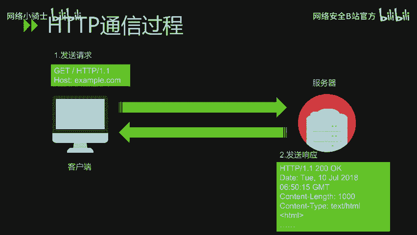
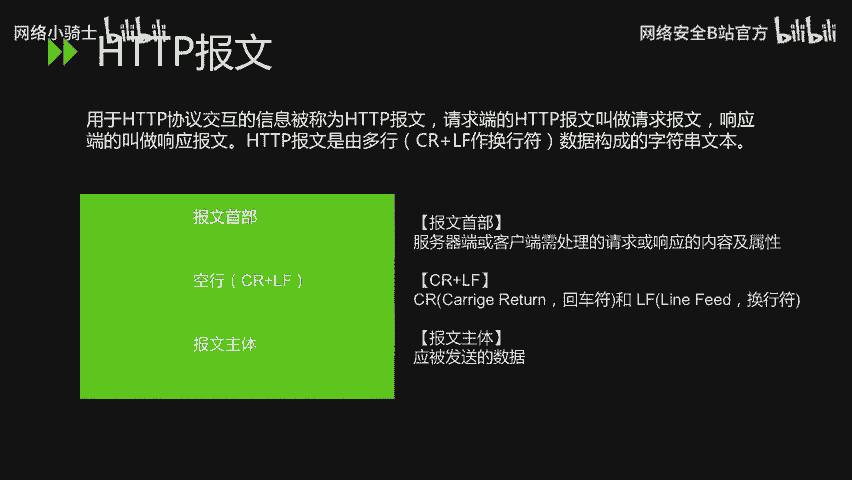
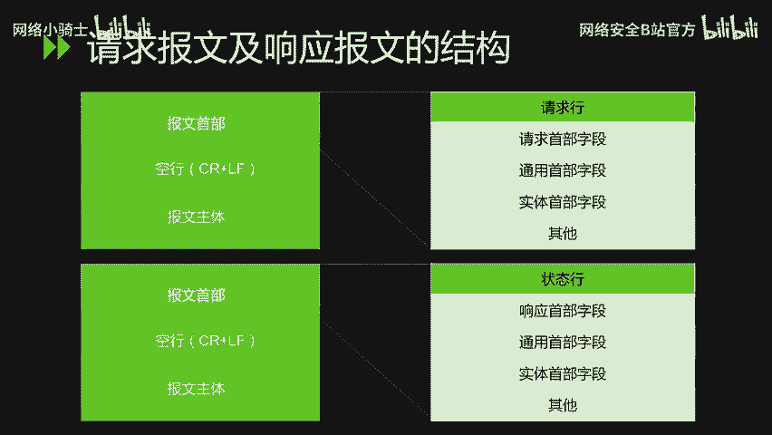

# CTF最强战队蓝莲花内部培训教程｜上千小时教程还怕学不会？ - P29：30.第二节：HTTP协议分析 - 网络安全B站官方 - BV11M4y1J7mU

大家好，本节课内容是HDP协议分析上。

主要讲解HDP的发展史以及协议结构。首先看一下HDP的发展史。HDP是草文本传输协议，目前是互联网上应用最为广泛的一种网络协议，所有的3W文件都必须遵守这个标准。

设计ATTP最初的目的是为了提供一种发布和接收HTL页面的方法。HDP协议和TCPIP协议组内的其他众多协议相同，用于客户端和服务端之间的通信。外部是建立在SB协议上进行通信的。1989年的时候。

HDP便诞生，最初的设想呢是借助多文档之间相互关联形成的超文本连接可相互参与的万维网。在1990年的时候，HDP0。9版本问世。在96年96年5月，HDP政式作文标准被公布，当时是HDP1。0版本。

直到1997年1月公布的HDP1。1是目前主流的HDDP协议版本。接下来具体看一下ADP的协议结构。首先我们看一组SDP的通讯过程。首先是客户端主动向服务端发起请求。服务端在接收到客户端发来的请求之后。

会做出一定的响应。HTP协议规定，先从客户端开始建立通信，服务端在没有接收到请求之前，不会发送响应。

那么在HDP通信过程中，我们来了解一个词叫HDP报文。什么是HDP报文？那么HDD标报文是用于HDDP协议交互的信息。请求端的HDP保温叫请求保温，相应端的叫做相应保温。

HTDP报文是由多行数据构成的字符串文本，多行之间使用CRLF作为换行符。HDB豹纹大致可分为豹纹手部和豹纹主体2块。豹纹首部是服务器端或客户端需处理的请求或响应的内容及属性。

空行是CFCR是会车户LF是环行符。报文主体是应被发送的数据。接下来我们看一下HDP请求报纹与响应报文的结构。

在请求报文中，报文的首部主要包含请求行、请求首部字段、通用首部字段、实体首部字段以及其他内容。在响应豹纹中，豹纹手部主要是由状态行、响应手部字段、通用手部字段以及实体首部字段其他等内容。

在请求报文中，主要是由请求方法、请求UII协议版本。以及可选的请求首部字段。内容实体组成。其中方法是主要是有包含以下几种get post put headdete options以及tice。

ge的方法是指请求访问已被URI识别的资源。pos的方法用于传输实体的主题。put的方法用于传输文件，ha的方法和get的方法一样，只是不返回报文主体部分。用于确认UII的有效性及资源更新的日期时间等。

这里的方法是删除文件。optionions方法用于查询针对请求URI指定的资源支持的方法。揣的方法是让外部服务器端将之前的请求通信还回给客户端。SDP方法它是下达命令的，用于高速服务器端。

该如何处理请求？虽然用改的方法也可以传输实体的。主体但一般不用盖的方法进行传输啊，通常还是使用pos的方法进行传输。接下来看一下SDP的响应报门。响应豹文是由协议版本状态码用于解释状态码的原因短语。

可选到响应首部字段以及实体主体构成。其中状态码表示请求成功或失败的数字代码。我们具体看一下状态码，主要是有这5种状态码。其中，以数字一开头的状态码代表信息性状态码接收的请求正在处理。

数字二开头的状态码表示成功状态码。表明请求正常处理完毕。数字三开头的状态码是重定项状态码，需要进行附加操作，已完成请求。数字四开头的状态码是客户端错误状态码，服务器无法处理请求。

数字5开头的状态码是服务器作物状态码，说明服务器处理请求出错。HDP状态码负责表示客户端HDP请求的返回结果，标记服务器端的处理是否正常通知出现的错误等工作。那么我们在。

日常的日常的上网过程或工作过程中常见的状态码呢，主要是有以下几种。首先是200OK表示从客户端发来的请求在服务器端被正常处理了。301是永久性重定向。

表示请求的资源已被分配了新的URI以后应使用资源现在所指定的URI。302放的是临时性重电项，表示请求的资源已被分配了新的URI希望用户本次能使用新的URI进行访问。

304not modified使客户端发送附带条件的请求时，服务器端允许请求访问资源，但未满足条件的情况。304状态码返回时不包含任何响应的主体部分。

那么这里的附带条件的请求是指采用get方法的请求报文中包含if match if modified since等条件。关于这一部分，在接下来的课程里面会详细的进行讲解。400ba request表示。

请求报文中存在语法错误。当错误发生时，需修改请求的内容后，再次发送请求。401unauthorized该状态码表示，发送的请求需要有通过HDP认证，如aba认证，digit认证。

的认证信息若之前已进行过一次请求，则表示用户认证失败。4林仔河北哒。表明对请求资源的访问被服务器拒绝了。404not found表明服务器上无法找到请求的资源。

500internal serverin表明服务端在执行请求时发生了错误，也有可能是外部应用存在的bug或某些临时性的故障。

503service unavailable表明服务器暂时处于超负载或正在进行停机维护，现在无法处理请求。那么最后我们来看一下HDP它是一种无状态协议。无状态协议是什么意思呢？

HDP协议自身不对请求和响应之间的通讯状态进行保存。也就是说，协议对于发送的请求或响应都不做持久化的处理。这是为了更快的处理大量事物，确保协议的可伸缩性。但是，随着外部的不断发展。

因无状态而导致业务处理变得棘手的情况越来越多。为了实现。保存状态的功能引入了cookie技术。那么有了cookie技术，再用HDB协议通道便可以管理状态。关于cookie技术的讲解。

在下一堂课会进行详细描述。那么本节课程就到这里。

