# CTF最强战队蓝莲花内部培训教程｜上千小时教程还怕学不会？ - P30：31.HTTP协议分析 - 网络安全B站官方 - BV11M4y1J7mU

大家好，本节课程是HDB协议分析下。

主要有HDP首部字段。题目讲解两部分组成。HDDP首部字段是构成HDP报文的要素之一。在客户端与服务器之间以HDP协议进行通信的过程中，无论是请求还是响应，都会使用首部字段。

它能起到传递额外重要信息的作用。使用手部字段是为了给浏览器和服务器提供包容主体大小所使用的语言、认证信息等内容。HTB首部字段是由首部字段名和字段值构成的，中间有冒号分隔。

单个HDDP首部字段可以有多个值。HDB首部字段有4种类型。通用首部字段请求首部字段、响应首部字段以及实体首部字段。通用手部字段是请求豹纹和响应豹纹两方都会使用的手部。

请求首部字段是从客户端向服务器端发送请求报文时使用的首部，补充了请求的附加内容，附加客户端信息、响应内容及相关优先级等信息。响应首部字端是从服务器端向客户端返回响应报容时使用的首部。

补充了响应的附加内容，也会要求客户端附加额外的内容信息。实体首部字段是针对请求报文和响应报文的实体部分使用的首部，补充了资源内容更新时间等与实体有关的信息。下面对这四种类型进行详细分析。

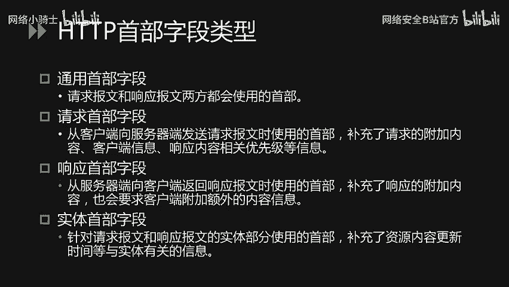

通用手部字段是指请求豹纹和响要豹纹，双方都会使用的手部，其中常见的手部字段有cat controlconction。Date and wire。

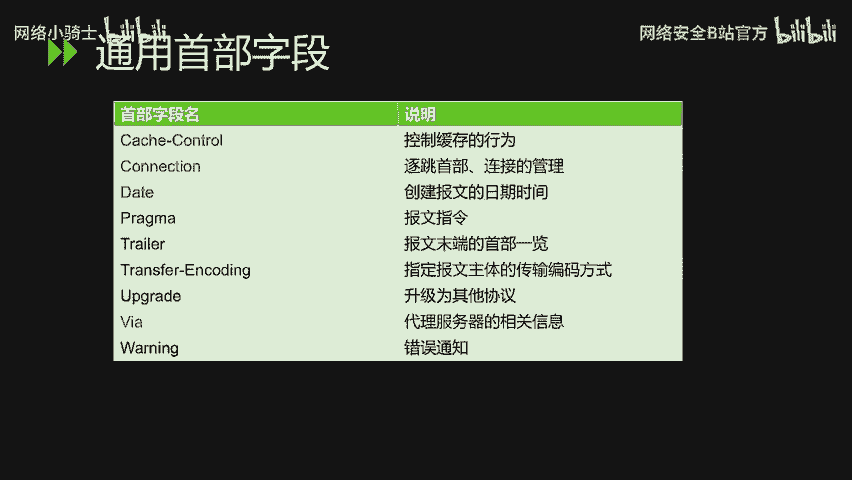

通过指定手部子弹cach controll的指令，就能操作缓存到工作机制。connection首部字段具备两个作用，第一是控制不再转化给代理的首部字段，第二是管理持久连接。

date表明创建HDP报文的日期和时间。使用手部字段wi是为了追踪客户端与服务器之间的请求和响应报文的传输路径。报文经过代理或网关时，会先在首部字段vi中附加该服务器的信息，然后再进行转发。

首部字段wi不仅用于追踪报文的转发，还可避免请求回还的发生。所以必须在经过代理时附加该首部字段的内容。

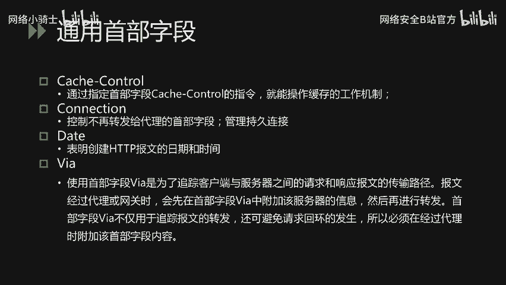

第二类，请求首部字段常见的有accept。Accept the language。Authorization。Host， referral。

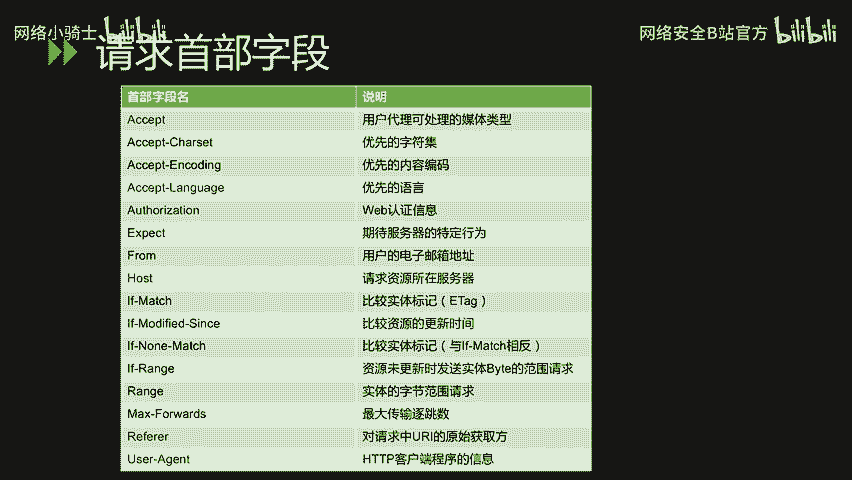

和us的agent这几个字段。acccept首部字端可通知服务器，用户代理能够处理的媒体类型及媒体类型的相对优先级。可使用type、斜杠、subtype这种形式，一次指定多种媒体类型。

如我们文件使用TXT斜杠Htl等格式。图片文件如imageage斜杠GPD。或Aage线杠JF等。应用程序使用二进制文件。如application斜杠OCTTstream等格式。当服务器提供多种内容时。

将会首先返回权重值最高的媒体类型。acccept language字段用来告知服务器用户代理能够处理的自然语言级以及自然语言级的相对优先级。可一次指定多种自带域间级，按权重值Q来表示相对优先级。

客户端在服务器有中文版资源的情况下会要求。其返回中文版对应的响应，没有中文版时，则请求返回英文版响应。手不知弹au热审用来告知服务器用户代理的认证信息。

authorization字段的值的内容如basic认证是。一段贝64编码的值。通常，想要通过服务器认证的用户代理，会在接收到返回的401状态码响应后，把首部字段authorization加入请求中。

首部字段host会告知服务器请求的资源所取的互联网主机名和端口号。hot的首部字段在HDP1。1规范内是唯一一个必须被包含在牵牛内的首部字段。相同的IB地址下，部署运行的多个域名。

那么服务器就会无法理解究竟是哪个域名对应的请求。因此需要使用首部字段host来明确指出请求的主机名。首部字段refer会告知服务器请求到原始资源的URI。客户端一般都会发送refer首部字段给服务器。

但当直接在浏览器的地址栏输入UII或出于安全性的考虑时，也可以不发送该首部字段。因为原始资源的URI中可能会含有token、密码等保密信息。若写进rele转发给其他服务器，可能导致信息泄露。

首部字段user agent会将创建请求的浏览器和用户代理名称等信息传达给服务器。

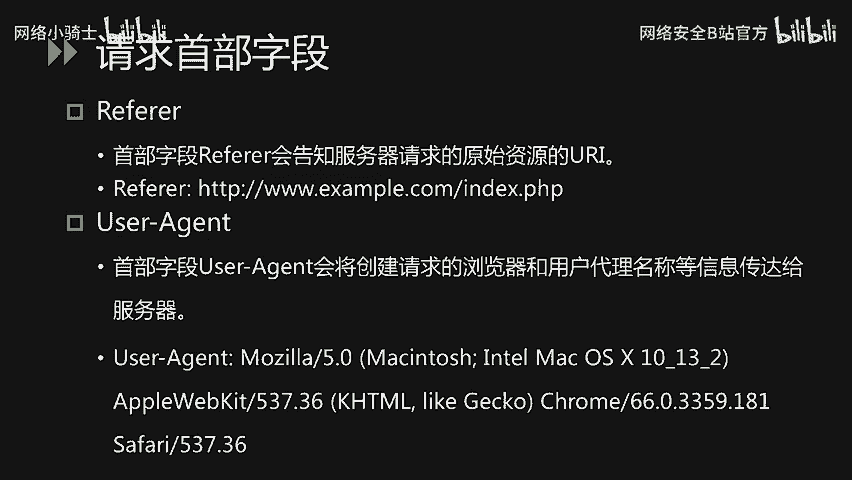

相应首不字段，常见的有location和serv。

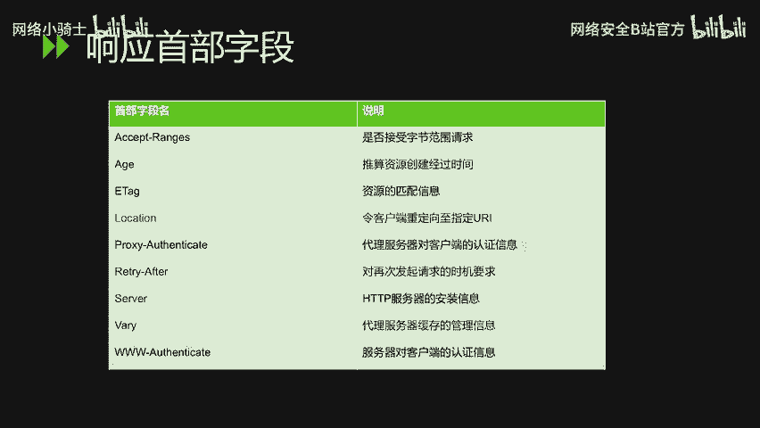

使用手部字段location，可以将响应接收方引导至某个与请求URI位置不同的资源。基本上该字段会配合重定向响应，提供重定向的URI。

首购自段servver告知客户端当前服务器上安装了HDP服务器应用程序的信息。基本上盖子端。不但会注明服务器上的软件应用名称，还可能包括版本号等信息。

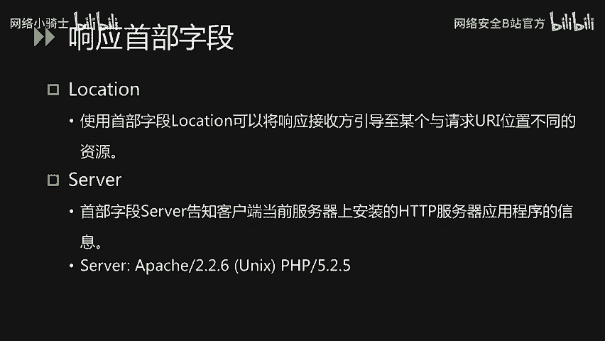

实体受不自短。常见的字段名有alloconence以及con type。

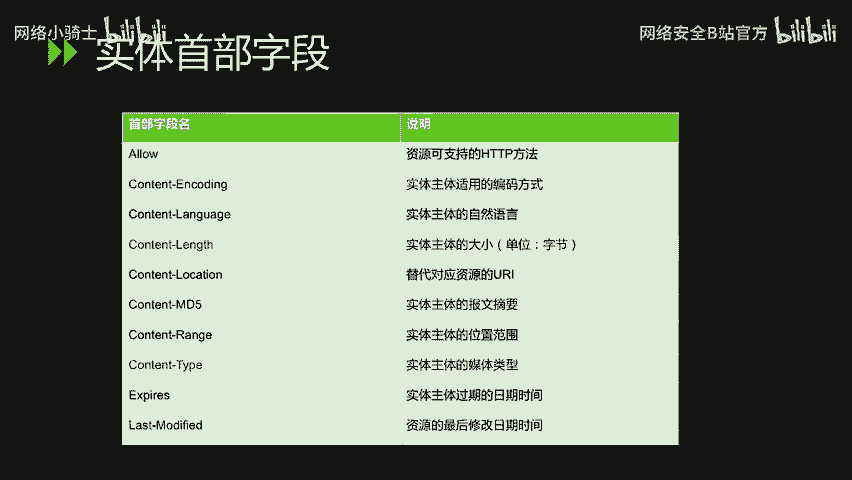

allowve字段通知客户端能够支持的所有HDP方法。服务器会把所有能支持的HDP方法写入首部字段alve后返回。当服务器接收到不支持的HDP方法时。

会议状态码405menot allowed作为响应返回。肯定的 lens子字段指明实体主体部分的大小，单位是字节。肯定的 type。字段代表实体主体内对象的媒体类型。

字段只用typepe斜杠subtype形式复制。下面我们通过几组题目的讲解来了解一下CT中对ACDB协议分析的考察。常见的考察的知识点呢主要是有以下几。

主要是有以下几种metd use agent location refer叉FFaccept language，cookie以及自定义首部字段。对于买色者的考察，主要是下面这个场景。

如钙的请求被过滤器或刮釜拦截。我们可以通过转换成pos的请求的方式呢绕过检测。在bsuit当中，我们也可以通过右键选择chanend request method来一键切换get和post的方法。

下面看对于us agent的考核。题目描述是，据说信息安全小组最近出了一款新的浏览器，叫哈哈浏览器。有些题目必须通过哈哈浏览器才能答对。小明同学坚决不要装哈哈浏览器，怕有后门。那么。

小明同学应该怎么样去做得到题目呢？首先，这道题目打开之后，页面显示只允许使用哈哈浏览器，请下载哈哈浏览器访问。那么我们通过bsuit拦截请求包，可以看到U agent的内容。

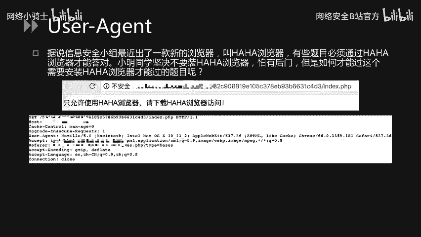

我们将Uer agent改成哈哈，那么即可得到K。我们再看对于 location性的考核。这道题目打开之后是有一个超链接，显示到这里找K。那么点击该超链接之后。

页面跳转到index no k点PP的这个文件，页面显示K is not here。那么。对于这道题目，我们在点击超链接的时候，使用bsuit进行拦截。

可以看到返回包是1个302的一个响应包，在实体在实体内容中隐含了一个K的一个链接。那么通过访问K的这个文件，那么即可获得即可获取到K的内容。

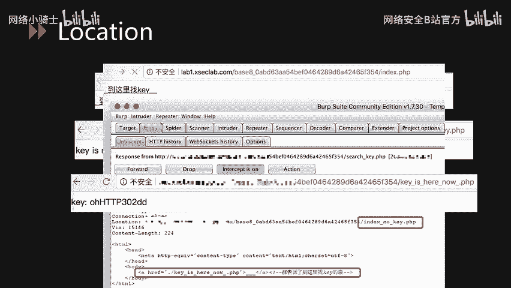

对于rafer的考核，主要是。需要我们将refer的值改成比赛官方地址或者本地地址啊，再或者根据题目提示获取refer。

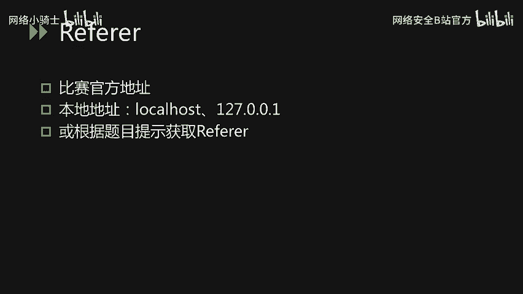

对于X forwardward的法考核呵。对ra的考核其实是比较类似的。那么我们来看对于叉F考核的这道题目。小明扫描了他心爱的小红的电脑，发现开放了1个80端口，但是这个80端口只允许本地访问。

那么小明想知道该80端口隐藏了什么秘密。那么该题目打开之后呢，页面显示必须从本地访问。那么我们通过b秀的拦截该请求。添加exed file字段，并将其复制为127。0。0。1即可。

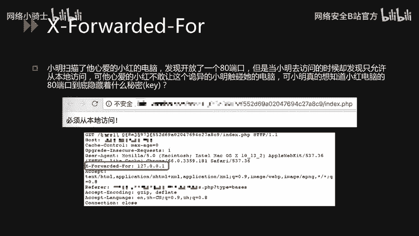

至于accept language的考核呢，题目描述一般也都相对比较明确。我们来看这道题目。小明同学今天访问了一个网站，竟然不允许中国人访问，那么小明同学想一探究竟。

那么这道题目呢打开之后显示only for foreigner。也就是说只允许外国人访问。那么我们通过b seal的拦截这个数据包，将accept language改成英文，那么即可获取到flag。

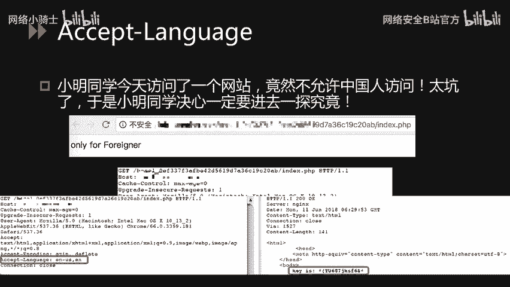

下面看对于cookie的考核，题目描述是小明来到一个网站还是想要K，但是却怎么都登录不了，你能帮他登录吗？那么。对于题目当中提到的登录，我们可能。一般都会联想到cookie。那么这道题目打开之后呢。

页面显示必须要登录才能得到K。那么在booksuit拦截数据包发现cookie的值的内容是log into于0。

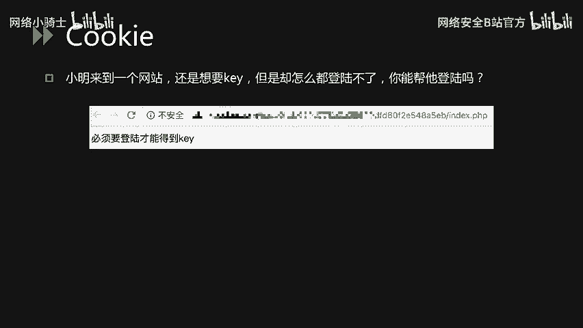

那么我们通过将login0改成login一，即可获取到K。这是通过篡改c克来伪造登录的一个过程。

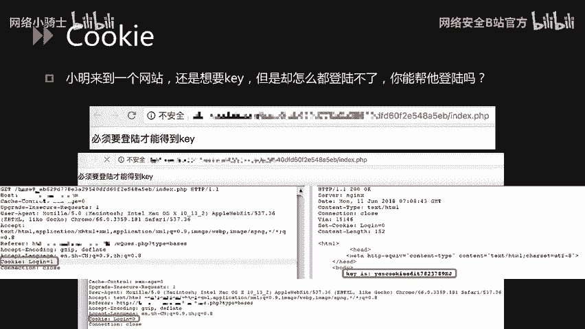

最后我们来看自定义手不字段的这类这类题目。这道题目打开之后，页面显示K就在这里猜在这里是哪里呢？其实对于题目的描述比较明确，说明K就在当前页面。那么我们通过bob suite进行拦截。在响应报文中。

我们可以看到K这个字段。那么这个字段的指道内容即是f。其中这个K这个就是嗯服务端自定义的首不字段。

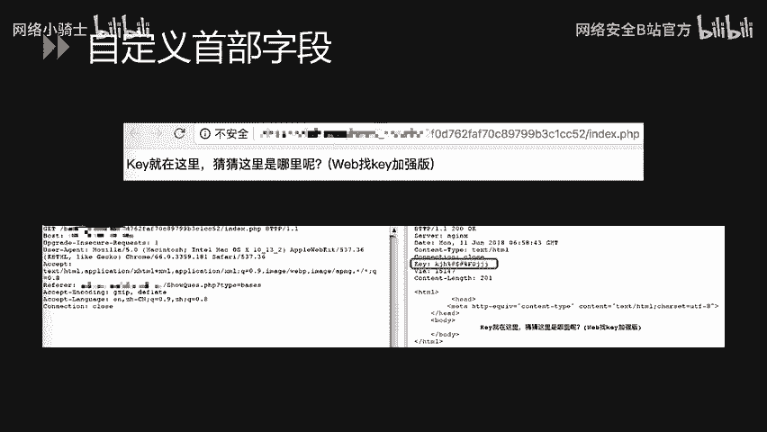

那么以上就是关于HDB协议分析下的这个内容。

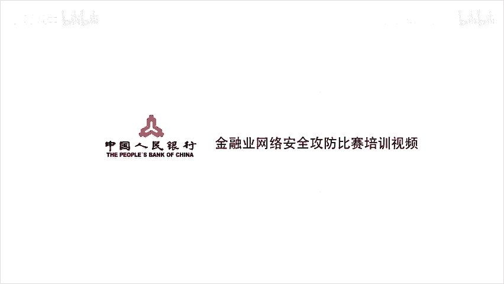