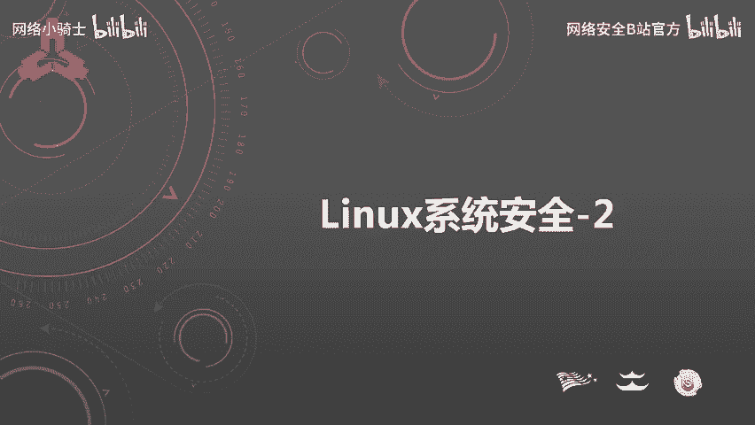
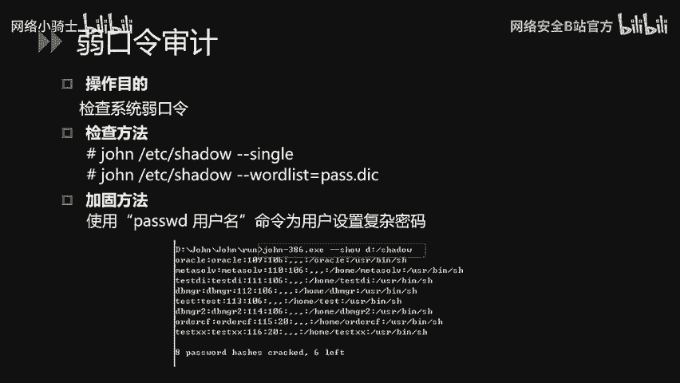
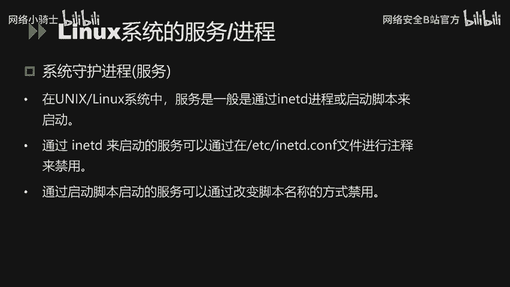
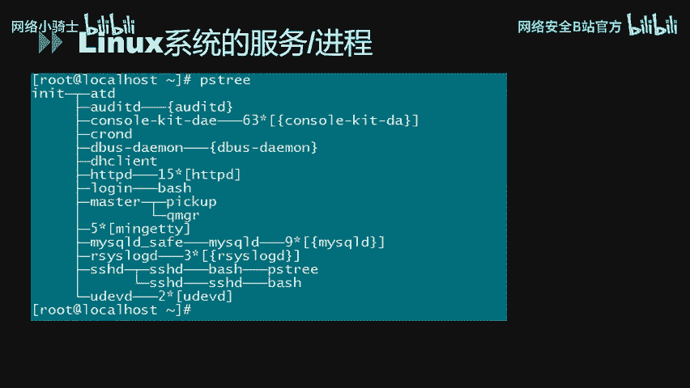
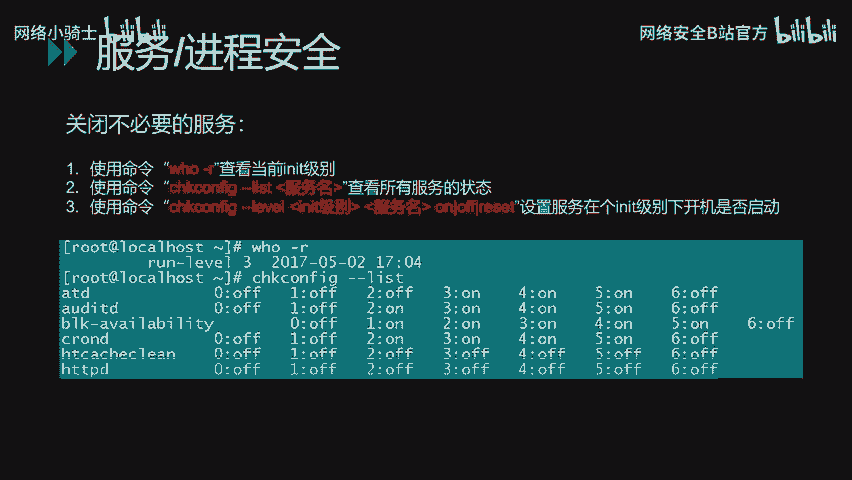

# CTF最强战队蓝莲花内部培训教程｜上千小时教程还怕学不会？ - P32：33.Linux系统安全 - 网络安全B站官方 - BV11M4y1J7mU

大家好，本课成为linux系统安全。

，本小这的内容包含商务模块，分别是linux的常规安全配置。linux的账户安全设置，linux的系统服务进程安全配置这三部分内容。首先是linux的常规安全配置。

主要是文件目录权限设置Ums值设置等内容。针对一些重要的目录和文件，我们需要合理配置目录和文件的权限，以增强其安全性。查看对应的目录或文件当前的权限指示情况，可以使用LS杠L命令来查看。对于重要的目录。

可以使用CHMOD命令来对其进行加固。比如以ETC目录为例，我们使用CHMD杠2楼750，加上绝对路径的方式，对该目录下面的所有文件权限进行设置。这样配置完成后。

就只有root可以读写和执行这个目录下载脚本。非d用户均不可以访问。开目录。通过CHMD命令可以单独对一个目录或文件进行权限设置，但是单独对每个文件或目录进行权限设置是非常繁琐的事情。

我们可以通过配置U must值的这种方式给新建的文件或目录赋予默认的权限设置。Venニ。默认U值为022。我们可以通过修改ETCprofi文件中的Uma值来增强其业安全性。例如。

这里我们修改Uma值为027，则新建的文件属组具有读写和执行权限，同组用户只有读和执行权限，其他用户如任何权限。Oh。fin系统bu默认会记录最近输入的命令，并保存在隐藏文件dotbuH的文件中。

为提高系统的安全性，避免非法用户通过查看dobuH水中的历史命令来获取系统信息和敏感数据，我们可以限制。2H0中记录的历史命令总数来避免历史命令信息泄露。

通过修改ET7pro文件中的h file size和h size的值来限制记录的命令总数。其中，H file size定义在H中保存命令的记录总数。可以理解为。buH文件中最多只有。

hi ju five size行。而h sizeize定义了h的命令输入的记录数及输出h8h文件中的最后size函。这里我们修改。HD file size和H size值为5，即保留最新执行的五权命令。

不会记录过多的历史命令。Yes。使用mini系统，我们一般是通过命令进行操作。未增加安全性，我们可以配置连接超时时间。若在超过规定时间内对应的终端没有任何操作，只自动断开连接。

默认的方法为修改ATTC or five文件中的TMUT的值。例如我们这里设置为180。默认单位为秒值3分钟内没有任何操作的话，系统会自动断开绘画连接。下面再讲一下root环境变量paash的安全设置。

root环境变量path设置。那我们在执行命令时，不用通过绝对路径的方式进行，而只需通过输入命令名名即可。但是有时候为了方便调试脚本，部分系统运维人员会将点加入到当前的paash环境中。

点代表的是当前目录，这样会导致一定的安全隐患。比方说我们在某个目录下查看文件。当前的内容时，我们会使用L命令，当恶意用户在当前目录内创建一个名为L的bu脚本时。当用户环境中带有点这个值的时候。

我们执行按S命令时会执行。当前目录下的LS89本。这样会有意想不到的效果，做脚本带有恶意行为的话，会导致一定的安全问题。因此，路ot用户环境变量pas不应当包含当前目录点。这个值。如PPT所示。

我们可以使用echo变量 patch来查看当前的值。然后我们可以通过修改。Okay。ETCpro中对应的值来加固。Yeah。常规安全设置的内容如上。

主要是文件目录权限Uma值设置历史命令记录、登录超时等这些内容。下面针对另系统的账户安全设置进行讲解。主要是账户的安全策略、口令策略、远程登录安全策略等。首先是禁用无用账号，减少系统无用账号，降低风险。

系统当前存在账号可以通过catETC password来查看。嗯。我们需要与管理员确认。哪些账号是不必要的账号？在不影响业务系统的情况下，我们可以通过pas杠L的命令来锁定不必要的账号。同时。

对于FTP等服务类型的账号，不需要登录系统的，其需要应设置为SB loging。Yeah。这里我们可以通过ca命令看到当前系统的所有账号类型。어。为防止恶意用户攻击者通过做口令爆破的方式来爆破做口令。

我们可以通过配置账号锁定策略来降低风险。配置文件为ETCPM doD systemstem杠os文件。例如，我们PT上PPT上显示的这里配置连续输错10次密码，账户锁定5分钟。则配置顶耐的值为10。

unlock time值为300，因为unlock time的默认单位是秒，所以说5分钟的话，我们就设置为300。账户锁定序列，同样需要与管理员确认，确保不会影响到业务系统的登录。啊。

进用无用账号和配置账号口令序列后，我们还需要检查存在的空口令和具有root权限的特殊账号。公po令账号是一个非常大的安全隐患，必须整改。而具有录ot权限的账号，也必须严格检查，避免录ot权限被非法使用。

Yeah。检查方式如PPT所示。可以通过AWK行处理器进行检查。口端口空口令的检查对象是ATC设文件，du者权限只是通过UID的值来判断检查文件是ATTCpa文件。如PPT所示。Okay。

我们检查一下ATTCshift文件，发现当前是不存在空口令账户。而我们检查ATTCpa文件，发现当前是只有root具有UID值等于0。对于长期不使用账号和不定期修改密码账号。

我们可以通过配置口令周期策略来强制用户定期修改密码，做步修改，只锁定其账号。口令周期策略配置的文件为ETC log in dot。由PPT所示，这个文件有3个比较关键的参数。

第一个是PASS mass days。这个文件是指新建用户的密码最重使用天数。第二个mini days是指新建用户的密码最短使用天数。第3个。他所w age表示新建用户的密码到期提前多少天进行提醒。

Yeah。同时，我们可以针对某一个账号设置对应的口令策略。比方说PT上面显示的。我们将用户的密码最长使用天数设置为30天。最短使用天数设置为0。账号2000年1月1日过期。

过期前7天提示用户只可以使用PPT上面私立的这个命令进行设置。Yeah。为避免空口令账户合作口令账户的存在，我们可以通过口令复杂度策略来强制用户配置满足一定强度要求的口令。

修改的配置文件为ETCPM doD systemstem杠os文件。如PPT所示。me令等于8表示口令至少是8位。然后分别包含一位小写字母，一位大写字母和一位数字。Yeah。对于root用户。

我们需要限制其不能通过太阳那远程登录。首先我们通过。ETC securityity。文件来查账当前的配置。然后我们通过。空手的这个参数来配置对应的值来限制。root只能在本地登录。Okay。

对于录ot权限，我们必须严格进行限制，避免非法用户使用。因此，我们可以通过PAN认证模块来控制通过SU命令获取录ot权限的用户配置的方法。如PPT所示。首先修改ETPAM doDSU文件。

在文件的开头添加对应的配置如PPT所示，其中group等于will表示只有will主的用户才能使用SU命令，然后再通过UMOD命令来指定账号。添加到wordl主即可。

这样只有属于wordl主的用户才能使用SU命令。Oh。为防止通过物理接触的方式。通过linux的单用户模式来重置root密码，我们可以对系统的引导管理器添加密码的方式来防止别人通过单用户模式修改密码。

如PPT所示，我们需要修改ETCGLUB多孔对文件进行配置。配置一个password加一个密码字段即可。对于使用SMP默认重体字。我们需要做一定的安全配置。因为使用只读的团体名。

攻击者可以收集目标网络中的大量信息，读接口地址、主机名、路由表等给公击纸指明攻击方向，而使用privaity读或写的团体字则可能导致网络失备配置被下载或者说被改写，从而被攻击者控制。

因此我们必须修改SMP默认重体字。修改方式如PPT所示修改的配置文件为ETCSMPSMPD dot这个文件。如果不必要使用该服务的话，我们建议禁用SMP服务。

最后我们可以通过第三方工具来检查当前系统中存在的若口令账号。这里我们使用jo这个工具对当前系统的账号口令进行审计。如PPT所示一一种检查方式为新狗模式。这种方式是针对使用账号作为密码的人。

这个工具会尝试用用户名的各种变体来报破账号的口令。第二种方式是指定密码字典，这种方式可以通过收集内部日常常见的热口令，然后做针对性的实计。

Yeah。linux系统的账户安全配置大致上，从账户权限、口令策略、若口令审计等多方面进行讲解。下面对lininux系统的服务和进程的安全配置进行讲解。主要从进程的查看方法。

常见服务的安全配置等进行说明。首先，在lining系统下，每个启动的服务都会有对应的进程。服务其实就是运行在服务器上监听用户请求的进程。通过不同的钉听端口号来区分不同的服务。

比如常见的服务和对应的端口号。如下FTP服务使用是21端口号SH是使用22端口号天net使用的是23端口号SMTP使用的是25。HDP使用是80mysq使用的是3306的。在linux操作系统中。

服务一般是通过IVTT进程或启动脚本来启动的。对于通过IMVTT进程来启动的服务，我们可以通过修改ATTCIMVT多孔文件来配置启动或进用对应的服务。对于通过启动脚本启动的服务。

我们可以通过修改脚本名称的方式来进用服务。

啊。我们可以通过使用PS tree命令或者说PS2这个命令来强看当前的。运行状态PS命令是以树状图的方式展现进程之间的派生关系，显示结果比较直观。

PS命令值可以显示当前每个进程的PID所属用户CPU和内存的使用情况等。

下面针对另令系统上常见的服务进行安全配置的讲解。首先是SH服务SH的配置文件默认为ETCSHSHD杠孔费这个文件，我们可以通过修改该文件内的permit log in这个参数来限制root的远程登录。

将其修改为no，只无法通过SH远程使用root账户进行登录。另外，我们建议将SH协议版本调整为2，因为版本一已知存在有相关的漏洞。此外，我们还可以调整mas of twice的值。这样可以避免。

攻击者通过SH服务对账户入口令进行爆破。调整SH的参数后，我们需要重新启动SH服务，才能够使配置生效。使用serviceSHDstar命令进行重启。嗯。讲完SH服务，我们再讲TCPrap服务。

TCP rap服务是一个工作台传输层的安全工具，对有状态连接的特定服务进行安全检测，并实现访问控制。房子包含有LIBrap到SO库文件的程序都可以接受TCPrap的安全控制。

它的主要功能就是控制谁可以访问谁的程序有。常见的程序有RPCBSHD等tnet。比如PT上面PPT上面显示的，我们在ETCho文件中配置HD服务对于的IP地址，然后在ETC中配置HD。哦。

之后呢我们就可以限制仅有alow文件中的云IP地址，可以访问本机的SH服务，而其他IP地址均会被拒绝。下面针对MMS文件共享服务的安全配置进行说明。嗯。Okay。Deport。

TF命令用来管理当前MF共享的文件系统列表。我们可以通过该命令查看当前的共享目录，确认不必要的共享目录之后，我们可以通过修改ETC export文件来删除不必要的共享。

ss log是lin系统的默认自制锁物进程，默认的ss log配置文件是ETCs log的绑费文件。守护进程和内容提供了访问系统的自质信息。因此。

任何需要生存这质信息的程序都可以向slo接口呼叫生成对应的自质信息。如PPT所示，修改配置后。将ospri任何级别信息记录到VI log security文件中。上面是针对认证相关的信息做安全日志记录。

同时我们也可以针对系统日志和控日志做配置。如PPT上面所示，按实际需求添加对应的日志记录条目。啊。对于controrl加LLT加DL的按键组合，在系统中能够用来重启系统。为避免因为误使用。

导致系统业务中断，我们可以通过修改ETCMITt文件来用该功能。如PPT所示在对应的行开头添加朱师符井号，然后保存配置文件，再通过MITQ的命令来重新应用该文件即可。Oh。对于不必要的服务。

我们要及时关闭，暴路的服务越多，风险越大，备注侵工具的成功率越高。因此我们需要定期排查不必要的服务，并及时关闭。首先我们可以使用。WHO杠2命令来查看当前的运行级别。如图所示，当前的运行级别为3。

然后我们再通过缺孔be杠类命令查看当前运行级别下自动启动的服务。如图所示，在当前运行级别下，HTVD默认是不会启动的。而AIATD等服务是默认会启动的。

然后我们可以通过催孔费杠le这条命令来为对应的服务在对应的级别下设置默认的启动状态。

