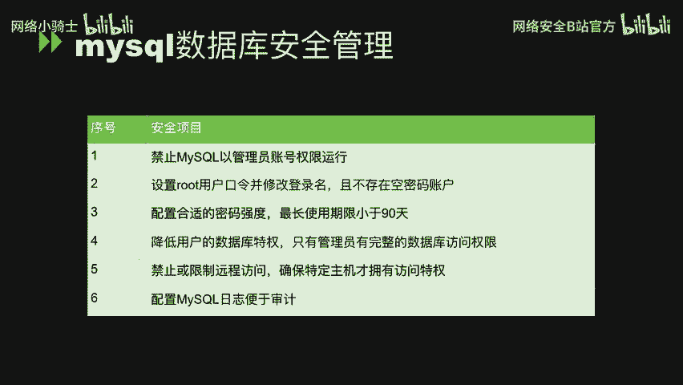
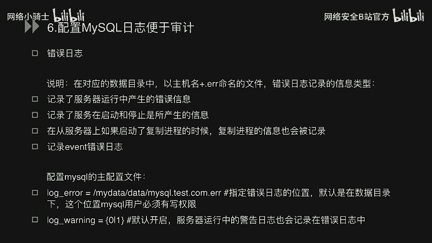
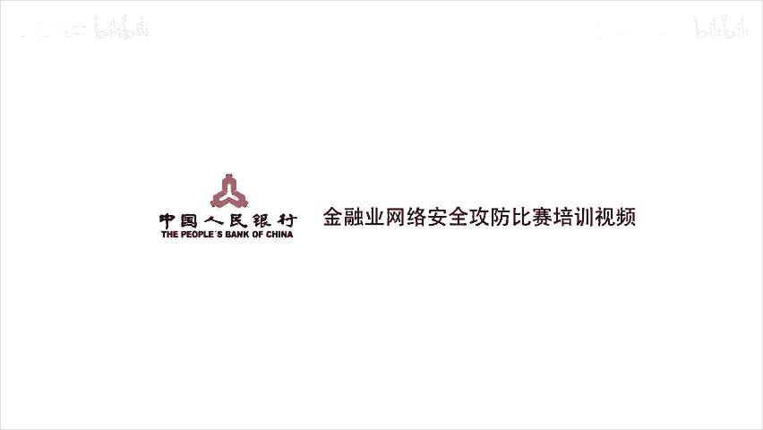

# CTF最强战队蓝莲花内部培训教程｜上千小时教程还怕学不会？ - P35：36.mysql数据库系统安全管理与优化 - 网络安全B站官方 - BV11M4y1J7mU

大家好，这节课呢我们来学习myscle数据安全相关方面的知识。

嗯，这一节课程中呢，我主要分成了三个部分。第一个mysql数据与安全管理。那这一部分涉计的就是我们mysql数据库的一个安全配置规范。嗯，第二，my circlel常用基本命令。

在这一部分中涉及的是mysl的增删改查基本操作，还有auto by联合查询等等内容。呃，第三呃，circle查询及手工呃注入执行。这一部分涉及的就是我们真实的在数据库中去执行我们circle注入语句。

然后看数据库的回显，然后来理解我们这个circle注入的一个原理。呃，首先看我们第一部分mysql数据库安全管理。

呃，在这一部分呢，我一共分为了6个小点，呃，每个小点呢都涉及到mysl一个安全的基本基限配置。我们下面呢就是对每一个这个安全基线做一个详细的讲解。

呃，首先看第一条呃，禁子mysl以管理员账号权限运行。那这一条的说明就是我们的mysql数据库应该使用非管理员账号运行，以普通的账户安全运行mysql数据库。啊，在这一点上可能就是有这样一个规范。

原因就是。我们为了呃使买s狗数据库在出现漏洞时，不至于整影响到整个操作系统，把它的那个影响范围仅仅是控制在mys狗这个用户范围之内。嗯，对于这一条基件的一个加固方法呢。

就直接在我们myscle的买点嗯CNF这个配置文件中添加Uer等于mycirl这样一个配置就可以了。然后对我们数据库进行重新启动。呃，之后我们数据库有直接以买s狗这个用户运行。呃。

第二条规范设置root用户口令，并修改登录名，且不存在空密码账户。呃，我们呃我这条接线呢，我们首先通过呃mysql杠Uroot杠P这个去登录我们当前的数据库。

然后通过acet password for rootot at local host等于password这条命令呢去修改我们当前root用户的登录密码。在实际操作中呢。

只需要将我们上面那一行中nnew pass word换成我们的实际所要修改的口令就即可了。呃，为了更有效的去改进我们root用户的安全性呢，我们可以去修改root这个用户的用户名。呃，对于这个操作呢。

我们直接在埋这控制台执行就可。呃，直接通过呃我们是优mysl这个数据库，然后呃update user的。Se user等于 another user name when user等于 root。

然后通过我们呃下次再登录数据库之后，我们就可以直接用刚才修改的那个another name这个用户名去登录数据库了。呃，还有第二呃之后的内容就是我们数据库的呃用户呢应该都配置密码，呃。

不允许我们数据库用户存在空密码的情况。嗯，对于这个加入方法，就是我们直接还是通过刚才那个命令set password for user at hosts。

后面直接等于我们要修改的password就可以了。然后如何检查我们数据库中的用户有没有空密码呢？直接使用select信号from my点Uer when userer等于空就可以了。在我们安全的系统中。

这条命令是应该不应该有任何的返回信息的。如果有返回的信息的话，那就证明我们当前有用户是使用空密码登录的。呃，下面看第三个规范。呃，配置合理的密码强度最长使用期限呢小于90天。

数据库用户密码复杂性包括密码特征，而如长度啊大小写、长度级和字符级等等。我们的加固方案的话呢其实比较简单，我们直接在全局下做配置就可以了。比如说我们启用我们的这个呃密加呃密码复杂度的插件。

将它的密码呃长度呃设为最小14位。它的那个大小写红血至少一位，字母至少一位这些设置。有。我们除了对这个密码的复杂度做一个呃限制以外，我们还需要对密码的最长使用期限做一个限制。

把它的那个最长使用期限小于等于90天呃，加固方法呢也是直接在我们呃数据库中配置全局策略呃，set global default password life time等于90就可以了。呃，第四条规范。

降低用户的数据库特权，只有管理员有完整的数据库访问权限。呃，mysq数据库中呢，myacql点Uer和mysql等地bu列出了我们可以授予取货拒绝给myql用户的各种权限。呃。

通常这些权限是不应该对每个mysql用户都可用的。而且通常只保留给管理员使用。嗯，加固方法呢就是我们去列举审计程序结果统计的非管理员用户。

对每一个非管理员用户使用rework这样一条语句来适当的删除其不呃不不必要的权限。my circleql点优表中的权限呢有下。呃，firele pro表示是否允许用户读取数据库所在主机的本地文件。呃。

process表示是否允许用户查询所有用户的命令执行信息。super pro表示用户是否设置全局变量、管理员调试等高级权限。st down pro表示用户是否可以关闭数据库。

create user pro。呃，表示用户是否可以创建或删除其他用户。呃，grant表示用户可是否可以修改其他用户的权限。我们应该确保只有数据库管理员才用于上述权限。

可以使用以下这个语去查看拥有各个权限的数据库账号。呃第一条select user and host from my circlel点 user when file per等于 y。

那这条命令就是去显示出我们当前嗯数据库重账户中所有拥有fi pro权限的用户。然后同样可以去用这条语句去查询我们数据库中。拥有process岗pro权限的用户。我们通过以上命令，如果获取到非管理员员呃。

用户拥有不必要的权限的话，我们可以使用以下命令进行权限回收。A rework set down on Xin点 X from Europe。回收当前用户的s down权限。

下面还有回收呃create权限，回收grant权限。呃，其中优er呢为上述查询到的非管理员用户。呃，第五条规范禁止或限制远程访问，确保特定土地才拥有访问权限。呃。

直接通过本地网络之外的计算机改变生产环境的数据是非常危险的。有时呢管理员会打开主机对数据库的访问。就比如以下这两个命令grant or on新点新 to rootot at。嗯，爸伴好。

这其实完全开放了对root的访问。所以呢把重要的操作限制给特定的主机是非常重要的。我们可以通过grant or on新点心to rootot at local host这条命令。呃。

此时呢你呃仍完全可以访问，但只有特定的IP，你才可以访问到我们的呃数据库。那下面呢我们再对这个权限进行限定，我们仅有许仅有限许可访问。

就可是 grant select insert on my D点ian心 to some euro and some host。呃，在这里呢我们仅需要把呃some user换成用户名。

把some host换成相应的主机。呃，这一点呢就是我们仅赋予s和映射的这样一个权限啊，没有其他的你create等等一类的权限。呃，第六条规范配置mysical日志便于审计。呃。

myxiical呢应配置日志功能，其中包含错误日志二进制日志。呃，至慢查询日志呃，通用查询日志更新日志等等。呃。

加固方法呢就可以直接在我们的主配置文件my点 co呃文件中设置log呃arrow等于呃杠home杠my点arrow等等具体的命令。呃，下面我们看单单独看错误日记。呃，说明呃，在对应的数据库条目中。

以主机名加点122命名的文件。错误日志记录的日志类型有呢哦，他记录了服务器中运行中产生的错误信息。它记录了服务器在启动或停止时所产生的信息。在从服务器上，如果启动了复制建程的时候。

复制建程的信息也会被记录。最后一个记录我们event错误信息。呃，下面看配置mycirl的主配置文件。呃，通过呃login呃log后面呃arrow等于这个一个路径的位置，我们可以指定错误日志的位置。

默认在数据库目录下这个位置，买s狗用户必须有写权限。当然，我们也要要log杠 warningning，后面可以选择零活一，默认是开启的服务器运行过程中的警告日志也会记录在我们的错误日志当中。

啊，以上呢就是我们们这个数据库的安全管理方面的全部内容。我们再回顾一下。

呃，第一部分的内容就到此结束了，感谢大家。

