# CTF最强战队蓝莲花内部培训教程｜上千小时教程还怕学不会？ - P37：38.PHP基础知识 - 网络安全B站官方 - BV11M4y1J7mU

那么下面我们来继续讲解。PHP的。基录知识。主要包括PPT的变量常量字符串的一个操作函数。

PHP支持的原始的数据类型有8种，这里就包括4种的标量类型，两种的复合类型跟两种的一个特殊类型。那么其中四种的标量类型包括。布尔型、整型、浮点型和置符型两种复合类型，包括数主。

还有对象两种特殊类型就包括资源类型跟空。布尔型主要包括触和fo联系两种，不区分大小写。整形值零跟浮点值00。0，空白字符串。跟字符串的呃双引号0以及没有成员变量的数。空都属于foralse。

除此之外为处。那么我们可以看一下以下事例。首先还是PHP脚本的它的一个开头标签。也就是。左交换号问号BGP。那么这里我定义了布尔值变量。以 friend他为处。然后利用if语句进行判断。

如果当前变量为处，那么它就会输出今天下雨。如果变量为false。那么他就不会进行这个今天下雨的一个数串输出。我们看一下视力的一个运行情况。

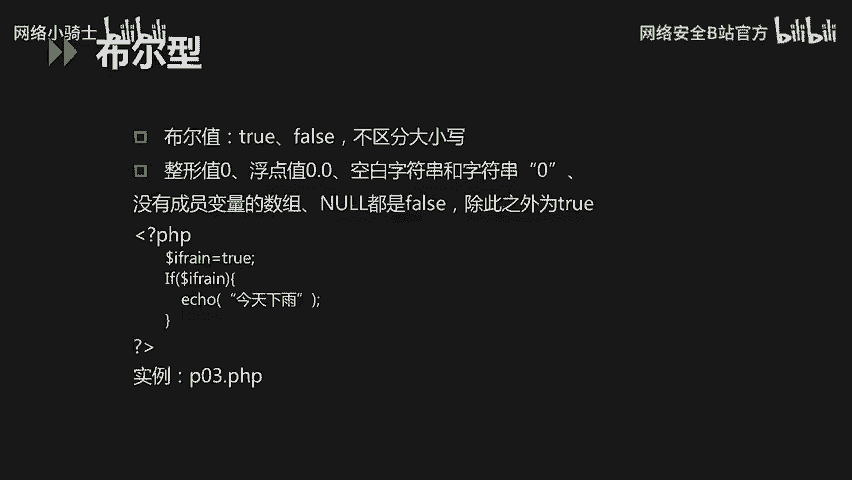

好。首先我们这里。将infr这个变量定制为处。我们访问进行输出。大家可以看到，在iffrent这个变量为错误的时候，我的hellow world是进行输出的。

那么现在我们将当前的布置变量改成foralse。它是不均分大小写。那么。因为当前的变量为fse，所以说if语句没有对hellowover的进行输出。

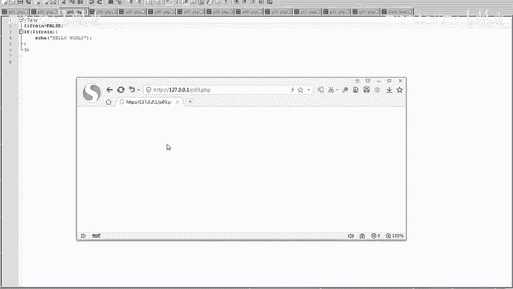

在PHP当中整形。也是一个很重要的一个数据类型。那么这里整形就包括十进制、十六进制，十六进制用0X后面针对于它的十六进制的一个值，还有八进制。0。来进行这个表示。那么在当前的这个PPP代码当中。

我们分别定义了age十进制。负值十进制99numbers066，复值8进制的这个066。那peeppos。我们复制16帧的AB。那么我们现在。看一下当前的一个代码势力，它的一个运行情况。

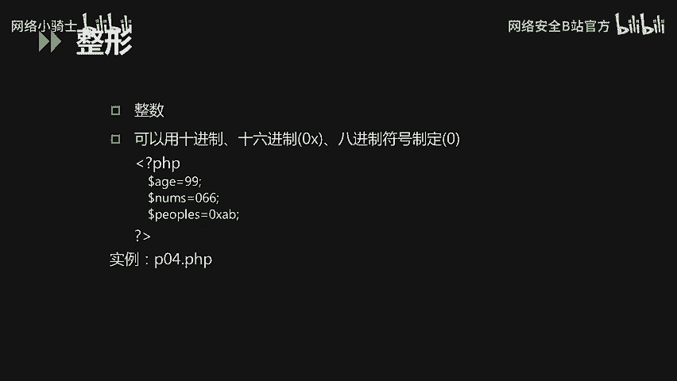

大家可以看到这里。🎼针对于三个变量，我依次进行了这个输出，它是以十进制的方式进行输出的。那么好，这里它进行正常输出了。

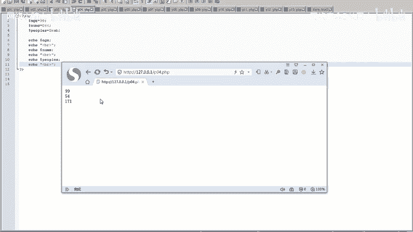

浮典型。同样是在PTP代码编写当中应用比较多的一种数据类型。那么这里浮点型包括双基硬度数、浮点数，还有实数。在PHP的代码事例当中，我分别定义了三个变量。第一个test是浮点数，也就是小数点后面。啊。

有很多。那么在当前的示位代码当中，分别定义了这个浮点数、双精动数和实数。我们看一下室内程序的一个运行情况。

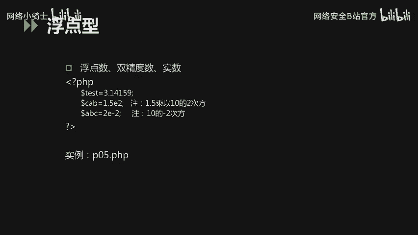

嗯，这里。我已经在PHP的一个代码当中，分别定义了浮点类型的各种。各种数据。定义了浮点类型的一个变量。直接访问也行。嗯，这里没有报错，说明我们定义是定义成功的。

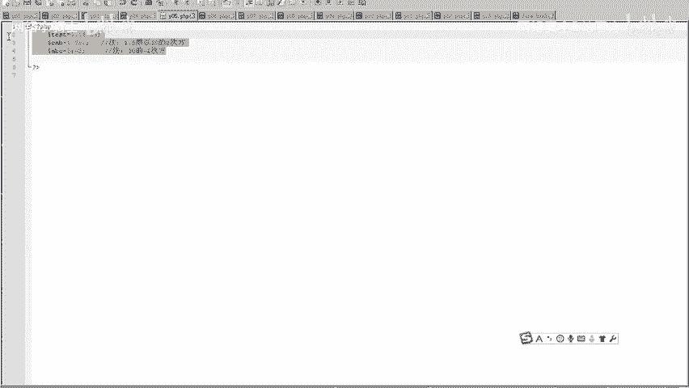

支付串类型。也是PEP。代码编写当中比较常用的一种数据类型。那么在我们定义字符串类型的时候，哦，可以用单引号定义，也可以用双引号定义。那么这两种。定义的方式有什么区别吗？那首先。单引号定义为记符串。

那单引号内的所有内容都是以字符串形式进入输出的。那其中的一些变量。一些特殊制服。比如说换行都会以这个反斜杠N的正符账形式进行输出，并不会显示出换行的效果。那么如果想。对当前的变量。进行一个输出。

并且啊特殊字符。比如说杠N换行的话，需要使用双引号，将字符串进行一个定义。那么我们看一下这个它的一个事例程序的一个运行情况。

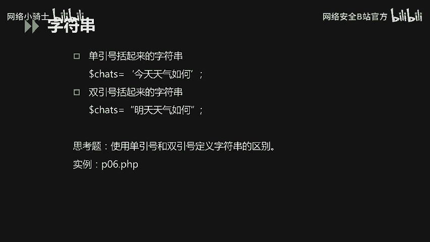

在PHP的代码实例当中。首先定义了SPR这个变量，负值它为6。然后我输出用单引号。首先输出单引号的一个助串。STR，然后这里大家可以看到它是一个变量。就是doll了服加STR，它是一个变量。

那同样的我将这个字符串用双引号啊进行输出，它会有什么效果呢？那么大家可以看到这里。用单引号输出的字符串，它就会直接将字串内容全部输出。包括。道乐福和SDR。那么。双引号。定义的字符串。

它就会将do乐夫STR作为一个变量。输出它的值。并且将反向杠N以换行的。形式。啊，进行输出。而不是像单引号一样，直接将它作为字符串的一部分进行输出。那么在字符类型当中，另外一个很重要的数据类型就是数主。

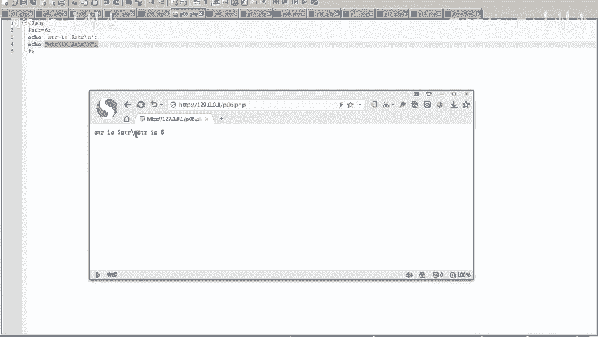

那么这里数组分为两类，第一类是索引数组，第二类是关联数组。那么索引输入它的一个定义方式。形如。当前比如说我这里。定一个它的值为1234这样一个数度。那么这里它的下标也分别对应着0123是。

它是一个线性的这样一个啊下标。那么关联数组它是一个键值对儿。那么关联速度它是一个间支队的形式，它的一个下标是。我们需要定义。那么在数主定义的过程当中，我们要使用当前的数主专用的定义函数来定义。那。

比如说我们记得里定义name一，它是啊XUWBname2，它是test2。那也可以用方括号。针对于具体的这样一个数主元素进行一个定义。比如说name一name2。那么这里我们看一下它的一个。

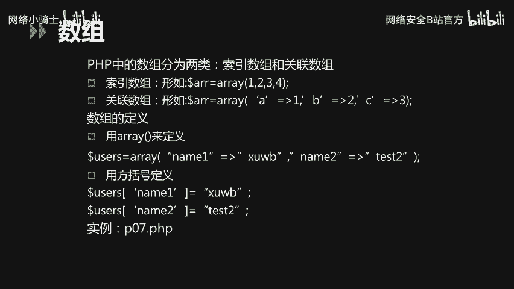

势例。这里我分别定义了索引数组跟关联数组两个数度。索引输组呢它的一个下标是一个线性的，嗯，从零开始012。那么关联数组当中，它是1个KV的一个键子对。所以针对于它的一个下标，我们可以自定义。

那么这里大家可以看到。输出之后。首先我将数主names。它的里面的一个值。分别用012索引，并且拼接成这五串输出了。Peter。And the joy are lily neighbors。

那么关联数主呢，我是利用我一开始定义的它的一个下标值来进行一个字符串关联的。

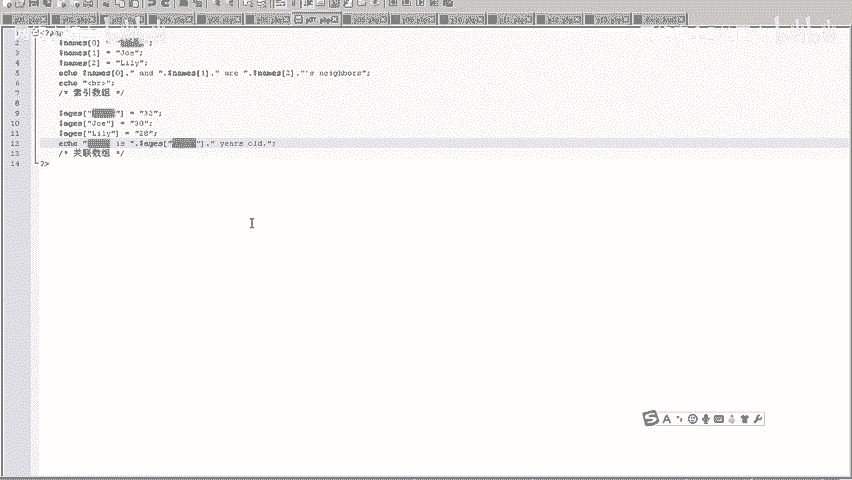

那类型是PHP数据类型当中比较特殊的一种。这里n表示一个变量没有值。本身那类型它是不区分大小写。那么什么情况？它是一个nn值呢，也就是一个空值。首先是尚未被赋值的一个变量，是空被unset函数。进行。

设置的这样一个变量是空。那空类型难类型它唯一可能的值就是空。

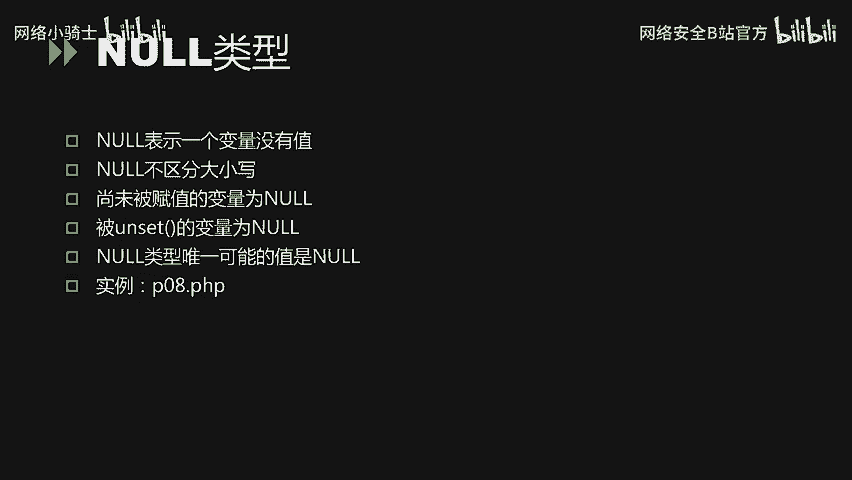

我们来看一下它的一个代码实力的一个运行情况。这里大家可以看到第一行代码。我首先负值当前的这个变量为空。我会看一下我赋值之后，它这个变量是否为空。那第二个是我未赋值的变量，我打印出看一会儿你运行之后。

看它的一个值是否也为空。然后利用un side函数进行处理过的变量，它的值是否为空。大家也可看到，在这三种情况下，输出的一个变量的值几都是空。

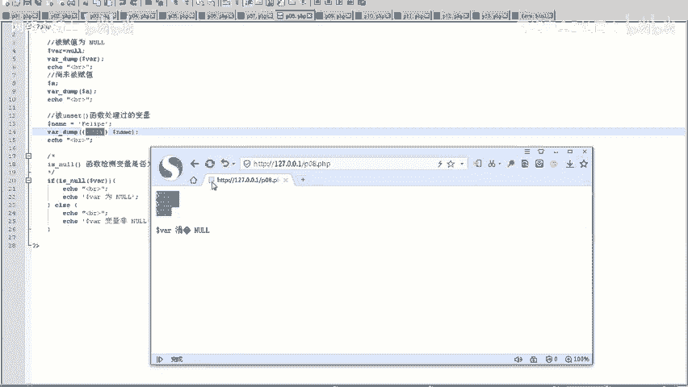

那么以上就是HP当中。它的一个数据类型。包括整形浮典型。还有数主。空类型。那么下面我们再来讲讲我们刚才在代码事例当中。总用到的一另外一种在PHPE当中比较关键的一个知识点就是变量。

变量首先它是以刀了符号开始。它本身是大小写敏感，例如number NUM跟大写的NUM。是两个不同的一个变量。那变量名通常是以字母和下划线开始，后面跟字母数字下划线。虽然允许变量为中名中文名。

但是不建议使用。另外一种比较特殊的变量就是预定义变量。预定义变量属于PHP它本身提供的一些可以获取特定。内容的这样一部分变量。那么就包括。啊，doller杠get dollar杠post。

还有杠cook。那么我们来看一下。预定义变量可以做哪些事情？

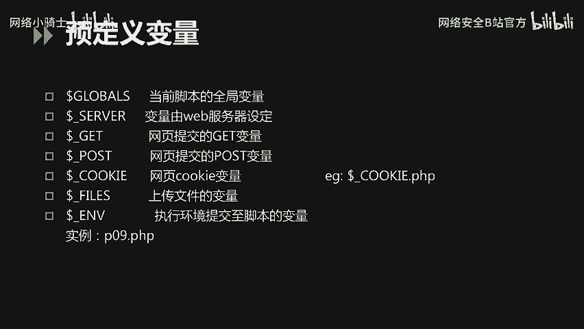

这里大家也以看到。我打印输出的是doller杠 server。杠ser这个预定密变量，它是包含了诸如头信息路径以及脚柄位置的这样一个等信息的一个数组。另外一个是杠cookie。

它会对当前页面的一个cookie值啊进行获取并并输出。大家看到这里。我直接print杠R。对杠serv进行输出的话，它会获取到很多啊针对于系统本身应用本身的一个信息。

那么杠cookie同样是它会输出当前浏览器，当前网站它的一个cookie信息。这就是预定义变量的一个作用。

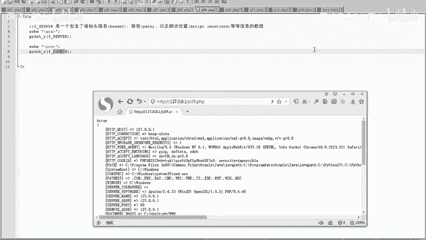

那另外呢就是讲一下变量的范围。那么这里PHB变量一般在本本程序文件当中，它是有效的。用户自定义函数中变量只在本函数中有效。自定义函数中可以用global引用函数外的一个变量。例如当前的一个代码事例。

我定义DD这样一个变量。在函数外定义的。那么只要我在啊AA的函数当中利用global这样一个关键字去定义啊DD这个变量。那么同样我可以在当前的函数当中进行一个使用。那么静态变量啊。

stistic只在用户自定义的函数中使用。当程序执行离开此程序后，其实并不丢失。我们来看一下。针对于变量范围的它的一个代码事例的一个运行情况。

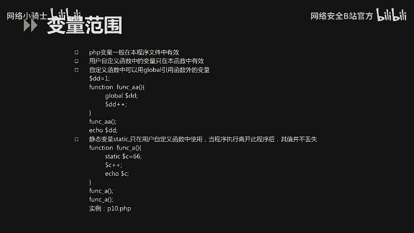

大家看到这里。正常的话，如果我不用global去定义这个杠DD的话。它最后是没有结果输出的，可能就直接停示提示未定义变量。但是这个时候如果我用global定义之后，它就会获取函数外的这样1个DD变量。

大家可以看到这里就输出2了。另外一种是PHP的一个外部变量。当一个表单提交给PTP程市程序时，表单中的值自动在程序当中使用。

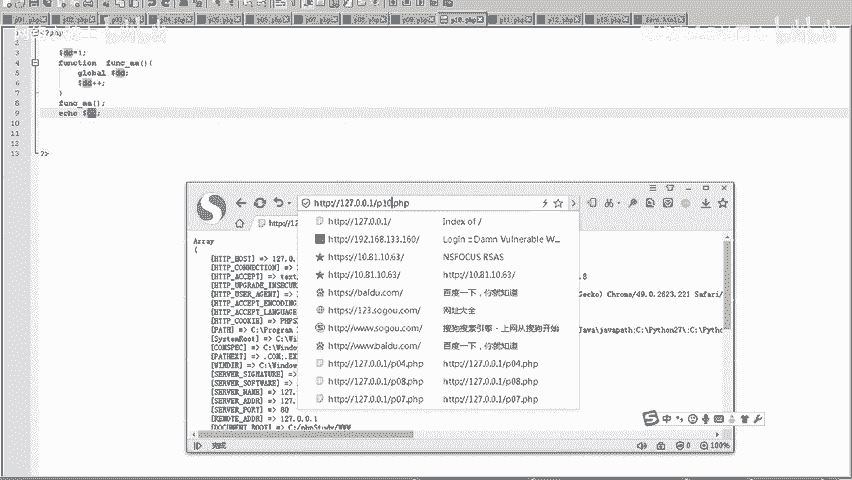

例如HTMM表单，包括gappost。通过get post啊这样一个请求，我们就可以获得这个参数当中的一个值。

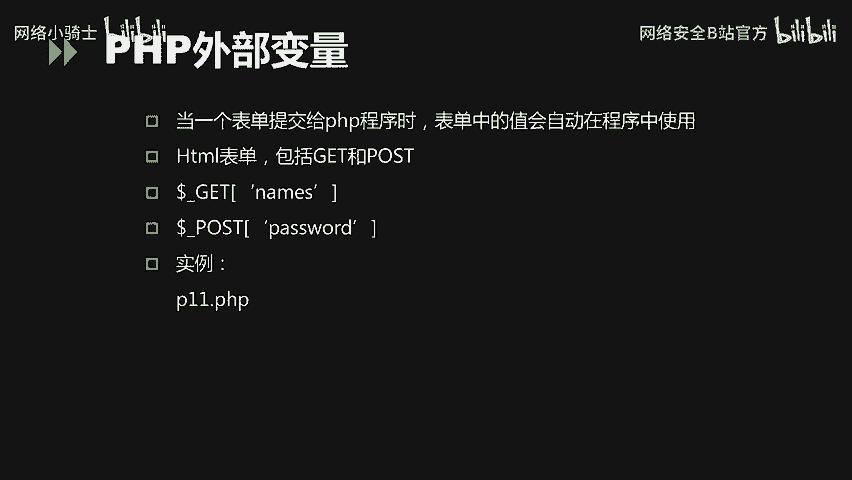

我们来看一下代码实力。那这里我定义一个父表单，对父母表单是分别输入它的一个用名，它的一个年龄和姓姓名称、名字和年龄，然后发送给PHP11的这样1个PHP。然后通过get请求进行提交。

那么我在P11杠H这样1个PPP文件当中啊，获取get请求当中的phone name跟age这样个一参数值进行一个显示。

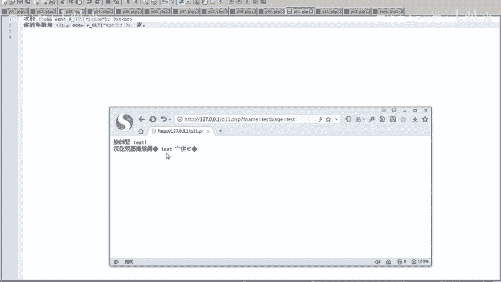

大家看到这里就直接将这个姓名跟年龄进行一个显示。那么另外一种就是常量常量它本身不经常使用，它的一个定义方法是用defend，然后加上左右括号这样一个函数去定义具体的一个常量名，具体的一个内容。

常量的值只能是标量，并且不能通过负值预计，一旦定义就不能重新定义和取消定义。常量前面没有到了伏。常量大小显敏感，常量它的一个范围是全举的，就是在整个PTP文件当中都会覆盖到。另外一种就是预定义一个。

常量那预定一常量就包括1个PDP的版本，还有当前文件的一个物理路径。在PHP当中有很多常见的函数，这里就包括一些字符串的操作函数，包括啊SDRSEN这样检查字符串长度的啊。

另外一种就检检索字符串内指定的一个字符和文本等等。还有print输出不同的类型，都是在PPP代码编写当中比较常用的一个函数。

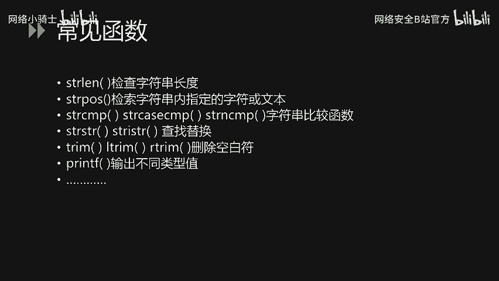

