# CTF最强战队蓝莲花内部培训教程｜上千小时教程还怕学不会？ - P39：40.Windows系统安全 - 网络安全B站官方 - BV11M4y1J7mU

大家好，呃，这节课呢我们来学习windows系统安全。作为普通用户来说呢，windows是我们最熟悉也是最常用的操作系统。它的图形化界面给我们的工作和学习带来了巨大的方便。但是作为安全工作者来说。

我们又又又应该熟悉windows的哪些安全方面的操作呢？这个呢就是我们这节课的主要目的。呃，我把这节课呢主要分为了四个部分。

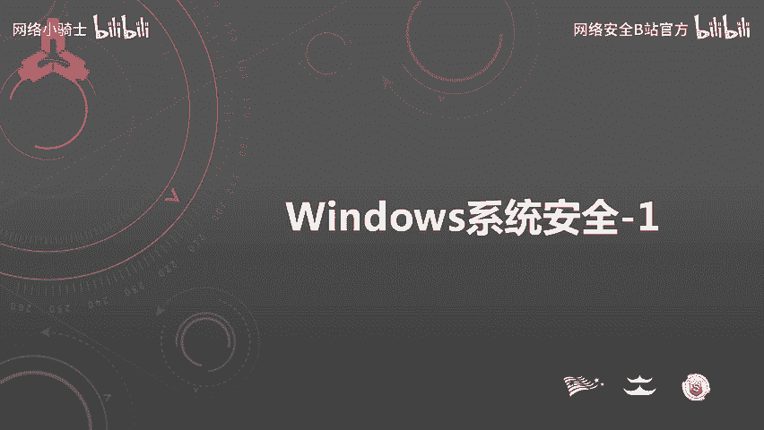

呃，分别是呃windows系统安全基础呃，用户设置等用户权限等等全配置规范。呃，这一问涉及到了我们怎样去尽早的发现我们的系统异常，怎么样才，通过日志去分析有没有被入侵。

第四部分呢是windows应急响应。呃，在这一部分中涉及到的就是我们如何查找我们的系统它有没有存在后门。怎么通过日志去分析这个攻击者是如何攻击到我们的系统的。嗯，下面呢我们看第一部分。嗯。

第一部分windows系统安全基础。呃，在这一部分中，我又分为了4个小节，分别是常用命令嗯，账户安全本地安全策略和口令安全。呃，我们先看常用口令。

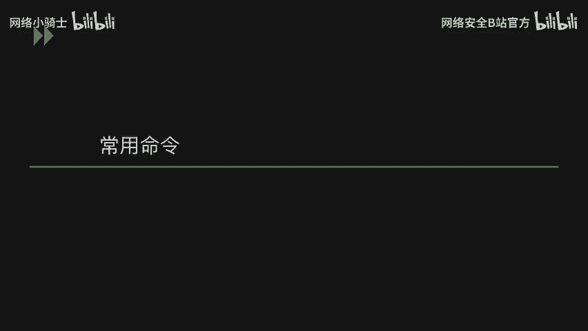

诶。嗯，下面呢就是我列举出来也这一列那个常用的呃我们的windows命令。呃，用命令呢一方面就是我们在呃对操作系统这些操作时用命令显得比较专业。当然这个不是最重要的要呃理由。

第二个呢就是以我们的呃windows不同的版本之间会有这种界面上的一些呃差别。呃，每个版本之间打开配置文件呢会因那个界面的不同而略有不同。但是通过那个呃操作命令呢，可以很快的帮我们定位到具体的配置页面。

呃，我们把这个具体命令过一遍呃。第一个，查看系统版本呃，word整VER缩写。查看主机名hose的 name，查看网络配置呃以IP confit杠杠2呢可以看到我们的IP信息。

包括我们的呃网卡的mac地址。呃，查看用户呃net you呃，查看开放端口。嗯，它呢可以看到我们当前系统上呃开放的端口和有哪些端口向外连接和向内连接。嗯，打开注册表。

注册表的话是我们操作系统的一个配置文件，相当于。嗯，打开事件查看器。呃，事件查看器呢可以看到我们的windows日志，包括应用日志等打开系统服务。呃，系统服务呢可以看到我们当前系统中的服务。

可以对其进行操作，呃，停止和开启等等。嗯，打开主策略编辑器呃，主策略编辑器呢中呢可以看到我们的计算机配置呃，用户配置等。嗯，打开本地安全策略。

本地安全策略中涉及到的有我们的账户策略、本地策略和一些高级防火墙设置等等。最后一个是打开本地用户合组，可以看到我们嗯本地的用户和本地用户主信息。

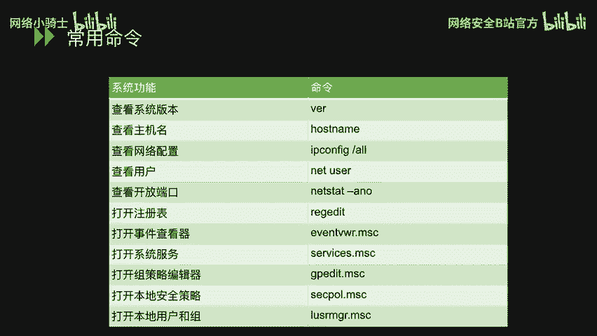

呃，再往后看，我们看第二个小节呃，账户安全。

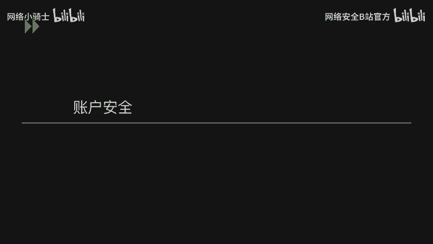

诶。想看到本地的用户主呢，我们可以用到刚才提到的命令LU theMGR点MSC呃，看加门这幅图中就已已经打开了这个呃界面。在这台主机上，我们可以看到它只有两个用户。

分别是我 mini trade和gues在ges的那个图标下面有一个向下的箭头。这个代表的就是我们禁止禁用用户，禁止用这个get的用户登录。

呃，再往下看，我们列举了一个，就是用户稍微多一点的一个呃操作系统上面的截取下来面的一张图。嗯，在可以看到，就是除了administer trade和gast这两个用户外。

还有还有3到4个这种用户自建的账号。我们以1234以第五个那个呃全名是启动IOS进程账户这个为例。诶。嗯，这个呃见这个用户呢，我们是基于这样一个目的。呃。

我们在安装和那个启动这种呃windows程序的呃程序或者是应用的时候呢，建议就是单独创建这样一个用户去安装和启用。嗯，这种操作呢目的就是为了防止这些应用或程序出现漏洞的时候。

直接对我们整个操作系统造成影响。诶。呃，第二张图呢是我们的用户组，我们就可以把我们创建的用户添加到不同的用户组中，然后从而对这个用户组进行直接的操作，包括权限等等的一些操作。

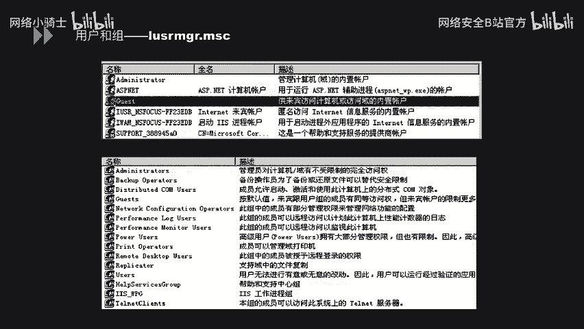

呃，下面呢我们看一下这个账号的两个命令，一个是netur。呃，利用这个net user呢，我们可以看到可以查看用户信息，包括创建用户创建用户时，并且设置密码。还有就是把我们创建的用户添加到某一个组中。

呃，启用和停止这个用户。到最后我们怎样去。嗯，删除某一个用户组。呃，这个是net euro看第二个。是那个hoMI呃，hoMI可以直接输入的话，就可以看到我们当前的一个呃当前的登录用户。呃。

hoM更优的话，其实可以看到我们当前用户的1个SAUSID这样一个更详细的值。再往后hoMI后面直接将。更2呢可以看到我们。当前用户的一个所有信息，包括它隶属于哪个组？

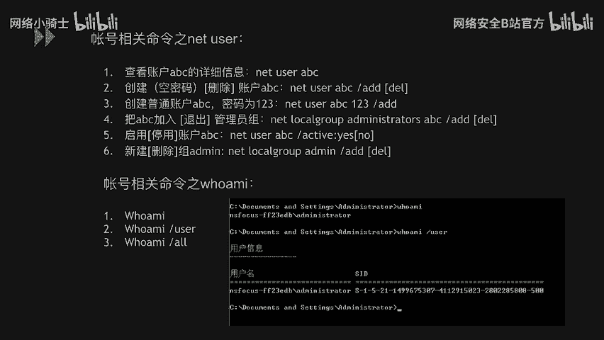

嗯。呃，看完上述那个基本的一些用户方面的操作之后呢，我们去呃给这样一个例子。这个例子呢就是建立隐藏账户。首先说理一下为什么要建立这样一个隐藏账户。呃，黑客作为攻击者在拿到我们系统权限。

他一方面可能是通过我们的系统或者应用程序的漏洞。另一方面呢是他有可能利用了我们系统的弱口令，从而拿到了我们的呃这个系统权限。作为公益者，为了使我们这个能够长期的对这个操作系统做行占有的话，我们要。

防止这个呃管理员呃修复了这个漏洞，或者是改了这个用户密码。所以我们就要创建这样一个隐藏账户。呃方便我们呃以后对这个系统进行继续呃操控。

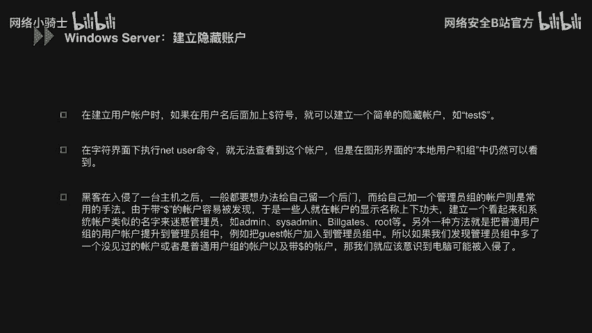

呃，下面呢我们就以这种例子的方式去说一下这个隐藏账户到底应该怎么创建。首先第一步就是通过我们刚才所说的那个net you的这个命令呢去创建这样一个隐藏账号。可以看到隐藏账号有个特点。

就是在test后面加一个do，这样就是一个创建的一个隐藏账号。然后把这个隐藏账号呢加入到我们这个admintra这个呃组中，这样的话就拥有了与这个组中所有用户一个相同的权限。

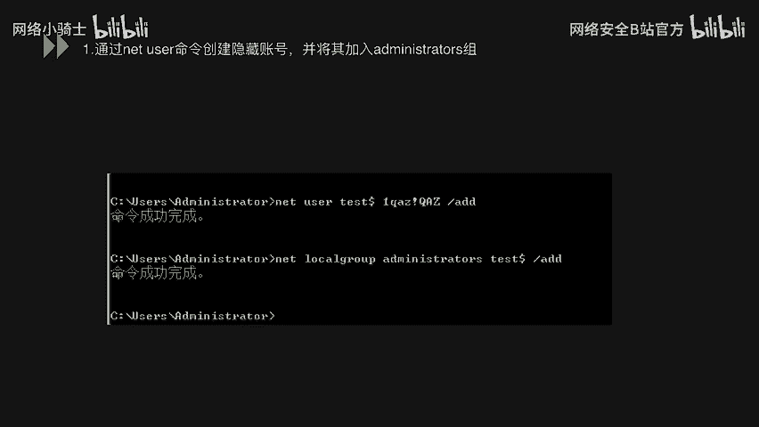

嗯，第二步呢展开我们的注册表，可以使用IEGEDIT这样一条命令。然后定位到我们这个SAM这个文件夹下默认情况下，这里没有任何内容，这是因为用户对它没有权限。呃。

这个时候呢我们就需要右键这个SAM这个文件夹，然后选取权限这个选项，然后对addmin这个组添加完全控制和读取权限，然后点击确定应用。

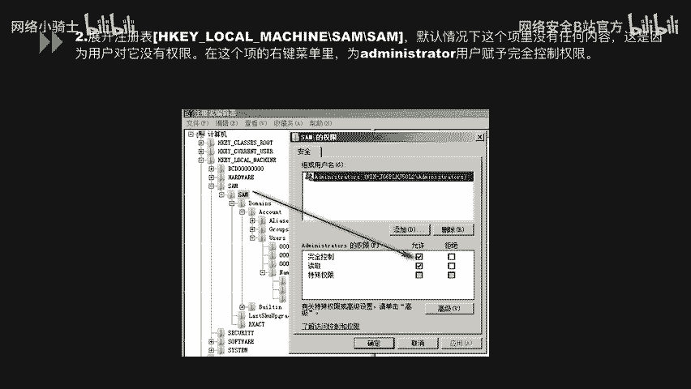

呃，之后呢就是我们需要重启一下我们的呃注册表。那此时我们在这个sam下就可以看到我们这个domin account user name。name下呢已经正是我们当前系统的一个呃所有的一个用户了。

在这里可以看到有administ trait呃gas，还有我们刚才所见的呃test到了这个三个用户。在优中呢分别还可以有三个那个呃相当于3个SID这个分别对应我们三个用户。呃。

我们的刚才所见的test呃到了这个用户呢，呃有两个呃注册表文件注记录了他的信息。一个就是我们呃name幕下面的这个test到了这个文件。另一个呢就是呃在优人那个文件夹下面00003E9这个注册表文件。

所以这会这个时候我们需要把这个文件，这两个文件导出来，导出来呢就可以看到是右边这张图中两个呃注册表的类型的文件。

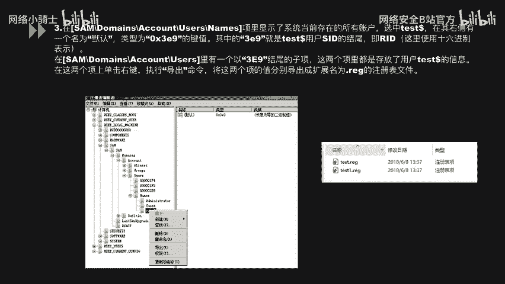

就第四步就通过我们的net user这个命令去删除我们的这个呃隐藏账户。

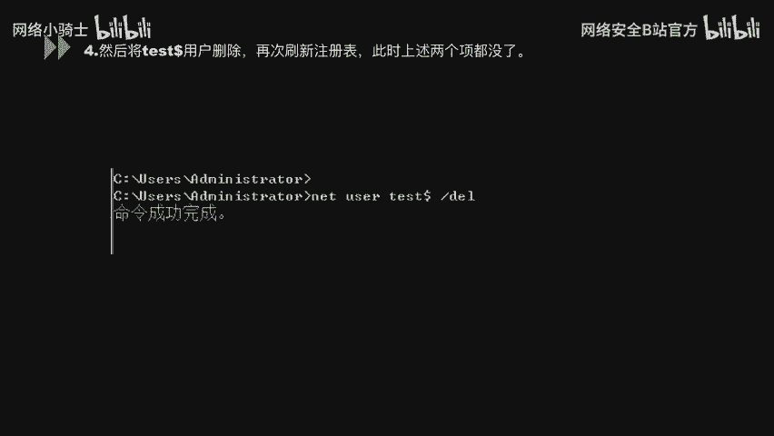

删除之后，我们注册表中就看不到这两条信息了。呃，第五步第五步就是我们再打开注册表，然后点击右键直接有一个导入功能。这个时候我们就把刚才导出来那两个注册表文件呢再重新导入到我们注册表中。那。

下面这幅图呢已经是我们导入后的结果了。所以可以看到和之前我们打开是一样的。嗯，此时呢在出册表就可以看到我们这个texest的账户的信息呢。但无论在我们的命令行或者界面中。

都无法看到这个用户彻底就被隐藏了。呃，使用这个账户我们可以登录系统，但缺点时候它依然会产生用户的配置信息。下面呢我们就对这个账户进行进一步处理，使它完全隐藏。

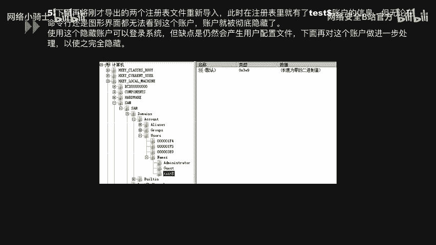

呃，第六步呃展开我们上面的注册表中找到administ用户IID这个啊EF4这样一个文件。呃，展开对应这个项中的那个有一个F，因为S服务的一个键值，键值中就存放了我们min这个用户的SID。

下面呢我们就是把这个键值全部复制，直接粘贴到我们000003E9这个像的F键值中，也就是把我们admin这个用户的SIT呢复制给了test dollar这个用户。

这样在操作系统内呢实际上已经把我们test dollar当做我们的admin这个用户了。test就成了admin的影子账户使与其呢同时用一个用户配置文件。

此时这个test dollar用户才真正被隐藏起来。

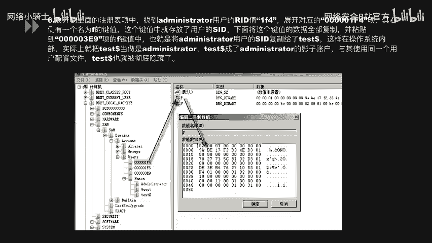

呃，接下来呢我们去验证一下刚才的说法，我们通过命令行和那个界面去同时查看我们的么的用户。左边看net user，可以只能看到administrrate和gast，同样右边也是完全一样。

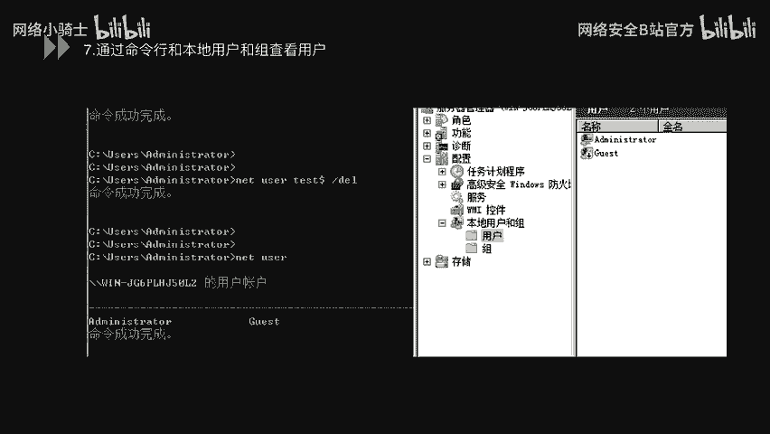

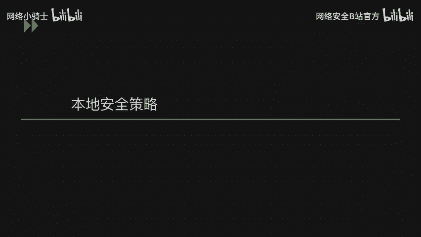

嗯，下面我们再看第三小节本地安全策略。呃，稳定安全策略呢可以通过我们刚才说的s power点MSC这样一个命令打开。呃，下面这张图可以看到已经是打开安全策略的一个。啊。

图了它其中呢可以看到我们的账户策略，本地策略，还有一些高级安全windows防火墙等等方面的设置。我们先看一下这个账户策略中的一个密码策略。密码策略呢在这边一共列举出来6条配置。

我们可以过一下第一个密码符。和复杂度要求，这里可以选择启用或者禁用。第二个密码程度的最小值。呃，我们可以设置，比如说八或者12，就是我们在设置密码时必须符合这个密码长度。密码使用最短期限，这个就是。

我们去设置这样一个期限包裹可以设置为一天。就是说我们设置我们在一天之内不能更改两次密码，呃，密码最长使用期限。这个代表了就是我们在这一段时间内呃达到了这个期限之后，必须进行更改密码。嗯，强制密码历史。

这个就是我们系统要记住我们的几次密码，代表就是我们在这几次内修改的密码，那都不能够相同。嗯，可用呃用可还原的加密存储来存储密码。我们是否启用这种方式呢？是如果禁用的话。

我们就用那个呃不能还原的那个那加密方式来存储密码。啊，下面我我们看账户策略中的账户锁定策略。第一个账户锁定时间。当我们登录的时候出现一次异常行为的时候，我们这这个账户这须已行锁定，锁定呃。

多长时间呢才好可以设置。第二个账户锁定预值。比如说我们登录尝试多少次，失败之后，我们要对这个江湖进行锁定，这是一个阈值。呃，第三，重置账务锁定计时器。呃，经过多长时间呢。

我们把这个用户的登录这个呃限制呢重新进技术。

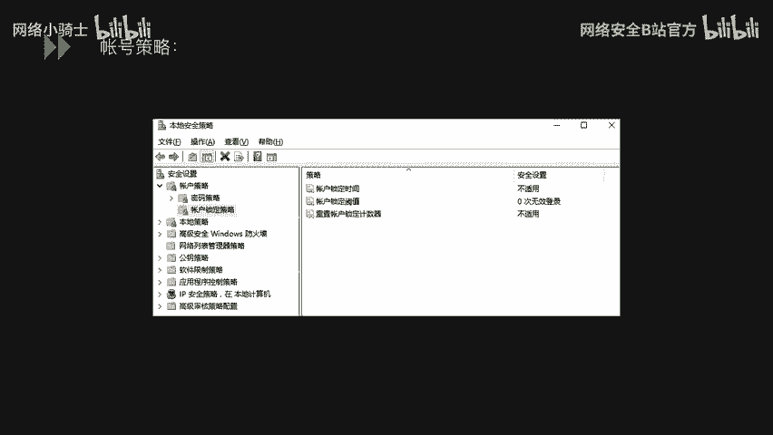

呃，下面呢我们看第四小节是口令安全。

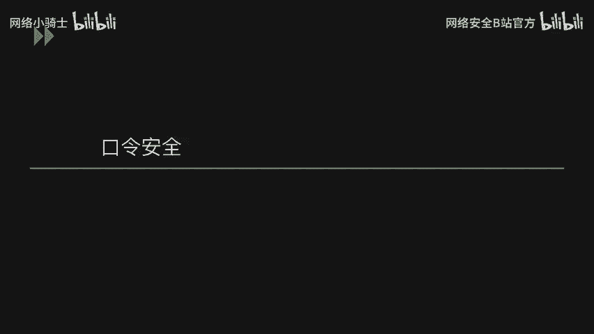

呃，口令安全呢一直是我们平常在渗透测试中或者其是一些内网测试中比较着重看重的一个点。因为只有如果能很方便的拿到一个弱口令的话，基本上拿到了这样一个系统的整个权限。

所以对呃事后的一些呃测试呢会有很大的帮助。就看这张图。这张图呢是我们的平常用到的扫描器中扫描出的一个弱口令列表。可以看到这些入口令呢可以能能涉及到FTP啊、数据库等等SS登录这些一些信息都可能被扫描到。

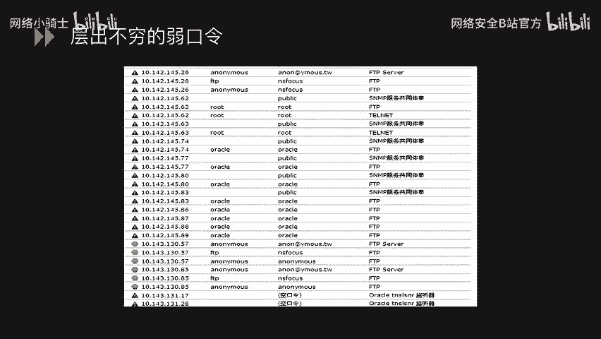

呃，下面呢就是我们知道我们是有这样一个入口令的风险。但我们如何检查我们的内网中或者是系统中有没有入口令呢？在这里呢我们列举两种方式。第一种呃在线方式。在线方式呢可以利用九头蛇这样一个软件。

九头层呢它支持的不光有SMB，包括还有HTTPFTPSSH这样一些协议都可以进行通过它进行那个暴力破解。嗯，在这里列举出来的一个那个使用方式。

直接我们HYDRR后面杠L这个代表的就是我们要破解当前系统的用户名杠大P。这个代表的就是我们呃添加一个这样一个呃弱口令字典。到后面走使用的SMB协议啊，特具体指定到哪台主机。嗯。

然后呃指定了这些参数之后，他就会对这个口令进行暴力破解。可以看到我们下面有一行绿色的字，它详细的那个列举出来的当前这个445端端口下，我们利用了SME这个协议后主机呢是192。168。1。

114用户名就是呼外Y我们刚才设置的嗯，pasword是6个亿。这个呢就是通过在线的方式去查到了我们系统中的这个入口令。

嗯，第二种方式离线呃，先说一下为什么要采用离线呢？我们系注意系统做过加固的时候，可能会就是设置这样一个设置。说我们几次尝试登录之后，对这个账号进行锁定。所以如果这种方式如果采用在线直接进行暴力破取的话。

可能对我们的生产系统影响造成造成影响。呃，对业务呢也会产生那个阻断。所以我们如果设置了这样一些操作，我们就采用离线的方式进行呃检查。采用离线方式呢需要运用到一个工具。

将我们的windows口令从SAM文件中提取出来。做这一步的原因呢，就在于windows运行过程中呢，SAM是被锁定的，不能直接复制或者编辑这个文件。呃。

PWPW DO这个呢是一个免费的windows使用程序。它能够提取出我们windows系统中的口令，并且存储在指定的文件中。看下面这幅图呢就是它把我们。这个window系统中的口令呢提取出来了。

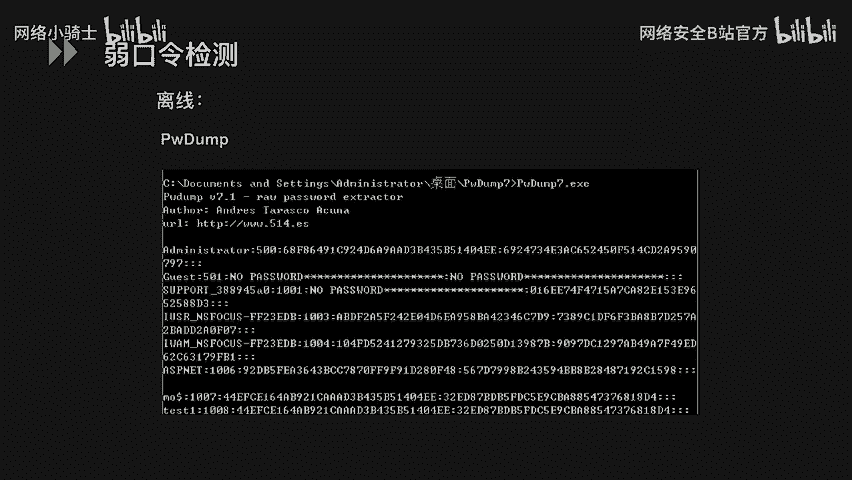

呃，提取出我们呃这些口令的这个哈希纸的话，我们就可以用我们的一个彩虹表这样的工具。然后把我们这个提取出来这个口令直接呃导入到我们这个彩虹表中。

彩虹表呢就它会有根据呃基于那个还是字典的方式去暴力破解我们这个系统中的这个螺口令。可以看到以这个为例，我们可以看到它终端入口令包括这种A focusemp123456。

这个呢就是我们利用这种离线的方式去检查我们呃网内网或者系统的有没有弱口令。

嗯，回顾一下以上是第一部分的内容，我们回顾一下。包括讲了我们的常用口令。账户安全。本地安全策略。还有口令安全。呃，以上呢就是我们第一部分的主要内容。

好，谢谢大家。

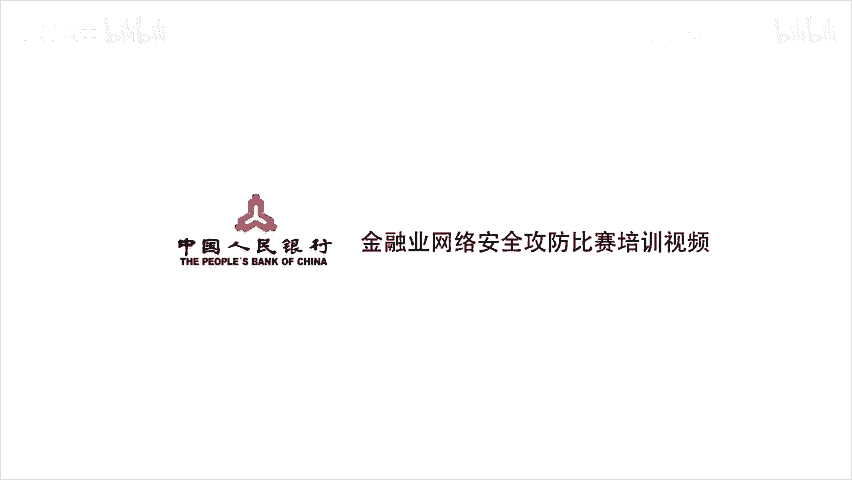