# CTF最强战队蓝莲花内部培训教程｜上千小时教程还怕学不会？ - P40：41.Windows系统安全 - 网络安全B站官方 - BV11M4y1J7mU

大家好，呃，这节课呢我们来学习windows系统安全。下面呢我们来继续学习windows系统安全的第二部分是windows安全配置规范。这一部分呢我也同样分为了4个小节，分别是系统服务。呃。

在这一小节呢会涉及到系统的启动停止。

包括它这之间的一些配置。呃，第小节呢是服务于进程安全呃。呃，这一小节呢就是会涉及到这种服务和进程之间，我们去怎么样去查看他们之间的对应关系。呃。

第三小节日志审核就是我们在windows上应该配置哪些方面的日志，才能嗯真正利用呃有用于我们后期的一个审核呢？呃，第四呃小节是文件权限控制。嗯，这一小题呢主要是呃看那个文件之间的权限设置。

怎样才能让我们普通用户之间这个权限设置的得当。

呃，首先我们看系统服务这一小节。呃，想查看我们系统中有哪些服务呢？同样可以用到我们之前提到的这个service是点MSSC这样一个到时命令。在CMD中直接直接直接输入这样的命令啊。

就可以打开我们下面这个界面，可以看到我们已经显示出来当前呃系统中的一些存在的服务呃。哎，等也可以看到它的一个状态是已启动呢，嗯还是呃已停止的。嗯，包括后面的启动类型是手动禁用、自动。

还有延迟启用等等类型。

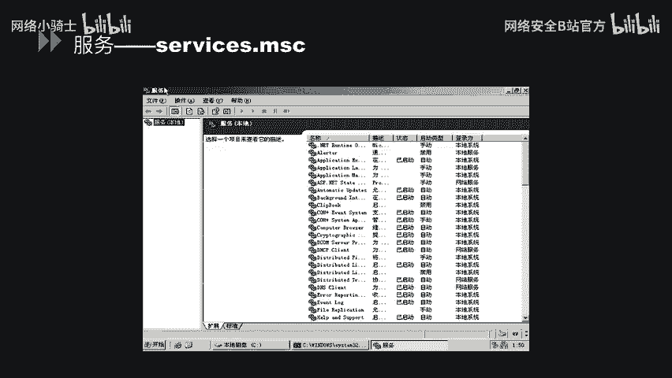

接下来我们去单独拿出一个服务来去看一下它的具体属性。就比如说我们以这个阿帕奇2。2这个服务为例，我们点击它的属性，可以看到在常规这一栏，我们可以看到它的那个服务名呃这个服务的一个可执行文件的路径。

包括它的启动类型，在这里可以设置手动自动那个随机启用启动，包括还有延时启动等等。第二列呢是一个登录身份的设置。在本地系统账户下面，我们可以选择嗯哪一类账户可以对这个呃ipad这个服务做一些相关操作。呃。

第三列是恢复。就比如说我们这个选择服务器失败时，我们计算机的反应呃，可以我们设置为不操作，或者重新启动服务运行一个程序，或者是我们直接去重新启动计算机。这个呃按我们的业务来进行选择。呃。

第四列呢是依存关系。这些服务呢就是一些服务可能依赖于其他服务系统驱动程序组织加载顺序。如果组件被停止或者运行不正常的话，依赖它的服务也会受到影响就。

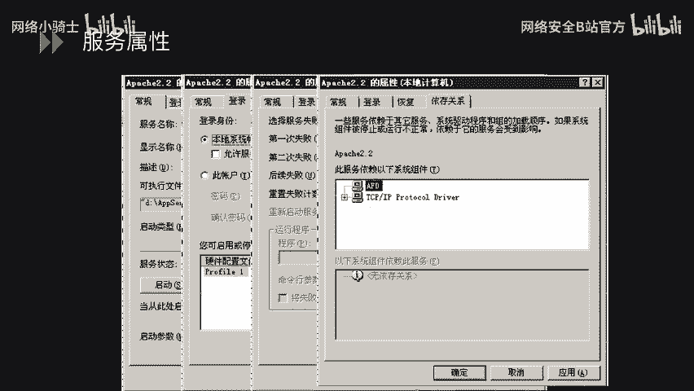

呃，下面呢我们来看一下怎么通过我们的这个系统命令去开启和关闭我们的服务。嗯，在这里呢就是以这个serv这个服务为例去进行举例的。就比如说我们要啊停止这个服务。

直接net stop这个serv这个服务就可以了。呃，因为它下面会依赖依赖于其他的一些服务，所以它在那个你停止时候，他会让你确认一下你是否连那个其他的服务也进行呃一并停止，选确定之后就停止了。当你。呃。

想在启用这个服务的时候，就直接用net start设这个服务就可以了。

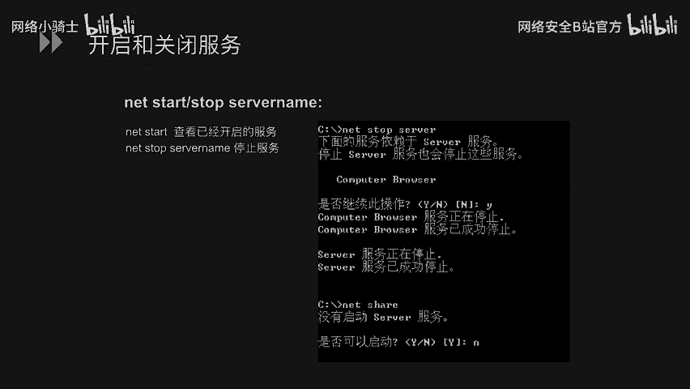

呃，下面来看一下是一个安全方面的一个配置。呃，标题我举的是这些服务可能带来的一些威胁。呃，建议呃。将以下服务停止，并将它的那个启动方式修改为手动。呃，这些服务呢大家可以看一下。

我这里呃单独选几个来呃说就可以了。啊，首先我们看一下serv这个服务嗯。servve这个服务我在后面列举了有两个那个两个漏洞，包括是MS06040和MS08067这两个漏洞。嗯MS06040呢。

它是一个呃serv服务中缓冲区溢出的一个漏洞，它可以呃造成一个远程代码执行呃，成功利用此漏洞呢，攻击者呢可以就是远程完全控制我们的这个操作系统。包括这个淋巴流理器。

同样它也可能就是允许我们的这个工具者去远程执行代码。这个呢是由于我们这个售务服务的这个漏洞造成的。呃，下面我们再看一个是那个print这个sp了这个服务造纸的一个漏洞，它是MS10061。嗯。

它呢是一个windows打印机远程服务代码执行漏洞。它也是由于这个服务服务启动之后存在那个漏洞，它造成了那个远程代码执行。呃，这个呢关于服务呢会涉及到这一点。

我们平常说要以一个最小化的一个安装方式进行那个运行系统。那个运行我们的操作系统。我们为了避免这些我们不使用的服务造成的的一些漏洞，造成我们对我们操作系统的影响的话，我们建议把这些服务直接停止掉。

并且把它的那个启动方式改为手动。

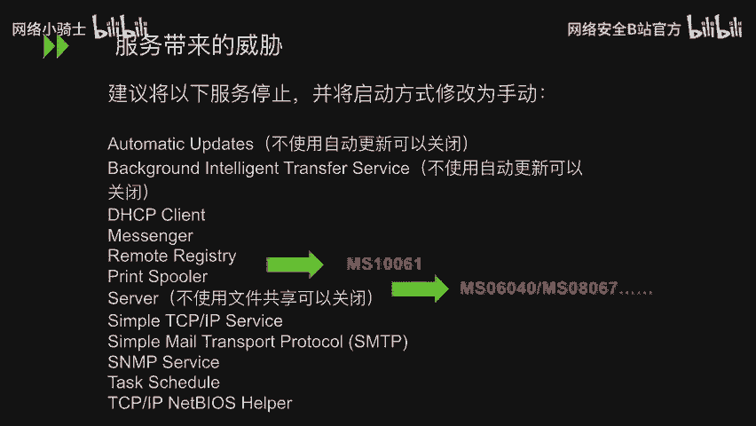

呃，下面呢我们看一下这个注册表，我们与我们的服务的一个关联的关系。呃，我们还是用那个REGDIP这样填命令，可以打开我们的呃注册版。

在呃HKloc呃 machineine和sstem呃curro control set service这样文件夹下面呢，每一个服务项目的指向都有一个这个start这个数值。

这个数字的内容是依照我们每一个服务项目的不同而不同的。star的数字呢就是记录我们这个服务的驱动程序的核时被加载了。就比如说你可能这个服务是一个呃手动启动，或者是那个随随操作系统的启动而启动。

或者它是一个延时启动，或者它甚至是一个精止的状态，都可以在这个设值里面设置。

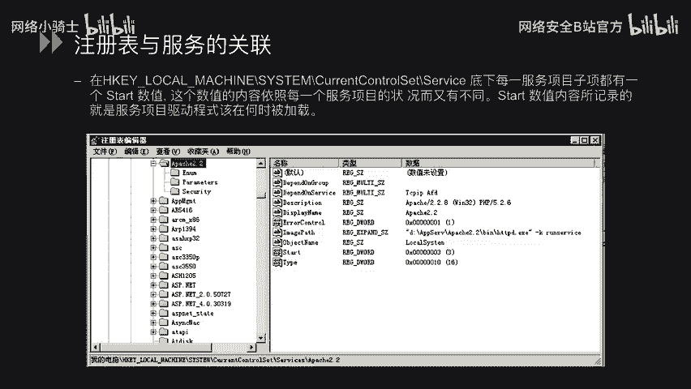

呃，下面进入我们第二个小节是进程安全。

呃，在这里呢我列出来就是一些我们的基本的一些系统进程。呃，右边呢是我直接打开任务管理去去查看的，我们可以去大致把这个进程看一下，熟悉一下我们哪些呃进程呢，是我们系统正常的一些服务进程。

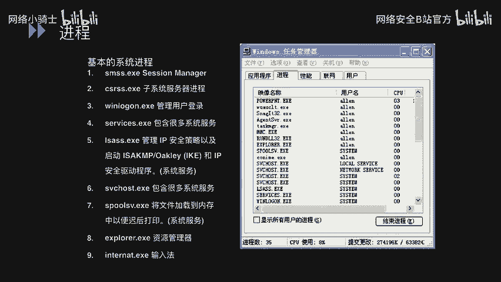

呃，再往下看，我们就是去查看这样一个对应关系，就是端口和进程的一个对应关系。有时候就是我们想起某一个复文之后呢，发现我们这个端口可能被占用了。这个时候我们通过什么方式去看是哪个进程占用这个端口呢？

下面我们就是以这个举个例子来看一下。我们通过nett state杠ANN杠ANO呢这个命令去看一下我们当前。呃，当前下面的一个端口，这个连接状况。呃，可以举这个443端口为例。

我们可以看到这标注的这一行上面我们的443端口是处于监替状态，并且它的那个呃进程ID呢是4368。我们走到进程ID之后呢，我们就去打开我们的任务管理器。

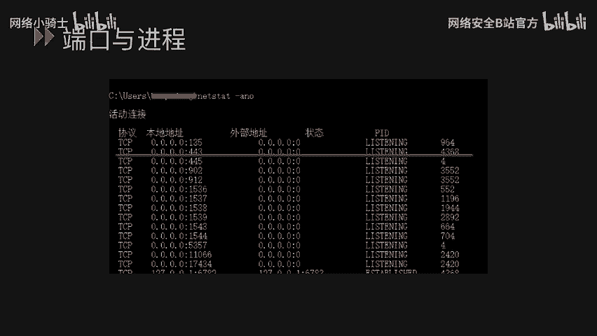

在服务这一栏中，我们直接点击的那个PID，然后让这个呃服务呢是以那个PID进行排序，然后找到我们说刚才看到4368这个PID。然后前面呢就是我们这个。

PRD对应的服务名在这里可以看到是VIM呃VM well的hosho这个服务名。

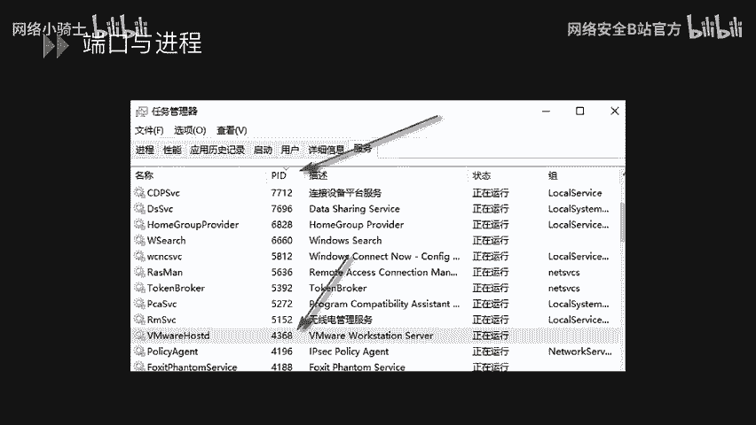

呃，下面我们看第三小节是日志审核。呃，首先我们看一下我们的windows上面的日志存放在哪些地方呢？可以看或者是它有哪些方面的日志呢？在这里列举出来的这几类。

包括我们就是我们的windows默认日志的存放位置，这个位置中可能有安全日志、系统日志、应用程序日志。还有就是除了这些呢，那包括还有我们的FTP的连接日志HTTB的事务日志的话。

是存放在另一个这个local呃这个login file这个文件件下面。

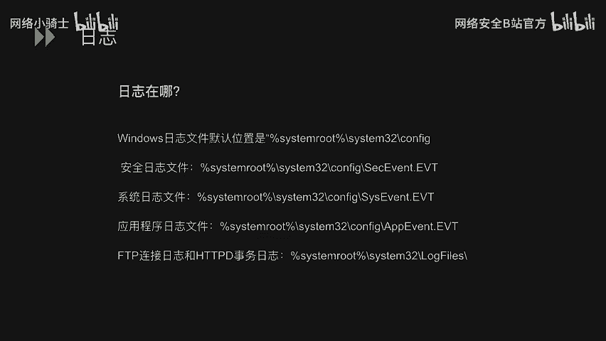

呃，接下来呢我们去具体去看一下这些日志。呃，就比如说我们刷呃通过这个命令去打开我们事件查看器。下面可以看到我们刚才所说的应用程序、安全和系统三方面的日子。

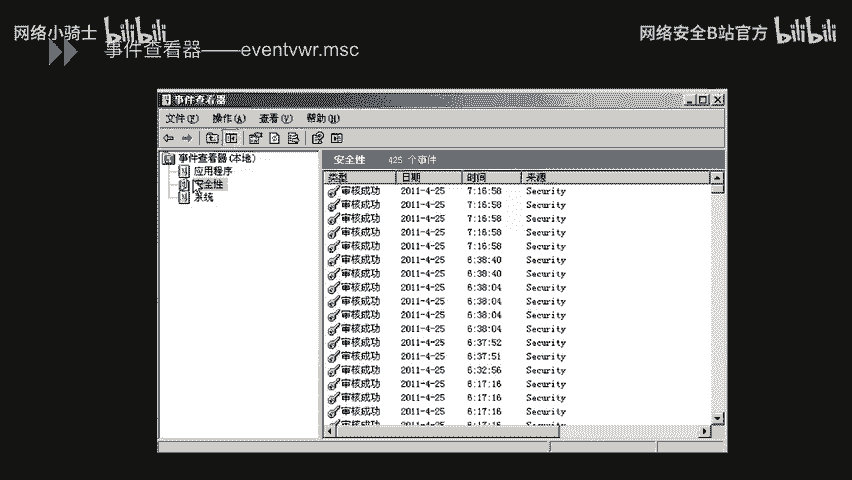

呃，下面就是看一下我们怎么去设置这些审核策略，呃，同样可以用命令sport点MSC这个命令打开我们的呃本地安全策略，在本地策略下面有一个审核策略。

审核策略呢呃右边列举出来246899个这样的一些审核策略。每个审核策略我们可以都可以对它添加那个无审核或者是只审核成功只审核失败或者是成功失败，都审核。

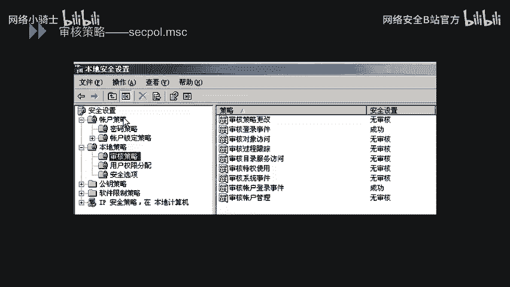

好。呃，再往下呢，我们进入第四小节是文件权限的控制。呃，再讲解我们这个文件权限的控制呢，首先有一个前提条件，我们以下的文件权限的控制都是对于那个对于windowsNTFS分区啊说的。呃，这第一点。

NTFS权限呢既影响我们网络访问问者，也会影响本地访问者。呃，第二，NTFS权限可以为驱动器、文件夹、注册表、件址、打印机等进行设置。呃。

三呃权限可以分配给用户或主不同用户或主对同一个文件夹或者是文件可以有不同的权限。呃，下面的话有一个特点，就是我们怎么把我们的呃。呃，怎么把我们的FAT或者是FAT系统呢转换成我们的NTFS系统。

当然这是一个呃不可逆的过程，就是大家在用的时候一定要慎重。

呃，文件权限的细分，我们呃看我们对一个文件可以做哪些访问呃控制方面的呃设置呢？就比如像这个这个是我们去点击那个。某一文件的属性之后，在这个安全这一栏下面可以看到的。

我们安全这一栏下面可以看到第第一个框里面是主或者用户名称。这就代表着时候我们可能对这个文件做操作的组或者用户。呃，下面呢就是我们这个组或者用户可能会涉及到的一些权限设置。

就比如说在这里我们点击那个admin trait这个组可以看到第二个框里面就是admin trait。呃，是组的这个权限可以看到分别有呃完全控制、修改、读取或运行、列出文件目录等等的信息。在这些权限中。

我们都可以选择允许或拒绝来去控制这个addmin是催的组的这个权限。

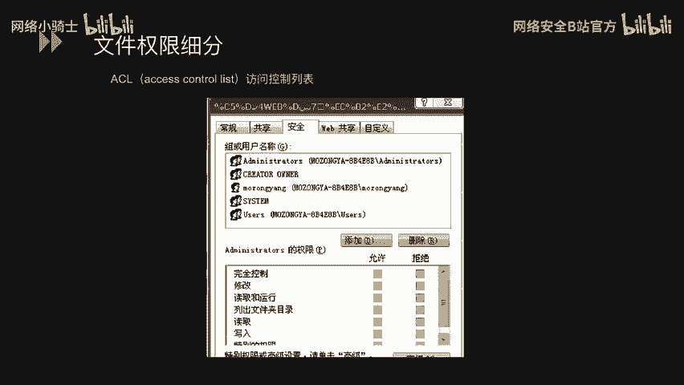

呃，下面我们看一下windows文件权限的特性，首先是权限的一个优先顺序。因为刚才可以看到，我们每种权限都允许选择、允许或拒绝两种设置方式。呃，权限的来源呢有直接设置和继承两种。

如果我们权限的设置会出现矛盾，系统会有一个优先顺序来确定权限。就比如下面我们直接设置的拒绝会优于直接设置的允许，优于继承的拒绝，优于继承的允许。呃，下面一个我们的文件或者文件夹都可能会移动复制啊。

然后对这个所权限的继承的造成影响。但之间怎么影响的呢？我们接着往下看是第一个。在同一分区内移动文件或文件夹呢，我们的权限保持不变。在不同分区移动或移动文件或文件夹呢，权限继承新位置的权限。呃，第二。

复制文件或文件夹权限会继承新位置的权限。呃，3把文件或文件夹移动或复制到那个FAT分区中呢，我们的权限就会丢失。

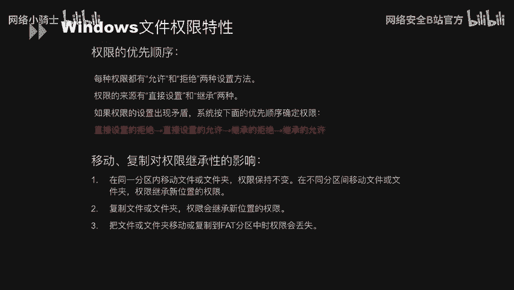

啊，以上呢就是我们windows安全配置规范的主要内容，主要涉及到的有呃系统服务。和服务于进城安全。啊，日志审核。最后还有文件权限控制。呃，这一部分内容呢就全部结束了。好，感谢大家。

