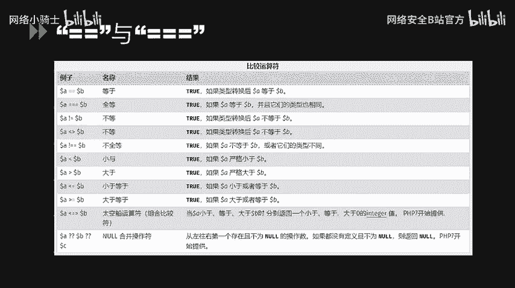
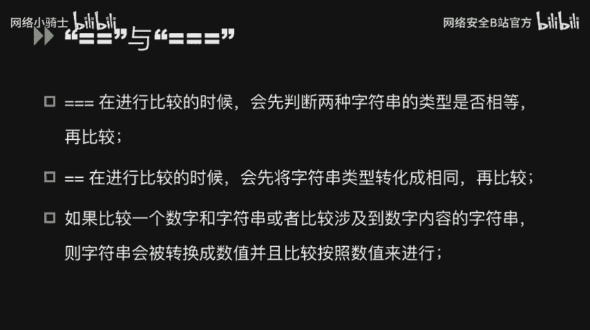
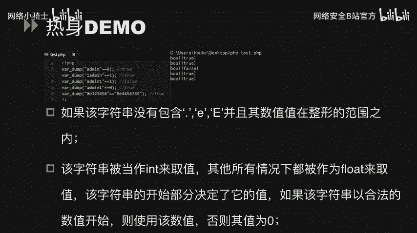
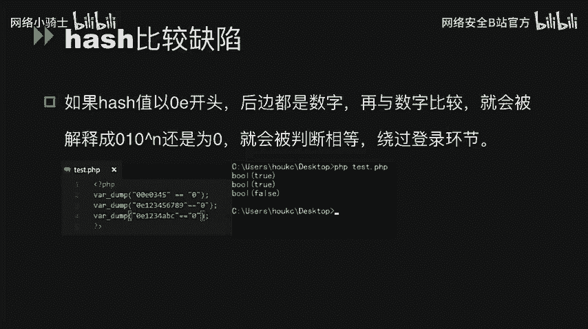
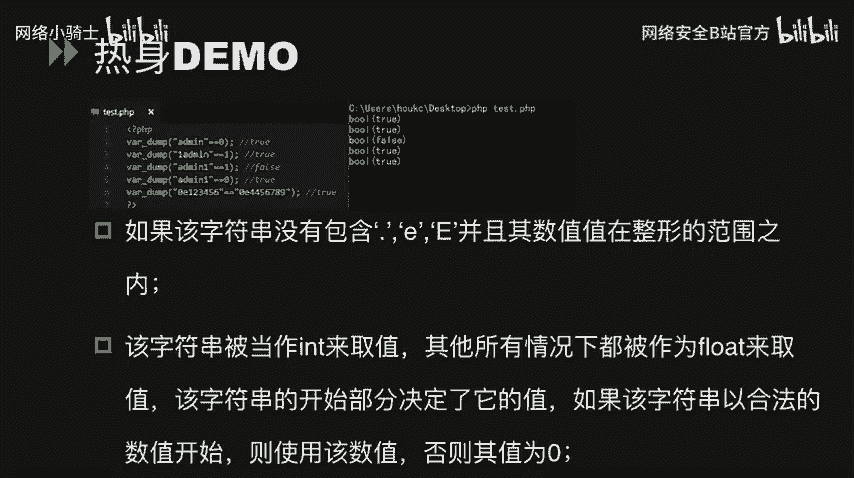
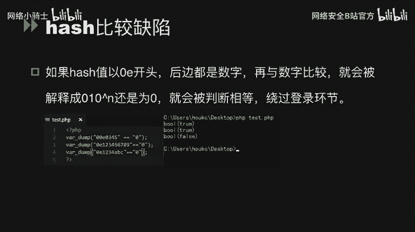
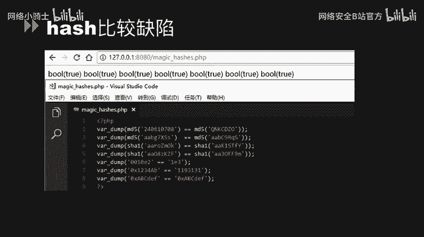
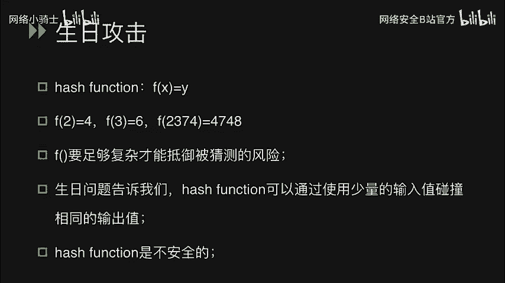
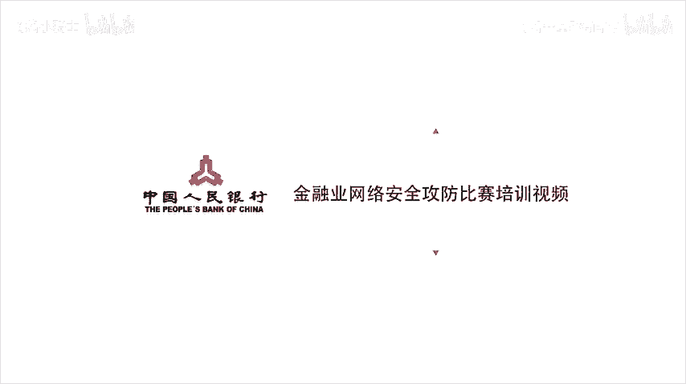

# CTF最强战队蓝莲花内部培训教程｜上千小时教程还怕学不会？ - P43：44.代码审计 - 网络安全B站官方 - BV11M4y1J7mU

大家好，今天来给大家讲一下在CTF当中的一些PHP代码审计的应用。

在CTF当中，PHP代码审计占了很重要的一部分比例。我们往往可以通过PHP代码审计来获取代码中的一些漏洞。来通过这些漏洞，我们可以绕过一些条件判断，甚至可以利用这些漏洞获取一些权限。

那首先我们来关注一下PHP当中的两个比较运算符，双等语和三个等语。那么这两个等于有什么不同呢？主要是双等于，一般我们称之为松散比较。那么三个等于我们称之为严格比较。

在PHP官方手册中有这么一个图表，我们可以在这个图表中看到一些不符合我们自然逻辑里面所认为的一些逻辑运算。比如说数值一和字符串一。他们的比较值结果没去。而零和。那比较结果也维持。那这是为什么呢？

三个等于在进行比较的时候，首先会判断两种字母串的类型是否相等在比较。而双等语在进行比较的时候，首先会将字符串类型转化为相同再比较。所以这中间会加一个字符串强转的过程。

那么如果比较一个字数字和字符串或者比较一个涉及到数字内容的字符串，那么字符串会首先被转化为数值，然后通过数值的大小来进行比较。

那我们首先来做一个热删的demo。我们可以看到这个test点PHP当中。呃的命字符串和零相比较的结果为 true。这是由于add命字路串在进行强转后，由于add means字录串中不包含任何的数字。

那么它自然会被强转为0。那么零和零比较自然就是 truee。一admin和一相比较，结果也为主，那是因为一addmin。的首歌字符。为一，那么一addmin的字符串强转后就会变成一。

那么一和一比较就是去。addmin一由于它的首个字符为AA这个字符上进行强转后为0，零和一不相等，那么就为foralse。所以addmin一和0相比较，结果这为赤。

那0E123456和0E4456789。这边比较的过程当中，实际上是用到了1个PSB当中的哈希缺陷。

这个哈希比较缺陷是在如果哈希值以0E开头，后边都是数字。就会在于数字比较，那么就会被解释成0的0乘以10的多少次方。

那我们看刚刚的0E12356，实际上就是0。乘以10的123456次方。那实际上还是等于00乘以10的4456789次方还是等于0。那么这两个值比较结果也为出，那就是很正常的。

我们可以一般利用这种。比较值来绕过一些登录凭证的环节。

我们可以看一下一些哈西比较的。魔法列表。我们看到MD5对240610708做MD5运算以后，和QNKCDZO。做MD5运算实际上是相等的。

是因为240610708做MD5运算以后是0E开头QNKCDZO也是在做MD5运算后会变成0E开头的一串字符串。那么其他的也有，还有SHAE做。哈西运算后。以及一些十六进制运算。

它都是运用了哈西比较缺陷的原因，可以导致他们。原本是不一样的组转，但是可以通过松散比较结果为 true。

布尔欺骗就是当存在jasondecode和un seriesless这个两个函数的时候，部分结构会被解释成布尔类型，也会造成欺骗。我们看一下这两个demo。那第一个都没。

我们可以看到这边使用了jason抵code的这么一个函数，对jason string做进行了处理。jason jason string里面是一个user和pas两个字段的。这份结构。我们对user这个。

就不帅。赋予at命。这个值对pass这个。磁符串变量赋于security这样一值。在进行。jason抵code以后再进行比较以后，我们可以发现他们比较成功，就是因为他们比较结果就会成。布尔类型维持。

我们看第二个t的点PHB案例。我们可以看到这边用un series反序列化函数，对un series string这么一个字符串进行了一个反序列化操作。来对这个反修R自助串进行操作以后。

我们可以看到我们给这个反修录R自助串中的us色变量复制为addmin，给pass变量复制为security。最后再通过松产比较的时候，也会。结果输出为 true。

这边也是用到了un seriousize这么一个字符串。在进行结果解释的时候，变成布尔类型，造成欺骗。

数字转换器骗。数字转换起点就是将字符串变成数值。的情况下。存在的一种欺骗问题。我们看一下这两个电报。第一个。我们将字助串2用interver这个。函数进行数字转换。那么它自然就会变成2。

那3ABCD这么一个组转，用interver。这个函数进行强转就会变成3。那ABCD和之前我们用虽然比较的那个原理是一样的，它就会自然会就变成0。

那么接下来看第二个des点PSHB这个demo123456这个字符转和0差1E240。进行比较。那你可以看到它也是结果为处。这边是一个布尔类型的气片。我们再看一个电报。我们可以看到在第一个demo当中。

我们赋予UCID这个变量为0。99999。然后。将这个userID。和一作为比较。比较成功的话就会进入分支。分制以后会执行SQL语句。那这边实际上0。999999和一这个字符串进行比较的时候。

会把一字符串强转为一，然后会发现这边会出现1个PSHP特性，0。99999会和一相等，这边就使用了一个数字转化的一个欺骗。钓个日没。我们可以看到这边。通过用户输入输入1个UID参数的值。

会和一数值进行比较。那么们输入UID等于1。1，会发现1。1和一数值比较结果为持。这边同样也是利用了数字转化的欺骗。接下来会讲一些关于PHP函数当中的一些松散函数的类型。

第一个是 screen compare。str compare是将两个字符串进行比较的一个函数。str一是第一个组转，str2是第二个组助转。如果str一小于str2，那么就会返回一个小于零的值。

那么如果str一大于str2，那会返回一个大于零的值。那么如果两者相等就会返回0。但是如果这个时候我们在输入值的时候。不给strer赋予一个自由上，而是给str2赋赋予一个。数组，那么结果会怎么样？

我们看一下demo。在test点PHB当中，我们通过。T这个参数获取一个数组。然后我们将。T这个变量和这个我们输入的T参数值进行比较。也就是说将一个字符串和一个数字比较可以看得到。

我们进入了welcome这个分支。也就是说这两者比较结果为。零。MD5MD5函数描述的是strMD5这么一个函数，它实际上是对自助转做1个MD5处理哈西处理。

所以MD5中需要输入的参数是一个spring类型的参数。但是这个时候如果你传递一个数组类型的参数的时候，MD5并不会报错，只是无法正确的求出数组的MD5值，这样就会导致任意两个数组的MD5值都会相等。

我们可以看一下demo，我们有两个数据，一个是ever一，一个是ever2。那么这两个数组可以看得出来。完全不一样。然后我们通过MD5将air一和air2做处理，然后进行松台比较会发现。

结果是输出了布尔类型的ch。生日攻击谈到生日攻击，我们首先提到比较著名的生日问题，也就是说。在N个人当中，我们随机选取K个人。当K为多大时，能保证K个人中有两个人的生日是相同的。

一般我们可能会认为这道题的答案就是366或者365，这样子就肯定会有两个人的。答案呃，两个人的生日是一样的。但是其实从统计学的角度来看。这个K这个值是远小于366的。在计算过后。

我们可以发现K等于70的时候。其中就有两个人拥有相同的生日，这样的概率高达99。9%。K的100的时候概率可达9。9999%7。所以说并不需要K等于366的时候，我们就有两个人的相同。

所以并不需要K等于366的时候，就可能在这么多人当中就有两个人拥有相同的生日。那么们再回到我们的PHE代码当中。我们在做哈希函数的时候，我们往往是需要这个哈希函数的结果和它的输入值。的。

规律没有那么明显，才能达到我们想要的哈希的这么一个。处理效果。比如说我们给出这样一个哈希函数F。F2等于4，F3等于6。F2374等于474吧，我们可以看得出来。

实际上这边的哈希处理其实就是FX等于2X。而这。不符合我们对哈西函数的。要求。所以说哈希函数要足够复杂，才能够抵御被猜测的风险。那深日问题告诉我们，哈希函数。其实再复杂。

也可以通过使用少量的输入值碰撞来得出相同的输出值。由此我们可以得出一个结论，哈希函数是不安全的。

