# CTF最强战队蓝莲花内部培训教程｜上千小时教程还怕学不会？ - P4：4.CTF赛制介绍工具介绍 - 网络安全B站官方 - BV11M4y1J7mU

来都打开了，那我们就开始吧。毕竟工具也不少。

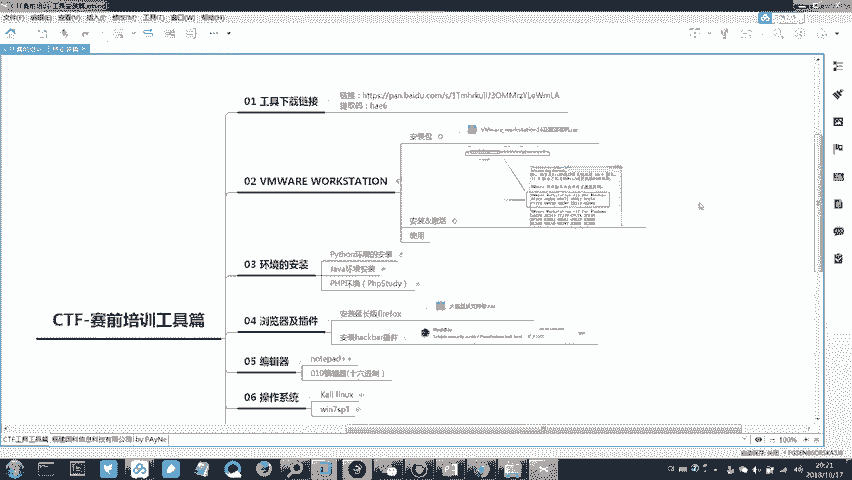

，首先我们首先我们要讲的第一个工具就是we one这个软件有用过的吗？

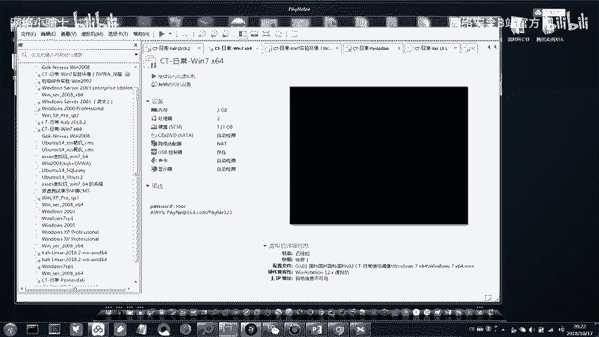

对，这个这个软件。然后大家打开一下，如果自己之前就有安装了，看一下是不是14版本，不是的，全部卸掉，然后混成我给的那个版本。查看版本信息的话，在帮助里面有一个归鱼。

然后关于里面它这里可以查看一个版本信息。如果你有的话，看一下是不是十四的版本。如果没有的话，那待会儿。啊，那继续听就好了，待会我们会安装。比如像这个。の屋の。呃，你的mark你的是装的是mark克版的。

还是还是刷成windows？晒啲本啊。瞓装。🎼哦，我我是说你你这个macbook的话，你现在用的是苹果的那个系统啊，还是windows的？Windows的。喂。然后我这边心。15的。

可以啊。那就放着吧，那就放着那就放着，写放正14个。

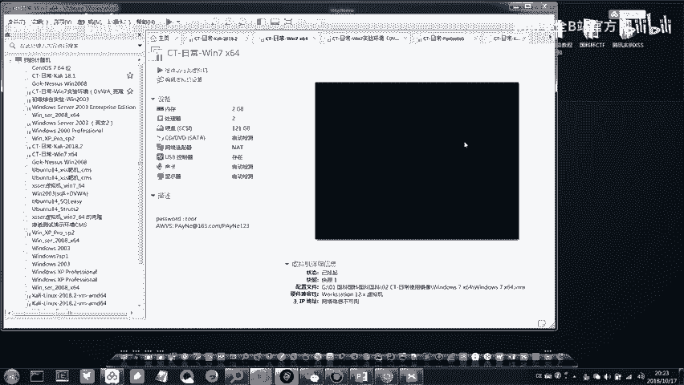

不用不有，没这么夸张没那么夸张。我们我们也不是那么不人性化，实5的就放着吧。他只要能够金融高的版本的就可以了。那接下来的话我给大家大概的说一下这个软件。有的同学可能用过，但是有的同学可能还是第一次用。

那我给大家大概的说一下。这个软件它的一个功能。首先这个软件安装好了之后，它是这样的一个界面。要不我还是先说一下怎么安装吧。

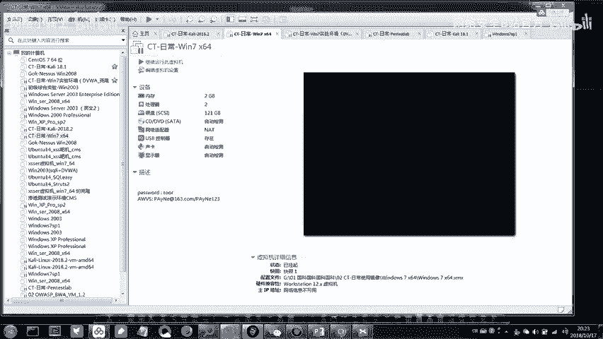

其实安装的话就是像我在群里面说的，你们安装这个软件的时候，有下一步点下一步有确定点确定，然后遇到激活的时候。我在给你们那个文档当中，你们解压了之后，它应该有一个win的所有版本的永久许可证激活的密钥。

对吧？那这个密钥里面没有，它像这个里面密钥里面它分14版本和12版本的。我这里给你特别用一个框给你框出来了。用这个14版本的。这个14版本里面这两个随便选一个，然后就可以做一个激活。然后安装好了之后。

打开它的一个界面，大概就是这样的一个界面。比如说我们想我给大家还给了大家另外两个虚拟机的文件。我给大家的那个文件里面有一个是卡利的这个。然后另外一个的话是。下面呢有一个win7的。

那么给大家这这两个文件的话，它是点VMX的文件，不是ISO的镜像。所以说只要是点VMX文件，你只要用vim one这个软件打开就可以用了。那么如果以后你们觉得说自己想去尝试一下自己安装的话。

那么你去网站上下载一个点ISO的镜像，下载的网站，你可以去那个I tell you的那个网站上下。然后我给大家的文件都是点VMX的，就是我已经安装好了，大家只要打开就可以用。那打开的话是在这边。

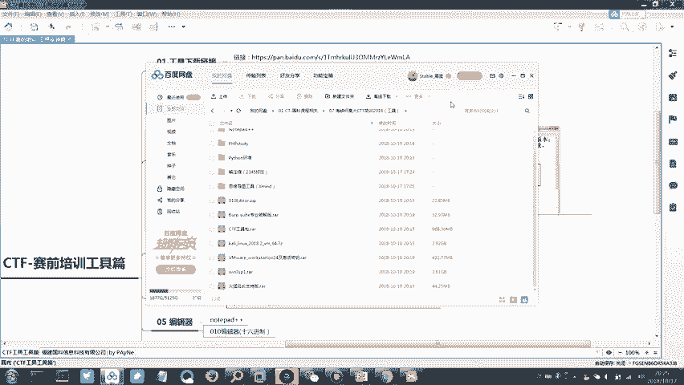

在这边有一个打开，然后我这边的话是。我这边的话是连接了一个移动硬盘。反正学我记得要学了信息安全之后，我四个盘好像都红了，然后有点不够用，接外接了个2T的。

然后我们可以找你可以把你的那一个虚拟机的文件把它解压，解压了之后，在这个软件当中点击打开，点击打开之后，你会发现本来它应该有很多这文件的，但是能被这个软件识别的，就就只有一个，然后你把这个软件打。

你把这个一个文件把它打开，打开之后，那么它的一个相关的虚拟机它就会显示在这里。因为我这边虚拟机稍微有点多，所以说看起来可能会有点乱。那你们打开之后它就会显示在这里。然后上面它这个窗口是可以左右调的。

那么它这个软件V one station的这个软件呢，它是一个呃虚拟化的这种软件，并且这个是家庭版的。我们在企业当中，有时候有的企业他也会用到企业版的这种虚拟化平台。那这个的话是家庭版的。

就是方便给我们个人用的那它里面我们所说的虚拟机，它与我们的真机它是有隔离的。就是说哪怕你的虚拟机中毒了，你的真机它是不会有什么影响的这也就是为什么强调说一定要让大家用虚拟机的原烟。

因为后面给大家的这1个CTF的工具包。

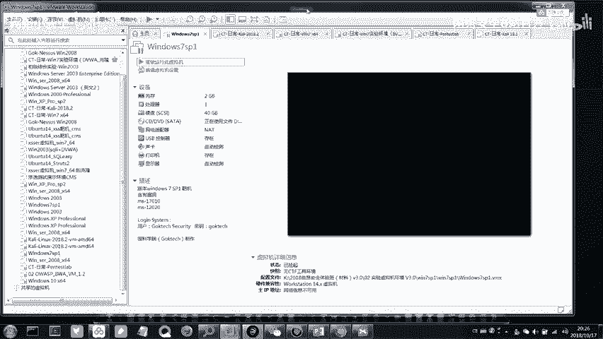

有的软件有可能会有变毒。那所以说到时候大家把这个工具包全部放在我们的虚拟机里面。记住啊，我已经说过了，已经特此声明过了，就是大家之后要把这个CDF的工具包。

到时候把它放在winwin7的这一台虚拟机当中。因为如果说有什么病毒啊之类的话，或者说有后门的话，那么也没关系。因为是在虚拟机里面。

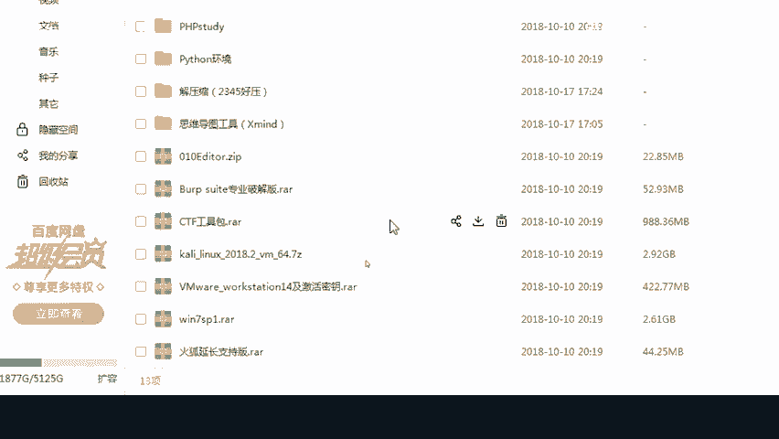

如果说像我一样，觉得没什么关系的话，也可以放在蒸汽的桌面上，反正我是觉得无所谓。但是我就已经声明过了。后面你们如果放在自己桌面上，然后又出问题的话，不要找我好吧，我是已经跟你们说过了。

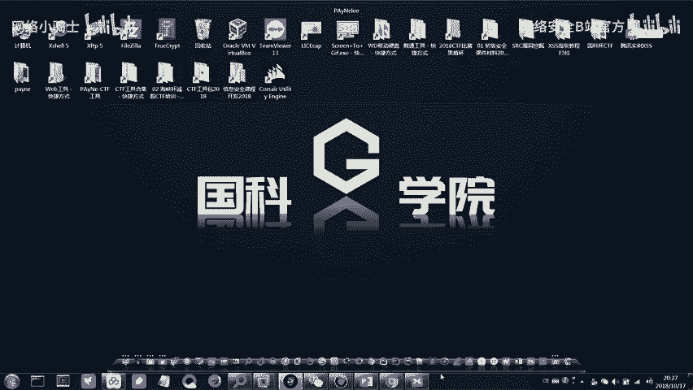

。那么这个的话就是微vo5选的这个软件。那接下来我们来看一下它的其他的几个功能。

它这个软件其实是非常强大的。我们打开了一个winIN7的虚拟机之后，你可以点这里有一个运行虚拟机。

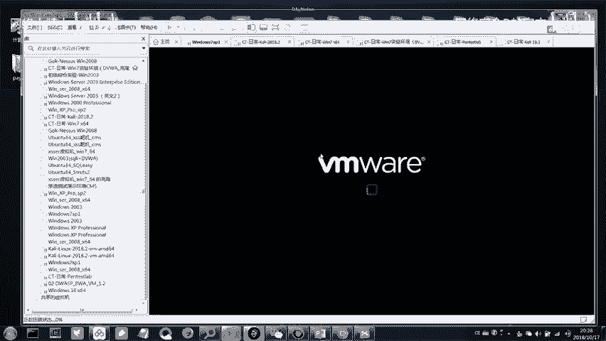

然后它这个虚拟机就会打开，你会发现在里面又会有一台winI7，虽然说在win7上又装了一台WwinN7，有点神经病，但是。因为winI7的很多权限问题会比较少。相比win10的话。

所以说我这边给了大家一个winI7的。

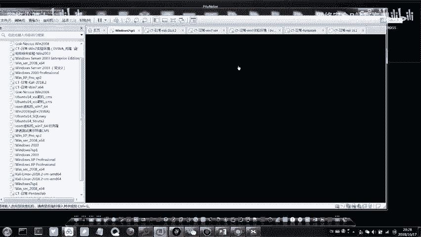

打开之后，那就相当于说在我们的我们本身的这个系统，我们把它叫做真机。然后我们wem one station这个软件我们打开的这个我们把它叫做虚拟机。然后在虚拟机里面的话。

它的一个使用的话和我们正常的操作系统是一模一样的。然后在你打开了一个虚拟机虚拟机之后，有时候你会发现它的这个窗口非常小，但是你不要去调这个系统的，它的一个分辨率，你可以点击这里有一个查看。

它有一个立即适应客户机。那你只要点立即客适应客户机之后，那么它会自动的匹配你这个窗口的大小，那么看起来会比较舒服一点。那么我们的这个虚拟机它还有几个功能也是比较强大的。比如说这里它有一个快照的功能。

什么叫快照呢？比如说现在我这里桌面上我有一个拍on的安装包。然后我现在就现在的这个状态，我可以建立一张快照，建立了快照之后，我可以把它命名，然后给它起一个名字。

那之后如果我不小心把python的这个安装包给它删掉了，那如果我想恢复的话，你只要点击恢复到你刚刚建立的那个快照，那么python的这个安装包，它又会出现在这个桌面上。那所以说它就是。给了你一个。

时光倒流的这种机会，那就是说还挺好用的，挺强大的。但是尽力快照的话，它会增大你的这个虚拟机文件的大小。就好像说哎就好像大家看到我这个盘里面全是红的，为什么？就是因为我这边虚拟机非常多。

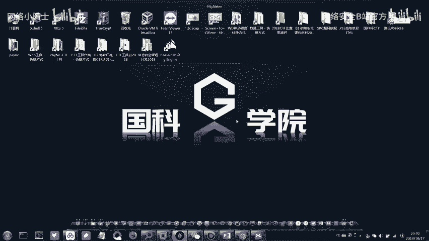

我左边有超多的这种虚拟机，然后虚拟机有时候在里面安装一些软件，然后或者说我进了一些快照，它就会占用本地的这种硬盘的大小。那么这个的话就是它的快照的一个功能。然后点如果我们点击它右键，它这里它有一个设置。

然后它的这个设置里面的话。它可以分配给他分配内存。我们的虚拟机和我们的真机，它是这样的关系。如果说你给它，我们它是需要占用你本真机上的硬盘的这种容量的，但是这个容量是由你一开始给它分配的。

然后比如说你一开始给它分配，它最大能够占用的容量是40G。那么你这个虚拟机再怎么在里面装软件，它最多它的极限就是40G。如果超过40G，那么你在里面它就没办法安装这个软件了。

然后它的内存和处理器也是可以分配的。比如说我这一台虚拟机的话，给大家分配了2G的内存。因为我这边的话是16G内存，所以说我这边分配了2G。那如果大家是4G或者说8G内存的话，你可以把这个内存调为一G。

因为如果说4G内存的话，基本上跑两个虚拟机，你电脑可能要爆炸。那就是大家可以根据你的那个电脑配置，相应的把这个虚拟机的内存调小，或者说调大。如果是32G的话，没关系，随便来好吧，当我没说。

随便调都没关系的。と买。那么这个就是基本上win one这个软件经常我们使用到的一些功能大概就是这样。如果说你感觉卡电脑卡的话，就把这个内存调低一点。如果觉得还行，还ok的话，把这个内存调大一点。

使用起来会更顺畅一些。那么如果说我们要在我们的虚拟机。和我们的真机之间，我们想要复制文件的话，怎么来做呢？挑啊。我们需要安装一个叫做wemo tos。我们还要安装这个工具是吧？挺麻烦的。

所以我帮大家已经安装好了，大家只要打开，然后都可以用，这个也不用重新安装。你只要打开之后，你就可以把我们外面的我们真机上的这个文件，你就可以把它复制到我们的这个虚拟机当中。虚拟机当中的。

你也可以把它复制到我们的真机上。所以说这样的话，安装了这个工具之后，还是比较方便的。如果说有的时候我们安装了这个工具之后，你发现好像。那个复制粘贴有时候会不起作用，那怎么办？重启大法，先重启一下。

如果发现重启了之后还是不能用，怎么办？重装一下，把这个vimo tos这个工具重装一下。它重装其实很简单，你只要点一下它的重装，它就会在这个虚拟器当中自动安装一个程序，你只要点下一步就可以了。

那如果说重装了之后也没用呢，怎么办？没有没有没有。没事砸自己的，可以不要砸别人的就好。那我们还有另外一种方法，那就是我们可以建立一个共享文件夹。什么叫共享文件夹呢？我们可以建立一个文件夹。

然后我们的虚拟机和我们的真机它是共享这个文件夹的那这个共享文件夹的话，其实使用起来也更加方便。比如说我这里尽力了，我们可以添加一个共享文件夹。然后在主机路径当中。比如说我在我真肌的。

比如说我在我的真机上，比如说这个硬盘当中，我新建一个文件夹，比如说test。OK我把这个文件夹当做是我的虚拟机和我的真机来共享的一个文件夹。那么我待会儿我只要往这个文件夹当中放东西，那么我在虚拟机当中。

我也能够访问得到。那接下来再点一个下一步。呃，我新建一个刚刚命名，好像没成功。我们建立一个共享文件夹之后，它就会在这里添加添加在这里。那么你就会发现这里它多了一个共享文件夹。

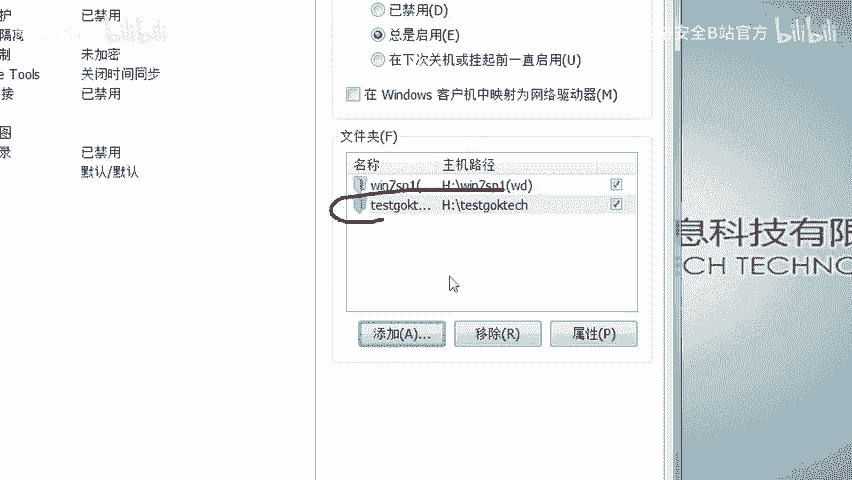

那么现在共享文件夹就建立成功了。那么在虚拟机当中，我们还需要把这个共享文件夹映射到我们这个虚拟机当中。不要防映射的话，其实就是点一下鼠标就可以了。我们在我们的这里有一个映射网络驱动器。

然后在映射网络驱动器当中。我们选择一个共享的文件夹，在这里点击。比如说刚刚的这个sre点 photos，那就是共享文件夹，然后点击确定。那接下来的话，他这个文件夹。我刚刚建立的这一个文件夹的话。

它就会能够实现一个共享。那我们就可以。来试一下。

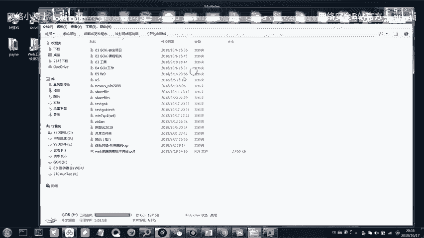

嗯。我先看一下这个讯息。

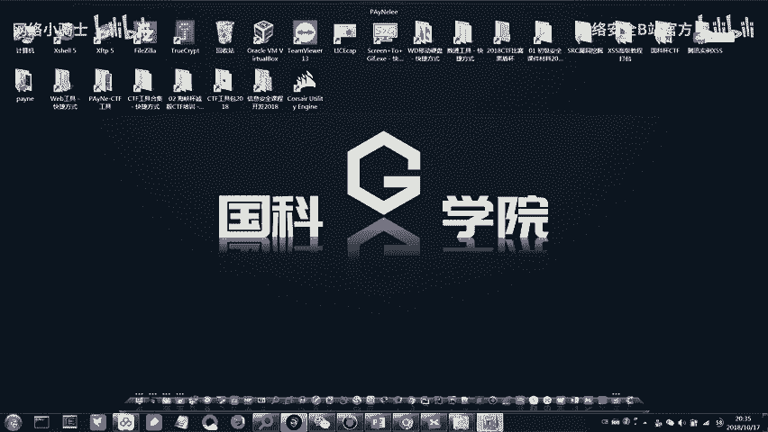

我硬盘当中的这里的这一个test，然后GUKt的这个文件夹是我刚刚在虚拟机当中开启的一个共享文件夹。我们可以在里面新进一个文件夹，比如说test。新建一个文件夹之后，我们现在是在真机上。

那接下来我们去虚拟机里面看了一下。在虚拟机里面的话，你就会发现它这里它会多出来一个哎。他好像哦应该应该要重新映射一个。因为我之前有建立了一个共享文件夹，那他这边需要重新映射一个。看一下这。啊。

要不用之前我我尽力的一个给大家演示吧。呃，这个文件夹的话就是我之前建立的一个共享文件夹。那么这个共享文件夹的话，那就是我在我的真机上我放了一些安装包。因为有时候那个wos，它有时候会有点毛病。

那这时候我们用这个共享文件夹，我们在里面放一些工具包的话，我们在真机上放。那我们在虚拟机里面同样也能够访问得到。那这样的话就比较方便。那这个就是我们把文件从真机放到我们的虚拟机当中的两种方式。呃。

然后接下来的话，那我们就。继续往下，我们是继续往下讲，还是说大家先把这个软件先安装一下，试一下。继续讲是吧。一边讲一边装嘛。可一这要匙。呃，要不我把下面的这这几个讲好，讲完，讲完之后，然后大家安装一下。

有什么问题的话，再问一下我这边。那接下来的话就涉及到我们的一个环境来安装。那环境来安装的话，第一个的话是需要安装一个python的文件。

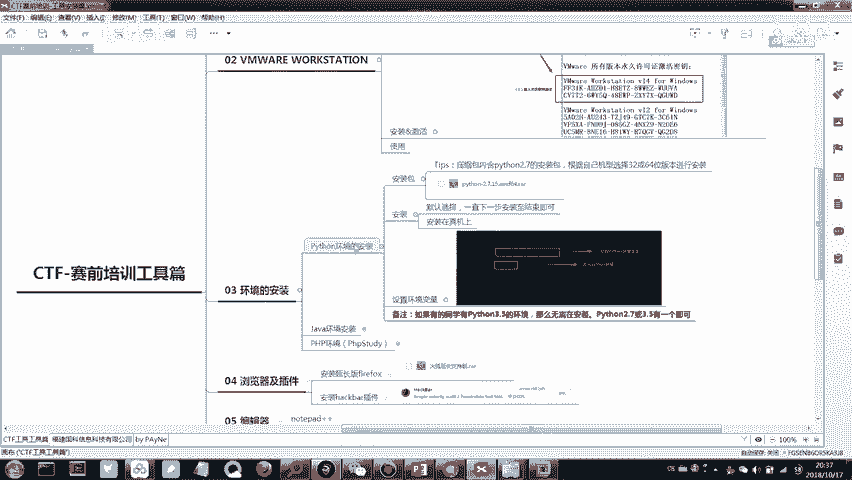

为什么需要安装一个python的环境呢？因为有时候我们需要用到python里面的，比如说一些内置函数，或者说是。

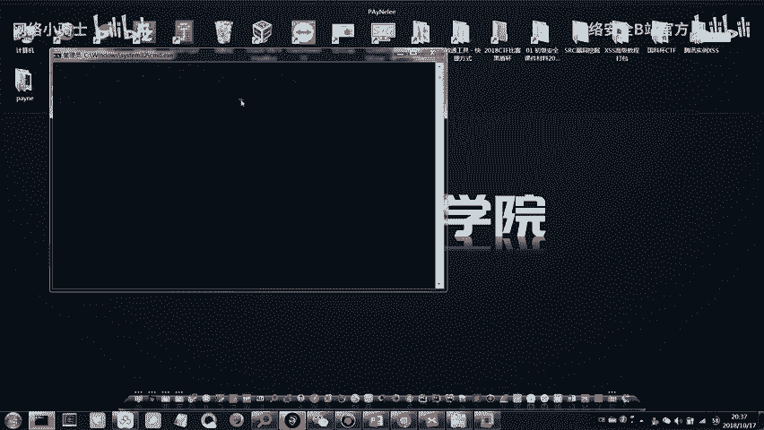

有点小是吧？用到pyython里面的一些内置函数，或者说是有时候我们需要用pyython来跑某一个脚本。这个脚本不一定是你自己写的，有可能是你在做题的这种过程当中自己收集到的这种脚本，但是它是万能的。

那么这时候你就需要用pyython的这种环境来跑。

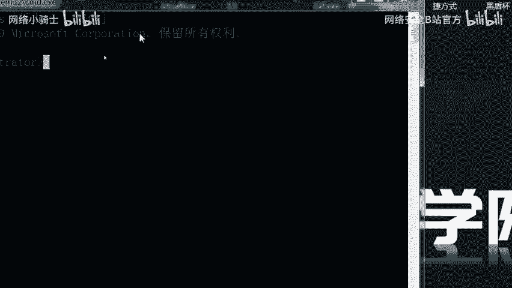

那比如说给大家先看一下。如果你在本地安装了一个python的文件之后，并且你添加了文键变量，那么最终它就会可以实现这样一个效果。你可以windows加按打开我们的windows的一个dos界面。

然后在doss界面之下输入相应的那个文键设置的python文键变量的名称，然后它就能够呼出这个界面。那么在这个界面当中的话，我们就可以来比如说使用它里面的一个准。它里面的一个转化的一个函数。

它可以把我们的字符转化为阿K码，或者说是把我们的。数值转化我们数值转化为相应的字符。那就是说它还是挺方便的。因为我们直接添加一个横截面量，然后如果你用习惯了之后，windows加2。

然后呼出这个CMD输入1个CMD，然后呼出这个dss界面还挺方便的。不管说是查看我们的IP地址啊，是吧？

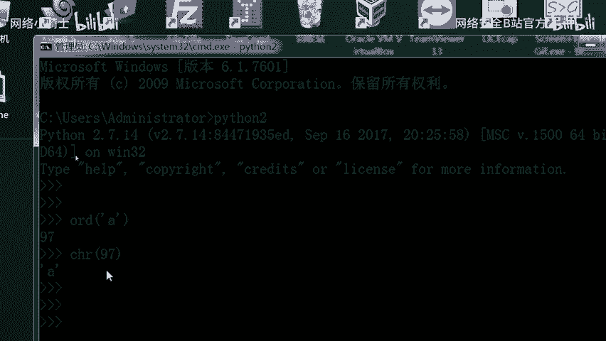

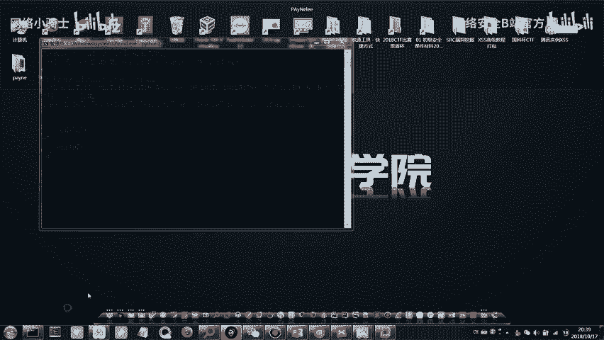

那至于安装的话，怎么来安装呢？我们可以来看一下。他安装的这个过程的话，给了大家一个安装包。

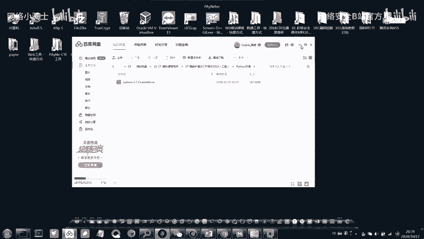

大家应该都有下载好的。给了大家一个安装包，它是你把这个放大一点。是这样一个安装包，这个安装包大家把它解压了之后，里面应该是有两个版本的，一个是32，一个是。嗯，64的大家根据自己的笔记本。

不过大家应该基本都是64位的那到时候大家这个软件安装的话是没什么问题。大家只要一直点下一步，然后全部用用它默认的选项安装完成之后就可以。关键是它需要添加一个魂键变量。那么魂境变量怎么来添加呢？

我这里给大家截了一张图。你大家打开大家打开我们的一个先，打开我们的一个windows的do界面。然后windows的 do界面的话是windows2，然后加上1个CMD，然后就可以呼出这一个界面。

呼出这一个界面了之后，然后你照着我上面的这个圈。

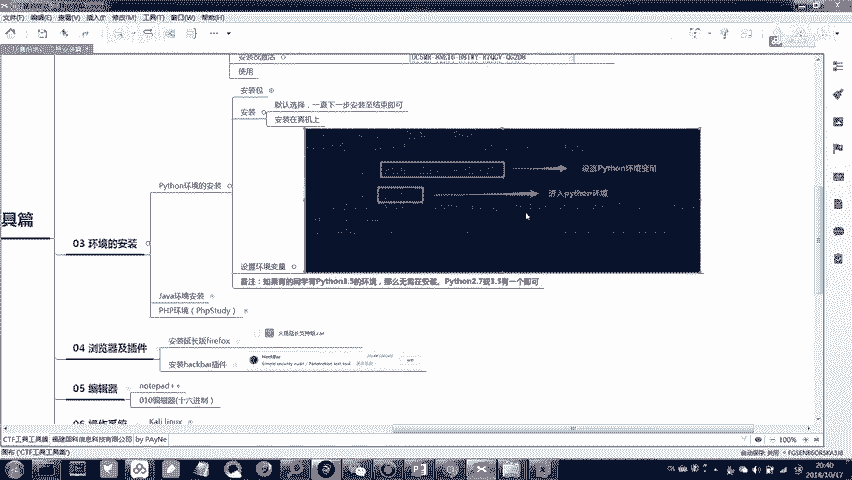

前面的这个pass等于pass的话。前面这个pass等于pass的话，你照着敲，然后后面的这个它是一个python安装的路径。那么你安装在哪个盘，你的那个pyss安装在哪个盘，安装在哪个路径。

你就相应的把路径补充在后面就可以了。就是说有时候你可能安装的盘和我的不一样，那么这时候你路径就需要改一下。然后你改完了之后，那么接下来你只要输入一个pyython。如果它能够。呼出下面的这种界面。

那就说明你的这个我们所说的环境变量，那么就添加成功了。

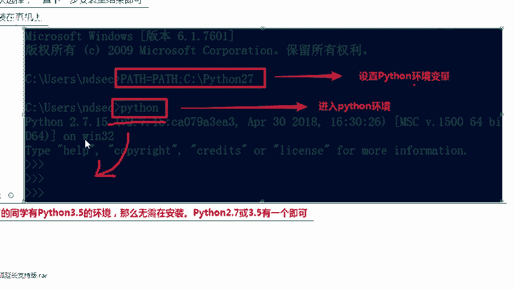

那python的环境的安装的话，大概就是这么一个步骤。我在这个上面都有写，都有截图，大家可以看一下，照着安装一下。如果有问题的话，待会儿再叫我一下。呃，如果有的同学自己平时有用pyython的话。

如果你用的是3。5的话，那么有就可以了。2。7你就不用装了。如果没有的话，那就装一下。就是说P那个pyython3。5或者说2。7，你随便装一个都可以。那上面这一个是python。

它的一个环境的一个安装。那接下来的话就是java它的一个环境安装。

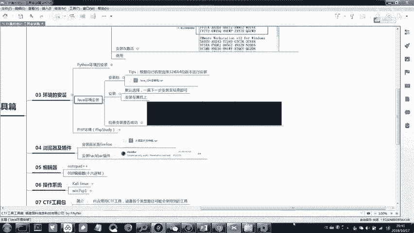

java的一个文件安装的话，同样的给到大家一个安装包，也是有上市2位跟64，大家自己选选一下，然后安装安装的话。安装的话也是一直点下一步，然后一直到结束就可以了。我这边其实都有一些说明。

甚至每一个文件应该安装在真机上，还是安装在虚拟机上，我这边都有备注的那大家就是这个脑图，到时候大家看的时候稍微仔细一点。有什么问题可以先看一下脑图，然后脑图上如果没写的话，再问一下我，好吧。嗯。

这个dva这个环境安装的时候，到某一步到最后一步的时候，它安装可能会慢一点，但是没什么关系。你稍微等一下，然后它安装成功了之后，你同样的把我们的那个ds界面打开。然后检测一下，你输入一个dva。

然后杠visson，就是查看一下我们的这个dva的这个环境，它有没有安装成功。如果安装成功的话，它下面会显示出来相关的这个dva的它的一个版本以及其他的一些dva的信息，它会显示在下面。

那这边有给大家截了一个图。

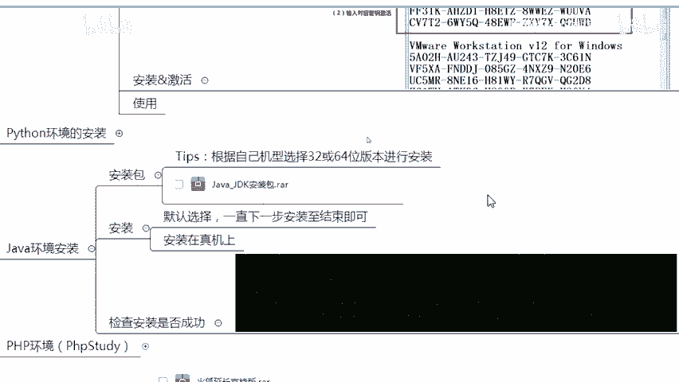

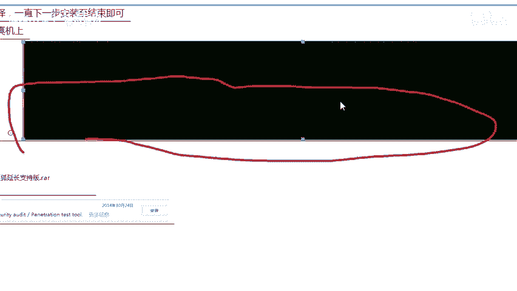

那这个的话就是java环境，它的一个安装。那下面还有1个PHP的文件，那PHP的文件就安装，它就需要另外一个软件。PHP的这个环境的一个软件，它是叫做PHP study。如果是做开发的同学。

那应该对这个软件还是会稍微熟悉一点。呃，这个软件它是什么样一的一个软件呢？我们都知道我们在开发一个网站的时候。我们在做测试的时候，我们是需要一个服务器环境的。什么叫服务器文件？我们所说的后端的这种文件。

那么服务器红键的话，它就包含很多东西，很多组件。比如说我们的中间键阿帕奇。以及我们的数据库，比如说mys克，然后我们的操作系统，比如说lin尼是。然后以及我们的一个开发语音的执行文件。比如说PHP。

那么如果说我们想要自己去搭建一个这种服务器文件的话，每一个插件我们都要去安装非常麻烦。而且你如果相互安装了之后，那个金融性有问题的话，他也是呃会有很大的这种毛病的。

所以说网上就有人他自己写了一个这种软件。那这个软件的话就集成了我们这一些插件。当然系统的话，我们用的是windows，只是说这里举例的话，用linux。因为现在很多的服务器它都是底层的系统。

它都是lininux。然后我们这一次安装的话是用windows这个操作系统。它就是一个集成的服务器文件，只要无脑的一件一件的这样下一步的安装，就能够安装成功，不用做过多的这种配置。那当然在安装的时候。

就把这个安装包给它解压一下，然后解压一下之后，你安装的时候，它会提示你选择什么语言之类的那选选一个整体中文，然后一直下一步安装就可以了。然后关于PSHP3里这个软件安装的话，有一个问题。

我这边在脑子上有写，如果说你这个软件安装了之后。它会给你浏览器上弹出来了一个网页，然后还会给你弹了一个窗口，提示说你的系统没有安装这个库的话，那怎么办呢？

你们就把我给的那个PSP萨底的文件夹里面有一个叫做。32位VC9和1114的运行库把这个库也安装一下，那么他接下来他就不会再弹这个框了，它这个框它就不会再弹。那这个的话。

根据个人的操作系统的那个情况来垫。如果说它有弹框，你就把这个库安装一下。这个库的话，它也就是像软件一样的，只要接受一下相关的协议，然后点击下一步最好安装就可以了。最好是用它的默认的路径。

不要用中文的路径，像这些软件，你们大家尽量都用英文的路径。如果它有默认的话，你这样用默认的就好了。因为你一旦出现什么中文路径之类的，它就很容易出问题。那这个的话就是PHP的一个语言的执行文件。

那下面的话还有一个浏览器需要大家装一下，我知道大家肯定都有浏览器的。但是还是需要装装一个，我们大家现在用的是什么浏览器？360极速浏氧器是吧？那么大家装一个火狐，然后这个火狐的浏览器的话。

它不是最新版的火狐。它是以前的一个版本的，就是说老版本的一个火狐。为什么说要用老版本的火狐，而不用最新的版本呢？因为我们下面需要安装的一个插件，我们想要使用的一个插件，它只有这一个版本，它才支持。

它才金容。所以说给大家的安装包里面的那个火狐浏览器的那个安装包，它是一个老版的。如果你自己有用火狐的话，你那个火狐应该是最新版的，那你可能需要把最新版的火狐卸载一下，然后装一下这个隐长版的火狐。

当然在使用上是没有什么区别的，都是用来搜索一些东西，然后输入一些网址嘛。所以说大家安装一下这个隐长版的支延藏支持版的这个火狐浏览器。然后安装了我们的这个火狐浏览器之后。

大家需要在这个火狐浏览器上面安装一个插件。那这个插件叫哈爸，怎么安装呢？给大家看一下。在这个火锅浏览器当中，它这里它这里有一个叫做附加组件。它这个附加组件当中呢，你可以在扩展这里搜索一个哈克霸。

搜索一个哈克霸之后，你会发现你搜索出来的结果里面有好几个哈克霸，那装哪一个呢？装我脑图里面截图出来的这一个。截图里面给的这个哈克霸的话，它是14年的一个组件，一个插件。

那这个插件的话是最好用的那到时候大家在搜索搜索出来很多结果的时候，记得要安装2014年的那一个。因为这里它有的，比如说它这个哈克霸的插件，它是18年发布的。18年7月，然后18年3月。

那么大家到时候安装14年的那个哈克巴的插件。那这些基本上我刚刚在讲的这些所有需要注意的点，我在脑图里面全部给大家写出来了。那大家只要稍微仔细的看一下，都没什么问题。那剩下的这一个编辑器的话。

note pad加如果有写代码的，这个应该呃比较熟悉。那这个note pad加的话，它是一个文本编辑器，就像你可以理解为我们windows它自带的这一个记事本的一个加强版。它可以写代码。

它也可以打开各种各样静置的这种文件。那这个安装包呃，好像有给大家，我看一下。在这个note pad加加的这个文件夹里面，你把这个软件同样的33万64位自己选择。然后安装了之后。

这个软件的话基本上就是像你安装QQ1样这样来安装就可以了。没什么特别需要注意的地方。然后010编辑器的话也是一样。010编辑器的话是这里的这一个。这里有一个叫做010editor。

那这个的话是我们后面在做杂项的时候需要用到的一个编辑器。那么这个编辑器也需要大家安装一下。那么。那么要不我们就大家先把前面我说的这几个工具先给他安装一下。然后说然后如果有什么问题的话，可以我这边问一下。

好吧。然后剩下的那几个工具的话，我们就下次课来讲吧。

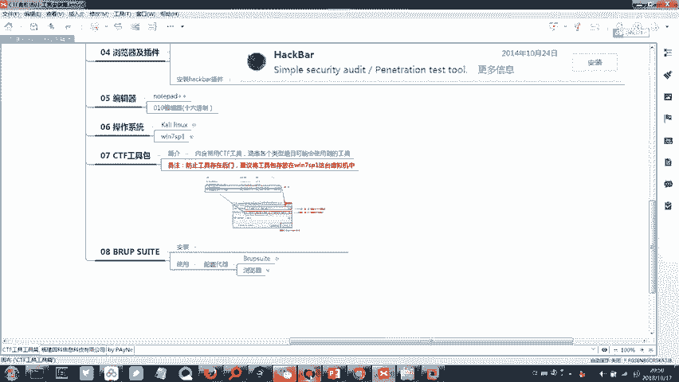