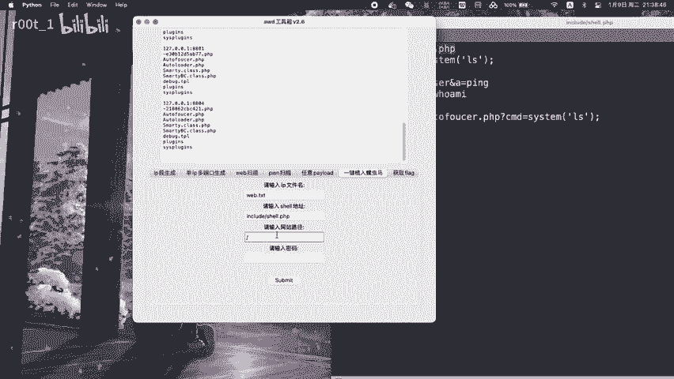
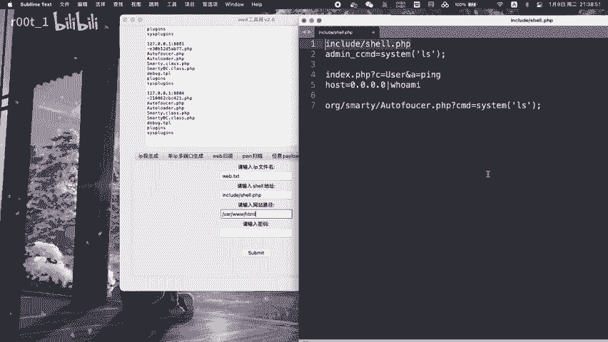
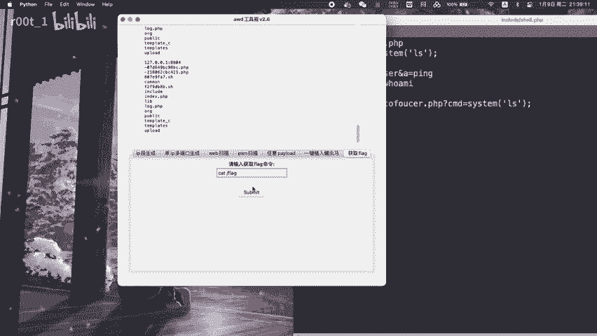

# awdv2.6 使用详解 - P1 - r00t_1 - BV1RW4y1w7vN

🎼星光降落在你的眼底，我也顺势跌进你眼睛。闷热的夏季，天蜜起了冰，微风传递，温柔的呼吸，星星为我记忆出你明星，但我想你能猜到谜底，将温馨记忆，折进纸飞机，飞向未来蔚蓝的天际。😊，🎼The。🎼。🎼。

🎼偷听风筝与风的秘密。🎼这你。🎼还曾遗黑的记忆。🎼地再聪明，旋律很动听，跟我一起漫游四季。🎼梦想的练习题。🎼用真心落笔。🎼灿烂的自句赶走了乌云，快乐不能轻易放弃。😊，🎼星空降落在你的眼底。

🎼我也算是贴近你眼睛。🎼的夏季甜蜜去了冰，微风传递，温柔的呼吸。😊，🎼星星为我寄住你明信。😊，🎼但我想你能猜到谜底，降温星期一摘进止飞机，飞向未来蔚蓝的天际。降温星期一。😊。

🎼折径止飞机飞向未来蔚蓝的天际。

