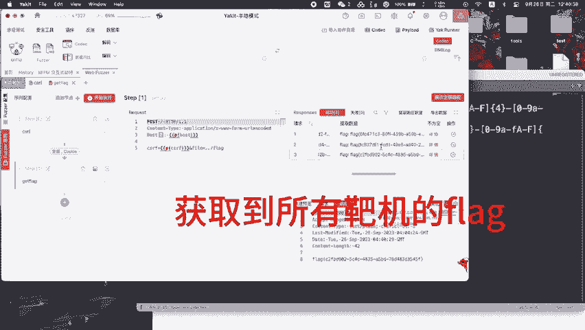
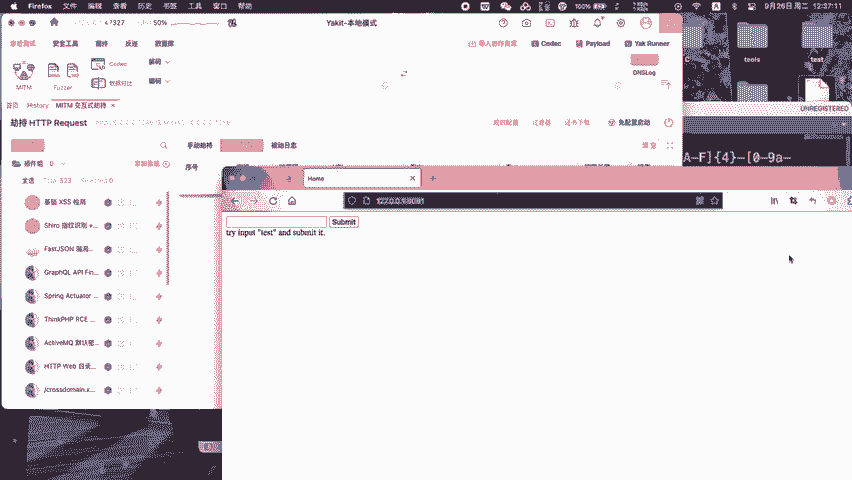
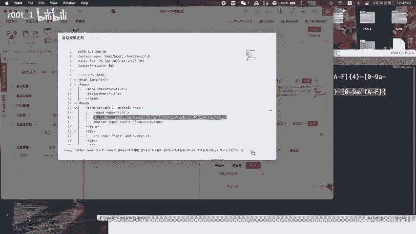
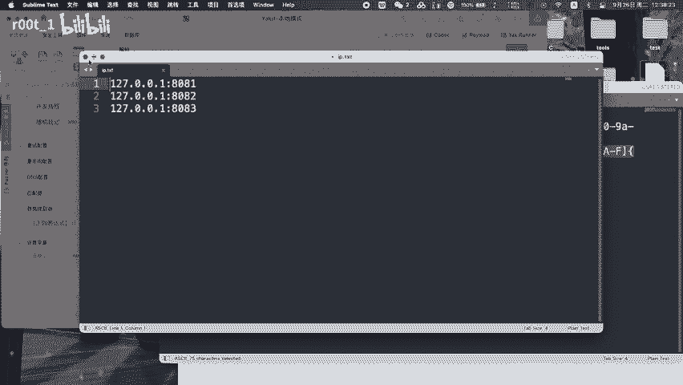
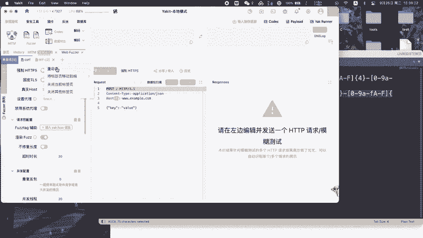
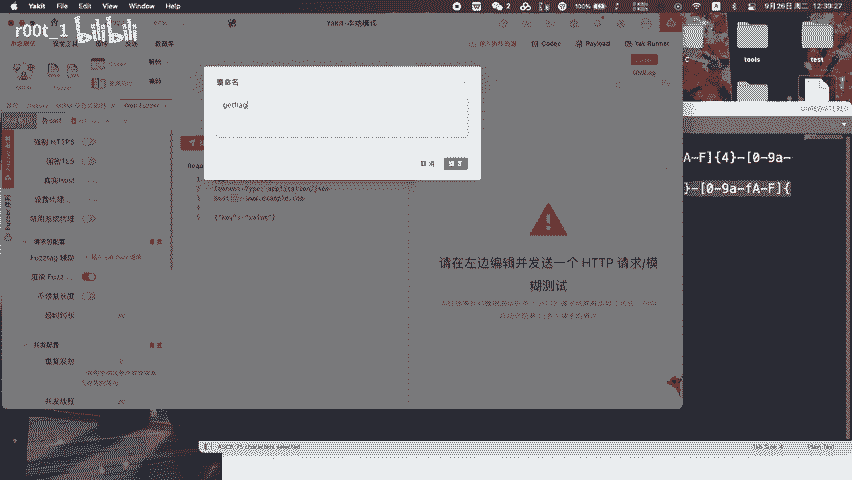
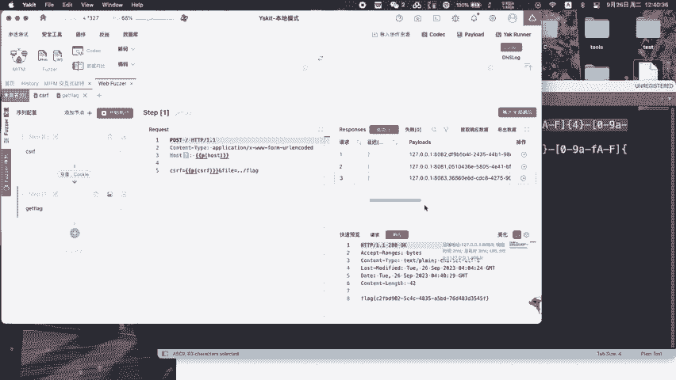
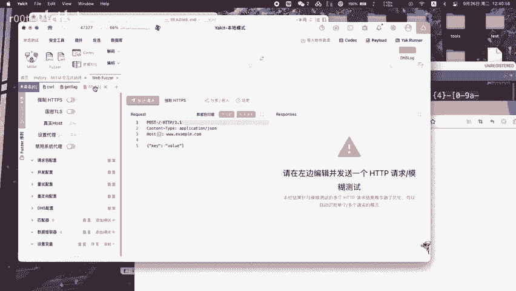
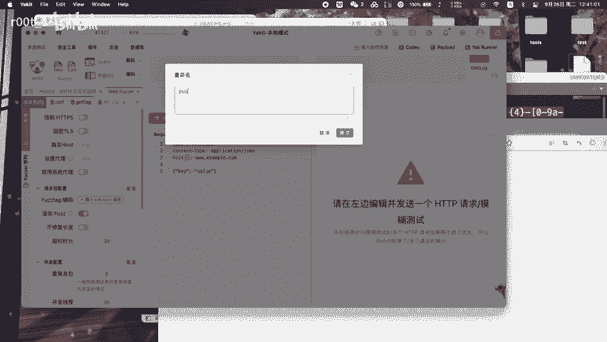

# awd学习-如何利用yakit一键获取提交flag - P1 - r00t_1 - BV14H4y1U7ux

🎼获取到所有把自的flag。

🎼首先，通过周包获取到是token。

🎼割造我们第一个包，每个早晨7点半全写一个正着去匹配课。🎼风铃响起又是一天。😔，🎼晒好的衣服味道很安静。😔。

🎼一切都是柔软又凝结。😔，🎼测试一下匹配效果，每个路口花都开在阳光里。🎼小店门前传来好听。😔，🎼插入多台把机的IP。🎼不用太久旧。🎼能走到。

🎼万世山意。🎼这是最平凡的一天啊。😔，🎼你。🎼你想念吗？😔，🎼不觉不敢慢慢走回家，优先匹配后子。🎼就这样虚度这年华。😔，🎼你牵挂。🎼只有我成功获取到每一台把机的色。🎼构造第二个请求获取flag。

🎼日落之尖，斜阳。🎼在小河里。🎼忘了黄昏时常，收获浪漫。😔，🎼朋友打来电话说他在等成功获取到flog。🎼见面有。🎼写一个正则匹配flag。🎼餐桌摆在开满花。🎼また？🎼院子里。🎼微微酒一阵阵。🎼两个小。

🎼从不考。🎼明天。

🎼不知道左右把记者f。🎼因为今夜的风。🎼转换客命令成为数据包。🎼这是最平凡的一天。

🎼不觉不甘。🎼慢慢走回家。

🎼就这样虚度。🎼负着年华。🎼没。🎼牵挂。🎼只有。🎼晚风轻拂着脸颊。🎼这是最完美的。🎼一天哪。🎼想要吗？plan比交成功可。

