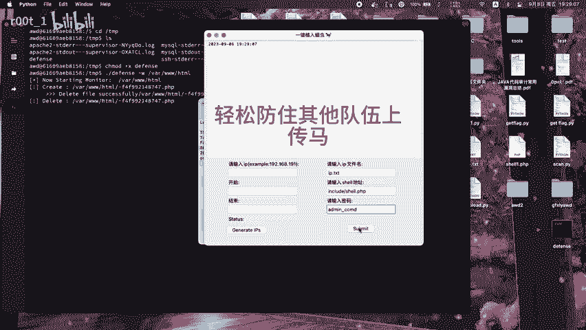
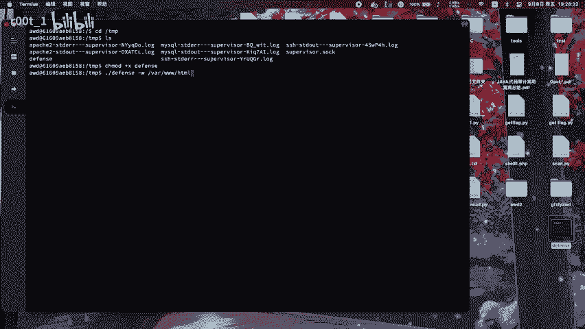
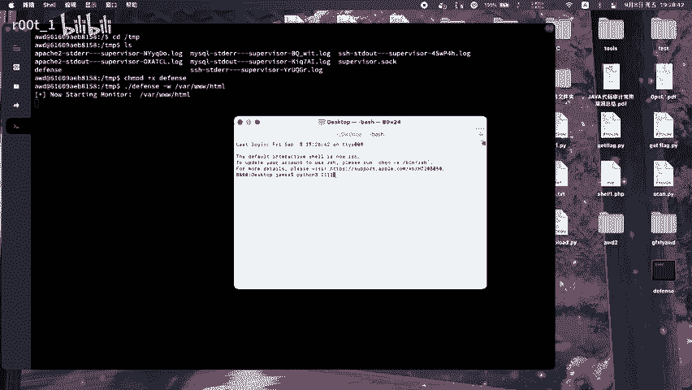
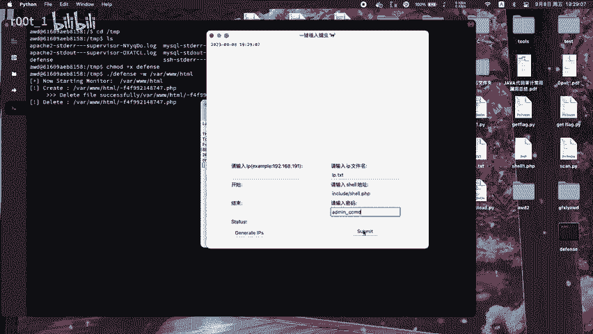

# awd比赛矛与盾 - P1 - r00t_1 - BV13z4y1j7nR

🎼轻松防住其他队伍上场满。

🎼我点着灯。🎼只生。🎼我听的。🎼的真有些。🎼的心动。🎼知就。🎼就像我牵着。🎼我想的。🎼一天坚决。🎼知道。🎼你这脚过着我的少的脚。😊，🎼不在。

🎼可世界越。

🎼我在画面上躺在告别的港。🎼没有化妆，我全纷纷爱上思念肯音着在盘问。🎼，🎼就让这大雨全都落下。😊。

🎼看不见我脸上的挣扎。😊，🎼结束吧，说心里话。😊，🎼那个觉自私的人是你吗？😊，🎼只写在我手机。😊，🎼伤的还需。😊，🎼曾经。🎼都快。🎼我晚点就回家。😊。

