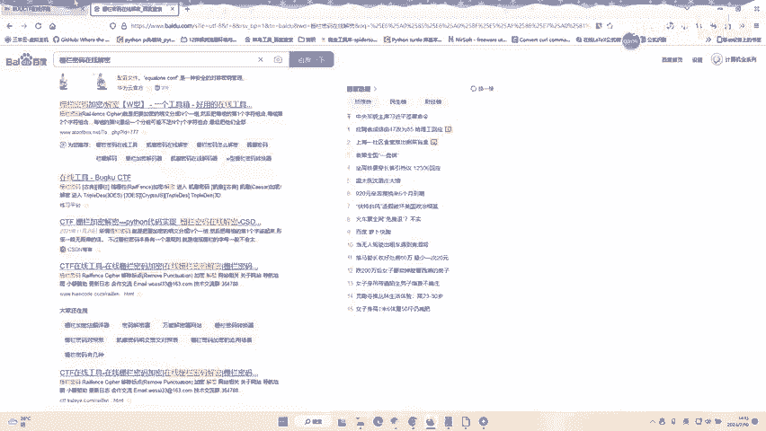
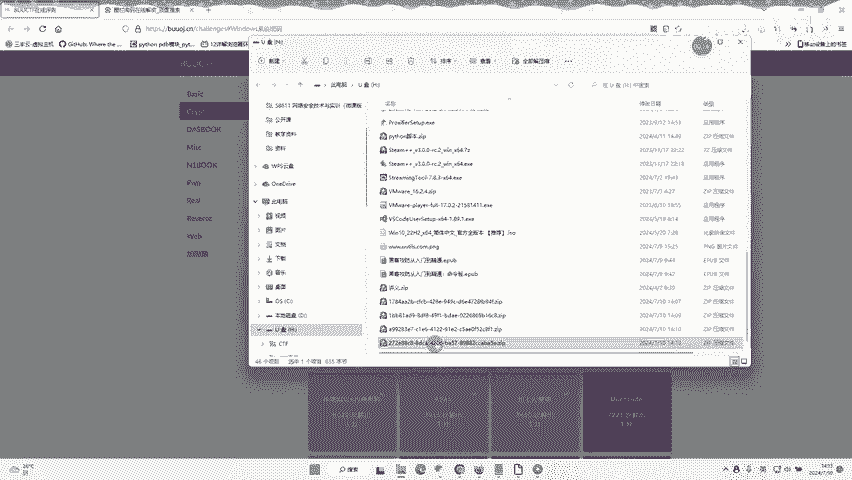
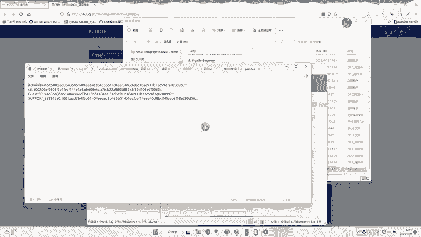
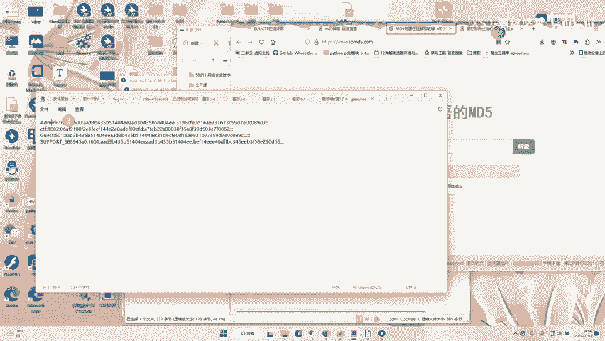
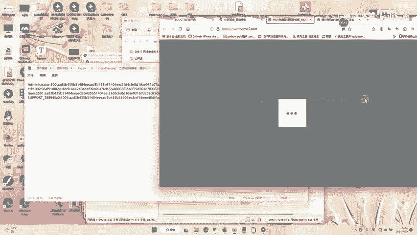
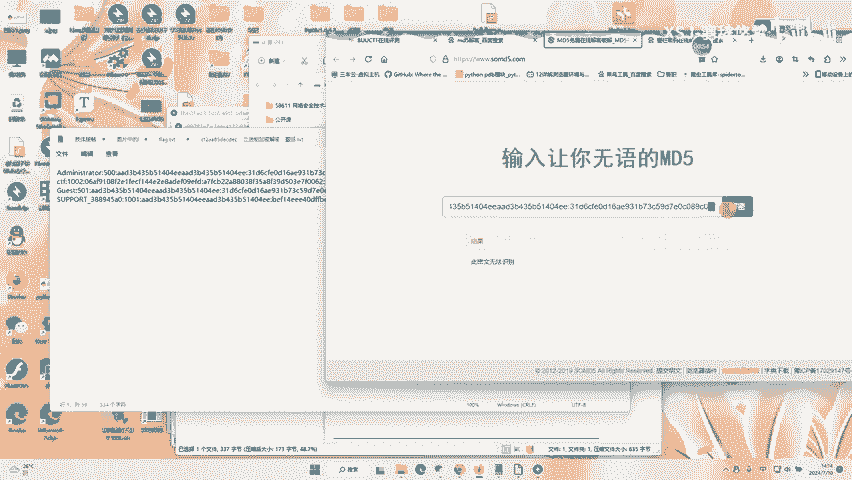
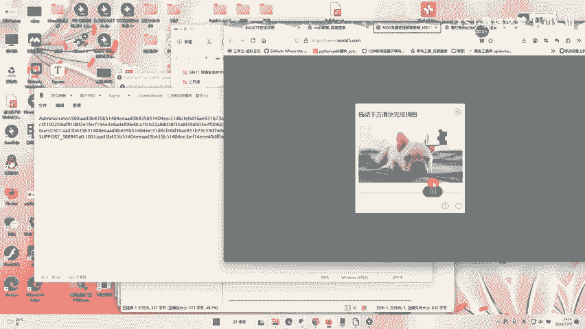
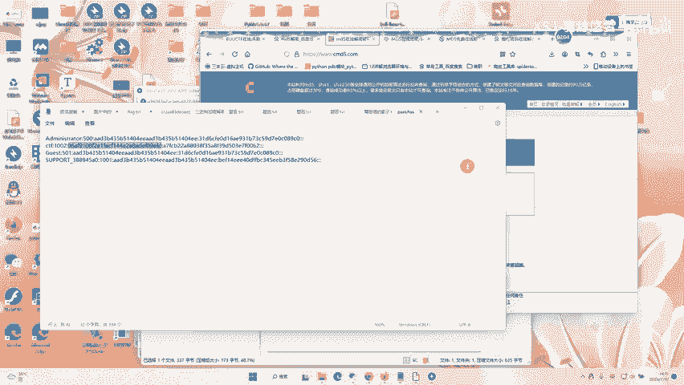

# buuctf  Windows系统密码 - P1 - 羽辞悠梦 - BV1Cm421G7u6

windows系统密码做到题目。首先下载咱们的。嗯，压缩包。下载咱们的题目。

下载好之后打开它。

这边我可紧急民紧。

然后这边我们可以去。找下行讯网站。MD5。行吧。你找1个M75的在线人音网站。因为他这个活动实密码是M95加密的吗？可以看到。

分号起名的是账号，分号后给的是密码，然后我们一个个去起密。

不行的话，也可以多换几个网站设试。嗯。欢迎。然后再把这部分拿出去整理一下。你以看啊这样他就会出入个结果。然后其中一个就是flog。具体哪个是flock，大家就自己一个个去试吧。

啊，这是付费记录。哪回去服了回来就自己去试吧。