# buuctf N种方法解决 - P1 - 羽辞悠梦 - BV1WT421Y7LV

安种解决安种方法解决。

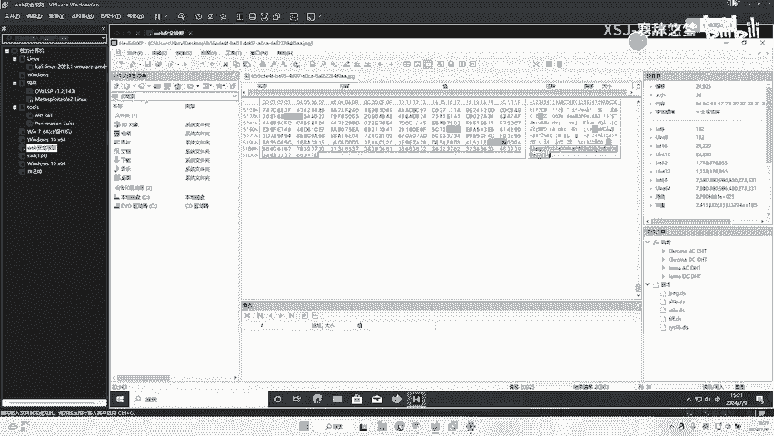

后边的话我是提前准备好的。嗯。不过有点乱，我重新我重新下载一下。

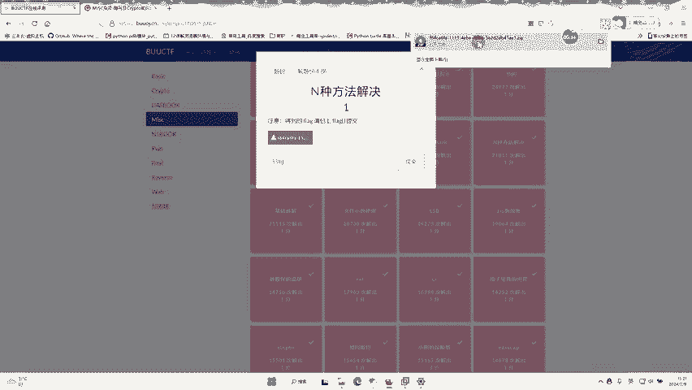

注意是个开异外形。

EFC。大家可能拿到这个题目的时候，会觉得有点懵逼。

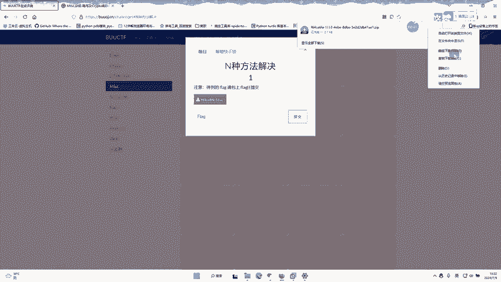

为什么懵逼呢？因为它是1个EXE文件。

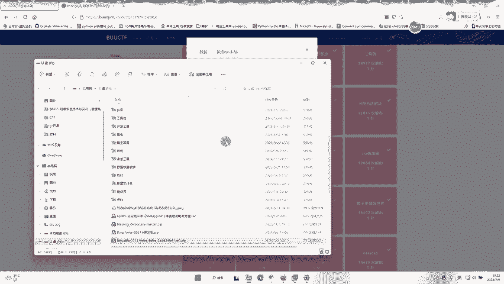

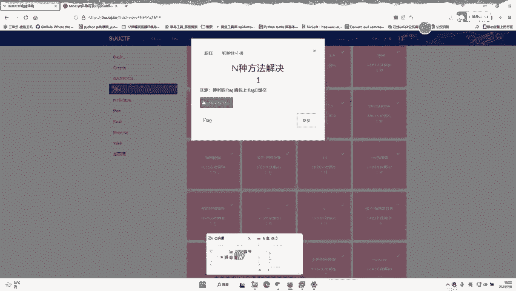

解开之后，它是个EFE文件，然后你打开之后，它是不能在电脑上运行的，但它不是逆向，而是连写。

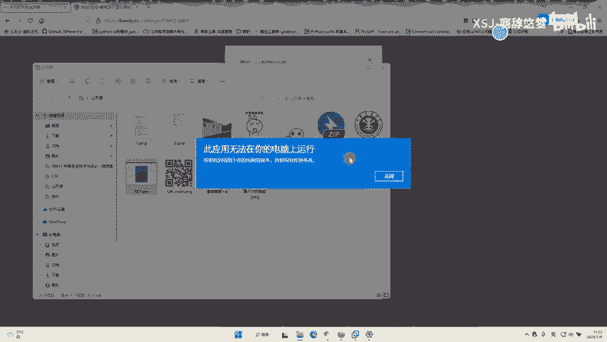

那，这道题的做法。就是直接打开一个技术本。打开一个记术本。然后。

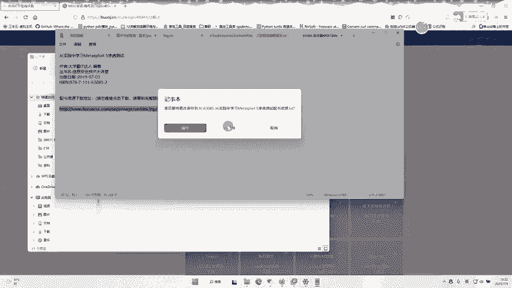

他拖进来。拖进来之后，我们复制一下这些数据。可以看到前面是detter，然后冒号，然后是IMJE代表它是一个。该词6是转图片的，所以这时候我们去BIC搜索该164。转图片。

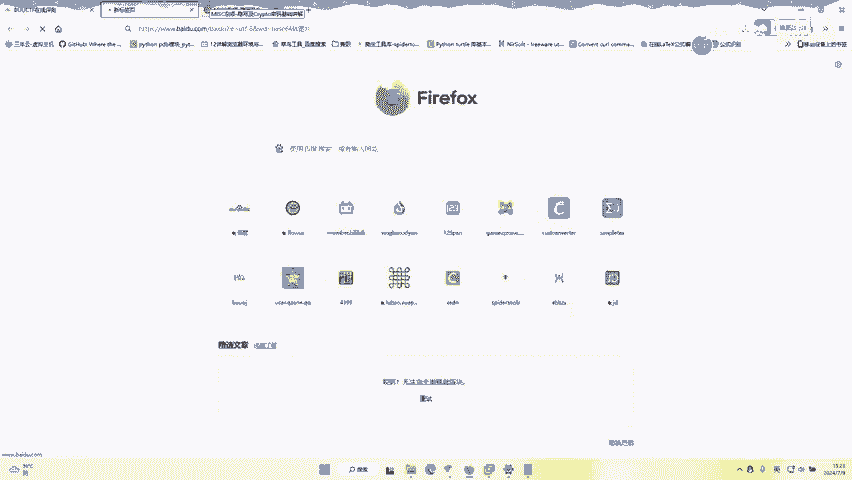

找一个网站。然输入停开了，然后就可以拿到这个这个二维码，咱们下载一下。

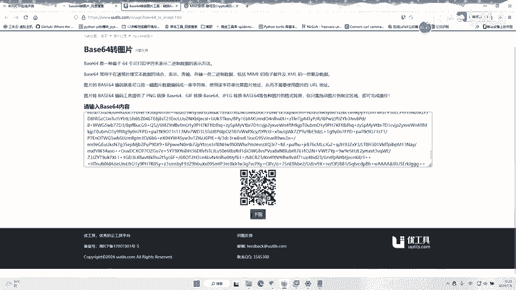

商量好之后是吧拖到诉泥里。使用扫二维码的工具去扫描它。

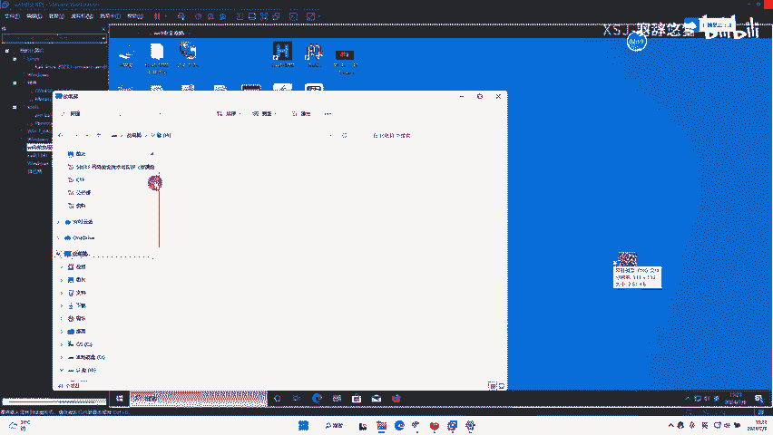

比如说使用。把它打开。张462C你。小我叫工具去扫描这二维码。可能是我这个工具有点问题。啊，跟刚才一样去找到我们的文件。打开。

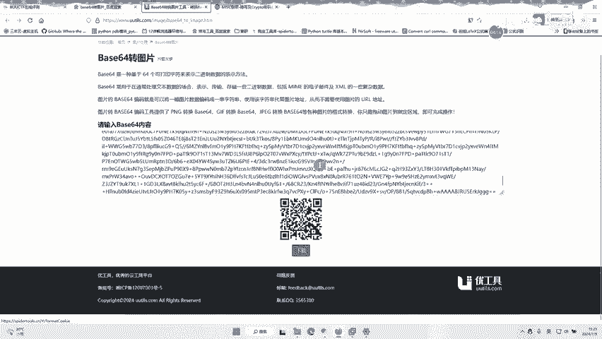

二维码扫标。也可以看有没有在线的网站去扫描这个二维码。对以二维码刚才我删除了。听到了，这个就是咱们的flog。

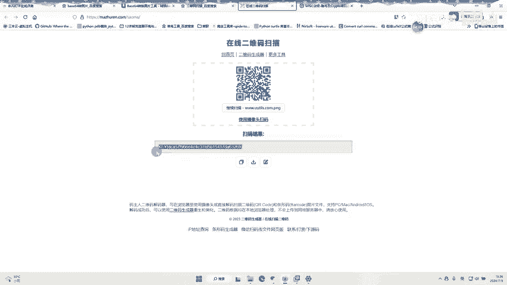