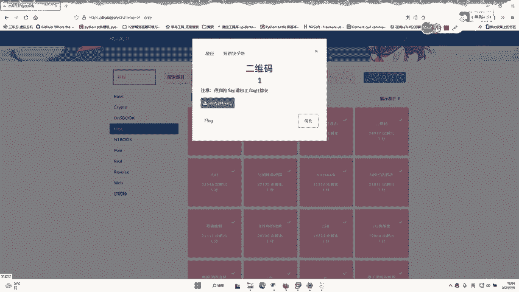
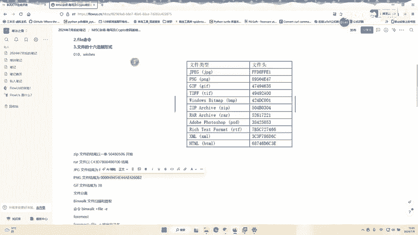
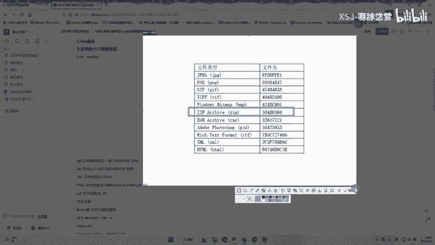
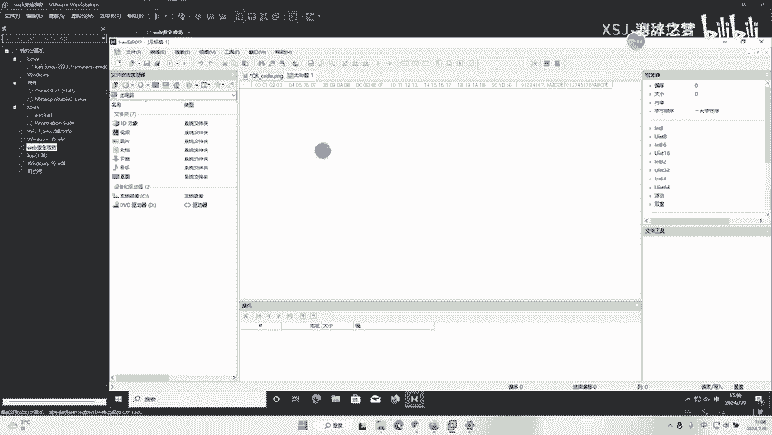
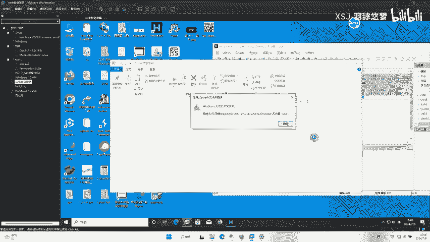
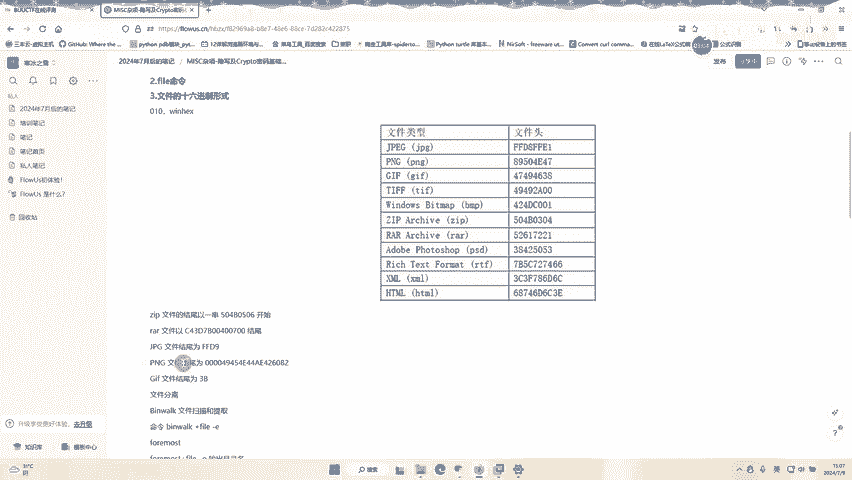
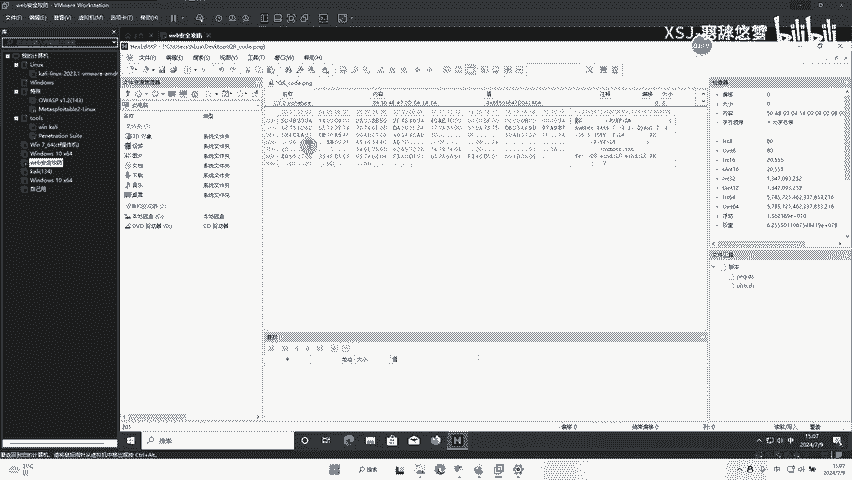
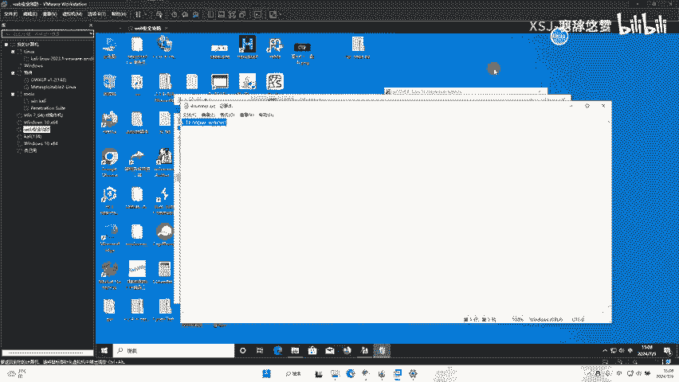

# buuctf 二维码 - P1 - 羽辞悠梦 - BV1DM4m117Zb

看一下这道型二维码。这道写的说法。首先下载咱们的文件就不用说了，然后打开之后可以看到些二维码。这个按维码你可以先用手机去扫下，可以发现它是没有flog的。这时我们可以使用workcast或者是一些。

可以看图片的使用进行的一些工具去打开它。就比如说可以用这么一个工具，打开这个工具，然后拖进来。投进来之后，我们可以大概的去看一下。看一下这个。看一下我选中的这部分内容，可以看到并没有看到什么东西。

但是这里它是什么。什么我历写的呢？他这一个文件里显示偏NG的。然后可以打开咱们的一个笔记。偏T可以看到这里偏T的文件结尾是什么？是。00004945，反正就是这么长的，我们可以复制它，然后去搜索一下。

搜索这里是个16性制字节。选择查找下一个添看了。这一部分。这一部分它才是我们的图片，而下面的是什么？是以504B开头的。咱们可以看一下504B是什么。

可以看到这里，这里正好是504B开头的，它是1个VIP压缩包。所以我们可以参考它是一个合并文件。

啊ho的这些它其实是一个ZT压缩包。所以我们可以这么去做。把这转给他考虑下S。紧洁掉或者是横加C来复制一下。然后文件新建16件就文件粘贴上去。

他这里档案可以选择文件。有一个历存为。刚才说过，他的扩展也是VIP，所以在这里。可以减VIP，因为他刚才说过嘛，扩展名是VIP的，可以看到他出来了，然后我们双击。

他是无法打开。如果大家遇到无法打开的话，我们还有方法。嗯。就我把他们给删除。我要重新拖一，一个同意进来。这边打开我们的工具。

或者他去搜索一下。专页上取16G字节，然后还到下一个。也可以写择把上面。多余的给他提个一产清空。

然后保存考虑一下S保存吗？要图片是。这个是咱们的图片，然后去修改一下他扩展的这个VIP。这里不要忘了把我们的工具给它关了，打开。可以看到这样我们就可以看到一个是s number点TXT打开之后呢。

它其示你需要密码，这时候我们去破解一下这个压缩包的密码即可，怎么去破解，可以使用这个工具打开它。这里我们选择长付，长的话可以默认可以默认就可以了，默认就可以了。然后这里。嗯，选择范围范围嘛。

所有数字即可。这里我去打开，紧击打开。找到我们这个CR啊QR中一个无加缩包。找到了是这个，然后打开。停看了这样密码就破解出来了。这个密码是什么呢？是7639。保紧急确定。再打开他。说句啥。

输入我们的密码7639。确定。挺好了，就于拿到我们的flog了。

