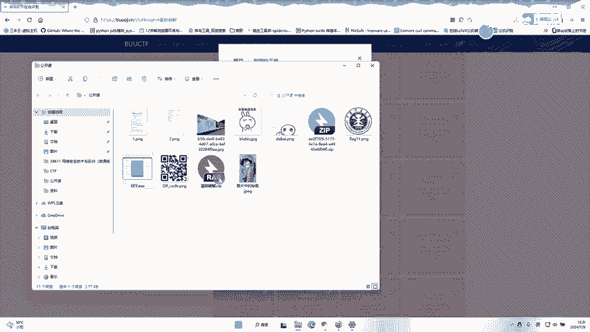
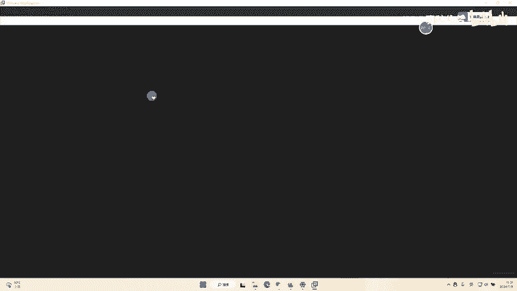
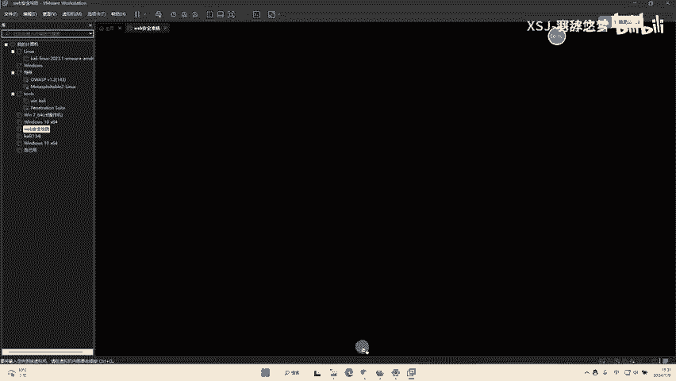
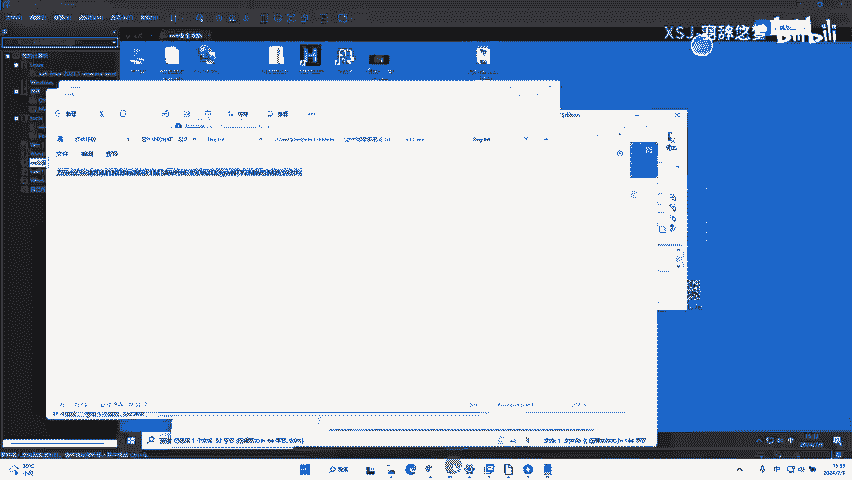
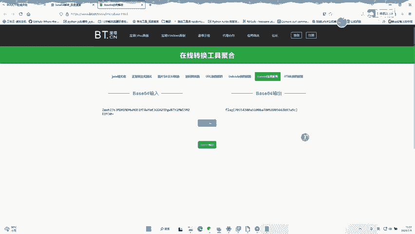

# buuctf 基础破解 - P1 - 羽辞悠梦 - BV1sm421G7xM

技术破解这个情况。首先下载文件。这里我已经提前准备好了。

然后打开。咱们的虚拟机找一个破解压缩包的工具。

当然没有工资的话，可以来找我要一下。

打开我们的工具。脑子里紧急打开。找到我们的基础辅解压缩包。对等他复检完毕。然后破建好了，密码是2593。输入我们的密码。2563确定。然后他是个加密的，他是白6升加密。

怎么可4个白事。六四学元。紧密。找一个网站，你去对他进行个解密。

然后即可拿到咱们的fllogg。