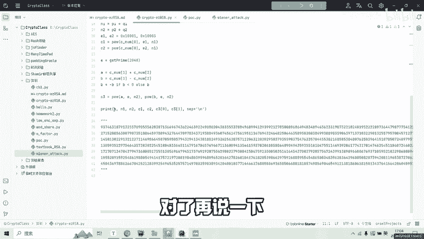
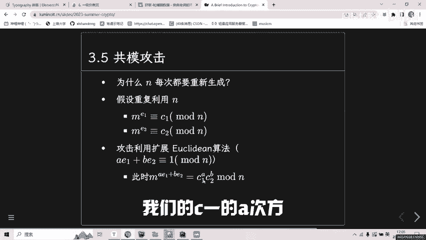
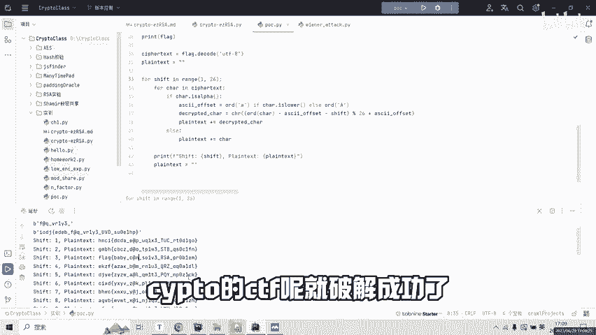

# ctf crypto 分享一个入门级的rsa破解获取flag，其中包含凯撒密码，rsa的共模攻击，wiener attack - P1 - 回锅炒辣椒 - BV1Ps4y1F7GK

hello，大家好啊，今天呢来给大家分享一个简单的的1个CTF。首先呢我们下载好文件之后呢，是这样的两个目录。第一个呢是一个简介。告诉我们你。我们需要的。破解的文件在这里，然后我们看这个。

首先呢这是一个加密函数，这个加密函数被隐藏了。然后呢，我们要尝试去还原，我们来看看下边。然后这个呢之前这里是一个fllog。这个flag呢是我们需要还原的。

我们首先呢这个flag经过了我们这个隐藏的加密函数之后，变成了C，然后C干变能变成什么样呢？我们把这个C。分成了三份。然后把这三份呢又变成了一个浪0C杠一和C浪2呢就分别存放了。

这一个消息加密之后的消息的前三个部分。第一个部分第二个部分第三个部分，我们再来看一看这里。P1Q1P2Q2是一个速素随机生成的速素，然后N1N2。E1E2可以看到其实是1个IC的加密。

然后我们记住N一是P1和Q1得来的，N2是P2和Q2得来的。然后可以看到这里有两个加密指数。然后呢，C1C2是同时对第零份消息进行了加密。然后呢，他们这里有一个什么问题，他们用了同样的一个N来进行加密。

这里会出现一个什么问题，这里会出现一个共膜共膜攻击。所以说我们现在知道了，C浪0，也就是我们flag的。3分之1就是经过了这一个加温变化之后的3分之1的。例文的原文是可以被还原了。接下来我们看一下。

又定义了一个指数，加密指数EE呢是get prime2048位。我们看一看我们的N。是不是P2乘以Q2P2是多少？1024位？Q2是多少？1024位。P2和Q2乘起来是不是2048位。

我们的N是2048位，我们的加密指数E也是2048位，这里会出现一个什么问题？这里呢会出现一个。mins text攻击就是说我们的这加密指数的位数太大了。以大到以至于和我们的N是同样的数量级。

这样的话我们就可以用一个winust来进行一个分解。我们来看一看他用这个加密了什么消息，加密的s none一signn2sign1s2。也就是说我们现在通过分析它的这个加密的过程。

我们可以还原出这个C了。我们先来这里。P o c。对了，再说一下，记住第一串是E，我其实已经把它放在这里了。EN1N2C1C2E1E2C3C4呢就是。

译文的这里C3C4就是这个。C30和C31我们变成C3C4。我们首先知道。我们的sC1C2存在一个共谋攻击。我们来看一下共谋攻击吧。在这里呃这里用了一个同学的PPT。这个就是一个共谋攻击。然后呢。

我们可以用拓展O机理的算法来还原出我们的这个消息。拓展OG理的算法呢不用我们自己来实现，我们可以用。J拍 tube的。这个扩展欧几里的算法来进行实现。C呢我们就可以还原出来的第一部分。

C的第一部分就是什么？我们在这里。通过。我们的C1的A次方，C2的B次方就可以消获获得我们的消息M。

我们先把下面的注释掉，下面的呢是另外一个部分。我们在这里先输出一下第一个部分。是不是被正常的解解密了？可以看到我们已经拿到了第一个部分。看起来就比较像是一个flag flagag的格式。然后呢。

我们接着继续看后面的winust。wint做了一些什么事情？我们在这里把之前的加密指数。E以及我们的一个N。放到这里来，我们要尝试通过这个E来分解我们的N，我。你发现P和Q是不是被分解成功了？

一旦P和Q被分解成功了，那么我。所以什们就可以求出来逆源D然后到了D，我们是不是就已经获取到了私钥，获取到了私钥，我们就可以。获取到了私钥。我们就可以解决了，有了私钥，我们就可以求出X1和X2。然后呢。

A呢就是X1加X2除以2。B呢就是X1减A。接下来我们来打印A和BA和B是什么？A和B呢，就是我们例文的第第2块和第3块我们来运行。可以发现这里。我们已经还原出来了。

这个部分的C接下来我们就来想一想我们的这个encrypt这个加密会是什么加密呢？我们通过观察。IODJ然后这里是一个。大话括号。有没有可能是一种线性的。转化呢就类似于比如说一个大家非常熟知的凯桑密码。

所以说接下来呢我们就来尝试用凯桑密码来试着还原一下。我们尝试了所有的26种可能的凯撒交换。在这里。我们进行的移一位，移二位，移一直移到25位。我们可以看到，在我们第三位的时候，成功输出了flag。

🎼至此呢我们的这一个cycl的CTF呢就破解成功了。好谢谢大家。

