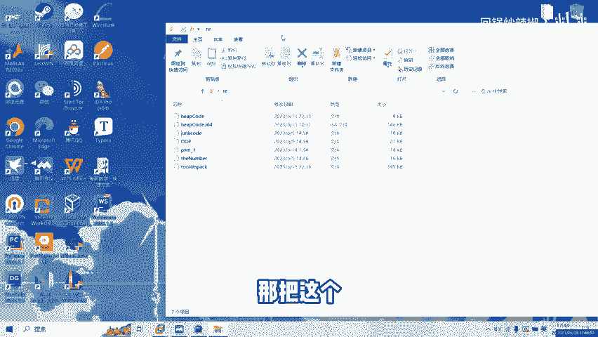
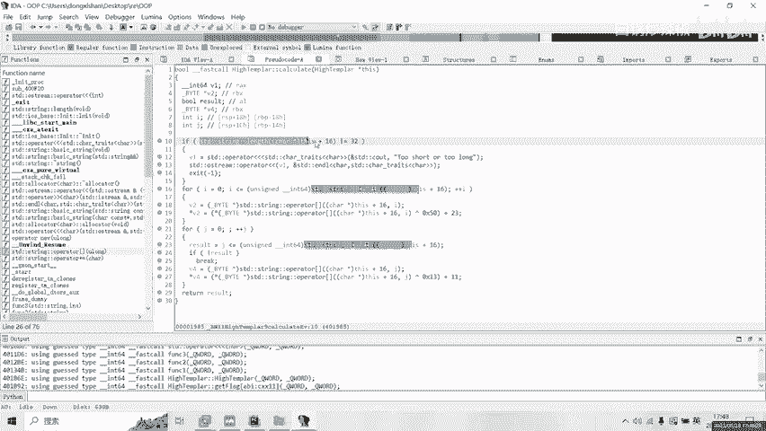
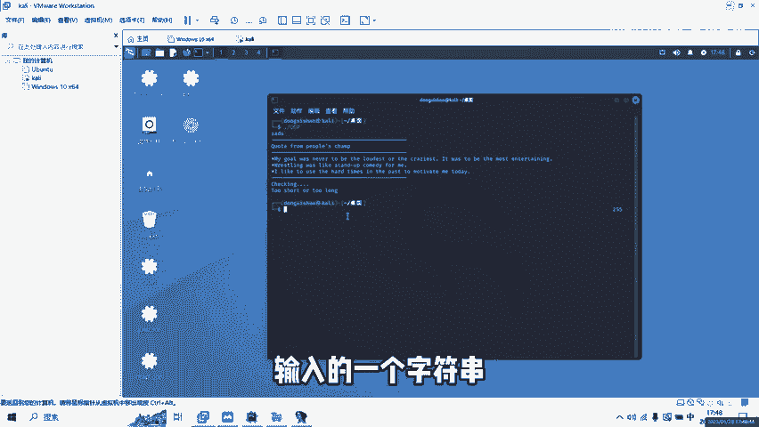
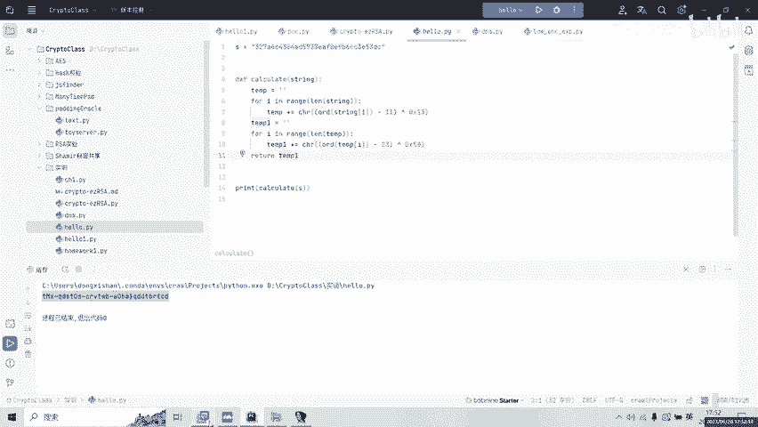
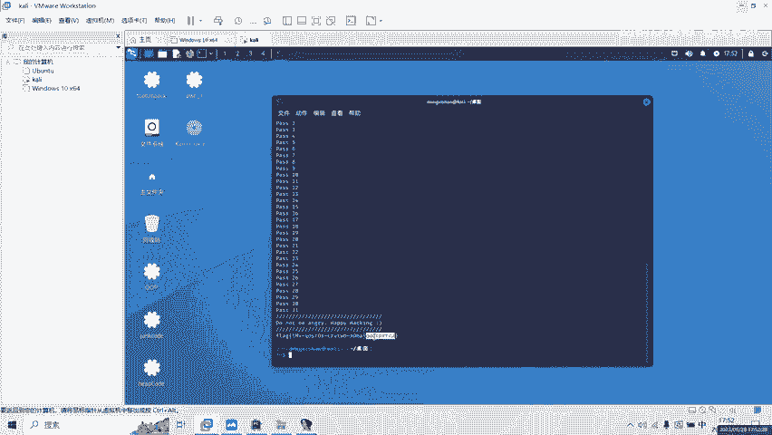

# ctf pwn逆向 面向对象基础逆向 适用于初学者 一个简单的逆向分享 - P1 - 回锅炒辣椒 - BV1714y1m7Hb

hello，大家好，今天呢我们来分享一个简单的逆向。然后呢，我们。在这里打开终端。然后呢。可以看到我已经把这个文件给拖到KD里边，然后我们。执行OOP，然后先随便输一点东西，可以看到这里。他说。

检查中检验失败了，检验失败呢，我们就要去。

他的源码里边打开看一看。他都逆向了一些什么东西，然后把这个OP这个文件呢拖到IDA里边打开。

约定。可以看到，现在呢我们再按一下F。在按F5之后呢，就变成这个样子。我们来进行观察。看一看我们输入的值在什么地方被使用到了。这些都是输出，不用管，我们来看一看C al有什么这边。你事。在哪进行输入呢？

我们可以看到。是在。这边C印。我们的V18呢是我们的输入的值。我们看一看V18做了一件什么事情。在这里有一个对象，然后V18和V23呢被传入了这个对象里边。好，然后呢我们就可以看到这里开始检查了。

他又做了一件什么事呢？将V18付给了V19，V19付给了V20，V20付给了。V21，然后V21又在这里用的，然后呢我们又把这三个给吸构掉了，这里说明了一个什么问题。如果是大家是第一次接触的话。

可能会被掉进这个陷阱里。这呢其实就是一个密罐。Ff一fk2fk3，他们做了一件什么事情？他们其实如果我们把fk一fk2f3从这个源码里面删除，它也不会有任何的影响。这里呢就是纯粹的干扰我们的。

其实真正的关键就看一看这个对象里边做了一个什么事情。我们看看这个对象是怎么怎么赋值的。在这边我们会看到它首先呢有一个有一个指针。A一指针A2呢就是我们传入的指，可以看到这个指针的16号位置变成了A2。

48号位置变成了A2，然后它的80号位置变成了这个指。Sorry。可了。这边它的80号位置呢变成这个值，这个值我们先把它给记下来，这是它的80号位置，然后呢把这个给返回回去了。好了，我们继续回到。这边。

唔系卡。之后呢，他做了一件什么事情，做了一个计算。看一看这计算干的什么，可以看到这里。too short或者 too long，可以看到这里。检验我们这个输入的这个值，this的16，还记得之前吗？

16就是我们的输入值，如果十6不等于32就直接退出。所以如果我们这里在这边输入的一个字符串。

是正好是32，我们可以试试32位可以看到。没有通过D0，说明我们的D0号位置有问题吗？我们在这里看一看后边呢他做了一个什么事情。对我们输入的这一个第16号位置的第I位。进行暗位抑惑，然后加。

然后呢再次将这个结果呢在这边。又进行了一次。按位抑货，然后再加。所以他这这里做了一件什么事情，把我们的传入值。鲜美味抑惑物。每位易货50，然后加上23，然后再将这个结果再次每位易货。13加上11。

把这个结果返还回去，我们来回到。轨到。回到代码中。返还回去之后呢，是一个什么东西？质证。返换回去之后呢。记住是16号位置流，现在呢我们再在这边看一下这一个这一句话。Get Sarah。

看到这里16号位置了吗？从这个第16号位置，就是我们刚才进行的操作的字符串。然后呢，如果说什么在这里，这里是第16号位置。这里是第80号位置，V一是80号位置，V1的80号位置是什么？

就是刚才我们复制的那一串。那一串类似像是密文一样的东西。在这里我们每一位。进行了一个什么进行了一个比较。如果当比较的时候。这个位数不对了，然后它就会显示你没有通过第几号位置。如果所有的比较都正确了。

那么我们就通过了这个。我们怎么样才能够得到我们想要的那个输入值呢？也就是我们怎么样去一个P呢？在这边我们可以回到当当前之前的一个位置。是不是进行他是不是将我们的输入进行了抑货。

再进行了抑惑和之前的产品文B行比较。那我们直接用它的反过程不就可以了吗？在这边我们已经写好了一个一个脚本，在这里呢就是计算我们的一个T，我们把这个flag。这个不是flag，就是一个一个东西。

遗传密文拿过来对它进行先减11再一或13。这是我们得到的第一组，再将这个第一组呢减23，再异或50，就相当于是做之前的一个逆过程。我们运行出结果，结果在这里。好，我们复制。

运行。本贴。可以看到，现在呢我们已经成功的拿到了这一车blag。然后呢，今天的这个分享呢就到这里结束。

