# ctf之爬虫基础 - P1 - 羽辞悠梦 - BV1Gw4m1Y76S

本来是打算明天晚上讲这个爬虫的，然后现在今天晚上帮他讲了，然后明天的话就是把那个CTF的题目给他讲了，然后再讲一个刘后门刘后门，所以把那个后门给他讲了，可能会可能会讲刘后门。爬虫流程。节目。确定需求。

确定需求。需求意思就是说你要干什么，你要做什么？就比如说。我有一个作业作业是什么呢？是爬取4399商品的游戏名称。那咱们的需求是什么？就是排游戏名称。所以第一步确定我们要干什么，也就是确定需求。

第二步叫要找到数据。所在地址。在地址这个数据在哪里？我要爬的是什么游戏名称，那这个游戏名称是在哪里？我可以看到我可以从这个链接上去提取。但是如果他要是个中点加菜的，比如说他要是个拆圈。

还是个茶叶区动点加载的。那我这个数据引定起来，就是在插圈。在这里也可以看啊，这里是所有所有的知道都知道什么意思吗？这边我们点击查一圈动态加载。😡，可以看到这些数据不在动态夹载里。嗯。这边图片。

比如说我想找java资料。右精。我想找这个我想把这个标题给它爬下来。这标题在哪里呢？它确实是在这个链接里，但是。它也可能在拆需R这个动点加载里也有。为什么有？因为当我们点击加I一的时候。

其实是我向服务器又发送了一个请求请求加I一内容。然后服务器接收到了我的请求，然后还把加页的内容给我，我画个图。

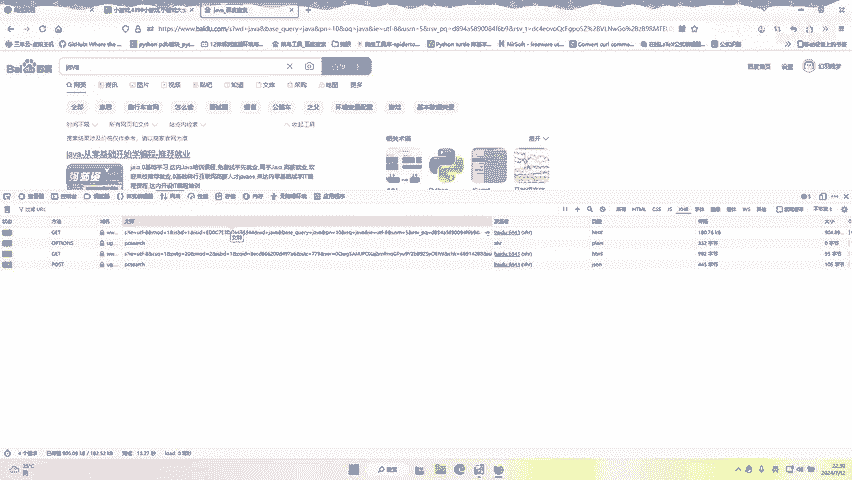

我父亲。首先我现在是第一页，当我点击第二页的时候，其实是我向复习发送了一个请求。第二页。发送了一个请求，这个请求干嘛呢？请求。第二页。而复习接受接收到了我的请求，然后他会给你一个响应，响应是什么？

就是第二页的内容。在这之间可以看到我从这里到这里的时候，然后又就这里到这里，我跟父亲是有一个交互了，这个就是动态加载，也就是叉HR类型。

然后我们去找一下这边请求，就是请求帮忙发过去，响应就是夫亲给我的。可以看到这些。标题都在这里，所以这个数据的所在地址是哪里？也就是它当然应该就是。它跟商品的应该是一样的，所以就是商品的这个。

所以这个就叫做找到数据所在地址。然后爬取爬取。嗯。数据。找到之后，我们就要爬这个数据了。当我们爬这个数据之后，爬到了是什么？其实我们爬虫的流程就是向复务器发送个请，就是模拟浏览器，向复务器发送请求。

我们现在是。

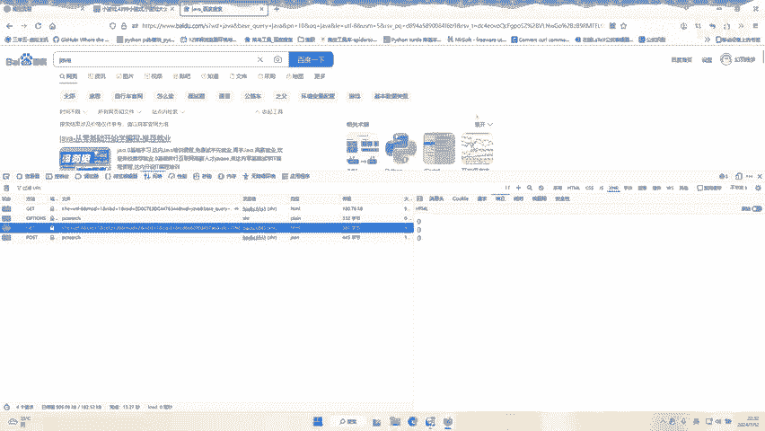

是什么呢？我们现在是和浏览器。我浏览器也去去访问它，访问服务器复器给我小念啊我们爬虫就是模拟浏览器，就说本来是一个爬虫程序。本来是个爬虫程序，然后让他去模拟浏览器，浏览器是干嘛呢？向复务器发送请求。

然后复器接受请求，给我响应嘛。所以这首是有爬虫向他发送请求了，爬虫，然后它响应了给爬虫。所以这个响应是这里可以看到，就是复务器给你的响应嘛。所以当我们模拟爬虫之后。

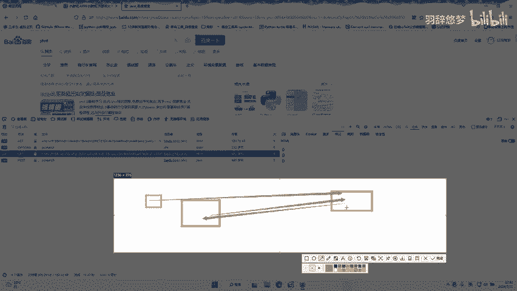

接触它的响应也是这个样子的。所以这个就是数据。🤧嗯。已经是排序数据。我们爬倒数据之后，我们可以看到有戏这个标题什么的。🤧。标记什么的都在这里都在这里。但是它其实是一个云代码。啊。

可以看到它其实是个HTMAL代码，然后经过浏览信上的渲染，可以看到原始的就是一个代码云代码。8。然后呢，就是经过浏览器上的一系列渲染操作，变成了这个样子，就是变成了你看到的这个样子。

所以我们拿到的是云代码，拿到云代码之后，我当然要经过一系列一系列的解析。一系列的解析过滤，把这个标题给它解析出来。被解。所以下一步就是解析。あ。这些过后。也就是说我们数据就是拿到了这个标题名称了。

那我们就可以把这个标题名称给它保存了，所以叫保存数据。这就是爬虫流程。就是为什么要讲话虫呢？因为在比赛的时候，他可能会出现这这种情况。就是说网页上面它其实给你一个计算题。比如说这计算题是什么呢？是。

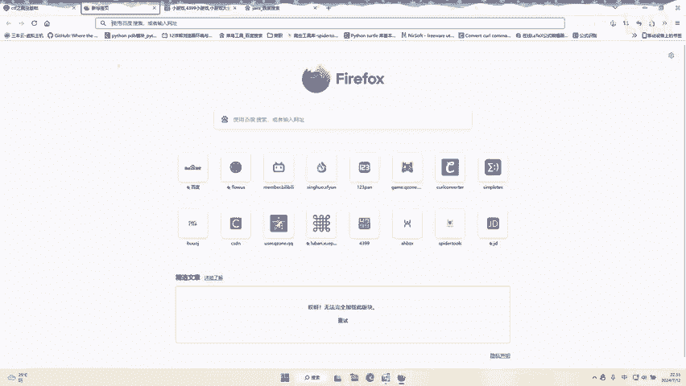

比如说他会给你这么一个计算器。他会给你这么给这么一个计算体验，然后让你在。让你在。3秒。内完成计算。就是说3秒内你必须把答案停写上去。像这种你们怎怎么办？如果你要是就算你打开计算器，我又计历一下。

我刚打开计算器就已经超过3秒了。所以我们要用精晶学的技术，精力学的爬虫来做这道题目。

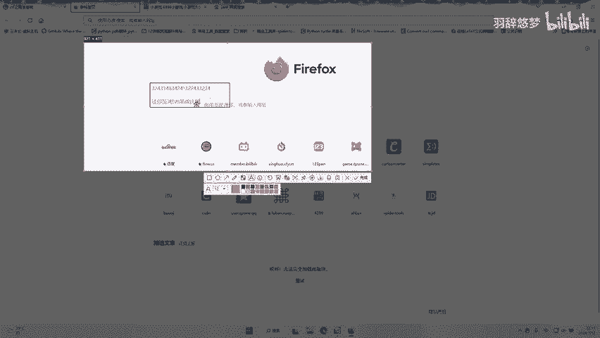

在我只要拿到这个题目之后，用用程序帮我计算，然后立刻发送请求。这样的话它实际就可以控制在三秒内。所以这就是为什么要学爬虫。要讲他的原因。确定需求就毛说了就。嗯。这期六找个差学子。

但最好使用google浏览器。比如说开摄。这边有拍这的书情，我们的目标呢就是把这个名称排下来就可以了。名称排下来就行了啊，这个就是我们今天的目标。首先，右击警察找到数据云地址。这边它没有。

那我们就刷新一下嘛。

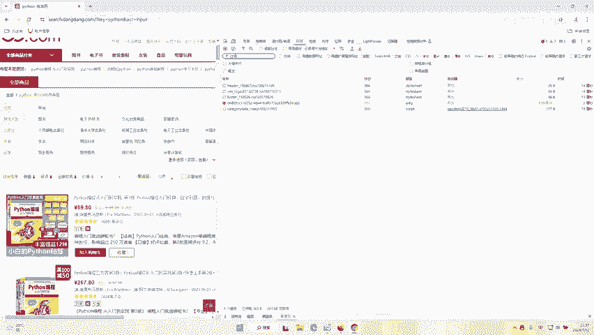

然后可以看到这边比较多，那么可以进行搜索。比如说我把这里复制一下。复制一部分，然后进行打开这个放大镜去搜索一下。然后现在他就搜索到了嘛，搜索到的结果可以看啊，搜索到的结果都在这一个链接当中。

都在这几个链接当中，我随便给你点一个。因为他们链接都是这一个链接吗？这边我们看一下标号。小心什么呀？行，就先排下这个吧，这个不是叉HR的，可以看到这个是HTML的，不是一个叉HR的啊，这个就是标头。

一就是请求，就向服务器发送请求。的一个请求网址，还有请求方式，还有就是他的请求头，也就是发送请求的时候所带的一些数据，响应就是服务器响应给你了。对我我工寓还没打开。

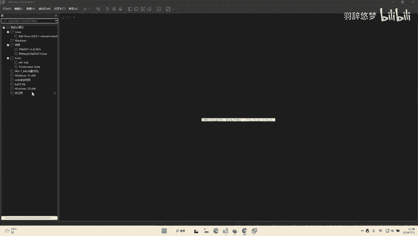

对我不应该用这个去讲，咱们用机会WS来讲。

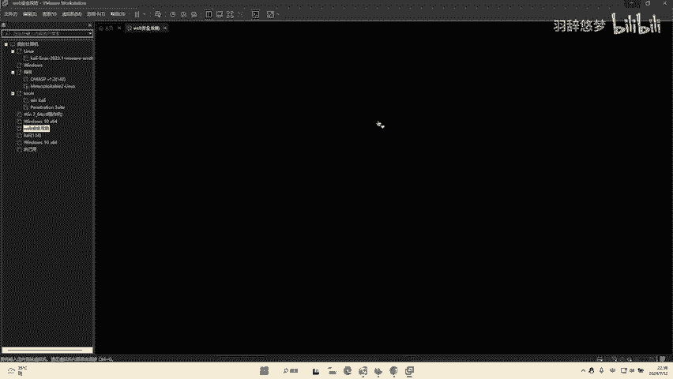

这边间可以启动我们的PRP洒类。使用好之后，打开我们的环境和。嗯。不能1下儿。看一下这地址是什么。135。

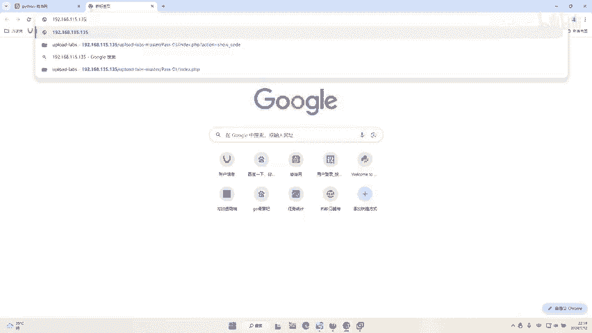

比如说要爬去这个页面。那，首先就是复制它的地址。

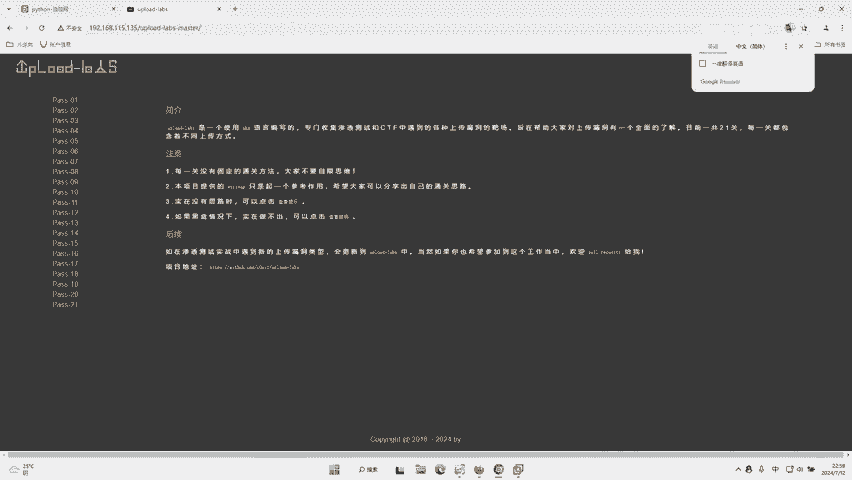

就直接复制这个就可以了。Yeah。嗯。URL等于我们的链接，在上面我们要导入一个模块，叫做发送请求用的。🎼导入我们发送请求的模块DORTREQUESX。导入发送请求。请求另一个模块。发送。

然后使用我们的。因为我们要排除这个页密码，所以用ge就可以了。getUL就上服器发动请求，结果放在ex box当中。向服务器发送。请求，这样就可以向这个复习发动请求了。啊EQ you1见。

发生了请求的结果，我们可以看一下它的结果是什么。然后使用我们的ISS等于RESPON responseponse点TST。拿到领代码。然后。然后就没了，然后等会再说。这里我们先运行一下。

可以看到这个pate输入的是什么？是response来买，是它的一个状态码。这就代表我们已经。跟对方进行连接了。那么拿到云代码在RES里面，我们可以直接输入RES。可以看到这个就是我们的云代码。

这就是我们的云代码就已经拿到了，拿到之后我要。😡，我就要对这个做一系列的解析。解析的话，我们可以导入1个RE模块。而一。正则表达式某块。正则模块。然后这个就不需要了。

如果我只是想把这个pass杠4杠04什么的，就这些pass杠01-0234，把这些过滤出来，那我可以检查一下。

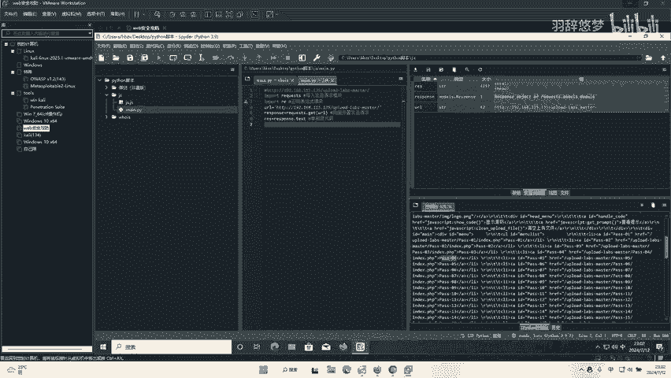

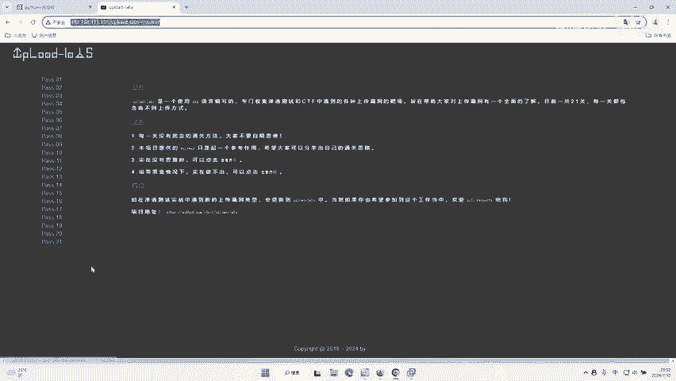

这里我们随便点一个，然后可以看到它都在UUL表情里边。

我们复制一下这些。打个手师。UOL加空格是在这个标签里面。然后我们可以选RE杠FI减FIA。然后使用我们的。真的表达是首先是我们的。啊，这里我再给我搞个冰凉吧。后面放上我们的RES云代码。

然后后面加上固定的格式RE减S。在这里ID4不加一些。然后放结果放在R当中，然后拼E是什么？拼E就是我们的正的表达式。真则表达式怎么去编写？

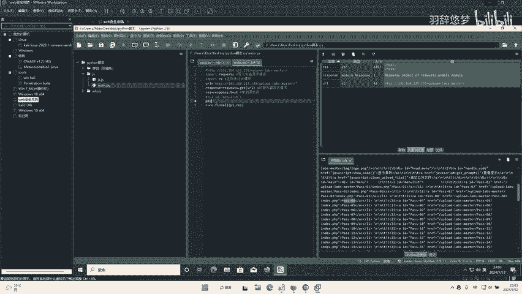

可以看到这边它都在LI标签里面。更准确的说啊，它都在我们的I标签里，那我就直接复制I标签。

这就是我们的A标签。然后我们需要的是什么内容？需要的内容正好是我选中的这部分啊，我没选中的部分是不需要的。但是这里很明显，这里他。😡，如果我是pass二呢，pas02。

那我这个ID等于它绝对是pas02。但是我们要它嘛？我们不要那这里到是二的时候，这里也是02，但是我们也不要它。我来用文字写一下。这里它会发生改变，但是我们不需要。这里它也会发生改变，我们也不需要。而。

我们需要的是什么？需要的只是。这里的需要他们这两个发生改变了，我们不需要我们需要的是它其他的不需要。但是这里它会发生改变，所以发生了会发生改变的，咱们用。点鲜味给它代替一下。会发生改变，而且不需要了。

我们用典型问代替。那么需要的呢？需要的我们我们给大家加个括号，用括号进先或代替。可点心味。就是不需要。用隐形味。需要的用括号点斜问给它代替一下。把这个复制一下。拼音等于于叉，然后输入R。并且。

可以看到这样我们就成功拿到这些数据了。最后。法院可以并论一下。然后这个就是我嗯。就是最简单的花手。

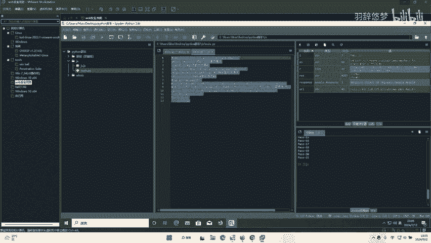

比记我给大家交代的商品。然后再来选当当网。刚刚网的难度就比这个大了一点了。刚才是谁发送过去的数据包，是python发过去的数据包。啊，不是浏览器发送过去的数据包。

咱们给你继续用这个看一下能不能跑到达档网上。

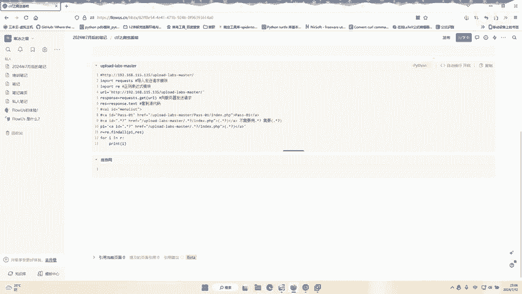

这里复制这个地址。然后。多余的我就给它去掉。这边。就直接运行吧。

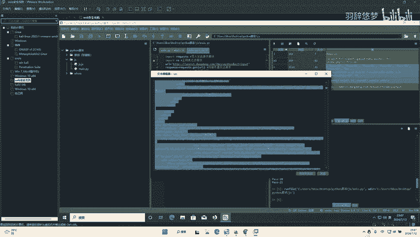

这边我可以复制一下你代码，然后。右击新建。HTM。看一下这个云代码是否正常。编码问题暂时不讲。

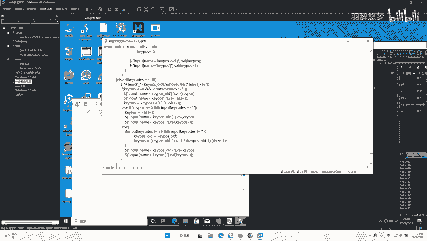

不过我感觉这个。还是比较正常的。嗯，我官方网站。

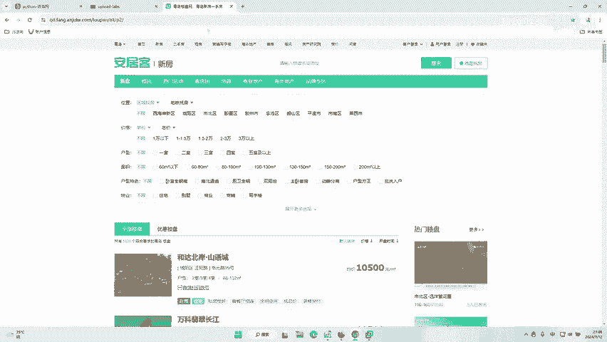

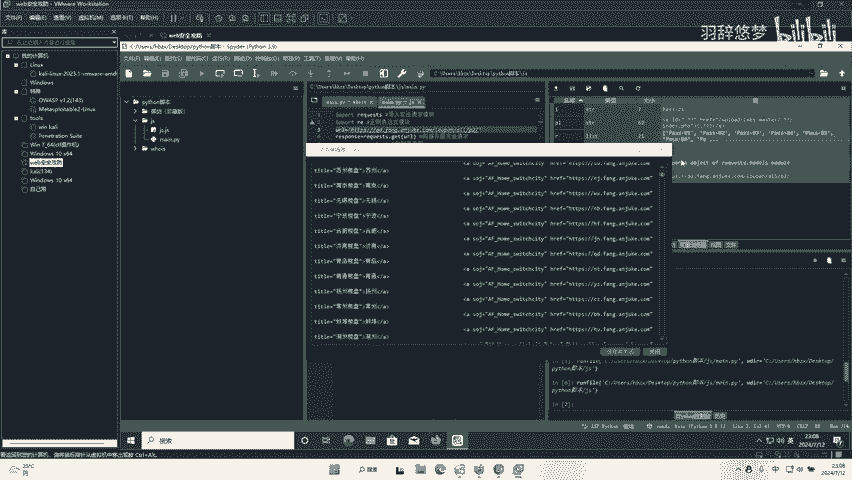

但这里也也有可能就是因为我是谁发过去了，是python发过去了。对方看到我是python发过去呢，肯定是有可能就是不给我正确的一个云代码。这时候我们就要把pyython模拟成一个浏览器。

让对方认为我是浏览器发过去的，也就是往了请求头里添加数据。但然这些东西在之前都讲过的。

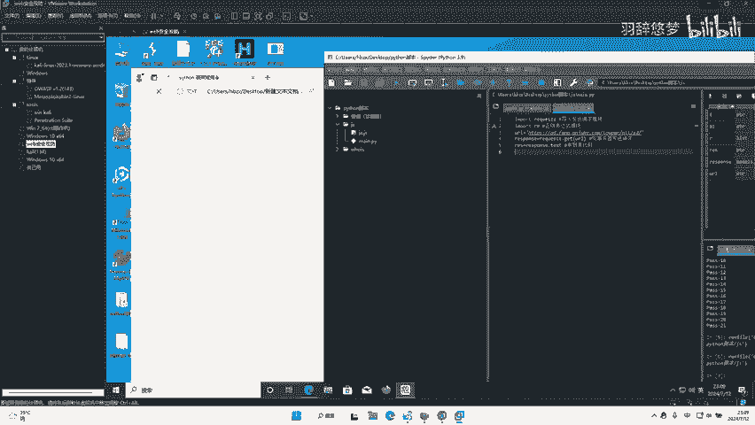

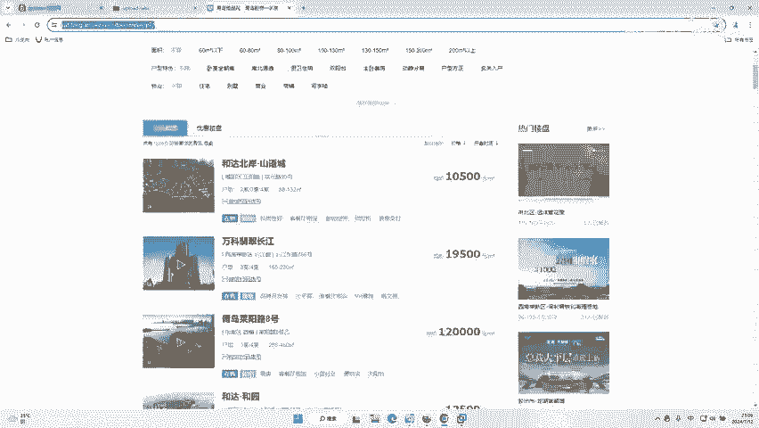

所以这废话我就不多说了。我们添加一个曲品球头可以设置一个变量，叫HEID开ous这个变量，这个变量是一个字典类型，然后里面可以放上你需要你要添加的曲品球头。逗号HEIGE2S等于HEIGE2S。

然后这是什么意思嘞？😡，这个指的才是你的病量。然后这个就是之前讲过的。之前讲过一种写法。进行讲函数的时候，讲过一种计法，就比如说。然后逗号AB，比如说。XIB。pas，然后在使用IX的时候。

我可以这么去用B等于。B等于什么什么I等于什么什么。😡，所以这个helus指的就是你函数的一个helus，这个才是指你的一个变量。然后这个变量等于helus就说往里面添加请求头了，发送数据的时候。

它就会带上你自己写的一个请求头。啊，这些也请求头已经是反爬虫机制。就说如果我是python发过去的，对方可能看到是有python，然后就不让我爬，就不给我响应。所以我们这这个所以这个也就是反盘荣嘛。

所以这个最常见的反盘虫策略也就是添加你的UC agentent，添加你的信息就求请牛槽，一性也就是UIUI里面是浏览器的信息。把它添加上去。

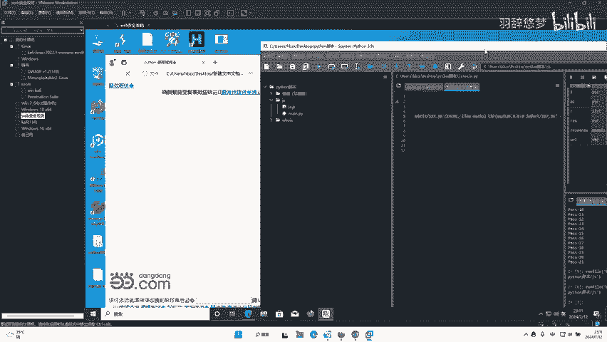

这云再次发送了数据。这个后面我直我直接给他家听两场顶贴ST。

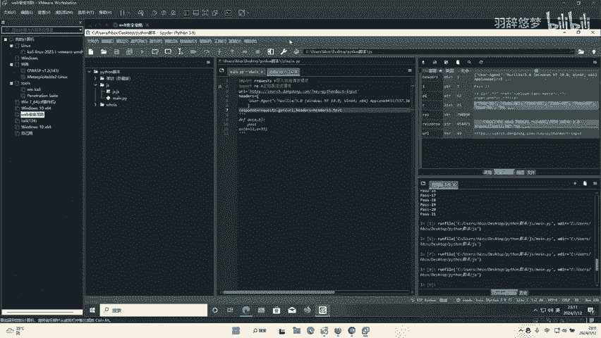

这里好像就是嗯真正的数据是拿到了，但是是有乱码的，乱码暂时不讲，只是编码问题暂时不说。打开应该是一样的。

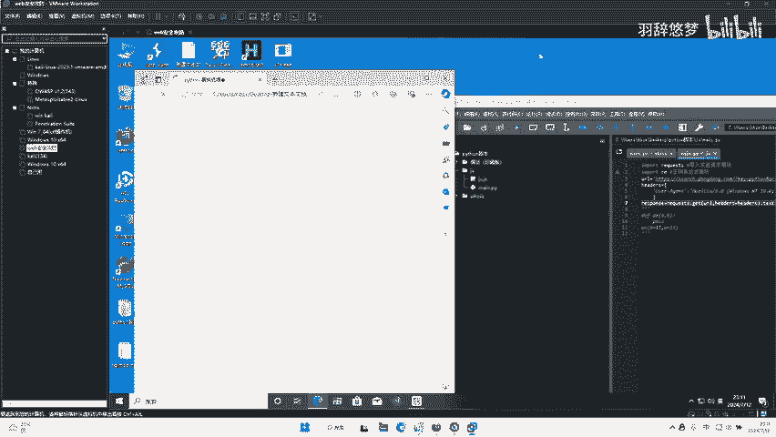

可以看到效果是一样。但是除了UI就13G呢是怕怕成功。也可能。也有什么quiookie反爬送，有时候你你要加上Qookie都知道，如果一个是你要拍出一个登录后者键面，那需要给他账号密码。

这时候就是就要用Qie了。因为coie就是账号密码嘛，然后其他的也是要自己去添加。嗯。

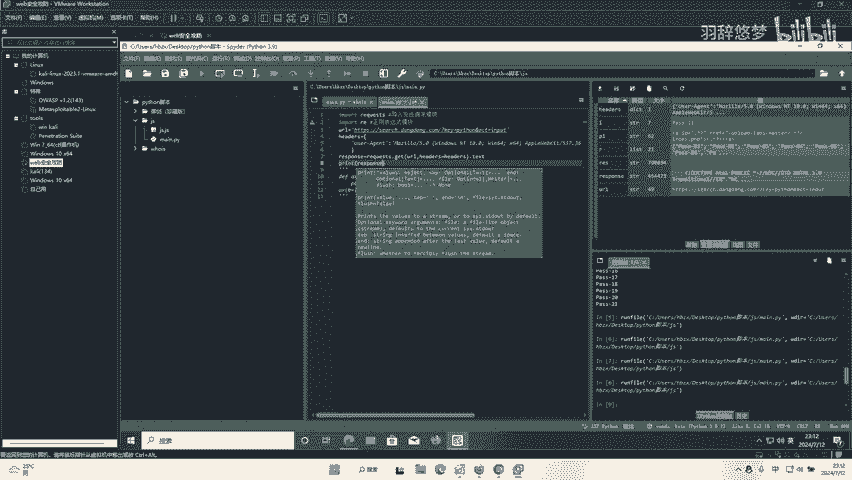

这些够明天用了。啊，后边的话要讲1个OKB码，叫OKB码的时候需要用到这些了。

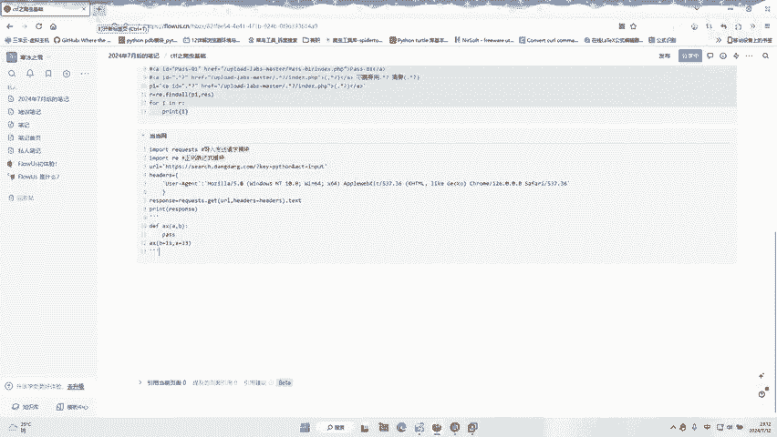

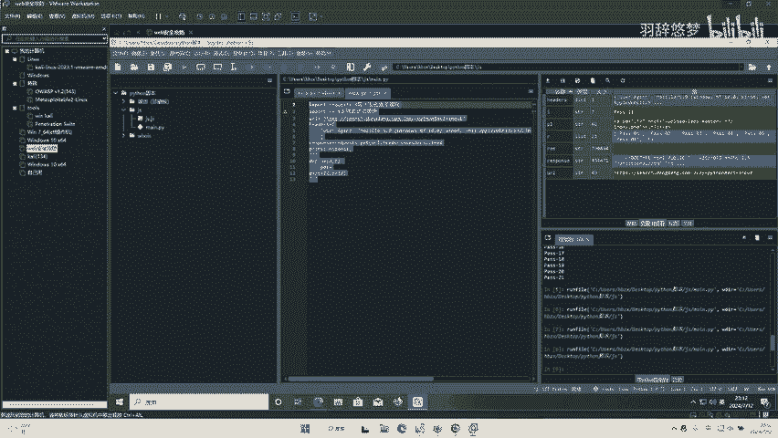

再讲一再讲两个吧，再讲两个实例。仲要钓到咧。如果我想爬登录进去的界面，那我需要加上。嗯。如果我想把登录进区的这两个一个页面，那我需要。在发送请球的时候，加上它的cookie。这个没什么好想，都知道的。

之之前都讲过之前讲外表的时候都讲过。但是我现在想用账号密码来登录，然后可以看一下，我随便输入一个账号密码登录然发布需求的请求包。链接是它，然后是pos请求，看一下再合，再合就是你发送过去的请求吗？

这个这个这个都知道，但是它是的什么，我们看匀素里面有没有它。我们可以也可以试着去搜一下。可以看到。当我。去搜索的时候，这里有了，我点击一下，点击之后可以看到这里加黄色的了。所以这个cotop在哪里？

就在这里，而这里指的就是云代码。你也可以看一下这里嘛是个WW老眼镜PRP啊，我现在的页面正好是老眼镜PRP，然后元素这里对应的也就是这个页面码。然后我们找一下那个 talk。可以看到。

这边就是我们的ta恨taken。所以我们要带上我们的top加上账号密码，然后我们就可以使用账号密码登录了，怎么去做？

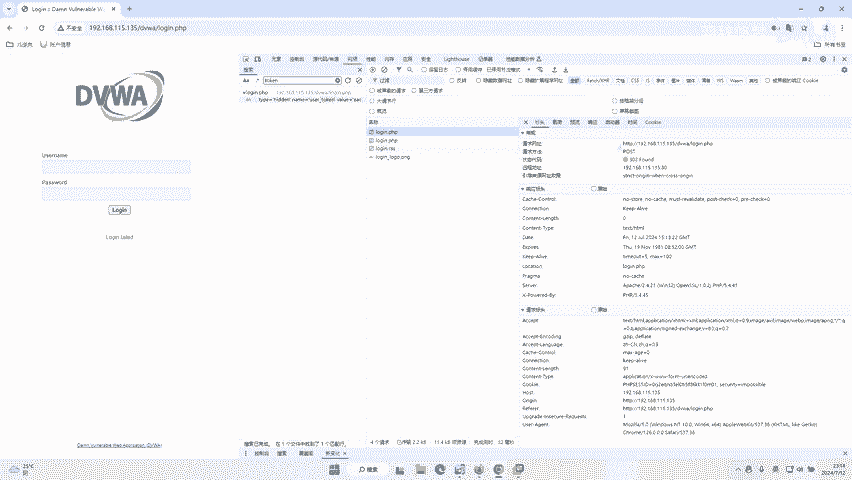

这边首先链接拿过来。From。BS4使用BS4模块，它也是他这个做几些网站有哪一个模块？是。嗯。并接等于他。设明。因为我是要登录进去。

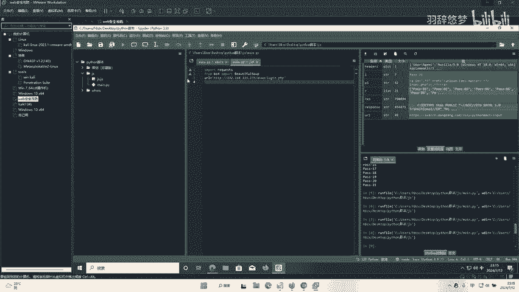

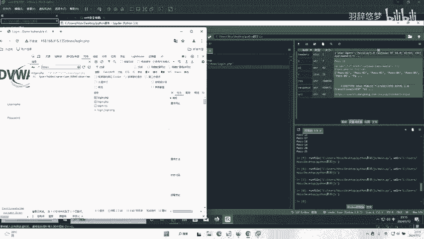

而，每次你们可以自己试一下，每次的是这个toppen都是会发生变化的。所以我也需要保持绘画。

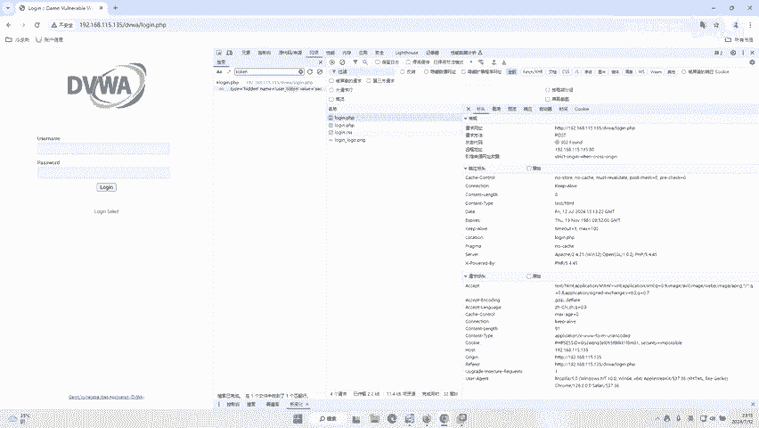

保石画绘绘画游泳到s0。QUESSS点SESSLON30。用于保持绘画。然后后面的时候我们就是SESSLN点post。然后这边放上我们的链接。然后HEAES。等于HEIDES固定的请求头。

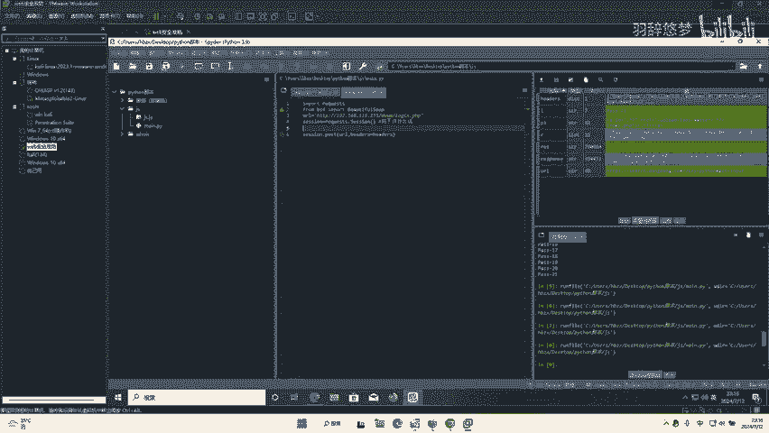

7。说明我们可以直接复制我们的bebe。打开我们的爬虫工具库。直接呀转。

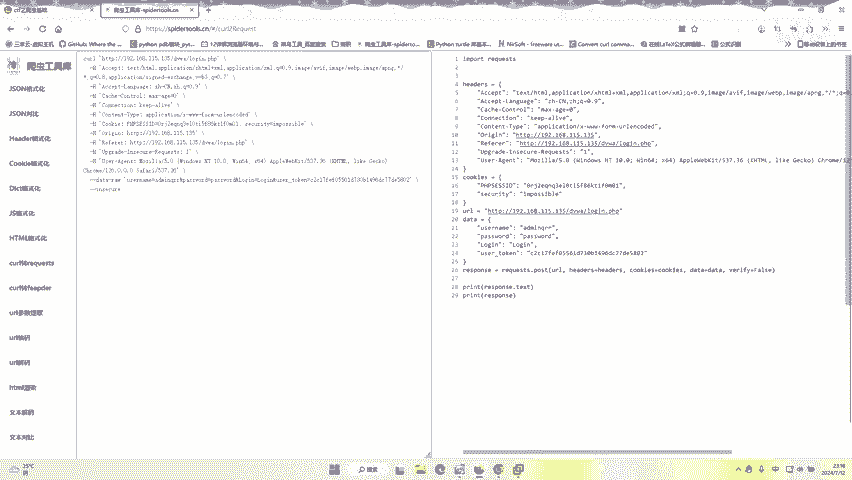

嗯。直接把它拿过来。然后datter等于data。然后待er等于还空着。发动进求之后，电击ELC拿入去来嘛。这里嗯。他也是个字典。

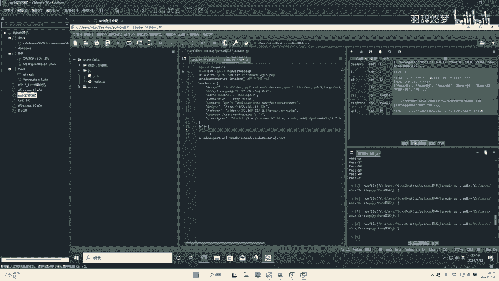

资给里发的就是这个这些东西。

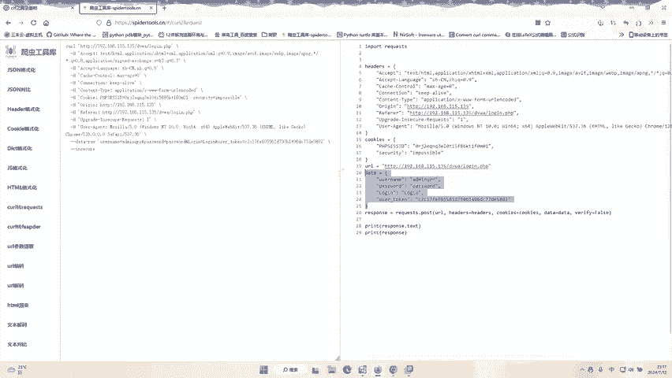

这另丽方的是你的账号。账号写在上面。等于然后你的密码。总结金奖励一堆乱么。嗯。这里需要写个下面的。首先我要向对方。发送一次请求。因为我们要找这个talk嘛，所以我们需要先向对方发送一次请求。

然后拿到对方的云代码之后取这个ta。所以SESSLN点再号。然后UL等于AD加S等于A。H选11USS，然后点击S7。拿到的结果嗯。QQOK发拿拿到了源代码放在TOK里面。嗯。

然后去对TOK进行个初始化操作BEIU嗯。逗号，然后固定的格式。好号。对他进行一个初始化操作。

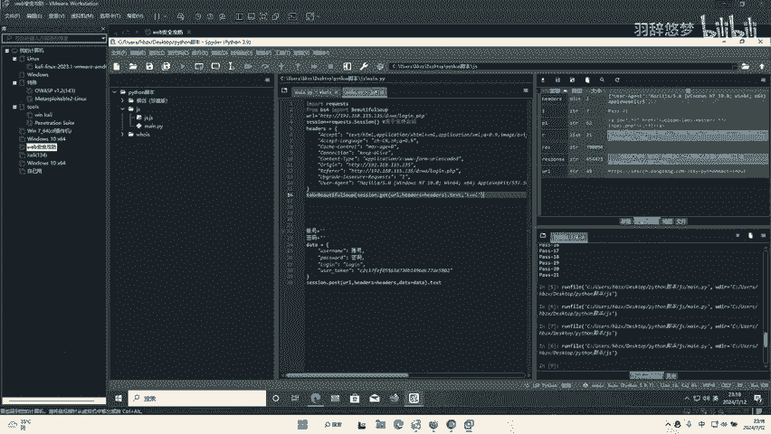

然后点。看这个掏是在哪里。ta是在名字为topken的这里。

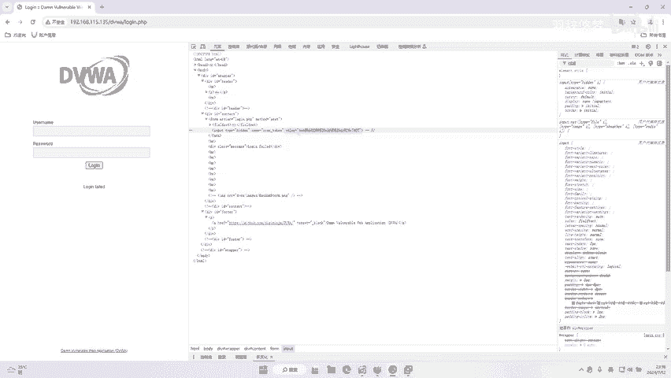

那我就把它复制一下。放这里。Bder。因为它只有一个成本，所以我们直接用FIND就可以了。然后是。等于逃ken绿色逃ken，就是把它复制一下。结果放在Q看里面。结果放在秋开里。然后输出球开。

强料站里注食点注视点。没有基础的没有pa断基础的其实的话，就是觉得会会比较难运行。那嗯。我尝试下。挺啊，这边是正常的，然后。n么等于是他的。不行的话，也可以用它嘛，也可以用另个。也可以用LTDRS。

然后它是一个字典。纽号。马后。这个name就是。

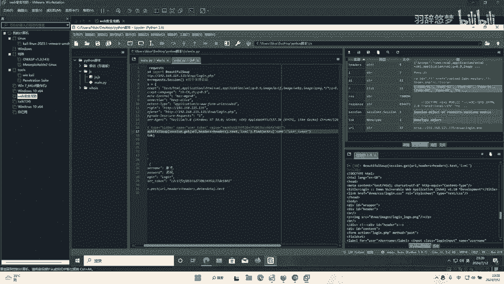

就是这个name。就是。你往夜场的这个name。这明显。五效语法。AIME。好久没用了。我直接让JPTOK了，不然好久没用了。

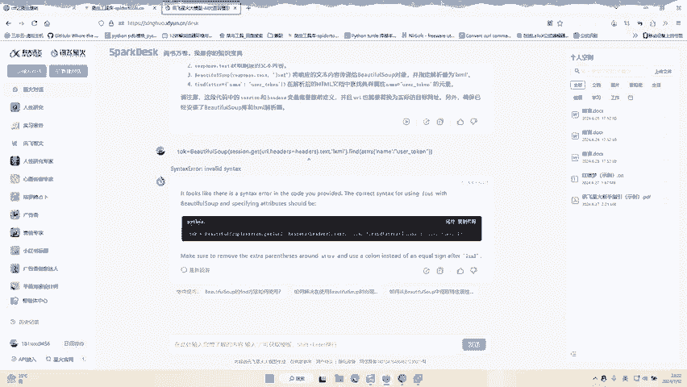

PS4模块使用。不行的话，我就分开写分开写。SOUB等于。敲开。OK。就是说初始化操作嘛。这边点T atT。到这一步的时候，他已经拿到云代码了。拿到云代码之后，对云代码进行一个初始化操作。QOK。

然后点X。点这个东西是固定的写法，然后。R一等于SOUP。放了查找。IGDS。啊，这里等一会稍微等一会。然后输出我们的R一。运行。可以看到成功的拿到我们这里，然后。中括号Y6。运行。

可以看到这个时候我们就拿到我们的掏坑了。我把它组合一下吧。我把它组合一下。是。敲K。这种性。成功拿到我们的淘客，拿到淘客之后。拿到他们之后。这边。这边你就可以使用它了。啊，这个掏控我们刚才已经拿到了。

换成我们的掏控变量。秋太军。然后就是。使用poss方式去发送请求，为什么使用pos？因为你账号密码的话，暂时pos的，而且刚才那个链接是pos，然后helus在等于helus。

这边就是我们的helus嘛。dta你的账号，你的密码还有你的to，然后给你的结果放在RES里。账号是addme密码，他说的。你行。然后。把我们的RES变量去看呀。不止。

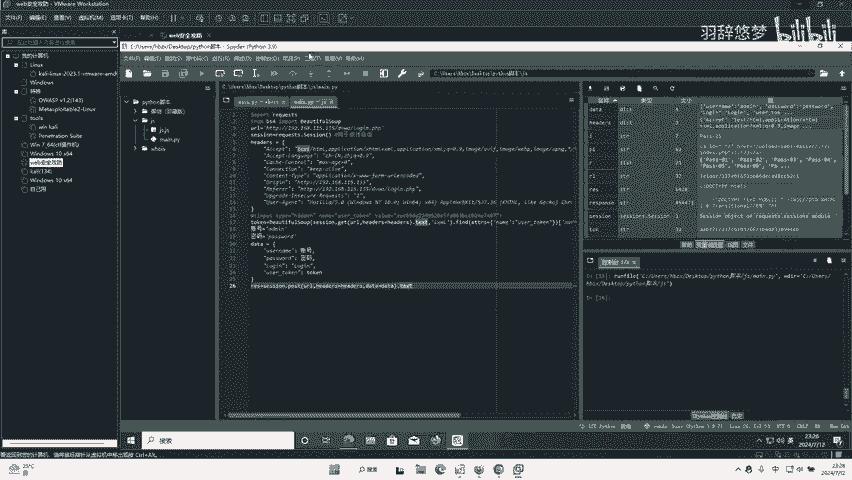

今天保存。创音。

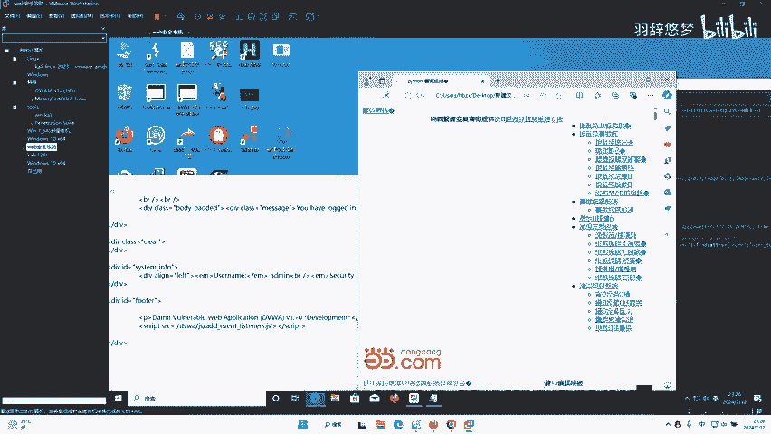

可以看到，这个就是我们使用账号密码进入了登某号的页面。然后这个就是我们的session的一个使用方法，还有PS4模块。这里再讲一下这个。就说查找吗？找找什么找你的name属先。值为有色讨分的。

如果值这里。只有一个，那就用finnder，如果有多个，那就加上杠哦。因为这里有不仅只有一个。如如果要是有多话，我们也可以用翻的。但是的话他只能找第一个，这个也就是。

嗯，三线的用法还是BS4。然后那个OKB码的话。之情说了，大家用代码去写下。所以大家也可以用代码去试着能不能把它做出来。如果实在不行的话，那我就就自动化测试的方法。嗯，教大家用自动化测试的方法去。

写示这个代码。先下课。

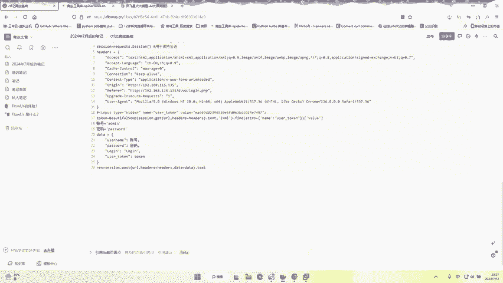